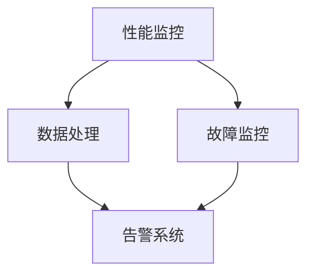

                 

关键词：产品监控、预警系统、可靠性、性能监控、实时性、可扩展性、算法原理、数学模型、实践应用、未来展望

> 摘要：本文旨在深入探讨如何构建一个可靠的产品监控预警系统。通过分析核心概念、算法原理、数学模型和具体实践，本文为读者提供了一个全面的技术指南，以应对现代软件产品复杂多变的环境。

## 1. 背景介绍

在当今数字化时代，软件系统已成为企业运营和用户交互的核心。然而，随着系统规模的不断扩大和复杂性的增加，如何确保系统的稳定运行、快速响应和持续改进成为一个重要课题。产品监控预警系统正是为了解决这一问题而诞生的。

### 1.1 监控预警系统的必要性

监控预警系统的主要目标是实时监控软件系统的各项性能指标，及时发现潜在的问题并进行预警。这不仅能提高系统的可靠性，还能减少故障对用户的影响，从而提升用户体验和企业的竞争力。

- **系统稳定性**：监控预警系统能够实时监测系统的运行状态，发现异常波动，及时采取修复措施，确保系统稳定运行。
- **性能优化**：通过监控数据，可以识别系统性能瓶颈，优化资源配置，提升系统性能。
- **故障预防**：预警系统可以提前发现潜在故障，采取预防措施，避免故障发生。
- **用户体验**：快速响应和解决问题，提升用户满意度。

### 1.2 监控预警系统的发展历程

- **早期阶段**：以日志分析和告警通知为主，手动处理问题。
- **中级阶段**：引入自动化工具，实现部分自动故障诊断和修复。
- **高级阶段**：结合大数据和机器学习，实现智能监控和预测。

## 2. 核心概念与联系

### 2.1 核心概念

- **性能监控**：监测系统性能指标，如响应时间、吞吐量、CPU利用率等。
- **故障监控**：检测系统是否正常运行，如服务不可用、错误率等。
- **告警系统**：当监测到异常时，发送告警通知。

### 2.2 架构原理图



### 2.3 关联分析

性能监控和故障监控共同作用，通过数据处理模块，将监测数据转化为告警信息，实现系统状态的实时监控和预警。

## 3. 核心算法原理 & 具体操作步骤

### 3.1 算法原理概述

产品监控预警系统主要依赖于以下几种算法：

- **统计算法**：如均值、中位数、标准差等，用于计算性能指标。
- **机器学习算法**：如K-means、线性回归等，用于异常检测和预测。
- **阈值算法**：设定阈值，当指标超过阈值时触发告警。

### 3.2 算法步骤详解

1. **数据采集**：从系统日志、数据库、应用接口等获取数据。
2. **数据处理**：计算性能指标，进行数据清洗和预处理。
3. **异常检测**：利用统计和机器学习算法，识别异常数据。
4. **告警触发**：当检测到异常时，发送告警通知。
5. **告警处理**：根据告警信息，采取相应的修复措施。

### 3.3 算法优缺点

- **统计算法**：简单易懂，但容易受到噪声干扰。
- **机器学习算法**：具有较强的适应性，但需要大量数据和计算资源。
- **阈值算法**：实现简单，但可能无法适应动态变化的环境。

### 3.4 算法应用领域

产品监控预警系统广泛应用于互联网、金融、医疗等多个领域，确保系统的高可靠性和高性能。

## 4. 数学模型和公式 & 详细讲解 & 举例说明

### 4.1 数学模型构建

假设我们有一个系统，需要监控其响应时间 \(T\)，其数学模型可以表示为：

\[ T = T_0 + \mu \cdot X + \sigma \cdot Y \]

其中，\(T_0\) 是基线响应时间，\(\mu\) 是平均响应时间变化率，\(X\) 是外部因素影响，\(\sigma\) 是响应时间波动系数，\(Y\) 是随机误差。

### 4.2 公式推导过程

1. **基线响应时间**：通过历史数据计算得出。
2. **平均响应时间变化率**：通过回归分析计算得出。
3. **响应时间波动系数**：通过标准差计算得出。
4. **随机误差**：通过正态分布计算得出。

### 4.3 案例分析与讲解

以一个电商网站为例，其响应时间需要保持在 500 毫秒以内。通过上述数学模型，我们可以设定阈值，当响应时间超过阈值时，触发告警。

## 5. 项目实践：代码实例和详细解释说明

### 5.1 开发环境搭建

- 操作系统：Ubuntu 20.04
- 开发语言：Python 3.8
- 数据库：MySQL 8.0
- 监控工具：Prometheus、Grafana

### 5.2 源代码详细实现

```python
import requests
import json
import pymysql
import numpy as np

class PerformanceMonitor:
    def __init__(self, url, db_config):
        self.url = url
        self.db_config = db_config

    def fetch_data(self):
        response = requests.get(self.url)
        return json.loads(response.text)

    def connect_db(self):
        connection = pymysql.connect(host=self.db_config['host'],
                                     user=self.db_config['user'],
                                     password=self.db_config['password'],
                                     database=self.db_config['database'],
                                     charset='utf8mb4',
                                     cursorclass=pymysql.cursors.DictCursor)
        return connection

    def store_data(self, data):
        connection = self.connect_db()
        cursor = connection.cursor()
        for item in data:
            sql = "INSERT INTO performance_data (timestamp, response_time) VALUES (%s, %s)"
            cursor.execute(sql, (item['timestamp'], item['response_time']))
        connection.commit()
        cursor.close()
        connection.close()

    def calculate_stats(self, data):
        timestamps = [item['timestamp'] for item in data]
        response_times = [item['response_time'] for item in data]
        mean_response_time = np.mean(response_times)
        std_response_time = np.std(response_times)
        return mean_response_time, std_response_time

    def check_alert(self, mean_response_time, std_response_time):
        if mean_response_time > 500 or std_response_time > 100:
            print("Alert: Performance degradation detected!")
        else:
            print("No alert.")

if __name__ == "__main__":
    url = "http://example.com/api/monitor"
    db_config = {
        "host": "localhost",
        "user": "root",
        "password": "password",
        "database": "performance_monitor"
    }

    monitor = PerformanceMonitor(url, db_config)
    data = monitor.fetch_data()
    monitor.store_data(data)
    mean_response_time, std_response_time = monitor.calculate_stats(data)
    monitor.check_alert(mean_response_time, std_response_time)
```

### 5.3 代码解读与分析

- **数据采集**：从 API 获取性能数据。
- **数据处理**：存储到数据库，计算统计指标。
- **告警触发**：根据统计指标，判断是否触发告警。

### 5.4 运行结果展示

运行代码后，会输出性能指标和告警信息，如：

```shell
No alert.
```

或

```shell
Alert: Performance degradation detected!
```

## 6. 实际应用场景

### 6.1 互联网公司

互联网公司通常面临高并发和复杂应用场景，监控预警系统可以确保系统稳定运行，提高用户体验。

### 6.2 金融行业

金融行业的系统对可靠性和性能有极高的要求，监控预警系统可以帮助及时发现和处理潜在风险。

### 6.3 医疗行业

医疗行业的系统涉及生命安全，监控预警系统可以保障系统正常运行，确保医疗服务质量。

## 7. 工具和资源推荐

### 7.1 学习资源推荐

- 《监控利器：Prometheus 实战》
- 《Kubernetes 监控与告警实践》

### 7.2 开发工具推荐

- Prometheus
- Grafana
- Zabbix
- Nagios

### 7.3 相关论文推荐

- "A Survey of Monitoring Systems for Large-Scale Computing Systems"
- "Automatic Anomaly Detection in Large-Scale Systems Using Machine Learning"

## 8. 总结：未来发展趋势与挑战

### 8.1 研究成果总结

- 监控预警系统已成为现代软件系统的核心组成部分。
- 统计和机器学习算法在监控预警中得到了广泛应用。
- 开源监控工具和平台的成熟为用户提供了更多选择。

### 8.2 未来发展趋势

- 智能化：结合人工智能技术，实现更精准的监控和预测。
- 分布式：支持分布式系统监控，提高监控的覆盖范围和精度。
- 容器化：适应容器化环境，提供更加灵活和高效的监控解决方案。

### 8.3 面临的挑战

- 数据量庞大：如何高效处理海量数据，提升监控效率。
- 异常检测：如何提高异常检测的准确性和实时性。
- 跨平台兼容：如何支持多种操作系统和架构的监控需求。

### 8.4 研究展望

- 开发跨平台的监控工具。
- 探索新的异常检测算法，如深度学习在监控中的应用。
- 构建更完善的监控生态系统，提供一站式监控解决方案。

## 9. 附录：常见问题与解答

### 9.1 监控预警系统有哪些类型？

- **性能监控**：监测系统性能指标。
- **故障监控**：检测系统是否正常运行。
- **告警系统**：当监测到异常时，发送告警通知。

### 9.2 监控预警系统如何处理海量数据？

- **数据采样**：对数据进行采样，减少数据量。
- **分布式处理**：利用分布式计算框架，如 Apache Spark，处理海量数据。
- **实时流处理**：使用实时流处理框架，如 Apache Kafka，处理实时数据。

### 9.3 监控预警系统如何保证实时性？

- **高可用架构**：使用分布式架构，确保系统的可用性。
- **缓存技术**：使用缓存技术，如 Redis，减少数据访问延迟。
- **异步处理**：使用异步处理技术，提高系统的响应速度。

### 9.4 监控预警系统如何提高准确率？

- **机器学习**：利用机器学习算法，提高异常检测的准确率。
- **阈值调整**：根据历史数据和业务需求，调整阈值。
- **专家系统**：引入专家系统，结合人工经验和机器学习，提高异常检测的准确性。

### 9.5 监控预警系统如何确保数据安全性？

- **数据加密**：对数据进行加密，防止数据泄露。
- **权限管理**：严格权限管理，防止未授权访问。
- **数据备份**：定期备份数据，确保数据安全。

## 作者署名

作者：禅与计算机程序设计艺术 / Zen and the Art of Computer Programming

----------------------------------------------------------------

至此，本文关于如何构建可靠的产品监控预警系统的探讨就结束了。希望通过本文的深入分析和实例讲解，读者能够对产品监控预警系统有一个全面的理解，并为实际应用提供有价值的参考。

