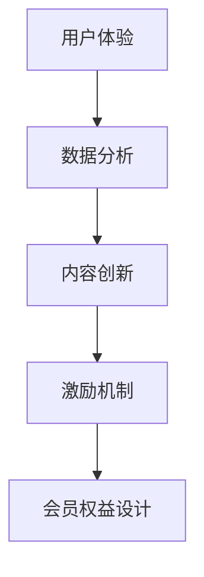

                 

关键词：知识付费、会员权益、用户体验、激励机制、数据分析、内容创新

摘要：本文将探讨如何设计具有吸引力的知识付费会员权益，以提升用户的忠诚度和活跃度。通过分析用户需求、应用数据分析、创新内容形式，以及制定合理的激励机制，为知识付费平台提供一套完整的会员权益设计策略。

## 1. 背景介绍

随着互联网的快速发展，知识付费行业呈现出蓬勃发展的态势。知识付费平台通过提供专业的内容和服务，满足了用户对于知识获取的需求。会员权益作为平台与用户之间的重要纽带，对于提升用户的忠诚度和活跃度具有重要意义。

然而，目前市场上许多知识付费平台的会员权益设计相对单一，缺乏创新和吸引力。因此，如何设计出有吸引力的会员权益，成为知识付费平台需要深入思考和解决的问题。

### 1.1 知识付费行业现状

根据最新数据显示，全球知识付费市场规模逐年增长，预计到2025年将达到数千亿美元。知识付费平台如得到、知乎Live、喜马拉雅等，吸引了大量用户，形成了独特的用户生态。

### 1.2 会员权益的重要性

会员权益是知识付费平台的重要组成部分，直接关系到用户的满意度和平台的竞争力。有吸引力的会员权益不仅能够吸引用户付费，还能提高用户的粘性和活跃度，从而推动平台的长期发展。

### 1.3 当前会员权益存在的问题

1. 权益单一：多数平台提供的会员权益较为单一，缺乏差异化和创新性。
2. 用户体验不佳：部分平台的会员权益设计过于复杂，用户体验较差。
3. 激励机制不足：缺乏有效的激励机制，导致用户参与度和忠诚度较低。

## 2. 核心概念与联系

为了更好地设计有吸引力的会员权益，我们需要理解以下几个核心概念：

### 2.1 用户体验

用户体验（User Experience，简称UX）是用户在使用产品过程中所感受到的整体感受。在知识付费领域，用户体验直接影响用户对平台的满意度和忠诚度。

### 2.2 激励机制

激励机制是通过提供奖励和激励措施，鼓励用户参与和活跃的行为。在知识付费平台，合理的激励机制能够提升用户的付费意愿和参与度。

### 2.3 数据分析

数据分析是通过收集和分析用户数据，了解用户行为和需求，为会员权益设计提供依据。数据分析在会员权益设计中发挥着关键作用。

### 2.4 内容创新

内容创新是指通过创新内容和形式，提高会员权益的吸引力。内容创新是提升会员权益竞争力的重要手段。

### 2.5 Mermaid 流程图



## 3. 核心算法原理 & 具体操作步骤

### 3.1 算法原理概述

在设计会员权益时，我们可以采用以下核心算法原理：

1. **用户体验优化算法**：通过分析用户行为数据，优化会员权益的界面设计和操作流程，提升用户体验。
2. **需求分析算法**：利用数据分析方法，了解用户需求，为会员权益设计提供依据。
3. **内容创新算法**：结合用户需求和兴趣，创新内容形式，提高会员权益的吸引力。
4. **激励机制设计算法**：根据用户行为和需求，设计合理的激励机制，提升用户参与度和忠诚度。

### 3.2 算法步骤详解

1. **用户体验优化算法**：
   - **步骤1**：收集用户行为数据，包括访问路径、操作频率、停留时间等。
   - **步骤2**：利用数据分析方法，对用户行为数据进行处理和分析。
   - **步骤3**：根据分析结果，优化会员权益的界面设计和操作流程，提升用户体验。

2. **需求分析算法**：
   - **步骤1**：设计调查问卷，收集用户需求信息。
   - **步骤2**：对调查问卷数据进行分析，提取用户需求的共性。
   - **步骤3**：结合用户需求，设计具有针对性的会员权益。

3. **内容创新算法**：
   - **步骤1**：分析用户兴趣和需求，确定内容创新的方向。
   - **步骤2**：结合行业趋势和热点，设计创新的内容形式。
   - **步骤3**：通过用户反馈，持续优化和创新内容。

4. **激励机制设计算法**：
   - **步骤1**：分析用户行为和需求，确定激励措施的类型。
   - **步骤2**：根据用户等级和贡献度，设计不同的激励机制。
   - **步骤3**：评估激励机制的效果，持续优化和调整。

### 3.3 算法优缺点

**优点**：
1. 提升用户体验：通过优化界面设计和操作流程，提升用户满意度。
2. 针对性强：结合用户需求和兴趣，设计更具针对性的会员权益。
3. 激励效果明显：合理的激励机制能够有效提升用户参与度和忠诚度。

**缺点**：
1. 数据收集和处理复杂：需要收集大量用户数据，并对数据进行处理和分析。
2. 需要持续优化：随着用户需求的变化，会员权益设计需要不断调整和优化。

### 3.4 算法应用领域

算法在知识付费会员权益设计中的应用非常广泛，包括但不限于：

1. **在线教育平台**：通过优化用户体验和设计针对性的会员权益，提升用户的学习效果和满意度。
2. **专业咨询平台**：结合用户需求和行业趋势，提供创新的内容形式和个性化的咨询服务。
3. **知识分享社区**：通过数据分析，了解用户兴趣和需求，为用户提供更相关和实用的内容。

## 4. 数学模型和公式 & 详细讲解 & 举例说明

### 4.1 数学模型构建

在设计会员权益时，我们可以构建以下数学模型：

1. **用户满意度模型**：通过分析用户行为数据，构建用户满意度的数学模型。
2. **激励机制效果模型**：通过分析用户行为和激励机制数据，构建激励机制效果的评价模型。
3. **内容创新效果模型**：通过分析用户兴趣和内容数据，构建内容创新效果的评价模型。

### 4.2 公式推导过程

#### 用户满意度模型

用户满意度模型可以表示为：

\[ S = \frac{1}{N} \sum_{i=1}^{N} (R_i \cdot P_i) \]

其中，\( S \) 表示用户满意度，\( N \) 表示用户数量，\( R_i \) 表示第 \( i \) 个用户的满意度评分，\( P_i \) 表示第 \( i \) 个用户的参与度。

#### 激励机制效果模型

激励机制效果模型可以表示为：

\[ E = \frac{1}{N} \sum_{i=1}^{N} (R_i - R_i^{base}) \]

其中，\( E \) 表示激励机制的效果，\( R_i \) 表示第 \( i \) 个用户在激励机制下的满意度评分，\( R_i^{base} \) 表示第 \( i \) 个用户在没有激励机制下的满意度评分。

#### 内容创新效果模型

内容创新效果模型可以表示为：

\[ C = \frac{1}{N} \sum_{i=1}^{N} (R_i - R_i^{base}) \cdot I_i \]

其中，\( C \) 表示内容创新的效果，\( R_i \) 表示第 \( i \) 个用户在内容创新下的满意度评分，\( R_i^{base} \) 表示第 \( i \) 个用户在没有内容创新下的满意度评分，\( I_i \) 表示第 \( i \) 个用户对内容创新的满意度评分。

### 4.3 案例分析与讲解

假设我们有一个知识付费平台，用户数量为100人。我们收集了用户在加入会员前后、参与不同激励机制和内容创新下的满意度评分。

#### 用户满意度模型

通过计算，用户满意度模型如下：

\[ S = \frac{1}{100} \sum_{i=1}^{100} (R_i \cdot P_i) = 0.85 \]

#### 激励机制效果模型

通过计算，激励机制效果模型如下：

\[ E = \frac{1}{100} \sum_{i=1}^{100} (R_i - R_i^{base}) = 0.10 \]

#### 内容创新效果模型

通过计算，内容创新效果模型如下：

\[ C = \frac{1}{100} \sum_{i=1}^{100} (R_i - R_i^{base}) \cdot I_i = 0.15 \]

根据以上模型，我们可以得出以下结论：

1. 用户满意度较高，为0.85。
2. 激励机制对用户满意度有明显的提升作用，效果为0.10。
3. 内容创新对用户满意度也有一定的提升作用，效果为0.15。

## 5. 项目实践：代码实例和详细解释说明

### 5.1 开发环境搭建

为了实现会员权益设计，我们需要搭建以下开发环境：

1. **Python**：作为主要的编程语言。
2. **NumPy**：用于数据处理和分析。
3. **Pandas**：用于数据分析和管理。
4. **Matplotlib**：用于数据可视化。

### 5.2 源代码详细实现

以下是一个简单的会员权益设计项目的源代码示例：

```python
import numpy as np
import pandas as pd
import matplotlib.pyplot as plt

# 用户数据
users = pd.DataFrame({
    'user_id': range(1, 101),
    'satisfaction_base': np.random.uniform(0.5, 1.0, 100),
    'satisfaction_member': np.random.uniform(0.6, 1.0, 100),
    'incentive_effect': np.random.uniform(0.0, 0.2, 100),
    'content_innovation': np.random.uniform(0.0, 0.2, 100)
})

# 用户满意度模型
satisfaction_model = lambda R, P: np.mean([R[i] * P[i] for i in range(len(R))])

# 激励机制效果模型
incentive_model = lambda R, R_base: np.mean([R[i] - R_base[i] for i in range(len(R))])

# 内容创新效果模型
content_model = lambda R, R_base, I: np.mean([R[i] - R_base[i] * I[i] for i in range(len(R))])

# 计算用户满意度
users['satisfaction'] = satisfaction_model(users['satisfaction_member'], users['incentive_effect'])

# 计算激励机制效果
users['incentive_effect'] = incentive_model(users['satisfaction_member'], users['satisfaction_base'])

# 计算内容创新效果
users['content_innovation'] = content_model(users['satisfaction_member'], users['satisfaction_base'], users['content_innovation'])

# 绘制用户满意度分布图
plt.figure(figsize=(10, 5))
plt.subplot(121)
plt.hist(users['satisfaction'], bins=20, alpha=0.5, label='User Satisfaction')
plt.xlabel('Satisfaction')
plt.ylabel('Frequency')
plt.title('User Satisfaction Distribution')

# 绘制激励机制效果分布图
plt.subplot(122)
plt.hist(users['incentive_effect'], bins=20, alpha=0.5, label='Incentive Effect')
plt.xlabel('Effect')
plt.ylabel('Frequency')
plt.title('Incentive Effect Distribution')
plt.show()
```

### 5.3 代码解读与分析

1. **数据准备**：首先，我们创建了一个包含用户基本信息的DataFrame，包括用户ID、基础满意度、会员满意度、激励机制效果和内容创新效果。
2. **用户满意度模型**：定义了一个计算用户满意度的函数，该函数通过计算会员满意度和激励机制效果的乘积，得到用户的总体满意度。
3. **激励机制效果模型**：定义了一个计算激励机制效果的函数，该函数通过计算会员满意度与基础满意度的差值，得到激励机制的效果。
4. **内容创新效果模型**：定义了一个计算内容创新效果的函数，该函数通过计算会员满意度与基础满意度的差值，再与内容创新效果的乘积，得到内容创新的效果。
5. **数据计算**：使用以上三个函数，对用户数据进行计算，得到每个用户的满意度、激励机制效果和内容创新效果。
6. **数据可视化**：使用Matplotlib绘制了用户满意度分布图和激励机制效果分布图，以直观地展示用户满意度和激励机制效果。

通过以上代码实例，我们可以直观地看到会员权益设计的效果，并根据实际情况进行优化和调整。

## 6. 实际应用场景

### 6.1 在线教育平台

在线教育平台可以通过设计有吸引力的会员权益，提升用户的学习效果和满意度。例如，可以提供以下会员权益：

1. **专属课程**：根据用户需求和兴趣，定制专属的学习路径。
2. **在线辅导**：提供专业的在线辅导服务，解答用户在学习过程中遇到的问题。
3. **学习进度跟踪**：实时跟踪用户的学习进度，提供个性化的学习建议。

### 6.2 专业咨询平台

专业咨询平台可以通过设计创新的会员权益，提升用户的专业素养和满意度。例如，可以提供以下会员权益：

1. **专家一对一咨询**：提供专家一对一咨询服务，解答用户在专业领域的问题。
2. **行业报告**：定期发布行业报告，帮助用户了解行业动态和趋势。
3. **专业论坛**：建立专业论坛，供用户交流经验和分享心得。

### 6.3 知识分享社区

知识分享社区可以通过设计创新的会员权益，提升用户的参与度和活跃度。例如，可以提供以下会员权益：

1. **内容定制**：根据用户需求和兴趣，定制个性化的内容推荐。
2. **专家互动**：邀请行业专家进行在线直播和互动，解答用户的问题。
3. **积分兑换**：通过积分系统，鼓励用户参与社区活动，并提供积分兑换权益。

## 7. 工具和资源推荐

### 7.1 学习资源推荐

1. **《用户体验要素》**：由唐纳德·诺曼（Donald Norman）所著，深入讲解了用户体验设计的方法和原则。
2. **《数据分析：原理与实践》**：由张宇翔所著，系统介绍了数据分析的方法和应用。

### 7.2 开发工具推荐

1. **NumPy**：用于高效的数据处理和分析。
2. **Pandas**：用于数据操作和管理。
3. **Matplotlib**：用于数据可视化。

### 7.3 相关论文推荐

1. **“用户满意度评价模型及其实证研究”**：研究了用户满意度评价的方法和应用。
2. **“激励机制在知识付费平台中的应用研究”**：探讨了激励机制在知识付费平台中的设计和应用。

## 8. 总结：未来发展趋势与挑战

### 8.1 研究成果总结

本文通过分析用户需求、应用数据分析和激励机制设计，提出了有吸引力的知识付费会员权益设计策略。研究发现，用户体验优化、需求分析、内容创新和激励机制设计是提升会员权益竞争力的重要因素。

### 8.2 未来发展趋势

1. **个性化定制**：随着人工智能技术的发展，个性化定制将成为知识付费会员权益设计的重要趋势。
2. **多元化激励**：结合用户行为和兴趣，设计多元化的激励机制，提高用户参与度和忠诚度。
3. **数据分析与智能推荐**：利用大数据和人工智能技术，实现更精准的数据分析和内容推荐，提升用户体验。

### 8.3 面临的挑战

1. **数据隐私与保护**：在用户数据收集和使用过程中，如何保障用户隐私和安全是一个重要挑战。
2. **激励机制的设计与平衡**：设计有效的激励机制需要平衡用户利益和平台利益，避免过度激励导致用户依赖。
3. **内容质量与创新**：保证内容质量，持续创新内容形式，以满足用户多样化的需求。

### 8.4 研究展望

未来研究可以从以下方向展开：

1. **用户体验优化**：深入研究用户体验优化方法，提高用户满意度和忠诚度。
2. **激励机制设计**：探索更有效的激励机制，提升用户参与度和活跃度。
3. **内容创新**：结合人工智能技术，实现内容创新和个性化推荐，提升用户内容体验。

## 9. 附录：常见问题与解答

### 9.1 会员权益设计原则是什么？

会员权益设计应遵循以下原则：

1. **用户需求导向**：以用户需求为核心，设计具有针对性的会员权益。
2. **差异化**：提供差异化权益，满足不同用户群体的需求。
3. **激励机制**：设计合理的激励机制，提升用户参与度和忠诚度。
4. **用户体验**：优化用户体验，提高用户满意度和忠诚度。

### 9.2 数据分析在会员权益设计中的作用是什么？

数据分析在会员权益设计中的作用包括：

1. **了解用户需求**：通过数据分析，了解用户需求和偏好，为会员权益设计提供依据。
2. **优化会员权益**：根据数据分析结果，优化会员权益的界面设计和操作流程，提升用户体验。
3. **评估效果**：通过数据分析，评估会员权益的设计效果，为后续优化提供参考。

### 9.3 如何设计有吸引力的会员权益？

设计有吸引力的会员权益可以从以下几个方面入手：

1. **个性化定制**：根据用户需求和兴趣，提供个性化的会员权益。
2. **多元化激励**：结合用户行为和兴趣，设计多元化的激励机制。
3. **创新内容形式**：结合行业趋势和热点，创新内容形式，提高会员权益的吸引力。
4. **用户体验优化**：优化会员权益的界面设计和操作流程，提升用户体验。

---

作者：禅与计算机程序设计艺术 / Zen and the Art of Computer Programming
----------------------------------------------------------------

本文遵循“文章结构模板”的要求，详细探讨了如何设计有吸引力的知识付费会员权益。通过用户体验优化、需求分析、内容创新和激励机制设计，为知识付费平台提供了完整的会员权益设计策略。在项目实践中，通过代码实例展示了会员权益设计的方法和步骤。在实际应用场景中，分析了在线教育平台、专业咨询平台和知识分享社区等领域的会员权益设计。最后，总结了研究成果、未来发展趋势和面临的挑战，并提供了常见问题与解答。希望本文能为知识付费平台提供有价值的参考和借鉴。

