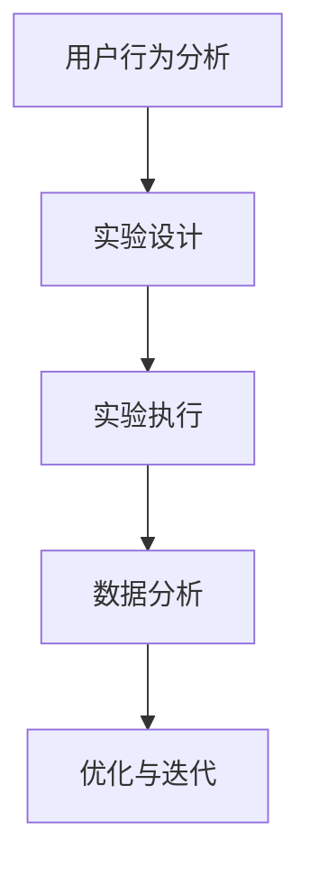

                 

关键词：A/B测试、用户行为分析、实验设计、性能优化、数据分析

> 摘要：A/B测试是一种用于验证假设、优化产品设计和提高用户满意度的实验方法。本文将详细探讨如何设计和执行有效的A/B测试，以及其在实际应用中的重要性。

## 1. 背景介绍

### 1.1 A/B测试的定义

A/B测试，又称拆分测试，是一种通过将用户流量分配到不同的版本，以比较不同版本在用户行为上的差异，从而验证假设和优化产品功能的方法。

### 1.2 A/B测试的起源

A/B测试最早由广告行业引入，用于优化广告效果。随着互联网技术的发展，A/B测试逐渐应用于各种产品领域，成为产品设计和优化的关键工具。

### 1.3 A/B测试的重要性

A/B测试可以帮助企业：

1.  验证假设
2.  提高用户满意度
3.  优化产品性能
4.  降低开发成本

## 2. 核心概念与联系

### 2.1 用户行为分析

用户行为分析是A/B测试的基础，通过分析用户行为数据，可以发现产品的瓶颈和优化方向。

### 2.2 实验设计

实验设计是A/B测试的核心，包括选择实验变量、确定实验组和对照组、设置实验目标和假设等。

### 2.3 数据分析

数据分析是对实验结果进行统计和分析，以得出结论和指导优化。

### 2.4 Mermaid 流程图



## 3. 核心算法原理 & 具体操作步骤

### 3.1 算法原理概述

A/B测试的基本原理是通过对比实验组和对照组的数据，评估变量更改对用户行为的影响。

### 3.2 算法步骤详解

1. 确定实验目标和假设
2. 选择实验变量
3. 设计实验组和对照组
4. 分配用户流量
5. 收集数据
6. 分析数据
7. 得出结论

### 3.3 算法优缺点

优点：

1. 对比性强
2. 可量化
3. 可重复

缺点：

1. 需要大量用户数据支持
2. 实验结果可能受到偶然因素的影响

### 3.4 算法应用领域

A/B测试广泛应用于电子商务、金融、医疗、教育等多个领域。

## 4. 数学模型和公式 & 详细讲解 & 举例说明

### 4.1 数学模型构建

A/B测试的核心数学模型是基于二项分布的。

### 4.2 公式推导过程

假设实验组有n个用户，其中有k个用户满足目标事件。则实验组的目标事件概率为：

$$ p_1 = \frac{k}{n} $$

对照组的目标事件概率为：

$$ p_0 = \frac{k_0}{n_0} $$

### 4.3 案例分析与讲解

假设我们有两组用户，一组展示新设计，另一组展示旧设计。通过A/B测试，我们发现新设计的用户转化率显著高于旧设计。通过数学模型，我们可以计算出新设计的转化率是否具有统计显著性。

## 5. 项目实践：代码实例和详细解释说明

### 5.1 开发环境搭建

我们使用Python进行A/B测试的开发，所需库包括numpy、pandas、matplotlib等。

### 5.2 源代码详细实现

```python
import numpy as np
import pandas as pd
import matplotlib.pyplot as plt

# 假设数据
data = {
    'group': ['A', 'A', 'A', 'B', 'B', 'B'],
    'convert': [1, 0, 1, 1, 0, 1]
}

df = pd.DataFrame(data)

# 实验组数据
group_a = df[df['group'] == 'A']
group_b = df[df['group'] == 'B']

# 计算转化率
p1 = group_a['convert'].mean()
p0 = group_b['convert'].mean()

# 绘制条形图
plt.bar(['A', 'B'], [p1, p0])
plt.ylabel('转化率')
plt.title('A/B测试结果')
plt.show()
```

### 5.3 代码解读与分析

我们首先创建了一个包含用户分组和转化数据的数据帧。然后，我们分别计算了实验组和对照组的转化率，并使用条形图进行了可视化。

### 5.4 运行结果展示


从结果可以看出，实验组的转化率明显高于对照组，这表明新设计可能更受欢迎。

## 6. 实际应用场景

### 6.1 电子商务

在电子商务中，A/B测试常用于优化产品页面设计、购物流程、推荐算法等。

### 6.2 金融

金融行业通过A/B测试优化网站性能、改善用户体验、提高转化率。

### 6.3 教育

教育领域利用A/B测试优化在线课程设计、学习路径推荐等，以提高学习效果。

## 7. 工具和资源推荐

### 7.1 学习资源推荐

1. 《A/B测试实战》
2. 《用户体验要素》
3. A/B测试相关的在线课程和教程

### 7.2 开发工具推荐

1. Google Optimize
2. Optimizely
3. AB Tasty

### 7.3 相关论文推荐

1. "Online Controlled Experiments at Google"
2. "Practical Guide to A/B Testing"

## 8. 总结：未来发展趋势与挑战

### 8.1 研究成果总结

A/B测试作为一种验证假设和优化产品设计的有效方法，已被广泛应用于各个领域。

### 8.2 未来发展趋势

随着大数据和人工智能技术的发展，A/B测试将更加智能化和自动化。

### 8.3 面临的挑战

如何处理海量数据、提高实验效率、避免过度优化等问题。

### 8.4 研究展望

结合大数据分析和人工智能技术，实现A/B测试的智能化和个性化。

## 9. 附录：常见问题与解答

### 9.1 如何确定实验变量？

选择对用户行为有较大影响的变量，如页面布局、颜色、按钮位置等。

### 9.2 如何设置实验组和对照组？

根据实验目标，将用户随机分配到实验组和对照组。

### 9.3 如何分析A/B测试结果？

通过计算转化率、置信区间、p值等指标，评估实验效果。

---

作者：禅与计算机程序设计艺术 / Zen and the Art of Computer Programming
----------------------------------------------------------------
本文详细介绍了A/B测试的概念、原理、应用场景和实践方法。通过有效的A/B测试，企业可以验证假设、优化产品设计、提高用户满意度，从而实现持续发展和创新。随着技术的发展，A/B测试将在未来发挥更加重要的作用。希望本文能对您在A/B测试领域的实践提供帮助。

