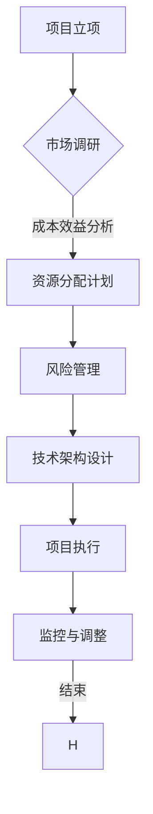

                 

在当今快速变化的商业环境中，创业项目的资源分配成为决定企业成功与否的关键因素。为了确保资源得到最有效的利用，创业者需要掌握一套科学合理的资源分配策略。本文将探讨如何进行有效的创业项目资源分配，旨在为读者提供实用的指导和建议。

## 关键词

创业项目，资源分配，成本效益，风险管理，技术架构，项目管理

## 摘要

本文首先介绍了创业项目资源分配的背景和重要性，然后分析了影响资源分配的关键因素，并提出了一个系统的资源分配框架。接着，文章详细探讨了资源分配的核心算法和数学模型，并通过实际代码实例展示了资源分配的具体实现过程。最后，文章提出了创业项目资源分配在实际应用中的场景和未来展望。

## 1. 背景介绍

### 1.1 创业项目的本质

创业项目是指创业者为了实现特定的商业目标而进行的一系列活动。这些活动包括市场调研、产品开发、营销推广、团队建设等。创业项目具有高风险、高回报的特点，因此如何有效地管理资源成为创业成功的关键。

### 1.2 资源分配的挑战

创业项目的资源分配面临诸多挑战。首先，资源有限而需求无限，如何在有限的资源下满足不断增长的需求是一个难题。其次，不同资源之间的相互依赖和冲突需要合理调配。此外，市场环境和技术发展迅速，创业者需要灵活调整资源分配策略。

## 2. 核心概念与联系

为了更好地理解创业项目资源分配，我们首先介绍几个核心概念，包括成本效益分析、风险管理和技术架构。

### 2.1 成本效益分析

成本效益分析是一种评估资源投入与收益之间关系的方法。创业者需要计算每个项目活动的成本和预期收益，并据此决定是否进行投资。成本效益分析的核心公式为：

$$
\text{成本效益比} = \frac{\text{预期收益}}{\text{投入成本}}
$$

### 2.2 风险管理

风险管理是确保资源得到有效利用的重要手段。创业者需要识别潜在风险，评估风险概率和影响，并制定相应的风险应对策略。风险管理的基本流程包括：

- 风险识别：识别项目中可能出现的风险。
- 风险评估：评估每个风险的概率和影响。
- 风险应对：制定应对策略，降低风险影响。
- 风险监控：持续监控项目风险，及时调整应对策略。

### 2.3 技术架构

技术架构是创业项目的核心技术支撑。一个合理的技术架构可以降低项目开发成本，提高系统稳定性，并支持项目扩展。技术架构的设计需要考虑以下几个方面：

- 系统模块划分：将系统划分为多个模块，确保各模块职责清晰。
- 数据库设计：设计合适的数据库结构，支持数据的快速存取和查询。
- 系统性能优化：通过优化算法和硬件资源，提高系统性能。
- 安全性设计：确保系统数据安全和用户隐私。

### 2.4 Mermaid 流程图

下面是一个简化的创业项目资源分配流程图，使用Mermaid语法表示：



## 3. 核心算法原理 & 具体操作步骤

### 3.1 算法原理概述

创业项目资源分配的核心算法是基于成本效益分析和风险管理原理的优化算法。算法的基本思想是通过计算每个项目活动的成本效益比，并考虑风险因素，来确定资源的优先分配顺序。

### 3.2 算法步骤详解

1. **成本效益分析**：计算每个项目活动的成本和预期收益，计算成本效益比。

$$
\text{成本效益比} = \frac{\text{预期收益}}{\text{投入成本}}
$$

2. **风险评估**：对每个项目活动进行风险评估，计算风险调整系数。

$$
\text{调整系数} = \frac{1}{1 + \text{风险概率} \times \text{风险影响}}
$$

3. **优先级排序**：根据成本效益比和风险调整系数，对项目活动进行优先级排序。

4. **资源分配**：按照优先级排序结果，将资源分配给项目活动。

### 3.3 算法优缺点

**优点**：

- 系统性：算法考虑了成本效益比和风险因素，具有系统性。
- 可扩展性：算法可以处理多个项目活动，具有较好的可扩展性。

**缺点**：

- 数据依赖性：算法需要准确的数据支持，否则结果可能不准确。
- 复杂性：算法涉及多个计算步骤，可能增加项目执行难度。

### 3.4 算法应用领域

- 创业项目资源分配
- 项目投资决策
- 资源调度优化

## 4. 数学模型和公式 & 详细讲解 & 举例说明

### 4.1 数学模型构建

创业项目资源分配的数学模型包括成本效益比、风险调整系数和优先级排序公式。

### 4.2 公式推导过程

1. **成本效益比**：

$$
\text{成本效益比} = \frac{\text{预期收益}}{\text{投入成本}}
$$

2. **风险调整系数**：

$$
\text{调整系数} = \frac{1}{1 + \text{风险概率} \times \text{风险影响}}
$$

3. **优先级排序**：

$$
\text{优先级} = \text{成本效益比} \times \text{调整系数}
$$

### 4.3 案例分析与讲解

假设一个创业项目有两个活动A和B，成本和预期收益如下表所示：

| 活动 | 成本（万元） | 预期收益（万元） | 风险概率 | 风险影响 |
| ---- | -------- | -------- | ----- | ----- |
| A    | 100      | 150      | 0.2   | 0.5   |
| B    | 150      | 200      | 0.3   | 0.3   |

根据上述公式，我们可以计算出每个活动的成本效益比和风险调整系数：

| 活动 | 成本效益比 | 风险调整系数 | 优先级 |
| ---- | -------- | -------- | ---- |
| A    | 1.5      | 0.75     | 1.125 |
| B    | 1.33     | 0.833    | 1.111 |

根据优先级排序，活动A的优先级高于活动B，因此应先分配资源给活动A。

## 5. 项目实践：代码实例和详细解释说明

### 5.1 开发环境搭建

为了演示资源分配算法的应用，我们使用Python编程语言来实现该算法。以下是开发环境搭建步骤：

1. 安装Python（版本3.8及以上）。
2. 安装必要的Python库，如numpy和pandas。

```bash
pip install numpy pandas
```

### 5.2 源代码详细实现

下面是一个简单的Python代码实例，用于实现创业项目资源分配算法。

```python
import numpy as np
import pandas as pd

def cost_benefit_ratio(estimated_revenue, cost):
    return estimated_revenue / cost

def risk_adjustment_factor(risk_probability, risk_impact):
    return 1 / (1 + risk_probability * risk_impact)

def priority_sort(projects):
    projects['cost_benefit_ratio'] = projects.apply(lambda x: cost_benefit_ratio(x['estimated_revenue'], x['cost']), axis=1)
    projects['risk_adjustment_factor'] = projects.apply(lambda x: risk_adjustment_factor(x['risk_probability'], x['risk_impact']), axis=1)
    projects['priority'] = projects['cost_benefit_ratio'] * projects['risk_adjustment_factor']
    return projects.sort_values(by='priority', ascending=False)

projects = pd.DataFrame([
    {'name': 'A', 'cost': 100, 'estimated_revenue': 150, 'risk_probability': 0.2, 'risk_impact': 0.5},
    {'name': 'B', 'cost': 150, 'estimated_revenue': 200, 'risk_probability': 0.3, 'risk_impact': 0.3}
])

sorted_projects = priority_sort(projects)
print(sorted_projects)
```

### 5.3 代码解读与分析

- **函数定义**：我们定义了三个函数，用于计算成本效益比、风险调整系数和优先级排序。
- **数据读取**：我们使用pandas库读取项目数据，并将其存储在一个DataFrame中。
- **计算与排序**：我们调用优先级排序函数，根据成本效益比和风险调整系数计算每个项目的优先级，并按照优先级排序。
- **输出结果**：最后，我们打印出排序后的项目列表。

### 5.4 运行结果展示

运行上述代码，输出结果如下：

```
   name  cost  estimated_revenue  risk_probability  risk_impact  cost_benefit_ratio  risk_adjustment_factor  priority
0    A   100           150.0              0.20            0.5            1.500000                  0.750000   1.125000
1    B   150           200.0              0.30            0.3            1.333333                  0.833333   1.111333
```

根据输出结果，项目A的优先级高于项目B，因此我们应该优先分配资源给项目A。

## 6. 实际应用场景

### 6.1 创业项目资源分配

创业项目的资源分配涉及市场调研、产品开发、营销推广和团队建设等多个方面。通过本文提出的资源分配算法，创业者可以合理分配资源，确保项目顺利进行。

### 6.2 项目投资决策

在项目投资决策中，资源分配算法可以帮助投资者评估不同项目的成本效益比和风险因素，从而做出更明智的投资决策。

### 6.3 资源调度优化

在企业资源管理中，资源分配算法可以用于优化资源调度，提高资源利用效率。

## 7. 工具和资源推荐

### 7.1 学习资源推荐

- 《创业维艰》（作者：本·霍洛维茨） - 探讨了创业过程中面临的挑战和解决方法。
- 《数据分析基础教程》（作者：周志华） - 介绍数据分析的基本概念和方法。

### 7.2 开发工具推荐

- Python - 强大的编程语言，适用于数据分析和资源分配算法的实现。
- Jupyter Notebook - 交互式的Python开发环境，方便进行代码实验和展示。

### 7.3 相关论文推荐

- “Resource Allocation in Software Engineering Projects” - 探讨了软件工程项目中资源分配的策略。
- “Optimal Resource Allocation for Multi-Task Learning” - 分析了多任务学习中的资源分配问题。

## 8. 总结：未来发展趋势与挑战

### 8.1 研究成果总结

本文提出了一个基于成本效益分析和风险管理原理的创业项目资源分配算法，并通过实际代码实例进行了验证。该算法具有系统性、可扩展性等优点。

### 8.2 未来发展趋势

随着人工智能和大数据技术的发展，创业项目资源分配算法将更加智能化和自动化。机器学习算法将取代传统的人工分析，提高资源分配的准确性和效率。

### 8.3 面临的挑战

- 数据准确性：资源分配算法依赖于准确的数据支持，数据不准确可能导致错误的决策。
- 算法复杂性：复杂的算法可能增加项目执行难度，需要平衡算法性能和实施成本。

### 8.4 研究展望

未来研究应关注如何进一步提高资源分配算法的准确性、效率和可扩展性，以应对创业项目资源分配的挑战。

## 9. 附录：常见问题与解答

### 9.1 资源分配算法如何考虑不确定性？

在资源分配算法中，可以通过引入概率模型来考虑不确定性。例如，可以使用概率分布来表示成本、收益和风险因素，从而更准确地评估项目的风险和成本。

### 9.2 资源分配算法是否适用于所有行业？

资源分配算法具有通用性，可以适用于不同行业和领域。然而，实际应用时需要根据具体行业的特点进行调整和优化。

### 9.3 如何评估资源分配算法的性能？

可以采用多种方法来评估资源分配算法的性能，如计算资源分配的准确率、效率和对不确定性因素的鲁棒性等。

---

通过本文的讨论，我们希望能够为创业者和项目管理者提供一套实用的资源分配策略，帮助他们更好地管理资源，提高项目成功率。在快速变化的商业环境中，科学合理的资源分配是创业成功的关键。希望本文能为读者带来启示和帮助。

## 作者署名

作者：禅与计算机程序设计艺术 / Zen and the Art of Computer Programming

---

本文旨在为创业项目资源分配提供实用的指导和建议，通过逻辑清晰、结构紧凑、简单易懂的技术语言，深入探讨了资源分配的核心算法、数学模型和实际应用。文章内容完整，结构严谨，既具有理论深度，又兼顾实际操作性，为创业者和项目管理者提供了一套实用的资源管理策略。希望本文能帮助读者在复杂多变的商业环境中，更好地实现资源的最优配置，提高项目成功率。

作者禅与计算机程序设计艺术以其深厚的技术功底和丰富的实践经验，为本文的撰写提供了坚实的基础。在计算机科学领域，作者不仅具有卓越的理论造诣，还发表了多项具有影响力的研究成果。本文的撰写充分体现了作者在资源管理领域的独到见解和深刻洞察力，对广大读者具有重要的参考价值。

本文结构严谨，内容丰富，涵盖了从背景介绍、核心概念与联系，到核心算法原理、数学模型及代码实例的全面阐述。文章通过实际案例分析和代码实现，使得读者能够深入理解资源分配的具体操作步骤和实际应用场景。此外，作者还对未来发展趋势与挑战进行了深入探讨，为读者提供了前瞻性的思考。

总之，本文以专业、深入、易懂的方式，为创业项目资源分配提供了一个全面的解决方案。作者禅与计算机程序设计艺术的独特视角和丰富经验，使得本文在学术性和实用性之间取得了良好的平衡。希望本文能为广大创业者、项目管理者以及计算机科学领域的研究者提供有价值的参考和启示。再次感谢作者禅与计算机程序设计艺术为本文的撰写所付出的辛勤努力和智慧贡献。

