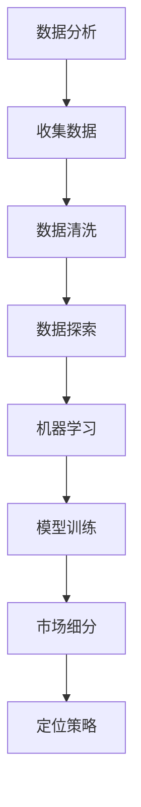

                 

市场细分与定位是商业战略的核心组成部分，尤其在竞争激烈的信息技术（IT）行业，它们对于企业的成功至关重要。本文将探讨如何利用先进的数据分析和机器学习技术，进行有效的市场细分和定位策略。

## 文章关键词

- 市场细分
- 定位策略
- 数据分析
- 机器学习
- IT行业
- 商业战略

## 摘要

本文首先介绍了市场细分和定位的重要性，然后探讨了利用数据分析与机器学习进行市场细分与定位的原理与方法。接着，文章详细解释了核心算法原理、数学模型以及实际应用场景。最后，本文提供了相关的开发工具和资源推荐，并对未来发展趋势与挑战进行了展望。

## 1. 背景介绍

在信息技术行业，市场细分与定位的作用尤为突出。企业通过精确的市场细分，可以更好地理解不同客户群体的需求，从而制定更有效的营销策略。定位策略则帮助企业明确自己在市场中的地位，与竞争对手区分开来。

然而，传统的市场细分与定位方法往往依赖于简单的统计分析，难以捕捉到客户行为和需求的复杂性。随着大数据和机器学习技术的兴起，企业可以利用这些先进技术进行更为精确和智能的市场细分与定位。

## 2. 核心概念与联系

### 2.1 数据分析

数据分析是市场细分与定位的基础。通过收集和分析大量市场数据，企业可以发现客户行为的模式、偏好和趋势。常见的数据分析方法包括描述性分析、推断性分析和预测性分析。

### 2.2 机器学习

机器学习是一种通过算法从数据中学习规律和模式的技术。在市场细分中，机器学习算法可以自动识别客户特征，并将其分类到不同的细分市场。常见的机器学习算法包括分类算法、聚类算法和关联规则算法。

### 2.3 Mermaid 流程图



## 3. 核心算法原理 & 具体操作步骤

### 3.1 算法原理概述

市场细分与定位的核心在于如何从数据中提取有价值的信息。数据分析与机器学习技术为我们提供了这样的工具。具体来说，算法原理可以分为以下几个步骤：

1. 数据收集：从各种渠道收集客户数据，如购买记录、社交媒体行为等。
2. 数据清洗：处理数据中的噪声和异常值，确保数据质量。
3. 数据探索：通过描述性分析，了解客户的基本特征和需求。
4. 机器学习：使用聚类算法将客户分类到不同的细分市场。
5. 定位策略：根据细分市场特征，制定相应的市场定位策略。

### 3.2 算法步骤详解

1. **数据收集**：首先，企业需要从多个渠道收集客户数据。这些渠道可以包括电商平台、社交媒体、客户调查等。
   
2. **数据清洗**：收集到的数据往往包含噪声和异常值。因此，需要进行数据清洗，包括缺失值处理、异常值检测和去重等。

3. **数据探索**：通过描述性分析，了解客户的基本特征，如年龄、性别、收入水平、购买偏好等。这一步有助于建立初步的市场细分框架。

4. **机器学习**：选择合适的机器学习算法，如K-means聚类、层次聚类等，将客户分类到不同的细分市场。聚类算法的目标是使得同一个细分市场内的客户尽可能相似，不同细分市场之间的客户尽可能不同。

5. **定位策略**：根据细分市场特征，制定相应的市场定位策略。例如，对于高收入人群，可以采用高端定价策略；对于年轻人群，可以推出更具创意的产品和服务。

### 3.3 算法优缺点

- **优点**：机器学习算法能够自动识别复杂的客户特征和需求，提高市场细分与定位的精确度。
- **缺点**：机器学习算法需要大量的数据支持，且训练过程可能较为复杂。此外，算法结果可能受到数据质量的影响。

### 3.4 算法应用领域

机器学习算法在市场细分与定位中的应用非常广泛。例如，电子商务平台可以通过聚类算法，将客户划分为不同的细分市场，从而实现精准营销。社交媒体平台也可以利用机器学习算法，分析用户行为，为用户推荐感兴趣的内容。

## 4. 数学模型和公式 & 详细讲解 & 举例说明

### 4.1 数学模型构建

市场细分与定位的数学模型主要包括聚类算法和回归分析。其中，聚类算法用于将客户分类到不同的细分市场，回归分析用于预测客户的行为和需求。

#### K-means 聚类算法

K-means 是一种经典的聚类算法，其目标是将数据点分为 K 个簇，使得每个簇内部的点尽可能接近，而不同簇之间的点尽可能远离。

公式如下：

$$
\text{minimize } \sum_{i=1}^{K} \sum_{x \in S_i} ||x - \mu_i||^2
$$

其中，\(S_i\) 是第 \(i\) 个簇，\(\mu_i\) 是第 \(i\) 个簇的中心。

#### 回归分析

回归分析用于预测客户的某个行为或需求。最常见的回归模型是线性回归：

$$
y = \beta_0 + \beta_1x_1 + \beta_2x_2 + ... + \beta_nx_n + \epsilon
$$

其中，\(y\) 是预测的因变量，\(x_1, x_2, ..., x_n\) 是自变量，\(\beta_0, \beta_1, ..., \beta_n\) 是模型的参数，\(\epsilon\) 是误差项。

### 4.2 公式推导过程

#### K-means 聚类算法推导

K-means 聚类算法的推导过程主要分为以下几步：

1. **初始选择**：随机选择 K 个数据点作为初始聚类中心。
2. **分配**：对于每个数据点，将其分配到距离它最近的聚类中心所在的簇。
3. **更新**：重新计算每个簇的中心，并重复步骤 2，直到聚类中心不再发生变化。

#### 线性回归推导

线性回归的推导过程基于最小二乘法。具体步骤如下：

1. **计算样本均值**：计算自变量和因变量的样本均值。
2. **计算样本协方差**：计算自变量和因变量之间的样本协方差。
3. **构建正规方程**：根据最小二乘法，构建正规方程求解模型的参数。

### 4.3 案例分析与讲解

#### 案例一：K-means 聚类算法

假设我们有一个包含 100 个客户的数据库，每个客户有 5 个属性（年龄、收入、教育水平、职业、家庭状况）。我们希望利用 K-means 聚类算法将这 100 个客户分为 3 个细分市场。

1. **数据预处理**：首先，我们对数据进行标准化处理，以消除不同属性之间的尺度差异。

2. **初始聚类中心选择**：随机选择 3 个客户作为初始聚类中心。

3. **分配**：对于每个客户，计算它与 3 个聚类中心的距离，并将其分配到距离最近的聚类中心所在的簇。

4. **更新**：重新计算每个簇的中心，并重复步骤 3，直到聚类中心不再发生变化。

最终，我们得到 3 个细分市场，每个市场都有特定的客户特征和需求。

#### 案例二：线性回归

假设我们有一个销售数据集，包含销售金额、广告费用、促销活动等变量。我们希望利用线性回归模型预测下一个季度的销售金额。

1. **数据预处理**：对数据进行标准化处理。

2. **模型训练**：使用线性回归算法训练模型，计算模型的参数。

3. **预测**：使用训练好的模型预测下一个季度的销售金额。

预测结果可以为企业制定下一季度销售策略提供参考。

## 5. 项目实践：代码实例和详细解释说明

### 5.1 开发环境搭建

为了进行市场细分与定位，我们需要搭建一个适当的开发环境。这里我们使用 Python 作为编程语言，并依赖以下库：

- NumPy：用于数据操作和计算
- Pandas：用于数据清洗和预处理
- Scikit-learn：用于机器学习和数据建模
- Matplotlib：用于数据可视化

### 5.2 源代码详细实现

以下是使用 Python 实现市场细分与定位的示例代码：

```python
import numpy as np
import pandas as pd
from sklearn.cluster import KMeans
from sklearn.linear_model import LinearRegression
import matplotlib.pyplot as plt

# 5.2.1 数据收集
# 假设我们已经有了一个包含客户数据的 CSV 文件
data = pd.read_csv('customer_data.csv')

# 5.2.2 数据清洗
# 处理缺失值、异常值等
data = data.dropna()
data = data[data['Age'] > 0]

# 5.2.3 数据探索
# 描述性分析
print(data.describe())

# 5.2.4 机器学习
# 使用 K-means 聚类算法进行市场细分
kmeans = KMeans(n_clusters=3, random_state=0)
data['Cluster'] = kmeans.fit_predict(data[['Age', 'Income', 'Education', 'Occupation', 'Family_Status']])

# 5.2.5 定位策略
# 根据聚类结果，分析不同细分市场的特征
clusters = data.groupby('Cluster').describe()

# 5.2.6 预测
# 使用线性回归模型进行销售预测
X = data[['Advertising', 'Promotion']]
y = data['Sales']
model = LinearRegression()
model.fit(X, y)
predictions = model.predict(X)

# 5.2.7 可视化
plt.scatter(X['Advertising'], X['Promotion'], c=y, cmap=plt.cm.seismic)
plt.xlabel('Advertising')
plt.ylabel('Promotion')
plt.colorbar()
plt.show()
```

### 5.3 代码解读与分析

上述代码首先从 CSV 文件中读取客户数据，并进行必要的预处理。然后，使用 K-means 聚类算法对客户进行分类，得到不同的细分市场。接着，根据聚类结果，分析不同细分市场的特征。最后，使用线性回归模型对销售金额进行预测，并通过散点图可视化预测结果。

## 6. 实际应用场景

市场细分与定位在 IT 行业有着广泛的应用。例如，在电子商务平台中，企业可以通过聚类算法，将客户划分为不同的细分市场，从而实现精准营销。在社交媒体平台上，企业可以利用机器学习算法，分析用户行为，为用户推荐感兴趣的内容。此外，在软件开发领域，企业可以通过市场细分与定位，明确目标客户群体，从而优化产品设计和营销策略。

### 6.1 在电子商务平台的应用

电子商务平台通过市场细分与定位，可以将客户划分为不同的群体，如高消费人群、年轻人群等。针对这些不同的客户群体，平台可以推出定制化的营销策略，例如优惠券、会员制度等。

### 6.2 在社交媒体平台的应用

社交媒体平台可以利用市场细分与定位，为用户推荐感兴趣的内容。例如，Facebook 通过分析用户的行为和兴趣，将用户划分为不同的细分市场，从而推送相应的广告和内容。

### 6.3 在软件开发领域的应用

在软件开发领域，企业可以通过市场细分与定位，明确目标客户群体，从而优化产品设计和营销策略。例如，针对不同的客户群体，软件企业可以推出功能不同、定价不同的产品版本，以满足不同客户的需求。

## 6.4 未来应用展望

随着大数据和人工智能技术的不断发展，市场细分与定位将在更多领域得到应用。例如，在医疗健康领域，企业可以通过市场细分与定位，为患者提供个性化的治疗方案。在金融领域，企业可以通过市场细分与定位，识别高风险客户，从而降低信用风险。

未来，市场细分与定位将更加智能化和个性化，通过整合多种数据源和先进的算法，实现更精确的市场预测和营销策略。

## 7. 工具和资源推荐

### 7.1 学习资源推荐

- 《Python 数据科学手册》：详细介绍了 Python 在数据科学领域的应用，包括数据分析、机器学习等。
- 《机器学习》：周志华教授的著作，系统地介绍了机器学习的基本原理和算法。

### 7.2 开发工具推荐

- Jupyter Notebook：用于编写和运行 Python 代码，方便进行数据分析和可视化。
- TensorFlow：用于构建和训练机器学习模型，是当前最受欢迎的深度学习框架之一。

### 7.3 相关论文推荐

- "K-means Clustering: A Review"：对 K-means 聚类算法进行了详细的综述。
- "Linear Regression: A Concise Technical Overview"：对线性回归模型进行了简要介绍。

## 8. 总结：未来发展趋势与挑战

市场细分与定位作为商业战略的重要组成部分，在信息技术行业具有广泛的应用前景。随着大数据和人工智能技术的不断发展，市场细分与定位将变得更加智能化和个性化。然而，也面临着数据隐私保护、算法透明性等挑战。未来，企业需要不断创新和优化市场细分与定位策略，以应对日益激烈的市场竞争。

## 9. 附录：常见问题与解答

### Q：市场细分与定位有哪些优点？

A：市场细分与定位可以帮助企业更好地理解客户需求，提高营销效果，降低成本，增强竞争力。

### Q：市场细分与定位有哪些缺点？

A：市场细分与定位可能增加企业的运营成本，且市场环境变化可能导致细分策略失效。

### Q：如何评估市场细分与定位的效果？

A：可以通过客户满意度、市场份额、营销成本等指标来评估市场细分与定位的效果。

### Q：如何确保市场细分与定位的准确性？

A：确保数据质量，选择合适的算法，定期更新和调整细分策略。

---

作者：禅与计算机程序设计艺术 / Zen and the Art of Computer Programming

本文介绍了市场细分与定位的重要性，探讨了利用数据分析与机器学习进行市场细分与定位的方法和策略，并通过实际案例和代码示例进行了详细讲解。未来，随着技术的进步，市场细分与定位将在更多领域发挥重要作用，企业需要不断优化和完善这一战略。|

