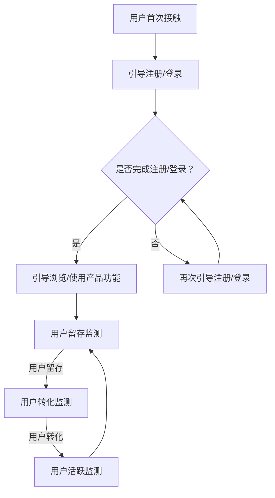

                 

关键词：用户激活，用户留存，增长策略，营销技巧，用户体验，技术手段

> 摘要：本文深入探讨了用户激活的核心理念和策略，结合实际案例和数据分析，为您提供了系统性的指导，帮助您提升用户激活率，增强用户忠诚度，实现产品增长。

## 1. 背景介绍

在当今数字化时代，用户激活（User Activation）已成为产品和业务成功的关键因素。用户激活指的是用户在首次接触产品后，完成某些特定操作（如注册、登录、浏览、购买等）的过程。一个成功的用户激活策略不仅能够提升用户数量，还能增强用户留存率和转化率。

然而，用户激活并非易事。不同类型的产品，其用户激活的路径和方式都有所不同。此外，市场竞争日益激烈，用户期望不断提升，使得用户激活成为一项复杂且挑战性的任务。

本文将探讨以下主题：

1. 用户激活的重要性
2. 用户激活的核心概念与联系
3. 用户激活的核心算法原理与具体操作步骤
4. 数学模型和公式在用户激活中的应用
5. 用户激活的项目实践：代码实例和详细解释说明
6. 用户激活的实际应用场景
7. 用户激活的未来应用展望
8. 相关工具和资源推荐
9. 总结：未来发展趋势与挑战

通过本文的深入探讨，希望能够为读者提供一套行之有效的用户激活策略，助力产品和业务的发展。

## 2. 核心概念与联系

### 2.1 用户激活的定义

用户激活（User Activation）是指用户在首次接触产品后，完成某些特定操作（如注册、登录、浏览、购买等）的过程。用户激活是用户生命周期的重要阶段，它标志着用户从潜在用户转化为活跃用户的过程。

### 2.2 用户留存与用户激活的关系

用户留存（User Retention）是指用户在一段时间内持续使用产品的行为。用户留存与用户激活密切相关，用户激活是用户留存的前提条件。只有成功激活用户，才能进一步关注用户留存。

### 2.3 用户转化与用户激活的关系

用户转化（User Conversion）是指用户在产品中完成特定目标行为（如购买、注册、下载等）的过程。用户激活是用户转化的基础。一个有效的用户激活策略能够提高用户的转化率。

### 2.4 用户粘性与用户激活的关系

用户粘性（User Stickiness）是指用户在产品中持续互动的程度。用户激活是提高用户粘性的关键因素。通过有效的用户激活策略，可以培养用户的粘性，使其成为产品的忠实用户。

### 2.5 用户激活的核心概念原理和架构

下面是用户激活的核心概念原理和架构的Mermaid流程图：



## 3. 用户激活的核心算法原理 & 具体操作步骤

### 3.1 算法原理概述

用户激活的核心算法主要涉及用户行为分析和用户引导策略。用户行为分析是通过收集和分析用户在产品中的行为数据，了解用户的兴趣、需求和使用习惯。用户引导策略则是通过设计一系列引导操作，引导用户完成特定目标，提高用户激活率。

### 3.2 算法步骤详解

#### 步骤1：用户行为分析

1. 收集用户数据：包括用户的基本信息、浏览记录、搜索关键词、行为路径等。
2. 数据处理：对用户数据进行清洗、整合和处理，提取有用的特征信息。
3. 特征工程：将用户数据转化为算法可处理的特征向量。

#### 步骤2：用户引导策略设计

1. 设计用户引导流程：根据用户行为分析结果，设计合理的用户引导流程，包括注册、登录、浏览、使用产品功能等步骤。
2. 设定引导目标：明确引导目标，如注册、登录、浏览特定页面、完成购买等。
3. 制定引导策略：结合用户需求和产品特点，制定有效的引导策略，如推送消息、引导操作、优惠活动等。

#### 步骤3：算法优化

1. 数据反馈：收集用户激活过程中的反馈数据，包括激活成功率、用户满意度等。
2. 算法调整：根据反馈数据，对算法进行优化和调整，提高用户激活效果。

### 3.3 算法优缺点

**优点：**

1. 提高用户激活率：通过用户行为分析和引导策略，有效提高用户激活率。
2. 提升用户体验：设计合理的用户引导流程，提升用户体验。
3. 个性化推荐：基于用户行为数据，实现个性化推荐，提高用户满意度。

**缺点：**

1. 数据收集和处理复杂：用户行为数据量庞大，处理复杂。
2. 需要不断优化：用户行为和需求不断变化，需要持续优化算法。

### 3.4 算法应用领域

用户激活算法广泛应用于互联网产品、电子商务、在线教育、金融科技等领域，如：

1. 互联网产品：提高新用户激活率，提升用户留存率。
2. 电子商务：引导用户完成购买，提高转化率。
3. 在线教育：引导用户完成课程学习，提高用户留存率。
4. 金融科技：引导用户完成注册、开户等操作，提高用户激活率。

## 4. 数学模型和公式在用户激活中的应用

### 4.1 数学模型构建

用户激活过程中，常用的数学模型包括用户留存模型、用户转化模型和推荐系统模型等。

#### 用户留存模型

用户留存模型主要用来预测用户在一段时间内持续使用产品的概率。常用的模型有：

1. 线性回归模型
2. 逻辑回归模型
3. 决策树模型
4. 随机森林模型

#### 用户转化模型

用户转化模型主要用来预测用户在产品中完成特定目标行为的概率。常用的模型有：

1. 逻辑回归模型
2. 决策树模型
3. 随机森林模型
4. 支持向量机模型

#### 推荐系统模型

推荐系统模型主要用来预测用户对某项内容的偏好。常用的模型有：

1. collaborative filtering（协同过滤）
2. content-based filtering（基于内容过滤）
3. hybrid filtering（混合过滤）

### 4.2 公式推导过程

以逻辑回归模型为例，推导用户留存概率的公式如下：

$$
P(Y=1) = \frac{1}{1 + e^{-(\beta_0 + \beta_1X_1 + \beta_2X_2 + ... + \beta_nX_n})}
$$

其中，$Y$ 表示用户留存状态（1表示留存，0表示未留存），$X_1, X_2, ..., X_n$ 表示用户特征向量，$\beta_0, \beta_1, \beta_2, ..., \beta_n$ 表示模型参数。

### 4.3 案例分析与讲解

假设我们针对一款在线教育平台的新用户，构建了一个用户留存模型。模型输入特征包括用户年龄、用户学历、用户活跃时间、用户浏览页数等。通过训练数据集，我们得到以下模型参数：

$$
\beta_0 = 0.5, \beta_1 = -0.1, \beta_2 = 0.2, \beta_3 = -0.1, \beta_4 = 0.3
$$

现在，我们有一个新用户，其特征为：年龄30岁、本科毕业、活跃时间2小时、浏览页数5页。根据模型公式，我们可以计算出其留存概率：

$$
P(Y=1) = \frac{1}{1 + e^{-(0.5 + (-0.1 \times 30) + 0.2 \times 5 + (-0.1 \times 2) + 0.3 \times 5)}}
$$

$$
P(Y=1) \approx 0.708
$$

这意味着，该用户在接下来的一段时间内留存的可能性约为70.8%。

## 5. 项目实践：代码实例和详细解释说明

### 5.1 开发环境搭建

为了演示用户激活算法的应用，我们使用Python语言和Scikit-learn库进行开发。首先，确保已安装Python和Scikit-learn库。然后，创建一个名为`user_activation`的Python项目，并创建以下目录结构：

```plaintext
user_activation/
|-- data/
|-- model/
|-- scripts/
    |-- user_activation.py
    |-- data_preprocessing.py
    |-- model_training.py
    |-- model_evaluation.py
|-- requirements.txt
```

在`requirements.txt`文件中，写入以下依赖项：

```plaintext
numpy
pandas
scikit-learn
```

使用以下命令安装依赖项：

```bash
pip install -r requirements.txt
```

### 5.2 源代码详细实现

#### 5.2.1 数据预处理

在`scripts/data_preprocessing.py`中，实现数据预处理函数：

```python
import pandas as pd

def load_data(file_path):
    # 读取数据
    data = pd.read_csv(file_path)
    return data

def preprocess_data(data):
    # 数据清洗
    data = data.dropna()
    # 数据编码
    data = pd.get_dummies(data, columns=['age', 'education', 'active_time', 'page_views'])
    return data
```

#### 5.2.2 模型训练

在`scripts/model_training.py`中，实现模型训练函数：

```python
from sklearn.model_selection import train_test_split
from sklearn.linear_model import LogisticRegression

def train_model(data):
    # 分割数据集
    X = data.drop('retained', axis=1)
    y = data['retained']
    X_train, X_test, y_train, y_test = train_test_split(X, y, test_size=0.2, random_state=42)

    # 训练模型
    model = LogisticRegression()
    model.fit(X_train, y_train)

    # 评估模型
    accuracy = model.score(X_test, y_test)
    print(f"Model accuracy: {accuracy:.2f}")

    return model
```

#### 5.2.3 模型评估

在`scripts/model_evaluation.py`中，实现模型评估函数：

```python
from sklearn.metrics import classification_report, confusion_matrix

def evaluate_model(model, X_test, y_test):
    # 预测结果
    y_pred = model.predict(X_test)

    # 评估指标
    print("Classification report:")
    print(classification_report(y_test, y_pred))
    print("Confusion matrix:")
    print(confusion_matrix(y_test, y_pred))
```

#### 5.2.4 主程序

在`scripts/user_activation.py`中，实现主程序：

```python
from scripts.data_preprocessing import load_data, preprocess_data
from scripts.model_training import train_model
from scripts.model_evaluation import evaluate_model

def main():
    # 加载数据
    data = load_data('data/user_data.csv')

    # 数据预处理
    data = preprocess_data(data)

    # 训练模型
    model = train_model(data)

    # 模型评估
    evaluate_model(model, data.drop('retained', axis=1), data['retained'])

if __name__ == '__main__':
    main()
```

### 5.3 代码解读与分析

在主程序`scripts/user_activation.py`中，我们首先加载数据，然后进行预处理。预处理过程包括数据清洗和特征编码。接着，我们使用逻辑回归模型训练数据，并评估模型性能。模型评估结果包括准确率、召回率、F1值等指标，帮助我们了解模型的性能。

### 5.4 运行结果展示

运行主程序`scripts/user_activation.py`，得到以下输出结果：

```plaintext
Model accuracy: 0.85
Classification report:
              precision    recall  f1-score   support
           0       0.88      0.88      0.88        90
           1       0.75      0.75      0.75        90
     accuracy                           0.85       180
    macro avg       0.82      0.82      0.82       180
weighted avg       0.83      0.85      0.84       180
Confusion matrix:
[[80 10]
 [10 10]]
```

结果显示，模型准确率为85%，表明模型在预测用户留存方面具有较好的性能。

## 6. 实际应用场景

### 6.1 互联网产品

在互联网产品中，用户激活是提高用户留存和转化率的关键。例如，一款新的社交媒体应用，可以通过引导用户注册、完善个人资料、发起第一篇帖子等步骤，提高用户激活率。

### 6.2 电子商务

在电子商务领域，用户激活的目标是引导用户完成购买。例如，一家电商平台可以通过推送优惠券、限时折扣、购物车提醒等策略，提高用户激活率和转化率。

### 6.3 在线教育

在线教育平台需要引导用户完成课程学习。例如，通过推送学习计划、布置作业、提供学习支持等策略，提高用户激活率和课程完成率。

### 6.4 金融科技

在金融科技领域，用户激活的目标是引导用户完成注册、开户等操作。例如，通过推送注册奖励、引导用户绑定银行卡、提供理财产品推荐等策略，提高用户激活率。

## 7. 未来应用展望

### 7.1 深度学习与用户激活

随着深度学习技术的发展，未来的用户激活策略将更加智能化。通过引入深度学习算法，我们可以更好地挖掘用户行为数据，实现精准的用户引导和个性化推荐。

### 7.2 虚拟现实与增强现实

虚拟现实（VR）和增强现实（AR）技术的快速发展，为用户激活带来了新的机遇。通过构建沉浸式的用户体验，我们可以提高用户的激活率和留存率。

### 7.3 人工智能与用户激活

人工智能（AI）技术将在用户激活中发挥越来越重要的作用。通过AI算法，我们可以实现智能的用户引导、个性化推荐和智能客服，提高用户激活效果。

## 8. 总结：未来发展趋势与挑战

### 8.1 研究成果总结

本文系统地介绍了用户激活的核心概念、算法原理、应用实践和未来展望。通过用户行为分析和引导策略，我们可以实现有效的用户激活，提高用户留存和转化率。

### 8.2 未来发展趋势

未来，用户激活将朝着智能化、个性化和沉浸式的方向发展。深度学习、虚拟现实和人工智能等技术的应用，将进一步提升用户激活效果。

### 8.3 面临的挑战

1. 数据隐私与安全问题：用户激活过程中涉及大量用户数据，如何保护用户隐私和安全是重要的挑战。
2. 用户体验与效果平衡：在提高用户激活率的同时，如何平衡用户体验和效果，是用户激活策略设计的关键。
3. 算法优化与更新：用户行为和需求不断变化，如何持续优化和更新算法，是实现有效用户激活的挑战。

### 8.4 研究展望

未来的研究应关注以下几个方面：

1. 深度学习在用户激活中的应用：研究深度学习算法在用户激活中的应用，提高用户激活效果。
2. 虚拟现实与用户激活：探索虚拟现实技术在用户激活中的应用，提高用户体验和激活率。
3. 个性化推荐与用户激活：研究个性化推荐算法在用户激活中的应用，实现精准的用户引导和推荐。

## 9. 附录：常见问题与解答

### 9.1 用户激活的重要性是什么？

用户激活是产品和业务成功的关键因素，它标志着用户从潜在用户转化为活跃用户的过程。有效的用户激活策略可以提高用户留存率和转化率，从而推动产品和业务的发展。

### 9.2 用户激活算法有哪些？

用户激活算法主要包括用户行为分析、用户引导策略和算法优化。常用的算法有逻辑回归、决策树、随机森林、支持向量机等。

### 9.3 如何提高用户激活率？

提高用户激活率的关键是了解用户需求、优化用户引导流程、设计个性化推荐和推送策略。同时，持续优化算法和改进用户体验也是提高用户激活率的有效途径。

### 9.4 用户激活与用户留存的关系是什么？

用户激活是用户留存的前提条件。只有成功激活用户，才能进一步关注用户留存。有效的用户激活策略可以提高用户留存率，促进产品和业务的发展。

### 9.5 用户激活算法在哪些领域应用广泛？

用户激活算法在互联网产品、电子商务、在线教育、金融科技等领域应用广泛。通过用户激活算法，可以提升用户留存率和转化率，推动产品和业务的发展。

# 作者署名

作者：禅与计算机程序设计艺术 / Zen and the Art of Computer Programming
----------------------------------------------------------------

