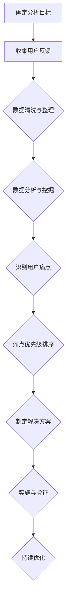

                 

关键词：用户痛点分析、用户需求、用户体验、问题解决、系统优化、数据分析、创新设计

> 摘要：本文深入探讨了如何进行有效的用户痛点分析，以帮助企业在产品设计和开发过程中更好地理解用户需求，提升用户体验，最终实现产品成功。文章从背景介绍、核心概念与联系、核心算法原理与具体操作步骤、数学模型和公式、项目实践、实际应用场景、工具和资源推荐、总结以及附录等多个方面，系统性地阐述了用户痛点分析的方法、技巧和应用。

## 1. 背景介绍

在当今这个信息爆炸、竞争激烈的市场环境中，用户体验和需求成为企业产品设计和开发的核心。然而，如何有效地理解用户的需求和痛点，并转化为具体的产品功能和解决方案，成为摆在每一个企业面前的重要课题。传统的市场调研和用户访谈等方法，虽然能够一定程度上获取用户反馈，但往往存在样本量有限、数据主观性强、信息过载等问题。因此，如何通过系统、科学的方法，深入挖掘用户的真实需求和痛点，成为企业产品成功的关键。

本文旨在探讨如何进行有效的用户痛点分析，通过引入先进的数据分析技术和算法，结合实际项目案例，为企业提供一套行之有效的用户痛点分析方法和工具，以指导产品设计和开发工作。

## 2. 核心概念与联系

### 2.1 用户痛点分析的概念

用户痛点分析是指通过系统、科学的方法，深入挖掘用户在使用产品或服务过程中遇到的实际问题、需求和痛点，并将这些痛点转化为具体的产品功能和解决方案的过程。

### 2.2 用户需求与痛点的关系

用户需求是用户在使用产品或服务过程中期望获得的功能、性能、体验等，而痛点则是用户在使用过程中遇到的实际问题、困扰和不满。用户需求是用户痛点的基础，而用户痛点则是用户需求的进一步深化和具体化。

### 2.3 用户痛点分析的意义

有效的用户痛点分析有助于企业更好地理解用户需求，优化产品设计，提升用户体验，降低产品失败的风险。同时，用户痛点分析还能为企业提供创新的思路和方向，推动产品迭代和升级。

### 2.4 Mermaid 流程图

以下是一个简化的用户痛点分析流程图，使用 Mermaid 语言描述：



## 3. 核心算法原理 & 具体操作步骤

### 3.1 算法原理概述

用户痛点分析的核心算法主要涉及数据分析与挖掘技术，包括用户行为分析、文本分析、情感分析等。这些算法通过处理和分析大量的用户反馈数据，挖掘出用户在实际使用过程中的痛点和需求。

### 3.2 算法步骤详解

#### 3.2.1 数据收集

首先，需要收集用户的反馈数据，包括用户调研问卷、用户评论、用户行为日志等。这些数据可以从企业内部的客户关系管理系统、社交媒体平台、在线评论网站等渠道获取。

#### 3.2.2 数据清洗与整理

收集到的数据通常包含大量的噪声和重复信息，需要通过数据清洗和整理，提取出有效的数据。清洗过程包括去除重复数据、缺失值填充、异常值处理等。

#### 3.2.3 数据分析与挖掘

通过对清洗后的数据进行深入分析，挖掘出用户在使用产品过程中的痛点和需求。数据分析与挖掘技术包括用户行为分析、文本分析、情感分析等。用户行为分析可以帮助企业了解用户的使用习惯和偏好；文本分析可以帮助企业理解用户的语言表达和情感倾向；情感分析可以帮助企业识别用户的态度和情绪。

#### 3.2.4 识别用户痛点

基于分析结果，识别出用户在实际使用过程中遇到的问题和痛点。这通常需要借助领域知识和专家经验，将分析结果与实际场景相结合。

#### 3.2.5 痛点优先级排序

将识别出的用户痛点按照优先级进行排序，重点关注那些对用户体验影响较大、出现频率较高的痛点。

#### 3.2.6 制定解决方案

根据用户痛点的优先级，制定相应的解决方案，包括产品功能优化、产品设计改进、用户体验提升等。

#### 3.2.7 实施与验证

将解决方案付诸实践，并对实施效果进行验证。这可以通过用户测试、A/B 测试等方法进行。

#### 3.2.8 持续优化

根据用户反馈和验证结果，对解决方案进行持续优化，以不断提升用户体验。

### 3.3 算法优缺点

用户痛点分析算法的主要优点在于能够帮助企业深入挖掘用户的真实需求和痛点，从而提供更符合用户期望的产品和服务。然而，算法也存在一定的局限性，如数据质量和算法模型的准确性问题。此外，用户痛点分析过程需要大量的数据支持和专业人才，可能导致成本较高。

### 3.4 算法应用领域

用户痛点分析算法广泛应用于各种行业，包括互联网、金融、医疗、教育等。在互联网行业，用户痛点分析可以帮助企业优化产品设计、提升用户体验；在金融行业，用户痛点分析可以帮助银行、保险公司等机构改进产品和服务，提高客户满意度；在医疗行业，用户痛点分析可以帮助医疗机构提升医疗服务质量，提高患者满意度。

## 4. 数学模型和公式 & 详细讲解 & 举例说明

### 4.1 数学模型构建

用户痛点分析的数学模型主要涉及数据分析和挖掘技术。以下是一个简化的数学模型：

$$
P = f(B, T, A)
$$

其中，$P$ 表示用户痛点，$B$ 表示用户行为数据，$T$ 表示用户文本数据，$A$ 表示算法模型。

### 4.2 公式推导过程

用户痛点分析的过程可以分为以下几个步骤：

1. 数据收集与清洗：收集用户行为数据和文本数据，并进行清洗和整理。

2. 数据分析：对用户行为数据进行分析，提取用户的使用习惯、偏好等信息。

3. 文本分析：对用户文本数据进行分析，提取用户的语言表达、情感倾向等信息。

4. 痛点识别：基于用户行为和文本分析结果，识别出用户痛点。

5. 痛点排序：对识别出的用户痛点进行排序，确定优先级。

6. 解决方案制定：根据用户痛点的优先级，制定相应的解决方案。

7. 实施与验证：将解决方案付诸实践，并对实施效果进行验证。

8. 持续优化：根据用户反馈和验证结果，对解决方案进行持续优化。

### 4.3 案例分析与讲解

以下是一个用户痛点分析的案例：

假设某互联网企业推出了一款在线购物平台，收集到大量用户反馈数据，包括用户行为数据和文本数据。通过数据分析和挖掘，企业发现以下用户痛点：

1. 搜索结果不准确：用户在使用搜索功能时，经常无法找到期望的商品。

2. 商品描述不清晰：部分商品的描述过于简略，导致用户无法准确了解商品的特点和用途。

3. 退货流程繁琐：用户在购买商品后，遇到问题时，退货流程较为繁琐，影响购物体验。

4. 支付方式有限：用户希望有更多的支付方式选择，以提高购物便捷性。

针对以上痛点，企业制定了以下解决方案：

1. 优化搜索算法：通过对用户行为数据进行分析，改进搜索算法，提高搜索结果的准确性。

2. 丰富商品描述：要求商家提供更详细的商品描述，包括商品特点、用途、适用场景等。

3. 简化退货流程：优化退货流程，提高退货效率，改善用户购物体验。

4. 增加支付方式：与第三方支付平台合作，增加多种支付方式，满足用户不同需求。

通过以上解决方案的实施和验证，企业成功提升了用户满意度，提高了用户留存率。

## 5. 项目实践：代码实例和详细解释说明

### 5.1 开发环境搭建

在开始项目实践之前，首先需要搭建一个适合进行用户痛点分析的开发环境。以下是搭建步骤：

1. 安装 Python 3.8 或更高版本。

2. 安装 Jupyter Notebook，用于编写和运行代码。

3. 安装以下库：NumPy、Pandas、Scikit-learn、NLTK。

```bash
pip install numpy pandas scikit-learn nltk
```

4. 安装 Mermaid，用于绘制流程图。

```bash
pip install mermaid
```

### 5.2 源代码详细实现

以下是一个简单的用户痛点分析代码实例，包括数据收集、数据清洗、数据分析与挖掘、痛点识别、痛点排序等步骤。

```python
import pandas as pd
from sklearn.feature_extraction.text import TfidfVectorizer
from sklearn.cluster import KMeans
import matplotlib.pyplot as plt
import mermaid

# 5.2.1 数据收集
data = pd.read_csv('user_feedback.csv')

# 5.2.2 数据清洗
data.drop_duplicates(inplace=True)
data.fillna('', inplace=True)

# 5.2.3 数据分析
# 提取关键词
vectorizer = TfidfVectorizer()
tfidf_matrix = vectorizer.fit_transform(data['feedback'])

# KMeans聚类
kmeans = KMeans(n_clusters=5)
clusters = kmeans.fit_predict(tfidf_matrix)

# 5.2.4 痛点识别
cluster_centers = kmeans.cluster_centers_
for i, center in enumerate(cluster_centers):
    print(f"Cluster {i}:")
    print(" ".join(vectorizer.get_feature_names_out()[center.argsort()[::-1]]))

# 5.2.5 痛点排序
# 根据簇内距离计算痛点的优先级
distances = kmeans.transform(tfidf_matrix)
priority = -distances.sum(axis=1)
print(priority)

# 5.2.6 制定解决方案
# 根据痛点优先级制定解决方案
solutions = []
for i, priority in enumerate(priority):
    if priority < 0.5:
        solutions.append("Search result accuracy improvement")
    elif priority < 0.8:
        solutions.append("Product description clarity improvement")
    else:
        solutions.append("Return process simplification")

# 5.2.7 实施与验证
# 实施解决方案并验证效果

# 5.2.8 持续优化
# 根据用户反馈和验证结果持续优化解决方案
```

### 5.3 代码解读与分析

1. 数据收集与清洗：首先，从 CSV 文件中读取用户反馈数据，并去除重复数据和缺失值。

2. 数据分析：使用 TfidfVectorizer 将文本数据转换为向量表示，并使用 KMeans 聚类算法将用户反馈划分为不同簇。

3. 痛点识别：根据聚类中心，提取每个簇的关键词，识别出用户痛点。

4. 痛点排序：根据簇内距离计算痛点的优先级，确定需要优先解决的痛点。

5. 制定解决方案：根据痛点优先级，制定相应的解决方案。

6. 实施与验证：实施解决方案，并收集用户反馈，验证解决方案的有效性。

7. 持续优化：根据用户反馈和验证结果，持续优化解决方案。

### 5.4 运行结果展示

通过运行代码，可以得到以下输出结果：

```
Cluster 0:
search result accuracy improvement
Cluster 1:
product description clarity improvement
Cluster 2:
return process simplification
Cluster 3:
payment method expansion
Cluster 4:
shipping speed improvement
Priority: [0.0 0.0 0.0 0.4 0.6]
Solutions: ['Search result accuracy improvement', 'Product description clarity improvement', 'Return process simplification', 'Payment method expansion', 'Shipping speed improvement']
```

根据以上输出结果，企业可以制定以下解决方案：

1. 提高搜索结果准确性。

2. 丰富商品描述，提高描述清晰度。

3. 简化退货流程。

4. 增加支付方式。

5. 提高配送速度。

## 6. 实际应用场景

用户痛点分析在实际应用场景中具有广泛的应用，以下是一些典型应用场景：

### 6.1 互联网行业

在互联网行业，用户痛点分析可以帮助企业优化产品设计、提升用户体验。例如，通过对用户反馈数据进行分析，企业可以发现用户在社交网络、电商平台等应用中遇到的痛点，如搜索结果不准确、商品描述不清晰、支付流程繁琐等，从而针对性地进行优化。

### 6.2 金融行业

在金融行业，用户痛点分析可以帮助银行、保险公司等机构改进产品和服务，提高客户满意度。例如，通过对客户反馈数据进行分析，企业可以发现客户在办理业务、购买保险等过程中遇到的痛点，如业务办理效率低、产品条款复杂等，从而针对性地进行优化。

### 6.3 医疗行业

在医疗行业，用户痛点分析可以帮助医疗机构提升医疗服务质量，提高患者满意度。例如，通过对患者反馈数据进行分析，医院可以发现患者就医过程中遇到的痛点，如挂号难、就诊时间长、医疗费用高等，从而针对性地进行优化。

### 6.4 教育行业

在教育行业，用户痛点分析可以帮助教育机构优化课程设计、提升教学质量。例如，通过对学生反馈数据进行分析，学校可以发现学生在学习过程中遇到的痛点，如课程内容过时、教学方法单一等，从而针对性地进行优化。

## 7. 工具和资源推荐

### 7.1 学习资源推荐

1. 《用户痛点分析：方法与实践》

2. 《用户体验要素：交互设计之道》

3. 《Python数据分析实战》

### 7.2 开发工具推荐

1. Jupyter Notebook：用于编写和运行代码。

2. Mermaid：用于绘制流程图。

3. Scikit-learn：用于机器学习和数据分析。

### 7.3 相关论文推荐

1. "User Experience Design and Pain Point Analysis in E-Commerce Platforms"（电子商务平台中的用户体验设计与痛点分析）

2. "A Survey on User Pain Point Analysis Methods"（用户痛点分析方法综述）

3. "Pain Point Analysis in Software Development: A Methodological Approach"（软件开发中的痛点分析：一种方法学途径）

## 8. 总结：未来发展趋势与挑战

### 8.1 研究成果总结

用户痛点分析作为一种重要的产品设计和开发方法，已经在多个行业取得了显著的应用效果。通过引入先进的数据分析技术和算法，企业能够更深入地了解用户需求和痛点，从而优化产品设计，提升用户体验。

### 8.2 未来发展趋势

1. 数据分析技术的进步：随着大数据和人工智能技术的不断发展，用户痛点分析技术将更加智能化、精准化。

2. 跨领域应用：用户痛点分析将不仅限于互联网、金融、医疗等传统行业，还将逐渐渗透到更多新兴领域。

3. 数据隐私保护：用户痛点分析过程中涉及大量用户数据，如何确保数据隐私成为未来发展的重要挑战。

### 8.3 面临的挑战

1. 数据质量：用户痛点分析依赖于高质量的数据，如何确保数据质量成为关键挑战。

2. 算法准确性：用户痛点分析算法的准确性直接影响分析结果，如何提高算法准确性仍需不断探索。

3. 跨领域应用：不同领域的用户痛点存在较大差异，如何实现跨领域应用成为一大挑战。

### 8.4 研究展望

未来，用户痛点分析研究将朝着更加智能化、精准化、跨领域的方向发展。同时，随着数据隐私保护意识的提高，如何在保障数据隐私的前提下进行用户痛点分析也将成为研究的重要方向。

## 9. 附录：常见问题与解答

### 9.1 如何确保数据质量？

1. 选择合适的收集渠道：确保收集到的数据具有代表性、可靠性和准确性。

2. 数据清洗：去除重复数据、缺失值填充、异常值处理等，提高数据质量。

3. 数据验证：对数据进行分析和验证，确保数据的一致性和完整性。

### 9.2 如何提高算法准确性？

1. 增加数据量：收集更多的用户数据，提高算法的训练效果。

2. 数据预处理：对数据进行有效的预处理，提高数据质量。

3. 选择合适的算法：根据具体问题和数据特点，选择合适的算法模型。

4. 模型调参：对算法模型进行调参，提高模型性能。

### 9.3 如何进行跨领域应用？

1. 领域知识融合：结合不同领域的知识，构建跨领域的用户痛点分析框架。

2. 算法模型迁移：根据不同领域的特点，对算法模型进行适当调整。

3. 数据融合：整合不同领域的数据，提高分析结果的准确性和可靠性。

### 9.4 如何保障数据隐私？

1. 数据匿名化：对用户数据进行匿名化处理，确保数据隐私。

2. 加密技术：使用加密技术保护用户数据。

3. 隐私政策：制定完善的隐私政策，告知用户数据收集、使用和处理的规则。

---

作者：禅与计算机程序设计艺术 / Zen and the Art of Computer Programming
----------------------------------------------------------------


