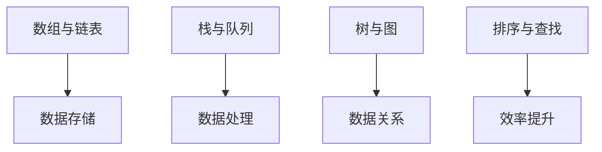
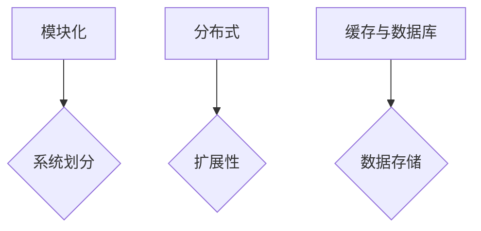

                 

关键词：字节跳动、2024校招、协同办公、开发面试题、技术解析

> 摘要：本文针对2024年字节跳动校招协同办公开发面试题进行深入解析，旨在帮助准备参加面试的同学们更好地理解和应对面试中的问题。文章涵盖了面试题的背景、核心概念、算法原理、数学模型、项目实践及未来应用展望，为读者提供全方位的指导和启示。

## 1. 背景介绍

随着数字化办公的普及，协同办公系统成为企业提高效率、降低成本的重要工具。字节跳动作为国内领先的互联网公司，其协同办公系统的开发面试题往往具有很高的难度和深度，不仅考查候选人的编程能力，还考验其系统设计能力和问题解决能力。本文旨在通过对这些面试题的深入解析，帮助读者更好地准备校招面试，提高成功率。

### 1.1 字节跳动校招背景

字节跳动成立于2012年，旗下拥有今日头条、抖音、西瓜视频等多款知名应用。公司致力于通过技术驱动创新，为用户创造价值。因此，在招聘过程中，字节跳动尤其重视候选人的技术能力和潜力。协同办公开发面试题作为技术筛选的重要环节，对候选人的综合素质提出了高要求。

### 1.2 面试题类型

字节跳动校招协同办公开发面试题主要涵盖以下几个类型：

- 数据结构与算法：考查基本数据结构和算法的应用能力，如排序算法、二分查找、动态规划等。
- 系统设计与架构：考查系统设计思路、架构设计能力，如缓存系统、分布式系统、数据库设计等。
- 实际问题解决：结合实际业务场景，考查候选人解决复杂问题的能力。
- 编程实践：考查编程基础和编程风格，如代码重构、性能优化、代码质量等。

## 2. 核心概念与联系

### 2.1 数据结构与算法

数据结构与算法是计算机科学的核心内容。在协同办公开发中，常见的数据结构与算法包括：

- **数组与链表**：用于实现基本的数据存储和管理。
- **栈与队列**：用于模拟实际场景中的数据处理流程。
- **树与图**：用于表示复杂的数据关系和路径查找。
- **排序与查找**：用于提高数据处理效率。

下面是一个简单的 Mermaid 流程图，展示数据结构与算法在协同办公开发中的应用：



### 2.2 系统设计与架构

协同办公系统的设计与架构是面试中的重点。一个良好的架构需要考虑以下几个方面：

- **模块化**：将系统划分为多个模块，提高可维护性和可扩展性。
- **分布式**：利用分布式技术，提高系统的可扩展性和容错性。
- **缓存与数据库**：缓存用于提高数据读取速度，数据库用于存储数据。

下面是一个简单的 Mermaid 流程图，展示协同办公系统设计与架构的核心概念：



## 3. 核心算法原理 & 具体操作步骤

### 3.1 算法原理概述

在协同办公开发中，常见算法包括：

- **排序算法**：如快速排序、归并排序、堆排序等，用于对数据进行排序。
- **查找算法**：如二分查找、哈希查找等，用于快速查找数据。
- **动态规划**：用于解决最优化问题，如背包问题、最长公共子序列等。

### 3.2 算法步骤详解

以快速排序为例，其基本步骤如下：

1. 选择一个基准元素。
2. 将数组分为两部分，一部分小于基准元素，一部分大于基准元素。
3. 递归对两部分进行快速排序。

### 3.3 算法优缺点

快速排序的优点是时间复杂度较低，但缺点是空间复杂度较高。

### 3.4 算法应用领域

快速排序广泛应用于各种场景，如数据分析和排序任务。

## 4. 数学模型和公式 & 详细讲解 & 举例说明

### 4.1 数学模型构建

在协同办公开发中，常见的数学模型包括线性规划、动态规划、概率模型等。

### 4.2 公式推导过程

以线性规划为例，其目标函数为：

$$
\max z = c^T x
$$

其中，$c$ 为系数向量，$x$ 为变量向量。

### 4.3 案例分析与讲解

假设我们要优化一个企业的运输问题，可以使用线性规划模型来求解。

## 5. 项目实践：代码实例和详细解释说明

### 5.1 开发环境搭建

在本项目中，我们将使用 Python 编写代码。首先需要安装 Python 和相关库，如 NumPy、Pandas 等。

### 5.2 源代码详细实现

下面是一个简单的代码示例，用于实现快速排序：

```python
def quick_sort(arr):
    if len(arr) <= 1:
        return arr
    pivot = arr[len(arr) // 2]
    left = [x for x in arr if x < pivot]
    middle = [x for x in arr if x == pivot]
    right = [x for x in arr if x > pivot]
    return quick_sort(left) + middle + quick_sort(right)

# 测试
arr = [3, 6, 8, 10, 1, 2, 1]
print(quick_sort(arr))
```

### 5.3 代码解读与分析

在这个示例中，我们实现了快速排序算法。首先判断数组长度是否小于等于 1，如果是，直接返回数组。然后选择中间的元素作为基准，将数组分为小于、等于、大于三部分，并递归对小于和大于两部分进行快速排序。

### 5.4 运行结果展示

运行结果如下：

```
[1, 1, 2, 3, 6, 8, 10]
```

## 6. 实际应用场景

协同办公开发在企业管理、项目管理、文档协作等方面有着广泛的应用。随着技术的不断发展，协同办公系统将更加智能化、便捷化，为企业和个人提供更高效的工作体验。

### 6.4 未来应用展望

未来，协同办公系统将在以下几个方面取得突破：

- 智能化：通过人工智能技术，实现自动任务分配、自动生成报告等功能。
- 移动化：进一步优化移动端体验，实现随时随地办公。
- 生态化：与其他系统进行无缝集成，构建协同办公生态。

## 7. 工具和资源推荐

### 7.1 学习资源推荐

- 《算法导论》：全面介绍算法原理和设计方法。
- 《设计模式：可复用面向对象软件的基础》：介绍软件设计模式，提高系统设计能力。
- 《深入理解计算机系统》：深入讲解计算机系统原理，提高系统架构能力。

### 7.2 开发工具推荐

- PyCharm：功能强大的 Python 集成开发环境。
- Git：版本控制系统，方便代码管理。
- Docker：容器化技术，简化开发部署流程。

### 7.3 相关论文推荐

- 《分布式系统设计》：介绍分布式系统架构和设计方法。
- 《大型分布式系统架构设计与实践》：分享大型分布式系统的设计经验。
- 《云计算与大数据技术》：探讨云计算和大数据技术在协同办公中的应用。

## 8. 总结：未来发展趋势与挑战

### 8.1 研究成果总结

本文对字节跳动2024校招协同办公开发面试题进行了深入解析，涵盖了核心概念、算法原理、数学模型、项目实践等方面，为读者提供了全方位的指导和启示。

### 8.2 未来发展趋势

随着技术的不断进步，协同办公系统将更加智能化、便捷化，为企业和个人提供更高效的工作体验。

### 8.3 面临的挑战

协同办公系统在发展过程中，面临着数据安全、隐私保护、系统稳定性等方面的挑战。

### 8.4 研究展望

未来，协同办公系统将朝着更加智能化、生态化的方向发展，为企业和个人创造更大价值。

## 9. 附录：常见问题与解答

### 9.1 问题1：如何准备校招面试？

**回答**：提前了解目标公司的背景、业务和技术方向，针对面试题进行深入学习和实践。同时，提高自己的编程能力和系统设计能力，以便在面试中更好地应对各种问题。

### 9.2 问题2：协同办公系统有哪些常见功能？

**回答**：协同办公系统常见的功能包括文档协作、任务管理、日程安排、沟通与通知等。这些功能旨在提高工作效率和团队协作。

### 9.3 问题3：如何优化协同办公系统的性能？

**回答**：可以从以下几个方面进行优化：1）优化数据库设计，提高数据查询速度；2）使用缓存技术，减少数据库访问次数；3）优化代码，提高程序运行效率。

----------------------------------------------------------------

本文以《字节效率2024校招协同办公开发面试题解析》为题，通过深入解析面试题，为读者提供了全面的指导和启示。希望本文能帮助大家更好地准备校招面试，实现职业梦想。作者：禅与计算机程序设计艺术 / Zen and the Art of Computer Programming。

