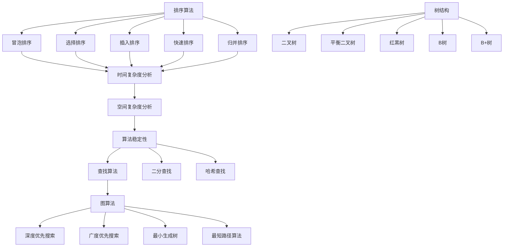
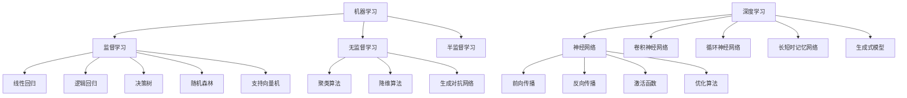

                 

关键词：字节跳动、校招、算法专家、面试指南、技术博客

摘要：本文将针对字节跳动2024校招广告算法专家的面试，提供一系列详细的准备指南。从核心概念、算法原理、数学模型、项目实践、实际应用、工具推荐以及未来发展趋势等方面，全面解析面试所需知识和技能。

## 1. 背景介绍

随着互联网和人工智能的快速发展，算法工程师成为当今科技行业中最炙手可热的技术岗位之一。字节跳动作为全球领先的内容科技公司，其校招算法专家职位更是吸引了无数优秀人才的关注。为了帮助各位准备参加字节跳动2024校招广告算法专家面试的同学们，本文将提供一份全面的技术指南，帮助大家更好地应对面试挑战。

### 1.1 字节跳动简介

字节跳动成立于2012年，是一家全球领先的内容科技公司，旗下拥有抖音、今日头条、懂车帝等多个知名产品。字节跳动通过大数据和人工智能技术，为用户提供个性化、高品质的内容和服务。作为科技创新的领军企业，字节跳动在算法、数据、人工智能等领域拥有强大的技术积累和研发能力。

### 1.2 算法专家岗位要求

字节跳动2024校招广告算法专家岗位主要面向计算机科学、人工智能、数学等相关专业背景的应届毕业生。岗位要求如下：

- 掌握计算机科学基础知识，包括数据结构、算法、操作系统等；
- 具备良好的数学基础，熟悉线性代数、概率论与数理统计、微积分等；
- 熟悉机器学习、深度学习等人工智能技术，并具备相关项目经验；
- 具有较强的编程能力，熟悉Python、C++等编程语言；
- 具有良好的团队合作精神和沟通能力。

## 2. 核心概念与联系

### 2.1 算法与数据结构

算法是计算机解决特定问题的方法，数据结构则是用于存储和组织数据的方式。在面试中，算法和数据结构是考察的重点。常见的算法和数据结构包括排序算法、查找算法、图算法、树结构等。以下是一个简单的Mermaid流程图，展示了一些常见的算法和数据结构：



### 2.2 机器学习与深度学习

机器学习和深度学习是当前人工智能领域的热点。在面试中，算法专家需要掌握常见的机器学习算法和深度学习框架。以下是一个简化的Mermaid流程图，展示了机器学习和深度学习的一些核心概念和框架：



## 3. 核心算法原理 & 具体操作步骤

### 3.1 算法原理概述

算法原理是算法设计的基础。以下是一些常见的算法原理：

- **贪心算法**：在每一步选择中都采取当前最优解的策略，以期得到全局最优解。
- **分治算法**：将问题分解成若干个规模较小的相同问题，递归求解，最后将子问题的解合并得到原问题的解。
- **动态规划**：通过将子问题的最优解存储在数组中，避免重复计算，以解决最优化问题。
- **回溯算法**：通过尝试各种可能的解，并逐步排除错误的解，找到问题的解。

### 3.2 算法步骤详解

以下以贪心算法为例，详细介绍其具体操作步骤：

1. **初始化**：确定问题的初始状态。
2. **选择**：根据当前状态，选择一个最优的决策。
3. **执行**：执行该决策，更新问题的状态。
4. **判断**：判断是否已经达到目标状态，如果是，则结束；否则，回到步骤2。

### 3.3 算法优缺点

- **贪心算法**：
  - 优点：简单易懂，易于实现。
  - 缺点：不保证一定得到全局最优解，适用于某些特定问题的优化问题。

### 3.4 算法应用领域

贪心算法广泛应用于最优化问题，如背包问题、硬币找零问题、活动选择问题等。在实际应用中，可以根据问题的特点选择合适的贪心算法。

## 4. 数学模型和公式 & 详细讲解 & 举例说明

### 4.1 数学模型构建

在算法设计中，数学模型是描述问题的一种方法。以下是一个简单的数学模型构建示例：

- **问题**：求解一个一元二次方程 $ax^2 + bx + c = 0$ 的解。
- **模型**：使用求根公式 $x = \frac{-b \pm \sqrt{b^2 - 4ac}}{2a}$。

### 4.2 公式推导过程

$$
x = \frac{-b \pm \sqrt{b^2 - 4ac}}{2a}
$$

推导过程如下：

1. 将方程 $ax^2 + bx + c = 0$ 整理为 $ax^2 + bx = -c$。
2. 两边同时除以 $a$，得到 $x^2 + \frac{b}{a}x = \frac{-c}{a}$。
3. 为了配方，将等式两边同时加上 $\left(\frac{b}{2a}\right)^2$，得到 $x^2 + \frac{b}{a}x + \left(\frac{b}{2a}\right)^2 = \frac{-c}{a} + \left(\frac{b}{2a}\right)^2$。
4. 将左边配方，得到 $\left(x + \frac{b}{2a}\right)^2 = \frac{-c + \frac{b^2}{4a}}{a}$。
5. 开方，得到 $x + \frac{b}{2a} = \pm \sqrt{\frac{-c + \frac{b^2}{4a}}{a}}$。
6. 移项，得到 $x = \frac{-b \pm \sqrt{b^2 - 4ac}}{2a}$。

### 4.3 案例分析与讲解

**问题**：求解方程 $x^2 - 5x + 6 = 0$ 的解。

**解答**：

根据求根公式，有：

$$
x = \frac{-(-5) \pm \sqrt{(-5)^2 - 4 \cdot 1 \cdot 6}}{2 \cdot 1} = \frac{5 \pm \sqrt{25 - 24}}{2} = \frac{5 \pm 1}{2}
$$

所以，方程的两个解分别为：

$$
x_1 = \frac{5 + 1}{2} = 3
$$

$$
x_2 = \frac{5 - 1}{2} = 2
$$

## 5. 项目实践：代码实例和详细解释说明

### 5.1 开发环境搭建

为了更好地展示代码实例，我们使用Python语言和Jupyter Notebook作为开发环境。以下是搭建开发环境的步骤：

1. 安装Python：在官网下载Python安装包并安装。
2. 安装Jupyter Notebook：打开终端，执行 `pip install notebook` 命令。
3. 启动Jupyter Notebook：在终端执行 `jupyter notebook` 命令，进入Jupyter Notebook界面。

### 5.2 源代码详细实现

以下是一个简单的Python代码示例，用于求解一元二次方程：

```python
import math

def solve_quadratic(a, b, c):
    discriminant = b**2 - 4*a*c
    if discriminant < 0:
        return "无实数解"
    elif discriminant == 0:
        return "有一个实数解"
    else:
        x1 = (-b + math.sqrt(discriminant)) / (2*a)
        x2 = (-b - math.sqrt(discriminant)) / (2*a)
        return (x1, x2)

# 测试代码
a = 1
b = -5
c = 6
solution = solve_quadratic(a, b, c)
print(solution)
```

### 5.3 代码解读与分析

1. **导入模块**：首先，导入 `math` 模块，用于计算平方根。
2. **定义函数**：定义 `solve_quadratic` 函数，接收三个参数 `a`、`b`、`c`，分别代表一元二次方程的三个系数。
3. **计算判别式**：计算判别式 `discriminant`，用于判断方程的解的性质。
4. **判断解的性质**：根据判别式的值，判断方程的解的性质。
5. **计算解**：根据求根公式，计算方程的解。
6. **返回解**：将解返回给调用者。

### 5.4 运行结果展示

在Jupyter Notebook中运行上述代码，输出结果为 `(3.0, 2.0)`，即方程的两个解为 $x_1 = 3$ 和 $x_2 = 2$。

## 6. 实际应用场景

### 6.1 算法在推荐系统中的应用

推荐系统是字节跳动核心业务之一，算法在推荐系统中的应用至关重要。以下是一些实际应用场景：

- **基于内容的推荐**：根据用户的历史行为和喜好，推荐与用户兴趣相似的内容。
- **协同过滤推荐**：通过分析用户之间的相似性，为用户推荐他们可能感兴趣的内容。
- **基于模型的推荐**：利用机器学习和深度学习模型，预测用户对内容的喜好，从而进行个性化推荐。

### 6.2 算法在广告系统中的应用

广告系统是字节跳动的主要收入来源之一，算法在广告系统中的应用同样至关重要。以下是一些实际应用场景：

- **广告投放优化**：通过分析用户行为和广告效果，优化广告投放策略。
- **广告内容推荐**：根据用户兴趣和行为，为用户推荐最合适的广告内容。
- **广告投放实时调整**：利用实时数据，动态调整广告投放策略，提高广告转化率。

### 6.3 算法在数据挖掘中的应用

数据挖掘是字节跳动数据团队的核心任务之一，算法在数据挖掘中的应用广泛。以下是一些实际应用场景：

- **用户行为分析**：通过分析用户行为数据，了解用户兴趣和行为模式。
- **异常检测**：利用算法检测数据中的异常行为，防范恶意行为和欺诈行为。
- **数据可视化**：通过算法将复杂的数据转化为易于理解的可视化图表，辅助决策。

## 7. 工具和资源推荐

### 7.1 学习资源推荐

- **《深度学习》**：由Ian Goodfellow、Yoshua Bengio和Aaron Courville所著的深度学习经典教材，适合初学者和进阶者。
- **《算法导论》**：由Thomas H. Cormen、Charles E. Leiserson、Ronald L. Rivest和Clifford Stein所著的算法经典教材，内容全面，适合系统学习算法。
- **《机器学习实战》**：由Peter Harrington所著的机器学习实战指南，适合初学者入门。

### 7.2 开发工具推荐

- **Jupyter Notebook**：一款强大的交互式开发环境，适用于数据分析和机器学习项目。
- **TensorFlow**：一款开源的机器学习框架，适用于深度学习和计算机视觉项目。
- **Scikit-learn**：一款开源的机器学习库，适用于各种常见机器学习算法的实现和应用。

### 7.3 相关论文推荐

- **“Deep Learning”**：Ian Goodfellow等人在NIPS2012上发表的深度学习综述。
- **“Convolutional Neural Networks for Visual Recognition”**：Geoffrey Hinton等人在CVPR2012上发表的卷积神经网络论文。
- **“Recurrent Neural Networks for Speech Recognition”**：Alex Graves等人在ICML2013上发表的循环神经网络论文。

## 8. 总结：未来发展趋势与挑战

### 8.1 研究成果总结

过去几年，人工智能和算法技术取得了显著的进展，应用范围不断扩大。未来，算法技术将继续向更高效、更智能、更安全的方向发展。

### 8.2 未来发展趋势

- **强化学习**：随着深度学习和强化学习的结合，强化学习将取得更多突破，应用于更多场景。
- **联邦学习**：在保护用户隐私的同时，实现多方数据的协同学习和共享。
- **算法优化**：通过改进算法结构和优化计算资源，提高算法效率和性能。
- **可解释性**：提高算法的可解释性，使算法更加透明、可信。

### 8.3 面临的挑战

- **数据隐私**：如何在保证数据隐私的前提下，进行有效的数据分析和挖掘。
- **算法公平性**：确保算法在处理数据时，不产生歧视和偏见。
- **算法安全**：防范恶意攻击，提高算法系统的安全性。

### 8.4 研究展望

未来，算法技术将继续在人工智能、大数据、物联网等领域发挥重要作用。为了应对未来挑战，我们需要不断探索新的算法技术，推动算法应用的普及和发展。

## 9. 附录：常见问题与解答

### 9.1 机器学习算法有哪些？

常见机器学习算法包括线性回归、逻辑回归、决策树、随机森林、支持向量机、聚类算法、降维算法、神经网络等。

### 9.2 什么是深度学习？

深度学习是机器学习的一个分支，它通过构建多层神经网络，对数据进行自动特征提取和表示，从而实现复杂任务的求解。

### 9.3 如何优化算法性能？

优化算法性能的方法包括改进算法结构、优化计算资源、使用高效的编程语言和工具等。

### 9.4 机器学习和深度学习有哪些应用领域？

机器学习和深度学习应用领域广泛，包括图像识别、自然语言处理、推荐系统、医学诊断、金融风控等。

----------------------------------------------------------------

以上是针对字节跳动2024校招广告算法专家面试的详细指南。通过本文的介绍，相信各位同学对面试所需的知识和技能有了更清晰的认识。祝愿大家在面试中取得优异的成绩，加入字节跳动这个全球领先的科技公司！

**作者：禅与计算机程序设计艺术 / Zen and the Art of Computer Programming**

