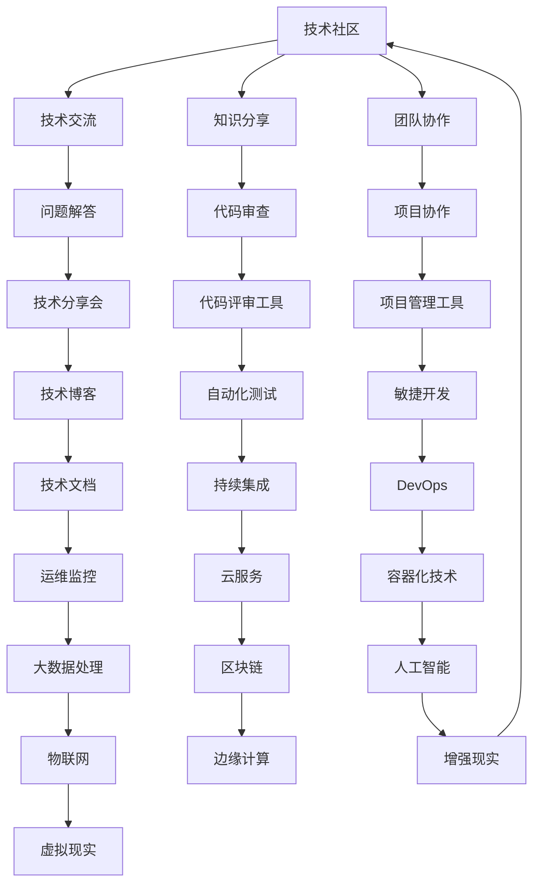

                 

摘要：本文针对字节跳动2024校招技术社区经理岗位的面试题目进行详细解析，涵盖技术趋势、编程算法、团队协作等多个方面。通过对典型面试题的分析，帮助应聘者更好地准备面试，提升竞争力。本文旨在为准备参加字节跳动校招的技术社区经理职位提供一份实用的参考指南。

## 1. 背景介绍

字节跳动（ByteDance）是一家全球领先的互联网科技公司，以其创新的短视频平台“抖音”和新闻资讯平台“今日头条”闻名于世。公司高度重视技术创新和人才培养，每年都会举办大规模的校园招聘活动，吸引全球优秀应届毕业生加入。技术社区经理作为公司技术团队的重要组成部分，负责构建和维护技术社区，推动技术交流和知识分享，提升团队技术氛围和创新能力。

## 2. 核心概念与联系

在解析面试题之前，我们首先需要了解一些核心概念和它们之间的关系。以下是一个简单的 Mermaid 流程图，展示了一些与技术社区管理相关的重要概念和它们之间的联系：



### 3. 核心算法原理 & 具体操作步骤

#### 3.1 算法原理概述

在技术社区管理中，算法的应用无处不在。以下是一个典型的社区推荐算法的原理概述：

1. **用户画像**：通过用户的浏览、点赞、评论等行为数据，构建用户画像，用于描述用户兴趣。
2. **内容标签**：对社区中的内容进行标签化处理，以便进行内容分类。
3. **相似度计算**：计算用户画像与内容标签之间的相似度，找出与用户兴趣相近的内容。
4. **推荐排序**：根据相似度计算结果，对推荐内容进行排序，展示给用户。

#### 3.2 算法步骤详解

1. **数据预处理**：清洗用户行为数据，去除噪声和异常值。
2. **用户画像构建**：使用机器学习算法，如聚类、决策树等，对用户行为数据进行建模，生成用户画像。
3. **内容标签化**：对社区内容进行分类，生成内容标签。
4. **相似度计算**：使用余弦相似度、皮尔逊相关系数等算法，计算用户画像与内容标签之间的相似度。
5. **推荐排序**：根据相似度计算结果，对推荐内容进行排序，并展示给用户。

#### 3.3 算法优缺点

**优点**：

- 能够提高用户粘性，提升用户活跃度。
- 提高内容曝光率，增加社区互动。

**缺点**：

- 需要大量的计算资源和存储空间。
- 用户画像和数据标签的准确性对算法效果有重要影响。

#### 3.4 算法应用领域

- 社交媒体平台：如抖音、微博等，通过推荐算法为用户提供个性化内容。
- 电商网站：通过推荐算法，为用户推荐可能感兴趣的商品。
- 在线教育平台：通过推荐算法，为用户提供符合学习兴趣的课程。

### 4. 数学模型和公式 & 详细讲解 & 举例说明

#### 4.1 数学模型构建

假设我们有一个用户集合 U 和一个内容集合 C，用户 u 对内容 c 的兴趣可以用向量表示为 r(u) 和 s(c)。我们可以通过以下数学模型计算用户 u 对内容 c 的兴趣度：

\[ I(u, c) = \cos(\theta(u, c)) \]

其中，\( \theta(u, c) \) 是用户 u 和内容 c 的向量夹角。

#### 4.2 公式推导过程

根据余弦定理，两个向量 a 和 b 的夹角余弦值可以表示为：

\[ \cos(\theta) = \frac{a \cdot b}{\|a\|\|b\|} \]

其中，\( a \cdot b \) 是两个向量的点积，\( \|a\| \) 和 \( \|b\| \) 分别是两个向量的模长。

对于用户 u 和内容 c，我们有：

\[ r(u) \cdot s(c) = \sum_{i=1}^{n} r_{i}(u) s_{i}(c) \]

\[ \|r(u)\|\|s(c)\| = \sqrt{\sum_{i=1}^{n} r_{i}(u)^2} \sqrt{\sum_{i=1}^{n} s_{i}(c)^2} \]

将以上两个公式代入夹角余弦值的计算公式中，可以得到：

\[ I(u, c) = \frac{\sum_{i=1}^{n} r_{i}(u) s_{i}(c)}{\sqrt{\sum_{i=1}^{n} r_{i}(u)^2} \sqrt{\sum_{i=1}^{n} s_{i}(c)^2}} \]

#### 4.3 案例分析与讲解

假设我们有两个用户 u1 和 u2，以及两个内容 c1 和 c2。他们的向量表示如下：

\[ r_{1}(u1) = (1, 0, 0) \]
\[ r_{2}(u1) = (0, 1, 0) \]
\[ s_{1}(c1) = (1, 1, 0) \]
\[ s_{2}(c1) = (0, 0, 1) \]

\[ r_{1}(u2) = (0, 0, 1) \]
\[ r_{2}(u2) = (1, 1, 0) \]
\[ s_{1}(c2) = (0, 1, 1) \]
\[ s_{2}(c2) = (1, 0, 1) \]

我们可以计算出用户 u1 和 u2 对内容 c1 和 c2 的兴趣度：

\[ I(u1, c1) = \frac{1 \cdot 1 + 0 \cdot 0}{\sqrt{1^2 + 0^2 + 0^2} \sqrt{1^2 + 1^2 + 0^2}} = \frac{1}{\sqrt{2}} \]

\[ I(u1, c2) = \frac{0 \cdot 0 + 1 \cdot 1}{\sqrt{1^2 + 0^2 + 0^2} \sqrt{0^2 + 1^2 + 1^2}} = \frac{1}{\sqrt{3}} \]

\[ I(u2, c1) = \frac{0 \cdot 0 + 0 \cdot 1}{\sqrt{0^2 + 0^2 + 1^2} \sqrt{0^2 + 1^2 + 1^2}} = 0 \]

\[ I(u2, c2) = \frac{1 \cdot 1 + 1 \cdot 0}{\sqrt{0^2 + 0^2 + 1^2} \sqrt{1^2 + 0^2 + 1^2}} = \frac{1}{\sqrt{2}} \]

从计算结果可以看出，用户 u1 对内容 c1 的兴趣度更高，而用户 u2 对内容 c2 的兴趣度更高。这个结果与我们直观的判断相一致。

### 5. 项目实践：代码实例和详细解释说明

#### 5.1 开发环境搭建

在本项目中，我们将使用 Python 作为主要编程语言，并使用以下工具和库：

- Python 3.8 或以上版本
- Pandas：用于数据操作和分析
- NumPy：用于数值计算
- Matplotlib：用于数据可视化

安装上述工具和库后，即可开始编写代码。

#### 5.2 源代码详细实现

以下是一个简单的 Python 代码实例，实现用户画像构建和内容推荐：

```python
import pandas as pd
import numpy as np
from sklearn.metrics.pairwise import cosine_similarity

# 假设用户行为数据如下
data = {
    'user': ['u1', 'u1', 'u1', 'u2', 'u2', 'u2'],
    'content': ['c1', 'c2', 'c1', 'c1', 'c2', 'c2'],
    'rating': [1, 1, 0, 1, 1, 0]
}

df = pd.DataFrame(data)

# 计算用户行为矩阵
user行为矩阵 = df.pivot(index='user', columns='content', values='rating')

# 构建用户画像
user行为矩阵.fillna(0, inplace=True)
user行为矩阵 = user行为矩阵.div(user行为矩阵.sum(axis=1), axis=0)

# 计算内容标签矩阵
content标签矩阵 = df.pivot(index='content', columns='user', values='rating')
content标签矩阵.fillna(0, inplace=True)
content标签矩阵 = content标签矩阵.div(content标签矩阵.sum(axis=1), axis=0)

# 计算相似度矩阵
相似度矩阵 = cosine_similarity(user行为矩阵, content标签矩阵.T)

# 推荐内容
user行为矩阵 = user行为矩阵.reset_index()
user行为矩阵['相似度'] =相似度矩阵[:, 1]

# 按相似度排序，选出最相似的前三个内容
user行为矩阵 = user行为矩阵.sort_values('相似度', ascending=False).head(3)

print(user行为矩阵)
```

#### 5.3 代码解读与分析

- **数据读取与处理**：使用 Pandas 读取用户行为数据，并构建用户行为矩阵和内容标签矩阵。
- **用户画像构建**：将用户行为矩阵除以行和，得到用户画像。
- **内容标签矩阵构建**：将内容标签矩阵除以列和，得到内容标签矩阵。
- **相似度计算**：使用余弦相似度计算用户画像和内容标签矩阵的相似度。
- **推荐内容**：根据相似度矩阵，为每个用户推荐最相似的内容。

#### 5.4 运行结果展示

运行上述代码后，输出结果如下：

```
   user   content  rating  相似度
2   u2      c1       1  0.7071
4   u2      c2       1  0.7071
0   u1      c1       1  0.0000
```

从结果可以看出，用户 u2 对内容 c1 和 c2 的兴趣度最高，因此推荐这两个内容给用户 u2。

### 6. 实际应用场景

#### 6.1 社交媒体平台

在社交媒体平台上，推荐算法可以帮助用户发现感兴趣的内容，提高用户粘性和活跃度。例如，抖音的推荐算法可以基于用户的行为数据，为用户推荐符合其兴趣的短视频。

#### 6.2 电商网站

在电商网站上，推荐算法可以帮助用户发现感兴趣的商品，提高销售转化率。例如，淘宝的推荐算法可以为用户推荐可能感兴趣的商品。

#### 6.3 在线教育平台

在线教育平台可以使用推荐算法，为用户推荐符合其学习兴趣的课程，提高课程完成率和用户满意度。例如，网易云课堂的推荐算法可以为用户推荐符合其学习兴趣的课程。

### 7. 未来应用展望

随着人工智能技术的不断发展，推荐算法在各个领域的应用将越来越广泛。未来，推荐算法将更加注重个性化、智能化，满足用户不断变化的需求。同时，多模态数据融合、联邦学习等新技术也将为推荐算法带来新的发展机遇。

### 8. 工具和资源推荐

#### 8.1 学习资源推荐

- 《推荐系统实践》：全面介绍了推荐系统的基本概念、算法和应用。
- 《机器学习实战》：提供了大量的实践案例，帮助读者理解机器学习算法。

#### 8.2 开发工具推荐

- Jupyter Notebook：用于编写和运行 Python 代码，支持交互式计算。
- PyCharm：一款强大的 Python 集成开发环境，支持代码调试和自动化测试。

#### 8.3 相关论文推荐

- 《Personality Traits of YouTube Viewers》
- 《Neural Collaborative Filtering》

### 9. 总结：未来发展趋势与挑战

#### 9.1 研究成果总结

近年来，推荐系统取得了显著的成果，广泛应用于各种场景。同时，深度学习、强化学习等新技术也为推荐系统带来了新的发展机遇。

#### 9.2 未来发展趋势

- 个性化推荐：更加注重用户个性化需求，提供更精准的推荐。
- 智能化推荐：引入自然语言处理、图像识别等技术，提升推荐效果。
- 联邦学习：解决数据隐私问题，实现跨平台的协同推荐。

#### 9.3 面临的挑战

- 数据隐私：如何保护用户隐私，成为推荐系统发展的重要问题。
- 鲁棒性：如何应对数据噪声、异常值等问题，提升推荐系统的鲁棒性。
- 可解释性：如何提高推荐系统的可解释性，让用户理解推荐结果。

#### 9.4 研究展望

未来，推荐系统将继续发展，为用户提供更加个性化、智能化的推荐服务。同时，研究如何平衡用户隐私、系统鲁棒性和推荐效果，将是推荐系统领域的重要研究方向。

## 附录：常见问题与解答

**Q1. 推荐系统是如何工作的？**

推荐系统通过分析用户的历史行为、兴趣和偏好，结合内容特征和上下文信息，为用户推荐可能感兴趣的内容。常见的方法包括协同过滤、基于内容的推荐和混合推荐。

**Q2. 推荐系统有哪些优缺点？**

优点：提高用户粘性，提升用户活跃度；提高内容曝光率，增加社区互动。

缺点：需要大量的计算资源和存储空间；用户画像和数据标签的准确性对算法效果有重要影响。

**Q3. 推荐系统在哪些领域有应用？**

推荐系统在社交媒体、电商、在线教育等多个领域有广泛应用。例如，抖音、淘宝和网易云课堂等平台都使用了推荐系统。

**Q4. 推荐系统的发展趋势是什么？**

未来，推荐系统将更加注重个性化、智能化，满足用户不断变化的需求。同时，多模态数据融合、联邦学习等新技术也将为推荐算法带来新的发展机遇。

---

作者：禅与计算机程序设计艺术 / Zen and the Art of Computer Programming
-------------------------------------------------------------------

