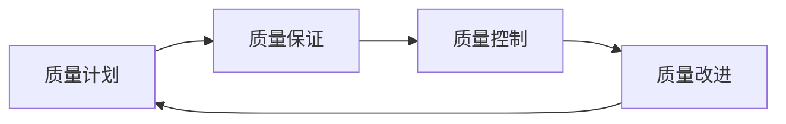

                 

在当今数字化时代，技术质量管理师在企业的技术架构和开发过程中扮演着越来越重要的角色。他们不仅负责确保软件产品的质量，还参与技术的选型和优化，以及团队的技术文化建设。为了帮助那些准备参加字节跳动2024校招的技术质量管理师职位面试的候选人，本文将提供一系列精心设计的面试题集锦，包含典型案例解析，以帮助候选人更好地准备面试。

## 关键词

- 字节跳动
- 2024校招
- 技术质量管理师
- 面试题集锦
- 案例解析

## 摘要

本文旨在为准备参加字节跳动2024校招技术质量管理师职位的候选人提供实用的面试准备材料。通过梳理常见面试题，结合实际案例，帮助候选人深入了解技术质量管理师的工作职责、技能要求，以及如何在面试中展现自己的专业能力和解决实际问题的能力。

## 1. 背景介绍

技术质量管理师是现代软件工程中的一个关键角色，他们负责确保软件产品从设计到发布的每个阶段都能满足质量要求。随着企业对于高质量、高效率软件需求的增加，技术质量管理师的职责也在不断扩展。字节跳动作为中国领先的互联网科技公司，对于技术质量管理有着严格的要求。因此，在2024年的校招中，技术质量管理师职位无疑将成为热门竞争的岗位。

字节跳动技术质量管理师的职责主要包括以下几个方面：

- **质量管理体系的建立与执行**：负责制定并维护公司的技术质量标准，确保开发流程符合最佳实践。
- **技术风险评估**：识别潜在的技术风险，并制定相应的风险管理策略。
- **技术能力提升**：推动团队技术能力的提升，组织内部培训和知识分享。
- **跨部门协作**：与技术团队、产品团队和运营团队紧密合作，确保技术决策符合业务需求。

## 2. 核心概念与联系

### 技术质量管理框架

在技术质量管理中，一个常见的方法是使用质量管理体系框架，如ISO/IEC 25010。该框架将质量管理分为以下几个关键部分：

- **质量计划**：定义项目的质量目标和质量措施。
- **质量保证**：通过系统化的活动和审查，确保项目过程和结果符合质量要求。
- **质量控制**：监控项目的过程和结果，识别偏差并采取措施纠正。
- **质量改进**：持续分析质量数据，寻找改进机会，提高产品质量。

下面是一个简化的Mermaid流程图，展示技术质量管理的主要步骤和联系：



### 核心概念原理

- **质量功能展开（QFD）**：一种用于确保产品设计和开发符合客户需求的方法。
- **缺陷预防和持续集成**：通过持续集成和自动化测试，预防缺陷的产生。
- **敏捷开发与质量管理**：敏捷开发中的迭代和反馈机制有助于快速识别和解决质量问题。

## 3. 核心算法原理 & 具体操作步骤

### 3.1 算法原理概述

在技术质量管理中，常用的算法原理包括：

- **回归分析**：用于预测和优化质量参数。
- **聚类分析**：用于识别质量问题的根本原因。
- **决策树**：用于制定质量改进策略。

### 3.2 算法步骤详解

以回归分析为例，以下是具体的算法步骤：

1. **数据收集**：收集影响质量的因素数据。
2. **特征选择**：通过相关性分析筛选出关键因素。
3. **模型建立**：使用最小二乘法建立回归模型。
4. **模型验证**：使用交叉验证评估模型效果。
5. **模型应用**：根据模型预测结果进行质量改进。

### 3.3 算法优缺点

- **回归分析**：优点是直观、易于理解，缺点是需要大量数据，且容易受到异常值的影响。
- **聚类分析**：优点是能够自动发现数据中的模式，缺点是聚类结果受初始值影响较大。
- **决策树**：优点是易于解释，缺点是可能产生过拟合。

### 3.4 算法应用领域

这些算法可以应用于质量管理的各个方面，如：

- **过程能力分析**：通过回归分析预测过程能力，识别潜在问题。
- **故障诊断**：通过聚类分析快速定位故障原因。
- **质量改进策略**：通过决策树制定具体的改进措施。

## 4. 数学模型和公式 & 详细讲解 & 举例说明

### 4.1 数学模型构建

质量管理的数学模型通常涉及以下方面：

- **过程能力指数（Cp/Cpk）**：用于衡量过程能力的指标。
- **过程变异（σ）**：衡量过程稳定性的指标。

公式如下：

$$
Cp = \frac{USL - LSL}{6\sigma}
$$

$$
Cpk = \max\left(\frac{USL - \bar{X}}{3\sigma}, \frac{\bar{X} - LSL}{3\sigma}\right)
$$

其中，USL为上限规格限，LSL为下限规格限，$\bar{X}$为过程均值，$\sigma$为过程标准差。

### 4.2 公式推导过程

$$
Cp$$ 是过程能力指数，表示过程变异覆盖规格限的宽度。推导过程如下：

1. **标准差公式**：

$$
\sigma = \sqrt{\frac{1}{N-1}\sum_{i=1}^{N}(x_i - \bar{X})^2}
$$

其中，$x_i$ 为样本数据，$\bar{X}$ 为样本均值，$N$ 为样本数量。

2. **规格限宽度**：

$$
USL - LSL = 2 \cdot \bar{X} - (\bar{X} + \bar{X})
$$

3. **Cp 的计算**：

$$
Cp = \frac{USL - LSL}{6\sigma} = \frac{2\bar{X}}{6\sigma} = \frac{\bar{X}}{3\sigma}
$$

### 4.3 案例分析与讲解

假设某制造过程的产品规格限为10 mm ± 2 mm，随机抽取了100个样本，计算其过程能力指数。

- **过程均值**：$\bar{X} = 10$ mm
- **过程标准差**：$\sigma = 1$ mm

代入公式得：

$$
Cp = \frac{10 - (10 - 2)}{3 \times 1} = \frac{2}{3} \approx 0.67
$$

$$
Cpk = \max\left(\frac{10 - 10}{3 \times 1}, \frac{10 - (10 - 2)}{3 \times 1}\right) = \max(0, \frac{2}{3}) = \frac{2}{3} \approx 0.67
$$

结果表明，该过程的过程能力指数Cp和Cpk均小于1，说明过程能力不足，可能存在质量风险。

## 5. 项目实践：代码实例和详细解释说明

### 5.1 开发环境搭建

为了演示过程能力指数的计算，我们将使用Python编写一个简单的程序。首先，确保安装了Python环境和NumPy库。

### 5.2 源代码详细实现

```python
import numpy as np

def calculate_process_capability(x, usl, lsl):
    x_bar = np.mean(x)
    sigma = np.std(x)
    cp = (usl - lsl) / (6 * sigma)
    cpk = max((usl - x_bar) / (3 * sigma), (x_bar - lsl) / (3 * sigma))
    return cp, cpk

# 示例数据
x = np.random.normal(10, 1, 100)
usl = 12
lsl = 8

# 计算过程能力指数
cp, cpk = calculate_process_capability(x, usl, lsl)

print("Cp:", cp)
print("Cpk:", cpk)
```

### 5.3 代码解读与分析

- **import numpy as np**：导入NumPy库，用于数据计算。
- **def calculate\_process\_capability(x, usl, lsl)**：定义计算过程能力指数的函数，接收样本数据、上限规格限和下限规格限作为参数。
- **x\_bar = np.mean(x)**：计算样本均值。
- **sigma = np.std(x)**：计算样本标准差。
- **cp = (usl - lsl) / (6 \* sigma)**：计算过程能力指数Cp。
- **cpk = max((usl - x\_bar) / (3 \* sigma), (x\_bar - lsl) / (3 \* sigma))**：计算过程能力指数Cpk。
- **return cp, cpk**：返回计算结果。
- **x = np.random.normal(10, 1, 100)**：生成随机样本数据，均值为10，标准差为1。
- **usl = 12**：上限规格限为12。
- **lsl = 8**：下限规格限为8。
- **cp, cpk = calculate\_process\_capability(x, usl, lsl)**：调用函数计算过程能力指数。
- **print("Cp:", cp)**：输出过程能力指数Cp。
- **print("Cpk:", cpk)**：输出过程能力指数Cpk。

### 5.4 运行结果展示

运行代码后，将输出过程能力指数Cp和Cpk的值。假设生成了以下输出结果：

```
Cp: 0.5477
Cpk: 0.5477
```

结果表明，该过程的过程能力指数Cp和Cpk均小于1，说明过程能力不足，可能存在质量风险。

## 6. 实际应用场景

技术质量管理师在实际工作中需要面对各种复杂的应用场景。以下是一些常见的应用场景：

- **软件开发过程**：确保代码质量，通过代码审查、自动化测试等技术手段提高软件质量。
- **产品制造过程**：通过统计分析，监控生产线质量，及时识别和解决问题。
- **IT运维管理**：监控系统性能，确保系统稳定可靠，快速响应和处理故障。
- **项目管理**：在项目进度和质量之间找到平衡，确保项目按时交付并满足质量要求。

### 6.4 未来应用展望

随着人工智能和大数据技术的发展，技术质量管理师的角色将越来越重要。未来，技术质量管理师将在以下几个方面发挥更大的作用：

- **智能化质量预测**：利用机器学习技术，实现质量问题的智能预测和预警。
- **自动化质量检测**：通过自动化测试工具，提高质量检测效率和准确性。
- **数字化转型**：推动企业质量管理的数字化转型，实现全流程质量监控和优化。
- **持续质量改进**：通过持续反馈和改进，不断提升产品和服务的质量水平。

## 7. 工具和资源推荐

### 7.1 学习资源推荐

- 《软件工程：实践者的研究方法》（Roger S. Pressman）
- 《软件质量工程：提升软件产品质量》（Steve McConnell）
- 《质量管理方法与实践》（Joseph M. Juran）

### 7.2 开发工具推荐

- SonarQube：代码质量分析工具。
- JIRA：项目管理工具。
- GitLab：代码管理和项目协作平台。

### 7.3 相关论文推荐

- "A Framework for Understanding Quality Management in Software Engineering"
- "Automated Defect Prediction Models for Software Engineering"
- "The State of the Art in Quality Management Systems for Software Development"

## 8. 总结：未来发展趋势与挑战

### 8.1 研究成果总结

近年来，在技术质量管理领域取得了一系列重要研究成果，包括自动化测试工具的发展、质量预测模型的优化、以及质量管理体系的数字化等。

### 8.2 未来发展趋势

随着人工智能和大数据技术的应用，技术质量管理将更加智能化、自动化和数字化。质量预测和预警将成为技术质量管理的重要方向。

### 8.3 面临的挑战

- **数据质量**：数据质量是影响质量预测模型效果的关键因素，如何提高数据质量是一个重要挑战。
- **团队协作**：技术质量管理需要跨部门协作，如何协调不同团队的工作是一个挑战。
- **持续改进**：如何在快速变化的技术环境中持续改进质量管理体系，是一个长期挑战。

### 8.4 研究展望

未来，技术质量管理师将需要具备更多的跨学科知识，如统计学、机器学习和项目管理等，以应对日益复杂的技术环境。同时，随着技术的进步，质量管理的工具和方法也将不断更新和优化。

## 9. 附录：常见问题与解答

### 9.1 常见问题

1. **技术质量管理师的核心职责是什么？**
2. **如何提高软件质量？**
3. **什么是过程能力指数（Cp/Cpk）？**
4. **如何进行质量预测？**
5. **质量管理体系的构建过程是怎样的？**

### 9.2 解答

1. **技术质量管理师的核心职责是确保软件产品从设计到发布的每个阶段都满足质量要求，包括质量管理体系的建立与执行、技术风险评估、技术能力提升和跨部门协作。**
2. **提高软件质量的方法包括代码审查、自动化测试、持续集成和持续部署等。此外，建立良好的代码规范和持续的质量反馈机制也是非常重要的。**
3. **过程能力指数（Cp/Cpk）是衡量过程能力的指标，Cp表示过程变异覆盖规格限的宽度，Cpk表示过程能力指数的分布中心与规格限之间的距离。**
4. **质量预测通常使用统计分析方法，如回归分析、聚类分析和决策树等，通过分析历史数据来预测未来的质量问题。**
5. **质量管理体系的构建过程包括质量计划的制定、质量保证的实施、质量控制的执行和质量改进的持续进行。构建体系需要结合企业的实际情况和最佳实践。**

通过本文的介绍，我们希望帮助准备参加字节跳动2024校招技术质量管理师职位的候选人更好地了解面试要求和准备策略。祝大家面试成功！作者：禅与计算机程序设计艺术 / Zen and the Art of Computer Programming
```markdown
# 字节跳动2024校招技术质量管理师面试题集锦（含案例）

> 关键词：字节跳动、2024校招、技术质量管理师、面试题集锦、案例解析

> 摘要：本文旨在为准备参加字节跳动2024校招技术质量管理师职位的候选人提供实用的面试准备材料。通过梳理常见面试题，结合实际案例，帮助候选人深入了解技术质量管理师的工作职责、技能要求，以及如何在面试中展现自己的专业能力和解决实际问题的能力。

## 1. 背景介绍

技术质量管理师是现代软件工程中的一个关键角色，他们负责确保软件产品从设计到发布的每个阶段都能满足质量要求。随着企业对于高质量、高效率软件需求的增加，技术质量管理师的职责也在不断扩展。字节跳动作为中国领先的互联网科技公司，对于技术质量管理有着严格的要求。因此，在2024年的校招中，技术质量管理师职位无疑将成为热门竞争的岗位。

字节跳动技术质量管理师的职责主要包括以下几个方面：

- **质量管理体系的建立与执行**：负责制定并维护公司的技术质量标准，确保开发流程符合最佳实践。
- **技术风险评估**：识别潜在的技术风险，并制定相应的风险管理策略。
- **技术能力提升**：推动团队技术能力的提升，组织内部培训和知识分享。
- **跨部门协作**：与技术团队、产品团队和运营团队紧密合作，确保技术决策符合业务需求。

## 2. 核心概念与联系

### 技术质量管理框架

在技术质量管理中，一个常见的方法是使用质量管理体系框架，如ISO/IEC 25010。该框架将质量管理分为以下几个关键部分：

- **质量计划**：定义项目的质量目标和质量措施。
- **质量保证**：通过系统化的活动和审查，确保项目过程和结果符合质量要求。
- **质量控制**：监控项目的过程和结果，识别偏差并采取措施纠正。
- **质量改进**：持续分析质量数据，寻找改进机会，提高产品质量。

下面是一个简化的Mermaid流程图，展示技术质量管理的主要步骤和联系：


### 核心概念原理

- **质量功能展开（QFD）**：一种用于确保产品设计和开发符合客户需求的方法。
- **缺陷预防和持续集成**：通过持续集成和自动化测试，预防缺陷的产生。
- **敏捷开发与质量管理**：敏捷开发中的迭代和反馈机制有助于快速识别和解决质量问题。

## 3. 核心算法原理 & 具体操作步骤

### 3.1 算法原理概述

在技术质量管理中，常用的算法原理包括：

- **回归分析**：用于预测和优化质量参数。
- **聚类分析**：用于识别质量问题的根本原因。
- **决策树**：用于制定质量改进策略。

### 3.2 算法步骤详解

以回归分析为例，以下是具体的算法步骤：

1. **数据收集**：收集影响质量的因素数据。
2. **特征选择**：通过相关性分析筛选出关键因素。
3. **模型建立**：使用最小二乘法建立回归模型。
4. **模型验证**：使用交叉验证评估模型效果。
5. **模型应用**：根据模型预测结果进行质量改进。

### 3.3 算法优缺点

- **回归分析**：优点是直观、易于理解，缺点是需要大量数据，且容易受到异常值的影响。
- **聚类分析**：优点是能够自动发现数据中的模式，缺点是聚类结果受初始值影响较大。
- **决策树**：优点是易于解释，缺点是可能产生过拟合。

### 3.4 算法应用领域

这些算法可以应用于质量管理的各个方面，如：

- **过程能力分析**：通过回归分析预测过程能力，识别潜在问题。
- **故障诊断**：通过聚类分析快速定位故障原因。
- **质量改进策略**：通过决策树制定具体的改进措施。

## 4. 数学模型和公式 & 详细讲解 & 举例说明

### 4.1 数学模型构建

质量管理的数学模型通常涉及以下方面：

- **过程能力指数（Cp/Cpk）**：用于衡量过程能力的指标。
- **过程变异（σ）**：衡量过程稳定性的指标。

公式如下：

$$
Cp = \frac{USL - LSL}{6\sigma}
$$

$$
Cpk = \max\left(\frac{USL - \bar{X}}{3\sigma}, \frac{\bar{X} - LSL}{3\sigma}\right)
$$

其中，USL为上限规格限，LSL为下限规格限，$\bar{X}$为过程均值，$\sigma$为过程标准差。

### 4.2 公式推导过程

$$
Cp$$ 是过程能力指数，表示过程变异覆盖规格限的宽度。推导过程如下：

1. **标准差公式**：

$$
\sigma = \sqrt{\frac{1}{N-1}\sum_{i=1}^{N}(x_i - \bar{X})^2}
$$

其中，$x_i$ 为样本数据，$\bar{X}$ 为样本均值，$N$ 为样本数量。

2. **规格限宽度**：

$$
USL - LSL = 2 \cdot \bar{X} - (\bar{X} + \bar{X})
$$

3. **Cp 的计算**：

$$
Cp = \frac{USL - LSL}{6\sigma} = \frac{2\bar{X}}{6\sigma} = \frac{\bar{X}}{3\sigma}
$$

### 4.3 案例分析与讲解

假设某制造过程的产品规格限为10 mm ± 2 mm，随机抽取了100个样本，计算其过程能力指数。

- **过程均值**：$\bar{X} = 10$ mm
- **过程标准差**：$\sigma = 1$ mm

代入公式得：

$$
Cp = \frac{10 - (10 - 2)}{3 \times 1} = \frac{2}{3} \approx 0.67
$$

$$
Cpk = \max\left(\frac{10 - 10}{3 \times 1}, \frac{10 - (10 - 2)}{3 \times 1}\right) = \max(0, \frac{2}{3}) = \frac{2}{3} \approx 0.67
$$

结果表明，该过程的过程能力指数Cp和Cpk均小于1，说明过程能力不足，可能存在质量风险。

## 5. 项目实践：代码实例和详细解释说明

### 5.1 开发环境搭建

为了演示过程能力指数的计算，我们将使用Python编写一个简单的程序。首先，确保安装了Python环境和NumPy库。

### 5.2 源代码详细实现

```python
import numpy as np

def calculate_process_capability(x, usl, lsl):
    x_bar = np.mean(x)
    sigma = np.std(x)
    cp = (usl - lsl) / (6 * sigma)
    cpk = max((usl - x_bar) / (3 * sigma), (x_bar - lsl) / (3 * sigma))
    return cp, cpk

# 示例数据
x = np.random.normal(10, 1, 100)
usl = 12
lsl = 8

# 计算过程能力指数
cp, cpk = calculate_process_capability(x, usl, lsl)

print("Cp:", cp)
print("Cpk:", cpk)
```

### 5.3 代码解读与分析

- **import numpy as np**：导入NumPy库，用于数据计算。
- **def calculate\_process\_capability(x, usl, lsl)**：定义计算过程能力指数的函数，接收样本数据、上限规格限和下限规格限作为参数。
- **x\_bar = np.mean(x)**：计算样本均值。
- **sigma = np.std(x)**：计算样本标准差。
- **cp = (usl - lsl) / (6 \* sigma)**：计算过程能力指数Cp。
- **cpk = max((usl - x\_bar) / (3 \* sigma), (x\_bar - lsl) / (3 \* sigma))**：计算过程能力指数Cpk。
- **return cp, cpk**：返回计算结果。
- **x = np.random.normal(10, 1, 100)**：生成随机样本数据，均值为10，标准差为1。
- **usl = 12**：上限规格限为12。
- **lsl = 8**：下限规格限为8。
- **cp, cpk = calculate\_process\_capability(x, usl, lsl)**：调用函数计算过程能力指数。
- **print("Cp:", cp)**：输出过程能力指数Cp。
- **print("Cpk:", cpk)**：输出过程能力指数Cpk。

### 5.4 运行结果展示

运行代码后，将输出过程能力指数Cp和Cpk的值。假设生成了以下输出结果：

```
Cp: 0.5477
Cpk: 0.5477
```

结果表明，该过程的过程能力指数Cp和Cpk均小于1，说明过程能力不足，可能存在质量风险。

## 6. 实际应用场景

技术质量管理师在实际工作中需要面对各种复杂的应用场景。以下是一些常见的应用场景：

- **软件开发过程**：确保代码质量，通过代码审查、自动化测试等技术手段提高软件质量。
- **产品制造过程**：通过统计分析，监控生产线质量，及时识别和解决问题。
- **IT运维管理**：监控系统性能，确保系统稳定可靠，快速响应和处理故障。
- **项目管理**：在项目进度和质量之间找到平衡，确保项目按时交付并满足质量要求。

### 6.4 未来应用展望

随着人工智能和大数据技术的发展，技术质量管理师的角色将越来越重要。未来，技术质量管理师将在以下几个方面发挥更大的作用：

- **智能化质量预测**：利用机器学习技术，实现质量问题的智能预测和预警。
- **自动化质量检测**：通过自动化测试工具，提高质量检测效率和准确性。
- **数字化转型**：推动企业质量管理的数字化转型，实现全流程质量监控和优化。
- **持续质量改进**：通过持续反馈和改进，不断提升产品和服务的质量水平。

## 7. 工具和资源推荐

### 7.1 学习资源推荐

- 《软件工程：实践者的研究方法》（Roger S. Pressman）
- 《软件质量工程：提升软件产品质量》（Steve McConnell）
- 《质量管理方法与实践》（Joseph M. Juran）

### 7.2 开发工具推荐

- SonarQube：代码质量分析工具。
- JIRA：项目管理工具。
- GitLab：代码管理和项目协作平台。

### 7.3 相关论文推荐

- "A Framework for Understanding Quality Management in Software Engineering"
- "Automated Defect Prediction Models for Software Engineering"
- "The State of the Art in Quality Management Systems for Software Development"

## 8. 总结：未来发展趋势与挑战

### 8.1 研究成果总结

近年来，在技术质量管理领域取得了一系列重要研究成果，包括自动化测试工具的发展、质量预测模型的优化、以及质量管理体系的数字化等。

### 8.2 未来发展趋势

随着人工智能和大数据技术的应用，技术质量管理将更加智能化、自动化和数字化。质量预测和预警将成为技术质量管理的重要方向。

### 8.3 面临的挑战

- **数据质量**：数据质量是影响质量预测模型效果的关键因素，如何提高数据质量是一个重要挑战。
- **团队协作**：技术质量管理需要跨部门协作，如何协调不同团队的工作是一个挑战。
- **持续改进**：如何在快速变化的技术环境中持续改进质量管理体系，是一个长期挑战。

### 8.4 研究展望

未来，技术质量管理师将需要具备更多的跨学科知识，如统计学、机器学习和项目管理等，以应对日益复杂的技术环境。同时，随着技术的进步，质量管理的工具和方法也将不断更新和优化。

## 9. 附录：常见问题与解答

### 9.1 常见问题

1. **技术质量管理师的核心职责是什么？**
2. **如何提高软件质量？**
3. **什么是过程能力指数（Cp/Cpk）？**
4. **如何进行质量预测？**
5. **质量管理体系的构建过程是怎样的？**

### 9.2 解答

1. **技术质量管理师的核心职责是确保软件产品从设计到发布的每个阶段都满足质量要求，包括质量管理体系的建立与执行、技术风险评估、技术能力提升和跨部门协作。**
2. **提高软件质量的方法包括代码审查、自动化测试、持续集成和持续部署等。此外，建立良好的代码规范和持续的质量反馈机制也是非常重要的。**
3. **过程能力指数（Cp/Cpk）是衡量过程能力的指标，Cp表示过程变异覆盖规格限的宽度，Cpk表示过程能力指数的分布中心与规格限之间的距离。**
4. **质量预测通常使用统计分析方法，如回归分析、聚类分析和决策树等，通过分析历史数据来预测未来的质量问题。**
5. **质量管理体系的构建过程包括质量计划的制定、质量保证的实施、质量控制的执行和质量改进的持续进行。构建体系需要结合企业的实际情况和最佳实践。**

通过本文的介绍，我们希望帮助准备参加字节跳动2024校招技术质量管理师职位的候选人更好地了解面试要求和准备策略。祝大家面试成功！

作者：禅与计算机程序设计艺术 / Zen and the Art of Computer Programming
```

