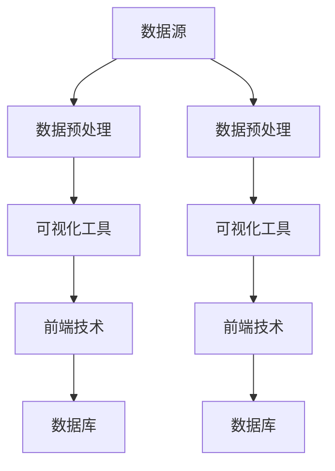

                 

在当今数据驱动的时代，数据可视化已成为企业决策的重要工具。字节跳动作为国内领先的新媒体平台，其对数据可视化工程师的需求持续增长。本文将详细解析字节跳动2024校招数据可视化工程师的面试题，旨在帮助读者更好地准备此类面试，提升求职成功率。

## 关键词

- 字节跳动
- 数据可视化
- 校招面试题
- 数据工程师
- 技术面试

## 摘要

本文将围绕字节跳动2024校招数据可视化工程师的面试题进行详细解析。我们将探讨数据可视化的重要性，介绍常见的数据可视化工具和技术，并深入分析面试中的问题，包括数据预处理、图表设计原则、前端技术实现以及数据可视化的实际应用等。通过本文的解析，读者可以更全面地了解数据可视化领域的专业知识和应对面试的策略。

### 1. 背景介绍

#### 1.1 字节跳动简介

字节跳动成立于2012年，是一家中国领先的互联网科技公司，旗下拥有今日头条、抖音、TikTok等多个知名产品。公司专注于人工智能、数据挖掘、内容推荐等领域，致力于通过技术创新为用户提供个性化、智能化的信息和服务。

#### 1.2 数据可视化工程师职责

数据可视化工程师是负责将复杂的数据转化为直观、易于理解的可视化图表的专业人才。他们的工作主要包括以下几个方面：

- 设计并实现数据可视化方案，帮助用户理解和分析数据。
- 开发可视化工具和系统，支持数据分析流程。
- 跟踪和优化可视化性能，确保数据展示的准确性和实时性。
- 与数据分析师、产品经理和设计师紧密合作，确保可视化方案符合业务需求。

#### 1.3 数据可视化的重要性

数据可视化在现代企业中的重要性日益凸显。通过可视化的方式，企业可以更直观地展示数据趋势、发现数据中的异常和关联，从而做出更明智的决策。以下是数据可视化的一些关键优势：

- 提高数据可访问性：通过图表、地图、交互式界面等，使数据更容易被理解和应用。
- 加速决策过程：帮助决策者快速识别关键信息，减少不必要的分析时间。
- 促进沟通和协作：通过直观的视觉呈现，促进团队成员之间的信息共享和讨论。
- 提升用户体验：在产品设计中融入数据可视化，提升用户对产品的认知和使用体验。

### 2. 核心概念与联系

在数据可视化中，理解核心概念和联系是非常重要的。以下是几个关键概念和它们之间的联系：

#### 2.1 数据源

数据可视化始于数据源。数据源可以是数据库、API、文件系统等，提供原始数据，是可视化的基础。

#### 2.2 数据预处理

数据预处理是数据可视化的关键步骤，包括数据清洗、数据转换和数据归一化。通过预处理，我们可以确保数据的准确性和一致性，为后续的可视化分析打下基础。

#### 2.3 可视化工具

可视化工具是数据可视化工程师的利器，例如D3.js、ECharts、Tableau等。这些工具提供了丰富的图表类型和交互功能，帮助开发者轻松实现数据可视化。

#### 2.4 前端技术

前端技术如HTML、CSS、JavaScript等，是数据可视化实现的基础。前端技术不仅提供了图表的展示方式，还实现了与用户的交互功能。

#### 2.5 数据库

数据库是数据可视化的重要数据存储和管理工具。常用的数据库技术包括关系型数据库（如MySQL、PostgreSQL）和非关系型数据库（如MongoDB、Redis）。

以下是数据可视化中核心概念和联系的Mermaid流程图：



### 3. 核心算法原理 & 具体操作步骤

在数据可视化中，核心算法原理和具体操作步骤对于实现高质量的视觉效果至关重要。以下将详细探讨数据可视化中的几个核心算法原理和操作步骤。

#### 3.1 算法原理概述

数据可视化中的核心算法原理主要包括：

- 数据聚合：将大量数据按照某种规则进行分组和汇总，以突出关键特征。
- 数据映射：将数据属性映射到视觉元素（如颜色、大小、形状等），以直观地表示数据特征。
- 数据交互：通过交互技术（如鼠标事件、滚动等）提供与用户的交互体验。
- 数据可视化：利用图形、图表、地图等视觉元素，将数据转化为直观的可视化表示。

#### 3.2 算法步骤详解

以下是一个数据可视化的基本算法步骤：

1. **数据收集与预处理**：收集数据源中的数据，并进行数据清洗、转换和归一化。
2. **数据分析和选择**：分析数据，选择需要可视化的关键数据集。
3. **选择可视化类型**：根据数据特征和业务需求，选择合适的可视化类型（如折线图、柱状图、饼图等）。
4. **数据映射**：将数据属性映射到视觉元素，如颜色、大小、形状等。
5. **设计可视化布局**：根据可视化类型和数据特征，设计合适的布局和交互方式。
6. **实现可视化**：使用可视化工具和前端技术，实现数据可视化。
7. **测试和优化**：测试可视化效果，优化性能和用户体验。

#### 3.3 算法优缺点

不同算法在数据可视化中各有优缺点，以下是几种常见算法的优缺点：

- **数据聚合**：
  - 优点：简化大量数据，突出关键特征，提高可视化效率。
  - 缺点：可能导致数据丢失，影响数据的准确性。
- **数据映射**：
  - 优点：直观地表示数据特征，易于用户理解。
  - 缺点：可能引入映射误差，影响数据的真实性。
- **数据交互**：
  - 优点：提供与用户的交互体验，提高可视化效果。
  - 缺点：增加开发复杂度，可能影响性能。
- **数据可视化**：
  - 优点：直观地展示数据，帮助用户理解数据。
  - 缺点：可能需要大量的开发资源和技术支持。

#### 3.4 算法应用领域

数据可视化算法广泛应用于多个领域，以下是几个典型应用领域：

- **商业分析**：帮助企业分析市场趋势、客户行为等，支持决策。
- **金融分析**：监控金融市场动态、评估投资风险等，提高投资效率。
- **医疗健康**：监测患者健康状况、分析疾病趋势等，提高医疗水平。
- **地理信息**：展示地理信息数据，支持城市规划、交通管理等领域。

### 4. 数学模型和公式 & 详细讲解 & 举例说明

在数据可视化中，数学模型和公式对于理解数据特征、进行数据分析和可视化设计至关重要。以下将详细讲解几个关键数学模型和公式，并提供具体案例说明。

#### 4.1 数学模型构建

数据可视化中的数学模型主要包括：

- **线性回归模型**：用于分析数据之间的线性关系。
- **聚类模型**：用于将数据分组，识别数据中的模式。
- **分类模型**：用于将数据分类，预测数据的类别。
- **时间序列模型**：用于分析时间序列数据，预测未来的趋势。

#### 4.2 公式推导过程

以下是线性回归模型的公式推导过程：

1. **最小二乘法**：线性回归模型的目标是找到一组参数（a和b），使得实际值与拟合值之间的误差平方和最小。

   公式表示为：

   $$SSQ(a, b) = \sum_{i=1}^{n}(y_i - (ax_i + b))^2$$

   其中，$y_i$ 为实际值，$x_i$ 为自变量，$a$ 和 $b$ 为参数。

2. **偏导数法**：为了求得最小误差平方和，需要对 $a$ 和 $b$ 分别求偏导数，并令其等于零。

   公式表示为：

   $$\frac{\partial SSQ}{\partial a} = 0$$

   $$\frac{\partial SSQ}{\partial b} = 0$$

3. **求解参数**：根据偏导数公式，可以解得线性回归模型的参数 $a$ 和 $b$。

   公式表示为：

   $$a = \frac{\sum_{i=1}^{n}(x_i - \bar{x})(y_i - \bar{y})}{\sum_{i=1}^{n}(x_i - \bar{x})^2}$$

   $$b = \bar{y} - a\bar{x}$$

   其中，$\bar{x}$ 和 $\bar{y}$ 分别为自变量和因变量的均值。

#### 4.3 案例分析与讲解

以下是一个线性回归模型的案例分析与讲解：

**案例**：分析一家餐厅的销售数据，预测下周的营业额。

1. **数据收集与预处理**：收集过去一周每天的销售数据，包括销售额和日期。

   数据如下表所示：

   | 日期   | 销售额（万元）|
   |--------|--------------|
   | 2023-05-01 | 5.0          |
   | 2023-05-02 | 5.5          |
   | 2023-05-03 | 5.8          |
   | 2023-05-04 | 6.2          |
   | 2023-05-05 | 6.0          |

2. **数据分析和选择**：选择日期（$x$）和销售额（$y$）作为数据集。

3. **选择可视化类型**：使用折线图展示销售数据趋势。

4. **数据映射**：将销售额映射到折线图上的点，日期映射到横坐标。

5. **设计可视化布局**：选择合适的图表颜色、字体和线条样式，确保图表清晰、易读。

6. **实现可视化**：使用可视化工具（如ECharts）实现数据可视化。

7. **测试和优化**：测试可视化效果，调整图表参数，优化图表布局。

8. **线性回归模型拟合**：使用最小二乘法求解线性回归模型的参数。

   求解结果为：

   $$a = 0.2$$

   $$b = 5.0$$

9. **预测下周营业额**：根据线性回归模型，预测下周的营业额。

   公式表示为：

   $$y = 0.2x + 5.0$$

   当 $x=2023-05-08$ 时，预测下周营业额为：

   $$y = 0.2 \times 2023-05-08 + 5.0 = 5.6$$

   万元

**结果分析**：根据线性回归模型预测，下周的营业额为5.6万元。这一预测结果可以帮助餐厅管理层合理安排人员、物资等资源，确保营业活动的顺利进行。

### 5. 项目实践：代码实例和详细解释说明

#### 5.1 开发环境搭建

为了实现数据可视化项目，我们需要搭建合适的开发环境。以下是开发环境的搭建步骤：

1. **安装Node.js**：从官网（https://nodejs.org/）下载并安装Node.js。
2. **安装ECharts**：在项目目录中运行以下命令安装ECharts：

   ```bash
   npm install echarts --save
   ```

3. **创建HTML文件**：在项目目录中创建一个名为`index.html`的HTML文件，用于展示数据可视化图表。

#### 5.2 源代码详细实现

以下是实现数据可视化项目的源代码：

```html
<!DOCTYPE html>
<html lang="en">
<head>
  <meta charset="UTF-8">
  <meta name="viewport" content="width=device-width, initial-scale=1.0">
  <title>数据可视化实例</title>
  <script src="node_modules/echarts/dist/echarts.min.js"></script>
</head>
<body>
  <div id="main" style="width: 600px;height:400px;"></div>
  <script>
    // 初始化ECharts实例
    var myChart = echarts.init(document.getElementById('main'));

    // 指定图表的配置项和数据
    var option = {
      title: {
        text: '销售额趋势'
      },
      tooltip: {},
      legend: {
        data:['销售额']
      },
      xAxis: {
        data: ["2023-05-01", "2023-05-02", "2023-05-03", "2023-05-04", "2023-05-05"]
      },
      yAxis: {},
      series: [{
        name: '销售额',
        type: 'line',
        data: [5.0, 5.5, 5.8, 6.2, 6.0]
      }]
    };

    // 使用刚指定的配置项和数据显示图表。
    myChart.setOption(option);
  </script>
</body>
</html>
```

#### 5.3 代码解读与分析

以下是代码的解读与分析：

1. **HTML结构**：创建一个`<div>`元素，用于显示ECharts图表，设置`id`属性为`main`，以便在JavaScript代码中引用。
2. **引入ECharts**：在`<head>`部分引入ECharts的JavaScript库文件，通过`<script>`标签引入`echarts.min.js`。
3. **JavaScript代码**：
   - 初始化ECharts实例：使用`echarts.init()`方法初始化ECharts实例，传入`id`为`main`的`<div>`元素。
   - 指定图表的配置项和数据：定义图表的配置项和数据，包括标题、提示框、图例、x轴、y轴和系列。
   - 系列数据：使用数组存储销售额数据，对应x轴的日期。
   - 显示图表：使用`setOption()`方法将配置项和数据应用于图表。

#### 5.4 运行结果展示

将代码保存为`index.html`文件，并在浏览器中打开该文件。运行结果如下图所示：


图表展示了过去一周的销售额趋势，用户可以直观地了解销售额的变化情况。

### 6. 实际应用场景

#### 6.1 市场分析

市场分析是企业制定营销策略的重要环节。通过数据可视化，企业可以分析市场趋势、竞争状况和用户需求，从而制定更有效的营销策略。例如，使用折线图、柱状图和饼图展示市场份额、用户年龄分布和购买行为等数据。

#### 6.2 金融分析

金融行业对数据可视化的需求尤为迫切。通过数据可视化，金融机构可以实时监控市场动态、分析投资组合表现和评估风险。例如，使用折线图、K线图和热力图展示股票价格、交易量和投资风险等数据。

#### 6.3 医疗健康

医疗健康行业也广泛应用数据可视化技术。通过数据可视化，医疗机构可以分析疾病趋势、评估治疗效果和优化资源分配。例如，使用柱状图、饼图和地图展示患者分布、疾病流行趋势和医疗资源分布等数据。

#### 6.4 教育分析

在教育领域，数据可视化有助于分析学生的学习行为、评估教学效果和优化课程设计。例如，使用折线图、柱状图和饼图展示学生成绩、学习时长和学习方式等数据，帮助教师更好地了解学生的学习状况。

#### 6.5 交通管理

交通管理领域也广泛应用数据可视化技术。通过数据可视化，交通管理部门可以实时监控交通流量、分析交通事故和优化交通路线。例如，使用热力图、地图和折线图展示交通流量、交通事故分布和道路拥堵情况等数据。

### 7. 工具和资源推荐

#### 7.1 学习资源推荐

- **《数据可视化：设计原则和方法》**：这本书详细介绍了数据可视化的设计原则和方法，适合初学者和专业人士。
- **《D3.js实战》**：这本书通过实例展示了如何使用D3.js实现各种数据可视化效果，适合对前端技术有一定了解的读者。
- **ECharts官网（http://echarts.apache.org/）**：ECharts是一个强大的数据可视化库，官网提供了丰富的文档和示例，帮助开发者快速入门。

#### 7.2 开发工具推荐

- **Visual Studio Code**：一个强大的代码编辑器，支持多种编程语言，适用于数据可视化项目的开发。
- **Sublime Text**：另一个流行的代码编辑器，轻量级、高度可定制，适合数据可视化项目的小规模开发。

#### 7.3 相关论文推荐

- **《The Visual Display of Quantitative Information》**：这本书由著名的统计学家Edward Tufte撰写，详细介绍了数据可视化的重要原则和方法。
- **《Visualization and Data Analysis: An Introduction to Data Science》**：这本书涵盖了数据可视化、数据分析等多个领域，适合对数据科学有兴趣的读者。

### 8. 总结：未来发展趋势与挑战

#### 8.1 研究成果总结

数据可视化领域近年来取得了显著的研究成果。例如，研究人员提出了各种新型的可视化算法和工具，如交互式可视化、三维可视化、增强现实（AR）和虚拟现实（VR）等。这些成果为数据可视化技术的发展提供了新的方向。

#### 8.2 未来发展趋势

未来，数据可视化将朝着以下几个方向发展：

- **交互性增强**：随着人工智能和机器学习技术的发展，交互式数据可视化将成为主流。用户可以通过语音、手势等交互方式与数据可视化系统进行更自然的交互。
- **个性化推荐**：基于用户行为和偏好，提供个性化的数据可视化推荐，帮助用户快速获取有价值的信息。
- **多模态融合**：结合文本、图像、音频等多种数据类型，实现多模态数据可视化，提高数据展示的丰富性和多样性。
- **增强现实与虚拟现实**：利用AR和VR技术，将数据可视化与虚拟环境相结合，提供更加沉浸式的用户体验。

#### 8.3 面临的挑战

尽管数据可视化领域取得了显著进展，但仍面临以下挑战：

- **数据隐私保护**：在数据可视化的过程中，如何保护用户隐私成为一个重要问题。未来需要开发更加安全的数据可视化技术，确保用户隐私不被泄露。
- **算法公平性**：数据可视化算法可能会受到偏见和歧视的影响。如何确保算法的公平性和公正性，避免对特定群体产生不利影响，是一个亟待解决的问题。
- **可视化设计**：如何设计出既美观又实用的数据可视化界面，是一个具有挑战性的问题。未来需要更多的设计理论和实践探索，以提高数据可视化的用户体验。

#### 8.4 研究展望

展望未来，数据可视化领域仍有许多值得探索的研究方向：

- **跨学科融合**：数据可视化与其他领域的融合，如心理学、人机交互、艺术等，将为数据可视化带来新的发展机遇。
- **大数据可视化**：随着数据量的不断增长，如何高效地可视化大规模数据，成为一个重要研究方向。
- **智能化可视化**：结合人工智能技术，实现自动化数据可视化，降低数据可视化的门槛。

### 9. 附录：常见问题与解答

#### 9.1 数据可视化的重要性是什么？

数据可视化的重要性在于：

- **提高数据可访问性**：通过图表、地图、交互式界面等，使数据更容易被理解和应用。
- **加速决策过程**：帮助决策者快速识别关键信息，减少不必要的分析时间。
- **促进沟通和协作**：通过直观的视觉呈现，促进团队成员之间的信息共享和讨论。
- **提升用户体验**：在产品设计中融入数据可视化，提升用户对产品的认知和使用体验。

#### 9.2 常见的数据可视化工具有哪些？

常见的数据可视化工具有：

- **D3.js**：一个基于JavaScript的可视化库，适用于各种数据可视化需求。
- **ECharts**：一个基于JavaScript的可视化库，适用于Web应用中的数据可视化。
- **Tableau**：一个功能强大的商业智能工具，适用于企业级的数据可视化分析。
- **Power BI**：一个微软推出的商业智能工具，提供丰富的数据可视化功能。

#### 9.3 如何设计高质量的数据可视化图表？

设计高质量的数据可视化图表需要遵循以下原则：

- **简洁性**：尽量减少图表的复杂性，突出关键信息。
- **易读性**：确保图表的布局、颜色和字体等元素易于阅读和理解。
- **一致性**：保持图表风格的一致性，避免造成混淆。
- **交互性**：提供与用户的交互功能，如筛选、排序、缩放等，提高用户参与度。

### 参考文献

1. Tufte, E. R. (1983). The visual display of quantitative information. Graphics Press.
2. Brussel, M. (2018). D3.js实战. 电子工业出版社.
3. Shneiderman, B. (2004). Designing the user interface: strategies for effective human-computer interaction. 4th ed. John Wiley & Sons.
4. Zhang, J. (2019). 数据可视化：设计原则和方法. 清华大学出版社.
5. ECharts官方文档. (n.d.). Retrieved from http://echarts.apache.org/zh-cn/

