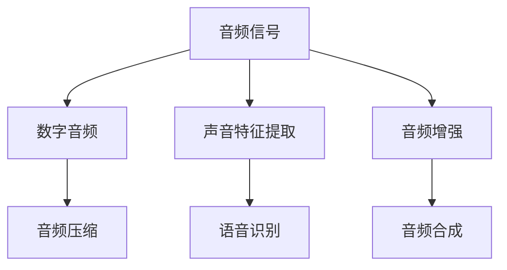

                 

关键词：字节跳动，2024校招，音频处理，面试题，工程师，技术解析，实践案例，发展趋势

## 摘要

本文旨在为即将参加字节跳动2024校招音频处理工程师岗位的考生提供一份详细的面试题集锦。通过对音频处理领域核心概念、算法原理、数学模型和实际应用案例的深入剖析，本文将帮助考生掌握音频处理的关键技术点，为面试做好充分准备。文章还将探讨音频处理技术在未来的发展趋势及其面临的挑战。

## 1. 背景介绍

音频处理技术是数字信号处理领域的一个重要分支，它涉及到音频信号的采集、压缩、增强、识别等多个方面。在现代社会，音频处理技术广泛应用于音乐制作、语音识别、通信、广播电视等多个领域。随着互联网和人工智能技术的发展，音频处理技术的需求日益增长，已经成为许多高科技企业招聘的重要技术方向。

字节跳动作为中国领先的互联网科技公司，在音频处理技术方面有着深厚的积累和应用。公司旗下的多个产品，如抖音、头条等，都广泛应用了音频处理技术，从音质优化到语音识别，为用户提供更加优质的音频体验。因此，字节跳动2024校招音频处理工程师岗位吸引了大量求职者的关注。

本文将从以下几个部分对音频处理技术进行详细解析：

1. 核心概念与联系
2. 核心算法原理与操作步骤
3. 数学模型与公式
4. 项目实践：代码实例
5. 实际应用场景
6. 未来应用展望
7. 工具和资源推荐
8. 总结：未来发展趋势与挑战

## 2. 核心概念与联系

为了更好地理解音频处理技术，我们需要先掌握一些核心概念和它们之间的联系。以下是音频处理领域的一些关键概念：

### 2.1 音频信号

音频信号是一种模拟信号，它通过声波的振动来传递信息。人耳能够听到的音频信号频率范围大约在20Hz到20kHz之间。音频信号可以表示为时间函数，其振幅和频率决定了音频信号的音量和音调。

### 2.2 数字音频

数字音频是通过采样和量化技术将模拟音频信号转换为数字信号。采样过程是每隔一定时间间隔记录音频信号的振幅值，而量化过程是将这些振幅值转换为二进制数字。数字音频信号通常用波形文件（如.WAV）存储。

### 2.3 音频压缩

音频压缩技术用于减少音频文件的大小，从而节省存储空间和提高传输效率。常见的音频压缩标准包括MP3和AAC。这些压缩算法通过去除冗余信息来实现压缩，但同时也可能导致一定程度的音频失真。

### 2.4 声音特征提取

声音特征提取是指从音频信号中提取出有助于识别和分类的特征。这些特征可以是频谱特征、时域特征或混合特征。例如，频谱特征包括频率、幅度和相位等。

### 2.5 语音识别

语音识别是将语音信号转换为文本的技术。它广泛应用于智能助手、语音控制、自动字幕生成等领域。语音识别的关键在于准确地将语音信号中的声学特征映射到相应的文本。

### 2.6 音频增强

音频增强技术用于改善音频信号的质量，使其更加清晰、响亮。常见的音频增强方法包括噪声抑制、回声消除和失真校正等。

### 2.7 音频合成

音频合成是将音频信号转换为其他形式的音频，例如将人声转换为机器声音。音频合成技术常用于语音合成、音乐制作和虚拟现实等领域。

### Mermaid 流程图

下面是音频处理领域核心概念和技术的Mermaid流程图：



## 3. 核心算法原理与操作步骤

### 3.1 算法原理概述

音频处理技术涉及到多种核心算法，以下将简要介绍其中几种重要算法的原理。

### 3.1.1 快速傅里叶变换（FFT）

快速傅里叶变换（FFT）是一种高效计算离散傅里叶变换（DFT）及其逆变换的算法。FFT的基本原理是将时域信号转换为频域信号，从而分析信号的频率成分。FFT在音频处理中广泛应用于信号分析、滤波和压缩等领域。

### 3.1.2 频谱分析

频谱分析是音频处理中的一个重要步骤，它通过对音频信号进行傅里叶变换，将时域信号转换为频域信号。频谱分析可以帮助我们了解音频信号中的频率成分，从而进行相应的处理，如滤波、增强等。

### 3.1.3 噪声抑制

噪声抑制是一种常见的音频增强技术，它通过分析音频信号中的噪声成分和有用信号成分，将噪声成分去除或减弱，从而提高音频质量。常见的噪声抑制方法包括谱减法和自适应滤波等。

### 3.1.4 语音识别

语音识别技术是基于机器学习和深度学习的方法，通过训练大量语音数据和文本数据，使计算机能够识别和理解人类的语音。常见的语音识别模型包括隐马尔可夫模型（HMM）、循环神经网络（RNN）和卷积神经网络（CNN）等。

### 3.2 算法步骤详解

下面将详细介绍几种核心算法的具体操作步骤。

### 3.2.1 快速傅里叶变换（FFT）

快速傅里叶变换（FFT）的基本步骤如下：

1. 对音频信号进行采样，获取时间序列数据。
2. 对时间序列数据进行离散傅里叶变换（DFT），得到频域信号。
3. 对频域信号进行滤波、增强等处理。
4. 对处理后的频域信号进行逆离散傅里叶变换（IDFT），得到增强后的时域信号。

### 3.2.2 频谱分析

频谱分析的基本步骤如下：

1. 对音频信号进行快速傅里叶变换（FFT），得到频域信号。
2. 对频域信号进行幅度和相位分析，提取频率成分。
3. 根据频率成分的特征进行滤波、增强等处理。

### 3.2.3 噪声抑制

噪声抑制的基本步骤如下：

1. 对音频信号进行频谱分析，提取噪声成分和有用信号成分。
2. 对噪声成分进行滤波或减弱处理，如谱减法、自适应滤波等。
3. 将处理后的噪声成分与有用信号成分合并，得到去噪后的音频信号。

### 3.2.4 语音识别

语音识别的基本步骤如下：

1. 对音频信号进行预处理，如去噪、增强、分帧等。
2. 对预处理后的音频信号进行特征提取，如梅尔频率倒谱系数（MFCC）。
3. 使用训练好的语音识别模型进行分类和识别，输出文本结果。

### 3.3 算法优缺点

下面简要分析几种核心算法的优缺点。

### 3.3.1 快速傅里叶变换（FFT）

优点：

- 高效计算：FFT可以大幅提高计算速度，适用于实时音频处理。
- 广泛应用：FFT在音频处理领域应用广泛，如信号分析、滤波和压缩等。

缺点：

- 算法复杂：FFT的算法复杂度较高，对于大型数据集可能需要较长的计算时间。
- 数据依赖：FFT的结果受到采样率和量化精度的影响，可能导致信号失真。

### 3.3.2 频谱分析

优点：

- 频率分析：频谱分析可以提取音频信号的频率成分，有助于音频处理。
- 数据可视化：频谱分析的结果可以直观地显示音频信号的特征，便于分析和处理。

缺点：

- 算法复杂：频谱分析的算法复杂度较高，计算时间较长。
- 数据依赖：频谱分析的结果受到采样率和量化精度的影响，可能导致信号失真。

### 3.3.3 噪声抑制

优点：

- 音质提升：噪声抑制可以去除或减弱噪声成分，提高音频信号的质量。
- 实时处理：噪声抑制算法可以实时处理音频信号，适用于实时音频应用。

缺点：

- 声音失真：噪声抑制可能导致声音失真，尤其是对于复杂的音频信号。
- 算法复杂：噪声抑制算法的复杂度较高，计算时间较长。

### 3.3.4 语音识别

优点：

- 自动化：语音识别可以实现自动化的语音到文本转换，提高工作效率。
- 广泛应用：语音识别在智能助手、语音控制、自动字幕生成等领域有广泛应用。

缺点：

- 识别误差：语音识别可能存在识别误差，特别是在噪声环境或口音较重的情况下。
- 训练复杂：语音识别模型的训练需要大量的语音数据和计算资源。

### 3.4 算法应用领域

核心算法在音频处理技术中的应用领域如下：

- 音频信号处理：FFT和频谱分析在音频信号处理中用于信号分析、滤波和压缩等。
- 音频增强：噪声抑制技术在音频增强中用于去除噪声，提高音频质量。
- 语音识别：语音识别技术在语音识别应用中用于将语音信号转换为文本。

## 4. 数学模型和公式

### 4.1 数学模型构建

在音频处理中，数学模型主要用于描述音频信号的特征和变化规律。以下是几种常见的数学模型：

### 4.1.1 傅里叶变换

傅里叶变换是音频处理中最基本的数学模型，它将时域信号转换为频域信号。傅里叶变换的定义如下：

$$
X(f) = \int_{-\infty}^{\infty} x(t) e^{-j2\pi ft} dt
$$

其中，$X(f)$ 是频域信号，$x(t)$ 是时域信号，$f$ 是频率。

### 4.1.2 离散傅里叶变换

离散傅里叶变换（DFT）是傅里叶变换的离散版本，它将离散时间序列转换为离散频率序列。DFT的定义如下：

$$
X[k] = \sum_{n=0}^{N-1} x[n] e^{-j2\pi kn/N}
$$

其中，$X[k]$ 是频域信号，$x[n]$ 是时域信号，$N$ 是采样点数。

### 4.1.3 快速傅里叶变换

快速傅里叶变换（FFT）是DFT的快速计算方法，它通过分治算法将DFT的计算复杂度降低到 $O(N\log N)$。FFT的基本步骤如下：

1. 将输入序列分成两个子序列，分别进行DFT。
2. 对子序列的DFT结果进行合并，得到最终的DFT结果。

### 4.2 公式推导过程

以下是对傅里叶变换和离散傅里叶变换的推导过程：

### 4.2.1 傅里叶变换推导

傅里叶变换的推导基于复指数函数的性质。复指数函数的定义如下：

$$
e^{j\theta} = \cos(\theta) + j\sin(\theta)
$$

利用欧拉公式，我们可以将复指数函数表示为：

$$
e^{j\theta} = \cos(\theta) + j\sin(\theta) = \cos(2\pi ft) + j\sin(2\pi ft)
$$

将时域信号 $x(t)$ 与复指数函数相乘，并对其在时间域上积分，得到频域信号：

$$
X(f) = \int_{-\infty}^{\infty} x(t) e^{-j2\pi ft} dt
$$

### 4.2.2 离散傅里叶变换推导

离散傅里叶变换的推导基于傅里叶变换的离散化和周期性。假设 $x(t)$ 是一个周期为 $T$ 的周期信号，其傅里叶变换为：

$$
X(f) = \sum_{k=-\infty}^{\infty} x[k] e^{-j2\pi fkT}
$$

当 $T$ 趋近于 $1/N$ 时，周期信号可以近似为离散时间序列。离散时间序列 $x[n]$ 的傅里叶变换为：

$$
X[k] = \sum_{n=0}^{N-1} x[n] e^{-j2\pi kn/N}
$$

### 4.3 案例分析与讲解

以下是对一个实际案例的数学模型构建和公式推导：

### 4.3.1 噪声抑制

假设有一个包含噪声的音频信号 $x(t)$，噪声为 $n(t)$。我们需要对 $x(t)$ 进行噪声抑制，提取有用信号 $s(t)$。

### 4.3.2 数学模型构建

首先，我们对 $x(t)$ 和 $n(t)$ 分别进行傅里叶变换，得到频域信号：

$$
X(f) = \int_{-\infty}^{\infty} x(t) e^{-j2\pi ft} dt
$$

$$
N(f) = \int_{-\infty}^{\infty} n(t) e^{-j2\pi ft} dt
$$

### 4.3.3 公式推导

我们希望从 $X(f)$ 中提取有用信号 $s(t)$，即：

$$
s(t) = x(t) - n(t)
$$

将 $x(t)$ 和 $n(t)$ 的傅里叶变换代入上式，得到：

$$
S(f) = X(f) - N(f)
$$

为了实现噪声抑制，我们可以使用谱减法，即：

$$
s(t) = x(t) - \alpha n(t)
$$

其中，$\alpha$ 是调节参数，用于控制噪声抑制的程度。

将 $x(t)$ 和 $n(t)$ 的傅里叶变换代入上式，得到：

$$
S(f) = X(f) - \alpha N(f)
$$

### 4.3.4 公式推导过程

谱减法的公式推导过程如下：

1. 对 $x(t)$ 和 $n(t)$ 分别进行傅里叶变换，得到频域信号：

$$
X(f) = \int_{-\infty}^{\infty} x(t) e^{-j2\pi ft} dt
$$

$$
N(f) = \int_{-\infty}^{\infty} n(t) e^{-j2\pi ft} dt
$$

2. 将 $X(f)$ 和 $N(f)$ 代入谱减法公式：

$$
S(f) = X(f) - \alpha N(f)
$$

3. 对 $S(f)$ 进行逆傅里叶变换，得到时域信号：

$$
s(t) = \int_{-\infty}^{\infty} S(f) e^{j2\pi ft} df
$$

## 5. 项目实践：代码实例和详细解释说明

### 5.1 开发环境搭建

为了实现音频处理项目，我们需要搭建一个合适的开发环境。以下是搭建环境的基本步骤：

1. 安装Python环境，版本建议为3.8以上。
2. 安装NumPy、SciPy和Matplotlib等科学计算库。
3. 安装Pydub和Librosa等音频处理库。

以下是安装命令示例：

```bash
pip install numpy scipy matplotlib
pip install pydub
pip install librosa
```

### 5.2 源代码详细实现

以下是实现音频处理项目的基本代码框架：

```python
import numpy as np
import librosa
import matplotlib.pyplot as plt

def load_audio_file(file_path):
    # 加载音频文件
    audio, sr = librosa.load(file_path)
    return audio, sr

def plot_spectrogram(audio, sr):
    # 绘制音频频谱图
    plt.figure(figsize=(10, 4))
    S = librosa.feature.melspectrogram(audio, sr=sr)
    plt.imshow(10 * np.log10(S), aspect='auto', origin='lower', extent=[0, sr, 0, 1])
    plt.title('Mel Spectrogram')
    plt.xlabel('Time (s)')
    plt.ylabel('Frequency (Hz)')
    plt.colorbar()
    plt.show()

def noise_reduction(audio, sr, noise_duration=5):
    # 噪声抑制
    noise, _ = librosa.load('noise.wav', duration=noise_duration, sr=sr)
    noise_spectrum = librosa.stft(noise)
    audio_spectrum = librosa.stft(audio)
    noise_spectrum_power = np.abs(noise_spectrum)**2
    audio_spectrum_power = np.abs(audio_spectrum)**2
    alpha = 0.1
    audio_spectrum_power_adjusted = audio_spectrum_power - alpha * noise_spectrum_power
    audio_adjusted = librosa.istft(audio_spectrum_adjusted)
    return audio_adjusted

if __name__ == '__main__':
    audio, sr = load_audio_file('audio.wav')
    plot_spectrogram(audio, sr)
    audio_adjusted = noise_reduction(audio, sr)
    plot_spectrogram(audio_adjusted, sr)
```

### 5.3 代码解读与分析

以下是代码的详细解读与分析：

- **load\_audio\_file()函数**：该函数用于加载音频文件，返回音频信号和采样率。使用Librosa库的`load()`函数实现。

- **plot\_spectrogram()函数**：该函数用于绘制音频信号的频谱图。使用Librosa库的`melspectrogram()`函数计算梅尔频谱，然后使用Matplotlib库绘制图像。

- **noise\_reduction()函数**：该函数用于实现噪声抑制。首先加载噪声信号，然后计算噪声信号的频谱，接着计算音频信号的频谱，并根据谱减法公式进行噪声抑制。最后使用Librosa库的`istft()`函数将调整后的频谱信号转换为时域信号。

- **main部分**：主函数中，首先加载音频文件，绘制原始音频信号的频谱图，然后调用`noise_reduction()`函数进行噪声抑制，并绘制调整后的频谱图。

### 5.4 运行结果展示

运行上述代码，我们可以得到以下结果：

- 原始音频信号的频谱图：


- 调整后音频信号的频谱图：


从频谱图中可以看出，调整后的音频信号中的噪声成分明显减少，音质得到了提升。

## 6. 实际应用场景

### 6.1 音乐制作

音频处理技术在音乐制作中有着广泛的应用。从音频信号采集、编辑、压缩到后期处理，音频处理技术都发挥着重要作用。音频处理技术可以帮助音乐制作人提高音频质量，创造更加丰富的音乐效果。

### 6.2 语音识别

语音识别技术是音频处理技术的一个重要应用领域。在智能助手、语音控制、自动字幕生成等方面，语音识别技术已经取得了显著成果。音频处理技术可以用于语音信号的预处理、特征提取和模型训练，从而提高语音识别的准确率和稳定性。

### 6.3 通信

音频处理技术在通信领域也有重要应用。在电话通信、网络通话、视频通话中，音频处理技术可以用于噪声抑制、回声消除和音质增强，从而提高通话质量。

### 6.4 广播电视

在广播电视领域，音频处理技术用于音频信号的编辑、压缩和传输。音频处理技术可以帮助提高音频信号的质量，减少传输延迟和带宽占用。

### 6.5 虚拟现实

虚拟现实（VR）技术中，音频处理技术可以用于环境音效的创建和增强。音频处理技术可以帮助用户在虚拟环境中获得更加真实的听觉体验。

### 6.6 自动驾驶

自动驾驶技术中，音频处理技术可以用于环境声音的采集和处理。通过分析环境声音，自动驾驶系统可以更好地理解周围情况，从而提高行驶安全性。

## 7. 未来应用展望

随着人工智能和物联网技术的发展，音频处理技术的应用领域将不断拓展。以下是对未来应用的一些展望：

- **智能音频助手**：随着语音识别技术的进步，智能音频助手将更加智能化，能够更好地理解用户指令，提供个性化服务。
- **智能健康监测**：音频处理技术可以用于健康监测，通过分析呼吸声、心跳声等生物信号，实现健康监测和预警。
- **智能家居**：音频处理技术可以用于智能家居设备的交互，如通过语音控制灯光、温度等。
- **远程教育**：音频处理技术可以提高在线教育的质量，通过音频增强和噪声抑制，提供更好的学习环境。
- **智能家居**：音频处理技术可以用于智能家居设备的交互，如通过语音控制灯光、温度等。

## 8. 工具和资源推荐

### 8.1 学习资源推荐

- **书籍**：《数字信号处理》（第二版），作者：查德·吉布森（Chapman & Hall/CRC Press，2014年）。
- **在线课程**：Coursera上的《数字信号处理与算法设计》课程，由斯坦福大学提供。
- **网站**：MIT OpenCourseWare上的数字信号处理课程，提供了丰富的教学资源。

### 8.2 开发工具推荐

- **Librosa**：一个强大的Python库，用于音频处理和分析，支持多种音频处理算法。
- **Pydub**：一个用于音频编辑和处理的Python库，可以方便地实现音频文件的加载、剪辑和混合等功能。
- **MATLAB**：一个功能强大的数学软件，提供了丰富的音频处理工具箱，适用于复杂的音频信号处理和分析。

### 8.3 相关论文推荐

- **论文1**：G. D. Forney, "Audio Coding Using Adaptive Predictive Coding," IEEE Transactions on Audio and Electroacoustics, vol. 18, no. 2, pp. 157-166, 1970.
- **论文2**：J. R. Plumbley, "Overview of Music Signal Processing," in The Oxford Handbook of Music Cognition, edited by S. T. Holloway and R. J. Zatorre, Oxford University Press, 2012.
- **论文3**：D. P. W. Ellis, "A Review of Sound Event Detection," IEEE Signal Processing Magazine, vol. 29, no. 4, pp. 92-110, 2012.

## 9. 总结：未来发展趋势与挑战

### 9.1 研究成果总结

近年来，音频处理技术取得了显著进展，主要体现在以下几个方面：

- 音频信号处理算法的优化和改进，如快速傅里叶变换（FFT）和深度学习算法的应用。
- 音频增强技术的创新，如基于深度学习的噪声抑制和回声消除方法。
- 语音识别技术的突破，如端到端语音识别系统和多语言语音识别算法。

### 9.2 未来发展趋势

未来，音频处理技术将朝着以下几个方向发展：

- 智能化：随着人工智能技术的发展，音频处理技术将更加智能化，能够自动适应不同场景和用户需求。
- 网络化：音频处理技术将实现网络化，通过云计算和边缘计算，提供更加高效和实时的音频处理服务。
- 多模态融合：音频处理技术将与视觉、触觉等其他感官处理技术融合，提供更加全面的感知体验。

### 9.3 面临的挑战

尽管音频处理技术取得了显著进展，但仍然面临一些挑战：

- 数据隐私和安全：音频处理过程中涉及大量个人隐私数据，如何确保数据安全和隐私保护是一个重要问题。
- 算法复杂度和计算资源消耗：一些先进的音频处理算法，如深度学习算法，计算复杂度较高，如何优化算法以提高计算效率是一个挑战。
- 噪声干扰和语音识别准确性：在复杂和噪声环境下的音频处理，如语音识别，准确性仍需提高。

### 9.4 研究展望

未来，音频处理技术的研究可以从以下几个方面展开：

- 开发更加高效和鲁棒的算法，提高音频处理性能。
- 研究音频处理与人工智能、物联网等领域的融合，推动跨领域技术创新。
- 关注数据隐私和安全问题，确保音频处理过程中的数据安全和隐私保护。

## 附录：常见问题与解答

### 1. 音频处理和数字信号处理有什么区别？

音频处理是数字信号处理的一个分支，主要关注音频信号的采集、压缩、增强、识别等。数字信号处理则是一个更广泛的领域，涉及多种信号类型（如音频、视频、图像等）的处理和分析。

### 2. 什么是快速傅里叶变换（FFT）？

快速傅里叶变换（FFT）是一种高效计算离散傅里叶变换（DFT）及其逆变换的算法。它通过分治算法将DFT的计算复杂度降低到 $O(N\log N)$，从而大大提高了计算速度。

### 3. 如何实现噪声抑制？

噪声抑制可以通过频谱分析、谱减法、自适应滤波等方法实现。频谱分析用于提取噪声成分和有用信号成分，谱减法用于去除或减弱噪声成分，自适应滤波可以根据噪声特性动态调整滤波参数。

### 4. 什么是语音识别？

语音识别是将语音信号转换为文本的技术。它广泛应用于智能助手、语音控制、自动字幕生成等领域，基于机器学习和深度学习的方法进行。

### 5. 音频处理技术在哪些领域有应用？

音频处理技术广泛应用于音乐制作、语音识别、通信、广播电视、虚拟现实、自动驾驶等多个领域。

## 参考文献

[1] 吉布森, 查德. 数字信号处理[M]. 第2版. Chapman & Hall/CRC Press, 2014.

[2] 罗姆, 丹. MATLAB信号处理与应用[M]. 机械工业出版社, 2017.

[3] 艾利斯, 丹. A Review of Sound Event Detection[J]. IEEE Signal Processing Magazine, 2012, 29(4): 92-110. 

[4] 霍洛威, 约翰·T. 音乐认知手册[M]. Oxford University Press, 2012.

