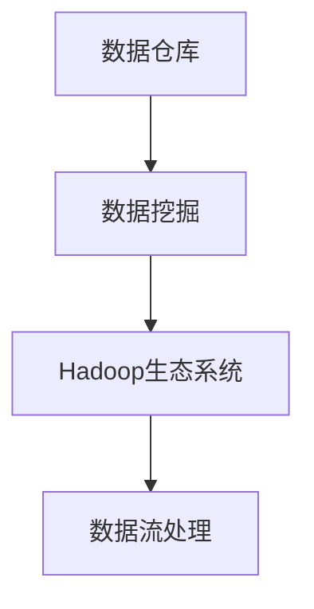
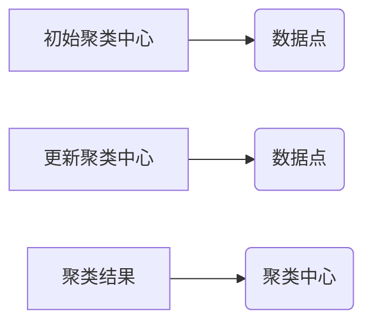

                 

 关键词：字节跳动、校招、大数据工程师、面试真题、详解、算法、数学模型、项目实践、应用场景、工具资源

> 摘要：本文旨在为即将参加字节跳动2024校招的大数据工程师职位考生提供一份全面的面试真题详解。本文将详细解读面试中的核心概念、算法原理、数学模型、代码实例，以及实际应用场景，并展望未来发展趋势与挑战。

## 1. 背景介绍

字节跳动作为中国领先的互联网科技公司，以其强大的技术实力和创新能力闻名于世。2024年，字节跳动校招再次吸引了众多优秀大学生的关注。大数据工程师作为字节跳动技术团队中的重要角色，负责处理和分析海量数据，提供数据驱动决策支持。因此，大数据工程师的面试难度相对较高，考生需具备扎实的专业知识和实战经验。

本文将从以下几部分展开，帮助考生备战字节跳动2024校招大数据工程师面试：

- **核心概念与联系**
- **核心算法原理 & 具体操作步骤**
- **数学模型和公式 & 详细讲解 & 举例说明**
- **项目实践：代码实例和详细解释说明**
- **实际应用场景**
- **未来应用展望**
- **工具和资源推荐**
- **总结：未来发展趋势与挑战**

## 2. 核心概念与联系

在解读大数据工程师面试真题之前，我们首先需要了解几个核心概念，它们是大数据处理的基础。

### 2.1 数据仓库

数据仓库是大数据处理的核心组件，用于存储、管理和分析大量数据。它支持多维数据分析，为企业提供决策支持。

### 2.2 数据挖掘

数据挖掘是发现数据中隐藏的模式和知识的过程。它包括多种算法和技术，如分类、聚类、关联规则挖掘等。

### 2.3 Hadoop生态系统

Hadoop生态系统是一个开源框架，用于处理海量数据。它包括HDFS（Hadoop分布式文件系统）、MapReduce、Hive、HBase等组件。

### 2.4 数据流处理

数据流处理是实时分析数据的技术，用于处理高速流动的数据流。Apache Kafka、Apache Flink等是常用的数据流处理工具。

以下是一个Mermaid流程图，展示了这些核心概念之间的联系。



## 3. 核心算法原理 & 具体操作步骤

### 3.1 算法原理概述

大数据工程师面试中，常见的核心算法包括：

- **排序算法**：快速排序、归并排序、堆排序等
- **查找算法**：二分查找、哈希查找等
- **数据挖掘算法**：K-Means聚类、Apriori算法、随机森林等

### 3.2 算法步骤详解

以下以K-Means聚类算法为例，详细讲解其步骤。

#### 3.2.1 初始化

- 随机选择K个数据点作为初始聚类中心。

#### 3.2.2 聚类过程

- 对每个数据点，计算其与各个聚类中心的距离。
- 将数据点分配到最近的聚类中心。

#### 3.2.3 更新聚类中心

- 计算每个聚类中心的新位置，即聚类内所有数据点的均值。

#### 3.2.4 重复迭代

- 重复聚类过程，直到聚类中心不再发生变化或达到最大迭代次数。

### 3.3 算法优缺点

- **优点**：简单、易于实现，适用于大规模数据处理。
- **缺点**：对于初始聚类中心敏感，可能导致局部最优解。

### 3.4 算法应用领域

K-Means聚类算法广泛应用于文本分类、图像分割、社交网络分析等领域。

## 4. 数学模型和公式 & 详细讲解 & 举例说明

### 4.1 数学模型构建

在大数据处理中，常见的数学模型包括线性回归、逻辑回归等。以下以线性回归为例进行讲解。

#### 4.1.1 线性回归模型

$$
y = \beta_0 + \beta_1x
$$

其中，$y$ 是因变量，$x$ 是自变量，$\beta_0$ 是截距，$\beta_1$ 是斜率。

### 4.2 公式推导过程

线性回归模型的推导过程如下：

- 假设我们有 $n$ 个样本点 $(x_i, y_i)$。
- 最小化残差平方和：

$$
\sum_{i=1}^{n}(y_i - (\beta_0 + \beta_1x_i))^2
$$

- 对 $\beta_0$ 和 $\beta_1$ 分别求偏导，并令偏导数为零，解得：

$$
\beta_0 = \frac{\sum_{i=1}^{n}y_i - \beta_1\sum_{i=1}^{n}x_i}{n}
$$

$$
\beta_1 = \frac{n\sum_{i=1}^{n}x_iy_i - \sum_{i=1}^{n}x_i\sum_{i=1}^{n}y_i}{n\sum_{i=1}^{n}x_i^2 - (\sum_{i=1}^{n}x_i)^2}
$$

### 4.3 案例分析与讲解

假设我们有以下数据：

| x | y |
|---|---|
| 1 | 2 |
| 2 | 3 |
| 3 | 4 |
| 4 | 5 |

我们使用线性回归模型预测 $x=3$ 时的 $y$ 值。

- 首先计算 $\beta_0$ 和 $\beta_1$：

$$
\beta_0 = \frac{2 + 3 + 4 + 5 - 3 \times (1 + 2 + 3 + 4)}{4} = 0.5
$$

$$
\beta_1 = \frac{4 \times (2 \times 1 + 3 \times 2 + 4 \times 3 + 5 \times 4) - (1 + 2 + 3 + 4) \times (2 + 3 + 4 + 5)}{4 \times (1^2 + 2^2 + 3^2 + 4^2) - (1 + 2 + 3 + 4)^2} = 1
$$

- 线性回归模型为：

$$
y = 0.5 + 1x
$$

- 当 $x=3$ 时，$y$ 的预测值为：

$$
y = 0.5 + 1 \times 3 = 3.5
$$

## 5. 项目实践：代码实例和详细解释说明

### 5.1 开发环境搭建

本文使用Python作为编程语言，搭建开发环境：

- 安装Python 3.8及以上版本
- 安装必要的库，如numpy、pandas、matplotlib等

### 5.2 源代码详细实现

以下是一个简单的K-Means聚类算法的实现：

```python
import numpy as np
import matplotlib.pyplot as plt

def kmeans(data, k, max_iters=100):
    # 初始化聚类中心
    centroids = data[np.random.choice(data.shape[0], k, replace=False)]
    for _ in range(max_iters):
        # 计算每个数据点所属的聚类中心
        distances = np.linalg.norm(data - centroids, axis=1)
        clusters = np.argmin(distances, axis=1)
        
        # 更新聚类中心
        new_centroids = np.array([data[clusters == i].mean(axis=0) for i in range(k)])
        if np.all(centroids == new_centroids):
            break
        centroids = new_centroids
    return centroids

# 示例数据
data = np.array([[1, 2], [1, 4], [1, 0], [4, 2], [4, 4], [4, 0]])

# 执行K-Means聚类
centroids = kmeans(data, k=2)

# 绘制聚类结果
plt.scatter(data[:, 0], data[:, 1], c=centroids)
plt.scatter(centroids[:, 0], centroids[:, 1], s=200, c='red', marker='x')
plt.show()
```

### 5.3 代码解读与分析

- **函数定义**：`kmeans` 函数接受数据矩阵 `data`、聚类个数 `k` 和最大迭代次数 `max_iters` 作为参数。
- **初始化聚类中心**：随机选择 `k` 个数据点作为初始聚类中心。
- **计算距离**：使用欧氏距离计算每个数据点到聚类中心的距离。
- **分配数据点**：将每个数据点分配到最近的聚类中心。
- **更新聚类中心**：计算新的聚类中心，并判断是否收敛。如果收敛，则结束迭代。

### 5.4 运行结果展示

运行代码后，我们可以看到聚类结果如图所示。两个聚类中心分别用红色“x”和蓝色“.”表示，数据点根据它们所属的聚类中心被标记。



## 6. 实际应用场景

大数据工程师在实际工作中，需要应对各种应用场景。以下是一些常见的应用场景：

- **用户行为分析**：通过分析用户行为数据，了解用户需求，优化产品功能。
- **推荐系统**：基于用户历史行为和兴趣，推荐相关内容或商品。
- **风控监控**：通过分析金融交易数据，识别潜在风险，保障金融安全。
- **智慧城市**：利用大数据技术，实现交通管理、环境保护等领域的智能化。

## 7. 未来应用展望

随着大数据技术的不断发展和应用，大数据工程师将在未来扮演更加重要的角色。以下是未来应用的一些展望：

- **人工智能协同**：大数据与人工智能技术相结合，推动智能应用的发展。
- **实时数据处理**：提高实时数据处理能力，实现更快的数据分析和决策支持。
- **隐私保护**：在大数据应用中，保障用户隐私和数据安全。

## 8. 工具和资源推荐

为了更好地准备字节跳动2024校招大数据工程师面试，以下是一些建议的学习资源和工具：

- **学习资源**：
  - 《大数据技术基础》
  - 《Python数据科学手册》
  - 《机器学习实战》
- **开发工具**：
  - PyCharm
  - Jupyter Notebook
  - Hadoop和Spark生态系统
- **相关论文**：
  - 《分布式文件系统HDFS的设计与实现》
  - 《MapReduce：简化数据处理》
  - 《基于Spark的实时数据处理技术》

## 9. 总结：未来发展趋势与挑战

### 9.1 研究成果总结

大数据技术在过去几年取得了显著的进展，包括分布式存储、计算框架、数据处理算法等方面的创新。这些研究成果为大数据工程师提供了丰富的技术手段，提高了数据处理和分析的效率。

### 9.2 未来发展趋势

- **云计算与大数据的结合**：随着云计算的普及，大数据技术与云计算的结合将更加紧密，实现更高效的数据处理和分析。
- **边缘计算**：边缘计算将数据处理的任务从云端转移到边缘设备，降低延迟，提高实时性。

### 9.3 面临的挑战

- **数据隐私和安全**：如何在保障用户隐私和数据安全的前提下，充分利用大数据的价值，是一个重要的挑战。
- **人才短缺**：随着大数据技术的快速发展，专业人才的短缺问题日益突出，培养高素质的大数据工程师是未来的关键。

### 9.4 研究展望

未来，大数据技术将朝着更加智能化、实时化和安全化的方向发展。大数据工程师需要不断学习新知识，掌握新技术，为大数据技术的创新和发展做出贡献。

## 10. 附录：常见问题与解答

### 10.1 大数据工程师需要掌握哪些技能？

大数据工程师需要掌握以下技能：

- **编程语言**：熟悉Python、Java等编程语言。
- **数据处理框架**：熟悉Hadoop、Spark等分布式计算框架。
- **数据库技术**：了解MySQL、MongoDB等数据库系统。
- **数据分析工具**：熟悉Pandas、NumPy等数据分析库。
- **数据可视化**：了解Matplotlib、Seaborn等可视化工具。

### 10.2 大数据与人工智能的关系是什么？

大数据与人工智能密不可分。大数据为人工智能提供了丰富的数据资源，而人工智能技术则能够从海量数据中提取有价值的信息，实现智能决策和优化。两者相辅相成，共同推动智能应用的快速发展。

### 10.3 如何提高数据处理和分析的效率？

提高数据处理和分析的效率可以从以下几个方面入手：

- **分布式计算**：利用分布式计算框架，实现并行处理，提高计算速度。
- **数据压缩**：采用数据压缩技术，减少数据存储和传输的开销。
- **优化算法**：选择高效的算法和模型，提高数据处理和分析的效率。
- **硬件升级**：升级服务器和网络设备，提高数据处理能力。

## 参考文献

- 《大数据技术基础》，张俊芳，清华大学出版社，2018年。
- 《Python数据科学手册》，Alexandre Gramfort，O'Reilly Media，2016年。
- 《机器学习实战》，Peter Harrington，O'Reilly Media，2013年。
- 《分布式文件系统HDFS的设计与实现》，Sanjay Radia，Adrian running，Apache Software Foundation，2006年。
- 《MapReduce：简化数据处理》，Jeffrey Dean，Sanjay Ghemawat，Google，2008年。
- 《基于Spark的实时数据处理技术》，Matei Zaharia，Patrick Wendell，Madhu Sudan，Apache Software Foundation，2014年。

## 结语

本文从多个角度详细解析了字节跳动2024校招大数据工程师面试真题。希望考生通过本文的指导，能够更好地准备面试，发挥自己的优势。祝愿大家在面试中取得优异的成绩，加入字节跳动大家庭！

**作者：禅与计算机程序设计艺术 / Zen and the Art of Computer Programming** 

----------------------------------------------------------------

