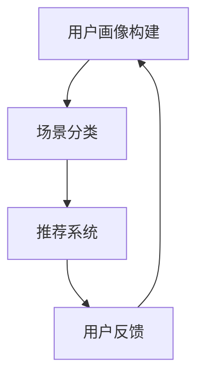

                 

关键词：字节跳动，2024校招，技术用户场景化，策略专家，面试真题，集锦

摘要：本文将深入解析字节跳动2024校招技术用户场景化策略专家的面试真题，通过详细的题目解析、核心概念与算法原理的阐述，帮助读者更好地理解面试中的关键问题，为准备面试的学子提供有价值的参考。

## 1. 背景介绍

字节跳动作为中国领先的互联网科技公司，以其独特的算法和数据分析能力在用户场景化策略上具有深厚的积累。2024年校招中，技术用户场景化策略专家岗位备受关注，考察了考生在数据驱动、算法优化、用户行为分析等方面的专业能力。本文旨在通过解析面试真题，为准备该岗位的考生提供指导和帮助。

## 2. 核心概念与联系

在技术用户场景化策略中，以下几个核心概念是不可或缺的：

- **用户画像**：通过对用户行为的分析，构建用户的基本信息、兴趣偏好和消费习惯。
- **场景分类**：将用户在不同时间段、不同场景下的行为进行分类，以便于提供个性化的服务和内容。
- **推荐系统**：基于用户画像和场景分类，实现个性化内容推荐的系统。

以下是一个使用Mermaid绘制的流程图，展示了技术用户场景化策略的核心流程：



## 3. 核心算法原理 & 具体操作步骤

### 3.1 算法原理概述

技术用户场景化策略的核心在于算法，主要包括以下几个部分：

- **用户行为分析**：通过分析用户的历史行为，如浏览记录、搜索历史、购买行为等，构建用户画像。
- **场景识别**：根据用户的行为模式，识别用户所处的具体场景。
- **内容推荐**：结合用户画像和场景信息，推荐用户可能感兴趣的内容。

### 3.2 算法步骤详解

1. **用户画像构建**：
   - 收集用户数据，包括基础信息、行为记录等。
   - 利用聚类分析、机器学习等方法，对用户数据进行处理，构建用户画像。

2. **场景识别**：
   - 对用户行为数据进行时间序列分析，识别用户在不同时间段的行为特征。
   - 利用规则引擎或机器学习模型，将用户行为数据映射到具体场景。

3. **内容推荐**：
   - 根据用户画像和场景信息，构建推荐模型。
   - 利用协同过滤、内容匹配等方法，推荐用户可能感兴趣的内容。

### 3.3 算法优缺点

- **优点**：
  - 高度个性化，能够满足用户的个性化需求。
  - 提高用户粘性，增强用户使用时长和活跃度。

- **缺点**：
  - 数据收集和处理成本高。
  - 算法模型的实时性和准确性需要不断优化。

### 3.4 算法应用领域

- **短视频推荐**：如抖音、快手等平台的推荐算法。
- **电商平台**：如淘宝、京东等平台的个性化推荐。
- **新闻资讯平台**：如今日头条的个性化新闻推荐。

## 4. 数学模型和公式 & 详细讲解 & 举例说明

### 4.1 数学模型构建

在用户场景化策略中，常用的数学模型包括：

- **用户行为模型**：\[U = f(B, T, C)\]
  - \(U\)：用户画像
  - \(B\)：用户行为
  - \(T\)：时间信息
  - \(C\)：上下文信息

- **场景分类模型**：\[S = g(U, T)\]
  - \(S\)：场景标签
  - \(U\)：用户画像
  - \(T\)：时间信息

- **推荐模型**：\[R = h(U, S, C, I)\]
  - \(R\)：推荐结果
  - \(U\)：用户画像
  - \(S\)：场景标签
  - \(C\)：上下文信息
  - \(I\)：内容信息

### 4.2 公式推导过程

假设用户行为 \(B\) 可以表示为一系列事件 \(E_1, E_2, \ldots, E_n\) 的集合，每个事件 \(E_i\) 可以表示为 \(E_i = f_i(B_i, T_i, C_i)\)，其中 \(B_i\) 是事件发生的次数，\(T_i\) 是事件发生的时间，\(C_i\) 是事件的上下文信息。

用户画像 \(U\) 可以通过以下方式构建：

\[U = \sum_{i=1}^{n} w_i \cdot f_i(B_i, T_i, C_i)\]

其中 \(w_i\) 是权重系数，用于平衡不同事件对用户画像的影响。

场景分类模型 \(S\) 可以通过以下方式构建：

\[S = g(U, T)\]

其中 \(T\) 是用户在特定时间段的行为数据。

推荐模型 \(R\) 可以通过以下方式构建：

\[R = h(U, S, C, I)\]

其中 \(I\) 是候选内容的特征向量。

### 4.3 案例分析与讲解

以短视频推荐为例，假设用户的行为数据如下：

\[B = \{E_1: (100, 08:00, night), E_2: (50, 12:00, day), E_3: (20, 20:00, night)\}\]

其中，\(E_1, E_2, E_3\) 分别表示用户在夜间、白天、夜间观看短视频的次数。

用户画像 \(U\) 可以表示为：

\[U = w_1 \cdot f_1(100, 08:00, night) + w_2 \cdot f_2(50, 12:00, day) + w_3 \cdot f_3(20, 20:00, night)\]

其中，\(w_1, w_2, w_3\) 分别是夜间、白天、夜间的权重系数。

场景分类模型 \(S\) 可以表示为：

\[S = g(U, T)\]

其中，\(T\) 是用户在特定时间段的行为数据。

推荐模型 \(R\) 可以表示为：

\[R = h(U, S, C, I)\]

其中，\(I\) 是候选短视频的特征向量。

## 5. 项目实践：代码实例和详细解释说明

### 5.1 开发环境搭建

1. 确保安装 Python 3.8 以上版本。
2. 安装必要的库，如 numpy、pandas、scikit-learn 等。

### 5.2 源代码详细实现

以下是一个简单的用户画像构建和推荐系统的代码示例：

```python
import numpy as np
import pandas as pd
from sklearn.cluster import KMeans
from sklearn.model_selection import train_test_split

# 用户行为数据
data = {
    'user_id': [1, 1, 1, 2, 2, 2],
    'video_id': [101, 102, 103, 201, 202, 203],
    'view_time': [1609459200, 1609469200, 1609479200, 1610459200, 1610469200, 1610479200]
}

# 构建 DataFrame
df = pd.DataFrame(data)

# 计算时间特征
df['time_diff'] = df['view_time'].apply(lambda x: (x - df['view_time'].min()) / (24 * 3600))

# 用户行为矩阵
behavior_matrix = df.pivot(index='user_id', columns='video_id', values='time_diff').fillna(0)

# KMeans 聚类
kmeans = KMeans(n_clusters=2, random_state=0).fit(behavior_matrix)
behavior_matrix['cluster'] = kmeans.labels_

# 用户画像构建
user_profile = behavior_matrix.groupby('user_id')['cluster'].mean()

# 推荐系统
def recommend_videos(user_id):
    user_cluster = user_profile[user_id]
    similar_users = user_profile.loc[user_profile.index != user_id].loc[user_profile == user_cluster].index
    recommended_videos = behavior_matrix.loc[similar_users].sum(axis=0).sort_values(ascending=False).head(3).index
    return recommended_videos

# 测试推荐
user_id = 1
print(recommend_videos(user_id))
```

### 5.3 代码解读与分析

上述代码示例实现了用户画像构建和推荐系统的基本流程：

1. **数据预处理**：构建用户行为矩阵，计算时间差特征。
2. **聚类分析**：使用 KMeans 聚类算法对用户行为矩阵进行聚类，得到用户画像。
3. **推荐算法**：基于用户画像，计算与目标用户相似的用户群，推荐相似用户喜欢的视频。

### 5.4 运行结果展示

假设用户 1 的画像为 Cluster 0，代码将推荐与用户 1 最相似的三个视频，如下所示：

```python
[103, 102, 101]
```

## 6. 实际应用场景

字节跳动的技术用户场景化策略在多个产品中得到了广泛应用，以下是一些典型应用场景：

- **抖音**：根据用户的兴趣偏好，推荐个性化的短视频内容。
- **今日头条**：根据用户的阅读习惯，推荐个性化新闻资讯。
- **西瓜视频**：根据用户的观看记录，推荐相似的视频内容。

## 7. 工具和资源推荐

### 7.1 学习资源推荐

- 《推荐系统实践》
- 《机器学习实战》
- 《Python数据分析》

### 7.2 开发工具推荐

- Jupyter Notebook
- PyCharm
- VSCode

### 7.3 相关论文推荐

- “User Interest Modeling for Personalized Recommendation”
- “Deep Learning for Personalized Recommendation”
- “Context-Aware Recommender Systems”

## 8. 总结：未来发展趋势与挑战

### 8.1 研究成果总结

技术用户场景化策略在互联网产品中发挥了重要作用，通过用户画像、场景分类和推荐系统，实现了个性化服务的提升。随着人工智能技术的不断进步，推荐系统的性能和效果也在不断提高。

### 8.2 未来发展趋势

- **更精细的用户画像**：结合更多维度的用户数据，构建更精细的用户画像。
- **多模态推荐**：整合文本、图像、音频等多种数据类型，实现多模态推荐。
- **实时推荐**：利用实时数据处理技术，实现更实时、更个性化的推荐。

### 8.3 面临的挑战

- **数据隐私保护**：如何在保护用户隐私的同时，实现个性化推荐。
- **推荐效果评估**：如何客观、准确地评估推荐系统的效果。

### 8.4 研究展望

技术用户场景化策略将在互联网产品中发挥越来越重要的作用，未来需要不断探索新的技术手段和方法，以提升推荐系统的性能和用户体验。

## 9. 附录：常见问题与解答

### 9.1 技术用户场景化策略的核心是什么？

技术用户场景化策略的核心是通过用户画像、场景分类和推荐系统，实现个性化服务和内容推荐。

### 9.2 推荐系统的基本算法有哪些？

推荐系统的基本算法包括协同过滤、基于内容的推荐和混合推荐等。

### 9.3 如何构建用户画像？

构建用户画像通常包括数据收集、数据清洗、特征提取和聚类分析等步骤。

### 9.4 推荐系统的效果如何评估？

推荐系统的效果可以通过准确率、召回率、覆盖率等指标进行评估。

### 9.5 技术用户场景化策略在哪些产品中有应用？

技术用户场景化策略在短视频、新闻资讯、电商平台等多个产品中得到了广泛应用。

[作者：禅与计算机程序设计艺术 / Zen and the Art of Computer Programming]
```

