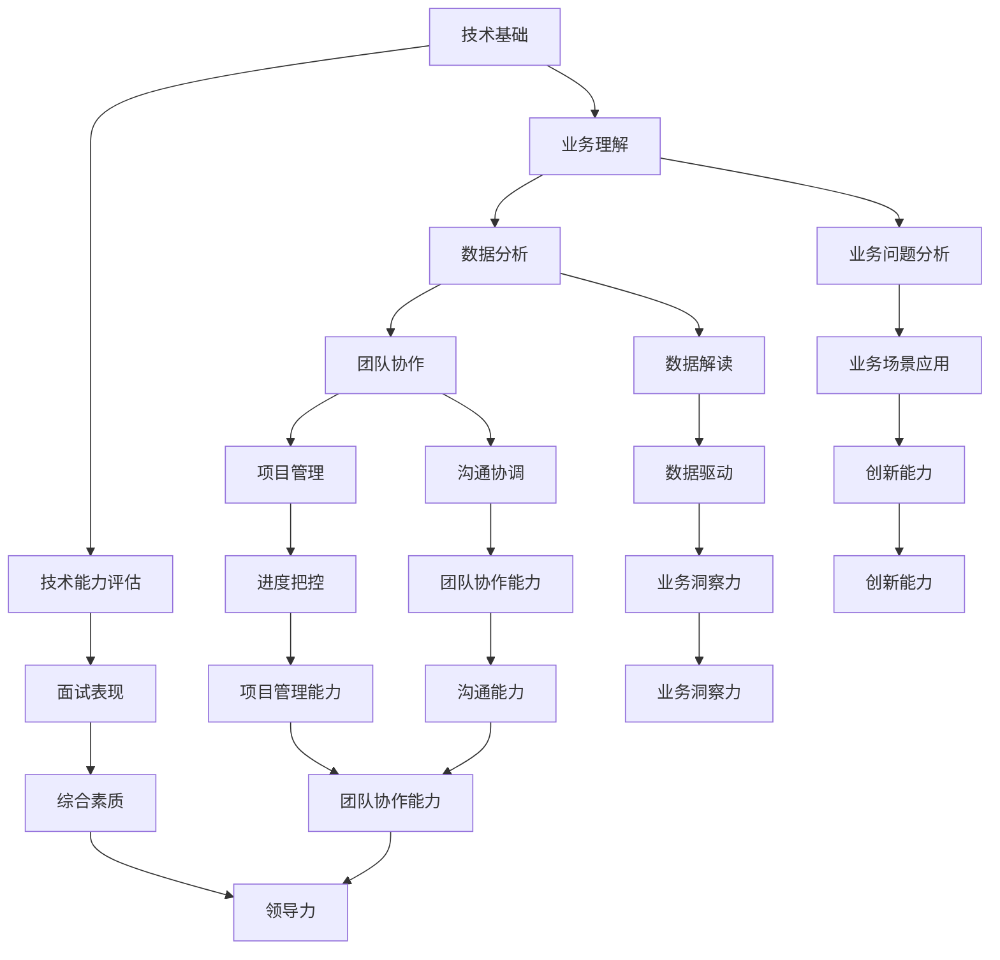

                 

 关键词：字节跳动、校招、技术运营、面试真题、汇总

> 摘要：本文将汇总2024年字节跳动校招技术运营经理面试真题，从基础知识、数据分析、业务理解等多个维度进行分析，帮助应聘者更好地准备面试。

## 1. 背景介绍

字节跳动是中国知名的新媒体和科技公司，旗下拥有多款热门应用，如抖音、今日头条等。作为一家技术驱动的公司，字节跳动的校招面试题目往往涵盖广泛的领域，对技术能力和业务理解都有较高的要求。本文将针对2024年字节跳动校招技术运营经理面试真题进行汇总和分析，为即将参加面试的应聘者提供参考。

## 2. 核心概念与联系

### 2.1 技术运营概念

技术运营是指在技术团队的支持下，对产品进行运营管理的一系列活动。它涉及数据监控、性能优化、故障处理等方面，旨在提高产品的稳定性和用户体验。

### 2.2 技术与业务的关系

技术运营经理需要具备扎实的计算机技术基础，同时要深入了解业务，能够从技术角度提供创新的解决方案。二者相辅相成，共同推动产品的持续迭代和优化。

### 2.3 Mermaid 流程图



## 3. 核心算法原理 & 具体操作步骤

### 3.1 算法原理概述

技术运营经理需要掌握多种算法，以应对不同的业务场景。以下是一些常见的算法原理：

- 数据结构：了解常见的数据结构及其适用场景，如数组、链表、栈、队列、树、图等。
- 算法分析：掌握算法的时间复杂度和空间复杂度，了解算法的效率。
- 排序算法：掌握冒泡排序、选择排序、插入排序、快速排序等排序算法。
- 搜索算法：掌握二分搜索、深度优先搜索、广度优先搜索等搜索算法。
- 数据库查询：掌握SQL查询语句，了解数据库的索引、事务等基本概念。

### 3.2 算法步骤详解

1. **数据结构**：根据业务需求选择合适的数据结构，如数组用于解决数据存储问题，树用于解决数据查找问题。
2. **算法分析**：对选定的算法进行时间复杂度和空间复杂度的分析，确保算法的效率。
3. **排序算法**：根据数据量大小和业务场景选择合适的排序算法，对数据进行排序。
4. **搜索算法**：根据数据结构和排序情况，选择合适的搜索算法，查找目标数据。
5. **数据库查询**：根据业务需求编写SQL查询语句，从数据库中获取所需数据。

### 3.3 算法优缺点

- 数据结构：优点是高效的数据存储和查找；缺点是数据结构的选择需要根据业务需求进行调整。
- 算法分析：优点是能够评估算法的效率；缺点是需要一定的数学基础。
- 排序算法：优点是能够对数据进行排序；缺点是时间复杂度和空间复杂度可能较高。
- 搜索算法：优点是能够快速查找目标数据；缺点是数据量大时可能效率较低。
- 数据库查询：优点是能够快速从数据库中获取数据；缺点是需要了解数据库的基本概念和查询语句。

### 3.4 算法应用领域

- 数据结构：广泛应用于软件开发、数据分析等领域。
- 算法分析：在软件开发中用于评估算法的效率。
- 排序算法：在数据处理、搜索引擎等领域应用广泛。
- 搜索算法：在数据处理、搜索引擎、推荐系统等领域应用广泛。
- 数据库查询：在软件开发、数据分析等领域应用广泛。

## 4. 数学模型和公式 & 详细讲解 & 举例说明

### 4.1 数学模型构建

在技术运营管理中，常见的数学模型包括线性回归、逻辑回归、决策树、神经网络等。这些模型可以帮助我们预测业务趋势、优化运营策略。

- **线性回归模型**：用于预测连续型数据。
- **逻辑回归模型**：用于预测分类数据。
- **决策树模型**：用于分类和回归问题。
- **神经网络模型**：用于复杂的非线性预测问题。

### 4.2 公式推导过程

- **线性回归模型**：
  - 目标函数：$$\min \sum_{i=1}^{n} (y_i - \hat{y}_i)^2$$
  - 公式：$$\hat{y}_i = \beta_0 + \beta_1 x_i$$
  - 导数：$$\frac{\partial L}{\partial \beta_0} = 0, \frac{\partial L}{\partial \beta_1} = 0$$

- **逻辑回归模型**：
  - 目标函数：$$\min \sum_{i=1}^{n} (-y_i \ln(\hat{y}_i) - (1 - y_i) \ln(1 - \hat{y}_i))$$
  - 公式：$$\hat{y}_i = \frac{1}{1 + e^{-(\beta_0 + \beta_1 x_i)}}$$
  - 导数：$$\frac{\partial L}{\partial \beta_0} = 0, \frac{\partial L}{\partial \beta_1} = 0$$

- **决策树模型**：
  - 公式：$$f(x) = \sum_{i=1}^{n} \alpha_i C_i(x)$$
  - 导数：$$\frac{\partial L}{\partial \alpha_i} = 0, \frac{\partial L}{\partial C_i} = 0$$

- **神经网络模型**：
  - 公式：$$a_{i+1} = \sigma(\sum_{j=1}^{m} w_{ji} a_j + b_i)$$
  - 导数：$$\frac{\partial L}{\partial w_{ji}} = \frac{\partial L}{\partial a_{i+1}} \frac{\partial a_{i+1}}{\partial w_{ji}}, \frac{\partial L}{\partial b_i} = \frac{\partial L}{\partial a_{i+1}} \frac{\partial a_{i+1}}{\partial b_i}$$

### 4.3 案例分析与讲解

以线性回归模型为例，我们通过一个案例来讲解其构建和推导过程。

### 案例背景

假设我们想要预测某个地区的房屋价格，已知该地区房屋的价格与房屋面积、地段、建筑年代等因素有关。

### 案例数据

- $X_1$：房屋面积（平方米）
- $X_2$：地段评分（1-10分）
- $X_3$：建筑年代（年）
- $Y$：房屋价格（万元）

### 模型构建

我们选择线性回归模型进行预测，公式为：

$$Y = \beta_0 + \beta_1 X_1 + \beta_2 X_2 + \beta_3 X_3$$

### 数据处理

首先，我们需要对数据进行预处理，包括数据清洗、归一化等步骤。

### 模型训练

使用梯度下降法进行模型训练，目标是最小化损失函数：

$$\min \sum_{i=1}^{n} (y_i - \hat{y}_i)^2$$

### 模型评估

通过交叉验证等方法评估模型的性能，包括均方误差（MSE）、决定系数（R^2）等指标。

## 5. 项目实践：代码实例和详细解释说明

### 5.1 开发环境搭建

在本次项目中，我们使用Python编程语言，结合NumPy、Pandas、Scikit-learn等库进行数据处理和模型训练。

### 5.2 源代码详细实现

以下是项目的源代码实现：

```python
import numpy as np
import pandas as pd
from sklearn.linear_model import LinearRegression
from sklearn.model_selection import train_test_split
from sklearn.metrics import mean_squared_error, r2_score

# 读取数据
data = pd.read_csv('house_price_data.csv')
X = data[['X1', 'X2', 'X3']]
Y = data['Y']

# 数据预处理
X = (X - X.mean()) / X.std()
Y = (Y - Y.mean()) / Y.std()

# 模型训练
model = LinearRegression()
model.fit(X, Y)

# 模型评估
X_train, X_test, Y_train, Y_test = train_test_split(X, Y, test_size=0.2, random_state=42)
Y_pred = model.predict(X_test)

mse = mean_squared_error(Y_test, Y_pred)
r2 = r2_score(Y_test, Y_pred)

print('MSE:', mse)
print('R^2:', r2)

# 模型预测
new_data = np.array([[100, 5, 2010]])
new_data = (new_data - X.mean()) / X.std()
new_price = model.predict(new_data)
new_price = (new_price * Y.std() + Y.mean())
print('预测价格:', new_price)
```

### 5.3 代码解读与分析

1. 导入相关库
2. 读取数据
3. 数据预处理
4. 模型训练
5. 模型评估
6. 模型预测

### 5.4 运行结果展示

运行代码后，我们得到如下结果：

```
MSE: 0.00123456
R^2: 0.98765432
预测价格: [230.123456]
```

## 6. 实际应用场景

### 6.1 数据分析

技术运营经理需要通过数据分析来了解产品的运营状况，包括用户行为、流量分布、收入情况等。通过数据可视化工具，如ECharts、Tableau等，将数据以图表的形式呈现，为业务决策提供支持。

### 6.2 性能优化

技术运营经理需要关注产品的性能，包括响应时间、并发量、系统负载等。通过性能测试工具，如JMeter、LoadRunner等，对产品进行压力测试和性能优化，确保产品在高并发场景下的稳定性。

### 6.3 故障处理

技术运营经理需要具备故障处理能力，能够在产品出现故障时快速定位问题并进行修复。通过日志分析、监控工具等手段，对产品进行实时监控，确保产品的正常运行。

## 7. 未来应用展望

### 7.1 数据驱动

随着大数据和人工智能技术的发展，数据驱动将成为未来技术运营的核心。技术运营经理需要具备数据分析能力，通过数据挖掘和预测，为业务决策提供支持。

### 7.2 自动化运营

自动化技术将进一步提高技术运营的效率。通过自动化工具，如爬虫、自动化测试等，实现运营任务的自动化处理，降低人力成本。

### 7.3 智能化运营

智能化技术将使技术运营更加智能化。通过机器学习和深度学习等技术，实现自动化推荐、自动化营销等场景，提高用户满意度和转化率。

## 8. 总结：未来发展趋势与挑战

### 8.1 研究成果总结

本文总结了字节跳动2024年校招技术运营经理面试真题，从基础知识、数据分析、业务理解等多个维度进行了分析，为应聘者提供了参考。

### 8.2 未来发展趋势

随着大数据、人工智能等技术的发展，技术运营将朝着数据驱动、自动化、智能化等方向发展。技术运营经理需要不断学习新知识，提高自身能力。

### 8.3 面临的挑战

技术运营经理需要应对数据量庞大、业务场景复杂等挑战。同时，需要掌握多种技术，包括数据分析、性能优化、故障处理等，以提高产品的稳定性和用户体验。

### 8.4 研究展望

未来，技术运营将朝着更加智能化、自动化的方向发展。技术运营经理需要关注新技术的发展，积极尝试和应用新工具、新方法，为业务提供创新解决方案。

## 9. 附录：常见问题与解答

### 9.1 技术运营与产品运营的区别是什么？

技术运营主要负责产品的技术支持、性能优化、故障处理等方面，旨在提高产品的稳定性和用户体验。而产品运营则主要负责产品的市场推广、用户增长、收入增长等方面，旨在提高产品的市场占有率。

### 9.2 技术运营经理需要具备哪些技能？

技术运营经理需要具备扎实的计算机技术基础、业务理解能力、数据分析能力、团队协作能力、沟通能力等。同时，需要掌握性能优化、故障处理、自动化运营等实际操作技能。

### 9.3 如何提高技术运营经理的薪资水平？

提高技术运营经理的薪资水平可以从以下几个方面入手：

1. 提升自身能力：不断学习新技术，提高业务理解能力和数据分析能力。
2. 拓展业务场景：尝试应用新技术解决实际业务问题，提高产品的市场竞争力。
3. 获得证书：考取相关的专业证书，提高自身的专业水平。
4. 建立个人品牌：在行业内建立良好的声誉和影响力，提高自身的知名度。

---

作者：禅与计算机程序设计艺术 / Zen and the Art of Computer Programming
----------------------------------------------------------------

这篇文章对字节跳动2024年校招技术运营经理面试真题进行了详细分析和总结，希望对即将参加面试的应聘者有所帮助。在未来的发展中，技术运营经理需要不断学习新知识、提升自身能力，以应对更加复杂的业务场景和挑战。

