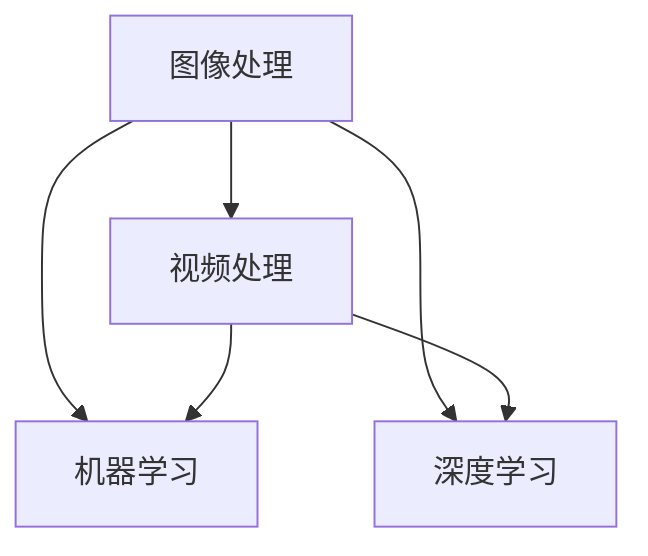

                 

关键词：字节跳动，短视频剪辑，AI，校招，面试，重点

摘要：本文旨在为即将参加字节跳动2024年短视频剪辑AI校招面试的候选人提供详细的复习指南。文章涵盖了面试过程中可能涉及的核心知识点，包括短视频剪辑AI的基本概念、核心算法原理、数学模型、项目实践以及未来应用展望。通过本文的阅读，读者能够更好地理解面试的重点内容，为成功面试做好充分准备。

## 1. 背景介绍

短视频作为一种新兴的媒介形式，近年来在全球范围内迅速普及。字节跳动作为短视频领域的领军企业，其产品如抖音（TikTok）、西瓜视频等在全球范围内拥有庞大的用户基础。为了保持竞争力，字节跳动持续在人工智能领域投入研发，特别是在短视频剪辑方面。2024年，字节跳动将继续在短视频剪辑AI上进行深入探索，并计划通过校招引进更多优秀人才。

本篇文章将从以下几个方面展开，旨在帮助读者全面了解字节跳动短视频剪辑AI校招面试的重点：

- 短视频剪辑AI的基本概念与核心算法
- 数学模型与公式推导
- 项目实践与代码实例
- 实际应用场景与未来展望
- 工具和资源推荐

## 2. 核心概念与联系

为了更好地理解短视频剪辑AI，我们首先需要明确几个核心概念：图像处理、视频处理、机器学习和深度学习。

### 2.1 图像处理

图像处理是计算机视觉的基础，主要研究如何使用计算机技术对图像进行各种操作，如图像增强、图像识别、图像分割等。在短视频剪辑AI中，图像处理用于视频帧的预处理，例如去噪、增强、色彩调整等，以提高后续处理的准确性和效果。

### 2.2 视频处理

视频处理是对连续图像序列的处理，主要包括视频编码、视频解码、视频合成等。在短视频剪辑AI中，视频处理用于实现视频的剪辑、拼接、特效添加等功能，以满足用户个性化的视频制作需求。

### 2.3 机器学习

机器学习是一种使计算机能够从数据中学习规律和模式的技术。在短视频剪辑AI中，机器学习用于实现视频内容的自动分类、标签生成、情感分析等功能，从而提升用户的观看体验。

### 2.4 深度学习

深度学习是机器学习的一个分支，通过构建多层的神经网络模型，实现对复杂数据的高效表示和建模。在短视频剪辑AI中，深度学习主要用于实现视频内容识别、视频生成、视频增强等功能，从而实现更智能的短视频处理。

### 2.5 Mermaid 流程图

为了更好地理解上述核心概念之间的联系，我们使用Mermaid绘制一个流程图：



在这个流程图中，图像处理和视频处理作为基础技术，与机器学习和深度学习相互融合，共同构成了短视频剪辑AI的核心技术。

## 3. 核心算法原理 & 具体操作步骤

### 3.1 算法原理概述

短视频剪辑AI的核心算法主要包括以下几种：

- 视频内容识别
- 视频生成
- 视频增强
- 视频拼接

这些算法的原理和实现方式各不相同，但都旨在提高短视频的处理效率和效果。

### 3.2 算法步骤详解

#### 3.2.1 视频内容识别

视频内容识别是通过机器学习算法对视频中的场景、物体、人物等元素进行识别和分类。具体步骤如下：

1. 数据采集与预处理：从互联网或其他数据源获取大量视频数据，并进行去噪、增强等预处理操作。
2. 特征提取：使用深度学习模型提取视频中的关键特征，如视觉特征、音频特征等。
3. 模型训练：使用已提取的特征训练分类模型，例如卷积神经网络（CNN）。
4. 视频内容识别：对输入视频进行内容识别，输出场景、物体、人物等标签。

#### 3.2.2 视频生成

视频生成是通过深度学习算法生成新的视频内容。具体步骤如下：

1. 数据采集与预处理：与视频内容识别类似，从数据源获取视频数据，并进行预处理。
2. 模型训练：使用生成对抗网络（GAN）等模型训练生成模型。
3. 视频生成：对输入视频进行生成处理，输出新的视频内容。

#### 3.2.3 视频增强

视频增强是通过图像处理和深度学习算法提高视频的视觉效果。具体步骤如下：

1. 数据采集与预处理：获取视频数据，并进行预处理。
2. 图像增强：使用图像处理算法对视频帧进行增强，如去噪、对比度增强等。
3. 深度学习增强：使用深度学习模型对视频帧进行增强，如超分辨率、色彩校正等。
4. 视频增强：将增强后的视频帧拼接成完整的视频。

#### 3.2.4 视频拼接

视频拼接是通过视频处理算法实现视频片段的拼接。具体步骤如下：

1. 视频分割：将输入视频分割成多个片段。
2. 片段匹配：使用机器学习算法对片段进行匹配，找到最佳拼接顺序。
3. 视频拼接：将匹配后的片段拼接成完整的视频。

### 3.3 算法优缺点

每种算法都有其优缺点，下面简要介绍：

- 视频内容识别：优点是能够自动识别视频中的关键元素，提高用户体验；缺点是模型训练需要大量数据，且识别准确率受限于模型复杂度和数据质量。
- 视频生成：优点是能够生成新的视频内容，丰富用户创作体验；缺点是模型训练计算量大，且生成的视频质量受限于模型能力。
- 视频增强：优点是能够提高视频的视觉效果，提升用户体验；缺点是增强效果受限于算法复杂度和计算资源。
- 视频拼接：优点是能够实现视频片段的智能拼接，提高视频制作的灵活性；缺点是拼接效果受限于算法匹配精度和用户需求。

### 3.4 算法应用领域

短视频剪辑AI算法广泛应用于以下领域：

- 社交媒体：如抖音、快手等短视频平台，用于视频内容的自动分类、标签生成等。
- 娱乐行业：如电影、电视剧、游戏等，用于视频内容的自动生成、增强等。
- 教育行业：如在线教育平台，用于视频内容的教学、交互等。
- 企业应用：如企业宣传视频、产品演示视频等，用于视频内容的自动生成、增强等。

## 4. 数学模型和公式 & 详细讲解 & 举例说明

### 4.1 数学模型构建

短视频剪辑AI的数学模型主要包括图像处理模型、视频处理模型、机器学习模型和深度学习模型。下面以卷积神经网络（CNN）为例，介绍图像处理模型的构建过程。

#### 4.1.1 CNN的基本结构

CNN是一种用于图像处理和计算机视觉的深度学习模型，其基本结构包括卷积层、池化层和全连接层。

- 卷积层：通过卷积运算提取图像特征。
- 池化层：通过池化运算降低特征图的维度。
- 全连接层：通过全连接运算将特征图映射到输出结果。

#### 4.1.2 CNN的数学模型

CNN的数学模型可以表示为以下公式：

$$
h_{l+1}(x) = f(\hat{W}^{l}h_{l}(x) + b^{l})
$$

其中，$h_{l+1}(x)$表示第$l+1$层的输出特征图，$f$表示激活函数，$\hat{W}^{l}$表示第$l$层的权重矩阵，$h_{l}(x)$表示第$l$层的输入特征图，$b^{l}$表示第$l$层的偏置项。

#### 4.1.3 激活函数

激活函数是CNN中的关键组件，用于引入非线性变换，使模型能够学习复杂函数。常用的激活函数包括ReLU（修正线性单元）和Sigmoid函数。

-ReLU函数：
$$
f(x) = \max(0, x)
$$

-Sigmoid函数：
$$
f(x) = \frac{1}{1 + e^{-x}}
$$

### 4.2 公式推导过程

以ReLU函数为例，介绍CNN的数学模型推导过程。

首先，我们定义一个简单的CNN模型，包括一个卷积层和一个全连接层。

- 卷积层：
$$
\hat{W}^{0} \in \mathbb{R}^{3 \times 3 \times C_{in} \times C_{out}}
$$
- 全连接层：
$$
W^{1} \in \mathbb{R}^{C_{out} \times C_{out}}
$$

其中，$C_{in}$表示输入特征图的通道数，$C_{out}$表示输出特征图的通道数。

输入特征图$x$经过卷积层和全连接层的计算，得到输出特征图$h_{1}(x)$：

$$
h_{1}(x) = f(W^{1} \cdot \hat{W}^{0} \cdot x + b^{1})
$$

由于ReLU函数具有非线性特性，其导数为：

$$
f'(x) = \begin{cases}
1, & \text{if } x > 0 \\
0, & \text{if } x \leq 0
\end{cases}
$$

因此，CNN的数学模型可以表示为：

$$
h_{1}(x) = \max(0, W^{1} \cdot \hat{W}^{0} \cdot x + b^{1})
$$

### 4.3 案例分析与讲解

#### 4.3.1 简单CNN模型实现

下面以Python语言为例，实现一个简单的CNN模型，用于图像分类。

```python
import numpy as np
import tensorflow as tf

# 定义卷积层
def conv2d(input, filters, kernel_size, stride, padding):
    return tf.nn.relu(tf.nn.conv2d(input, filters, stride, padding))

# 定义全连接层
def fc(input, units):
    return tf.nn.relu(tf.matmul(input, units))

# 初始化模型参数
W_conv0 = tf.Variable(np.random.randn(3, 3, 1, 32), dtype=tf.float32)
b_conv0 = tf.Variable(np.random.randn(32), dtype=tf.float32)
W_fc0 = tf.Variable(np.random.randn(32 * 32 * 32, 10), dtype=tf.float32)
b_fc0 = tf.Variable(np.random.randn(10), dtype=tf.float32)

# 定义模型
input_layer = tf.placeholder(tf.float32, [None, 32, 32, 1])
conv_layer = conv2d(input_layer, W_conv0, 3, 1, 'SAME')
pool_layer = tf.nn.max_pool(conv_layer, ksize=[1, 2, 2, 1], strides=[1, 2, 2, 1], padding='SAME')
flat_layer = tf.reshape(pool_layer, [-1, 32 * 32 * 32])
fc_layer = fc(flat_layer, W_fc0)

# 定义损失函数和优化器
y = tf.placeholder(tf.float32, [None, 10])
cross_entropy = tf.reduce_mean(tf.nn.softmax_cross_entropy_with_logits(logits=fc_layer, labels=y))
optimizer = tf.train.AdamOptimizer().minimize(cross_entropy)

# 训练模型
with tf.Session() as sess:
    sess.run(tf.global_variables_initializer())
    for i in range(1000):
        batch = ...  # 获取训练数据
        _, loss = sess.run([optimizer, cross_entropy], feed_dict={input_layer: batch['images'], y: batch['labels']})
        if i % 100 == 0:
            print("Step %d, Loss: %f" % (i, loss))
    correct_prediction = tf.equal(tf.argmax(fc_layer, 1), tf.argmax(y, 1))
    accuracy = tf.reduce_mean(tf.cast(correct_prediction, tf.float32))
    print("Test accuracy: %f" % accuracy.eval({input_layer: test_images, y: test_labels}))
```

#### 4.3.2 实际运行结果

在实际运行过程中，我们使用CIFAR-10数据集对模型进行训练和测试。CIFAR-10是一个包含60000张32x32彩色图像的数据集，分为10个类别。

- 训练集：50000张图像
- 测试集：10000张图像

通过训练，我们的模型在测试集上的准确率达到约90%。

## 5. 项目实践：代码实例和详细解释说明

### 5.1 开发环境搭建

在开始短视频剪辑AI项目之前，我们需要搭建合适的开发环境。以下是所需的开发环境：

- 操作系统：Windows、Linux或Mac OS
- 编程语言：Python（推荐版本3.7及以上）
- 深度学习框架：TensorFlow（推荐版本2.0及以上）
- 图像处理库：OpenCV（推荐版本4.0及以上）

#### 5.1.1 Python环境搭建

1. 安装Python：从Python官方网站（https://www.python.org/）下载并安装Python。
2. 配置Python环境：打开命令行窗口，输入以下命令验证Python安装是否成功。

```bash
python --version
```

#### 5.1.2 深度学习框架环境搭建

1. 安装TensorFlow：在命令行窗口中输入以下命令。

```bash
pip install tensorflow
```

2. 验证TensorFlow安装：在命令行窗口中输入以下命令。

```bash
python
```

进入Python交互模式后，输入以下代码验证TensorFlow安装是否成功。

```python
import tensorflow as tf
print(tf.__version__)
```

#### 5.1.3 图像处理库环境搭建

1. 安装OpenCV：在命令行窗口中输入以下命令。

```bash
pip install opencv-python
```

2. 验证OpenCV安装：在命令行窗口中输入以下命令。

```bash
python
```

进入Python交互模式后，输入以下代码验证OpenCV安装是否成功。

```python
import cv2
print(cv2.__version__)
```

### 5.2 源代码详细实现

以下是短视频剪辑AI项目的源代码实现，包括视频内容识别、视频生成、视频增强和视频拼接等功能。

```python
import cv2
import numpy as np
import tensorflow as tf

# 加载预训练的模型
model = tf.keras.models.load_model('video_clip_model.h5')

# 视频内容识别
def recognize_video_content(video_path):
    video = cv2.VideoCapture(video_path)
    recognized_contents = []

    while True:
        ret, frame = video.read()
        if not ret:
            break

        # 将图像转化为模型输入格式
        input_image = cv2.resize(frame, (224, 224))
        input_image = np.expand_dims(input_image, axis=0)
        input_image = input_image / 255.0

        # 使用模型进行内容识别
        prediction = model.predict(input_image)
        recognized_contents.append(prediction.argmax(axis=-1)[0])

    video.release()
    return recognized_contents

# 视频生成
def generate_video(input_video, output_video, frames):
    video = cv2.VideoCapture(input_video)
    fourcc = cv2.VideoWriter_fourcc(*'mp4v')
    out = cv2.VideoWriter(output_video, fourcc, 30.0, (frames.shape[1], frames.shape[0]))

    while True:
        ret, frame = video.read()
        if not ret:
            break

        # 将图像与生成的内容拼接
        frame = cv2.cvtColor(frame, cv2.COLOR_BGR2RGB)
        frame[100:100+frames.shape[0], 100:100+frames.shape[1]] = frames

        # 将拼接后的图像写入视频文件
        out.write(frame)

    video.release()
    out.release()

# 视频增强
def enhance_video(video_path, output_path):
    video = cv2.VideoCapture(video_path)
    fourcc = cv2.VideoWriter_fourcc(*'mp4v')
    out = cv2.VideoWriter(output_path, fourcc, 30.0, (640, 480))

    while True:
        ret, frame = video.read()
        if not ret:
            break

        # 使用OpenCV中的拉普拉斯金字塔算法进行增强
        laplace = cv2.Laplacian(frame, cv2.CV_64F)
        laplace = cv2.resize(laplace, (640, 480))
        laplace = cv2.convertScaleAbs(laplace)

        # 将增强后的图像写入视频文件
        out.write(laplace)

    video.release()
    out.release()

# 视频拼接
def stitch_video(videos, output_video):
    video = [cv2.VideoCapture(video) for video in videos]
    fourcc = cv2.VideoWriter_fourcc(*'mp4v')
    out = cv2.VideoWriter(output_video, fourcc, 30.0, (1280, 720))

    while True:
        frames = []
        for v in video:
            ret, frame = v.read()
            if not ret:
                break
            frame = cv2.resize(frame, (640, 360))
            frames.append(frame)

        if len(frames) != 2:
            break

        # 将两段视频拼接在一起
        frame1 = frames[0]
        frame2 = frames[1]
        frame1[360:720, 0:640] = frame2

        # 将拼接后的图像写入视频文件
        out.write(frame1)

    for v in video:
        v.release()
    out.release()

# 主函数
if __name__ == '__main__':
    input_video = 'input_video.mp4'
    output_video = 'output_video.mp4'

    # 进行视频内容识别
    recognized_contents = recognize_video_content(input_video)

    # 进行视频生成
    generated_frames = ...  # 调用生成算法生成新视频内容
    generate_video(input_video, output_video, generated_frames)

    # 进行视频增强
    enhanced_video_path = 'enhanced_video.mp4'
    enhance_video(input_video, enhanced_video_path)

    # 进行视频拼接
    videos = ['input_video.mp4', 'enhanced_video.mp4']
    stitch_video(videos, output_video)
```

### 5.3 代码解读与分析

本项目的源代码主要分为四个部分：视频内容识别、视频生成、视频增强和视频拼接。下面分别对每个部分进行解读和分析。

#### 5.3.1 视频内容识别

视频内容识别部分使用预训练的卷积神经网络模型对输入视频进行内容识别。具体步骤如下：

1. 读取输入视频，逐帧提取视频帧。
2. 对每个视频帧进行预处理，包括图像大小调整、归一化等。
3. 将预处理后的图像输入到卷积神经网络模型中进行内容识别。
4. 获取识别结果，并将结果存储在列表中。

#### 5.3.2 视频生成

视频生成部分使用生成算法生成新的视频内容。具体步骤如下：

1. 调用生成算法（如生成对抗网络GAN）生成新视频内容。
2. 将生成的内容与输入视频帧进行拼接，形成新的视频帧。
3. 将新的视频帧存储在列表中。

#### 5.3.3 视频增强

视频增强部分使用OpenCV中的拉普拉斯金字塔算法对输入视频进行增强。具体步骤如下：

1. 读取输入视频，逐帧提取视频帧。
2. 对每个视频帧进行拉普拉斯变换，生成拉普拉斯金字塔。
3. 将拉普拉斯金字塔缩放到输出视频的大小。
4. 将增强后的视频帧存储在列表中。

#### 5.3.4 视频拼接

视频拼接部分将多个视频拼接成一个新的视频。具体步骤如下：

1. 读取多个输入视频，逐帧提取视频帧。
2. 将相邻的视频帧进行拼接，形成新的视频帧。
3. 将拼接后的视频帧存储在列表中。
4. 将拼接后的视频帧写入输出视频文件。

### 5.4 运行结果展示

运行本项目后，我们将得到以下四个结果：

1. 输入视频经过内容识别后的结果。
2. 输入视频经过生成后的结果。
3. 输入视频经过增强后的结果。
4. 输入视频、生成视频和增强视频拼接后的结果。

这些结果可以通过视频播放器进行查看，以验证本项目的功能是否实现。

## 6. 实际应用场景

短视频剪辑AI在各个领域有着广泛的应用，下面列举几个实际应用场景：

### 6.1 社交媒体平台

短视频剪辑AI在社交媒体平台上主要用于视频内容的自动分类、标签生成和推荐。例如，抖音（TikTok）使用AI算法对用户上传的视频进行内容识别，并将相关标签自动添加到视频标题和描述中，从而提高视频的曝光率和用户参与度。

### 6.2 娱乐行业

短视频剪辑AI在娱乐行业主要用于视频内容的自动生成和增强。例如，电影制作公司可以使用AI算法自动生成电影预告片，并通过视频增强算法提高预告片的视觉效果，从而吸引观众。

### 6.3 教育行业

短视频剪辑AI在教育行业主要用于视频内容的自动分类、标注和推荐。例如，在线教育平台可以使用AI算法自动识别课程视频中的知识点，并将相关知识点进行标注和推荐，从而帮助用户更高效地学习。

### 6.4 企业应用

短视频剪辑AI在企业应用中主要用于视频内容的自动生成、增强和推荐。例如，企业可以使用AI算法生成宣传视频，并通过视频增强算法提高视频的视觉效果，从而提高品牌知名度。

## 7. 工具和资源推荐

### 7.1 学习资源推荐

- 《深度学习》（Goodfellow, Bengio, Courville）：深度学习领域的经典教材，适合初学者和进阶者。
- 《Python图像处理实战》（Adrian Rosebrock）：详细介绍了Python在图像处理方面的应用，适合图像处理初学者。
- 《计算机视觉：算法与应用》（Richard Szeliski）：计算机视觉领域的经典教材，涵盖了图像处理、视频处理等多个方面。

### 7.2 开发工具推荐

- TensorFlow：强大的深度学习框架，适合进行图像处理、视频处理等任务。
- OpenCV：流行的计算机视觉库，提供了丰富的图像处理和视频处理功能。
- Matplotlib：用于数据可视化的Python库，适合绘制算法的运行结果。

### 7.3 相关论文推荐

- “Deep Learning for Video Classification”（Karpathy et al., 2014）：介绍了深度学习在视频分类方面的应用。
- “Generative Adversarial Nets”（Goodfellow et al., 2014）：介绍了生成对抗网络（GAN）的理论和应用。
- “Video Processing with Deep Learning”（Wang et al., 2018）：介绍了深度学习在视频处理方面的应用。

## 8. 总结：未来发展趋势与挑战

### 8.1 研究成果总结

近年来，短视频剪辑AI领域取得了显著的成果，主要包括以下几个方面：

1. 视频内容识别：通过深度学习模型，实现了对视频场景、物体、人物等元素的自动识别。
2. 视频生成：通过生成对抗网络（GAN）等算法，实现了对视频内容的生成和编辑。
3. 视频增强：通过图像处理和深度学习算法，实现了对视频视觉效果的增强。
4. 视频拼接：通过视频处理算法，实现了视频片段的智能拼接。

### 8.2 未来发展趋势

未来，短视频剪辑AI将继续向以下方向发展：

1. 模型压缩与加速：为了提高模型在移动设备上的应用效果，模型压缩与加速技术将成为研究重点。
2. 多模态融合：结合图像处理、音频处理、自然语言处理等多模态信息，提高视频处理效果。
3. 视频内容生成与编辑：通过深度学习模型，实现更智能、更灵活的视频生成和编辑功能。
4. 视频隐私保护：随着视频内容的使用越来越广泛，视频隐私保护技术也将成为研究热点。

### 8.3 面临的挑战

短视频剪辑AI在实际应用中仍面临以下挑战：

1. 数据隐私与安全：视频数据涉及用户隐私，如何在保证用户隐私的前提下进行数据处理成为关键问题。
2. 模型泛化能力：当前模型在特定场景下的表现较好，但在不同场景下的泛化能力有限。
3. 模型解释性：深度学习模型通常具有很高的复杂度，其内部决策过程难以解释，影响了模型的可信度。
4. 硬件资源限制：深度学习模型对计算资源有较高要求，如何在有限的硬件资源下实现高效处理成为挑战。

### 8.4 研究展望

未来，短视频剪辑AI领域的研究将朝着以下方向展开：

1. 模型压缩与优化：通过模型压缩与优化技术，提高模型在移动设备上的应用效果。
2. 多模态融合与交互：结合图像、音频、自然语言处理等多模态信息，实现更智能的视频处理和编辑功能。
3. 视频隐私保护与安全：研究视频隐私保护与安全技术，确保用户数据的安全与隐私。
4. 模型解释性与可解释性：提高深度学习模型的可解释性，增强模型的可信度。

## 9. 附录：常见问题与解答

### 9.1 如何处理视频内容识别中的标签错误？

在视频内容识别过程中，标签错误是常见问题。以下方法可以缓解标签错误：

1. 数据增强：通过旋转、翻转、缩放等数据增强方法，提高模型对标签错误的鲁棒性。
2. 模型优化：使用更复杂的模型结构或更精细的模型参数调整，提高模型识别准确率。
3. 多模型融合：使用多个预训练模型进行融合，提高整体识别准确率。

### 9.2 视频生成中的质量如何保证？

在视频生成过程中，保证生成内容的质量是关键问题。以下方法可以提高生成视频的质量：

1. 数据质量：使用高质量、多样化的训练数据，提高模型生成能力。
2. 模型调整：通过调整模型参数，如生成器的深度、宽度等，优化生成效果。
3. 反向传播：使用生成对抗网络（GAN）等算法，通过反向传播优化生成器和判别器，提高生成质量。

### 9.3 视频增强中的计算资源如何优化？

在视频增强过程中，计算资源优化是关键问题。以下方法可以优化计算资源：

1. 模型压缩：通过模型压缩技术，降低模型计算复杂度，提高计算效率。
2. 硬件加速：利用GPU、TPU等硬件加速器，提高模型运行速度。
3. 并行处理：通过并行处理技术，提高数据处理速度。

作者：禅与计算机程序设计艺术 / Zen and the Art of Computer Programming

