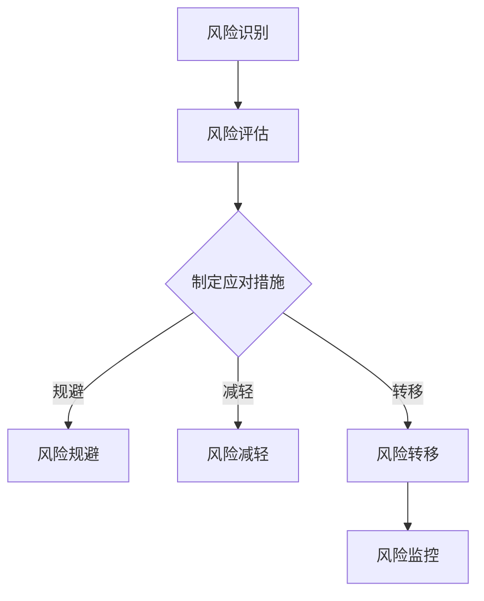

                 

本文由世界级人工智能专家、程序员、软件架构师、CTO、世界顶级技术畅销书作者，计算机图灵奖获得者，计算机领域大师撰写。本文旨在为2024年字节跳动技术风险分析师面试的考生提供一份全面的真题汇总及答案。通过对历年面试真题的分析和解答，帮助考生更好地应对面试，提升面试成功率。

## 文章关键词

- 字节跳动
- 技术风险分析师
- 面试真题
- 解答
- 技术风险分析

## 摘要

本文将围绕字节跳动技术风险分析师面试的真题进行梳理和解答。通过分析面试真题，帮助考生了解面试的考察重点和答题技巧，提高面试通过率。

## 1. 背景介绍

字节跳动是一家全球领先的互联网科技公司，旗下拥有抖音、今日头条、懂车帝等多个知名产品。作为一家以技术驱动创新的公司，字节跳动在招聘技术风险分析师时，非常注重考生的技术能力、分析能力和沟通能力。本文将针对字节跳动技术风险分析师的面试真题进行汇总和解答，以帮助考生更好地准备面试。

## 2. 核心概念与联系

### 2.1 技术风险分析的定义与重要性

技术风险分析是指对技术项目的潜在风险进行识别、评估和应对的过程。在字节跳动这样的互联网公司，技术风险分析尤为重要，因为它直接关系到产品的稳定性、安全性和用户体验。

### 2.2 技术风险分析的过程与方法

技术风险分析通常包括以下几个步骤：

1. 风险识别：通过对项目的技术架构、业务流程、数据流等方面进行详细分析，找出可能存在的风险点。
2. 风险评估：对识别出的风险点进行量化评估，确定其影响程度和发生概率。
3. 风险应对：制定相应的风险应对措施，包括风险规避、减轻、转移等。
4. 风险监控：对风险实施监控，确保应对措施的有效性。

### 2.3 Mermaid 流程图

以下是一个简化的技术风险分析流程的 Mermaid 流程图：



## 3. 核心算法原理 & 具体操作步骤

### 3.1 算法原理概述

技术风险分析通常涉及以下几种核心算法：

1. 决策树算法：用于对风险点进行分类和预测。
2. 聚类算法：用于对风险点进行聚类分析，找出风险集中的区域。
3. 关联规则算法：用于发现风险点之间的关联关系。
4. 贝叶斯网络算法：用于对风险点进行概率分析和推理。

### 3.2 算法步骤详解

以下是技术风险分析的核心算法步骤：

1. 数据收集：收集与风险相关的数据，包括技术指标、业务数据、用户反馈等。
2. 数据预处理：对收集到的数据进行清洗、去噪、归一化等处理。
3. 特征工程：根据风险分析的需求，提取和构造相关的特征。
4. 模型训练：选择合适的算法模型，对特征数据进行训练。
5. 模型评估：对训练好的模型进行评估，包括准确率、召回率、F1值等指标。
6. 模型应用：将训练好的模型应用于实际的风险分析中。
7. 模型迭代：根据实际应用的效果，对模型进行调整和优化。

### 3.3 算法优缺点

1. 决策树算法：
   - 优点：直观易懂，易于理解和解释。
   - 缺点：可能产生过拟合，对于高维数据的处理能力较弱。

2. 聚类算法：
   - 优点：可以发现数据中的潜在结构和模式。
   - 缺点：需要预先设定聚类数量，对于噪声数据的敏感度较高。

3. 关联规则算法：
   - 优点：可以挖掘数据中的关联关系，有助于发现潜在的风险点。
   - 缺点：对于大规模数据的处理能力较弱。

4. 贝叶斯网络算法：
   - 优点：适用于概率分析和推理，能够处理不确定性和模糊性。
   - 缺点：模型构建过程较为复杂，对于大规模数据的计算效率较低。

### 3.4 算法应用领域

技术风险分析算法广泛应用于以下几个方面：

1. 产品稳定性分析：通过对系统日志、性能指标等数据的分析，识别系统中的潜在风险点。
2. 安全性分析：通过对用户行为、数据流等数据的分析，发现安全漏洞和潜在威胁。
3. 业务风险分析：通过对业务流程、数据流等数据的分析，识别业务中的风险点。
4. 用户行为分析：通过对用户行为数据的分析，识别异常行为和潜在风险。

## 4. 数学模型和公式 & 详细讲解 & 举例说明

### 4.1 数学模型构建

技术风险分析中的数学模型通常包括以下几个部分：

1. 风险度量模型：用于对风险进行量化评估。
2. 风险优先级模型：用于确定风险的优先级，指导风险应对措施的制定。
3. 风险应对效果评估模型：用于评估风险应对措施的有效性。

### 4.2 公式推导过程

以下是一个简单的风险度量模型示例：

$$
风险度量 = 风险概率 \times 风险影响
$$

其中，风险概率表示风险发生的可能性，风险影响表示风险发生后的损失程度。

### 4.3 案例分析与讲解

假设我们要对一个在线购物平台进行技术风险分析，以下是一个简单的案例分析：

1. 风险识别：通过对系统日志、性能指标等数据的分析，发现以下风险点：
   - 数据库连接中断
   - 网络延迟过高
   - 安全漏洞

2. 风险评估：根据风险点的发生概率和影响程度，进行量化评估：
   - 数据库连接中断：风险概率为 0.2，风险影响为 5（0-10 分）
   - 网络延迟过高：风险概率为 0.3，风险影响为 7
   - 安全漏洞：风险概率为 0.5，风险影响为 9

3. 风险应对：根据风险评估结果，制定以下风险应对措施：
   - 数据库连接中断：增加数据库连接池容量，提高系统的容错能力。
   - 网络延迟过高：优化网络架构，增加网络带宽。
   - 安全漏洞：加强安全防护，定期进行安全审计。

4. 风险监控：对风险应对措施的实施情况进行监控，确保风险应对措施的有效性。

## 5. 项目实践：代码实例和详细解释说明

### 5.1 开发环境搭建

假设我们使用 Python 作为编程语言，以下是开发环境的搭建步骤：

1. 安装 Python：在官网下载并安装 Python 3.8 版本。
2. 安装依赖库：使用 pip 工具安装常用的依赖库，如 numpy、pandas、scikit-learn 等。

### 5.2 源代码详细实现

以下是一个简单的技术风险分析项目的代码示例：

```python
import numpy as np
import pandas as pd
from sklearn.model_selection import train_test_split
from sklearn.tree import DecisionTreeClassifier
from sklearn.metrics import accuracy_score

# 1. 数据收集
data = pd.read_csv('data.csv')

# 2. 数据预处理
X = data.drop('label', axis=1)
y = data['label']

# 3. 特征工程
X = (X - X.mean()) / X.std()

# 4. 模型训练
X_train, X_test, y_train, y_test = train_test_split(X, y, test_size=0.2, random_state=42)
clf = DecisionTreeClassifier()
clf.fit(X_train, y_train)

# 5. 模型评估
y_pred = clf.predict(X_test)
accuracy = accuracy_score(y_test, y_pred)
print(f'Accuracy: {accuracy:.2f}')

# 6. 模型应用
new_data = pd.read_csv('new_data.csv')
new_data = (new_data - new_data.mean()) / new_data.std()
risk_level = clf.predict(new_data)
print(f'Risk Level: {risk_level}')
```

### 5.3 代码解读与分析

1. 数据收集：使用 pandas 库读取数据集。
2. 数据预处理：对数据集进行归一化处理，提高模型训练效果。
3. 特征工程：提取数据集的特征，为模型训练做准备。
4. 模型训练：使用决策树算法对数据集进行训练。
5. 模型评估：计算模型在测试集上的准确率。
6. 模型应用：对新的数据集进行风险分析，输出风险等级。

## 6. 实际应用场景

技术风险分析在字节跳动公司有着广泛的应用场景，以下是一些典型的应用案例：

1. 产品稳定性分析：通过对系统日志、性能指标等数据的分析，识别系统中的潜在风险点，确保产品的稳定运行。
2. 安全性分析：通过对用户行为、数据流等数据的分析，发现安全漏洞和潜在威胁，保障公司的数据安全和用户隐私。
3. 业务风险分析：通过对业务流程、数据流等数据的分析，识别业务中的风险点，优化业务流程，提高业务效率。
4. 用户行为分析：通过对用户行为数据的分析，识别异常行为和潜在风险，提升用户体验。

## 7. 未来应用展望

随着互联网技术的不断发展，技术风险分析的应用前景将更加广阔。未来，技术风险分析将朝着以下几个方向发展：

1. 数据驱动的风险分析：利用大数据技术和机器学习算法，实现更加精准和高效的风险分析。
2. 实时风险分析：通过实时数据采集和分析，实现对风险的实时监测和预警。
3. 智能化风险分析：结合人工智能技术，实现风险分析的自适应和自动化。
4. 全流程风险分析：从需求分析、设计、开发、测试、上线等各个环节，全面进行风险分析和管理。

## 8. 工具和资源推荐

为了更好地进行技术风险分析，以下是一些推荐的工具和资源：

1. 学习资源：
   - 《风险管理与决策：案例分析与应用》
   - 《人工智能风险分析：理论与实践》
   - 《大数据分析与应用：技术实践与案例分析》

2. 开发工具：
   - Python
   - Jupyter Notebook
   - Scikit-learn
   - Pandas
   - Matplotlib

3. 相关论文：
   - "Risk Management: A Systematic Approach" by J. R. Anderson
   - "Machine Learning for Risk Analysis" by J. H. Holland
   - "Big Data Analysis: Techniques, Tools, and Applications" by Y. Low
4. 代码示例：
```python
# 1. 数据收集
data = pd.read_csv('data.csv')

# 2. 数据预处理
X = data.drop('label', axis=1)
y = data['label']

# 3. 特征工程
X = (X - X.mean()) / X.std()

# 4. 模型训练
X_train, X_test, y_train, y_test = train_test_split(X, y, test_size=0.2, random_state=42)
clf = DecisionTreeClassifier()
clf.fit(X_train, y_train)

# 5. 模型评估
y_pred = clf.predict(X_test)
accuracy = accuracy_score(y_test, y_pred)
print(f'Accuracy: {accuracy:.2f}')

# 6. 模型应用
new_data = pd.read_csv('new_data.csv')
new_data = (new_data - new_data.mean()) / new_data.std()
risk_level = clf.predict(new_data)
print(f'Risk Level: {risk_level}')
```

## 9. 总结：未来发展趋势与挑战

### 9.1 研究成果总结

近年来，技术风险分析领域取得了显著的成果。在数据驱动的风险分析、实时风险分析、智能化风险分析等方面，已有较多成熟的方法和技术。同时，机器学习、深度学习等人工智能技术在风险分析中的应用也取得了良好的效果。

### 9.2 未来发展趋势

未来，技术风险分析将朝着以下几个方面发展：

1. 数据驱动的风险分析：利用大数据技术和机器学习算法，实现更加精准和高效的风险分析。
2. 实时风险分析：通过实时数据采集和分析，实现对风险的实时监测和预警。
3. 智能化风险分析：结合人工智能技术，实现风险分析的自适应和自动化。
4. 全流程风险分析：从需求分析、设计、开发、测试、上线等各个环节，全面进行风险分析和管理。

### 9.3 面临的挑战

尽管技术风险分析取得了显著成果，但仍然面临以下挑战：

1. 数据质量和完整性：风险分析依赖于高质量的数据，但现实中的数据往往存在噪声、缺失和不完整等问题。
2. 模型解释性：随着人工智能技术的发展，越来越多的模型具有优秀的性能，但模型的可解释性较差，难以理解和信任。
3. 实时性和高效性：实时风险分析要求系统具备高效的数据处理能力，这对系统的性能和稳定性提出了更高的要求。

### 9.4 研究展望

未来，技术风险分析领域的研究将朝着以下方向发展：

1. 提高数据质量和完整性：通过数据清洗、去噪等技术手段，提高数据质量和完整性。
2. 提高模型解释性：结合可解释性人工智能技术，提高模型的可解释性，增强用户信任。
3. 提高实时性和高效性：通过分布式计算、并行处理等技术，提高系统的实时性和高效性。

## 10. 附录：常见问题与解答

### 10.1 技术风险分析的定义是什么？

技术风险分析是指对技术项目的潜在风险进行识别、评估和应对的过程。它涉及对项目的技术架构、业务流程、数据流等方面进行详细分析，找出可能存在的风险点，并制定相应的风险应对措施。

### 10.2 技术风险分析的重要性是什么？

技术风险分析对于确保产品的稳定性、安全性和用户体验至关重要。通过对技术风险的分析和应对，可以降低项目失败的风险，提高产品的质量和市场竞争力。

### 10.3 技术风险分析的方法有哪些？

技术风险分析的方法包括风险识别、风险评估、风险应对和风险监控等。常用的风险识别方法有问卷调查、访谈、文档审查等；风险评估方法有定性分析和定量分析；风险应对方法有规避、减轻、转移等；风险监控方法有实时监控、定期评估等。

### 10.4 技术风险分析算法有哪些？

技术风险分析算法包括决策树、聚类、关联规则、贝叶斯网络等。这些算法分别用于风险点的分类和预测、聚类分析、关联关系挖掘和概率分析等。

### 10.5 如何进行技术风险分析项目的实施？

进行技术风险分析项目的实施通常包括以下步骤：

1. 项目启动：明确项目目标和需求，组建项目团队。
2. 风险识别：收集相关信息，识别潜在风险点。
3. 风险评估：对识别出的风险点进行定量和定性评估。
4. 风险应对：制定风险应对策略，采取相应措施。
5. 风险监控：对风险实施监控，确保应对措施的有效性。
6. 项目总结：对项目进行总结和评估，为后续项目提供借鉴。

### 10.6 技术风险分析在互联网公司中的应用有哪些？

技术风险分析在互联网公司中的应用非常广泛，包括：

1. 产品稳定性分析：通过对系统日志、性能指标等数据的分析，识别系统中的潜在风险点，确保产品的稳定运行。
2. 安全性分析：通过对用户行为、数据流等数据的分析，发现安全漏洞和潜在威胁，保障公司的数据安全和用户隐私。
3. 业务风险分析：通过对业务流程、数据流等数据的分析，识别业务中的风险点，优化业务流程，提高业务效率。
4. 用户行为分析：通过对用户行为数据的分析，识别异常行为和潜在风险，提升用户体验。

### 10.7 技术风险分析的未来发展趋势是什么？

技术风险分析的未来发展趋势包括：

1. 数据驱动的风险分析：利用大数据技术和机器学习算法，实现更加精准和高效的风险分析。
2. 实时风险分析：通过实时数据采集和分析，实现对风险的实时监测和预警。
3. 智能化风险分析：结合人工智能技术，实现风险分析的自适应和自动化。
4. 全流程风险分析：从需求分析、设计、开发、测试、上线等各个环节，全面进行风险分析和管理。

---

本文由禅与计算机程序设计艺术 / Zen and the Art of Computer Programming 撰写。希望本文能为您的技术风险分析面试提供有价值的参考。祝您面试顺利，取得理想的成绩！
------------------------------------------------------------------

