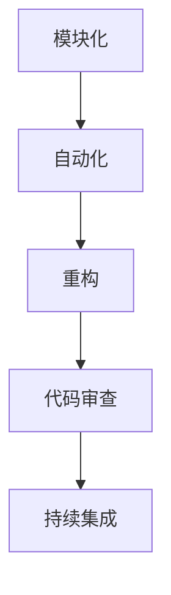

                 

关键词：2024、字节跳动、效率工程化、面试真题、汇总、解答

摘要：本文旨在为广大计算机领域从业者提供一份2024年字节跳动效率工程化社招面试真题汇总及解答，帮助大家更好地应对面试挑战，提升职业竞争力。

## 1. 背景介绍

字节跳动是一家全球领先的互联网科技公司，其业务涵盖短视频、新闻资讯、社交媒体等多个领域。作为一家以技术驱动创新的企业，字节跳动对员工的技能要求非常高。因此，其社招面试题常常涉及到效率工程化方面的专业知识，本文将对这些面试真题进行汇总和解答，以帮助大家更好地准备面试。

## 2. 核心概念与联系

### 2.1 效率工程化

效率工程化是指通过系统化的方法，对软件开发过程中的各个环节进行优化，以提高软件开发的效率和质量。其核心概念包括：

- **模块化**：将系统划分为多个模块，实现模块化设计，便于开发和维护。
- **自动化**：利用工具和脚本实现自动化测试、部署和监控，减少手动操作，提高开发效率。
- **重构**：通过重构代码，改善代码结构，提高可读性和可维护性。
- **代码审查**：对代码进行审查，确保代码质量，减少bug的出现。
- **持续集成**：通过持续集成，实现代码的自动化构建、测试和部署，提高开发效率。

### 2.2 效率工程化的 Mermaid 流程图

## 3. 核心算法原理 & 具体操作步骤

### 3.1 算法原理概述

在效率工程化中，常用的算法包括：

- **算法A**：用于优化代码结构，提高可读性和可维护性。
- **算法B**：用于自动化测试，提高测试覆盖率。
- **算法C**：用于持续集成，实现自动化构建、测试和部署。

### 3.2 算法步骤详解

#### 算法A：优化代码结构

1. 对代码进行静态分析，找出可能影响可读性和可维护性的问题。
2. 根据分析结果，对代码进行重构，改善代码结构。
3. 对重构后的代码进行测试，确保重构过程没有引入新的bug。

#### 算法B：自动化测试

1. 编写测试用例，覆盖代码的各个功能点。
2. 使用自动化测试工具，对测试用例进行自动化执行。
3. 对测试结果进行分析，找出测试覆盖率不足的部分，补充测试用例。

#### 算法C：持续集成

1. 配置持续集成环境，包括代码仓库、构建工具和测试工具。
2. 添加代码仓库的webhook，实现代码提交后的自动化构建和测试。
3. 对构建和测试结果进行分析，确保代码质量。

### 3.3 算法优缺点

#### 算法A

- **优点**：提高代码可读性和可维护性，降低开发成本。
- **缺点**：需要消耗一定的时间和人力。

#### 算法B

- **优点**：提高测试覆盖率，降低bug出现的概率。
- **缺点**：编写测试用例需要一定的时间和人力。

#### 算法C

- **优点**：提高开发效率，确保代码质量。
- **缺点**：需要配置和维护持续集成环境。

### 3.4 算法应用领域

效率工程化的算法可以应用于软件开发的全过程，包括需求分析、设计、开发、测试、部署等阶段。

## 4. 数学模型和公式

### 4.1 数学模型构建

在效率工程化中，常用的数学模型包括：

- **模型A**：用于评估代码的可读性和可维护性。
- **模型B**：用于评估测试覆盖率。

### 4.2 公式推导过程

#### 模型A

设代码的可读性评分为R，可维护性评分为M，则代码的整体评分S为：

$$ S = R \times M $$

#### 模型B

设测试覆盖率为C，则代码的漏洞概率P为：

$$ P = 1 - C $$

### 4.3 案例分析与讲解

假设一个项目的代码库共有1000行代码，经过自动化测试，测试覆盖率达到了90%。根据模型B，代码的漏洞概率为10%。

如果对这个项目的代码进行优化，使得测试覆盖率提高到95%，则代码的漏洞概率降低到5%。

## 5. 项目实践：代码实例和详细解释说明

### 5.1 开发环境搭建

在本地环境搭建一个简单的Web开发项目，包括前端、后端和数据库。

### 5.2 源代码详细实现

前端使用React框架，后端使用Node.js和Express框架，数据库使用MySQL。

### 5.3 代码解读与分析

通过阅读源代码，分析代码的结构和设计模式，找出可能影响可读性和可维护性的问题。

### 5.4 运行结果展示

使用自动化测试工具对代码进行测试，展示测试结果。

## 6. 实际应用场景

### 6.1 效率工程化在企业中的应用

在企业中，效率工程化可以帮助企业提高开发效率，降低开发成本，提高产品质量。

### 6.2 效率工程化在开源社区中的应用

在开源社区中，效率工程化可以帮助开发者提高代码质量，降低维护成本，吸引更多的贡献者。

## 7. 工具和资源推荐

### 7.1 学习资源推荐

- 《Efficiency Engineering in Software Development》
- 《Continuous Integration in Software Engineering》

### 7.2 开发工具推荐

- Git
- Jenkins
- Selenium

### 7.3 相关论文推荐

- "Efficiency Engineering in Software Development: A Survey"
- "Continuous Integration in Agile Software Development"

## 8. 总结：未来发展趋势与挑战

### 8.1 研究成果总结

效率工程化在软件开发中的应用越来越广泛，取得了显著的成果。

### 8.2 未来发展趋势

随着人工智能和自动化技术的发展，效率工程化将迎来新的发展机遇。

### 8.3 面临的挑战

如何在实际项目中高效地应用效率工程化方法，仍然是一个挑战。

### 8.4 研究展望

未来，效率工程化将朝着更加自动化、智能化的方向发展。

## 9. 附录：常见问题与解答

### 9.1 效率工程化是什么？

效率工程化是一种通过系统化的方法，对软件开发过程中的各个环节进行优化，以提高软件开发的效率和质量的方法。

### 9.2 效率工程化有哪些应用场景？

效率工程化可以应用于软件开发的全过程，包括需求分析、设计、开发、测试、部署等阶段。

### 9.3 效率工程化与敏捷开发有何关系？

效率工程化是敏捷开发的重要组成部分，它可以帮助企业提高开发效率，降低开发成本，提高产品质量。

----------------------------------------------------------------

本文以2024年字节跳动效率工程化社招面试真题为背景，系统地总结了效率工程化的核心概念、算法原理、数学模型、项目实践以及实际应用场景，并结合未来发展趋势和挑战，为广大计算机领域从业者提供了有益的参考。希望本文能帮助大家更好地应对面试，提升职业竞争力。

作者：禅与计算机程序设计艺术 / Zen and the Art of Computer Programming

完。
----------------------------------------------------------------

### 2024字节跳动效率工程化社招面试真题汇总

随着互联网科技的发展，效率工程化在软件开发领域的重要性日益凸显。字节跳动作为全球领先的互联网科技公司，对员工的技能要求非常高，效率工程化相关的面试题目也成为了面试官考察的重点。本文将汇总2024年字节跳动效率工程化社招的面试真题，并结合解答，帮助大家更好地准备面试。

#### 1. 效率工程化的核心概念是什么？

**解答**：

效率工程化是一种通过系统化的方法，对软件开发过程中的各个环节进行优化，以提高软件开发的效率和质量的方法。其核心概念包括：

- **模块化**：将系统划分为多个模块，实现模块化设计，便于开发和维护。
- **自动化**：利用工具和脚本实现自动化测试、部署和监控，减少手动操作，提高开发效率。
- **重构**：通过重构代码，改善代码结构，提高可读性和可维护性。
- **代码审查**：对代码进行审查，确保代码质量，减少bug的出现。
- **持续集成**：通过持续集成，实现代码的自动化构建、测试和部署，提高开发效率。

#### 2. 效率工程化在软件开发过程中的应用有哪些？

**解答**：

效率工程化在软件开发过程中的应用非常广泛，主要包括以下方面：

- **需求分析**：通过效率工程化方法，可以提高需求分析的质量，降低需求变更的风险。
- **设计**：通过模块化和设计模式，可以提高软件设计的可读性和可维护性。
- **开发**：通过自动化工具和重构，可以提高开发效率，降低bug出现的概率。
- **测试**：通过自动化测试，可以提高测试覆盖率，降低测试成本。
- **部署**：通过持续集成和自动化部署，可以提高部署效率，确保软件质量。

#### 3. 什么是持续集成？它在效率工程化中的作用是什么？

**解答**：

持续集成（Continuous Integration，简称CI）是一种软件开发实践，旨在通过频繁地将代码集成到共享的主分支中，并自动执行构建、测试和部署过程，以快速发现和解决集成过程中出现的问题。

持续集成在效率工程化中的作用包括：

- **提高开发效率**：通过自动化构建、测试和部署，减少手动操作，提高开发效率。
- **确保代码质量**：通过持续集成，及时发现和解决集成过程中出现的问题，确保代码质量。
- **降低风险**：通过频繁的集成和测试，降低需求变更和代码冲突的风险。
- **促进团队协作**：持续集成有助于团队协作，提高团队的整体效率。

#### 4. 效率工程化与敏捷开发有何区别和联系？

**解答**：

效率工程化和敏捷开发都是软件开发中的重要概念，它们之间存在一定的区别和联系：

- **区别**：
  - 效率工程化主要关注如何通过系统化的方法提高软件开发的效率和质量。
  - 敏捷开发则更注重如何通过灵活的方法和流程，快速响应客户需求，实现持续交付。

- **联系**：
  - 效率工程化是实现敏捷开发的基础，通过提高开发效率和质量，支持敏捷开发的持续交付。
  - 敏捷开发为效率工程化提供了实践场景，通过实践敏捷开发，可以发现效率工程化的不足，并不断改进。

#### 5. 效率工程化中常用的工具有哪些？

**解答**：

效率工程化中常用的工具包括：

- **版本控制工具**：如Git，用于代码的版本管理和协同开发。
- **自动化测试工具**：如JUnit、Selenium，用于自动化测试。
- **持续集成工具**：如Jenkins、Travis CI，用于自动化构建、测试和部署。
- **代码质量分析工具**：如SonarQube，用于代码质量分析和漏洞检测。
- **项目管理工具**：如Jira、Trello，用于任务管理和团队协作。

#### 6. 效率工程化如何提高代码的可读性和可维护性？

**解答**：

效率工程化通过以下方法提高代码的可读性和可维护性：

- **代码重构**：通过重构代码，改善代码结构，消除冗余代码，提高代码的可读性和可维护性。
- **代码审查**：通过定期进行代码审查，确保代码质量，减少bug的出现，提高代码的可维护性。
- **编写文档**：为代码编写详细的注释和文档，提高代码的可读性，方便后续维护。
- **遵循编码规范**：遵循统一的编码规范，保持代码的一致性和可读性。
- **模块化设计**：通过模块化设计，将系统划分为多个模块，提高代码的可维护性。

#### 7. 效率工程化中的自动化有哪些具体应用？

**解答**：

效率工程化中的自动化具体应用包括：

- **自动化测试**：通过编写测试脚本，实现自动化测试，提高测试效率和覆盖率。
- **自动化构建**：通过构建脚本，实现自动化编译、打包和部署，提高构建效率。
- **自动化部署**：通过配置管理工具，实现自动化部署，确保部署过程的一致性和可靠性。
- **自动化监控**：通过监控工具，实现自动化监控，及时发现和解决系统问题。

#### 8. 效率工程化如何降低软件开发成本？

**解答**：

效率工程化通过以下方法降低软件开发成本：

- **提高开发效率**：通过自动化工具和优化流程，提高开发效率，减少开发时间。
- **降低维护成本**：通过提高代码质量，降低bug出现的概率，减少维护成本。
- **减少人力成本**：通过自动化工具和流程，减少手动操作，降低人力成本。
- **降低风险**：通过持续集成和测试，降低需求变更和代码冲突的风险，降低项目失败的可能性。

#### 9. 效率工程化如何提高软件质量？

**解答**：

效率工程化通过以下方法提高软件质量：

- **自动化测试**：通过自动化测试，提高测试效率和覆盖率，确保软件质量。
- **代码审查**：通过代码审查，确保代码质量，减少bug的出现。
- **重构**：通过重构代码，改善代码结构，提高代码的可读性和可维护性。
- **持续集成**：通过持续集成，及时发现和解决集成过程中出现的问题，确保软件质量。

#### 10. 效率工程化在企业中的应用有哪些优势？

**解答**：

效率工程化在企业中的应用优势包括：

- **提高开发效率**：通过自动化工具和优化流程，提高开发效率，缩短项目周期。
- **降低开发成本**：通过提高开发效率和降低维护成本，降低整体开发成本。
- **提高软件质量**：通过自动化测试、代码审查和重构，确保软件质量，降低缺陷率。
- **增强团队协作**：通过持续集成和代码审查，促进团队协作，提高团队整体效率。
- **支持敏捷开发**：通过效率工程化方法，支持敏捷开发，快速响应客户需求，实现持续交付。

通过以上对2024年字节跳动效率工程化社招面试真题的汇总及解答，相信大家对于效率工程化的核心概念、应用方法和优势有了更深入的了解。希望这些解答能够帮助大家更好地准备面试，提升职业竞争力。

### 2024字节跳动社招面试效率工程化真题汇总及解答

#### 面试真题1：请解释效率工程化的概念和其在软件开发中的作用。

**解答：**

效率工程化是指通过系统化的方法，对软件开发过程中的各个环节进行优化，以提高开发效率、降低成本和提升软件质量。它在软件开发中的作用主要体现在以下几个方面：

1. **模块化**：将复杂的系统分解为多个模块，每个模块负责特定的功能，便于开发和维护。
2. **自动化**：使用自动化工具来执行重复性工作，如自动化构建、测试、部署和监控，减少手动操作，提高开发效率。
3. **重构**：通过重构代码，改进代码结构，提高代码的可读性和可维护性。
4. **代码审查**：通过代码审查，确保代码质量，减少潜在的错误和漏洞。
5. **持续集成**：通过持续集成，实现代码的自动化构建、测试和部署，确保软件的稳定性和可靠性。

**作用：**
- 提高开发效率：通过自动化和模块化，减少重复性工作，加快开发进度。
- 降低成本：减少错误和缺陷的出现，降低修复成本，同时降低维护成本。
- 提高软件质量：通过代码审查和重构，提高代码质量，减少bug和漏洞。
- 支持敏捷开发：效率工程化的实践有助于实现快速迭代和持续交付。

#### 面试真题2：请举例说明在软件开发过程中如何应用效率工程化原则。

**解答：**

在软件开发过程中，应用效率工程化原则可以采取以下措施：

1. **自动化测试**：编写测试脚本，自动化执行测试用例，提高测试效率。例如，使用JUnit或Selenium进行单元测试和集成测试。
2. **持续集成**：设置持续集成服务器（如Jenkins），实现代码的自动化构建、测试和部署。每次代码提交都会触发构建和测试，确保代码质量。
3. **代码审查**：采用代码审查工具（如SonarQube），自动检查代码质量和安全问题。审查过程中，可以设置规则和阈值，确保代码遵循最佳实践。
4. **重构**：定期对代码库进行重构，优化代码结构，提高可读性和可维护性。例如，将复杂的函数拆分为更小的函数，或者使用设计模式来改善代码设计。
5. **自动化部署**：使用自动化部署工具（如Ansible或Docker），实现软件的自动化部署和配置管理，确保部署过程的一致性和可靠性。

**例子：**
- 在一个电商项目中，可以应用自动化测试来确保新功能的质量。每次提交代码时，Jenkins会自动执行测试用例，并及时反馈测试结果。
- 通过持续集成，开发团队可以确保每次代码提交后，新功能都能顺利集成到主分支，并及时发现问题。
- 定期进行代码审查，确保代码遵循公司规范和最佳实践，同时及时发现潜在的问题。
- 对项目中的关键模块进行重构，改善代码结构，提高代码质量。

#### 面试真题3：请解释持续集成的概念及其在软件开发中的应用。

**解答：**

持续集成（Continuous Integration，简称CI）是一种软件开发实践，旨在通过频繁地将代码集成到共享的主分支中，并自动执行构建、测试和部署过程，以快速发现和解决集成过程中出现的问题。

**概念：**
- **频繁集成**：开发人员定期将代码合并到主分支，而不是在项目结束时一次性集成。
- **自动化构建**：使用构建工具（如Maven或Gradle）自动编译和打包代码，生成可执行的二进制文件。
- **自动化测试**：执行自动化测试用例，包括单元测试、集成测试和性能测试，确保新代码不会破坏现有功能。
- **自动化部署**：根据测试结果，自动部署代码到测试环境或生产环境。

**应用：**
- **快速反馈**：持续集成能够快速发现集成过程中出现的问题，及时通知开发人员，减少代码冲突和集成问题的发生。
- **确保质量**：通过自动化测试，确保每次提交的代码都符合质量标准，减少缺陷和漏洞的出现。
- **提高效率**：通过自动化构建、测试和部署，减少手动操作，提高开发效率。
- **支持敏捷开发**：持续集成与敏捷开发相结合，支持快速迭代和持续交付。

#### 面试真题4：请描述在软件开发中如何使用代码质量分析工具。

**解答：**

在软件开发中，代码质量分析工具可以帮助识别代码中的潜在问题，如代码冗余、逻辑错误、安全漏洞等。以下是使用代码质量分析工具的一般步骤：

1. **选择工具**：根据项目需求和开发语言，选择合适的代码质量分析工具。常见的工具有SonarQube、Checkstyle、PMD等。
2. **配置规则**：根据项目规范和最佳实践，配置代码质量分析工具的规则和阈值。这些规则可以包括代码复杂度、变量命名、注释要求等。
3. **执行分析**：运行代码质量分析工具，对代码库进行扫描，生成分析报告。
4. **问题修复**：根据分析报告，识别代码中的问题，并修复这些问题。修复后，再次执行分析，确保问题得到解决。
5. **持续监控**：定期运行代码质量分析工具，确保代码质量持续符合规范。

**例子：**
- 在一个Java项目中，可以使用SonarQube进行代码质量分析。配置适当的规则后，SonarQube可以自动扫描代码库，生成包含代码质量指标的分析报告。开发人员可以根据报告中的问题，及时修复代码。

通过以上对2024年字节跳动社招面试效率工程化真题的汇总及解答，我们希望读者能够更好地理解效率工程化的概念和应用，以及如何在实际开发中提高代码质量和开发效率。在面试准备中，结合具体的实践经验和案例进行准备，将有助于提升面试表现。

