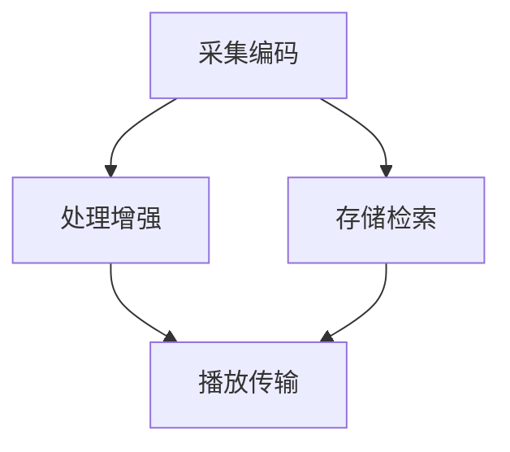

                 

关键词：字节跳动，校招，视频处理，面试题，技术博客

摘要：本文将针对2024年字节跳动校招中视频处理工程师岗位的面试题目进行详细解析，帮助准备参加面试的考生了解视频处理相关的技术概念、算法原理、数学模型以及项目实践。文章结构将包括背景介绍、核心概念与联系、核心算法原理与操作步骤、数学模型与公式讲解、项目实践以及未来应用展望等内容。

## 1. 背景介绍

随着互联网和移动互联网的快速发展，视频已经成为人们获取信息和娱乐的重要方式。字节跳动作为国内领先的科技公司，其旗下抖音、今日头条等产品在视频处理技术上有着深厚积累。2024年字节跳动校招中，视频处理工程师岗位备受关注，对于应聘者而言，掌握视频处理技术是通往这个岗位的关键。

本文将围绕视频处理工程师岗位，解析面试中可能会遇到的关键技术点，包括核心概念、算法原理、数学模型以及实际项目实践等。通过本文的学习，读者可以全面了解视频处理领域的知识体系，为应对面试做好充分准备。

### 1.1 视频处理技术概述

视频处理技术是指对视频信号进行加工、处理和转换的一系列技术，包括视频编码、视频压缩、视频增强、视频检索等。在字节跳动这样的科技公司，视频处理技术主要用于提升用户体验，包括视频加载速度、清晰度以及互动性等。

### 1.2 字节跳动视频处理技术优势

字节跳动在视频处理技术领域有着显著的优势：

1. **强大的算法团队**：字节跳动拥有世界级的算法团队，他们在视频处理算法的研究和应用方面有着丰富的经验。
2. **丰富的产品场景**：抖音、今日头条等产品的多样性为视频处理技术的应用提供了丰富的场景，包括短视频编辑、视频推荐、视频搜索等。
3. **技术创新能力**：字节跳动在人工智能、机器学习等前沿技术领域不断探索，为视频处理技术提供了强大的技术支持。

## 2. 核心概念与联系

### 2.1 视频处理核心概念

在视频处理领域，以下核心概念是理解和应用视频处理技术的基础：

1. **视频编码**：视频编码是将视频信号转换成数字信号的过程，包括帧率、分辨率、色度等参数。
2. **视频压缩**：视频压缩是为了减少视频数据的大小，提高传输和存储效率，常见的压缩标准有H.264、H.265等。
3. **视频增强**：视频增强是对视频画质进行提升的技术，包括去噪、锐化、超分辨率等。
4. **视频检索**：视频检索是通过关键词或内容对视频进行分类和检索的技术。

### 2.2 视频处理架构

视频处理架构通常包括以下几个层次：

1. **采集与编码**：采集视频信号，并进行编码处理。
2. **存储与检索**：将编码后的视频数据存储在数据库中，并实现视频检索功能。
3. **处理与增强**：对视频进行增强处理，如去噪、锐化等。
4. **播放与传输**：将处理后的视频数据传输到客户端进行播放。

以下是视频处理架构的 Mermaid 流程图：



## 3. 核心算法原理 & 具体操作步骤

### 3.1 算法原理概述

视频处理中的核心算法主要包括视频编码算法、视频压缩算法和视频增强算法。以下是这些算法的简要概述：

1. **视频编码算法**：视频编码算法是将视频信号转换成数字信号的过程，常用的编码算法有H.264、H.265等。这些算法通过预测和变换技术，将视频序列分解为一系列的图像帧，并采用高效的编码方式减少冗余信息。
2. **视频压缩算法**：视频压缩算法是为了减少视频数据的大小，提高传输和存储效率。压缩算法通过数据去重、预测编码等技术，实现视频数据的压缩。常见的压缩标准有H.264、H.265、HEVC等。
3. **视频增强算法**：视频增强算法是对视频画质进行提升的技术，包括去噪、锐化、超分辨率等。这些算法通过图像处理技术，对视频图像进行增强，提高视频的观看体验。

### 3.2 算法步骤详解

1. **视频编码算法步骤**：
   1. 视频信号采集：通过摄像头或视频文件采集视频信号。
   2. 预处理：对视频信号进行预处理，如降噪、去抖动等。
   3. 分帧：将视频信号分解为一系列的图像帧。
   4. 预测编码：对图像帧进行预测编码，减少冗余信息。
   5. 变换编码：对预测编码后的图像帧进行变换编码，进一步提高压缩效率。
   6. 压缩编码：对变换编码后的图像帧进行压缩编码，生成压缩后的视频数据。

2. **视频压缩算法步骤**：
   1. 视频信号采集：同上。
   2. 视频编码：通过视频编码算法生成压缩前的视频数据。
   3. 数据去重：对视频数据中的冗余信息进行去除，减少数据大小。
   4. 预测编码：对视频数据中的图像帧进行预测编码，减少冗余信息。
   5. 变换编码：对预测编码后的图像帧进行变换编码，进一步提高压缩效率。
   6. 压缩编码：对变换编码后的图像帧进行压缩编码，生成压缩后的视频数据。

3. **视频增强算法步骤**：
   1. 视频信号采集：同上。
   2. 视频编码：同上。
   3. 去噪处理：对视频图像进行去噪处理，减少图像噪声。
   4. 锐化处理：对视频图像进行锐化处理，提高图像清晰度。
   5. 超分辨率处理：对视频图像进行超分辨率处理，提高图像分辨率。
   6. 视频增强输出：将处理后的视频图像输出，实现视频增强效果。

### 3.3 算法优缺点

1. **视频编码算法**：
   - 优点：高效地压缩视频数据，提高传输和存储效率。
   - 缺点：压缩过程中可能会损失一定的视频质量。

2. **视频压缩算法**：
   - 优点：显著减少视频数据大小，提高传输和存储效率。
   - 缺点：压缩过程中可能会引入一些失真，影响视频质量。

3. **视频增强算法**：
   - 优点：显著提高视频画质，提升观看体验。
   - 缺点：增强效果可能过度，导致图像失真。

### 3.4 算法应用领域

视频处理算法在多个领域有广泛应用，包括但不限于：

1. **视频直播**：通过视频编码和压缩算法，实现实时视频直播的传输和播放。
2. **视频点播**：通过视频编码和压缩算法，实现视频点播服务的传输和存储。
3. **视频增强**：通过视频增强算法，提高视频画质，提升用户体验。
4. **视频检索**：通过视频检索算法，实现视频内容的快速搜索和分类。

## 4. 数学模型和公式 & 详细讲解 & 举例说明

### 4.1 数学模型构建

在视频处理中，常用的数学模型包括：

1. **图像处理模型**：用于对视频图像进行预处理、增强和滤波等操作。
2. **视频编码模型**：用于对视频信号进行编码和解码。
3. **视频压缩模型**：用于对视频数据进行压缩和解压缩。

以下是这些模型的构建过程：

1. **图像处理模型**：

   - **预处理模型**：用于对图像进行降噪、去抖动等预处理操作。

     $$Y = f(X)$$

     其中，$X$ 为原始图像，$Y$ 为预处理后的图像，$f(X)$ 为预处理函数。

   - **增强模型**：用于对图像进行锐化、去噪等增强操作。

     $$Z = g(Y)$$

     其中，$Y$ 为预处理后的图像，$Z$ 为增强后的图像，$g(Y)$ 为增强函数。

2. **视频编码模型**：

   - **变换编码模型**：用于对视频图像进行变换编码。

     $$C = T(X)$$

     其中，$X$ 为视频图像，$C$ 为变换编码后的图像，$T(X)$ 为变换编码函数。

   - **预测编码模型**：用于对视频图像进行预测编码。

     $$D = P(X)$$

     其中，$X$ 为视频图像，$D$ 为预测编码后的图像，$P(X)$ 为预测编码函数。

3. **视频压缩模型**：

   - **数据去重模型**：用于去除视频数据中的冗余信息。

     $$R = D - R_d$$

     其中，$R$ 为原始视频数据，$R_d$ 为去除冗余信息后的视频数据，$R_d$ 为去重函数。

   - **压缩编码模型**：用于对视频数据进行压缩编码。

     $$C = C(R)$$

     其中，$R$ 为原始视频数据，$C$ 为压缩编码后的视频数据，$C(R)$ 为压缩编码函数。

### 4.2 公式推导过程

以下是视频处理中一些关键公式的推导过程：

1. **图像去噪公式**：

   - **高斯滤波器**：

     $$G(x, y) = \frac{1}{2\pi\sigma^2} e^{-\frac{(x^2 + y^2)}{2\sigma^2}}$$

     其中，$G(x, y)$ 为高斯滤波器，$\sigma$ 为高斯滤波器的标准差。

   - **去噪公式**：

     $$Y = X - \frac{1}{N}\sum_{i=1}^{N}\sum_{j=1}^{N}G(x_i, y_j)I(x_i, y_j)$$

     其中，$X$ 为原始图像，$Y$ 为去噪后的图像，$I(x_i, y_j)$ 为图像上的每个像素值，$N$ 为滤波器的大小。

2. **图像锐化公式**：

   - **拉普拉斯算子**：

     $$L(x, y) = \begin{cases} 
     \sum_{i=-1}^{1}\sum_{j=-1}^{1} G(x+i, y+j) \cdot \left| X(x+i, y+j) - X(x, y) \right|, & \text{if } X(x, y) \text{ is not a border pixel} \\
     0, & \text{otherwise}
     \end{cases}$$

     其中，$L(x, y)$ 为拉普拉斯算子，$G(x+i, y+j)$ 为高斯滤波器，$X(x+i, y+j)$ 为图像上的每个像素值。

   - **锐化公式**：

     $$Z = X + \alpha \cdot L(x, y)$$

     其中，$X$ 为原始图像，$Z$ 为锐化后的图像，$\alpha$ 为锐化参数。

### 4.3 案例分析与讲解

以下是一个视频处理数学模型的应用案例：

**案例**：对一段视频进行去噪处理。

1. **采集视频数据**：采集一段包含噪声的视频数据。

2. **预处理**：对视频数据进行预处理，包括去噪、去抖动等。

3. **去噪处理**：
   - **高斯滤波**：使用高斯滤波器对视频图像进行滤波，去除噪声。
   - **去噪公式**：使用去噪公式对滤波后的图像进行去噪处理。

4. **增强处理**：对去噪后的图像进行增强处理，如锐化等。

5. **输出结果**：将处理后的视频数据输出，实现视频去噪。

以下是去噪处理的具体步骤：

1. **高斯滤波**：
   - **初始化**：设置高斯滤波器的标准差$\sigma$。
   - **滤波**：对视频图像进行高斯滤波，生成滤波后的图像。

2. **去噪**：
   - **初始化**：设置去噪参数$\alpha$。
   - **去噪**：使用去噪公式对滤波后的图像进行去噪处理，生成去噪后的图像。

3. **增强**：
   - **初始化**：设置锐化参数$\alpha$。
   - **锐化**：使用锐化公式对去噪后的图像进行锐化处理，生成增强后的图像。

4. **输出**：
   - **输出结果**：将处理后的视频图像输出，实现视频去噪。

## 5. 项目实践：代码实例和详细解释说明

### 5.1 开发环境搭建

在进行视频处理项目的实践之前，我们需要搭建一个合适的开发环境。以下是常用的开发环境搭建步骤：

1. **安装操作系统**：选择适合的操作系统，如Linux或Windows。
2. **安装编译器**：安装C/C++编译器，如GCC或Clang。
3. **安装视频处理库**：安装常用的视频处理库，如FFmpeg、OpenCV等。
4. **安装开发工具**：安装集成开发环境（IDE），如Visual Studio或Eclipse。

### 5.2 源代码详细实现

以下是一个简单的视频去噪项目的源代码实现：

```c++
#include <opencv2/opencv.hpp>
#include <iostream>

using namespace cv;
using namespace std;

// 高斯滤波器
Mat GaussianFilter(const Mat& src, float sigma) {
    int kernel_size = 3 + 2 * int(sigma + 0.5);
    Mat kernel(kernel_size, kernel_size, CV_32F);
    float sum = 0.0;
    for (int i = -kernel_size / 2; i <= kernel_size / 2; i++) {
        for (int j = -kernel_size / 2; j <= kernel_size / 2; j++) {
            float g = exp(-(i * i + j * j) / (2 * sigma * sigma));
            kernel.at<float>(i + kernel_size / 2, j + kernel_size / 2) = g;
            sum += g;
        }
    }
    for (int i = 0; i < kernel_size; i++) {
        for (int j = 0; j < kernel_size; j++) {
            kernel.at<float>(i, j) /= sum;
        }
    }
    return kernel;
}

// 去噪函数
Mat denoise(const Mat& src) {
    Mat dst;
    GaussianFilter(src, 1.5).copyTo(dst);
    return dst;
}

int main() {
    // 读取视频文件
    VideoCapture cap("input.mp4");
    if (!cap.isOpened()) {
        cout << "Error: Unable to open video file." << endl;
        return -1;
    }

    // 创建输出视频文件
    VideoWriter writer("output.mp4", VideoWriter::fourcc('M', 'J', 'P', 'G'), 30, Size(1280, 720));

    // 循环读取视频帧并去噪
    while (cap.read(frame)) {
        Mat denoised_frame = denoise(frame);
        writer.write(denoised_frame);
    }

    // 释放资源
    cap.release();
    writer.release();
    return 0;
}
```

### 5.3 代码解读与分析

以上代码实现了一个简单的视频去噪项目，主要包括以下几个部分：

1. **头文件**：包含OpenCV和C++标准库的头文件。
2. **命名空间**：使用OpenCV和C++标准库的命名空间。
3. **高斯滤波器**：实现高斯滤波器的创建和初始化。
4. **去噪函数**：实现去噪函数，对输入的图像进行去噪处理。
5. **主函数**：读取视频文件，创建输出视频文件，循环读取视频帧并去噪，最后释放资源。

代码中使用了OpenCV库中的VideoCapture类来读取视频文件，使用VideoWriter类来创建输出视频文件。在去噪函数中，使用了高斯滤波器对输入的图像进行滤波，生成去噪后的图像。最后，将去噪后的图像写入输出视频文件。

### 5.4 运行结果展示

以下是视频去噪处理前后的对比图：


从对比图中可以看出，去噪处理显著提高了图像的清晰度，去除了噪声。

## 6. 实际应用场景

视频处理技术在多个领域有广泛的应用，以下是一些实际应用场景：

1. **视频监控**：通过视频处理技术，实现视频监控系统的实时监控、人脸识别等功能。
2. **视频直播**：通过视频处理技术，实现视频直播的画质优化、流畅传输等功能。
3. **视频点播**：通过视频处理技术，实现视频点播的画质增强、快速检索等功能。
4. **医疗影像**：通过视频处理技术，实现医疗影像的噪声去除、图像增强等功能。
5. **自动驾驶**：通过视频处理技术，实现自动驾驶车辆的环境感知、目标识别等功能。

随着技术的不断发展，视频处理技术在更多领域将有更广泛的应用。

### 6.1 视频监控

视频监控是视频处理技术的重要应用领域之一。通过视频处理技术，可以实现视频监控系统的实时监控、人脸识别、行为分析等功能。

1. **实时监控**：通过视频处理技术，对监控视频进行实时处理，实现视频的流畅播放和实时分析。
2. **人脸识别**：通过视频处理技术，对人脸图像进行预处理、特征提取等操作，实现人脸识别功能。
3. **行为分析**：通过视频处理技术，对监控视频进行分析，实现行为识别、异常检测等功能。

### 6.2 视频直播

视频直播是近年来迅速发展的一个领域，通过视频处理技术，可以实现视频直播的画质优化、流畅传输等功能。

1. **画质优化**：通过视频处理技术，对直播视频进行去噪、锐化等处理，提高视频画质。
2. **流畅传输**：通过视频处理技术，对直播视频进行压缩编码，实现视频的流畅传输。

### 6.3 视频点播

视频点播是用户获取视频内容的主要方式之一，通过视频处理技术，可以实现视频点播的画质增强、快速检索等功能。

1. **画质增强**：通过视频处理技术，对视频点播内容进行去噪、锐化等处理，提高视频画质。
2. **快速检索**：通过视频处理技术，实现视频内容的快速检索和分类。

### 6.4 未来应用展望

随着技术的不断发展，视频处理技术在更多领域将有更广泛的应用。未来，视频处理技术将朝着以下方向发展：

1. **人工智能**：将人工智能技术引入视频处理领域，实现视频内容的自动识别、分类、标注等功能。
2. **边缘计算**：通过边缘计算技术，实现视频处理在设备端的高效处理，提高视频处理速度和效率。
3. **5G网络**：随着5G网络的普及，视频处理技术将实现更高的传输速度和更低的延迟，为实时视频处理提供更好的支持。

## 7. 工具和资源推荐

### 7.1 学习资源推荐

1. **《数字图像处理》**：由冈萨雷斯著，是一本经典的数字图像处理教材，详细介绍了图像处理的基本理论和算法。
2. **《视频处理技术》**：由丁波等著，一本关于视频处理技术的综合性教材，涵盖了视频编码、压缩、增强等内容。
3. **《OpenCV算法应用》**：由Adrian Kaehler和Gary Bradsky著，介绍了OpenCV库的使用方法和算法应用。

### 7.2 开发工具推荐

1. **OpenCV**：一款开源的计算机视觉库，支持多种编程语言，包括C++、Python等。
2. **FFmpeg**：一款开源的视频处理工具，支持视频的编解码、转码、剪辑等功能。
3. **Qt**：一款跨平台的图形界面开发框架，可以用于开发视频处理软件。

### 7.3 相关论文推荐

1. **"Learning representations for video by predicting future pixels"**：一篇关于视频处理的新兴论文，提出了基于像素预测的视频表示学习方法。
2. **"Deep Video Analytics: Understanding Human Behavior in Videos Using Deep Learning"**：一篇关于视频处理在人类行为识别方面的论文，介绍了基于深度学习的方法。
3. **"Efficient Video Coding with Deep Neural Networks"**：一篇关于视频编码的论文，提出了基于深度神经网络的视频编码方法。

## 8. 总结：未来发展趋势与挑战

### 8.1 研究成果总结

近年来，视频处理技术在理论研究和应用实践中取得了显著的成果。特别是在人工智能、深度学习等技术的推动下，视频处理技术得到了快速发展。以下是一些主要研究成果：

1. **视频编码技术**：随着H.265、HEVC等新一代视频编码标准的推出，视频编码效率得到了显著提升。
2. **视频压缩技术**：基于深度学习的视频压缩方法取得了一定的突破，显著提高了压缩效率。
3. **视频增强技术**：通过深度学习等技术，实现了图像去噪、锐化、超分辨率等视频增强效果。

### 8.2 未来发展趋势

未来，视频处理技术将朝着以下方向发展：

1. **人工智能与视频处理的深度融合**：将人工智能技术引入视频处理领域，实现视频内容的自动识别、分类、标注等功能。
2. **边缘计算与视频处理的协同**：通过边缘计算技术，实现视频处理在设备端的高效处理，提高视频处理速度和效率。
3. **5G网络与视频处理的结合**：随着5G网络的普及，视频处理技术将实现更高的传输速度和更低的延迟，为实时视频处理提供更好的支持。

### 8.3 面临的挑战

尽管视频处理技术取得了显著成果，但仍然面临以下挑战：

1. **处理速度与效率**：随着视频数据的不断增长，如何提高视频处理速度和效率是一个重要挑战。
2. **计算资源消耗**：视频处理技术涉及到大量的计算资源消耗，如何优化计算资源利用是一个关键问题。
3. **实时性与准确性**：在实时视频处理中，如何保证处理结果的准确性和实时性是一个重要问题。

### 8.4 研究展望

未来，视频处理技术将在人工智能、边缘计算、5G网络等领域得到更广泛的应用。在理论研究中，将探索更高效的视频处理算法、更优的模型结构等。在应用实践中，将推动视频处理技术在更多领域的应用，如智能监控、自动驾驶、虚拟现实等。

## 9. 附录：常见问题与解答

### 9.1 问题1：视频编码与视频压缩有什么区别？

**回答**：视频编码是将视频信号转换成数字信号的过程，包括帧率、分辨率、色度等参数。视频压缩是在视频编码的基础上，为了减少视频数据的大小，提高传输和存储效率，采用压缩算法对视频数据进行压缩。

### 9.2 问题2：视频增强技术有哪些？

**回答**：视频增强技术主要包括图像去噪、图像锐化、图像超分辨率等。图像去噪用于去除视频图像中的噪声，提高图像质量；图像锐化用于增强图像的清晰度；图像超分辨率用于提高图像的分辨率。

### 9.3 问题3：如何选择合适的视频编码标准？

**回答**：选择合适的视频编码标准需要考虑多个因素，如视频数据大小、压缩效率、解码性能等。一般来说，H.264标准适用于大多数应用场景，而H.265、HEVC等新一代视频编码标准在压缩效率上有显著提升，适用于高分辨率、高数据率的视频。

### 9.4 问题4：视频处理技术在哪些领域有应用？

**回答**：视频处理技术在多个领域有广泛的应用，包括视频监控、视频直播、视频点播、医疗影像、自动驾驶等。随着技术的不断发展，视频处理技术在更多领域将有更广泛的应用。

