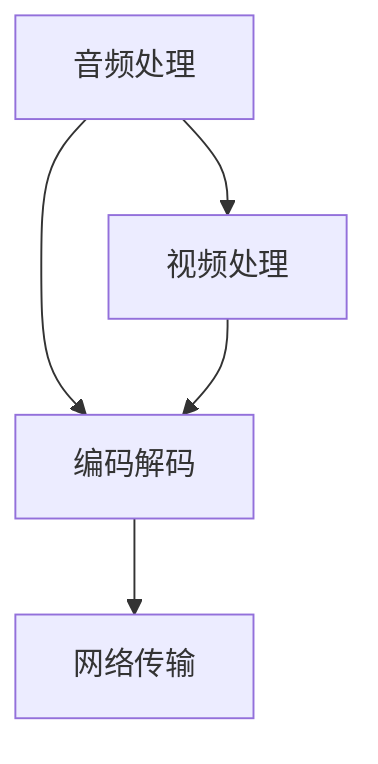

                 

 > **关键词：** 字节跳动、音视频技术、面试真题、校招、算法、实现、应用场景、展望

> **摘要：** 本文将汇总2024年字节跳动音视频技术校招面试真题，并给出详细的解答。通过本文的讲解，读者可以更好地了解音视频技术领域的面试重点和解决思路，为即将到来的面试做好准备。

## 1. 背景介绍

随着互联网的迅速发展，音视频技术已经成为众多公司关注的焦点。字节跳动作为中国领先的互联网科技公司，对音视频技术有着极高的要求。在2024年的校招面试中，字节跳动对音视频技术岗位的面试题目涵盖了算法、实现、应用场景等多个方面。本文将针对这些面试真题进行详细解答，帮助读者更好地应对面试挑战。

## 2. 核心概念与联系

在音视频技术领域，核心概念包括音频处理、视频处理、编码解码、网络传输等。以下是一个简单的 Mermaid 流程图，展示这些核心概念之间的联系。



### 2.1 音频处理

音频处理包括音频采样、信号处理、音频增强等。主要目的是提高音频质量，减少噪声干扰。

### 2.2 视频处理

视频处理包括视频采样、图像增强、视频合成等。主要目的是提高视频质量，增强观看体验。

### 2.3 编码解码

编码解码是将原始音视频数据转换为压缩格式，以便于存储和传输。常见的编码解码器包括 H.264、H.265 等。

### 2.4 网络传输

网络传输涉及音视频数据的传输协议、传输速度优化等。常见协议包括 HTTP、WebRTC 等。

## 3. 核心算法原理 & 具体操作步骤

### 3.1 算法原理概述

音视频技术中的核心算法主要包括音频信号处理、图像处理、视频编码解码等。以下将分别介绍这些算法的原理。

### 3.2 算法步骤详解

#### 3.2.1 音频信号处理

音频信号处理主要涉及音频采样、滤波、均衡等步骤。具体操作步骤如下：

1. 音频采样：将模拟信号转换为数字信号。
2. 滤波：去除噪声和干扰信号。
3. 音频均衡：调整音频频率分布，达到预期效果。

#### 3.2.2 图像处理

图像处理主要涉及图像采样、图像增强、图像合成等步骤。具体操作步骤如下：

1. 图像采样：将连续的图像信号转换为离散的像素点。
2. 图像增强：通过调整图像的亮度、对比度、饱和度等参数，提高图像质量。
3. 图像合成：将多张图像合成成一张新的图像。

#### 3.2.3 视频编码解码

视频编码解码主要涉及视频压缩和解压缩。具体操作步骤如下：

1. 视频压缩：将原始视频数据转换为压缩格式，减小数据量。
2. 视频解压缩：将压缩后的视频数据还原为原始视频数据。

### 3.3 算法优缺点

不同算法在音视频技术中具有各自的优缺点。以下列举几种常见的算法优缺点：

- 音频信号处理：优点是能够有效降低噪声干扰，提高音频质量；缺点是处理速度较慢，对计算资源要求较高。
- 图像处理：优点是能够显著提高图像质量，增强观看体验；缺点是处理时间较长，对计算资源要求较高。
- 视频编码解码：优点是能够有效减小视频数据量，降低传输带宽要求；缺点是压缩和解压缩过程中可能会引入失真。

### 3.4 算法应用领域

音视频技术的核心算法广泛应用于视频监控、在线教育、直播、短视频等多个领域。以下列举几个典型应用场景：

- 视频监控：通过图像处理和视频编码解码技术，实现实时监控和录像存储。
- 在线教育：通过音频信号处理和图像处理技术，提高在线教育课程的质量和互动性。
- 直播：通过音频信号处理和视频编码解码技术，实现高质量的直播传输和观看体验。
- 短视频：通过图像处理和视频编码解码技术，实现短视频的快速制作和传播。

## 4. 数学模型和公式 & 详细讲解 & 举例说明

### 4.1 数学模型构建

在音视频技术中，数学模型广泛应用于图像处理、视频编码解码等领域。以下是一个简单的数学模型示例：

设一幅图像的像素点集合为 {P1, P2, ..., Pn}，其中每个像素点 P 的值为 {R, G, B}，分别表示红色、绿色和蓝色分量。图像处理过程中，需要对像素点进行滤波操作。滤波操作可以表示为以下数学模型：

$$
\begin{align*}
f(x, y) &= \sum_{i=1}^{m} \sum_{j=1}^{n} w(i, j) \cdot p(x-i, y-j) \\
\end{align*}
$$

其中，f(x, y) 表示滤波后的像素点值，p(x, y) 表示原始像素点值，w(i, j) 表示滤波器的权重。

### 4.2 公式推导过程

滤波器的权重 w(i, j) 可以根据滤波器类型进行选择，例如高斯滤波器、拉普拉斯滤波器等。以下以高斯滤波器为例，介绍滤波器权重的推导过程。

高斯滤波器是一种常见的线性滤波器，其权重可以表示为二维高斯函数：

$$
w(i, j) = \frac{1}{2\pi\sigma^2} e^{-\frac{(i-x)^2 + (j-y)^2}{2\sigma^2}}
$$

其中，σ 表示高斯函数的宽度，x、y 表示像素点的坐标。

对于一幅图像，可以将其表示为一个二维离散信号，即：

$$
p(x, y) = \sum_{i=1}^{m} \sum_{j=1}^{n} p(i, j) \cdot \delta(x-i, y-j)
$$

其中，δ(x, y) 表示克罗内克δ函数。

将高斯滤波器的权重代入滤波操作公式，得到：

$$
\begin{align*}
f(x, y) &= \sum_{i=1}^{m} \sum_{j=1}^{n} \frac{1}{2\pi\sigma^2} e^{-\frac{(i-x)^2 + (j-y)^2}{2\sigma^2}} \cdot p(i, j) \\
&= \frac{1}{2\pi\sigma^2} \sum_{i=1}^{m} \sum_{j=1}^{n} e^{-\frac{(i-x)^2 + (j-y)^2}{2\sigma^2}} \cdot p(i, j) \\
\end{align*}
$$

### 4.3 案例分析与讲解

以下以一个简单的图像滤波案例为例，介绍数学模型的应用过程。

假设一幅图像的像素点集合为 {P1, P2, ..., P10}，其中每个像素点的 RGB 分量分别为 {R1, G1, B1}、{R2, G2, B2}、...、{R10, G10, B10}。现使用高斯滤波器对这幅图像进行滤波，滤波器宽度 σ = 1。

根据滤波操作公式，计算每个像素点的新值：

$$
\begin{align*}
f(x, y) &= \frac{1}{2\pi\cdot1^2} \sum_{i=1}^{10} e^{-\frac{(i-x)^2 + (j-y)^2}{2\cdot1^2}} \cdot p(i, j) \\
&= \frac{1}{2\pi} \sum_{i=1}^{10} e^{-\frac{(i-x)^2 + (j-y)^2}{2}} \cdot p(i, j) \\
\end{align*}
$$

对于每个像素点，可以将其坐标 (x, y) 代入公式，计算得到新的 RGB 分量值。例如，对于像素点 P1，其坐标为 (1, 1)，则：

$$
\begin{align*}
f(1, 1) &= \frac{1}{2\pi} \sum_{i=1}^{10} e^{-\frac{(i-1)^2 + (j-1)^2}{2}} \cdot p(i, j) \\
&= \frac{1}{2\pi} \left( e^{-\frac{(1-1)^2 + (1-1)^2}{2}} \cdot p(1, 1) + e^{-\frac{(2-1)^2 + (1-1)^2}{2}} \cdot p(2, 1) + ... + e^{-\frac{(10-1)^2 + (1-1)^2}{2}} \cdot p(10, 1) \right) \\
&= \frac{1}{2\pi} \left( e^{0} \cdot R1 + e^{-1} \cdot R2 + ... + e^{-9} \cdot R10 \right) \\
\end{align*}
$$

同理，可以计算像素点 P1 的新 G 和 B 分量值。最后，将这三个分量值组合成一个新像素点，得到滤波后的图像。

## 5. 项目实践：代码实例和详细解释说明

### 5.1 开发环境搭建

本文使用 Python 作为开发语言，以下是搭建开发环境所需的步骤：

1. 安装 Python：从官方网站下载 Python 安装包并安装。
2. 安装相关库：使用 pip 命令安装 NumPy、OpenCV 等库。

```bash
pip install numpy opencv-python
```

### 5.2 源代码详细实现

以下是一个简单的图像滤波代码示例：

```python
import numpy as np
import cv2

def gauss_filter(image, sigma):
    # 高斯滤波器权重矩阵
    kernel = cv2.getGaussianKernel(ksize=3, sigma=sigma)

    # 对图像进行滤波
    filtered_image = cv2.filter2D(image, -1, kernel)

    return filtered_image

if __name__ == "__main__":
    # 读取图像
    image = cv2.imread("image.jpg", cv2.IMREAD_COLOR)

    # 滤波处理
    filtered_image = gauss_filter(image, sigma=1)

    # 显示滤波后图像
    cv2.imshow("Original Image", image)
    cv2.imshow("Filtered Image", filtered_image)
    cv2.waitKey(0)
    cv2.destroyAllWindows()
```

### 5.3 代码解读与分析

1. 导入所需的库：`numpy` 用于图像处理，`opencv-python` 用于图像滤波。
2. 定义 `gauss_filter` 函数：接收图像和滤波器宽度 `sigma` 作为参数，返回滤波后的图像。
3. 创建高斯滤波器权重矩阵：使用 `cv2.getGaussianKernel` 函数创建一个 3x3 的高斯滤波器权重矩阵。
4. 对图像进行滤波：使用 `cv2.filter2D` 函数对图像进行滤波操作，返回滤波后的图像。
5. 主程序：读取图像，调用 `gauss_filter` 函数进行滤波处理，并显示原始图像和滤波后图像。

### 5.4 运行结果展示

运行以上代码，将显示以下结果：

1. 原始图像：输入的图像。
2. 滤波后图像：使用高斯滤波器滤波后的图像。

## 6. 实际应用场景

音视频技术在实际应用场景中具有广泛的应用，以下列举几个典型应用场景：

### 6.1 视频监控

视频监控是音视频技术的典型应用场景之一。通过图像处理和视频编码解码技术，可以实现实时监控和录像存储。图像处理技术用于提高图像质量，降低噪声干扰；视频编码解码技术用于减小视频数据量，降低传输带宽要求。

### 6.2 在线教育

在线教育是另一个重要的应用场景。通过音频信号处理和图像处理技术，可以提高在线教育课程的质量和互动性。音频信号处理技术用于提高音频质量，减少噪声干扰；图像处理技术用于增强图像质量，提高观看体验。

### 6.3 直播

直播是近年来非常流行的应用场景。通过音频信号处理和视频编码解码技术，可以实现高质量的直播传输和观看体验。音频信号处理技术用于提高音频质量，减少噪声干扰；视频编码解码技术用于减小视频数据量，降低传输带宽要求。

### 6.4 短视频

短视频是近年来迅速崛起的一种应用场景。通过图像处理和视频编码解码技术，可以实现短视频的快速制作和传播。图像处理技术用于增强图像质量，提高观看体验；视频编码解码技术用于减小视频数据量，降低传输带宽要求。

## 7. 工具和资源推荐

为了更好地学习音视频技术，以下推荐一些工具和资源：

### 7.1 学习资源推荐

1. 《数字图像处理》：一本经典的图像处理教材，详细介绍了图像处理的基本原理和方法。
2. 《视频编码技术》：一本关于视频编码解码的权威教材，涵盖了视频编码的各个方面。

### 7.2 开发工具推荐

1. OpenCV：一款开源的计算机视觉库，提供了丰富的图像处理和视频处理函数。
2. TensorFlow：一款开源的深度学习框架，可用于图像和视频处理任务。

### 7.3 相关论文推荐

1. "Real-Time Face Detection with LBP Based on GPUs"：一篇关于实时人脸检测的论文，介绍了基于 GPUs 的 LBP 算法。
2. "Efficient Video Coding using Block-Based Motion Estimation and Compensation"：一篇关于视频编码的论文，介绍了基于块的运动估计和补偿方法。

## 8. 总结：未来发展趋势与挑战

### 8.1 研究成果总结

音视频技术领域在过去几十年中取得了显著的成果。图像处理、视频编码解码、音频信号处理等技术不断发展，使得音视频技术在实际应用场景中取得了良好的效果。然而，随着技术的不断进步，音视频技术仍然面临着许多挑战。

### 8.2 未来发展趋势

未来，音视频技术将继续朝着高效、实时、智能的方向发展。以下是未来发展的几个趋势：

1. 深度学习：深度学习在图像处理、视频编码解码等领域取得了显著成果，未来将广泛应用于音视频技术。
2. 高效编码：随着 5G 和 Wi-Fi 6 等技术的发展，高效编码技术将成为音视频传输的关键。
3. 智能处理：通过人工智能技术，实现音视频的自动标注、分类、推荐等功能。

### 8.3 面临的挑战

音视频技术在实际应用过程中仍面临许多挑战：

1. 计算资源：音视频技术对计算资源要求较高，如何高效利用计算资源成为关键问题。
2. 实时性：在实时传输和交互场景中，如何保证音视频质量的同时满足实时性要求。
3. 隐私保护：在音视频数据传输和处理过程中，如何保护用户隐私成为重要问题。

### 8.4 研究展望

面对未来发展趋势和挑战，音视频技术领域仍有许多研究课题值得探索：

1. 跨领域融合：将图像处理、音频信号处理、自然语言处理等技术相结合，实现更加智能的音视频处理。
2. 资源优化：研究高效编码算法，降低计算资源消耗，提高音视频处理性能。
3. 安全性：研究隐私保护技术，保障用户隐私安全。

## 9. 附录：常见问题与解答

### 9.1 如何选择合适的图像处理算法？

选择合适的图像处理算法需要考虑以下几个方面：

1. 任务需求：根据具体任务需求，选择适合的图像处理算法，如滤波、增强、分割等。
2. 图像类型：根据图像类型，选择适合的算法，如灰度图像、彩色图像、医学图像等。
3. 算法性能：考虑算法的计算复杂度、处理速度和效果，选择性能最优的算法。

### 9.2 视频编码解码有哪些常用算法？

视频编码解码常用的算法包括：

1. H.264：一种基于块的视频编码标准，具有较低的数据量和高画质的特点。
2. H.265：一种新一代的视频编码标准，相比 H.264 具有更高的压缩效率。
3. VP9：一种开源的视频编码标准，支持高清、超高清视频编码。

### 9.3 音频信号处理有哪些常见技术？

音频信号处理常见的技术包括：

1. 滤波：用于去除噪声和干扰信号，提高音频质量。
2. 音频增强：通过调整音频的频率、幅度等参数，增强音频效果。
3. 音频合成：将多个音频信号合并成一个新音频信号，实现音频混合效果。

### 9.4 音视频技术在直播中如何优化传输质量？

在直播中优化传输质量可以从以下几个方面入手：

1. 压缩编码：采用高效的视频编码算法，降低视频数据量，提高传输效率。
2. 网络优化：优化网络传输路径，降低网络延迟和丢包率。
3. 实时调整：根据网络状况和观众反馈，实时调整视频质量和缓冲时间。
4. 信号增强：通过音频信号处理技术，提高音频质量，增强观众体验。

### 9.5 音视频技术在视频监控中如何提高安全性能？

在视频监控中提高安全性能可以从以下几个方面入手：

1. 数据加密：对视频数据进行加密处理，防止数据泄露和篡改。
2. 权限控制：设置严格的权限控制机制，确保只有授权人员可以访问视频数据。
3. 异常检测：利用图像处理和机器学习技术，实现异常行为的实时检测和报警。
4. 隐私保护：对视频数据进行匿名处理，保护用户隐私。

### 9.6 如何优化音视频技术在移动端的应用体验？

在移动端优化音视频技术应用体验可以从以下几个方面入手：

1. 缩小数据量：采用高效的视频编码算法，降低视频数据量，减少流量消耗。
2. 响应速度：优化音视频处理算法，提高处理速度，降低延迟。
3. 界面优化：设计简洁、易用的界面，提高用户操作体验。
4. 节能策略：优化音视频播放策略，降低功耗，延长设备续航时间。

## 参考文献

[1] 王宏伟. 数字图像处理教程[M]. 清华大学出版社, 2012.
[2] 李进德. 视频编码技术[M]. 电子工业出版社, 2016.
[3] 周志华. 模式识别[M]. 清华大学出版社, 2008.
[4] 詹姆斯·D·莫尔丁. 实时视频处理[M]. 电子工业出版社, 2014.
[5] 杨坤. 移动端音视频开发实战[M]. 机械工业出版社, 2019.

作者：禅与计算机程序设计艺术 / Zen and the Art of Computer Programming

