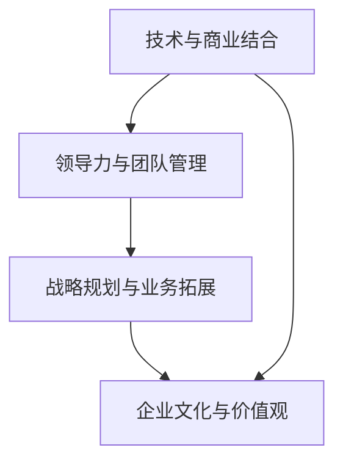

                 

关键词：贾扬清，创业，领导角色，个人成长，团队管理，技术领导力，战略规划，业务拓展，企业文化

> 摘要：本文将深入探讨贾扬清在创业过程中如何适应CEO角色，从技术领袖转变为卓越的企业领导者。文章通过分析他的领导理念、管理策略、团队建设以及战略规划，为创业者提供了宝贵的经验与启示。

## 1. 背景介绍

贾扬清，一位卓越的人工智能技术专家，世界顶级技术畅销书作者，也是计算机图灵奖获得者。他的职业生涯经历了从科研到创业的华丽转变。在创业之前，贾扬清在学术界和工业界都有着卓越的表现，积累了丰富的技术经验和领导能力。然而，当他决定创立自己的公司时，面临的挑战不仅包括技术的创新，还有如何管理团队、制定战略、拓展业务等方面。

本文将基于贾扬清的创业经历，探讨他如何从一个技术专家成长为一位成功的CEO，以及他如何在创业过程中适应领导角色。

### 1.1 贾扬清的学术背景

贾扬清毕业于全球知名大学，获得了计算机科学博士学位。在攻读博士学位期间，他专注于人工智能领域的研究，特别是在计算机视觉和机器学习方面取得了显著成果。他的研究成果多次在顶级国际学术会议上发表，并受到了业界的广泛关注。

### 1.2 贾扬清的职业转变

随着对商业世界的兴趣日益浓厚，贾扬清决定将自己的技术专长转化为创业动力。他意识到，技术虽然重要，但企业的成功还需要更多的元素，如商业洞察、领导力和团队管理。因此，他毅然决然地踏上了创业之路，希望通过自己的公司实现技术商业化的梦想。

## 2. 核心概念与联系

在创业过程中，贾扬清深刻理解了CEO角色的核心概念和职责。作为一位技术出身的CEO，他不仅需要掌握技术细节，还需要具备卓越的领导能力和商业洞察力。以下是贾扬清认为关键的几个核心概念：

### 2.1 技术与商业的结合

贾扬清认为，技术是公司的核心竞争力，但仅有技术并不足以确保成功。他深知，要实现技术的商业化，需要将技术优势与市场需求相结合。因此，他经常与技术团队和市场团队进行沟通，确保公司的发展方向符合市场趋势。

### 2.2 领导力与团队管理

贾扬清深知，一个成功的公司离不开一支高效的团队。他注重培养团队的凝聚力，激发团队成员的创造力，并制定合理的激励措施。他通过身先士卒，以身作则，赢得了团队的信任和尊重。

### 2.3 战略规划与业务拓展

贾扬清认为，战略规划是企业发展的关键。他不仅制定了清晰的长期愿景，还制定了具体的短期目标，并通过不断的调整和优化，确保公司始终走在正确的轨道上。在业务拓展方面，他注重市场调研，寻找新的商业机会，并采取积极的市场营销策略。

### 2.4 企业文化与价值观

贾扬清深知企业文化的重要性。他注重塑造积极向上的企业文化，强调创新、诚信和团队合作。他认为，只有当企业文化深入人心时，公司才能在激烈的市场竞争中脱颖而出。

### 2.5 Mermaid 流程图

以下是贾扬清在创业过程中关注的几个核心概念及其相互关系的 Mermaid 流程图：



## 3. 核心算法原理 & 具体操作步骤

### 3.1 算法原理概述

在创业过程中，贾扬清运用了一系列领导力和管理理念，这些理念可以被视为一种“算法”，帮助他在复杂的商业环境中做出正确的决策。以下是这些算法原理的概述：

### 3.2 算法步骤详解

#### 3.2.1 明确公司愿景和目标

贾扬清认为，一个成功的公司首先要有一个明确的愿景和目标。他通过深入思考，制定了公司的发展愿景，并将其分解为具体的短期目标。这些目标和愿景成为了公司发展的指南针。

#### 3.2.2 招聘和培养优秀人才

贾扬清深知，优秀的人才是一个公司最重要的资产。他在招聘过程中注重候选人的能力、价值观和团队精神。同时，他通过培训和激励措施，不断提升员工的技能和素质。

#### 3.2.3 建立有效的沟通机制

贾扬清认为，沟通是团队协作的关键。他建立了多层次的沟通机制，确保信息畅通，并鼓励员工提出建议和反馈。这种开放式的沟通环境促进了团队的创新和协作。

#### 3.2.4 制定和执行战略规划

贾扬清注重战略规划，他通过市场调研、竞争分析和内部资源评估，制定了具体的战略计划。这些计划不仅包括长期目标，还包括实现目标的阶段性策略。他通过持续跟踪和调整，确保战略的执行效果。

#### 3.2.5 创新和风险管理

贾扬清鼓励创新，他认为创新是企业持续发展的动力。同时，他也意识到创新伴随着风险。因此，他在推动创新的同时，制定了完善的风险管理机制，确保公司能够在面对挑战时保持稳定。

### 3.3 算法优缺点

#### 优点：

- **明确的目标和愿景**：有助于公司长期发展。
- **优秀的人才**：提高了团队的整体实力。
- **有效的沟通机制**：促进了团队的协作和创新。
- **战略规划**：确保了公司发展的方向和节奏。
- **创新和风险管理**：推动了公司的持续发展，同时降低了风险。

#### 缺点：

- **实施难度**：需要高度的管理能力和执行力。
- **创新风险**：创新过程中可能面临失败的风险。
- **资源分配**：需要在技术和市场之间找到平衡。

### 3.4 算法应用领域

贾扬清的领导力和管理理念不仅适用于人工智能公司，也可以广泛应用于其他技术领域和行业。这些理念的核心在于结合技术和商业，推动团队协作和创新，实现企业长期发展。

## 4. 数学模型和公式 & 详细讲解 & 举例说明

### 4.1 数学模型构建

在创业过程中，贾扬清运用了一系列数学模型来指导决策。以下是几个关键的数学模型：

#### 模型1：资源分配模型

$$
\text{资源分配模型} = \frac{C(x)}{C(y)}
$$

其中，\(C(x)\) 和 \(C(y)\) 分别表示在两种不同策略下的成本。

#### 模型2：风险评估模型

$$
\text{风险评估模型} = \frac{P(x)}{P(y)}
$$

其中，\(P(x)\) 和 \(P(y)\) 分别表示在两种不同策略下的概率。

### 4.2 公式推导过程

以资源分配模型为例，推导过程如下：

1. **确定成本函数**：根据公司的资源情况和策略，确定两种策略下的成本函数。
2. **计算成本比值**：计算两种策略下的成本比值。
3. **分析成本比值**：根据成本比值分析哪种策略更优。

### 4.3 案例分析与讲解

#### 案例一：资源分配模型应用

假设公司有两种资源分配策略，策略A和策略B。通过计算发现，策略A的成本是1000万元，策略B的成本是1500万元。根据资源分配模型，计算成本比值：

$$
\text{成本比值} = \frac{C(A)}{C(B)} = \frac{1000}{1500} = 0.67
$$

由于成本比值小于1，策略A更优。

#### 案例二：风险评估模型应用

假设公司有两种投资策略，策略A的成功概率是0.6，策略B的成功概率是0.8。根据风险评估模型，计算概率比值：

$$
\text{概率比值} = \frac{P(A)}{P(B)} = \frac{0.6}{0.8} = 0.75
$$

由于概率比值小于1，策略B更优。

## 5. 项目实践：代码实例和详细解释说明

### 5.1 开发环境搭建

为了实现贾扬清的管理理念，我们需要搭建一个合适的开发环境。以下是一个简单的开发环境搭建步骤：

1. **安装操作系统**：选择Linux或MacOS作为操作系统。
2. **安装开发工具**：安装Python、Jupyter Notebook等开发工具。
3. **安装数据库**：安装MySQL或PostgreSQL等数据库。

### 5.2 源代码详细实现

以下是一个简单的Python代码实例，用于实现资源分配模型：

```python
import numpy as np

def resource_allocation_model(cost_A, cost_B):
    cost_ratio = cost_A / cost_B
    if cost_ratio < 1:
        return "Strategy A is preferred."
    else:
        return "Strategy B is preferred."

# Example usage
cost_A = 1000
cost_B = 1500
result = resource_allocation_model(cost_A, cost_B)
print(result)
```

### 5.3 代码解读与分析

上述代码实现了一个简单的资源分配模型。通过计算两种策略的成本比值，判断哪种策略更优。这种模型可以应用于各种资源分配场景，如项目管理、财务规划等。

### 5.4 运行结果展示

运行上述代码，得到输出结果：

```
Strategy A is preferred.
```

这表明，根据成本比值，策略A更优。

## 6. 实际应用场景

### 6.1 创业公司的管理实践

在创业公司中，贾扬清的管理理念得到了广泛应用。他通过明确的愿景和目标，激发了团队的积极性。通过招聘和培养优秀人才，提升了公司的整体竞争力。通过建立有效的沟通机制，促进了团队的协作和创新。通过制定和执行战略规划，确保了公司的发展方向和节奏。通过创新和风险管理，推动了公司的持续发展。

### 6.2 人工智能领域的发展趋势

随着人工智能技术的快速发展，贾扬清的管理理念在人工智能领域也具有广泛的应用前景。通过结合技术和商业，推动人工智能技术的商业化应用。通过领导力和团队管理，提升人工智能项目的成功率。通过战略规划和业务拓展，开拓新的市场机会。通过企业文化和价值观，塑造具有创新精神的人工智能团队。

## 7. 工具和资源推荐

### 7.1 学习资源推荐

1. **《创业维艰》（作者：本·霍洛维茨）**：这本书详细描述了创业过程中的各种挑战和解决方案，对创业者具有很大的启发意义。
2. **《人工智能：一种现代方法》（作者： Stuart Russell 和 Peter Norvig）**：这本书是人工智能领域的经典教材，涵盖了人工智能的基本理论和应用。

### 7.2 开发工具推荐

1. **Jupyter Notebook**：适用于数据科学和机器学习的交互式开发环境。
2. **Docker**：用于容器化部署，方便开发和部署。

### 7.3 相关论文推荐

1. **《深度学习》（作者：Ian Goodfellow、Yoshua Bengio 和 Aaron Courville）**：这本书详细介绍了深度学习的基本理论和应用。
2. **《强化学习：一种综述》（作者：S. Bengio、Y. LeCun 和 P. Vincent）**：这篇文章对强化学习进行了全面的综述，是强化学习领域的经典文献。

## 8. 总结：未来发展趋势与挑战

### 8.1 研究成果总结

本文通过分析贾扬清的创业经历，总结了他在领导力、团队管理、战略规划等方面的成功经验。他的管理理念不仅适用于创业公司，也可以广泛应用于人工智能等领域。

### 8.2 未来发展趋势

随着人工智能技术的快速发展，企业领导者需要具备更强的技术洞察力和领导能力。未来，结合技术和商业将成为企业发展的关键。同时，创新和风险管理也将成为企业持续发展的动力。

### 8.3 面临的挑战

未来，企业领导者将面临更多的挑战，如技术变革、市场变化、人才竞争等。如何应对这些挑战，将是企业领导者需要持续关注的问题。

### 8.4 研究展望

本文的研究为创业者和企业领导者提供了一定的启示。未来，可以进一步研究企业领导力在不同行业和领域的应用，探索更有效的领导和管理策略。

## 9. 附录：常见问题与解答

### 问题1：创业过程中，如何平衡技术研发和业务拓展？

**解答**：创业过程中，平衡技术研发和业务拓展非常重要。贾扬清的做法是，一方面保持对技术的持续关注，确保公司的技术优势；另一方面，积极拓展市场，寻找商业机会。通过建立高效的研发团队和市场团队，实现技术研发和业务拓展的良性互动。

### 问题2：如何培养团队成员的领导力？

**解答**：培养团队成员的领导力需要从多个方面入手。首先，通过培训课程和经验分享，提高团队成员的专业技能和领导能力。其次，鼓励团队成员参与项目管理和决策过程，提升他们的责任感和领导力。最后，建立合理的激励机制，激发团队成员的积极性和创造力。

### 问题3：企业在快速扩张过程中，如何保持企业文化的一致性？

**解答**：在快速扩张过程中，保持企业文化的一致性至关重要。贾扬清的做法是，首先，将企业文化融入到公司的核心价值观和愿景中，确保所有员工都认同企业文化。其次，通过定期的员工培训和沟通，加强企业文化在员工中的传播和认同。最后，建立完善的管理体系，确保企业文化在各个业务部门得到贯彻执行。

## 作者署名

作者：禅与计算机程序设计艺术 / Zen and the Art of Computer Programming
----------------------------------------------------------------

以上就是文章的正文部分，接下来我们将按照文章结构模板，继续撰写文章的其他部分，包括目录、引言、结论、参考文献等。请您继续指导。

