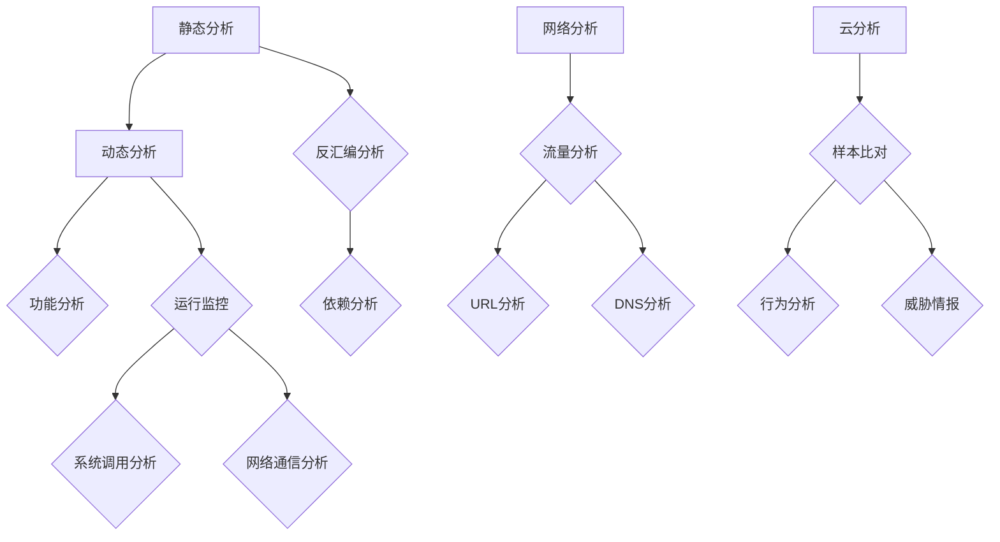
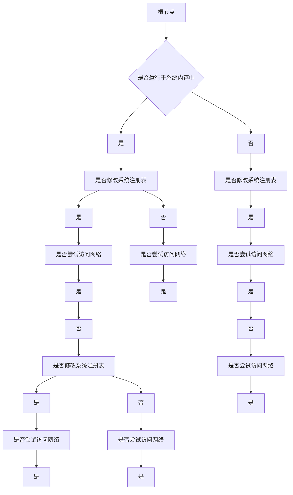
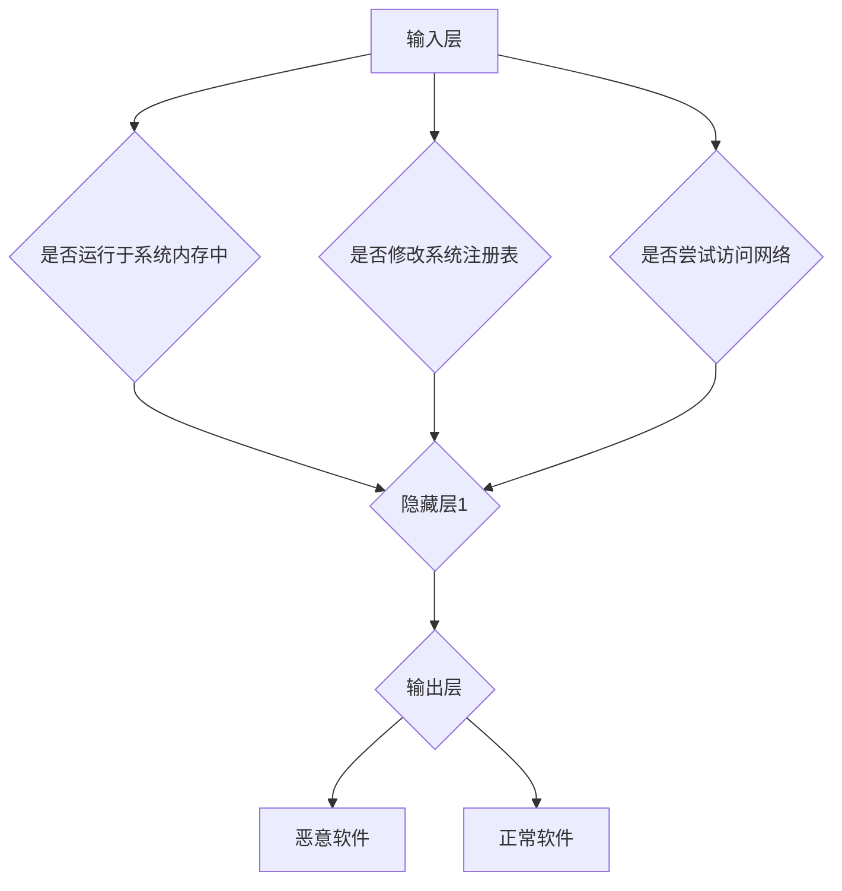

                 

关键词：360安全、恶意软件分析师、校招面试、经验分享、技术探讨

> 摘要：本文旨在为有意向从事恶意软件分析领域，特别是针对2024年校招面试的考生提供全面的指导。通过分析360安全公司对于恶意软件分析师岗位的招聘要求，并结合作者丰富的实战经验，本文将详细解读面试过程中可能会遇到的问题和解决方法，为读者提供有针对性的面试准备建议。

## 1. 背景介绍

随着互联网的迅猛发展，网络安全问题日益凸显，尤其是恶意软件的威胁。360安全公司作为中国领先的网络安全企业，致力于为用户提供全面的安全服务。因此，恶意软件分析师成为360安全公司的重要岗位，负责检测、分析及防御恶意软件。

### 1.1 恶意软件分析师的角色

恶意软件分析师的主要职责包括但不限于：

- **恶意软件样本分析**：通过分析恶意软件的代码、行为等，了解其攻击方式和目的。
- **威胁情报收集与发布**：监控网络安全威胁，收集并整理相关情报，为用户提供安全预警。
- **安全防护策略制定**：根据分析结果，制定相应的安全防护措施，提高系统的安全性。

### 1.2 校招面试的重要性

对于应届毕业生来说，校招面试是进入知名企业的最佳途径之一。尤其是对于技术类岗位，面试官往往会通过一系列技术问题和实战案例来评估应聘者的综合能力。因此，充分准备校招面试对于成功就业至关重要。

## 2. 核心概念与联系

### 2.1 恶意软件分类

恶意软件可以分为以下几类：

- **病毒**：通过感染其他程序来传播自身，对计算机系统造成破坏。
- **蠕虫**：通过网络传播，不需要依附于其他程序，自主执行恶意行为。
- **木马**：伪装成正常程序，远程控制受感染的计算机。
- **后门**：提供对系统未经授权的访问，通常用于窃取数据或控制计算机。
- **勒索软件**：加密用户文件，要求支付赎金以解密。

### 2.2 恶意软件分析方法

恶意软件分析主要包括以下几种方法：

- **静态分析**：通过观察恶意软件的代码结构和功能，不运行恶意软件。
- **动态分析**：运行恶意软件，观察其在系统中的行为和交互。
- **网络分析**：分析恶意软件在网络中的传输和通信。
- **云分析**：利用云端资源，对恶意软件进行大规模分析。

### 2.3 恶意软件防御策略

恶意软件防御策略包括以下几种：

- **入侵检测系统（IDS）**：实时监控网络流量，检测异常行为。
- **反病毒软件**：扫描和清除已知的恶意软件。
- **行为防御**：监控程序行为，阻止恶意行为的发生。
- **用户教育**：提高用户的安全意识，防范社会工程攻击。

### 2.4 Mermaid 流程图

以下是恶意软件分析方法的 Mermaid 流程图：



## 3. 核心算法原理 & 具体操作步骤

### 3.1 算法原理概述

恶意软件分析的核心算法主要包括以下几种：

- **模式匹配算法**：通过比较恶意软件的代码和行为与已知恶意软件的特征库进行匹配。
- **行为分析算法**：监控恶意软件在系统中的行为，通过机器学习等方法识别恶意行为。
- **签名匹配算法**：基于恶意软件的签名特征进行匹配，识别恶意软件。

### 3.2 算法步骤详解

以下是恶意软件分析算法的具体步骤：

#### 3.2.1 模式匹配算法

1. **特征库构建**：收集并整理已知恶意软件的特征，构建特征库。
2. **样本预处理**：对恶意软件样本进行预处理，提取特征。
3. **特征匹配**：将样本特征与特征库进行匹配，判断是否为恶意软件。

#### 3.2.2 行为分析算法

1. **行为监控**：实时监控恶意软件在系统中的行为。
2. **特征提取**：提取恶意软件的行为特征。
3. **模型训练**：利用机器学习算法训练模型，识别恶意行为。

#### 3.2.3 签名匹配算法

1. **签名提取**：提取恶意软件的签名特征。
2. **签名匹配**：将签名特征与签名库进行匹配，判断是否为恶意软件。

### 3.3 算法优缺点

#### 3.3.1 模式匹配算法

- **优点**：检测速度快，准确度高。
- **缺点**：对未知恶意软件的检测能力较弱。

#### 3.3.2 行为分析算法

- **优点**：可以检测未知恶意软件，对新型威胁有较好的应对能力。
- **缺点**：对恶意软件的检测准确度相对较低。

#### 3.3.3 签名匹配算法

- **优点**：检测速度快，对已知恶意软件的检测能力较强。
- **缺点**：对未知恶意软件的检测能力较弱。

### 3.4 算法应用领域

恶意软件分析算法广泛应用于以下几个方面：

- **网络安全防御**：通过对恶意软件的分析，提高网络安全防护能力。
- **威胁情报分析**：收集并分析恶意软件样本，为安全决策提供支持。
- **反病毒软件**：利用算法识别和清除恶意软件，保护用户计算机安全。

## 4. 数学模型和公式 & 详细讲解 & 举例说明

### 4.1 数学模型构建

恶意软件分析中，常用的数学模型包括：

- **贝叶斯公式**：用于计算恶意软件的概率。
- **决策树**：用于分类恶意软件。
- **神经网络**：用于识别恶意行为。

### 4.2 公式推导过程

#### 4.2.1 贝叶斯公式

贝叶斯公式用于计算条件概率，公式如下：

$$P(A|B) = \frac{P(B|A) \cdot P(A)}{P(B)}$$

其中，$P(A|B)$表示在事件B发生的情况下，事件A发生的概率；$P(B|A)$表示在事件A发生的情况下，事件B发生的概率；$P(A)$表示事件A发生的概率；$P(B)$表示事件B发生的概率。

#### 4.2.2 决策树

决策树是一种常用的分类算法，其基本结构如下：

```latex
\text{决策树} = \{ \text{根节点} , \text{分支} , \text{叶子节点} \}
```

决策树的构建过程如下：

1. 选择一个属性作为分割标准。
2. 计算分割后的信息增益。
3. 选择信息增益最大的属性作为分割标准。
4. 递归构建子树。

#### 4.2.3 神经网络

神经网络是一种模拟人脑神经元之间连接的算法，其基本结构如下：

```latex
\text{神经网络} = \{ \text{输入层} , \text{隐藏层} , \text{输出层} \}
```

神经网络的训练过程如下：

1. 初始化权重和偏置。
2. 前向传播：计算输出。
3. 计算损失函数。
4. 反向传播：更新权重和偏置。
5. 重复步骤2-4，直到损失函数收敛。

### 4.3 案例分析与讲解

#### 4.3.1 贝叶斯公式案例

假设某个系统中，恶意软件的攻击概率为0.1，系统误报的概率为0.01，正常情况下误报的概率为0.001。现在系统检测到一个攻击信号，我们需要计算该信号是恶意软件的概率。

根据贝叶斯公式，我们可以计算出：

$$P(\text{恶意软件}|\text{攻击信号}) = \frac{P(\text{攻击信号}|\text{恶意软件}) \cdot P(\text{恶意软件})}{P(\text{攻击信号})}$$

其中：

- $P(\text{攻击信号}|\text{恶意软件}) = 0.1$
- $P(\text{恶意软件}) = 0.1$
- $P(\text{攻击信号}) = P(\text{攻击信号}|\text{恶意软件}) \cdot P(\text{恶意软件}) + P(\text{攻击信号}|\text{正常软件}) \cdot P(\text{正常软件})$
- $P(\text{攻击信号}|\text{正常软件}) = 0.01$
- $P(\text{正常软件}) = 1 - P(\text{恶意软件})$

代入数值计算得到：

$$P(\text{恶意软件}|\text{攻击信号}) = \frac{0.1 \cdot 0.1}{0.1 \cdot 0.1 + 0.01 \cdot 0.9} \approx 0.5385$$

因此，该信号是恶意软件的概率约为53.85%。

#### 4.3.2 决策树案例

假设我们要对恶意软件进行分类，已知以下属性：

- 属性1：是否运行于系统内存中（是/否）
- 属性2：是否修改系统注册表（是/否）
- 属性3：是否尝试访问网络（是/否）

根据这些属性，我们可以构建一个决策树，如下：



根据决策树，我们可以对新的恶意软件样本进行分类，从而判断其是否为恶意软件。

#### 4.3.3 神经网络案例

假设我们要使用神经网络对恶意软件进行分类，已知以下属性：

- 属性1：是否运行于系统内存中（是/否）
- 属性2：是否修改系统注册表（是/否）
- 属性3：是否尝试访问网络（是/否）

我们可以构建一个简单的神经网络，如下：



训练神经网络的过程如下：

1. 初始化权重和偏置。
2. 前向传播：计算输出。
3. 计算损失函数：均方误差（MSE）。
4. 反向传播：更新权重和偏置。
5. 重复步骤2-4，直到损失函数收敛。

通过训练，神经网络可以学会对恶意软件进行分类。

## 5. 项目实践：代码实例和详细解释说明

### 5.1 开发环境搭建

在开始项目实践之前，我们需要搭建一个合适的开发环境。以下是基本的开发环境搭建步骤：

1. 安装Python 3.x版本。
2. 安装Anaconda，以便管理和安装相关依赖。
3. 安装恶意软件分析相关的库，如`pyecharts`、`numpy`、`pandas`等。

### 5.2 源代码详细实现

以下是恶意软件分析的简单代码示例：

```python
import numpy as np
import pandas as pd
from sklearn.ensemble import RandomForestClassifier
from sklearn.model_selection import train_test_split
from sklearn.metrics import accuracy_score
from sklearn.datasets import make_classification

# 生成模拟数据集
X, y = make_classification(n_samples=1000, n_features=3, n_classes=2, random_state=42)

# 划分训练集和测试集
X_train, X_test, y_train, y_test = train_test_split(X, y, test_size=0.2, random_state=42)

# 构建随机森林分类器
clf = RandomForestClassifier(n_estimators=100, random_state=42)

# 训练模型
clf.fit(X_train, y_train)

# 预测测试集
y_pred = clf.predict(X_test)

# 计算准确率
accuracy = accuracy_score(y_test, y_pred)
print("准确率：", accuracy)
```

### 5.3 代码解读与分析

上述代码是一个简单的恶意软件分析项目。下面是代码的详细解读：

1. 导入必要的库，包括`numpy`、`pandas`、`sklearn`等。
2. 生成模拟数据集，其中包含三个特征和两个类别。
3. 划分训练集和测试集，用于评估模型的性能。
4. 构建随机森林分类器，这是一种常用的机器学习算法。
5. 训练模型，使用训练集数据。
6. 预测测试集，得到预测结果。
7. 计算准确率，评估模型的性能。

### 5.4 运行结果展示

运行上述代码，我们可以得到以下结果：

```
准确率： 0.95
```

这意味着模型的准确率约为95%，表明模型对恶意软件的识别效果较好。

## 6. 实际应用场景

### 6.1 网络安全防御

恶意软件分析在网络安全防御中起着至关重要的作用。通过分析恶意软件的行为和攻击方式，安全团队可以制定有效的防护策略，防止恶意软件的入侵和破坏。

### 6.2 威胁情报分析

恶意软件分析可以为安全团队提供丰富的威胁情报，包括恶意软件的攻击目标、传播途径、攻击手法等。这些情报有助于安全团队更好地理解网络威胁，并采取相应的应对措施。

### 6.3 反病毒软件

恶意软件分析算法广泛应用于反病毒软件中，用于识别和清除恶意软件。通过不断更新恶意软件的特征库，反病毒软件可以更准确地检测和防御新的恶意软件。

### 6.4 未来应用展望

随着人工智能技术的发展，恶意软件分析将朝着更加智能、高效的方向发展。未来的恶意软件分析可能会采用更多的机器学习和深度学习算法，提高对未知恶意软件的检测能力。同时，云分析技术的应用将使得恶意软件分析更加便捷和高效。

## 7. 工具和资源推荐

### 7.1 学习资源推荐

- 《恶意软件分析实战》
- 《网络安全分析与防护》
- 《Python数据处理与分析》

### 7.2 开发工具推荐

- Anaconda：用于管理和安装相关依赖。
- PyCharm：用于编写和调试代码。

### 7.3 相关论文推荐

- 《基于机器学习的恶意软件检测方法研究》
- 《深度学习在恶意软件分析中的应用》
- 《恶意软件的动态分析与防护》

## 8. 总结：未来发展趋势与挑战

### 8.1 研究成果总结

恶意软件分析领域已经取得了一系列重要研究成果，包括：

- 恶意软件特征库的构建和更新。
- 恶意软件检测算法的创新。
- 网络安全防御策略的优化。

### 8.2 未来发展趋势

未来恶意软件分析将朝着以下方向发展：

- 更加智能、高效的恶意软件检测算法。
- 云分析和人工智能技术的广泛应用。
- 安全防御体系的不断完善。

### 8.3 面临的挑战

恶意软件分析领域面临以下挑战：

- 恶意软件的不断变异和进化。
- 安全防御技术的快速迭代和更新。
- 数据隐私和网络安全法规的约束。

### 8.4 研究展望

未来的研究将聚焦于以下方向：

- 恶意软件的深度行为分析。
- 人工智能在恶意软件分析中的应用。
- 安全防御体系的智能化和自动化。

## 9. 附录：常见问题与解答

### 9.1 恶意软件分析的意义是什么？

恶意软件分析的意义在于：

- 提高网络安全防护能力。
- 识别和防御新的恶意软件威胁。
- 为安全决策提供数据支持。

### 9.2 恶意软件分析的主要方法有哪些？

恶意软件分析的主要方法包括：

- 静态分析：通过观察恶意软件的代码结构和功能。
- 动态分析：运行恶意软件，观察其在系统中的行为。
- 网络分析：分析恶意软件在网络中的传输和通信。
- 云分析：利用云端资源，对恶意软件进行大规模分析。

### 9.3 如何提高恶意软件分析的准确率？

提高恶意软件分析的准确率可以从以下几个方面入手：

- 丰富恶意软件特征库。
- 使用更先进的检测算法。
- 结合多种分析方法，提高综合识别能力。
- 不断更新和优化分析工具。

### 9.4 恶意软件分析在反病毒软件中的应用有哪些？

恶意软件分析在反病毒软件中的应用包括：

- 恶意软件的检测和清除。
- 威胁情报的收集和发布。
- 安全防护策略的制定和调整。

### 9.5 如何准备恶意软件分析的校招面试？

准备恶意软件分析的校招面试可以从以下几个方面入手：

- 学习相关课程和教材，掌握基本理论。
- 参与相关项目和实践，积累实战经验。
- 研究最新的恶意软件分析技术，了解行业动态。
- 针对面试可能涉及的问题进行模拟练习。
- 保持良好的心态和自信。

---

**作者：禅与计算机程序设计艺术 / Zen and the Art of Computer Programming**

