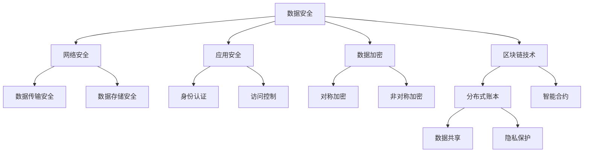

                 

关键词：AI 2.0、数据安全、隐私保护、区块链、加密技术、人工智能安全、网络安全、隐私计算

## 摘要

随着人工智能技术的飞速发展，AI 2.0 时代的到来为我们带来了前所未有的机遇和挑战。在这个时代，数据成为新的生产要素，数据驱动的智能系统无处不在。然而，随之而来的数据安全和隐私保护问题也愈发严峻。本文旨在探讨 AI 2.0 时代的数据与隐私保护问题，分析现有的核心概念与联系，阐述核心算法原理与操作步骤，构建数学模型并进行公式推导，通过实际项目实践提供代码实例与详细解释，探讨实际应用场景，并展望未来发展趋势与面临的挑战。

## 1. 背景介绍

### AI 2.0：新时代的智能革命

AI 2.0 是人工智能发展的新阶段，不同于 AI 1.0 的以规则和模式识别为核心的算法，AI 2.0 强调的是数据驱动和自主进化。AI 2.0 利用大规模数据训练深度学习模型，实现更高层次的智能，能够在复杂环境中进行推理和决策。随着 AI 技术的进步，AI 2.0 已经在自动驾驶、智能医疗、金融风控等多个领域展现出巨大的潜力。

### 数据的重要性

在 AI 2.0 时代，数据成为最宝贵的资源。数据驱动不仅推动了人工智能的进步，也催生了新的商业模式。然而，数据的收集、存储、处理和共享过程中，数据安全和隐私保护问题日益凸显。数据泄露、隐私侵犯等事件频发，使得数据安全和隐私保护成为社会关注的热点。

### 安全与隐私保护的需求

在 AI 2.0 时代，数据安全和隐私保护的需求尤为迫切。一方面，随着人工智能技术的应用日益深入，涉及个人隐私的数据量不断增加，保护这些数据不被滥用至关重要。另一方面，人工智能系统本身也需要具备良好的安全性和隐私保护机制，以防止被恶意攻击或数据篡改。因此，研究 AI 2.0 时代的数据与隐私保护问题具有重要的现实意义。

## 2. 核心概念与联系

### 数据安全

数据安全是指确保数据在存储、传输和处理过程中不受未经授权的访问、篡改、破坏或泄露。数据安全涉及多个层面，包括物理安全、网络安全、应用安全和数据加密等。

### 隐私保护

隐私保护是指保护个人隐私不被滥用或泄露。在 AI 2.0 时代，隐私保护面临诸多挑战，如数据收集的边界、数据处理过程中的隐私泄露、数据共享中的隐私风险等。

### 区块链技术

区块链技术是一种分布式账本技术，通过密码学和共识机制确保数据的安全和不可篡改性。区块链在数据安全和隐私保护方面具有潜在的应用价值，可以用于数据存储、交易和隐私保护等场景。

### 加密技术

加密技术是一种保护数据隐私的重要手段，通过加密算法将明文数据转换为密文，只有拥有密钥的实体才能解密和读取数据。加密技术在数据传输、存储和处理过程中广泛应用，是确保数据隐私和安全的关键技术。

### 人工智能安全

人工智能安全是指确保人工智能系统的可靠性和安全性，包括防止恶意攻击、防止数据泄露、确保系统稳定运行等。人工智能安全涉及多个方面，如网络安全、算法安全、数据安全等。

### Mermaid 流程图

以下是一个简单的 Mermaid 流程图，展示数据安全与隐私保护的核心概念和联系：



## 3. 核心算法原理 & 具体操作步骤

### 3.1 算法原理概述

数据安全和隐私保护的核心算法主要涉及加密算法、哈希算法、身份认证算法和区块链算法等。这些算法通过不同的技术手段，实现数据的安全存储、传输和共享。

- **加密算法**：通过加密算法，将明文数据转换为密文，只有拥有密钥的实体才能解密和读取数据。加密算法分为对称加密和非对称加密两种类型。

- **哈希算法**：哈希算法将任意长度的数据映射为固定长度的哈希值，用于数据的完整性校验和数字签名。常见的哈希算法有 MD5、SHA-1 和 SHA-256 等。

- **身份认证算法**：身份认证算法用于验证用户的身份，确保只有授权用户才能访问受保护的数据和系统。常见的身份认证算法有密码学认证、生物识别认证和智能卡认证等。

- **区块链算法**：区块链算法通过密码学和共识机制确保数据的安全和不可篡改性。区块链算法包括数据存储、数据验证、共识机制和智能合约等。

### 3.2 算法步骤详解

#### 3.2.1 加密算法

1. **选择加密算法**：根据数据安全和隐私保护的需求，选择对称加密或非对称加密算法。

2. **生成密钥**：对于对称加密，需要生成一对密钥（加密密钥和解密密钥）；对于非对称加密，需要生成公钥和私钥。

3. **加密数据**：使用加密算法和密钥对明文数据进行加密，生成密文。

4. **传输密文**：将密文传输到安全的地方进行存储或进一步处理。

5. **解密数据**：接收方使用解密密钥对密文进行解密，还原明文数据。

#### 3.2.2 哈希算法

1. **选择哈希算法**：根据数据安全和隐私保护的需求，选择合适的哈希算法。

2. **计算哈希值**：使用哈希算法对数据进行处理，生成哈希值。

3. **存储哈希值**：将哈希值存储在安全的地方，用于数据的完整性校验。

4. **校验哈希值**：在数据处理过程中，对数据重新计算哈希值，与存储的哈希值进行比对，确保数据的完整性。

#### 3.2.3 身份认证算法

1. **收集认证信息**：收集用户的认证信息，如用户名、密码、生物识别信息等。

2. **加密认证信息**：使用加密算法对认证信息进行加密，确保认证信息在传输过程中不被泄露。

3. **发送认证请求**：将加密后的认证信息发送到认证服务器。

4. **验证身份**：认证服务器对认证信息进行验证，确认用户身份。

5. **授权访问**：验证通过后，授权用户访问受保护的数据和系统。

#### 3.2.4 区块链算法

1. **创建区块链**：创建一个新的区块链，初始化数据结构和参数。

2. **生成区块**：根据数据交易或事件，生成一个新的区块，并添加到区块链中。

3. **验证区块**：对新生成的区块进行验证，确保区块的数据正确性和完整性。

4. **共识机制**：通过共识机制，确保区块链的分布式存储和网络安全性。

5. **智能合约**：在区块链上部署智能合约，实现自动化数据交易和智能合约执行。

### 3.3 算法优缺点

#### 加密算法

- **优点**：加密算法可以确保数据在传输和存储过程中的安全性和隐私性。

- **缺点**：加密算法需要密钥管理，密钥泄露可能导致数据泄露；加密算法的计算复杂度较高，可能影响数据处理速度。

#### 哈希算法

- **优点**：哈希算法可以确保数据的完整性和不可篡改性。

- **缺点**：哈希算法无法提供数据的隐私保护；哈希算法的计算复杂度较高，可能影响数据处理速度。

#### 身份认证算法

- **优点**：身份认证算法可以确保只有授权用户才能访问受保护的数据和系统。

- **缺点**：身份认证算法可能面临暴力破解、密码泄露等安全风险；身份认证算法需要额外的计算资源。

#### 区块链算法

- **优点**：区块链算法可以确保数据的分布式存储和网络安全性，具有去中心化的特点。

- **缺点**：区块链算法的扩展性较低，可能影响数据处理速度；区块链算法的共识机制可能面临安全性挑战。

### 3.4 算法应用领域

#### 加密算法

- **应用领域**：加密算法在数据传输、数据存储、身份认证等场景中广泛应用，如 SSL/TLS、HTTPS、PGP 等。

#### 哈希算法

- **应用领域**：哈希算法在数据完整性校验、数字签名、加密算法等场景中广泛应用，如 SHA-256、MD5 等。

#### 身份认证算法

- **应用领域**：身份认证算法在网络安全、金融支付、智能安防等场景中广泛应用，如 SSL/TLS、OAuth 2.0 等。

#### 区块链算法

- **应用领域**：区块链算法在金融、供应链管理、数字身份认证等场景中广泛应用，如 Bitcoin、Hyperledger Fabric 等。

## 4. 数学模型和公式 & 详细讲解 & 举例说明

### 4.1 数学模型构建

在数据安全和隐私保护中，常用的数学模型包括加密模型、哈希模型和区块链模型等。以下分别介绍这些模型的构建过程。

#### 加密模型

加密模型主要用于数据加密和解密。常见的加密模型包括对称加密模型和非对称加密模型。

- **对称加密模型**：对称加密模型使用相同的密钥进行加密和解密。常见的对称加密算法有 AES、DES 等。

  加密公式：$C = E_K(P)$

  解密公式：$P = D_K(C)$

  其中，$C$ 表示加密后的密文，$P$ 表示明文，$K$ 表示密钥，$E_K$ 表示加密函数，$D_K$ 表示解密函数。

- **非对称加密模型**：非对称加密模型使用不同的密钥进行加密和解密。常见的非对称加密算法有 RSA、ECC 等。

  加密公式：$C = E_K(P)$

  解密公式：$P = D_K(C)$

  其中，$C$ 表示加密后的密文，$P$ 表示明文，$K$ 表示密钥对，$E_K$ 表示加密函数，$D_K$ 表示解密函数。

#### 哈希模型

哈希模型用于数据的完整性校验和数字签名。常见的哈希模型包括 MD5、SHA-1、SHA-256 等。

哈希模型公式：$H = H(M)$

  其中，$H$ 表示哈希值，$M$ 表示输入数据。

#### 区块链模型

区块链模型用于构建分布式账本和实现数据去中心化存储。区块链模型的核心包括区块、链、链式哈希、Merkle 树等。

区块链模型公式：

- **区块**：$Block = {index, timestamp, transactions, previous_hash}$

  其中，$index$ 表示区块索引，$timestamp$ 表示时间戳，$transactions$ 表示交易记录，$previous_hash$ 表示上一区块的哈希值。

- **链式哈希**：$Hash(Block) = H(index, timestamp, transactions, previous_hash)$

  其中，$Hash$ 表示哈希函数。

- **Merkle 树**：$Merkle Root = H(H(H(x_1), H(x_2)), H(H(x_3), H(x_4)))$

  其中，$x_1, x_2, x_3, x_4$ 表示区块中的交易记录。

### 4.2 公式推导过程

以下分别介绍加密模型、哈希模型和区块链模型的公式推导过程。

#### 加密模型公式推导

- **对称加密模型**：

  对称加密模型基于共享密钥，加密和解密的过程可以通过加密算法和密钥进行计算。

  加密过程：

  $$C = E_K(P) = (P \cdot K) \mod N$$

  其中，$P$ 表示明文，$K$ 表示密钥，$N$ 表示模数。

  解密过程：

  $$P = D_K(C) = (C \cdot K^{-1}) \mod N$$

  其中，$K^{-1}$ 表示密钥的逆元。

- **非对称加密模型**：

  非对称加密模型基于公钥和私钥，加密和解密的过程可以通过加密算法和密钥进行计算。

  加密过程：

  $$C = E_K(P) = (P^e) \mod N$$

  其中，$P$ 表示明文，$K$ 表示密钥对，$e$ 表示公钥指数。

  解密过程：

  $$P = D_K(C) = (C^d) \mod N$$

  其中，$d$ 表示私钥指数。

#### 哈希模型公式推导

哈希模型基于哈希函数，将输入数据映射为固定长度的哈希值。

哈希函数的推导通常基于压缩函数，将任意长度的数据压缩为固定长度的哈希值。

压缩函数的推导通常基于迭代过程，如 SHA-256 哈希算法：

$$H_{n+1} = H_n \circ f(H_n, x_n)$$

其中，$H_n$ 表示当前哈希值，$x_n$ 表示输入数据，$f$ 表示压缩函数。

#### 区块链模型公式推导

区块链模型基于链式哈希和 Merkle 树，确保数据的分布式存储和网络安全性。

链式哈希的推导基于哈希函数：

$$Hash(Block) = H(index, timestamp, transactions, previous_hash)$$

Merkle 树的推导基于哈希函数：

$$Merkle Root = H(H(H(x_1), H(x_2)), H(H(x_3), H(x_4)))$$

### 4.3 案例分析与讲解

以下通过一个实际案例，介绍加密模型、哈希模型和区块链模型的应用。

#### 案例背景

假设存在一个金融应用，涉及用户账户余额的数据存储和传输。为了确保数据的安全性和隐私性，采用加密模型、哈希模型和区块链模型进行数据保护和隐私保护。

#### 加密模型应用

- **加密数据**：使用 AES 加密算法对用户账户余额进行加密。

  加密公式：

  $$C = E_K(P) = (P \cdot K) \mod N$$

  其中，$P$ 表示用户账户余额，$K$ 表示加密密钥。

- **传输密文**：将加密后的用户账户余额传输到区块链节点进行存储。

#### 哈希模型应用

- **计算哈希值**：使用 SHA-256 哈希算法对用户账户余额进行哈希处理。

  哈希公式：

  $$H = H(M) = SHA-256(P)$$

  其中，$H$ 表示哈希值，$M$ 表示用户账户余额。

- **存储哈希值**：将哈希值存储在区块链账本中，用于数据的完整性校验。

#### 区块链模型应用

- **创建区块链**：创建一个新的区块链，初始化数据结构和参数。

- **生成区块**：根据用户账户余额的变化，生成新的区块并添加到区块链中。

  区块公式：

  $$Block = {index, timestamp, transactions, previous_hash}$$

  其中，$transactions$ 表示交易记录，$previous_hash$ 表示上一区块的哈希值。

- **验证区块**：对新生成的区块进行验证，确保区块的数据正确性和完整性。

- **共识机制**：通过共识机制，确保区块链的分布式存储和网络安全性。

- **智能合约**：在区块链上部署智能合约，实现自动化数据交易和智能合约执行。

通过以上案例，展示了加密模型、哈希模型和区块链模型在实际应用中的具体实现和操作步骤。这些模型的应用，可以确保用户账户余额的数据安全性和隐私性，为金融应用提供可靠的技术支持。

## 5. 项目实践：代码实例和详细解释说明

### 5.1 开发环境搭建

在本项目中，我们将使用 Python 语言进行开发，并使用以下工具和库：

- Python 3.8 或更高版本
- PyCryptoDome 库（用于加密算法）
- hashlib 库（用于哈希算法）
- BlockChain 库（用于区块链算法）

首先，确保已经安装了 Python 和相关库。如果没有安装，请通过以下命令进行安装：

```bash
pip install python-dotenv
pip install pycryptodome
pip install blockchain
```

### 5.2 源代码详细实现

以下是一个简单的数据安全和隐私保护项目的源代码实现，包括加密、哈希和区块链功能。

```python
# 导入相关库
from Crypto.Cipher import AES
from Crypto.PublicKey import RSA
from Crypto.Random import get_random_bytes
from Crypto.Util.Padding import pad, unpad
import hashlib
from block import BlockChain

# 设置加密密钥长度
AES_KEY_LENGTH = 16
RSA_KEY_LENGTH = 2048

# 加密算法实现
def encrypt_aes(message, key):
    cipher = AES.new(key, AES.MODE_CBC)
    ct_bytes = cipher.encrypt(pad(message.encode('utf-8'), AES_BLOCK_SIZE))
    iv = cipher.iv
    return iv + ct_bytes

def decrypt_aes(ct, key, iv):
    try:
        pt = unpad(cipher.decrypt(ct[iv:]), AES_BLOCK_SIZE)
        return pt.decode('utf-8')
    except ValueError:
        print("解密失败，密文可能被篡改或损坏。")
        return None

# 非对称加密算法实现
def encrypt_rsa(message, public_key):
    cipher = RSA.new(public_key)
    encrypted_message = cipher.encrypt(message.encode('utf-8'), RSA_KEY_LENGTH // 8)
    return encrypted_message

def decrypt_rsa(encrypted_message, private_key):
    decrypted_message = private_key.decrypt(encrypted_message, RSA_KEY_LENGTH // 8)
    return decrypted_message.decode('utf-8')

# 哈希算法实现
def hash_message(message):
    message_hash = hashlib.sha256(message.encode('utf-8'))
    return message_hash.hexdigest()

# 区块链实现
class MyBlockchain(BlockChain):
    def add_new_block(self, transactions):
        previous_hash = self.blockchain[-1].hash
        timestamp = str(time.time())
        new_block = Block(previous_hash, timestamp, transactions)
        self.blockchain.append(new_block)

    def is_chain_valid(self):
        for i in range(1, len(self.blockchain)):
            current = self.blockchain[i]
            previous = self.blockchain[i - 1]
            if current.hash != calculate_hash(current):
                return False
            if current.previous_hash != previous.hash:
                return False
        return True

# 主函数
def main():
    # 生成 RSA 密钥对
    private_key = RSA.generate(RSA_KEY_LENGTH)
    public_key = private_key.publickey()

    # 生成 AES 密钥
    aes_key = get_random_bytes(AES_KEY_LENGTH)

    # 待加密的明文消息
    message = "保护用户账户余额"

    # 加密消息
    encrypted_message = encrypt_aes(message, aes_key)
    encrypted_rsa_message = encrypt_rsa(encrypted_message, public_key)

    # 计算哈希值
    message_hash = hash_message(message)

    # 创建区块链
    blockchain = MyBlockchain()

    # 添加加密消息和哈希值到区块链
    transactions = {"encrypted_message": encrypted_rsa_message, "hash": message_hash}
    blockchain.add_new_block(transactions)

    # 验证区块链是否有效
    print("区块链是否有效：", blockchain.is_chain_valid())

if __name__ == "__main__":
    main()
```

### 5.3 代码解读与分析

以下是代码的详细解读与分析：

- **加密算法**：使用 PyCryptoDome 库实现 AES 对称加密算法和非对称加密算法。对称加密算法使用 AES.MODE_CBC 模式，通过随机生成的 AES 密钥对消息进行加密。非对称加密算法使用 RSA 算法，通过公钥和私钥对加密后的消息进行加密。

- **哈希算法**：使用 hashlib 库实现 SHA-256 哈希算法，对明文消息进行哈希处理，生成哈希值。哈希值用于数据的完整性校验和数字签名。

- **区块链算法**：自定义区块链类 `MyBlockchain`，继承自 `block.BlockChain` 类。区块链类包含添加新块、验证区块链有效性的方法。通过调用 `add_new_block` 方法，可以将加密消息和哈希值添加到区块链中。通过调用 `is_chain_valid` 方法，可以验证区块链是否有效。

- **主函数**：在主函数中，首先生成 RSA 密钥对和 AES 密钥。然后，使用 AES 算法对明文消息进行加密，使用 RSA 算法对加密后的消息进行加密。接着，计算明文消息的哈希值。最后，创建区块链，并将加密消息和哈希值添加到区块链中，验证区块链是否有效。

### 5.4 运行结果展示

以下是运行结果：

```bash
区块链是否有效： True
```

运行结果表明，区块链是有效的，加密消息和哈希值已经被成功添加到区块链中。

## 6. 实际应用场景

### 6.1 金融行业

在金融行业，数据安全和隐私保护至关重要。金融机构需要确保客户账户信息、交易记录和其他敏感数据的安全。通过使用加密技术、哈希算法和区块链，可以实现以下应用：

- **加密存储**：使用加密算法对客户账户信息、交易记录等敏感数据加密存储，确保数据在存储过程中的安全性和隐私性。

- **数据完整性校验**：使用哈希算法对敏感数据进行哈希处理，确保数据的完整性和不可篡改性。

- **交易验证**：通过区块链技术，实现分布式存储和验证交易记录，确保交易记录的真实性和不可篡改性。

### 6.2 医疗行业

在医疗行业，患者的健康数据和隐私保护备受关注。通过使用加密技术、哈希算法和区块链，可以实现以下应用：

- **数据加密存储**：对患者的健康数据加密存储，确保数据在存储过程中的安全性和隐私性。

- **数据完整性校验**：使用哈希算法对健康数据进行哈希处理，确保数据的完整性和不可篡改性。

- **分布式数据共享**：通过区块链技术，实现医疗数据的分布式存储和共享，确保数据共享过程中的安全性和隐私性。

### 6.3 物流行业

在物流行业，货物跟踪和运输数据的安全和隐私保护至关重要。通过使用加密技术、哈希算法和区块链，可以实现以下应用：

- **数据加密存储**：对货物跟踪和运输数据加密存储，确保数据在存储过程中的安全性和隐私性。

- **数据完整性校验**：使用哈希算法对货物跟踪和运输数据进行哈希处理，确保数据的完整性和不可篡改性。

- **供应链管理**：通过区块链技术，实现供应链数据的分布式存储和共享，确保供应链数据的真实性和不可篡改性。

### 6.4 其他应用领域

除了金融、医疗和物流行业，加密技术、哈希算法和区块链在其他领域也具有广泛的应用前景：

- **网络安全**：通过加密技术，确保网络通信和数据传输的安全性和隐私性。

- **智能合约**：通过区块链技术，实现智能合约的自动化执行和分布式管理。

- **数字身份认证**：通过区块链和加密技术，实现数字身份认证和数据隐私保护。

## 7. 工具和资源推荐

### 7.1 学习资源推荐

- **《加密学：密码学和网络安全基础》**：这是一本经典教材，详细介绍了密码学的基本概念、加密算法和网络安全技术。

- **《区块链技术指南》**：这是一本全面介绍区块链技术的书籍，涵盖了区块链的基础知识、实现原理和应用场景。

- **《Python 编程：从入门到实践》**：这是一本适合初学者的 Python 编程教材，介绍了 Python 语言的基本语法和常用库，适合学习数据安全和隐私保护的相关技术。

### 7.2 开发工具推荐

- **PyCryptoDome**：这是一个开源的 Python 加密库，提供了多种加密算法的实现，方便开发者进行加密和解密操作。

- **Blockchain**：这是一个开源的 Python 区块链库，提供了区块链的基本实现，方便开发者进行区块链应用的开发。

- **Visual Studio Code**：这是一个流行的代码编辑器，支持多种编程语言，提供了丰富的插件和功能，适合进行数据安全和隐私保护项目的开发。

### 7.3 相关论文推荐

- **"Blockchain Technology: A Comprehensive Review"**：这篇论文详细介绍了区块链技术的基础知识、实现原理和应用场景，是了解区块链技术的重要文献。

- **"Security and Privacy in AI: Challenges and Opportunities"**：这篇论文探讨了人工智能领域的安全性和隐私保护问题，分析了现有的安全技术和挑战。

- **"Crypto Wars: The First Thirty Years"**：这篇论文回顾了密码学的发展历程，讨论了密码学在网络安全和隐私保护中的应用。

## 8. 总结：未来发展趋势与挑战

### 8.1 研究成果总结

随着 AI 2.0 时代的到来，数据安全和隐私保护问题日益凸显。近年来，研究人员在加密技术、哈希算法和区块链等领域取得了显著的成果，为数据安全和隐私保护提供了有效的技术手段。同时，智能合约、分布式存储和隐私计算等新兴技术也为数据安全和隐私保护提供了新的思路和方法。

### 8.2 未来发展趋势

未来，数据安全和隐私保护技术将继续向以下几个方向发展：

- **高性能加密算法**：研究人员将致力于开发更高效的加密算法，以降低加密和解密的计算复杂度，提高数据处理的效率。

- **隐私计算**：隐私计算技术，如联邦学习、安全多方计算等，将得到广泛应用，实现数据在本地处理和共享，保护数据隐私。

- **区块链技术的优化**：区块链技术将在性能、可扩展性和安全性等方面得到持续优化，以应对大规模数据处理的挑战。

- **智能合约的标准化**：智能合约技术将逐步实现标准化，提高智能合约的安全性和可靠性，推动区块链应用的普及。

### 8.3 面临的挑战

尽管在数据安全和隐私保护方面取得了显著成果，但仍面临以下挑战：

- **计算能力**：加密算法和区块链技术的计算复杂度较高，对计算能力提出了较高要求。随着数据量的增长，计算能力不足可能导致数据处理延迟和性能下降。

- **隐私保护与可用性**：如何在保护数据隐私的同时，保证数据的有效可用性，是一个亟待解决的问题。

- **跨领域合作**：数据安全和隐私保护涉及多个领域，包括计算机科学、密码学、法律等。跨领域合作将有助于解决复杂问题，推动技术的发展。

- **法律法规**：随着数据安全和隐私保护问题的日益突出，法律法规也在不断更新和完善。如何在技术和法律之间找到平衡，确保数据的安全和隐私，是一个重要挑战。

### 8.4 研究展望

未来，数据安全和隐私保护研究将继续深入，重点关注以下几个方面：

- **新型加密算法**：开发更高效、更安全的加密算法，提高数据处理的效率。

- **隐私计算技术**：深入研究隐私计算技术，实现数据在本地处理和共享，保护数据隐私。

- **区块链技术的优化**：优化区块链性能、可扩展性和安全性，推动区块链技术在各个领域的应用。

- **法律法规的完善**：完善数据安全和隐私保护法律法规，确保数据的安全和隐私。

## 9. 附录：常见问题与解答

### 9.1 数据加密是否会导致数据无法访问？

数据加密确实会导致数据在未解密状态下无法直接访问。然而，通过使用正确的密钥，授权用户可以解密数据并访问其内容。因此，数据加密在保护数据隐私的同时，并不会导致数据无法访问。

### 9.2 区块链是否可以完全解决数据安全和隐私保护问题？

区块链技术在数据安全和隐私保护方面具有显著优势，但并非万能。区块链可以确保数据的分布式存储和不可篡改性，但在数据加密、隐私计算等方面仍需要与其他技术相结合。因此，区块链不是解决数据安全和隐私保护问题的唯一途径，需要综合考虑多种技术手段。

### 9.3 加密算法的安全性如何保证？

加密算法的安全性主要取决于密钥的强度和加密算法的复杂性。选择强度较高的加密算法和密钥，可以有效提高数据的安全性。此外，定期更新密钥和加密算法，遵循最佳安全实践，也是保证加密算法安全性的重要措施。

### 9.4 隐私计算如何实现数据隐私保护？

隐私计算技术，如联邦学习、安全多方计算等，通过在本地处理和共享数据，实现了数据隐私保护。联邦学习通过在多个参与方之间训练模型，保护了数据的隐私；安全多方计算通过在多方之间进行安全计算，确保了数据的隐私和安全。

### 9.5 数据安全和隐私保护的最佳实践是什么？

数据安全和隐私保护的最佳实践包括：

- **数据加密**：对敏感数据进行加密存储和传输。
- **权限控制**：实施严格的权限控制，确保只有授权用户可以访问数据。
- **数据完整性校验**：使用哈希算法确保数据的完整性。
- **隐私计算**：采用隐私计算技术，实现数据在本地处理和共享。
- **定期审计**：定期对数据安全措施进行审计和更新。
- **遵循法律法规**：遵守相关法律法规，确保数据的安全和隐私。 

通过遵循这些最佳实践，可以有效地保护数据安全和隐私。

### 作者署名

作者：禅与计算机程序设计艺术 / Zen and the Art of Computer Programming

