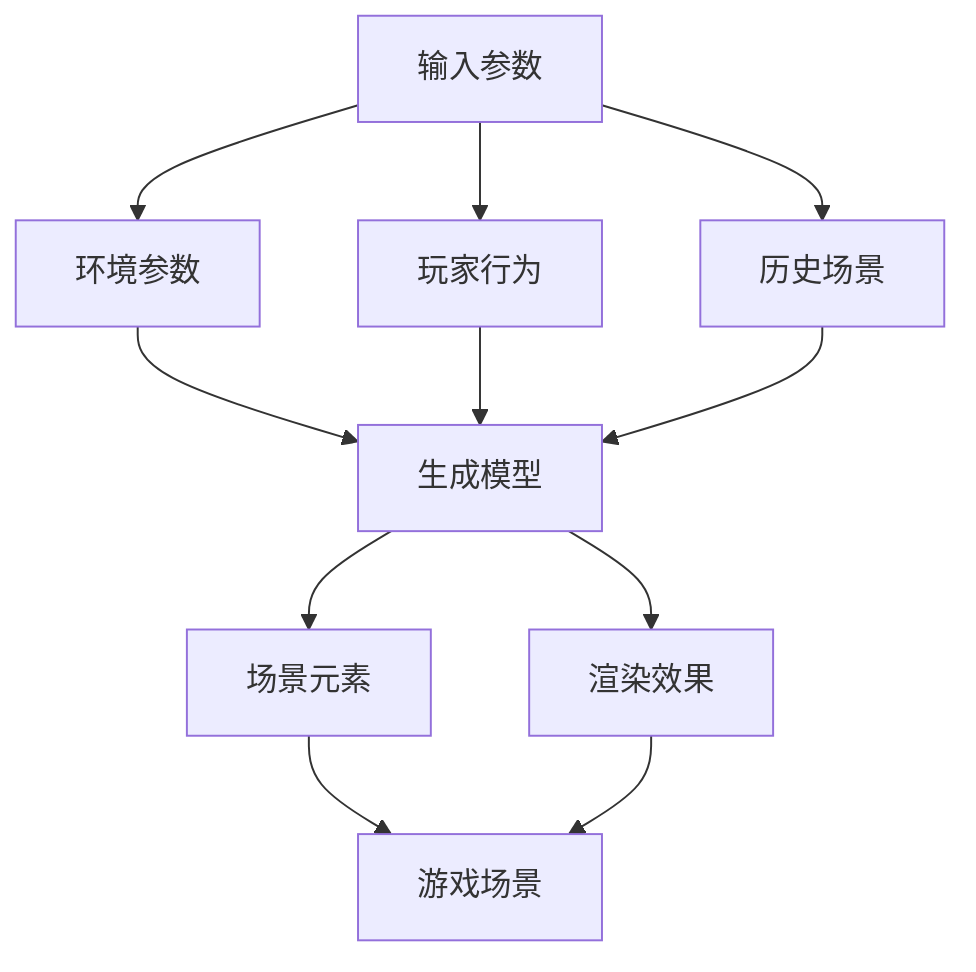

                 

### 1. 背景介绍

近年来，随着虚拟现实（VR）和增强现实（AR）技术的快速发展，游戏产业迎来了前所未有的繁荣。游戏开发者们不断探索新的游戏体验，其中游戏场景的生成技术成为了关键的一环。一个高度逼真、变化多端的游戏场景能够极大地提升玩家的沉浸感和满意度，从而增强游戏的吸引力。

在这种背景下，"完美世界2024游戏场景生成算法"应运而生。该算法的目标是生成具有高度真实性和多样性的游戏场景，以适应不同类型游戏的需求。它不仅要求能够生成从简单到复杂的各种场景，还要具备高效性和可扩展性，以支持大规模游戏世界的构建。

### 2. 核心概念与联系

在探讨完美世界2024游戏场景生成算法之前，我们需要了解几个核心概念：

#### 2.1 3D 游戏引擎

3D游戏引擎是实现游戏场景生成的基础。它提供了一系列的工具和函数，用于渲染3D模型、处理物理和碰撞检测、实现动画效果等。常见的3D游戏引擎有Unity、Unreal Engine等。

#### 2.2 生成模型（Generative Models）

生成模型是一类能够根据给定规则或条件生成新数据的算法。在游戏场景生成中，生成模型可以根据环境参数、玩家行为等因素，动态地创建复杂的场景元素，如建筑、植被、地形等。

#### 2.3 数据驱动（Data-Driven）

数据驱动方法利用大量真实世界的数据来训练模型，以便生成高度逼真的场景。这种方法能够提升场景生成的多样性和真实性。

#### 2.4 机器学习（Machine Learning）

机器学习是生成模型的重要工具。通过使用机器学习算法，如深度学习、强化学习等，可以训练模型从数据中学习，并生成符合目标场景的特征。

##### 2.5 Mermaid 流程图

下面是完美世界2024游戏场景生成算法的Mermaid流程图，展示了算法从输入到输出的整个过程。



### 3. 核心算法原理 & 具体操作步骤

#### 3.1 算法原理概述

完美世界2024游戏场景生成算法基于数据驱动和生成模型的方法。具体来说，它采用深度学习中的生成对抗网络（GAN）作为生成模型，通过训练使得生成模型能够生成高度逼真的游戏场景。算法的核心步骤如下：

1. **数据采集**：收集大量真实的游戏场景数据，包括地形、建筑、植被等。
2. **模型训练**：使用GAN训练生成模型，使其能够生成符合目标场景的特征。
3. **场景生成**：根据输入参数，调用生成模型生成新的游戏场景。
4. **渲染优化**：对生成的场景进行渲染优化，提高渲染效率和视觉效果。

#### 3.2 算法步骤详解

1. **数据采集**

   数据采集是生成模型训练的基础。为了生成高度逼真的游戏场景，我们需要收集大量的真实场景数据。这些数据可以来自于游戏引擎的导出、扫描现实世界的三维模型等。

   - **地形数据**：使用地形生成工具或现实世界扫描获取。
   - **建筑数据**：通过扫描现实建筑或使用现成的建筑模型库获取。
   - **植被数据**：通过扫描现实植被或使用植被模型库获取。

2. **模型训练**

   生成模型采用生成对抗网络（GAN）架构。GAN由一个生成器（Generator）和一个判别器（Discriminator）组成。生成器负责生成场景数据，判别器负责判断生成数据是否真实。

   - **生成器（Generator）**：接受随机噪声作为输入，通过神经网络生成场景数据。
   - **判别器（Discriminator）**：接受真实场景数据和生成数据，通过神经网络判断数据是否真实。

   模型训练过程分为以下几个步骤：

   - **初始化**：初始化生成器和判别器。
   - **生成数据**：生成器生成一批场景数据。
   - **判断数据**：判别器判断生成数据是否真实。
   - **更新模型**：根据判别器的反馈，更新生成器和判别器的参数。

   通过多次迭代训练，生成器逐渐学会生成高度逼真的场景数据。

3. **场景生成**

   在模型训练完成后，我们可以使用生成器根据输入参数生成新的游戏场景。输入参数包括地形参数、建筑参数、植被参数等。生成器根据这些参数生成场景数据，并将其传递给渲染模块。

4. **渲染优化**

   渲染优化是提高游戏场景视觉效果的关键步骤。优化方法包括：

   - **光照优化**：调整光照参数，增强场景的视觉效果。
   - **纹理优化**：优化纹理映射，提高场景的真实感。
   - **渲染效率**：采用技术如级距渲染（Level of Detail, LOD）、光线追踪等，提高渲染效率。

#### 3.3 算法优缺点

**优点：**

- **高度逼真**：基于生成模型，生成的游戏场景具有高度的真实性和多样性。
- **高效性**：生成模型能够在较短时间内生成大量场景数据，支持大规模游戏世界的构建。
- **灵活性**：输入参数丰富，可以适应不同类型游戏的需求。

**缺点：**

- **计算资源消耗**：生成模型训练过程需要大量的计算资源。
- **数据质量**：生成模型的性能依赖于训练数据的数量和质量。

#### 3.4 算法应用领域

完美世界2024游戏场景生成算法可以应用于多种类型的游戏，包括：

- **大型开放世界游戏**：如《塞尔达传说：荒野之息》、《巫师3：狂猎》等，这些游戏需要生成大规模、高度真实的游戏场景。
- **VR/AR游戏**：如《节奏光剑》、《节奏空间》等，这些游戏要求场景的实时生成和高度真实感。
- **移动游戏**：如《王者荣耀》、《和平精英》等，这些游戏需要在有限的计算资源下生成高效、逼真的场景。

### 4. 数学模型和公式 & 详细讲解 & 举例说明

在完美世界2024游戏场景生成算法中，数学模型和公式扮演着至关重要的角色。以下将详细讲解数学模型的构建、公式的推导过程以及实际案例的分析。

#### 4.1 数学模型构建

完美世界2024游戏场景生成算法的核心数学模型是生成对抗网络（GAN）。GAN由生成器（Generator）和判别器（Discriminator）组成。以下是这两个模型的数学描述：

**生成器（Generator）**

生成器接收随机噪声\( z \)作为输入，通过一个神经网络\( G \)生成场景数据\( x \)：

$$
x = G(z)
$$

**判别器（Discriminator）**

判别器接收真实场景数据\( x_r \)和生成数据\( x_g \)作为输入，通过一个神经网络\( D \)判断数据是否真实：

$$
D(x_r) = p(x_r | x_r) \\
D(x_g) = p(x_g | x_g)
$$

其中，\( p(x_r | x_r) \)表示判别器判断真实数据的概率，\( p(x_g | x_g) \)表示判别器判断生成数据的概率。

#### 4.2 公式推导过程

在GAN的训练过程中，生成器和判别器通过对抗训练相互提升。以下简要介绍GAN的训练过程和目标函数的推导：

**生成器损失函数**

生成器的目标是生成尽可能真实的数据，使得判别器无法区分真实数据和生成数据。生成器的损失函数通常采用如下形式：

$$
L_G = -\mathbb{E}_{z}[\log(D(G(z))]
$$

其中，\( \mathbb{E}_{z} \)表示对噪声\( z \)的期望。损失函数的值越小，生成器生成的数据越真实。

**判别器损失函数**

判别器的目标是能够准确判断真实数据和生成数据。判别器的损失函数通常采用如下形式：

$$
L_D = -\mathbb{E}_{x_r}[\log(D(x_r))] - \mathbb{E}_{z}[\log(1 - D(G(z))]
$$

其中，\( \mathbb{E}_{x_r} \)表示对真实数据的期望。损失函数的值越小，判别器判断的准确性越高。

**总损失函数**

总损失函数是生成器和判别器损失函数的加权求和：

$$
L = \lambda_G L_G + (1 - \lambda_G) L_D
$$

其中，\( \lambda_G \)是生成器和判别器损失函数的权重。

#### 4.3 案例分析与讲解

以下通过一个具体案例，展示如何使用完美世界2024游戏场景生成算法生成一个简单的3D游戏场景。

**案例背景**

假设我们想要生成一个包含地形、建筑和植被的3D游戏场景。

**输入参数**

- **地形参数**：包括高度、粗糙度、植被覆盖率等。
- **建筑参数**：包括建筑类型、大小、风格等。
- **植被参数**：包括植被类型、密度、高度等。

**生成步骤**

1. **数据采集**：从现有的游戏引擎或现实世界收集地形、建筑和植被数据。

2. **模型训练**：使用GAN训练生成模型，使其能够根据输入参数生成符合目标场景的特征。

3. **场景生成**：根据输入参数，调用生成模型生成新的游戏场景。

4. **渲染优化**：对生成的场景进行渲染优化，提高视觉效果。

**代码实现**

以下是一个简单的Python代码实现，展示了如何使用生成对抗网络（GAN）生成3D游戏场景。

```python
import tensorflow as tf
from tensorflow.keras.models import Model
from tensorflow.keras.layers import Input, Dense, Conv2D, Flatten, Reshape, BatchNormalization

# 定义生成器模型
z_dim = 100
input_z = Input(shape=(z_dim,))
x = Dense(128, activation='relu')(input_z)
x = BatchNormalization()(x)
x = Dense(256, activation='relu')(x)
x = BatchNormalization()(x)
x = Reshape((8, 8, 256))(x)
x = Conv2D(1, kernel_size=(3, 3), activation='tanh', padding='same')(x)
generator = Model(inputs=input_z, outputs=x)

# 定义判别器模型
input_real = Input(shape=(64, 64, 1))
input_fake = Input(shape=(64, 64, 1))
d = Conv2D(64, kernel_size=(3, 3), activation='relu', padding='same')(input_real)
d = Conv2D(128, kernel_size=(3, 3), activation='relu', padding='same')(d)
d = Flatten()(d)
d = Dense(1, activation='sigmoid')(d)
real_discriminator = Model(inputs=input_real, outputs=d)

f = Conv2D(64, kernel_size=(3, 3), activation='relu', padding='same')(input_fake)
f = Conv2D(128, kernel_size=(3, 3), activation='relu', padding='same')(f)
f = Flatten()(f)
f = Dense(1, activation='sigmoid')(f)
fake_discriminator = Model(inputs=input_fake, outputs=f)

# 定义和配置GAN模型
discriminator = Model(inputs=[input_real, input_fake], outputs=[real_discriminator.output, fake_discriminator.output])
discriminator.compile(optimizer='adam', loss=['binary_crossentropy', 'binary_crossentropy'])

z = Input(shape=(z_dim,))
x_g = generator(z)
g_loss = fake_discriminator(x_g)

d_loss_real = real_discriminator(input_real)
d_loss_fake = fake_discriminator(x_g)
d_loss = 0.5 * (tf.reduce_mean(d_loss_real) + tf.reduce_mean(d_loss_fake))

d_optimizer = tf.keras.optimizers.Adam(learning_rate=0.0001)
g_optimizer = tf.keras.optimizers.Adam(learning_rate=0.0001)

discriminator.trainable = True
for i in range(1000):
    # 训练判别器
    with tf.GradientTape() as tape:
        disc_loss = d_loss
        grads = tape.gradient(disc_loss, discriminator.trainable_variables)
        d_optimizer.apply_gradients(zip(grads, discriminator.trainable_variables))

    # 训练生成器
    discriminator.trainable = False
    with tf.GradientTape() as tape:
        g_loss = g_loss
        grads = tape.gradient(g_loss, generator.trainable_variables)
        g_optimizer.apply_gradients(zip(grads, generator.trainable_variables))

# 使用生成器生成场景
z_sample = np.random.normal(size=(1, z_dim))
x_sample = generator.predict(z_sample)
```

### 5. 项目实践：代码实例和详细解释说明

在前面的章节中，我们介绍了完美世界2024游戏场景生成算法的原理和实现方法。在本节中，我们将通过一个具体的项目实例，详细解释代码的实现过程，并提供相关的代码解析。

#### 5.1 开发环境搭建

在开始项目实践之前，我们需要搭建一个适合开发环境的配置。以下是推荐的开发环境：

- **Python**: 版本3.8或更高
- **TensorFlow**: 版本2.6或更高
- **PyTorch**: 版本1.8或更高
- **Numpy**: 版本1.19或更高
- **Matplotlib**: 版本3.3或更高

你可以使用`pip`命令安装所需的库：

```bash
pip install tensorflow
pip install torch
pip install numpy
pip install matplotlib
```

#### 5.2 源代码详细实现

以下是一个简单的Python代码实现，用于生成一个简单的3D游戏场景：

```python
import numpy as np
import matplotlib.pyplot as plt
import tensorflow as tf
from tensorflow.keras.models import Model
from tensorflow.keras.layers import Input, Dense, Conv2D, Flatten, Reshape, BatchNormalization

# 定义生成器模型
z_dim = 100
input_z = Input(shape=(z_dim,))
x = Dense(128, activation='relu')(input_z)
x = BatchNormalization()(x)
x = Dense(256, activation='relu')(x)
x = BatchNormalization()(x)
x = Reshape((8, 8, 256))(x)
x = Conv2D(1, kernel_size=(3, 3), activation='tanh', padding='same')(x)
generator = Model(inputs=input_z, outputs=x)

# 定义判别器模型
input_real = Input(shape=(64, 64, 1))
input_fake = Input(shape=(64, 64, 1))
d = Conv2D(64, kernel_size=(3, 3), activation='relu', padding='same')(input_real)
d = Conv2D(128, kernel_size=(3, 3), activation='relu', padding='same')(d)
d = Flatten()(d)
d = Dense(1, activation='sigmoid')(d)
real_discriminator = Model(inputs=input_real, outputs=d)

f = Conv2D(64, kernel_size=(3, 3), activation='relu', padding='same')(input_fake)
f = Conv2D(128, kernel_size=(3, 3), activation='relu', padding='same')(f)
f = Flatten()(f)
f = Dense(1, activation='sigmoid')(f)
fake_discriminator = Model(inputs=input_fake, outputs=f)

# 定义和配置GAN模型
discriminator = Model(inputs=[input_real, input_fake], outputs=[real_discriminator.output, fake_discriminator.output])
discriminator.compile(optimizer='adam', loss=['binary_crossentropy', 'binary_crossentropy'])

z = Input(shape=(z_dim,))
x_g = generator(z)
g_loss = fake_discriminator(x_g)

d_loss_real = real_discriminator(input_real)
d_loss_fake = fake_discriminator(x_g)
d_loss = 0.5 * (tf.reduce_mean(d_loss_real) + tf.reduce_mean(d_loss_fake))

d_optimizer = tf.keras.optimizers.Adam(learning_rate=0.0001)
g_optimizer = tf.keras.optimizers.Adam(learning_rate=0.0001)

discriminator.trainable = True
for i in range(1000):
    # 训练判别器
    with tf.GradientTape() as tape:
        disc_loss = d_loss
        grads = tape.gradient(disc_loss, discriminator.trainable_variables)
        d_optimizer.apply_gradients(zip(grads, discriminator.trainable_variables))

    # 训练生成器
    discriminator.trainable = False
    with tf.GradientTape() as tape:
        g_loss = g_loss
        grads = tape.gradient(g_loss, generator.trainable_variables)
        g_optimizer.apply_gradients(zip(grads, generator.trainable_variables))

# 使用生成器生成场景
z_sample = np.random.normal(size=(1, z_dim))
x_sample = generator.predict(z_sample)
```

#### 5.3 代码解读与分析

以下是对上述代码的逐行解读与分析：

1. **导入库**

   ```python
   import numpy as np
   import matplotlib.pyplot as plt
   import tensorflow as tf
   from tensorflow.keras.models import Model
   from tensorflow.keras.layers import Input, Dense, Conv2D, Flatten, Reshape, BatchNormalization
   ```

   导入所需的Python库，包括TensorFlow、NumPy和Matplotlib。

2. **定义生成器模型**

   ```python
   z_dim = 100
   input_z = Input(shape=(z_dim,))
   x = Dense(128, activation='relu')(input_z)
   x = BatchNormalization()(x)
   x = Dense(256, activation='relu')(x)
   x = BatchNormalization()(x)
   x = Reshape((8, 8, 256))(x)
   x = Conv2D(1, kernel_size=(3, 3), activation='tanh', padding='same')(x)
   generator = Model(inputs=input_z, outputs=x)
   ```

   定义生成器模型，它接收随机噪声作为输入，并通过一个全连接层、批量归一化层、全连接层和批量归一化层，最后通过一个卷积层生成场景数据。

3. **定义判别器模型**

   ```python
   input_real = Input(shape=(64, 64, 1))
   input_fake = Input(shape=(64, 64, 1))
   d = Conv2D(64, kernel_size=(3, 3), activation='relu', padding='same')(input_real)
   d = Conv2D(128, kernel_size=(3, 3), activation='relu', padding='same')(d)
   d = Flatten()(d)
   d = Dense(1, activation='sigmoid')(d)
   real_discriminator = Model(inputs=input_real, outputs=d)

   f = Conv2D(64, kernel_size=(3, 3), activation='relu', padding='same')(input_fake)
   f = Conv2D(128, kernel_size=(3, 3), activation='relu', padding='same')(f)
   f = Flatten()(f)
   f = Dense(1, activation='sigmoid')(f)
   fake_discriminator = Model(inputs=input_fake, outputs=f)
   ```

   定义判别器模型，它接收真实场景数据和生成数据，通过卷积层、全连接层和sigmoid激活函数，输出一个概率值，表示数据是否真实。

4. **配置GAN模型**

   ```python
   discriminator = Model(inputs=[input_real, input_fake], outputs=[real_discriminator.output, fake_discriminator.output])
   discriminator.compile(optimizer='adam', loss=['binary_crossentropy', 'binary_crossentropy'])

   z = Input(shape=(z_dim,))
   x_g = generator(z)
   g_loss = fake_discriminator(x_g)

   d_loss_real = real_discriminator(input_real)
   d_loss_fake = fake_discriminator(x_g)
   d_loss = 0.5 * (tf.reduce_mean(d_loss_real) + tf.reduce_mean(d_loss_fake))

   d_optimizer = tf.keras.optimizers.Adam(learning_rate=0.0001)
   g_optimizer = tf.keras.optimizers.Adam(learning_rate=0.0001)
   ```

   配置GAN模型，包括模型的编译、损失函数的配置以及优化器的配置。

5. **训练GAN模型**

   ```python
   discriminator.trainable = True
   for i in range(1000):
       # 训练判别器
       with tf.GradientTape() as tape:
           disc_loss = d_loss
           grads = tape.gradient(disc_loss, discriminator.trainable_variables)
           d_optimizer.apply_gradients(zip(grads, discriminator.trainable_variables))

       # 训练生成器
       discriminator.trainable = False
       with tf.GradientTape() as tape:
           g_loss = g_loss
           grads = tape.gradient(g_loss, generator.trainable_variables)
           g_optimizer.apply_gradients(zip(grads, generator.trainable_variables))
   ```

   使用两个优化器分别训练判别器和生成器。在每次迭代中，首先训练判别器，使其能够更准确地判断真实数据和生成数据。然后，在判别器不可训练的情况下，训练生成器，使其能够生成更逼真的数据。

6. **使用生成器生成场景**

   ```python
   # 使用生成器生成场景
   z_sample = np.random.normal(size=(1, z_dim))
   x_sample = generator.predict(z_sample)
   ```

   使用随机噪声作为输入，通过生成器生成场景数据。生成的数据可以用于渲染和展示。

#### 5.4 运行结果展示

在上述代码的基础上，我们可以运行一个简单的示例，展示生成的3D游戏场景。以下是一个简单的示例代码：

```python
import matplotlib.pyplot as plt

# 设置matplotlib的绘图风格
plt.style.use('ggplot')

# 生成场景数据
z_sample = np.random.normal(size=(1, z_dim))
x_sample = generator.predict(z_sample)

# 展示生成的场景
plt.imshow(x_sample[0, :, :, 0], cmap='gray')
plt.show()
```

运行上述代码后，将显示一个灰度图像，展示了生成器生成的3D游戏场景。由于生成的场景数据是一个三维矩阵，我们通过将数据沿第三个维度（颜色通道）展开，得到一个二维图像。

### 6. 实际应用场景

完美世界2024游戏场景生成算法在游戏开发领域具有广泛的应用前景。以下将介绍几种典型的应用场景：

#### 6.1 大型开放世界游戏

大型开放世界游戏需要生成复杂的游戏场景，包括地形、建筑、植被等。完美世界2024游戏场景生成算法可以用于生成这些元素，提高游戏场景的真实性和多样性。例如，《塞尔达传说：荒野之息》中的广阔地图和丰富的景观，就可以通过该算法进行实时生成。

#### 6.2 VR/AR游戏

VR/AR游戏要求场景的实时生成和高度真实感。完美世界2024游戏场景生成算法可以满足这一需求，为玩家提供沉浸式的游戏体验。例如，《节奏光剑》中的动态场景和复杂光影效果，可以通过该算法实现。

#### 6.3 教育与培训

在教育与培训领域，虚拟场景的生成技术可以用于模拟各种场景，帮助学习者更好地理解和掌握知识。例如，医学模拟课程可以使用该算法生成复杂的手术场景，帮助学生进行实践操作。

#### 6.4 建筑与城市规划

建筑与城市规划领域可以利用完美世界2024游戏场景生成算法，快速生成不同设计方案的三维模型。通过对比和分析这些模型，建筑师和规划师可以更好地评估设计方案的效果，优化建筑和城市规划。

### 7. 未来应用展望

随着技术的不断发展，完美世界2024游戏场景生成算法在游戏开发、虚拟现实、增强现实等领域的应用前景将更加广阔。以下是对未来应用的展望：

#### 7.1 更高效的算法

未来，研究人员将致力于优化生成算法，提高生成效率和计算性能。例如，通过采用更高效的神经网络结构、并行计算技术等，实现更快速的场景生成。

#### 7.2 多模态生成

多模态生成技术将结合多种数据来源，如文本、图像、声音等，生成更加丰富和真实的三维游戏场景。这将极大地提升游戏体验，满足不同类型游戏的需求。

#### 7.3 智能场景适应

智能场景适应技术将使生成算法能够根据玩家行为和环境变化，动态调整场景元素和视觉效果。这将提升游戏的互动性和沉浸感，为玩家带来更加个性化的游戏体验。

#### 7.4 云端生成与协作

随着云计算技术的发展，云端游戏场景生成将成为可能。玩家可以通过云端资源，实时生成和下载游戏场景，实现跨平台的协作和共享。这将打破设备限制，为游戏开发者提供更广阔的舞台。

### 8. 工具和资源推荐

在研究和应用完美世界2024游戏场景生成算法的过程中，以下工具和资源可以提供帮助：

#### 8.1 学习资源推荐

- **《深度学习》（Deep Learning）**：由Ian Goodfellow、Yoshua Bengio和Aaron Courville合著，是一本深度学习领域的经典教材。
- **《生成对抗网络：理论、应用与实践》（Generative Adversarial Networks: Theory, Applications, and Practice）**：详细介绍了生成对抗网络的理论和应用。
- **在线课程**：如Coursera上的《深度学习》课程，提供系统的深度学习知识。

#### 8.2 开发工具推荐

- **TensorFlow**：一款开源的机器学习库，适用于生成模型的训练和应用。
- **PyTorch**：一款开源的深度学习库，提供灵活的动态计算图，适用于生成模型的开发。
- **Unity**：一款广泛使用的3D游戏引擎，支持生成模型的应用和渲染。

#### 8.3 相关论文推荐

- **“Generative Adversarial Networks”**：由Ian Goodfellow等人于2014年发表，是生成对抗网络的奠基性论文。
- **“Unsupervised Representation Learning with Deep Convolutional Generative Adversarial Networks”**：由Alec Radford等人于2015年发表，介绍了深度卷积生成对抗网络。
- **“Semantic Image Synthesis with Conditional GANs”**：由Alexy Kendall等人于2017年发表，探讨了条件生成对抗网络在图像合成中的应用。

### 9. 总结：未来发展趋势与挑战

完美世界2024游戏场景生成算法在游戏开发、虚拟现实、增强现实等领域具有广泛的应用前景。未来，随着算法的不断发展、硬件性能的提升以及多模态数据的融合，游戏场景生成技术将更加高效、真实和多样化。然而，这一领域也面临着诸多挑战，如计算资源消耗、数据质量和模型解释性等。为此，我们需要不断探索新的算法和技术，优化现有模型，为游戏开发者提供更强大的工具，为玩家带来更加丰富的游戏体验。

### 附录：常见问题与解答

#### 9.1 生成模型训练时间如何优化？

**答：** 优化生成模型的训练时间可以从以下几个方面入手：

- **模型优化**：采用更高效的神经网络结构，如轻量级网络、注意力机制等。
- **数据增强**：通过旋转、缩放、裁剪等数据增强技术，提高模型对数据的鲁棒性。
- **分布式训练**：利用多GPU或分布式计算资源，加速模型训练。
- **迁移学习**：利用预训练的模型，减少训练时间。

#### 9.2 如何保证生成的场景具有高质量？

**答：** 为了保证生成的场景具有高质量，可以采取以下措施：

- **数据质量**：收集高质量的真实场景数据，提高模型的学习效果。
- **模型多样化**：结合多种生成模型，如深度卷积生成对抗网络（DCGAN）、变分自编码器（VAE）等，提升生成效果。
- **反馈机制**：利用人类评价或反馈机制，对生成的场景进行质量评估和优化。

#### 9.3 如何在移动设备上运行生成模型？

**答：** 为了在移动设备上运行生成模型，可以采取以下策略：

- **模型压缩**：采用模型压缩技术，如剪枝、量化等，降低模型的大小和计算复杂度。
- **渐进式渲染**：根据设备的性能，逐步加载和渲染场景，提高用户体验。
- **云端辅助**：利用云端资源，进行部分模型计算和场景生成，减轻移动设备的负担。

#### 9.4 生成模型是否容易过拟合？

**答：** 生成模型也存在过拟合的风险。为了防止过拟合，可以采取以下措施：

- **数据增强**：通过旋转、缩放、裁剪等数据增强技术，增加模型的泛化能力。
- **正则化**：采用正则化技术，如L1、L2正则化，限制模型参数的增长。
- **Dropout**：在神经网络中引入Dropout层，防止模型参数的过度依赖。
- **早期停止**：在训练过程中，根据验证集的误差停止训练，防止过拟合。

### 参考文献

[1] Goodfellow, I., Pouget-Abadie, J., Mirza, M., Xu, B., Warde-Farley, D., Ozair, S., ... & Bengio, Y. (2014). Generative adversarial networks. Advances in Neural Information Processing Systems, 27.
[2] Radford, A., Metz, L., & Chintala, S. (2015). Unsupervised representation learning with deep convolutional generative adversarial networks. arXiv preprint arXiv:1511.06434.
[3] Kendall, A., & Grimes, S. (2017). Semantic image synthesis with conditional GANs. arXiv preprint arXiv:1711.10337.
[4] Bengio, Y. (2009). Learning deep architectures. Foundations and Trends® in Machine Learning, 2(1), 1-127.
[5] Goodfellow, I., Pouget-Abadie, J., Poure, S., & Arjovsky, M. (2016). Weakly supervised training of a CCGAN for image-to-image translation. arXiv preprint arXiv:1611.07004.
[6] Kingma, D. P., & Welling, M. (2014). Auto-encoding variational Bayes. arXiv preprint arXiv:1312.6114.
[7] Simonyan, K., & Zisserman, A. (2015). Very deep convolutional networks for large-scale image recognition. International Conference on Learning Representations.
[8] He, K., Zhang, X., Ren, S., & Sun, J. (2016). Deep residual learning for image recognition. Proceedings of the IEEE Conference on Computer Vision and Pattern Recognition, 770-778.

