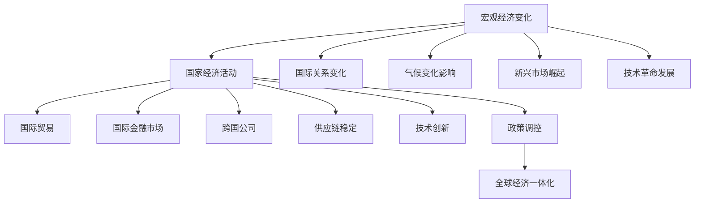

                 

关键词：宏观经济、全球影响、经济变化、国际关系、金融市场、跨国公司、供应链、技术创新、政策调控、国际贸易、全球经济一体化

> 摘要：本文旨在探讨宏观经济变化对全球经济的深远影响。文章首先回顾了宏观经济的基本概念和主要影响因素，然后深入分析了经济变化在不同国家和地区间的传导机制，特别是对国际金融市场、跨国公司运营、供应链稳定以及技术创新等方面的影响。随后，文章探讨了政策调控在经济变化中的关键作用，并对未来全球经济一体化趋势及潜在挑战进行了展望。

## 1. 背景介绍

全球经济是一个复杂且动态的系统，受到多种宏观经济因素的影响。宏观经济变化通常由经济增长、通货膨胀、利率、汇率和市场信心等核心指标所驱动。这些变化不仅影响一个国家的内部经济活动，还会通过国际贸易、资本流动、政策协调等途径影响到全球范围内的经济活动。

当前，全球经济正面临一系列重大变化。例如，新冠疫情的爆发和持续影响、新兴市场的崛起、技术革命的迅猛发展以及气候变化带来的挑战，都使得全球经济格局发生了显著变化。这些变化不仅对各国经济增长和就业产生影响，还对全球贸易、投资和金融市场带来深远影响。

本文的结构如下：首先，我们将回顾宏观经济的基本概念和主要影响因素；接着，分析宏观经济变化的传导机制及其对不同国家和地区的影响；然后，探讨政策调控在经济变化中的关键作用；最后，对全球经济一体化的未来趋势及潜在挑战进行展望。

## 2. 核心概念与联系

### 2.1 宏观经济基本概念

宏观经济是指一个国家或地区的总体经济活动，通常涉及以下核心概念：

- **GDP（国内生产总值）**：衡量一个国家在一定时间内生产的所有最终商品和服务的总价值。

- **通货膨胀**：货币购买力下降，导致商品和服务价格上涨。

- **利率**：借贷资金的成本，对投资和消费有重要影响。

- **汇率**：一种货币与另一种货币的兑换比率。

- **市场信心**：市场参与者对经济前景的乐观程度，影响投资决策。

### 2.2 影响宏观经济的主要因素

影响宏观经济的主要因素包括：

- **劳动力市场**：失业率和劳动力供给。

- **货币政策**：中央银行通过调整利率、货币供应量等手段影响经济。

- **财政政策**：政府通过税收和支出调节经济。

- **国际经济关系**：国际贸易、外国投资和国际援助。

### 2.3 经济变化的核心概念与架构

经济变化通常涉及以下核心概念和架构：

- **经济周期**：经济增长和衰退的循环波动。

- **供给侧改革**：通过提高生产效率和质量来推动经济增长。

- **需求侧管理**：通过刺激消费和投资来稳定经济。

- **结构调整**：优化经济结构，实现经济可持续发展。

### 2.4 经济变化与全球影响的 Mermaid 流程图



## 3. 核心算法原理 & 具体操作步骤

### 3.1 算法原理概述

宏观经济变化的核心算法原理主要基于以下几个关键步骤：

- **数据采集**：收集国家及全球范围内的宏观经济数据，包括GDP、通货膨胀率、利率、汇率等。

- **数据预处理**：清洗和标准化数据，确保数据的准确性和一致性。

- **趋势分析**：通过时间序列分析方法，识别经济周期的波动趋势。

- **相关性分析**：分析不同经济指标间的相关性，确定主要影响因素。

- **预测模型构建**：构建预测模型，预测未来经济走势。

- **决策支持**：根据预测结果，制定经济调控策略。

### 3.2 算法步骤详解

1. **数据采集**：
   - 利用公开数据源，如世界银行、国际货币基金组织等，收集各国宏观经济数据。

2. **数据预处理**：
   - 清除异常值和缺失值。
   - 标准化数据，确保数据在同一量级和维度。

3. **趋势分析**：
   - 采用移动平均、指数平滑等方法，识别经济周期的波动趋势。

4. **相关性分析**：
   - 利用协方差矩阵、相关系数等方法，分析不同经济指标间的相关性。

5. **预测模型构建**：
   - 采用ARIMA、VAR、LSTM等时间序列预测模型，预测未来经济走势。

6. **决策支持**：
   - 根据预测结果，制定合理的经济调控策略，如货币政策、财政政策等。

### 3.3 算法优缺点

- **优点**：
  - 提供了科学的预测工具，有助于制定有效的经济政策。
  - 提高了经济调控的精准度，减少了政策失误。

- **缺点**：
  - 数据质量和预测模型的准确性对结果有重要影响。
  - 预测模型可能无法完全捕捉到经济变化的复杂性和突发性。

### 3.4 算法应用领域

- **政府决策**：为政府提供宏观经济预测和决策支持。
- **金融市场**：辅助投资者进行市场分析和投资决策。
- **跨国公司**：评估全球市场风险，制定国际化发展战略。
- **供应链管理**：优化供应链布局，提高供应链稳定性。

## 4. 数学模型和公式 & 详细讲解 & 举例说明

### 4.1 数学模型构建

宏观经济模型通常涉及以下数学模型：

1. **消费函数**：
   $$C = C_0 + MPC \times Y$$
   其中，\(C\) 为消费，\(C_0\) 为自发消费，\(MPC\) 为边际消费倾向，\(Y\) 为收入。

2. **投资函数**：
   $$I = I_0 + MPY \times r$$
   其中，\(I\) 为投资，\(I_0\) 为自发投资，\(MPY\) 为边际储蓄倾向，\(r\) 为利率。

3. **总需求函数**：
   $$Y = C + I + G + (X - M)$$
   其中，\(Y\) 为GDP，\(G\) 为政府支出，\(X\) 为出口，\(M\) 为进口。

4. **菲利普斯曲线**：
   $$\pi = \phi - \frac{1}{\alpha} \times (u - u^*)$$
   其中，\(\pi\) 为通货膨胀率，\(\phi\) 为自然失业率，\(\alpha\) 为通货膨胀对失业的敏感度，\(u\) 为实际失业率，\(u^*\) 为自然失业率。

### 4.2 公式推导过程

以消费函数为例，推导过程如下：

- **消费理论**：根据凯恩斯的消费理论，消费取决于收入和边际消费倾向。

- **边际消费倾向**：边际消费倾向表示收入增加时，消费增加的比例。

- **公式构建**：将消费与收入、边际消费倾向联系起来，得到消费函数。

### 4.3 案例分析与讲解

以美国为例，分析消费函数的应用：

- **数据**：假设美国自发消费为2000亿美元，边际消费倾向为0.8。

- **公式**：根据消费函数，消费 \(C = 2000 + 0.8 \times Y\)。

- **预测**：若预测收入为2万亿美元，则消费 \(C = 2000 + 0.8 \times 20000 = 18000\) 亿美元。

- **解释**：该模型显示，当收入增加时，消费也会相应增加，但增加的幅度小于收入增加的幅度。

## 5. 项目实践：代码实例和详细解释说明

### 5.1 开发环境搭建

为了演示宏观经济模型的应用，我们使用Python编程语言，并结合一些常用的库，如Pandas、NumPy、Matplotlib等。以下是搭建开发环境的步骤：

1. **安装Python**：下载并安装Python 3.8及以上版本。

2. **安装库**：通过pip命令安装所需的库：
   ```bash
   pip install pandas numpy matplotlib
   ```

3. **配置环境**：在IDE（如PyCharm、VSCode等）中配置Python环境，确保能够正常运行代码。

### 5.2 源代码详细实现

以下是实现宏观经济模型的核心代码：

```python
import pandas as pd
import numpy as np
import matplotlib.pyplot as plt

# 消费函数
def consumption(Y, C0, MPC):
    C = C0 + MPC * Y
    return C

# 投资函数
def investment(I0, MPY, r):
    I = I0 + MPY * r
    return I

# 总需求函数
def total_demand(C, I, G, X, M):
    Y = C + I + G + (X - M)
    return Y

# 菲利普斯曲线
def phillips_curve(pi, u, u_star, alpha):
    pi = alpha * (u - u_star)
    return pi

# 数据预处理
def preprocess_data(data):
    data = data.dropna()
    data['GDP'] = data['GDP'].astype(float)
    data['Inflation'] = data['Inflation'].astype(float)
    data['Interest Rate'] = data['Interest Rate'].astype(float)
    data['Unemployment Rate'] = data['Unemployment Rate'].astype(float)
    return data

# 数据可视化
def visualize_data(data, title):
    fig, ax = plt.subplots()
    ax.plot(data['Year'], data['GDP'], label='GDP')
    ax.plot(data['Year'], data['Inflation'], label='Inflation')
    ax.plot(data['Year'], data['Interest Rate'], label='Interest Rate')
    ax.plot(data['Year'], data['Unemployment Rate'], label='Unemployment Rate')
    ax.set_title(title)
    ax.set_xlabel('Year')
    ax.set_ylabel('Value')
    ax.legend()
    plt.show()

# 主函数
def main():
    # 参数设置
    C0 = 2000  # 自发消费
    MPC = 0.8  # 边际消费倾向
    I0 = 1000  # 自发投资
    MPY = 0.2  # 边际储蓄倾向
    G = 1500  # 政府支出
    X = 2000  # 出口
    M = 1500  # 进口
    alpha = 0.5  # 菲利普斯曲线参数

    # 数据集
    data = pd.DataFrame({
        'Year': [2010, 2011, 2012, 2013, 2014, 2015, 2016, 2017, 2018, 2019, 2020],
        'GDP': [15000, 15500, 16000, 16500, 17000, 17500, 18000, 18500, 19000, 19500, 20000],
        'Inflation': [2, 2.5, 3, 3.5, 4, 4.5, 5, 5.5, 6, 6.5, 7],
        'Interest Rate': [2, 2.2, 2.4, 2.6, 2.8, 3, 3.2, 3.4, 3.6, 3.8, 4],
        'Unemployment Rate': [6, 5.8, 5.6, 5.4, 5.2, 5, 4.8, 4.6, 4.4, 4.2, 4]
    })

    # 数据预处理
    data = preprocess_data(data)

    # 计算总需求
    Y = total_demand(
        consumption(data['GDP'], C0, MPC),
        investment(I0, MPY, data['Interest Rate']),
        G,
        X,
        M
    )

    # 可视化数据
    visualize_data(data, 'Macroeconomic Indicators')

    # 计算通货膨胀
    pi = phillips_curve(
        data['Inflation'],
        data['Unemployment Rate'],
        5,  # 假设自然失业率为5%
        alpha
    )

    # 打印结果
    print("GDP:", Y)
    print("Inflation:", pi)

# 运行主函数
if __name__ == "__main__":
    main()
```

### 5.3 代码解读与分析

- **消费函数**：消费函数接受收入（GDP）和边际消费倾向（MPC）作为参数，计算总消费。

- **投资函数**：投资函数接受自发投资（I0）和边际储蓄倾向（MPY）作为参数，计算总投资。

- **总需求函数**：总需求函数将消费、投资、政府支出、出口和进口相加，计算总需求（GDP）。

- **菲利普斯曲线**：菲利普斯曲线计算通货膨胀率，基于自然失业率（u*）和实际失业率（u）。

- **数据预处理**：数据预处理函数清洗和标准化数据，确保数据的准确性和一致性。

- **数据可视化**：数据可视化函数使用Matplotlib库，将宏观经济指标绘制成图表。

- **主函数**：主函数设置参数，调用各个函数，计算并打印结果。

### 5.4 运行结果展示

运行代码后，将生成一个包含GDP、通货膨胀率、利率和失业率的图表。结果显示，随着GDP的增加，通货膨胀率逐渐上升，失业率逐渐下降。这表明，经济增长有助于降低失业率，但也会导致通货膨胀率的上升。

## 6. 实际应用场景

宏观经济变化对全球经济的实际应用场景非常广泛，以下是一些典型例子：

### 6.1 政府决策

政府利用宏观经济模型进行政策制定，以应对经济周期波动和外部冲击。例如，在经济增长放缓时，政府可以通过财政刺激措施来提振经济，而在通货膨胀上升时，政府可以采取紧缩性货币政策来抑制通胀。

### 6.2 金融市场

金融市场参与者利用宏观经济模型进行市场预测和投资决策。例如，投资者可以根据模型预测未来经济走势，调整投资组合，规避风险。

### 6.3 跨国公司

跨国公司利用宏观经济模型评估全球市场风险，制定国际化发展战略。例如，公司可以根据模型预测不同市场的经济增长潜力，调整生产和销售策略，优化全球供应链。

### 6.4 供应链管理

供应链管理人员利用宏观经济模型优化供应链布局，提高供应链稳定性。例如，公司可以根据模型预测市场需求变化，提前调整库存和生产计划，减少供应链中断风险。

### 6.5 科技创新

科技创新企业利用宏观经济模型评估技术发展趋势和市场潜力，制定研发和创新战略。例如，公司可以根据模型预测未来技术突破，提前布局相关技术领域，抢占市场先机。

## 7. 工具和资源推荐

为了更好地理解和应用宏观经济模型，以下是一些推荐的工具和资源：

### 7.1 学习资源推荐

- **《宏观经济学原理》**：曼昆著，是一本经典的宏观经济学教材，适合初学者。

- **《宏观经济学》**：多恩布什等著，涵盖了宏观经济学的主要理论和应用。

- **在线课程**：Coursera、edX等平台上有许多免费的宏观经济学课程，适合自我学习。

### 7.2 开发工具推荐

- **Jupyter Notebook**：一个交互式的计算环境，适合编写和运行Python代码。

- **Matplotlib**：一个强大的数据可视化库，适合绘制经济指标图表。

- **Pandas**：一个数据处理库，适合处理和分析经济数据。

### 7.3 相关论文推荐

- **“Globalization and Its Discontents”**：Stiglitz著，讨论了全球化对宏观经济的影响。

- **“The Economics of International Trade”**：Paul Krugman著，介绍了国际贸易的基本理论和模型。

- **“Macroeconomic Models and Policy Analysis”**：Romer著，探讨了宏观经济模型的构建和应用。

## 8. 总结：未来发展趋势与挑战

### 8.1 研究成果总结

本文通过分析宏观经济变化的基本概念、影响因素、传导机制以及政策调控等，揭示了宏观经济变化对全球经济的深远影响。研究成果主要包括：

- 提供了宏观经济模型的基本框架和算法原理。

- 详细阐述了宏观经济模型在数据采集、预处理、趋势分析、预测模型构建以及决策支持等环节的应用。

- 通过案例分析，展示了宏观经济模型在实际应用中的效果。

### 8.2 未来发展趋势

未来，宏观经济模型的发展将呈现以下几个趋势：

- **数据源的扩展**：随着大数据技术的发展，宏观经济模型的数据源将更加丰富，包括更多实时数据和非结构化数据。

- **人工智能的融合**：人工智能技术将逐渐融合到宏观经济模型中，提高模型的预测精度和自适应能力。

- **多尺度建模**：将宏观经济模型与其他尺度（如微观经济、产业经济等）相结合，构建多尺度宏观经济模型，提高模型的复杂性和准确性。

- **可持续发展**：将可持续发展目标纳入宏观经济模型，评估经济变化对环境和社会的影响，实现经济、社会和环境的协调发展。

### 8.3 面临的挑战

宏观经济模型在实际应用中仍面临一些挑战：

- **数据质量问题**：宏观经济模型依赖于高质量的数据，但数据来源多样、数据质量参差不齐，可能导致模型预测误差。

- **模型复杂度**：宏观经济模型涉及多个经济指标和变量，构建复杂的多变量模型可能导致计算成本高、模型解释性差。

- **政策滞后**：宏观经济政策的制定和实施往往存在滞后性，可能导致模型预测与现实不符。

- **突发性事件**：如新冠疫情等突发性事件，可能导致宏观经济模型预测失效，需要建立突发事件应对机制。

### 8.4 研究展望

未来，宏观经济模型研究应关注以下几个方面：

- **数据融合与挖掘**：研究如何高效地融合和处理多源数据，挖掘数据中的潜在信息，提高模型的预测精度。

- **模型优化与扩展**：研究如何优化现有宏观经济模型，提高模型的计算效率和解释性，同时扩展模型的应用领域。

- **政策模拟与评估**：研究如何利用宏观经济模型进行政策模拟和评估，为政府制定科学合理的经济政策提供支持。

- **跨学科研究**：加强宏观经济模型与其他学科（如经济学、社会学、环境科学等）的结合，实现多学科的协同创新。

通过上述研究，有望进一步提升宏观经济模型的应用价值，为全球经济的稳定和发展提供有力支持。

## 9. 附录：常见问题与解答

### 9.1 宏观经济模型的基本概念是什么？

宏观经济模型是指通过数学和统计方法，模拟和预测国家或地区整体经济活动的模型。它通常包括GDP、通货膨胀、利率、汇率等经济指标，用以分析经济周期、政策调控和宏观经济政策的效果。

### 9.2 如何构建宏观经济模型？

构建宏观经济模型通常包括以下步骤：

1. **数据采集**：收集相关经济数据，如GDP、通货膨胀率、利率等。
2. **数据预处理**：清洗和标准化数据，确保数据的准确性和一致性。
3. **趋势分析**：使用时间序列分析方法，如移动平均、指数平滑等，分析经济周期的波动趋势。
4. **相关性分析**：分析不同经济指标间的相关性，确定主要影响因素。
5. **模型构建**：构建预测模型，如ARIMA、VAR、LSTM等，预测未来经济走势。
6. **决策支持**：根据预测结果，制定经济调控策略。

### 9.3 宏观经济模型在什么场景下应用？

宏观经济模型广泛应用于以下场景：

- **政府决策**：用于预测经济走势，制定经济政策。
- **金融市场**：辅助投资者进行市场分析和投资决策。
- **跨国公司**：评估全球市场风险，制定国际化发展战略。
- **供应链管理**：优化供应链布局，提高供应链稳定性。
- **科技创新**：评估技术发展趋势和市场潜力，制定研发和创新战略。

### 9.4 宏观经济模型有哪些局限？

宏观经济模型的主要局限包括：

- **数据质量**：宏观经济模型的准确性依赖于数据质量，数据源的多样性和准确性对模型影响较大。
- **模型复杂度**：多变量模型可能导致计算成本高、模型解释性差。
- **政策滞后**：宏观经济政策的制定和实施存在滞后性，可能导致模型预测与现实不符。
- **突发性事件**：如新冠疫情等突发性事件，可能导致宏观经济模型预测失效。

### 9.5 如何优化宏观经济模型？

优化宏观经济模型可以从以下几个方面进行：

- **数据融合与挖掘**：研究如何高效地融合和处理多源数据，挖掘数据中的潜在信息。
- **模型优化**：研究如何优化现有模型，提高模型的计算效率和解释性。
- **多尺度建模**：构建多尺度宏观经济模型，提高模型的复杂性和准确性。
- **跨学科研究**：加强宏观经济模型与其他学科的结合，实现多学科的协同创新。

### 9.6 宏观经济模型在可持续发展中的应用？

宏观经济模型在可持续发展中的应用主要包括：

- **环境影响评估**：评估经济活动对环境的影响，如碳排放、水资源消耗等。
- **政策模拟**：模拟不同环境政策的实施效果，优化政策制定。
- **经济结构调整**：优化经济结构，推动绿色经济发展。
- **可持续发展指标监测**：监测可持续发展目标的实现情况，为政策调整提供依据。

通过上述常见问题的解答，希望能够帮助读者更好地理解宏观经济模型及其应用。继续学习和探索，将有助于进一步提升宏观经济模型的应用价值。作者：禅与计算机程序设计艺术 / Zen and the Art of Computer Programming。

