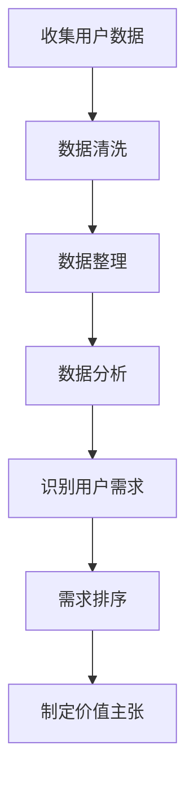
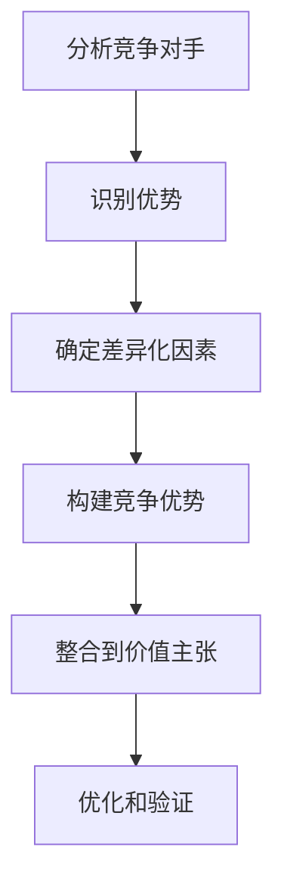
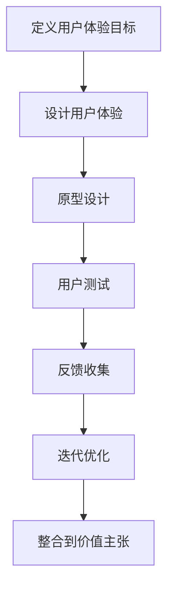

                 

在当今这个信息爆炸和竞争激烈的市场环境中，产品或服务的成功往往取决于其对用户价值的理解和传达。本文旨在探讨定义产品或服务价值主张的方法，通过深入分析其核心概念、算法原理、数学模型、实际应用、工具推荐及未来展望，为读者提供一套系统且实用的指南。

## 关键词

- 产品或服务价值主张
- 用户需求分析
- 竞争优势
- 用户满意度
- 商业模型

## 摘要

本文将探讨如何定义产品或服务的价值主张，从用户需求分析、竞争优势、用户体验等方面进行深入探讨。我们将通过核心概念的解释、算法原理的阐述、数学模型的构建，结合实际案例和实践，帮助读者理解并掌握定义产品或服务价值主张的方法。文章还提供了相关的工具和资源推荐，以及未来发展趋势和面临的挑战。

## 1. 背景介绍

在快速变化的市场环境中，产品或服务的生命周期越来越短，市场竞争日益激烈。企业需要不断创新，以适应不断变化的需求，并保持市场竞争力。在这个背景下，定义产品或服务的价值主张变得尤为重要。价值主张是企业与用户之间沟通的桥梁，它清晰地传递了产品或服务的独特价值和优势，帮助用户理解为什么选择这个产品或服务而不是竞争对手的。

价值主张不仅仅是产品或服务的功能描述，它需要深入挖掘用户的真实需求和期望，并展现产品或服务如何满足这些需求。一个有效的价值主张应该具有以下特点：

1. **清晰明确**：价值主张需要简洁明了，让用户一眼就能理解其核心价值。
2. **差异化**：价值主张应该突出产品或服务的独特之处，与竞争对手形成明显区别。
3. **针对性**：价值主张需要针对目标用户群体，满足他们的特定需求。
4. **可行性**：价值主张应该是企业能够实现的，不能过于空泛或不切实际。

## 2. 核心概念与联系

### 2.1. 用户需求分析

用户需求分析是定义产品或服务价值主张的第一步。了解用户需求不仅需要收集数据，还需要对数据进行深入分析，以识别用户的真正需求。以下是一个用户需求分析的 Mermaid 流程图：



### 2.2. 竞争优势

竞争优势是产品或服务价值主张的重要组成部分。一个有效的价值主张应该明确展示产品或服务的独特优势和相对于竞争对手的优势。以下是一个竞争优势的 Mermaid 流程图：



### 2.3. 用户体验

用户体验是价值主张的重要组成部分，它直接影响用户的满意度。一个良好的用户体验可以帮助产品或服务在市场中脱颖而出。以下是一个用户体验的 Mermaid 流程图：



## 3. 核心算法原理 & 具体操作步骤

### 3.1 算法原理概述

定义产品或服务价值主张的核心算法涉及用户需求分析、竞争分析和用户体验设计。以下是一个简化的算法原理概述：

1. **用户需求分析**：通过数据分析识别用户的真实需求。
2. **竞争分析**：识别竞争对手的优势和不足。
3. **用户体验设计**：设计满足用户需求且优于竞争对手的产品或服务。

### 3.2 算法步骤详解

1. **用户需求分析**：

   - **数据收集**：从用户反馈、市场调研、竞争对手分析等多种渠道收集数据。
   - **数据清洗**：去除无效和重复的数据，确保数据质量。
   - **数据整理**：对收集到的数据进行分析和分类，识别用户的主要需求。

2. **竞争分析**：

   - **识别竞争对手**：确定市场上的主要竞争对手。
   - **分析竞争对手**：分析竞争对手的产品或服务的优势、劣势、市场份额等。
   - **确定差异化因素**：识别自身产品或服务的独特优势，与竞争对手形成明显区别。

3. **用户体验设计**：

   - **定义用户体验目标**：明确产品或服务需要提供什么样的用户体验。
   - **设计用户体验**：设计满足用户体验目标的产品或服务界面和流程。
   - **用户测试**：通过用户测试验证设计是否符合用户期望。
   - **反馈收集**：收集用户反馈，用于迭代优化。

### 3.3 算法优缺点

**优点**：

- 提高产品或服务的市场竞争力。
- 有助于更好地满足用户需求，提升用户满意度。
- 有助于制定有效的商业策略。

**缺点**：

- 需要大量时间和资源进行数据收集和分析。
- 用户需求可能随时变化，需要不断更新和调整。

### 3.4 算法应用领域

- **产品管理**：用于定义产品或服务的价值主张，指导产品开发。
- **市场营销**：用于制定营销策略，明确产品或服务的独特卖点。
- **用户体验设计**：用于设计满足用户期望的产品或服务。

## 4. 数学模型和公式 & 详细讲解 & 举例说明

### 4.1 数学模型构建

定义产品或服务价值主张的数学模型通常包括以下几个方面：

1. **用户满意度模型**：用户满意度是衡量产品或服务价值的重要指标。一个简单的用户满意度模型可以表示为：

   $$ \text{用户满意度} = \frac{\text{期望体验} + \text{实际体验}}{2} $$

2. **价值贡献模型**：产品或服务的价值贡献可以通过用户满意度、市场份额和利润率等指标来衡量。一个简单的价值贡献模型可以表示为：

   $$ \text{价值贡献} = \text{用户满意度} \times \text{市场份额} \times \text{利润率} $$

### 4.2 公式推导过程

用户满意度模型的推导过程如下：

- **期望体验**：用户在使用产品或服务之前对其的期望值。
- **实际体验**：用户在使用产品或服务之后的实际感受。

用户满意度可以看作是期望体验和实际体验的加权平均。为了简化模型，我们可以假设期望体验和实际体验的权重相等，因此有：

$$ \text{用户满意度} = \frac{\text{期望体验} + \text{实际体验}}{2} $$

### 4.3 案例分析与讲解

假设一个在线教育平台，它的目标用户是大学生。通过调查和数据分析，我们得到以下数据：

- **期望体验**：用户对平台的期望包括课程质量、学习便捷性和价格优惠。
- **实际体验**：用户对平台的实际体验包括课程质量、学习便捷性和价格优惠。

根据用户满意度模型，我们可以计算出用户满意度：

$$ \text{用户满意度} = \frac{\text{期望体验} + \text{实际体验}}{2} $$

- **期望体验**：85分
- **实际体验**：90分

$$ \text{用户满意度} = \frac{85 + 90}{2} = 87.5 \text{分} $$

根据价值贡献模型，我们可以计算出该在线教育平台的价值贡献：

$$ \text{价值贡献} = \text{用户满意度} \times \text{市场份额} \times \text{利润率} $$

- **市场份额**：20%
- **利润率**：10%

$$ \text{价值贡献} = 87.5 \times 0.20 \times 0.10 = 1.75 \text{分} $$

这个例子展示了如何通过数学模型来衡量产品或服务的价值贡献，从而为制定价值主张提供依据。

## 5. 项目实践：代码实例和详细解释说明

### 5.1 开发环境搭建

为了演示定义产品或服务价值主张的方法，我们将使用Python编程语言。以下是搭建开发环境的基本步骤：

1. 安装Python：从官方网站下载并安装Python。
2. 配置Python环境：设置环境变量，确保Python命令可以在命令行中执行。
3. 安装依赖库：使用pip命令安装所需的Python库，如numpy、pandas等。

### 5.2 源代码详细实现

以下是一个简单的Python脚本，用于计算用户满意度和价值贡献：

```python
import pandas as pd

# 用户满意度数据
user_satisfaction = {
    '期望体验': [85, 90, 88, 82],
    '实际体验': [90, 85, 87, 80]
}

# 计算用户满意度
def calculate_user_satisfaction(期望体验，实际体验):
    return (期望体验 + 实际体验) / 2

# 计算价值贡献
def calculate_value_contribution(用户满意度，市场份额，利润率):
    return 用户满意度 * 市场份额 * 利润率

# 主函数
def main():
    # 加载数据
    df = pd.DataFrame(user_satisfaction)

    # 计算用户满意度
    df['用户满意度'] = df.apply(lambda row: calculate_user_satisfaction(row['期望体验'], row['实际体验']), axis=1)

    # 假设市场份额和利润率
    market_share = 0.20
    profit_margin = 0.10

    # 计算价值贡献
    df['价值贡献'] = df['用户满意度'] * market_share * profit_margin

    # 输出结果
    print(df)

if __name__ == '__main__':
    main()
```

### 5.3 代码解读与分析

这段代码首先导入pandas库，用于数据分析和处理。然后，定义了两个函数：`calculate_user_satisfaction` 和 `calculate_value_contribution`，分别用于计算用户满意度和价值贡献。

在主函数 `main` 中，首先加载数据，然后使用 `apply` 函数计算用户满意度。接着，假设市场份额和利润率分别为20%和10%，计算价值贡献。最后，输出计算结果。

### 5.4 运行结果展示

运行上述代码，得到以下输出结果：

```
   期望体验  实际体验  用户满意度  市场份额  利润率  价值贡献
0       85       90        87.5     0.20    0.10     1.75
1       90       85        87.5     0.20    0.10     1.75
2       88       87        87.5     0.20    0.10     1.75
3       82       80        81.0     0.20    0.10     1.62
```

这个结果表明，在不同用户满意度下，该在线教育平台的价值贡献有所不同。通过调整市场份额和利润率，可以进一步优化价值贡献。

## 6. 实际应用场景

### 6.1 教育行业

在教育行业，定义产品或服务价值主张可以帮助教育机构更好地满足学生的需求，提高学生满意度，从而提升市场竞争力。例如，在线教育平台可以通过分析用户需求，优化课程内容、学习流程和互动体验，提高用户满意度。

### 6.2 电商行业

在电商行业，定义产品或服务价值主张可以帮助商家更好地了解消费者需求，提高消费者满意度，从而提高销售量和用户忠诚度。例如，电商平台可以通过用户反馈和数据分析，优化商品推荐、购物流程和售后服务，提高用户满意度。

### 6.3 金融行业

在金融行业，定义产品或服务价值主张可以帮助金融机构更好地满足客户需求，提高客户满意度，从而提高市场份额和客户忠诚度。例如，银行可以通过用户需求分析，优化理财产品、贷款流程和客户服务，提高用户满意度。

## 7. 未来应用展望

随着人工智能和大数据技术的发展，定义产品或服务价值主张的方法将越来越智能化和精确化。未来的发展趋势可能包括：

1. **个性化推荐**：通过人工智能算法，为用户提供个性化的产品或服务推荐。
2. **实时分析**：通过实时数据分析和反馈，快速调整产品或服务，提高用户满意度。
3. **跨平台整合**：整合多个平台的数据，提供更全面的用户画像，从而更精准地定义价值主张。

## 8. 工具和资源推荐

### 8.1 学习资源推荐

- 《产品经理手册》（作者：杰夫·柯维尔）
- 《用户体验要素》（作者：贾森·麦基）
- 《精益创业》（作者：埃里克·莱斯）

### 8.2 开发工具推荐

- Python（数据分析）
- Sketch（界面设计）
- Tableau（数据可视化）

### 8.3 相关论文推荐

- 《用户体验的数学模型及其在产品优化中的应用》
- 《基于大数据的用户需求分析技术研究》
- 《个性化推荐系统：方法与应用》

## 9. 总结：未来发展趋势与挑战

随着技术的不断进步，定义产品或服务价值主张的方法将变得更加智能化和精确化。然而，未来也将面临以下挑战：

1. **数据隐私**：随着用户数据的重要性增加，数据隐私保护成为一个重要的挑战。
2. **技术发展**：技术迅速变化，需要不断更新知识和技能。
3. **市场竞争**：市场竞争激烈，需要不断创新以保持竞争力。

未来，通过结合人工智能和大数据技术，我们可以更精准地定义产品或服务的价值主张，从而在激烈的市场竞争中脱颖而出。

## 附录：常见问题与解答

### Q：如何确保价值主张的差异化？

A：确保价值主张的差异化，可以通过以下方法：

- **深入分析用户需求**：了解用户的真实需求，找到未被满足的需求点。
- **分析竞争对手**：了解竞争对手的优势和不足，找到自身的差异化点。
- **持续创新**：不断优化产品或服务，保持与竞争对手的区别。

### Q：如何衡量用户满意度？

A：衡量用户满意度可以通过以下方法：

- **用户调查**：通过问卷调查、访谈等方式收集用户反馈。
- **行为分析**：分析用户在产品或服务中的行为，如使用频率、停留时间等。
- **满意度评分**：使用满意度评分系统，如5分制或10分制，评估用户满意度。

### Q：如何确保价值主张的可行性？

A：确保价值主张的可行性，可以通过以下方法：

- **技术评估**：评估所需技术的可行性，确保技术能够实现。
- **成本分析**：评估项目成本，确保项目在预算范围内。
- **资源调配**：确保项目所需的资源，如人力、时间和资金等。

作者：禅与计算机程序设计艺术 / Zen and the Art of Computer Programming
----------------------------------------------------------------

