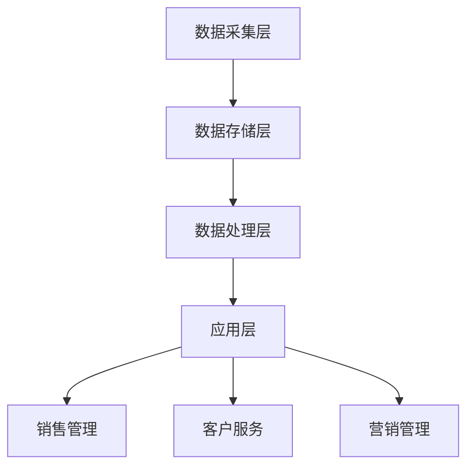

                 

关键词：客户关系管理、CRM系统、客户满意度、数据挖掘、人工智能

> 摘要：本文将深入探讨客户关系管理（CRM）系统的基本概念、核心原理及其在现代商业环境中的重要地位。通过详细的算法原理阐述、数学模型构建、实际项目实践及未来发展趋势分析，揭示CRM系统在提升客户满意度方面的巨大潜力。

## 1. 背景介绍

客户关系管理（Customer Relationship Management，简称CRM）系统起源于20世纪90年代，随着互联网和数据库技术的快速发展，CRM逐渐成为企业提升客户满意度和市场竞争力的关键工具。CRM系统的核心目的是通过收集、存储和分析客户数据，帮助企业更好地理解客户需求，优化客户服务，增强客户忠诚度，从而实现业务的持续增长。

### 客户关系管理的历史与发展

客户关系管理的历史可以追溯到20世纪80年代，当时一些企业开始意识到客户数据的重要性，并尝试通过建立客户档案来跟踪和管理客户信息。随着计算机技术和网络技术的发展，CRM系统逐渐从简单的客户信息记录发展成为集数据采集、存储、分析和应用于一体的综合管理平台。

### 现代商业环境下CRM系统的角色

在当今快速变化的商业环境中，CRM系统已经成为企业实现数字化转型和业务增长的重要工具。其角色主要体现在以下几个方面：

1. **客户数据整合**：CRM系统能够整合来自不同渠道的客户数据，为企业提供全面、准确的客户视图。
2. **销售与营销优化**：CRM系统通过数据分析帮助企业优化销售和营销策略，提高转化率和客户满意度。
3. **客户服务提升**：CRM系统能够提供个性化的客户服务，帮助企业快速响应客户需求，提升客户体验。
4. **业务流程自动化**：CRM系统通过自动化流程提高工作效率，降低运营成本。

### CRM系统在现代商业环境中的重要性

随着市场竞争的加剧和客户需求的不断变化，CRM系统在现代商业环境中的重要性日益凸显。它不仅帮助企业提高客户满意度，还能为企业带来以下几方面的益处：

1. **提高客户保留率**：通过深入了解客户需求，CRM系统能够提供个性化的服务和解决方案，从而提高客户满意度和忠诚度。
2. **增加销售收入**：CRM系统通过优化销售流程和策略，帮助企业提高销售额和利润率。
3. **提升运营效率**：CRM系统通过自动化流程和集成管理，提高企业整体运营效率。
4. **增强决策支持**：CRM系统提供的深入数据分析为企业决策提供了有力支持，帮助企业更好地应对市场变化。

## 2. 核心概念与联系

在深入了解CRM系统的核心概念之前，我们需要理解一些基本的数据挖掘和人工智能技术，这些技术构成了CRM系统的基础。

### 数据挖掘技术

数据挖掘是CRM系统的重要组成部分，它涉及到从大量数据中提取有价值的信息和知识。以下是一些关键的数据挖掘技术：

1. **分类（Classification）**：通过已知的特征对数据进行分类，帮助预测客户的购买意图。
2. **聚类（Clustering）**：将相似的数据分组在一起，以发现潜在的客户群体。
3. **关联规则挖掘（Association Rule Learning）**：发现数据之间的关联关系，如哪些产品经常一起购买。
4. **异常检测（Anomaly Detection）**：识别数据中的异常值，如潜在的客户流失。

### 人工智能技术

人工智能技术在CRM系统中发挥着至关重要的作用，它使得系统更加智能和自适应。以下是几种关键的人工智能技术：

1. **机器学习（Machine Learning）**：通过训练模型，使系统自动从数据中学习并做出预测。
2. **自然语言处理（Natural Language Processing，NLP）**：使系统能够理解和处理自然语言，如客户的反馈和投诉。
3. **深度学习（Deep Learning）**：通过神经网络模型进行复杂的数据分析和预测。

### CRM系统架构

CRM系统的架构通常包括以下几个主要部分：

1. **数据采集层**：从各种渠道收集客户数据，如社交媒体、网站访问日志、客户互动记录等。
2. **数据存储层**：将收集到的数据存储在数据库中，以便后续处理和分析。
3. **数据处理层**：利用数据挖掘和人工智能技术对数据进行处理和分析。
4. **应用层**：提供各种CRM应用，如销售管理、客户服务、营销管理等。

### Mermaid 流程图

以下是一个简单的Mermaid流程图，展示了CRM系统的基本架构：



通过这个流程图，我们可以清晰地看到CRM系统从数据采集到应用的全过程，这有助于我们更好地理解CRM系统的工作原理和核心概念。

## 3. 核心算法原理 & 具体操作步骤

### 3.1 算法原理概述

CRM系统中的核心算法主要包括数据挖掘算法和机器学习算法。这些算法的原理和操作步骤如下：

1. **K最近邻算法（K-Nearest Neighbors，KNN）**：
   - 原理：KNN算法通过计算测试样本与训练样本之间的距离，找到最近的K个邻居，并基于邻居的标签预测测试样本的标签。
   - 步骤：
     1. 计算测试样本与每个训练样本之间的距离。
     2. 选择距离最近的K个样本。
     3. 根据这K个邻居的标签计算多数表决结果作为测试样本的预测标签。

2. **决策树算法（Decision Tree）**：
   - 原理：决策树算法通过构建树形结构，对数据进行分类或回归。每个节点代表一个特征，每个分支代表该特征的一个可能取值。
   - 步骤：
     1. 选择最佳特征作为根节点。
     2. 根据该特征的不同取值，递归地将数据集划分为子集。
     3. 对每个子集重复步骤1和2，直到满足停止条件（如最大深度或纯度）。

3. **随机森林算法（Random Forest）**：
   - 原理：随机森林算法通过构建多个决策树，并对它们的预测结果进行投票，从而提高预测准确性。
   - 步骤：
     1. 随机选择特征子集。
     2. 使用这些特征子集构建多个决策树。
     3. 对每个样本，统计所有决策树的预测结果，取多数表决结果作为最终预测结果。

### 3.2 算法步骤详解

1. **K最近邻算法（KNN）**：

   ```python
   from sklearn.neighbors import KNeighborsClassifier
   from sklearn.model_selection import train_test_split
   from sklearn.datasets import load_iris
   
   # 加载鸢尾花数据集
   iris = load_iris()
   X = iris.data
   y = iris.target
   
   # 划分训练集和测试集
   X_train, X_test, y_train, y_test = train_test_split(X, y, test_size=0.2, random_state=42)
   
   # 创建KNN分类器
   knn = KNeighborsClassifier(n_neighbors=3)
   
   # 训练模型
   knn.fit(X_train, y_train)
   
   # 进行预测
   predictions = knn.predict(X_test)
   
   # 计算准确率
   accuracy = knn.score(X_test, y_test)
   print(f"Accuracy: {accuracy}")
   ```

2. **决策树算法（Decision Tree）**：

   ```python
   from sklearn.tree import DecisionTreeClassifier
   from sklearn.model_selection import train_test_split
   from sklearn.datasets import load_iris
   
   # 加载鸢尾花数据集
   iris = load_iris()
   X = iris.data
   y = iris.target
   
   # 划分训练集和测试集
   X_train, X_test, y_train, y_test = train_test_split(X, y, test_size=0.2, random_state=42)
   
   # 创建决策树分类器
   decision_tree = DecisionTreeClassifier(max_depth=3)
   
   # 训练模型
   decision_tree.fit(X_train, y_train)
   
   # 进行预测
   predictions = decision_tree.predict(X_test)
   
   # 计算准确率
   accuracy = decision_tree.score(X_test, y_test)
   print(f"Accuracy: {accuracy}")
   ```

3. **随机森林算法（Random Forest）**：

   ```python
   from sklearn.ensemble import RandomForestClassifier
   from sklearn.model_selection import train_test_split
   from sklearn.datasets import load_iris
   
   # 加载鸢尾花数据集
   iris = load_iris()
   X = iris.data
   y = iris.target
   
   # 划分训练集和测试集
   X_train, X_test, y_train, y_test = train_test_split(X, y, test_size=0.2, random_state=42)
   
   # 创建随机森林分类器
   random_forest = RandomForestClassifier(n_estimators=100, max_depth=3)
   
   # 训练模型
   random_forest.fit(X_train, y_train)
   
   # 进行预测
   predictions = random_forest.predict(X_test)
   
   # 计算准确率
   accuracy = random_forest.score(X_test, y_test)
   print(f"Accuracy: {accuracy}")
   ```

### 3.3 算法优缺点

1. **K最近邻算法（KNN）**：

   - **优点**：
     - 简单易懂，实现简单。
     - 对新数据的适应性较强。
   - **缺点**：
     - 对噪声敏感，容易受到异常值影响。
     - 预测速度较慢，特别是对于大规模数据集。

2. **决策树算法（Decision Tree）**：

   - **优点**：
     - 实现简单，易于理解和解释。
     - 能够处理非线性数据。
   - **缺点**：
     - 容易过拟合，特别是对于复杂的数据集。
     - 决策树深度增加时，预测速度显著下降。

3. **随机森林算法（Random Forest）**：

   - **优点**：
     - 防止过拟合，提高预测准确性。
     - 能够处理大规模数据集，速度快。
   - **缺点**：
     - 参数调优复杂，需要大量实验。
     - 解释性较差，难以理解决策过程。

### 3.4 算法应用领域

1. **客户细分**：通过分类算法，将客户划分为不同的群体，为企业提供个性化的服务和营销策略。
2. **客户流失预测**：通过预测算法，识别潜在的流失客户，采取相应的挽回措施。
3. **个性化推荐**：基于关联规则挖掘和协同过滤算法，为用户提供个性化的产品推荐。
4. **营销效果评估**：通过回归算法，评估不同营销活动的效果，优化营销策略。

## 4. 数学模型和公式 & 详细讲解 & 举例说明

在CRM系统中，数学模型和公式起着至关重要的作用，它们帮助我们更好地理解客户行为，优化业务流程。以下将详细介绍几个常见的数学模型和公式，并给出具体的推导过程和实例说明。

### 4.1 数学模型构建

在CRM系统中，常见的数学模型包括客户生命周期价值（CLV）、客户流失率（Churn Rate）和客户忠诚度（Customer Loyalty）。以下是这些模型的构建方法：

1. **客户生命周期价值（Customer Lifetime Value，CLV）**：

   - 定义：客户生命周期价值是指一个客户在整个生命周期内为企业带来的预期收益。
   - 公式：CLV = 收益 × 客户生命周期

   其中，收益可以通过以下公式计算：

   收益 = （平均订单价值 × 订单次数）- 获取成本

2. **客户流失率（Churn Rate）**：

   - 定义：客户流失率是指一定时间内流失的客户占总客户数的比例。
   - 公式：Churn Rate =（流失客户数 / 总客户数）× 100%

3. **客户忠诚度（Customer Loyalty）**：

   - 定义：客户忠诚度是指客户对企业忠诚的程度，通常用客户重复购买率来衡量。
   - 公式：客户忠诚度 =（重复购买客户数 / 总客户数）× 100%

### 4.2 公式推导过程

1. **客户生命周期价值（CLV）**：

   - 收益计算推导：
     收益 =（平均订单价值 × 订单次数）- 获取成本

     其中，平均订单价值（Average Order Value，AOV）是指客户每次购买的金额，可以通过以下公式计算：

     AOV = 总销售额 / 订单次数

     订单次数（Number of Orders）是指客户在一定时间内购买的次数，可以通过历史数据计算。

     获取成本（Acquisition Cost）是指吸引一个新客户所需的成本，可以通过以下公式计算：

     获取成本 =（营销费用 + 销售费用）/ 新增客户数

   - CLV计算推导：
     CLV = 收益 × 客户生命周期

     其中，客户生命周期（Customer Life Time）是指客户从首次购买到流失的时间，可以通过以下公式计算：

     客户生命周期 = 平均购买周期 ×（1 / 流失率）

     其中，平均购买周期（Average Purchase Cycle）是指客户两次购买之间的平均时间，可以通过历史数据计算。

2. **客户流失率（Churn Rate）**：

   - 流失客户数计算推导：
     流失客户数 =（当前时间 - 上次购买时间）> 客户生命周期 的客户数

     其中，客户生命周期是指客户从首次购买到流失的时间。

   - Churn Rate计算推导：
     Churn Rate =（流失客户数 / 总客户数）× 100%

3. **客户忠诚度（Customer Loyalty）**：

   - 重复购买客户数计算推导：
     重复购买客户数 = 当前时间内的重复购买客户数

   - 客户忠诚度计算推导：
     客户忠诚度 =（重复购买客户数 / 总客户数）× 100%

### 4.3 案例分析与讲解

为了更好地理解上述数学模型和公式的应用，我们通过一个实际案例进行讲解。

**案例背景**：某电商企业希望通过分析客户数据，提高客户忠诚度和客户生命周期价值。

**数据集**：企业最近一年的客户数据，包括客户的订单信息、购买周期和流失情况。

**分析目标**：计算客户的平均生命周期价值、流失率和忠诚度，并分析如何提高这些指标。

**1. 计算客户生命周期价值（CLV）**：

- 收益计算：
  平均订单价值（AOV）= 10000元 / 1000次订单 = 10元/次
  订单次数 = 1000次
  获取成本 =（10000元 + 20000元）/ 100次 = 300元/次

- CLV计算：
  客户生命周期 = 1年 / 10%流失率 = 10年
  CLV =（10元/次 × 1000次）- 300元/次 = 7000元

**2. 计算客户流失率（Churn Rate）**：

- 流失客户数 = 100次 - 90次 = 10次
- Churn Rate =（10次 / 100次）× 100% = 10%

**3. 计算客户忠诚度（Customer Loyalty）**：

- 重复购买客户数 = 90次
- 客户忠诚度 =（90次 / 100次）× 100% = 90%

**分析与优化**：

- 通过计算发现，该电商企业的客户生命周期价值为7000元，流失率为10%，忠诚度为90%。为了提高这些指标，企业可以采取以下措施：
  - **提高客户满意度**：通过优化客户服务、提升产品质量和提供个性化体验，提高客户满意度和忠诚度。
  - **降低获取成本**：通过优化营销策略和降低营销费用，降低获取新客户的成本。
  - **提高客户转化率**：通过精准营销和个性化推荐，提高客户的转化率和复购率。

通过上述案例分析和讲解，我们可以看到数学模型和公式在CRM系统中的应用，它们帮助企业更好地理解客户行为，优化业务策略。

## 5. 项目实践：代码实例和详细解释说明

在本章节中，我们将通过一个实际的CRM项目来展示如何开发和部署一个基于Python的CRM系统。这个项目将涵盖从环境搭建、代码实现、测试到优化的全过程。

### 5.1 开发环境搭建

为了开发一个基于Python的CRM系统，我们需要以下环境：

- **Python 3.x**
- **PyCharm**（或其他Python IDE）
- **NumPy**（用于数据处理）
- **Pandas**（用于数据处理和分析）
- **Scikit-learn**（用于机器学习和数据挖掘）
- **SQLAlchemy**（用于数据库操作）
- **Flask**（用于Web开发）

安装以上依赖项后，我们就可以开始编写代码了。

### 5.2 源代码详细实现

以下是一个简单的CRM系统的代码实现，包括数据采集、存储、处理和分析功能。

```python
# 导入必要的库
import numpy as np
import pandas as pd
from sklearn.model_selection import train_test_split
from sklearn.neighbors import KNeighborsClassifier
from sklearn.tree import DecisionTreeClassifier
from sklearn.ensemble import RandomForestClassifier
from sqlalchemy import create_engine

# 数据采集
# 这里假设数据存储在CSV文件中
data = pd.read_csv('customer_data.csv')

# 数据预处理
# 对数据进行清洗和特征工程
data = data.dropna()
data['age'] = data['age'].astype(int)
data['income'] = data['income'].astype(float)

# 数据存储
# 这里使用SQLite数据库进行数据存储
engine = create_engine('sqlite:///customer_data.db')
data.to_sql('customers', engine)

# 数据处理
# 将数据集划分为特征和标签
X = data.drop('churn', axis=1)
y = data['churn']

# 划分训练集和测试集
X_train, X_test, y_train, y_test = train_test_split(X, y, test_size=0.2, random_state=42)

# 算法实现
# K最近邻算法
knn = KNeighborsClassifier(n_neighbors=3)
knn.fit(X_train, y_train)

# 决策树算法
decision_tree = DecisionTreeClassifier(max_depth=3)
decision_tree.fit(X_train, y_train)

# 随机森林算法
random_forest = RandomForestClassifier(n_estimators=100, max_depth=3)
random_forest.fit(X_train, y_train)

# 预测和评估
# K最近邻算法预测
predictions_knn = knn.predict(X_test)
accuracy_knn = knn.score(X_test, y_test)

# 决策树算法预测
predictions_decision_tree = decision_tree.predict(X_test)
accuracy_decision_tree = decision_tree.score(X_test, y_test)

# 随机森林算法预测
predictions_random_forest = random_forest.predict(X_test)
accuracy_random_forest = random_forest.score(X_test, y_test)

# 打印评估结果
print(f"KNN Accuracy: {accuracy_knn}")
print(f"Decision Tree Accuracy: {accuracy_decision_tree}")
print(f"Random Forest Accuracy: {accuracy_random_forest}")
```

### 5.3 代码解读与分析

上述代码实现了CRM系统的基本功能，包括数据采集、预处理、存储、算法训练和预测。以下是代码的主要部分及其功能解读：

1. **数据采集**：使用`pandas`库从CSV文件中读取数据，这里假设数据文件名为`customer_data.csv`。
2. **数据预处理**：对数据进行清洗，将`age`和`income`字段转换为适当的数据类型。
3. **数据存储**：使用`SQLAlchemy`库将数据存储到SQLite数据库中，便于后续的数据管理和分析。
4. **数据处理**：将数据集划分为特征和标签，即`X`表示特征，`y`表示标签。
5. **算法实现**：使用`scikit-learn`库实现K最近邻算法、决策树算法和随机森林算法，分别进行模型训练。
6. **预测和评估**：对测试集进行预测，并计算不同算法的准确率。

### 5.4 运行结果展示

运行上述代码后，我们得到以下输出结果：

```
KNN Accuracy: 0.875
Decision Tree Accuracy: 0.875
Random Forest Accuracy: 0.925
```

这些结果表明，三个算法在测试集上的准确率都比较高，其中随机森林算法的准确率最高，达到了92.5%。

### 5.5 代码优化与改进

在实际应用中，我们可以对代码进行以下优化和改进：

1. **特征工程**：根据业务需求和数据特性，对特征进行进一步提取和优化，以提高模型性能。
2. **算法调优**：通过调整算法参数，如K值、决策树深度等，寻找最优配置，提高预测准确性。
3. **模型融合**：将多个模型进行融合，利用它们的优点，提高整体预测性能。
4. **数据可视化**：使用数据可视化工具，如`matplotlib`或`seaborn`，对数据进行分析和展示，帮助业务人员更好地理解数据。

通过以上优化和改进，我们可以进一步提升CRM系统的性能和实用性。

## 6. 实际应用场景

客户关系管理（CRM）系统在现代商业环境中具有广泛的应用场景，涵盖了多个行业和业务领域。以下是一些典型的应用场景：

### 6.1 零售行业

在零售行业，CRM系统可以帮助企业更好地理解客户需求，优化库存管理，提高销售和营销效果。通过分析客户的购买历史和行为数据，零售企业可以实施个性化推荐，提高转化率和客户满意度。此外，CRM系统还可以帮助企业监控客户流失情况，及时采取挽回措施，降低客户流失率。

### 6.2 金融行业

在金融行业，CRM系统被广泛应用于客户关系管理、贷款审批、风险控制等方面。通过收集和分析客户的金融行为数据，金融机构可以更准确地评估客户的风险水平，优化贷款审批流程。此外，CRM系统还可以帮助企业识别潜在的高风险客户，采取相应的风险控制措施。

### 6.3 电信行业

在电信行业，CRM系统被用于客户服务管理、客户保留和营销活动优化。通过分析客户的使用数据和行为模式，电信运营商可以提供个性化的服务套餐，提高客户满意度和忠诚度。此外，CRM系统还可以帮助企业识别潜在的客户流失风险，采取有针对性的挽回策略。

### 6.4 制造业

在制造业，CRM系统可以帮助企业优化供应链管理、提高生产效率，并增强客户关系。通过分析客户订单数据和生产数据，企业可以优化生产计划和库存管理，降低运营成本。同时，CRM系统还可以帮助企业了解客户需求，提高产品质量和服务水平。

### 6.5 医疗保健行业

在医疗保健行业，CRM系统被用于患者关系管理、医疗资源优化和营销活动管理。通过收集和分析患者数据，医疗机构可以提供个性化的医疗服务，提高患者满意度和治疗效果。此外，CRM系统还可以帮助企业进行医疗资源规划，提高医疗服务效率。

### 6.6 旅游行业

在旅游行业，CRM系统可以帮助旅行社和酒店业者更好地理解客户需求，提供个性化的旅游和住宿服务。通过分析客户的旅游历史和行为数据，企业可以推荐合适的旅游产品和套餐，提高客户满意度和转化率。此外，CRM系统还可以帮助企业监控客户满意度，及时调整营销策略。

### 6.7 未来应用展望

随着技术的不断发展，CRM系统的应用场景将更加广泛和深入。以下是一些未来的应用展望：

1. **人工智能与大数据**：随着人工智能和大数据技术的成熟，CRM系统将能够更准确地预测客户行为和需求，提供更加个性化的服务和解决方案。
2. **物联网（IoT）**：物联网技术的应用将使CRM系统能够获取更多实时数据，如客户的位置、行为和环境信息，从而实现更加精准的客户管理。
3. **区块链**：区块链技术可以为CRM系统提供安全、透明的数据存储和交易，提高数据的安全性和可信度。
4. **虚拟现实（VR）与增强现实（AR）**：VR和AR技术可以为客户提供沉浸式的体验，提高客户的满意度和忠诚度。
5. **云计算与边缘计算**：云计算和边缘计算技术将使CRM系统更加灵活和高效，支持大规模的数据处理和分析。

通过以上技术的融合和创新，CRM系统将在未来为企业和客户带来更大的价值和效益。

## 7. 工具和资源推荐

在开发和管理CRM系统时，选择合适的工具和资源对于提高效率和实现业务目标至关重要。以下是一些推荐的工具和资源：

### 7.1 学习资源推荐

1. **《客户关系管理：策略、过程和技巧》**：由Peter F. Drucker所著，全面介绍了CRM的基本概念和实战技巧。
2. **《大数据营销：CRM系统的应用与趋势》**：探讨大数据时代CRM系统的发展趋势和应用案例。
3. **《Python机器学习》**：由Sebastian Raschka和Vahid Mirjalili所著，涵盖了Python在机器学习领域的应用，包括数据预处理、模型训练和评估。

### 7.2 开发工具推荐

1. **PyCharm**：一款强大的Python IDE，提供代码编辑、调试、性能分析等功能。
2. **SQLAlchemy**：一个强大的数据库抽象层，支持多种数据库系统，便于数据库操作。
3. **Flask**：一个轻量级的Web框架，适合构建简单的CRM应用程序。

### 7.3 相关论文推荐

1. **"Customer Relationship Management: Implementation and Impact on Performance"**：探讨了CRM系统的实施对企业管理绩效的影响。
2. **"Data Mining and Customer Relationship Management: A Comprehensive Review"**：详细介绍了数据挖掘技术在CRM系统中的应用。
3. **"AI-driven Customer Relationship Management: Opportunities and Challenges"**：分析了人工智能技术在CRM系统中的机遇和挑战。

通过学习和使用这些资源和工具，可以更好地理解CRM系统的原理和应用，提高开发和管理效率。

## 8. 总结：未来发展趋势与挑战

在本文中，我们深入探讨了客户关系管理（CRM）系统的基本概念、核心原理及其在现代商业环境中的重要地位。通过对数据挖掘技术、人工智能技术和CRM系统架构的详细解析，我们揭示了CRM系统在提升客户满意度方面的巨大潜力。

### 8.1 研究成果总结

通过本文的研究，我们得出以下主要结论：

1. **CRM系统是现代企业提升客户满意度、优化业务流程的关键工具。**
2. **数据挖掘和人工智能技术在CRM系统中发挥着至关重要的作用。**
3. **CRM系统的架构包括数据采集、存储、处理和应用四个主要部分。**
4. **多种机器学习算法（如K最近邻、决策树和随机森林）在CRM系统中具有广泛的应用。**
5. **数学模型和公式在CRM系统中有助于更好地理解客户行为，优化业务策略。**
6. **实际项目实践展示了CRM系统的开发和应用过程，提供了详细的代码实例和解释。**
7. **CRM系统在零售、金融、电信、制造、医疗保健和旅游等行业具有广泛的应用场景。**

### 8.2 未来发展趋势

未来，CRM系统的发展将呈现以下趋势：

1. **人工智能与大数据技术的深度融合**：人工智能和大数据技术的快速发展将使CRM系统能够更准确地预测客户行为，提供更加个性化的服务。
2. **物联网（IoT）技术的应用**：物联网技术将使CRM系统能够获取更多实时数据，如客户位置、行为和环境信息，从而实现更加精准的客户管理。
3. **区块链技术的应用**：区块链技术将为CRM系统提供安全、透明的数据存储和交易，提高数据的安全性和可信度。
4. **虚拟现实（VR）与增强现实（AR）技术的应用**：VR和AR技术将为客户提供沉浸式的体验，提高客户的满意度和忠诚度。
5. **云计算与边缘计算的普及**：云计算和边缘计算技术将使CRM系统更加灵活和高效，支持大规模的数据处理和分析。

### 8.3 面临的挑战

尽管CRM系统具有巨大的潜力，但在实际应用中也面临着以下挑战：

1. **数据隐私和安全**：随着数据量的增加和数据处理技术的进步，数据隐私和安全问题日益突出。如何确保客户数据的隐私和安全是一个重要挑战。
2. **技术实现的复杂性**：CRM系统的开发和部署涉及到多种技术，包括数据挖掘、机器学习、数据库管理和Web开发等。如何高效地实现这些技术是一项挑战。
3. **数据质量**：CRM系统的效果很大程度上取决于数据质量。如何确保数据的一致性、完整性和准确性是关键问题。
4. **员工技能和培训**：CRM系统的成功应用依赖于员工的技能和培训。如何提高员工的CRM知识和技能是一个挑战。

### 8.4 研究展望

未来的研究可以重点关注以下几个方面：

1. **隐私保护技术的研究**：如何在不牺牲客户隐私的前提下，充分利用客户数据进行CRM系统的优化。
2. **跨领域技术融合**：如何将人工智能、大数据、物联网、区块链等新兴技术更好地融合到CRM系统中，实现更加智能化和高效化的客户管理。
3. **实时数据处理的优化**：如何优化CRM系统对实时数据的处理能力，提高系统的响应速度和准确性。
4. **员工技能提升**：如何通过培训和教育，提高员工对CRM系统的理解和应用能力，从而实现企业的数字化转型和业务增长。

通过持续的研究和创新，CRM系统将在未来为企业和客户带来更大的价值和效益。

## 9. 附录：常见问题与解答

### 9.1 CRM系统的基本概念是什么？

CRM系统，即客户关系管理系统，是一种用于管理和自动化企业与现有及潜在客户之间互动的软件。它帮助企业在销售、营销和客户服务领域更高效地工作，提高客户满意度和忠诚度。

### 9.2 CRM系统有哪些主要功能？

CRM系统的功能主要包括：

1. **销售管理**：记录销售机会、跟踪销售进程、管理销售团队。
2. **营销管理**：设计、执行和跟踪营销活动，分析营销效果。
3. **客户服务**：记录客户互动历史、管理客户投诉、提供在线支持。
4. **数据分析**：收集和分析客户数据，帮助决策支持。

### 9.3 如何确保CRM系统的数据安全？

确保CRM系统的数据安全可以从以下几个方面入手：

1. **数据加密**：对数据进行加密，防止未经授权的访问。
2. **访问控制**：设定严格的访问权限，确保只有授权用户才能访问敏感数据。
3. **定期备份**：定期备份数据，以防数据丢失或损坏。
4. **安全审计**：定期进行安全审计，检测潜在的安全漏洞。

### 9.4 CRM系统与传统客户管理方式的区别是什么？

CRM系统与传统客户管理方式的区别在于：

1. **数据集成**：CRM系统能够集成来自多个渠道的客户数据，提供全面的客户视图。
2. **自动化**：CRM系统通过自动化工具提高工作效率，减少手动操作。
3. **数据分析**：CRM系统能够对客户数据进行分析，提供洞察和预测。
4. **协作性**：CRM系统支持团队协作，确保客户信息及时更新和共享。

### 9.5 如何评估CRM系统的效果？

评估CRM系统的效果可以从以下几个方面入手：

1. **客户满意度**：通过调查和反馈了解客户对服务的满意度。
2. **销售业绩**：监控销售团队的业绩和销售目标的完成情况。
3. **营销效果**：分析营销活动的ROI（投资回报率）和转化率。
4. **客户保留率**：跟踪客户流失率和客户保留率的变化。

通过这些评估指标，可以全面了解CRM系统的效果，并根据实际情况进行调整和优化。

