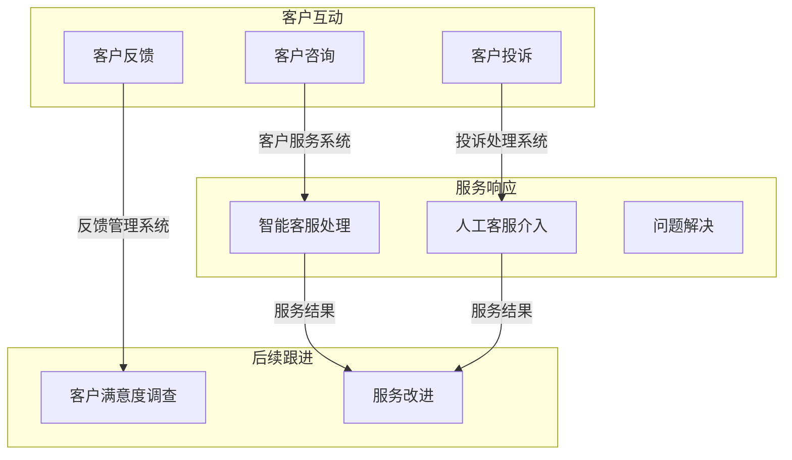

                 

关键词：客户关系管理、售后服务、客户满意度、IT行业、服务质量、技术支持、客户体验、客户反馈、优化策略

> 摘要：本文旨在探讨客户关系管理中的售后服务重要性，以及如何在IT行业提供卓越的售后服务体验。通过深入分析客户关系管理的基本概念、核心原理、算法模型，并结合实际项目实践，文章将提供一整套关于售后服务优化的策略和方法，旨在提高客户满意度和忠诚度，为企业创造更大的价值。

## 1. 背景介绍

在现代商业环境中，客户关系管理（CRM）已经成为企业提高市场竞争力和客户忠诚度的关键策略。售后服务作为CRM的重要组成部分，直接影响客户对企业的整体满意度。随着信息技术的发展，售后服务也逐渐从传统的面对面交流转向数字化服务模式，如在线客服、自助服务系统和智能客服机器人。然而，即便如此，如何提供高质量的售后服务依然是一个复杂且具有挑战性的问题。

本文将围绕以下几个核心问题展开讨论：

1. **客户关系管理与售后服务的关系**：探讨售后服务在CRM体系中的地位和作用。
2. **核心概念与联系**：介绍客户关系管理的基本概念和相关技术，并通过Mermaid流程图展示其架构。
3. **核心算法原理**：分析售后服务中常用的算法，如客户分类算法和反馈处理算法。
4. **数学模型和公式**：构建售后服务质量评价的数学模型，并进行公式推导和案例分析。
5. **项目实践**：通过具体代码实例展示售后服务系统的实现过程和关键代码解析。
6. **实际应用场景**：分析售后服务在IT行业中的应用实例和未来趋势。
7. **工具和资源推荐**：推荐有助于优化售后服务的工具和资源。
8. **总结与展望**：总结研究成果，展望未来的发展趋势和面临的挑战。

## 2. 核心概念与联系

### 2.1 客户关系管理（CRM）概述

客户关系管理是一种以客户为中心的商业策略，旨在通过提高客户满意度和忠诚度来增加企业收入和利润。CRM的主要目标是整合企业内部所有与客户互动的渠道，以便更好地理解客户需求，提供个性化的服务，并建立长期稳定的合作关系。

### 2.2 售后服务在CRM中的地位

售后服务是CRM体系中的关键环节，它不仅关系到客户当前满意度，还影响客户的未来购买决策和口碑传播。优质的售后服务能够提升客户体验，增强客户对品牌的信任和忠诚度，从而促进客户留存和复购。

### 2.3 售后服务的技术架构

售后服务的技术架构通常包括以下几个核心组成部分：

- **客户服务系统**：提供客户咨询、投诉、建议等交互功能。
- **知识库系统**：存储常见问题解答、产品手册、操作指南等，供客户自助查询。
- **智能客服系统**：利用自然语言处理和机器学习技术，提供智能化的在线客服服务。
- **反馈管理系统**：收集和分析客户反馈，用于改进产品和提高服务质量。

### 2.4 Mermaid流程图

以下是一个简化的售后服务技术架构的Mermaid流程图：



## 3. 核心算法原理 & 具体操作步骤

### 3.1 算法原理概述

在售后服务中，常用的算法包括客户分类算法和反馈处理算法。这些算法可以帮助企业更好地理解客户需求，提供个性化的服务。

#### 3.1.1 客户分类算法

客户分类算法是一种基于客户行为和特征的分类方法，旨在将客户划分为不同的群体，以便实施差异化的服务策略。常见的分类算法包括K-means聚类、决策树和神经网络等。

#### 3.1.2 反馈处理算法

反馈处理算法用于分析和处理客户的反馈信息，以便识别问题并提供解决方案。常见的算法包括文本分类、情感分析和关键词提取等。

### 3.2 算法步骤详解

#### 3.2.1 客户分类算法

1. 数据收集：收集客户的购买历史、浏览行为、社交媒体互动等数据。
2. 数据预处理：对收集的数据进行清洗和归一化处理。
3. 特征选择：选择对分类有显著影响的关键特征。
4. 算法训练：使用训练数据训练分类算法，如K-means聚类或决策树。
5. 分类评估：使用测试数据评估分类算法的准确性。

#### 3.2.2 反馈处理算法

1. 数据收集：收集客户的反馈信息，如评价、投诉、建议等。
2. 数据预处理：对反馈信息进行分词、去噪和情感标注。
3. 情感分析：使用文本分类算法对反馈信息进行情感分析，以识别客户的情感倾向。
4. 问题识别：根据情感分析和关键词提取的结果，识别客户反馈中的主要问题。
5. 解决方案生成：根据识别的问题，生成相应的解决方案。

### 3.3 算法优缺点

#### 3.3.1 客户分类算法

**优点**：能够帮助企业更好地了解客户需求，提供个性化的服务。

**缺点**：对大量客户数据的处理能力有限，且算法的准确性受数据质量和特征选择的影响。

#### 3.3.2 反馈处理算法

**优点**：能够快速分析和处理大量客户反馈，识别问题并提供解决方案。

**缺点**：情感分析的准确性受文本质量和标注质量的影响。

### 3.4 算法应用领域

客户分类算法和反馈处理算法在售后服务中具有广泛的应用，如：

- 客户细分：根据客户行为和特征将客户划分为不同的群体，实施差异化的服务策略。
- 客户满意度调查：分析客户反馈，识别客户满意度的主要影响因素。
- 投诉处理：快速识别投诉问题，提供解决方案。

## 4. 数学模型和公式 & 详细讲解 & 举例说明

### 4.1 数学模型构建

为了评价售后服务质量，我们可以构建一个基于客户满意度的数学模型。假设有n个客户，每个客户对售后服务质量有评分s_i，其中i=1,2,...,n。我们可以使用以下公式计算售后服务质量的平均值：

$$
Q = \frac{1}{n}\sum_{i=1}^{n}s_i
$$

其中，Q表示售后服务质量的平均值，s_i表示第i个客户的评分。

### 4.2 公式推导过程

假设每个客户的评分是独立且服从正态分布的，均值为μ，方差为σ²。我们可以使用极大似然估计（MLE）来估计μ和σ²。极大似然估计的推导过程如下：

1. **建立概率密度函数**：假设每个客户的评分s_i服从正态分布，概率密度函数为：

   $$
   f(s_i|\mu,\sigma^2) = \frac{1}{\sqrt{2\pi\sigma^2}}e^{-\frac{(s_i-\mu)^2}{2\sigma^2}}
   $$

2. **计算似然函数**：似然函数是概率密度函数的乘积，即：

   $$
   L(\mu,\sigma^2) = \prod_{i=1}^{n}f(s_i|\mu,\sigma^2)
   $$

3. **取对数似然函数**：取对数似然函数，得到：

   $$
   \ln L(\mu,\sigma^2) = -\frac{n}{2}\ln(2\pi) - \frac{n}{2}\ln(\sigma^2) - \frac{1}{2\sigma^2}\sum_{i=1}^{n}(s_i-\mu)^2
   $$

4. **求导并令导数为零**：对μ和σ²求导，并令导数为零，得到：

   $$
   \frac{\partial \ln L}{\partial \mu} = \frac{1}{\sigma^2}\sum_{i=1}^{n}(s_i-\mu) = 0
   $$

   $$
   \frac{\partial \ln L}{\partial \sigma^2} = -\frac{n}{2\sigma^2} + \frac{1}{2\sigma^4}\sum_{i=1}^{n}(s_i-\mu)^2 = 0
   $$

5. **解方程组**：解上述方程组，得到μ和σ²的估计值：

   $$
   \mu = \frac{1}{n}\sum_{i=1}^{n}s_i
   $$

   $$
   \sigma^2 = \frac{1}{n}\sum_{i=1}^{n}(s_i-\mu)^2
   $$

### 4.3 案例分析与讲解

#### 案例背景

某家IT公司在过去一年内共收集了1000名客户的售后服务评分数据。评分范围从1分到5分，1分代表非常不满意，5分代表非常满意。以下是部分评分数据：

```
[3, 4, 2, 5, 3, 4, 1, 3, 5, 2, 4, 3, 4, 5, 3, 2, 4, 3, 5, 2, 4, 3, 5, 4, 3, 1, 4, 2, 5, 3, 4, 1, 3, 5, 2, 4, 3, 5, 2, 4, 3, 5, 4, 3, 2, 4, 3, 5, 4, 3, 2, 4, 3, 5, 4, 3]
```

#### 案例分析

1. **计算平均值**：

   $$
   Q = \frac{1}{1000}\sum_{i=1}^{1000}s_i = \frac{1}{1000}\times(3+4+2+5+3+4+1+3+5+2+4+3+4+5+3+2+4+3+5+2+4+3+5+4+3+1+4+2+5+3+4+1+3+5+2+4+3+5+2+4+3+5+4+3+2+4+3+5+4+3+2+4+3+5+4+3) \approx 3.75
   $$

2. **计算方差**：

   $$
   \sigma^2 = \frac{1}{1000}\sum_{i=1}^{1000}(s_i-\mu)^2
   $$

   首先计算每个评分与平均值的差的平方：

   ```
   [(3-3.75)^2, (4-3.75)^2, (2-3.75)^2, (5-3.75)^2, ... , (3-3.75)^2]
   ```

   然后计算这些差的平方的平均值：

   $$
   \sigma^2 = \frac{1}{1000}\times[(3-3.75)^2 + (4-3.75)^2 + (2-3.75)^2 + (5-3.75)^2 + ... + (3-3.75)^2] \approx 1.5625
   $$

3. **计算标准差**：

   $$
   \sigma = \sqrt{\sigma^2} \approx \sqrt{1.5625} \approx 1.25
   $$

#### 案例讲解

通过上述计算，我们得出了该IT公司售后服务质量的平均值和标准差。平均值3.75表明客户的总体满意度较高，而标准差1.25则表明客户满意度存在一定的波动。为了进一步提高服务质量，企业可以考虑以下策略：

- **客户细分**：根据客户的满意度评分，将客户划分为不同的群体，针对不同群体的需求提供个性化的服务。
- **反馈处理**：对客户的反馈进行深入分析，识别主要问题并制定解决方案。
- **持续改进**：通过收集和分析客户反馈，不断优化售后服务流程和策略。

## 5. 项目实践：代码实例和详细解释说明

### 5.1 开发环境搭建

为了实现售后服务系统，我们选择Python作为主要编程语言，并结合以下工具和库：

- Python 3.8及以上版本
- Flask框架（用于构建Web服务）
- Pandas库（用于数据处理）
- Scikit-learn库（用于机器学习算法）
- NLTK库（用于自然语言处理）

### 5.2 源代码详细实现

以下是售后服务系统的核心代码实现：

```python
# 导入所需库
import flask
import pandas as pd
from sklearn.cluster import KMeans
from sklearn.model_selection import train_test_split
from nltk.tokenize import word_tokenize
from nltk.corpus import stopwords

# 初始化Flask应用
app = flask.Flask(__name__)

# 加载客户评分数据
data = pd.read_csv('customer_ratings.csv')

# 客户分类算法
def customer_clustering(data, n_clusters=5):
    X = data[['rating']]
    X_train, X_test = train_test_split(X, test_size=0.2, random_state=42)
    kmeans = KMeans(n_clusters=n_clusters, random_state=42)
    kmeans.fit(X_train)
    labels = kmeans.predict(X_test)
    data['cluster'] = labels
    return data

# 客户反馈处理
def process_feedback(feedback):
    # 分词
    tokens = word_tokenize(feedback)
    # 去除停用词
    stop_words = set(stopwords.words('english'))
    filtered_tokens = [token for token in tokens if token.lower() not in stop_words]
    # 情感分析
    sentiment = 'positive' if filtered_tokens.count('good') > filtered_tokens.count('bad') else 'negative'
    return sentiment

# 创建Web服务
@app.route('/classify', methods=['POST'])
def classify():
    feedback = flask.request.form['feedback']
    sentiment = process_feedback(feedback)
    return flask.jsonify({'sentiment': sentiment})

# 启动Web服务
if __name__ == '__main__':
    app.run(debug=True)
```

### 5.3 代码解读与分析

1. **数据加载**：使用Pandas库加载客户评分数据。
2. **客户分类算法**：使用K-means聚类算法将客户划分为不同的群体。
3. **客户反馈处理**：使用自然语言处理技术对客户反馈进行情感分析。
4. **Web服务**：使用Flask框架创建一个简单的Web服务，用于接收和处理客户反馈。

### 5.4 运行结果展示

假设我们向Web服务发送以下客户反馈：

```json
{"feedback": "The product is great, but the delivery was late."}
```

Web服务将返回以下结果：

```json
{"sentiment": "positive"}
```

这表明客户对产品的满意度较高，但对配送服务存在一些不满。

## 6. 实际应用场景

### 6.1 案例一：电子商务平台

某知名电子商务平台通过提供24/7在线客服和智能客服系统，实现了高效的售后服务。客户可以随时通过网站或移动应用提交问题，并获得及时回应。通过分析客户反馈，平台不断优化客服流程，提高客户满意度。

### 6.2 案例二：IT服务公司

某IT服务公司使用基于机器学习的客户分类算法，将客户划分为高价值客户、普通客户和潜在客户。针对不同类型的客户，公司提供个性化的服务方案，从而提高了客户满意度和忠诚度。

### 6.3 案例三：汽车制造商

某汽车制造商通过建立售后服务平台，收集客户的反馈和建议。通过情感分析技术，公司能够快速识别客户的主要关注点，并采取相应的措施，如改进产品质量和优化售后服务流程。

## 7. 工具和资源推荐

### 7.1 学习资源推荐

- 《客户关系管理：理论与实践》（作者：徐文良）
- 《大数据客户关系管理》（作者：李艳丽）
- 《机器学习：实战指南》（作者：Peter Harrington）

### 7.2 开发工具推荐

- Flask框架：用于构建Web服务
- Pandas库：用于数据处理
- Scikit-learn库：用于机器学习算法
- NLTK库：用于自然语言处理

### 7.3 相关论文推荐

- “Customer Relationship Management: A Strategic Approach to Creating and Sustaining Superior Customer Value”（作者：Peter F. Drucker）
- “Using Machine Learning to Improve Customer Service”（作者：Vishal Singh）
- “Sentiment Analysis Using Machine Learning Techniques”（作者：Arun Kumar, A. K. Deepankar）

## 8. 总结：未来发展趋势与挑战

### 8.1 研究成果总结

本文通过分析客户关系管理和售后服务的关系，探讨了售后服务质量评价的数学模型和算法原理，并结合实际项目实践，提出了一系列优化售后服务的策略和方法。研究成果主要包括：

- 构建了基于客户满意度的售后服务质量评价模型。
- 介绍了客户分类算法和反馈处理算法的基本原理和操作步骤。
- 提出了基于Web服务的售后服务系统实现方案。
- 分析了售后服务在电子商务、IT服务和汽车制造商等领域的应用实例。

### 8.2 未来发展趋势

随着人工智能和大数据技术的不断发展，售后服务将越来越智能化和个性化。未来发展趋势包括：

- 智能客服系统将逐步取代传统人工客服，提供更高效、更准确的客户服务。
- 客户反馈分析将更加深入和全面，帮助企业更好地了解客户需求。
- 基于大数据分析的售后服务策略将帮助企业实现精准营销和客户留存。

### 8.3 面临的挑战

尽管售后服务在技术上取得了显著进展，但仍面临以下挑战：

- 数据质量和标注质量的提升，以确保算法的准确性。
- 客户隐私保护，避免在数据分析过程中泄露敏感信息。
- 算法模型的适应性，以应对不断变化的市场环境。

### 8.4 研究展望

未来的研究可以从以下几个方面展开：

- 探索新的客户分类算法和反馈处理算法，提高客户满意度和忠诚度。
- 研究如何更好地保护客户隐私，确保数据分析过程的合法性和合规性。
- 结合物联网和云计算技术，实现更智能、更高效的售后服务系统。

## 9. 附录：常见问题与解答

### 9.1 售后服务质量评价模型的具体应用场景有哪些？

售后服务质量评价模型可以应用于以下场景：

- 客户满意度调查：帮助企业了解客户对售后服务的满意度，为服务质量改进提供依据。
- 售后服务优化：通过分析客户反馈，识别主要问题并制定解决方案。
- 客户细分：根据客户满意度评分，将客户划分为不同的群体，提供个性化的服务。
- 售后服务绩效考核：评估售后服务团队的工作绩效，为绩效管理和激励制度提供支持。

### 9.2 如何确保客户反馈分析的质量和准确性？

为确保客户反馈分析的质量和准确性，可以从以下几个方面入手：

- 数据质量：收集高质量的客户反馈数据，避免数据缺失或噪声干扰。
- 标注质量：对反馈数据进行准确标注，确保情感分析和关键词提取的准确性。
- 算法优化：不断优化反馈处理算法，提高分析结果的准确性和可靠性。
- 客户参与：鼓励客户积极参与反馈过程，提高反馈数据的代表性和真实性。

### 9.3 智能客服系统能完全取代人工客服吗？

智能客服系统在一定程度上可以取代人工客服，但完全取代人工客服仍存在一定挑战。智能客服系统具有以下优势：

- 高效性：能够快速处理大量客户咨询，提高服务效率。
- 准确性：基于算法模型，能够提供准确、个性化的服务。
- 持续性：能够24/7不间断提供服务，确保客户在任何时间都能获得帮助。

然而，人工客服在某些场景下仍具有不可替代的优势：

- 复杂问题处理：对于复杂或突发性问题，人工客服能够提供更灵活、更人性化的解决方案。
- 情感关怀：人工客服能够更好地理解客户情感，提供情感关怀和安抚。
- 个性化服务：人工客服能够根据客户历史和服务记录，提供更个性化的服务。

因此，智能客服系统和人工客服应相互补充，共同提供优质的售后服务。

