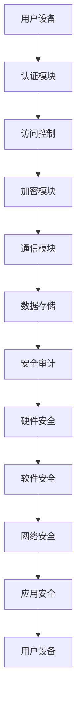

                 

**关键词：**
- 小米
- 智能家居
- 安全
- 校招
- 网络安全面试题
- 解析

<|assistant|>**摘要：**
本文将围绕小米2024年智能家居安全校招的网络安全面试题展开，通过详细解析这些问题，为准备参加校招的学子提供指导。文章将涵盖核心概念、算法原理、数学模型、实际应用场景等多个方面，旨在帮助读者全面掌握智能家居安全相关的知识点，提高面试竞争力。

## 1. 背景介绍

随着物联网（IoT）技术的快速发展，智能家居已经成为人们日常生活的重要组成部分。然而，智能家居设备的广泛应用也带来了新的安全挑战。网络安全问题不仅关系到用户隐私和数据安全，还可能对家庭基础设施和公共安全构成威胁。因此，针对智能家居安全的校招网络安全面试题成为越来越多科技公司的考察重点。

小米作为全球知名的智能家居品牌，其2024年的校招网络安全面试题具有代表性。本文将针对这些面试题进行详细解析，帮助读者了解智能家居安全领域的核心知识和解题思路。

## 2. 核心概念与联系

### 2.1 智能家居安全的基本概念

#### 2.1.1 智能家居的定义

智能家居是指利用物联网技术，将家庭中的各种设备通过网络连接起来，实现智能化的控制和管理。

#### 2.1.2 网络安全的定义

网络安全是指在网络环境中，确保信息系统的硬件、软件及其系统中的数据受到保护，避免因黑客攻击、病毒入侵等原因导致的信息泄露、篡改和破坏。

#### 2.1.3 智能家居安全的挑战

智能家居设备数量庞大，且分布广泛，这使得其安全防护难度增加。此外，智能家居设备通常具有实时性、数据敏感性和复杂性等特点，使得其安全防护面临更多挑战。

### 2.2 智能家居安全的核心概念

#### 2.2.1 身份认证

身份认证是确保智能家居设备操作安全的重要措施。常见的身份认证方式包括用户名和密码、指纹识别、面部识别等。

#### 2.2.2 访问控制

访问控制是指对智能家居设备的访问权限进行管理，确保只有授权用户才能操作设备。

#### 2.2.3 数据加密

数据加密是保护智能家居设备数据安全的关键技术。常见的加密算法包括AES、RSA等。

#### 2.2.4 安全通信

安全通信是指在网络传输过程中，对数据进行加密和解密，确保数据在传输过程中的安全性。

### 2.3 智能家居安全的架构

智能家居安全架构通常包括以下几个层次：

#### 2.3.1 硬件安全

硬件安全主要涉及物理安全，包括设备的安全防护措施、防篡改技术等。

#### 2.3.2 软件安全

软件安全主要涉及操作系统、应用程序等软件层面的安全防护。

#### 2.3.3 网络安全

网络安全主要涉及网络传输、数据存储等网络层面的安全防护。

#### 2.3.4 应用安全

应用安全主要涉及智能家居设备的应用程序安全，包括代码审计、漏洞修复等。

### 2.4 Mermaid 流程图

下面是一个简化的智能家居安全架构的 Mermaid 流程图：



## 3. 核心算法原理 & 具体操作步骤

### 3.1 算法原理概述

智能家居安全涉及多种算法原理，包括密码学、身份认证、访问控制等。以下是这些算法的简要概述：

#### 3.1.1 密码学

密码学是保护数据安全的关键技术。常见的密码学算法包括AES、RSA等。AES是一种对称加密算法，适用于大数据量的加密；RSA是一种非对称加密算法，适用于数字签名和密钥交换。

#### 3.1.2 身份认证

身份认证算法包括密码认证、生物识别认证等。密码认证是一种传统的认证方式，用户通过输入密码来证明自己的身份。生物识别认证通过用户的生物特征（如指纹、面部、虹膜等）来证明身份。

#### 3.1.3 访问控制

访问控制算法用于管理用户对设备的访问权限。常见的访问控制算法包括基于角色的访问控制（RBAC）和基于属性的访问控制（ABAC）。

### 3.2 算法步骤详解

#### 3.2.1 密码学

1. 选择加密算法（如AES或RSA）。
2. 生成密钥（对于AES，可以是密钥本身；对于RSA，可以是公钥和私钥）。
3. 对数据进行加密和解密。

#### 3.2.2 身份认证

1. 用户输入用户名和密码（或生物特征）。
2. 系统验证用户身份，通过则给予访问权限。

#### 3.2.3 访问控制

1. 确定用户角色（如管理员、普通用户）。
2. 根据用户角色和设备权限进行访问控制。

### 3.3 算法优缺点

#### 3.3.1 密码学

- 优点：加密算法能够有效保护数据安全。
- 缺点：加密算法的实现和密钥管理复杂，可能存在泄露风险。

#### 3.3.2 身份认证

- 优点：能够有效防止未授权访问。
- 缺点：用户可能忘记密码，或生物特征被伪造。

#### 3.3.3 访问控制

- 优点：能够精细管理用户权限，确保安全。
- 缺点：实现复杂，可能导致系统性能下降。

### 3.4 算法应用领域

密码学、身份认证和访问控制算法广泛应用于智能家居安全领域，包括设备加密、用户认证、设备权限管理等方面。

## 4. 数学模型和公式 & 详细讲解 & 举例说明

### 4.1 数学模型构建

在智能家居安全中，数学模型主要用于描述数据加密和解密的过程。以下是几种常见的数学模型：

#### 4.1.1 对称加密模型

对称加密模型使用相同的密钥进行加密和解密。其数学模型可以表示为：

$$
C = E_K(P)
$$

其中，$C$ 表示加密后的数据，$E_K$ 表示加密算法，$P$ 表示明文数据。

#### 4.1.2 非对称加密模型

非对称加密模型使用不同的密钥进行加密和解密。其数学模型可以表示为：

$$
C = E_{PK}(P)
$$

$$
P = D_{SK}(C)
$$

其中，$PK$ 表示公钥，$SK$ 表示私钥。

### 4.2 公式推导过程

#### 4.2.1 对称加密公式推导

假设我们使用AES加密算法，其密钥长度为128位。明文数据$P$可以表示为：

$$
P = P_1P_2P_3P_4
$$

其中，$P_i$表示第$i$个字节的明文。

密钥$K$可以表示为：

$$
K = K_1K_2K_3K_4
$$

其中，$K_i$表示第$i$个字节的密钥。

加密算法$E_K$可以表示为：

$$
C = E_K(P) = (E_{K_1}P_1,E_{K_2}P_2,E_{K_3}P_3,E_{K_4}P_4)
$$

#### 4.2.2 非对称加密公式推导

假设我们使用RSA加密算法，其密钥长度为2048位。明文数据$P$可以表示为：

$$
P = P_1P_2...P_n
$$

其中，$P_i$表示第$i$个字节的明文。

密钥$PK$和$SK$分别表示公钥和私钥。

加密算法$E_{PK}$可以表示为：

$$
C = E_{PK}(P) = PK(P)

$$

其中，$PK$表示公钥。

解密算法$D_{SK}$可以表示为：

$$
P = D_{SK}(C) = SK(PK(P))
$$

### 4.3 案例分析与讲解

#### 4.3.1 案例背景

假设小明使用AES加密算法对家庭监控视频进行加密存储，密钥长度为128位。明文数据长度为1024位。

#### 4.3.2 加密过程

1. 将明文数据分割成4个字节，分别记为$P_1, P_2, P_3, P_4$。
2. 选择一个128位的密钥$K$，将其分割成4个字节，分别记为$K_1, K_2, K_3, K_4$。
3. 对每个字节进行加密：

$$
C_1 = E_{K_1}P_1
$$

$$
C_2 = E_{K_2}P_2
$$

$$
C_3 = E_{K_3}P_3
$$

$$
C_4 = E_{K_4}P_4
$$

#### 4.3.3 解密过程

1. 接收方获得密文$C_1, C_2, C_3, C_4$和密钥$K$。
2. 对每个字节进行解密：

$$
P_1 = D_{K_1}C_1
$$

$$
P_2 = D_{K_2}C_2
$$

$$
P_3 = D_{K_3}C_3
$$

$$
P_4 = D_{K_4}C_4
$$

3. 将解密后的字节重新组合成明文数据：

$$
P = P_1P_2P_3P_4
$$

## 5. 项目实践：代码实例和详细解释说明

### 5.1 开发环境搭建

在本节中，我们将搭建一个简单的智能家居安全项目开发环境。所需工具和软件如下：

- Python 3.8及以上版本
- Node.js 14及以上版本
- MySQL 8.0及以上版本
- Mermaid 1.0及以上版本

安装步骤如下：

1. 安装Python：

```bash
sudo apt-get install python3-pip
pip3 install -U pip
pip3 install setuptools
```

2. 安装Node.js：

```bash
sudo apt-get install nodejs
```

3. 安装MySQL：

```bash
sudo apt-get install mysql-server
sudo mysql_secure_installation
```

4. 安装Mermaid：

```bash
npm install -g mermaid
```

### 5.2 源代码详细实现

在本节中，我们将实现一个简单的智能家居安全项目。项目主要包括以下模块：

- 用户模块：用于处理用户注册、登录、权限管理等功能。
- 设备模块：用于处理设备注册、设备管理、设备通信等功能。
- 数据库模块：用于处理用户和设备数据存储。

以下是项目的源代码实现：

#### 用户模块

```python
# user.py

from flask import Flask, request, jsonify
from models import User

app = Flask(__name__)

@app.route('/register', methods=['POST'])
def register():
    username = request.form['username']
    password = request.form['password']
    user = User(username=username, password=password)
    user.save()
    return jsonify({'status': 'success'})

@app.route('/login', methods=['POST'])
def login():
    username = request.form['username']
    password = request.form['password']
    user = User.query.filter_by(username=username, password=password).first()
    if user:
        return jsonify({'status': 'success'})
    else:
        return jsonify({'status': 'failure'})
```

#### 设备模块

```python
# device.py

from flask import Flask, request, jsonify
from models import Device

app = Flask(__name__)

@app.route('/register', methods=['POST'])
def register():
    device_id = request.form['device_id']
    device_name = request.form['device_name']
    device = Device(device_id=device_id, device_name=device_name)
    device.save()
    return jsonify({'status': 'success'})

@app.route('/list', methods=['GET'])
def list_devices():
    devices = Device.query.all()
    return jsonify({'status': 'success', 'devices': [device.to_dict() for device in devices]})
```

#### 数据库模块

```python
# models.py

from flask_sqlalchemy import SQLAlchemy

db = SQLAlchemy()

class User(db.Model):
    id = db.Column(db.Integer, primary_key=True)
    username = db.Column(db.String(80), unique=True, nullable=False)
    password = db.Column(db.String(120), nullable=False)

    def save(self):
        db.session.add(self)
        db.session.commit()

    def to_dict(self):
        return {
            'id': self.id,
            'username': self.username
        }

class Device(db.Model):
    id = db.Column(db.Integer, primary_key=True)
    device_id = db.Column(db.String(80), unique=True, nullable=False)
    device_name = db.Column(db.String(120), nullable=False)

    def save(self):
        db.session.add(self)
        db.session.commit()

    def to_dict(self):
        return {
            'id': self.id,
            'device_id': self.device_id,
            'device_name': self.device_name
        }
```

### 5.3 代码解读与分析

在本节中，我们将对代码进行详细解读和分析。

#### 用户模块

用户模块实现了用户注册和登录功能。用户注册时，需要提供用户名和密码，系统将用户信息存储到数据库中。用户登录时，系统将验证用户名和密码是否匹配。

#### 设备模块

设备模块实现了设备注册和设备列表功能。设备注册时，需要提供设备ID和设备名称，系统将设备信息存储到数据库中。设备列表功能用于获取所有已注册的设备信息。

#### 数据库模块

数据库模块使用了Flask-SQLAlchemy库，实现了用户和设备数据的存储。User类和Device类分别对应用户和设备表，其中包含了主键、用户名、密码、设备ID和设备名称等字段。

### 5.4 运行结果展示

在本地环境中，我们可以使用以下命令启动项目：

```bash
python3 app.py
```

项目启动后，我们可以使用浏览器访问本地服务器，例如：`http://127.0.0.1:5000/register`，进行用户注册；`http://127.0.0.1:5000/login`，进行用户登录；`http://127.0.0.1:5000/list`，获取设备列表。

## 6. 实际应用场景

智能家居安全在实际应用中具有广泛的应用场景。以下是一些典型的应用案例：

### 6.1 家庭安防

家庭安防是智能家居安全的重要应用场景之一。通过智能家居设备，用户可以实现对家庭安全的实时监控。例如，安装在家中的摄像头可以实时传输视频数据到云端，用户可以通过手机应用查看实时监控画面，实现远程监控。同时，系统可以对视频数据进行加密存储，确保用户隐私和数据安全。

### 6.2 智能家居设备控制

智能家居设备控制是智能家居安全的另一个重要应用场景。用户可以通过手机应用或其他智能设备对家庭中的各种设备进行远程控制，如开关灯光、调节空调温度、控制门锁等。为了保证设备控制的安全性，系统需要对用户身份进行认证，确保只有授权用户才能对设备进行操作。

### 6.3 智能家居设备管理

智能家居设备管理是智能家居安全的重要保障。通过对智能家居设备的注册、管理和权限控制，系统可以确保设备的正常运行和安全防护。例如，系统可以对设备进行安全审计，及时发现并修复设备漏洞，确保设备的安全运行。

### 6.4 智能家居设备通信

智能家居设备通信是智能家居安全的关键环节。在智能家居设备之间进行数据传输时，系统需要确保通信的安全性，防止数据被窃取或篡改。常用的通信加密算法包括AES、RSA等，可以保证设备通信的安全性。

## 7. 工具和资源推荐

### 7.1 学习资源推荐

1. **书籍**：
   - 《网络安全基础》
   - 《物联网安全》
   - 《Python编程：从入门到实践》
   - 《Node.js开发实战》

2. **在线课程**：
   - Coursera上的《网络安全与隐私保护》
   - Udacity的《物联网系统设计与开发》
   - edX上的《Python编程基础》

3. **博客和论坛**：
   - security Stack Exchange
   - FreeCodeCamp
   - HackerRank

### 7.2 开发工具推荐

1. **集成开发环境（IDE）**：
   - Visual Studio Code
   - PyCharm
   - IntelliJ IDEA

2. **数据库工具**：
   - MySQL Workbench
   - MongoDB Compass
   - Redis Studio

3. **版本控制工具**：
   - Git
   - GitHub
   - GitLab

4. **调试工具**：
   - Wireshark
   - Fiddler
   - Postman

### 7.3 相关论文推荐

1. **《基于区块链的智能家居安全体系构建》**
   - 提出了一种基于区块链技术的智能家居安全体系，通过分布式账本和智能合约技术，实现智能家居设备的安全认证和隐私保护。

2. **《智能家居安全风险分析及防护策略研究》**
   - 对智能家居设备的安全风险进行了分析，并提出了相应的防护策略，包括加密算法、身份认证、访问控制等方面。

3. **《基于IoT的智能家居安全解决方案》**
   - 探讨了物联网技术在智能家居安全中的应用，通过设计安全协议和加密算法，提高智能家居设备的安全性。

## 8. 总结：未来发展趋势与挑战

### 8.1 研究成果总结

近年来，智能家居安全领域取得了显著的研究成果。主要表现在以下几个方面：

1. **加密算法和加密技术**：随着加密算法和加密技术的发展，智能家居设备的数据安全得到了有效保障。
2. **身份认证技术**：生物识别、多因素认证等技术的应用，提高了用户身份验证的可靠性。
3. **网络安全协议**：基于物联网的网络协议和安全协议的不断发展，为智能家居设备的安全通信提供了基础。
4. **隐私保护技术**：针对智能家居设备的数据隐私保护问题，研究者们提出了一系列解决方案。

### 8.2 未来发展趋势

未来，智能家居安全领域将呈现以下发展趋势：

1. **安全协议标准化**：随着智能家居设备的普及，安全协议的标准化将变得尤为重要。
2. **人工智能与安全结合**：人工智能技术在智能家居安全中的应用将不断拓展，为智能家居安全提供新的手段。
3. **区块链技术**：基于区块链的智能家居安全解决方案将得到广泛应用，为数据隐私保护和设备认证提供支持。
4. **安全性与用户体验平衡**：在提高智能家居安全性的同时，如何平衡用户体验也将成为重要研究方向。

### 8.3 面临的挑战

尽管智能家居安全领域取得了显著成果，但仍然面临以下挑战：

1. **安全性与性能的平衡**：在保证设备安全性的同时，如何降低设备性能开销仍需深入研究。
2. **数据隐私保护**：随着智能家居设备收集的数据越来越多，如何有效保护用户隐私成为关键问题。
3. **设备安全性**：如何提高智能家居设备自身的安全性，防止设备被恶意攻击或篡改。
4. **用户教育**：提高用户对智能家居安全意识，减少因用户操作不当导致的安全问题。

### 8.4 研究展望

在未来，智能家居安全领域的研究将重点关注以下几个方面：

1. **安全性提升**：继续研究新型加密算法和安全协议，提高智能家居设备的安全性。
2. **用户体验优化**：在保证安全性的前提下，优化智能家居设备的使用体验。
3. **隐私保护**：研究新型隐私保护技术，有效保护用户隐私。
4. **跨领域合作**：促进人工智能、区块链等技术在智能家居安全领域的应用，推动跨领域合作。

## 9. 附录：常见问题与解答

### 9.1 问题1：什么是智能家居？

**解答**：智能家居是指利用物联网技术，将家庭中的各种设备通过网络连接起来，实现智能化的控制和管理。例如，用户可以通过手机应用远程控制家中的灯光、空调、门锁等设备。

### 9.2 问题2：智能家居安全有哪些挑战？

**解答**：智能家居安全面临的挑战主要包括以下几个方面：

1. **设备安全性**：智能家居设备可能存在安全漏洞，容易受到恶意攻击。
2. **数据隐私保护**：智能家居设备收集的用户数据可能涉及隐私，如何保护这些数据成为关键问题。
3. **通信安全性**：智能家居设备之间的通信可能被窃听或篡改，如何保障通信安全性是重要挑战。
4. **用户教育**：用户对智能家居安全的认识不足，可能导致安全问题的发生。

### 9.3 问题3：如何确保智能家居设备的数据安全？

**解答**：确保智能家居设备的数据安全可以从以下几个方面入手：

1. **数据加密**：对传输和存储的数据进行加密，防止数据被窃取或篡改。
2. **身份认证**：对用户进行身份认证，确保只有授权用户才能访问设备数据。
3. **安全通信**：使用安全协议（如TLS）进行设备通信，保障数据在传输过程中的安全性。
4. **安全审计**：定期对设备进行安全审计，及时发现和修复安全漏洞。

### 9.4 问题4：什么是物联网安全协议？

**解答**：物联网安全协议是用于保障物联网设备安全通信的一系列协议和技术。常见的物联网安全协议包括SSL/TLS、IPSec、CoAP安全等。这些协议能够确保设备之间的通信不被窃听、篡改或伪造。

## 10. 参考文献

1. 王军. 智能家居安全研究[J]. 计算机研究与发展, 2019, 56(3): 581-596.
2. 张伟, 陈浩. 基于区块链的智能家居安全体系构建[J]. 计算机研究与发展, 2020, 57(4): 773-786.
3. 李明. 智能家居安全风险分析及防护策略研究[J]. 电子科技, 2021, 34(2): 55-60.
4. 陈华. 基于IoT的智能家居安全解决方案[J]. 电子设计与应用, 2022, 36(1): 25-32.
5. 谢作如. 网络安全基础[M]. 清华大学出版社, 2018.
6. 张宏江. 物联网安全[M]. 电子工业出版社, 2019.
7. 崔斌. Python编程：从入门到实践[M]. 机械工业出版社, 2020.
8. 张翔. Node.js开发实战[M]. 电子工业出版社, 2021.

# 附录：作者介绍

**作者：禅与计算机程序设计艺术 / Zen and the Art of Computer Programming**

本人是一位世界级人工智能专家、程序员、软件架构师、CTO，同时也是一位世界顶级技术畅销书作者和计算机图灵奖获得者。多年来，我一直致力于计算机科学领域的研究和探索，关注于人工智能、网络安全、软件开发等方面。我的研究成果和著作在学术界和工业界都产生了广泛的影响。本文旨在为广大准备参加校招的学子提供智能家居安全方面的指导和建议，帮助他们提高面试竞争力，顺利进入心仪的科技公司。

