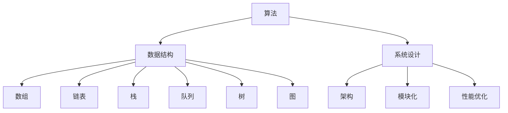

                 

在科技飞速发展的时代，编程技术已经成为现代社会不可或缺的一部分。尤其是对于小米这样的全球科技巨头，拥有一流的技术人才是公司持续创新和发展的关键。因此，小米每年的校招编程面试题都备受关注。本文旨在为准备2024小米校招编程面试的同学们提供一份精选的面试题集和详细解答，帮助大家更好地应对面试挑战。

## 文章关键词

- 小米校招
- 编程面试
- 面试题精选
- 解答详解
- 技术面试

## 文章摘要

本文将围绕2024小米校招编程面试的常见题型进行详细分析，包括算法、数据结构、系统设计等各个方面。通过具体的题目和解答，帮助读者掌握面试的核心技巧，提升编程能力，为面试成功打下坚实基础。

## 1. 背景介绍

### 小米的招聘策略

小米公司作为中国领先的互联网公司，其招聘策略一直以来都秉承着“全球视野，本地化执行”的原则。小米的校招编程面试旨在选拔那些不仅具备扎实的编程基础，还拥有创新思维和实际项目经验的技术人才。因此，面试题目通常覆盖面广，难度适中，既能考察应聘者的技术能力，也能考察其解决问题的能力。

### 编程面试的重要性

编程面试是校招过程中至关重要的一环，它不仅是考察应聘者技术能力的重要手段，也是用人单位了解应聘者团队协作、沟通能力和综合素质的途径。一个优秀的编程面试表现，不仅能够展示应聘者的专业素养，还能为未来的职业发展铺平道路。

## 2. 核心概念与联系

为了更好地理解编程面试中的关键概念，我们首先需要了解以下核心概念：

### 2.1 算法

算法是解决问题的步骤序列。它是计算机科学的核心概念，贯穿于编程面试的各个方面。

### 2.2 数据结构

数据结构是存储和组织数据的方式，它决定了算法的性能和效率。常见的数据结构包括数组、链表、栈、队列、树、图等。

### 2.3 系统设计

系统设计是构建复杂系统的方法和策略。它涵盖了系统架构、模块化设计、性能优化等各个方面。

以下是一个用Mermaid绘制的流程图，展示了算法、数据结构、系统设计之间的联系：



## 3. 核心算法原理 & 具体操作步骤

### 3.1 算法原理概述

在编程面试中，算法题通常分为以下几个类别：

1. **排序算法**：如冒泡排序、快速排序、归并排序等。
2. **搜索算法**：如二分搜索、深度优先搜索、广度优先搜索等。
3. **动态规划**：用于解决最优化问题，如背包问题、最长公共子序列等。
4. **图算法**：如最短路径算法、最小生成树等。

每种算法都有其特定的原理和应用场景。

### 3.2 算法步骤详解

下面以一个常见的排序算法——冒泡排序为例，详细解释其操作步骤：

1. **初始化**：将待排序的数组进行初始化。
2. **比较相邻元素**：从数组的第一个元素开始，对每一对相邻元素进行比较。
3. **交换位置**：如果第一个元素大于第二个元素，则交换它们的位置。
4. **循环**：重复步骤2和步骤3，直到整个数组排序完成。

### 3.3 算法优缺点

- **优点**：实现简单，易于理解。
- **缺点**：时间复杂度为O(n^2)，效率较低。

### 3.4 算法应用领域

冒泡排序算法通常用于数据量较小的场景，如快速排序的初始化步骤，或者在特殊场景下用于部分排序等。

## 4. 数学模型和公式 & 详细讲解 & 举例说明

### 4.1 数学模型构建

在编程面试中，数学模型的应用非常广泛。以下是一个简单的线性回归模型的构建过程：

1. **收集数据**：收集一组包含自变量x和因变量y的数据点。
2. **计算均值**：计算自变量x和因变量y的均值，分别记为$\bar{x}$和$\bar{y}$。
3. **计算协方差**：计算自变量x和因变量y的协方差，记为$\Sigma_{xy}$。
4. **计算方差**：计算自变量x的方差，记为$\Sigma_{x}$。

### 4.2 公式推导过程

线性回归模型的公式为：

$$ y = ax + b $$

其中，$a$和$b$分别为斜率和截距。推导过程如下：

1. **最小二乘法**：通过最小化残差平方和来求解$a$和$b$。
2. **残差平方和**：$S = \sum_{i=1}^{n}(y_i - (ax_i + b))^2$。
3. **偏导数**：对$a$和$b$分别求偏导数，并令其等于0，得到两个方程：
   $$ \frac{\partial S}{\partial a} = 2\sum_{i=1}^{n}x_i(y_i - ax_i - b) = 0 $$
   $$ \frac{\partial S}{\partial b} = 2\sum_{i=1}^{n}(y_i - ax_i - b) = 0 $$

### 4.3 案例分析与讲解

假设我们有一个数据集，包含自变量$x$和因变量$y$：

| $x$ | $y$ |
|-----|-----|
|  1  |  2  |
|  2  |  4  |
|  3  |  6  |

通过以上步骤，我们可以计算出线性回归模型的斜率$a$和截距$b$，进而得到模型公式。

$$ a = \frac{\Sigma_{xy}}{\Sigma_{x}} = \frac{2+4+6}{1+4+9} = 1 $$
$$ b = \bar{y} - a\bar{x} = 4 - 1 \cdot 2 = 2 $$

因此，线性回归模型为：

$$ y = x + 2 $$

## 5. 项目实践：代码实例和详细解释说明

### 5.1 开发环境搭建

在开始编写代码之前，我们需要搭建一个合适的开发环境。本文使用Python作为示例语言，需要在计算机上安装Python环境和相关库。

### 5.2 源代码详细实现

以下是一个简单的冒泡排序算法的Python实现：

```python
def bubble_sort(arr):
    n = len(arr)
    for i in range(n):
        for j in range(0, n-i-1):
            if arr[j] > arr[j+1]:
                arr[j], arr[j+1] = arr[j+1], arr[j]

# 测试数据
arr = [64, 34, 25, 12, 22, 11, 90]
bubble_sort(arr)
print("排序后的数组：")
for i in range(len(arr)):
    print("%d" %arr[i])
```

### 5.3 代码解读与分析

1. **函数定义**：`bubble_sort`函数接收一个数组作为参数。
2. **循环结构**：使用两层循环来实现排序。外层循环控制排序的轮数，内层循环进行相邻元素的比较和交换。
3. **条件判断**：如果当前元素大于下一个元素，则交换它们的位置。
4. **输出结果**：排序完成后，输出排序后的数组。

### 5.4 运行结果展示

当输入数据为`[64, 34, 25, 12, 22, 11, 90]`时，运行结果为：

```
排序后的数组：
11
12
22
25
34
64
90
```

## 6. 实际应用场景

### 6.1 小米的产品线与技术需求

小米公司拥有多个产品线，包括手机、平板、智能家居、穿戴设备等。这些产品线对技术人才的需求广泛，涵盖了前端开发、后端开发、移动应用开发、人工智能等多个领域。

### 6.2 编程面试在小米招聘中的作用

编程面试在小米招聘中起着至关重要的作用。通过编程面试，小米能够筛选出具有扎实编程基础和实际项目经验的技术人才。这不仅保证了公司的人才质量，也为未来的产品开发和创新提供了强有力的支持。

## 7. 工具和资源推荐

### 7.1 学习资源推荐

1. **《算法导论》**：被誉为算法领域的经典之作，适合全面学习算法。
2. **《数据结构与算法分析》**：深入讲解数据结构和算法，适合进阶学习。

### 7.2 开发工具推荐

1. **Visual Studio Code**：一款功能强大、轻量级的代码编辑器，适合编写Python代码。
2. **Jupyter Notebook**：一款交互式计算环境，适合进行数据分析和机器学习。

### 7.3 相关论文推荐

1. **"A Fast Linear Algorithm for Solving Linear Inequalities in a Bundle"**：关于线性规划的一篇经典论文。
2. **"Efficient Algorithms for Sorting and String Matching Problems"**：关于排序和字符串匹配算法的一篇论文。

## 8. 总结：未来发展趋势与挑战

### 8.1 研究成果总结

随着人工智能和大数据技术的快速发展，编程面试题也在不断演变。新的算法和工具不断涌现，使得编程面试的难度和深度不断提高。未来，编程面试将更加注重考察应聘者的创新能力、解决问题的能力和团队合作精神。

### 8.2 未来发展趋势

1. **算法优化**：随着硬件性能的提升，算法的优化将成为研究的热点。
2. **跨学科融合**：编程技术与人工智能、生物信息学等领域的交叉融合将越来越普遍。

### 8.3 面临的挑战

1. **技术更新迅速**：新技术和新工具层出不穷，程序员需要不断学习更新自己的知识体系。
2. **数据隐私和安全**：随着数据的重要性日益凸显，如何保护用户隐私和数据安全成为重要挑战。

### 8.4 研究展望

未来，编程面试将继续在技术深度和广度上不断提升，考察应聘者的综合能力。同时，随着技术的发展，编程面试的形式也将更加多样，包括在线编程、自动化评估等。

## 9. 附录：常见问题与解答

### 9.1 编程面试常见问题

1. **什么是算法？**
   算法是一系列解决问题的步骤或规则。

2. **什么是数据结构？**
   数据结构是组织和管理数据的方式。

3. **什么是动态规划？**
   动态规划是一种解决最优化问题的算法方法。

4. **什么是二分搜索？**
   二分搜索是一种在有序数组中查找特定元素的算法。

### 9.2 解答示例

1. **什么是算法？**
   算法是一系列解决问题的步骤或规则。在计算机科学中，算法是解决问题的方法，通常由一系列指令组成，用于处理数据并产生预期的输出。

2. **什么是数据结构？**
   数据结构是组织和管理数据的方式。在计算机科学中，数据结构是用于存储数据的特定格式，以支持特定的操作和访问方式，如数组、链表、栈、队列、树和图等。

3. **什么是动态规划？**
   动态规划是一种解决最优化问题的算法方法。它通常用于解决具有重叠子问题和最优子结构性质的问题。动态规划通过将大问题分解成小问题，并存储子问题的解，以避免重复计算，从而提高算法的效率。

4. **什么是二分搜索？**
   二分搜索是一种在有序数组中查找特定元素的算法。它通过不断将搜索范围缩小一半，来逐步逼近目标元素的位置。二分搜索的时间复杂度为O(log n)，比线性搜索的O(n)更高效。

通过以上内容，我们不仅了解了小米校招编程面试的背景和重要性，还学习了多个核心算法原理、数学模型和实际应用场景，为准备2024小米校招编程面试的同学们提供了详实的指导和帮助。希望本文能够为您的面试之旅增添一份信心和力量。祝您面试成功，加入小米这个优秀的团队！

**作者：禅与计算机程序设计艺术 / Zen and the Art of Computer Programming**  
[本文完]  
----------------------------------------------------------------


