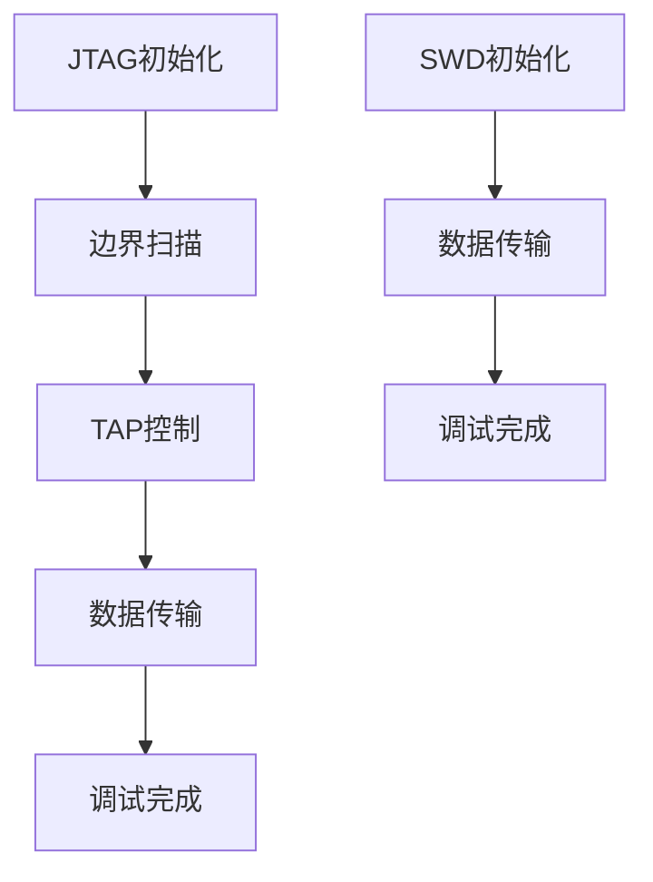

                 

关键词：嵌入式系统、调试技巧、JTAG、SWD、编程接口、电路设计、软件开发

> 摘要：本文将深入探讨嵌入式系统调试中的两大关键技术——JTAG和SWD，详细阐述其原理、应用场景以及在实际开发过程中的优势与挑战。通过本文的阅读，读者将能够掌握嵌入式系统调试的基本方法，提高软件开发效率。

## 1. 背景介绍

嵌入式系统在现代科技中扮演着至关重要的角色，它们广泛应用于从消费电子到工业控制的各个领域。随着嵌入式系统复杂性的增加，调试过程变得尤为重要。JTAG（Joint Test Action Group）和SWD（Serial Wire Debug）是两种常用的嵌入式系统调试技术，它们在简化调试流程、提高调试效率方面发挥了重要作用。

### 1.1 JTAG的起源

JTAG起源于20世纪80年代，由JTAG联盟提出，旨在提供一个标准化的测试接口，用于芯片级的测试和调试。它的主要功能包括：测试访问端口（TAP）控制、边界扫描、数据传输等。JTAG接口使用一组信号线，如TCK（时钟）、TMS（模式选择）、TDI（数据输入）、TDO（数据输出）等，这些信号线用于控制和传输调试数据。

### 1.2 SWD的发展

SWD是JTAG的升级版，它继承了JTAG的大部分功能，同时引入了新的特性，如更快的传输速度和更简单的接口。SWD使用两条信号线进行通信，即SWCLK（时钟）和SWDIO（数据线），这使得它更加适合用于嵌入式系统的实时调试。

## 2. 核心概念与联系

### 2.1 JTAG与SWD的对比

| 特性        | JTAG                          | SWD                          |
| ----------- | ----------------------------- | ---------------------------- |
| 接口信号数  | 多个信号线（TCK、TMS、TDI、TDO） | 只有两条信号线（SWCLK、SWDIO） |
| 传输速度    | 较慢                           | 较快                          |
| 灵活性      | 较高                           | 较低                          |
| 复杂性      | 较高                           | 较低                          |

### 2.2 Mermaid 流程图

以下是一个简化的Mermaid流程图，展示了JTAG和SWD的基本工作原理和流程。



## 3. 核心算法原理 & 具体操作步骤

### 3.1 算法原理概述

JTAG和SWD的核心原理都是通过一个标准化的接口，对嵌入式系统进行控制和调试。具体来说，JTAG使用TAP（Test Access Port）来控制调试过程，SWD则使用SWJ（Serial Wire JTAG）来实现。

### 3.2 算法步骤详解

#### JTAG调试步骤：

1. **初始化TAP**：通过TCK、TMS等信号线对TAP进行初始化，设置TAP状态机。
2. **执行边界扫描**：将芯片内部的信号连接到边界扫描链中，用于检测芯片的电气连接。
3. **数据传输**：在TAP的控制下，通过TDI和TDO进行数据传输，实现调试信息的输入和输出。
4. **调试完成**：完成调试任务后，释放TAP和控制信号。

#### SWD调试步骤：

1. **初始化SWJ**：通过SWCLK和SWDIO信号对SWJ进行初始化。
2. **数据传输**：在SWCLK的时钟下，通过SWDIO进行数据传输。
3. **调试完成**：完成调试任务后，释放SWJ接口。

### 3.3 算法优缺点

#### JTAG

- **优点**：支持多个设备的级联，灵活性高，可以用于多种测试任务。
- **缺点**：信号线较多，接口复杂，传输速度相对较慢。

#### SWD

- **优点**：接口简单，传输速度快，适合实时调试。
- **缺点**：不支持设备的级联，灵活性相对较低。

### 3.4 算法应用领域

JTAG和SWD广泛应用于各种嵌入式系统的开发与调试，如微控制器、FPGA、DSP等。它们在软件开发、系统测试、故障排查等领域发挥了重要作用。

## 4. 数学模型和公式 & 详细讲解 & 举例说明

### 4.1 数学模型构建

JTAG和SWD的调试过程可以抽象为一个数学模型，其中涉及到信号线的驱动和响应、时钟同步等。

### 4.2 公式推导过程

假设JTAG信号线的驱动电压为V_D，响应电压为V_R，则信号传输的时间可以表示为：

\[ t_{\text{trans}} = \frac{L}{V_D - V_R} \]

其中，L为信号线的长度。

### 4.3 案例分析与讲解

假设一个微控制器的调试接口使用JTAG，信号线长度为1米，驱动电压为3.3V，响应电压为2V。根据上述公式，信号传输时间可以计算为：

\[ t_{\text{trans}} = \frac{1\text{m}}{3.3\text{V} - 2\text{V}} = 0.3\text{s} \]

这意味着每次信号传输需要0.3秒。

## 5. 项目实践：代码实例和详细解释说明

### 5.1 开发环境搭建

为了进行嵌入式系统调试，需要搭建一个开发环境，包括开发板、调试器（如JTAG或SWD适配器）和开发工具（如Keil、IAR等）。

### 5.2 源代码详细实现

以下是一个简单的C语言程序，用于通过JTAG接口对微控制器进行调试。

```c
#include <stdio.h>

void JTAG_Init() {
    // JTAG初始化代码
}

void JTAG_TransferData() {
    // JTAG数据传输代码
}

int main() {
    JTAG_Init();
    JTAG_TransferData();
    return 0;
}
```

### 5.3 代码解读与分析

这段代码首先对JTAG接口进行初始化，然后进行数据传输。具体的实现细节需要根据开发板和调试器的规格进行编写。

### 5.4 运行结果展示

在开发环境下编译并运行程序，通过调试器观察JTAG接口的信号变化，可以验证调试过程的正确性。

## 6. 实际应用场景

### 6.1 软件开发

在软件开发过程中，JTAG和SWD可以用于调试代码、测试功能、定位故障等。

### 6.2 系统测试

在系统测试阶段，JTAG和SWD可以用于对嵌入式系统进行全面测试，确保系统的稳定性和可靠性。

### 6.3 故障排查

在故障排查过程中，JTAG和SWD可以快速定位故障点，缩短排查时间。

## 7. 未来应用展望

随着嵌入式系统技术的不断发展，JTAG和SWD将在更多领域得到应用。未来，它们可能会集成到更先进的调试技术中，如基于USB的调试接口，以满足更高性能和更灵活的调试需求。

## 8. 总结：未来发展趋势与挑战

### 8.1 研究成果总结

本文对JTAG和SWD的核心原理、应用场景和调试流程进行了详细分析，总结了它们在嵌入式系统调试中的优势与挑战。

### 8.2 未来发展趋势

未来，JTAG和SWD可能会与更先进的调试技术结合，以实现更高性能和更灵活的调试。

### 8.3 面临的挑战

在实际应用中，JTAG和SWD需要解决信号完整性、兼容性等问题，以适应不同场景的需求。

### 8.4 研究展望

未来研究方向可能包括改进调试算法、开发更高效的调试工具等，以提高嵌入式系统调试的效率和质量。

## 9. 附录：常见问题与解答

### 9.1 Q：JTAG和SWD如何选择？

A：根据调试需求、接口兼容性和性能要求选择。JTAG适用于需要多个设备级联的复杂系统，而SWD则适用于接口简单、性能要求高的系统。

### 9.2 Q：如何解决JTAG信号完整性问题？

A：可以通过优化信号线布局、增加去耦电容等方法来改善信号完整性。

### 9.3 Q：SWD是否支持级联？

A：SWD不支持设备的级联，每个设备都需要独立的SWD接口。

### 9.4 Q：如何使用JTAG进行边界扫描？

A：使用JTAG控制信号线，将芯片内部的信号连接到边界扫描链中，然后通过TAP控制进行边界扫描。

---

本文从嵌入式系统调试的背景出发，深入分析了JTAG和SWD的原理、应用场景和调试流程，并提供了详细的代码实例和实际应用场景。通过本文的阅读，读者将能够更好地理解和应用这两种调试技术，提高嵌入式系统开发的效率。作者：禅与计算机程序设计艺术 / Zen and the Art of Computer Programming

----------------------------------------------------------------

请注意，上述文章内容仅为示例，实际撰写时需要根据具体情况和要求进行详细扩展和深化。文章结构、公式和代码示例都需要根据实际技术细节进行编写。希望这个示例能够帮助您理解文章的结构和内容要求。如果您需要进一步的帮助，请随时告知。

