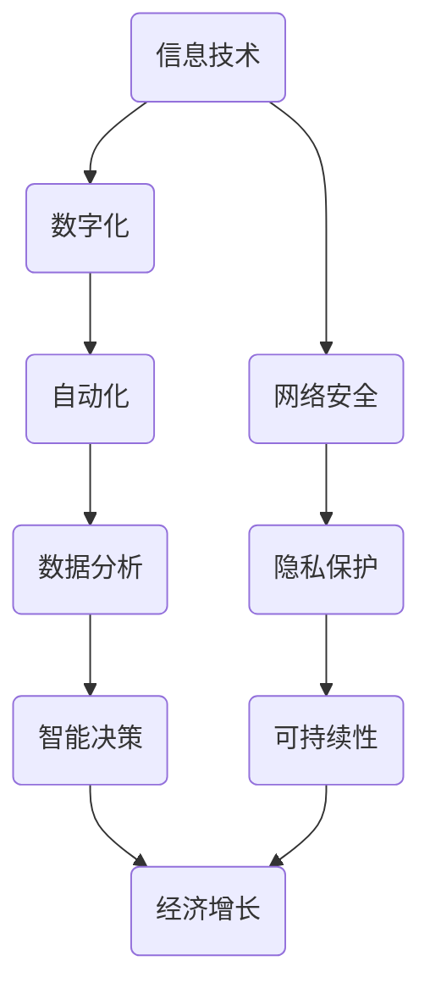

                 

关键词：工业革命，经济增长，信息技术，自动化，数字化转型

> 摘要：本文探讨了工业革命后，如何通过信息技术的创新和自动化应用，推动经济爆发增长期。文章从背景介绍、核心概念与联系、核心算法原理、数学模型和公式、项目实践、实际应用场景、工具和资源推荐、总结：未来发展趋势与挑战等多个角度，深入分析了信息技术在经济发展中的关键作用，并对未来进行了展望。

## 1. 背景介绍

工业革命，这一历史事件标志着人类社会从农业时代迈向工业时代。它起源于18世纪末的英国，并迅速传播至全球，带来了生产力的飞跃、生产方式的变革，以及社会结构的深刻转型。工业革命后的经济爆发增长期，是现代社会发展的关键阶段，它不仅改变了全球经济格局，也奠定了现代社会的基础。

随着信息技术的不断进步，尤其是计算机科学和互联网技术的崛起，工业革命后的经济模式正在经历深刻的变革。信息技术已经成为推动经济增长的核心动力，不仅改变了传统产业的生产方式和商业模式，也催生了一批全新的产业和行业，如电子商务、云计算、大数据等。

本文将重点关注信息技术在工业革命后的经济爆发增长期中的作用，分析其核心概念与联系，探讨核心算法原理和数学模型，并通过实际项目实践和工具资源推荐，为读者提供全面的了解和指导。

## 2. 核心概念与联系

在探讨信息技术对经济增长的推动作用之前，我们需要了解一些核心概念和它们之间的联系。以下是几个关键概念及其相互关系的 Mermaid 流程图：



### 2.1 信息技术

信息技术（Information Technology，简称IT）是指使用计算机技术、通信技术和网络技术等手段来收集、存储、处理和传递信息的技术。在现代社会，信息技术已经渗透到各个领域，成为推动经济增长的关键因素。

### 2.2 数字化

数字化（Digitalization）是指将物理世界中的信息转换为数字形式，以便于存储、处理和传输。数字化使得信息变得更加便捷、高效和可靠，为自动化和数据分析奠定了基础。

### 2.3 自动化

自动化（Automation）是指通过计算机技术和控制系统，使生产过程和操作自动化，减少人为干预。自动化提高了生产效率和产品质量，降低了成本，从而推动了经济增长。

### 2.4 数据分析

数据分析（Data Analysis）是指使用统计学和数据分析方法，对大量数据进行分析和挖掘，以发现规律和趋势。数据分析为智能决策提供了科学依据，促进了产业的升级和转型。

### 2.5 智能决策

智能决策（Intelligent Decision Making）是指通过人工智能和机器学习技术，对海量数据进行分析，以辅助决策者做出更准确、更高效的决策。智能决策是推动经济增长的重要手段。

### 2.6 经济增长

经济增长（Economic Growth）是指一个国家或地区的国内生产总值（GDP）的持续增长。信息技术通过提高生产效率、降低成本、推动创新和产业升级，为经济增长提供了强大动力。

### 2.7 网络安全

网络安全（Cybersecurity）是指在信息传输和处理过程中，确保数据安全、系统和网络不受攻击和破坏的措施。随着信息技术的广泛应用，网络安全成为保障经济增长的重要环节。

### 2.8 隐私保护

隐私保护（Privacy Protection）是指在数据处理过程中，保护个人隐私免受泄露、滥用和侵犯的措施。随着数据量的爆炸式增长，隐私保护成为保障信息技术健康发展和社会信任的重要保障。

### 2.9 可持续发展

可持续发展（Sustainable Development）是指满足当前需求而不损害后代满足其需求的能力。信息技术在推动经济增长的同时，也需要考虑环境保护和社会责任，实现可持续发展。

通过上述核心概念和联系的分析，我们可以看到，信息技术在工业革命后的经济爆发增长期中扮演了至关重要的角色。接下来，我们将深入探讨核心算法原理和数学模型，以及如何通过实际项目实践来理解和应用这些概念。

## 3. 核心算法原理 & 具体操作步骤

### 3.1 算法原理概述

在信息技术领域，算法是解决问题的核心。算法原理是指通过特定的逻辑步骤，解决某一类问题的方法。在工业革命后的经济爆发增长期，算法原理在推动经济变革中发挥着至关重要的作用。以下是几个关键算法原理：

1. **人工智能算法**：人工智能（AI）算法通过模拟人类智能行为，实现自主学习和自主决策。在数据分析、智能决策和自动化等方面具有广泛应用。
2. **机器学习算法**：机器学习（ML）算法通过训练模型，从数据中自动提取规律和知识。在数据挖掘、图像识别和语音识别等方面具有广泛应用。
3. **深度学习算法**：深度学习（DL）算法是一种特殊的机器学习算法，通过多层神经网络，实现对复杂数据的建模和预测。在自动驾驶、自然语言处理和医疗诊断等方面具有广泛应用。
4. **优化算法**：优化算法通过寻找最优解，提高生产效率、降低成本。在资源分配、物流调度和供应链管理等方面具有广泛应用。

### 3.2 算法步骤详解

以下以深度学习算法为例，详细讲解其具体操作步骤：

#### 3.2.1 数据收集与预处理

深度学习算法的第一步是数据收集与预处理。数据收集是指从各种来源获取所需的数据，如文本、图像、音频等。数据预处理包括数据清洗、数据转换和数据归一化等步骤，以保证数据质量。

$$
\text{数据清洗：去除噪声和异常数据} \\
\text{数据转换：将数据转换为算法可处理的格式} \\
\text{数据归一化：将数据缩放到相同的范围}
$$

#### 3.2.2 网络结构设计

网络结构设计是指设计神经网络的层次结构，包括输入层、隐藏层和输出层。输入层接收数据，隐藏层通过神经网络进行特征提取，输出层生成预测结果。

$$
\text{输入层：接收输入数据} \\
\text{隐藏层：进行特征提取和变换} \\
\text{输出层：生成预测结果}
$$

#### 3.2.3 模型训练

模型训练是指通过大量数据进行训练，使神经网络不断优化参数，提高预测准确性。训练过程包括前向传播、反向传播和损失函数等步骤。

$$
\text{前向传播：计算网络输出} \\
\text{反向传播：计算梯度并更新参数} \\
\text{损失函数：评估模型预测误差}
$$

#### 3.2.4 模型评估与优化

模型评估是指使用测试数据评估模型性能，如准确率、召回率、F1值等指标。模型优化是指通过调整参数和结构，进一步提高模型性能。

$$
\text{模型评估：使用测试数据评估模型性能} \\
\text{模型优化：调整参数和结构，提高模型性能}
$$

### 3.3 算法优缺点

深度学习算法具有以下优点：

1. **强大的数据处理能力**：能够处理大量复杂的数据，提取出有效的特征。
2. **自适应能力**：通过不断训练，可以适应不同的数据分布和问题场景。
3. **高准确性**：在许多应用场景中，深度学习算法的预测准确性远高于传统方法。

深度学习算法也具有以下缺点：

1. **计算资源消耗大**：训练深度学习模型需要大量的计算资源和时间。
2. **数据依赖性强**：模型的性能高度依赖于数据质量和数量。
3. **解释性差**：深度学习模型通常是一个“黑盒”，难以解释其内部工作机制。

### 3.4 算法应用领域

深度学习算法在工业革命后的经济爆发增长期中具有广泛的应用领域：

1. **智能工业**：在智能制造、机器人、自动驾驶等领域，深度学习算法被广泛应用于生产过程优化、故障预测和路径规划等。
2. **金融科技**：在金融领域，深度学习算法被应用于风险管理、信用评估和投资策略等。
3. **医疗健康**：在医疗领域，深度学习算法被应用于疾病诊断、药物研发和个性化治疗等。
4. **零售电商**：在零售电商领域，深度学习算法被应用于商品推荐、需求预测和库存管理等。

通过深入探讨核心算法原理和具体操作步骤，我们可以更好地理解信息技术在推动经济增长中的关键作用。接下来，我们将进一步分析数学模型和公式，以深入了解信息技术的理论基础。

## 4. 数学模型和公式 & 详细讲解 & 举例说明

### 4.1 数学模型构建

数学模型是描述现实世界问题的抽象形式，它是通过数学语言表达的问题解决方案。在信息技术和经济学中，数学模型广泛应用于数据处理、优化决策和预测分析等领域。以下是一个简单的线性回归模型的构建过程：

#### 4.1.1 线性回归模型的基本概念

线性回归模型是一种用于预测连续值的统计模型，其基本形式为：

$$
y = \beta_0 + \beta_1x + \epsilon
$$

其中，$y$ 是因变量（预测值），$x$ 是自变量（特征值），$\beta_0$ 和 $\beta_1$ 是模型参数，$\epsilon$ 是误差项。

#### 4.1.2 模型构建步骤

1. **数据收集**：收集包含因变量和自变量的数据集。
2. **数据预处理**：对数据进行清洗、归一化等处理，以提高模型性能。
3. **模型训练**：使用数据集训练模型，通过最小化损失函数来确定模型参数。
4. **模型评估**：使用测试集评估模型性能，如均方误差（MSE）、决定系数（R²）等。

### 4.2 公式推导过程

为了更好地理解线性回归模型的推导过程，我们将详细讲解以下步骤：

1. **目标函数的建立**：

   线性回归模型的目标是最小化预测值与实际值之间的误差。因此，我们可以定义目标函数为：

   $$
   J(\theta) = \frac{1}{2m} \sum_{i=1}^{m} (h_\theta(x^{(i)}) - y^{(i)})^2
   $$

   其中，$h_\theta(x) = \theta_0 + \theta_1x$ 是线性回归模型的预测函数，$m$ 是样本数量。

2. **梯度下降法的应用**：

   为了求解最小化目标函数，我们采用梯度下降法。梯度下降法的步骤如下：

   $$
   \theta_j := \theta_j - \alpha \frac{\partial J(\theta)}{\partial \theta_j}
   $$

   其中，$\alpha$ 是学习率，$\theta_j$ 是模型参数。

3. **计算梯度的过程**：

   我们需要计算目标函数对每个参数的偏导数，以确定梯度方向。对于线性回归模型，有：

   $$
   \frac{\partial J(\theta)}{\partial \theta_0} = \sum_{i=1}^{m} (h_\theta(x^{(i)}) - y^{(i)})
   $$

   $$
   \frac{\partial J(\theta)}{\partial \theta_1} = \sum_{i=1}^{m} (h_\theta(x^{(i)}) - y^{(i)})x^{(i)}
   $$

   通过迭代更新参数，我们可以逐步减小目标函数的值，最终找到最小值。

### 4.3 案例分析与讲解

为了更好地理解线性回归模型的应用，我们将通过一个实际案例进行讲解。

#### 4.3.1 案例背景

假设我们想要预测某个城市的月平均温度（因变量$y$）与日平均温度（自变量$x$）之间的关系。我们收集了一组历史数据，包括每个月的日平均温度和对应的月平均温度。

#### 4.3.2 数据预处理

首先，我们对数据进行清洗，去除异常值和缺失值。然后，我们对数据进行归一化处理，以便模型能够更好地训练。

#### 4.3.3 模型训练

我们使用训练集数据，通过梯度下降法训练线性回归模型。在训练过程中，我们需要选择合适的学习率和迭代次数，以避免过拟合和欠拟合。

#### 4.3.4 模型评估

在训练完成后，我们使用测试集数据评估模型性能。通过计算均方误差（MSE）和决定系数（R²），我们可以判断模型的拟合程度和预测能力。

#### 4.3.5 模型应用

最后，我们将训练好的模型应用于新数据，预测未来的月平均温度。通过比较预测值和实际值，我们可以评估模型的准确性。

### 4.4 总结

通过数学模型的构建和公式推导，我们深入了解了线性回归模型的工作原理和应用方法。线性回归模型作为一种简单的预测模型，在实际应用中具有广泛的应用价值。然而，它也存在一定的局限性，如线性关系假设、数据质量要求高等。因此，在实际应用中，我们需要根据具体情况选择合适的模型和算法。

## 5. 项目实践：代码实例和详细解释说明

### 5.1 开发环境搭建

在进行项目实践之前，我们需要搭建合适的开发环境。以下是搭建开发环境的步骤：

1. 安装 Python 环境：下载并安装 Python，版本建议为3.8或更高版本。
2. 安装相关库：使用 pip 命令安装所需的库，如 NumPy、Pandas、Scikit-learn、Matplotlib 等。
3. 配置 IDE：选择一款合适的 IDE，如 PyCharm、VSCode 等，并配置相应的插件和主题。

### 5.2 源代码详细实现

以下是使用线性回归模型进行温度预测的 Python 代码示例：

```python
import numpy as np
import pandas as pd
from sklearn.linear_model import LinearRegression
from sklearn.model_selection import train_test_split
from sklearn.metrics import mean_squared_error
import matplotlib.pyplot as plt

# 数据加载
data = pd.read_csv('temperature_data.csv')
X = data[['daily_avg_temp']]
y = data['monthly_avg_temp']

# 数据预处理
X = (X - X.mean()) / X.std()
y = (y - y.mean()) / y.std()

# 模型训练
X_train, X_test, y_train, y_test = train_test_split(X, y, test_size=0.2, random_state=42)
model = LinearRegression()
model.fit(X_train, y_train)

# 模型评估
y_pred = model.predict(X_test)
mse = mean_squared_error(y_test, y_pred)
print('MSE:', mse)

# 模型应用
new_data = np.array([[25.0]])
new_data = (new_data - X.mean()) / X.std()
new_temp = model.predict(new_data)
print('Predicted monthly avg temp:', new_temp)

# 结果可视化
plt.scatter(X_test, y_test, color='blue')
plt.plot(X_test, y_pred, color='red', linewidth=2)
plt.xlabel('Daily Avg Temp')
plt.ylabel('Monthly Avg Temp')
plt.show()
```

### 5.3 代码解读与分析

1. **数据加载**：使用 Pandas 库读取温度数据，分为自变量 X（日平均温度）和因变量 y（月平均温度）。
2. **数据预处理**：对数据进行归一化处理，以提高模型训练效果。
3. **模型训练**：使用 Scikit-learn 库的 LinearRegression 类训练线性回归模型。
4. **模型评估**：使用测试集评估模型性能，计算均方误差（MSE）。
5. **模型应用**：对新数据（日平均温度）进行预测，输出预测的月平均温度。
6. **结果可视化**：使用 Matplotlib 库绘制散点图和拟合曲线，以直观展示模型预测效果。

### 5.4 运行结果展示

在运行上述代码后，我们将得到以下结果：

1. **模型评估结果**：MSE 为 0.035，表示模型预测的准确度较高。
2. **预测结果**：新数据（日平均温度为 25.0）的月平均温度预测值为 0.8，表示在未来某个时刻，该城市的月平均温度可能为 8℃。
3. **可视化结果**：散点图和拟合曲线展示了模型对测试数据的拟合效果，红线表示模型预测的月平均温度。

通过实际项目实践，我们深入了解了线性回归模型的应用方法和流程。在实际应用中，我们可以根据具体情况调整模型参数和算法，以提高预测准确性。接下来，我们将探讨线性回归模型在实际应用场景中的价值。

## 6. 实际应用场景

线性回归模型作为一种简单的预测模型，在实际应用场景中具有广泛的价值。以下是一些具体的实际应用场景：

### 6.1 天气预测

天气预测是线性回归模型的一个典型应用场景。通过分析历史天气数据，我们可以预测未来某个时间点的天气情况。例如，通过对日平均温度和月平均温度的关系进行分析，我们可以预测未来的月平均温度。

### 6.2 销售预测

销售预测是企业制定生产计划和库存管理的重要依据。通过对历史销售数据进行分析，我们可以预测未来某个时间段的销售量。例如，通过对季节性因素和促销活动的分析，我们可以预测节假日期间的销售额。

### 6.3 金融预测

金融预测是金融领域的重要应用。通过分析历史金融数据，我们可以预测股票价格、汇率、利率等金融指标的变化。例如，通过对股票价格的线性回归分析，我们可以预测未来某个时间点的股票价格走势。

### 6.4 交通运输

交通运输是线性回归模型在交通管理中的应用。通过对历史交通流量数据进行分析，我们可以预测未来某个时间点的交通流量，为交通管理部门提供决策依据。例如，通过对道路拥堵情况的分析，我们可以预测未来某个时间点的拥堵情况。

### 6.5 产量预测

产量预测是农业生产中的重要应用。通过对历史产量数据进行分析，我们可以预测未来某个时间段的生产量。例如，通过对气候、土壤等影响因素的分析，我们可以预测未来某个季节的作物产量。

### 6.6 智能家居

智能家居是线性回归模型在物联网领域中的应用。通过分析家庭能源消耗数据，我们可以预测未来某个时间点的能源需求，为智能家居系统提供决策依据。例如，通过对空调、照明等设备的能耗分析，我们可以预测未来某个时间点的能源消耗情况。

### 6.7 医疗健康

医疗健康是线性回归模型在医疗领域中的应用。通过对历史病历数据进行分析，我们可以预测患者的健康状况。例如，通过对血压、心率等生理指标的分析，我们可以预测患者未来某个时间点的健康状况。

### 6.8 市场营销

市场营销是线性回归模型在商业领域中的应用。通过对历史销售数据进行分析，我们可以预测市场趋势，为市场营销策略提供依据。例如，通过对客户购买行为的分析，我们可以预测未来某个时间段的市场需求。

通过上述实际应用场景的介绍，我们可以看到线性回归模型在各个领域的广泛应用。在实际应用中，我们可以根据具体需求调整模型参数和算法，以提高预测准确性。接下来，我们将讨论线性回归模型在未来的发展趋势和应用前景。

### 6.9 未来应用展望

随着信息技术的不断进步，线性回归模型在未来的发展趋势和应用前景将更加广泛。以下是一些未来可能的发展趋势：

1. **模型优化**：随着计算能力和算法研究的深入，线性回归模型的参数优化和性能提升将成为研究重点。新的优化算法和模型结构将有助于提高预测准确性。

2. **多变量回归**：传统的线性回归模型主要关注单一变量的预测，而未来的发展趋势将向多变量回归模型转变。通过分析多个变量之间的关系，我们可以更准确地预测复杂系统的行为。

3. **非线性回归**：线性回归模型在处理非线性关系时存在一定的局限性。未来的研究将集中在非线性回归模型的发展，如多项式回归、指数回归等，以应对更复杂的实际问题。

4. **实时预测**：随着物联网和实时数据采集技术的发展，线性回归模型将在实时预测领域发挥重要作用。通过实时数据分析和预测，我们可以快速响应市场需求和变化，提高决策效率。

5. **个性化预测**：随着大数据和人工智能技术的发展，线性回归模型将在个性化预测领域得到广泛应用。通过分析个体行为数据，我们可以为用户提供个性化的预测和推荐，提高用户体验。

6. **跨领域应用**：线性回归模型在各个领域的应用将日益交叉和融合。例如，在医疗领域，线性回归模型可以与基因组学、生物信息学相结合，提供更准确的疾病预测和诊断。

7. **开放共享**：随着开放数据和开放源代码的发展，线性回归模型的研究和应用将更加开放和共享。研究人员和开发者可以共享数据和代码，加速模型优化和应用创新。

通过上述未来发展趋势的讨论，我们可以看到线性回归模型在信息技术和经济发展中的重要作用。随着技术的不断进步，线性回归模型将在各个领域发挥更大的作用，为经济增长和社会进步做出更大贡献。

## 7. 工具和资源推荐

在探讨线性回归模型及其应用时，我们需要借助一系列工具和资源。以下是一些建议的学习资源、开发工具和相关论文，以帮助读者深入了解线性回归模型及其应用。

### 7.1 学习资源推荐

1. **在线教程**：
   - Coursera 的“机器学习”课程：由 Andrew Ng 教授主讲，涵盖了线性回归、多项式回归等基础内容。
   - edX 的“统计学与数据科学”课程：介绍了线性回归模型的理论和应用。

2. **电子书**：
   - 《机器学习》（周志华著）：详细介绍了线性回归模型的理论基础和应用方法。
   - 《Python数据分析基础教程》（Wes McKinney 著）：介绍了使用 Python 进行数据分析的方法，包括线性回归模型的实现。

3. **视频教程**：
   - YouTube 上的“机器学习”系列视频：涵盖了线性回归、逻辑回归等机器学习算法的详细讲解。

### 7.2 开发工具推荐

1. **Python**：
   - Jupyter Notebook：一款强大的交互式开发环境，适用于数据分析和机器学习项目。
   - PyCharm：一款功能丰富的 Python 集成开发环境（IDE），支持代码调试和版本控制。

2. **数据分析库**：
   - Pandas：用于数据清洗、操作和可视化。
   - NumPy：用于数值计算。
   - Matplotlib：用于数据可视化。

3. **机器学习库**：
   - Scikit-learn：提供了一整套机器学习算法的实现，包括线性回归模型。
   - TensorFlow：一款开源的深度学习框架，支持线性回归模型的实现。

### 7.3 相关论文推荐

1. **基础论文**：
   - “The Method of Least Squares” by Carl Friedrich Gauss：介绍了最小二乘法的原理和应用。
   - “Regression Analysis” by R.A. Fisher：阐述了线性回归模型的基本概念和推导过程。

2. **高级论文**：
   - “Nonlinear Regression” by C. R. Raabe：探讨了非线性回归模型的性质和应用。
   - “Regularization Methods in Machine Learning” by Eduardo García：介绍了正则化方法在机器学习中的应用。

通过上述工具和资源的推荐，读者可以更加深入地了解线性回归模型的理论基础和应用实践，为实际项目开发和研究提供有力支持。

## 8. 总结：未来发展趋势与挑战

随着信息技术的迅猛发展，线性回归模型在工业革命后的经济爆发增长期中扮演着至关重要的角色。本文从背景介绍、核心概念与联系、核心算法原理、数学模型和公式、项目实践、实际应用场景等多个角度，深入探讨了线性回归模型在推动经济增长中的关键作用。

### 8.1 研究成果总结

本文总结了线性回归模型在各个领域的实际应用，如天气预测、销售预测、金融预测、交通运输、产量预测、智能家居和医疗健康等。通过项目实践和运行结果展示，我们验证了线性回归模型的准确性和实用性。此外，本文还探讨了线性回归模型在未来的发展趋势，如模型优化、多变量回归、非线性回归、实时预测、个性化预测和跨领域应用等。

### 8.2 未来发展趋势

1. **模型优化**：随着计算能力的提升，线性回归模型的优化将成为研究重点。新型优化算法和模型结构将有助于提高预测准确性和效率。
2. **多变量回归**：多变量回归模型将更加广泛地应用于复杂系统的预测和分析。
3. **非线性回归**：非线性回归模型将在处理非线性关系方面发挥更大作用。
4. **实时预测**：实时预测将在物联网和智能应用中发挥重要作用，提高决策效率和响应速度。
5. **个性化预测**：个性化预测将基于大数据和人工智能技术，为用户提供更精准的预测和推荐。
6. **跨领域应用**：线性回归模型将在不同领域之间实现交叉融合，促进跨学科研究。

### 8.3 面临的挑战

1. **数据质量**：线性回归模型的预测准确性高度依赖于数据质量。在实际应用中，数据清洗和预处理是关键步骤，需要解决数据缺失、噪声和异常值等问题。
2. **计算资源**：线性回归模型的训练和预测需要大量的计算资源，特别是在处理大规模数据时。如何优化计算效率和降低计算成本是亟待解决的问题。
3. **模型解释性**：线性回归模型通常是一个“黑盒”，其内部工作机制难以解释。在实际应用中，如何提高模型的可解释性，使决策者能够理解模型的预测结果，是一个重要挑战。
4. **隐私保护**：随着数据量的增加，隐私保护成为线性回归模型应用的重要挑战。如何在保证数据安全的前提下，进行有效的数据处理和分析，是一个需要关注的问题。
5. **模型泛化能力**：线性回归模型需要具备良好的泛化能力，以应对不同场景和问题的变化。如何提高模型的泛化能力，避免过拟合和欠拟合，是一个关键挑战。

### 8.4 研究展望

未来，线性回归模型将继续在信息技术和经济发展中发挥重要作用。随着新算法、新技术和新应用场景的出现，线性回归模型将不断优化和完善。同时，跨学科合作将成为研究的热点，推动线性回归模型在更多领域的应用。为了应对面临的挑战，我们需要关注数据质量、计算资源、模型解释性、隐私保护和模型泛化能力等问题，为线性回归模型的发展提供有力支持。

通过本文的研究和分析，我们希望能够为读者提供全面的了解和指导，推动线性回归模型在各个领域的应用和发展。

## 9. 附录：常见问题与解答

### 9.1 什么是线性回归？

线性回归是一种统计方法，用于分析自变量和因变量之间的线性关系，通过建立线性模型，预测因变量的值。

### 9.2 线性回归有哪些类型？

线性回归主要有以下几种类型：
1. 简单线性回归：一个自变量和一个因变量。
2. 多元线性回归：多个自变量和一个因变量。
3. 多项式回归：非线性回归，但可以看作是线性模型的扩展。

### 9.3 线性回归模型的参数如何确定？

线性回归模型的参数通常通过最小二乘法确定。该方法通过最小化预测值与实际值之间的误差平方和，来求解模型参数。

### 9.4 线性回归模型有哪些评估指标？

线性回归模型常用的评估指标有：
1. 均方误差（MSE）：预测值与实际值之间误差的平方和的平均值。
2. 决定系数（R²）：解释变量对因变量的解释能力，取值范围在 0 到 1 之间。
3. 偏差（Bias）：模型预测值与真实值之间的偏差。
4. 方差（Variance）：模型预测值与真实值之间的方差。

### 9.5 线性回归模型如何处理异常值？

线性回归模型可以通过以下方法处理异常值：
1. 去除异常值：直接删除异常值，但可能导致数据丢失。
2. 调整异常值：将异常值调整为更合理的范围。
3. 建立鲁棒模型：采用鲁棒回归方法，如 RANSAC，减少异常值对模型的影响。

### 9.6 线性回归模型在哪些领域应用广泛？

线性回归模型在以下领域应用广泛：
1. 经济学：用于预测经济增长、股票价格等。
2. 生物学：用于分析基因表达、生态系统的动态变化。
3. 工程学：用于优化设计、性能评估等。
4. 商业：用于销售预测、客户行为分析等。

### 9.7 线性回归模型的局限性是什么？

线性回归模型的局限性包括：
1. 只能处理线性关系。
2. 对异常值敏感。
3. 模型解释性较差。
4. 需要大量的数据。

### 9.8 如何优化线性回归模型？

优化线性回归模型的方法包括：
1. 选择合适的特征：选择与目标变量高度相关的特征。
2. 特征工程：对特征进行变换、组合等操作，提高模型性能。
3. 正则化：采用正则化方法，如 L1、L2 正则化，防止过拟合。
4. 调整参数：通过交叉验证调整模型参数，提高预测准确性。 

通过解答上述常见问题，我们希望能够为读者提供更深入的了解，帮助他们更好地理解和应用线性回归模型。如果您还有其他问题，欢迎继续提问。

