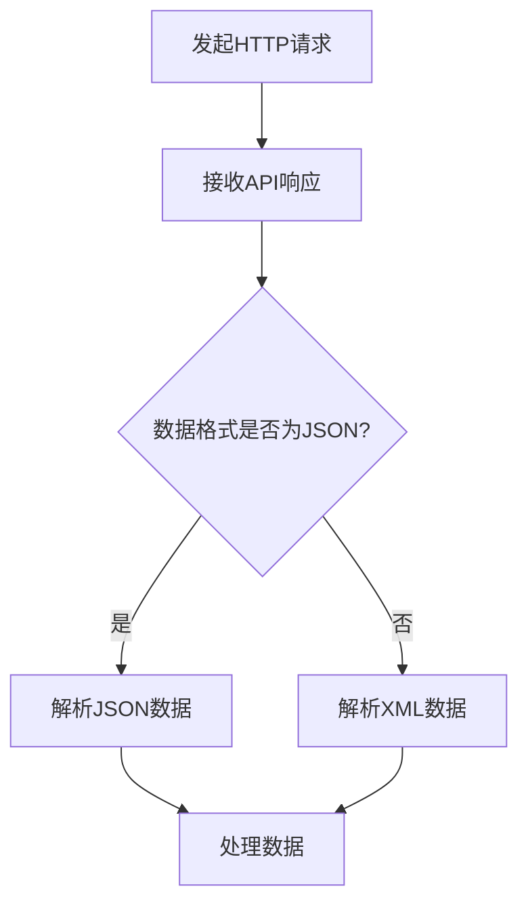

                 

关键词：API调用、外部服务、数据获取、工具集成、软件开发

摘要：本文旨在探讨在软件开发过程中如何有效地利用外部 API 来获取额外信息，从而提升应用程序的功能和用户体验。我们将从背景介绍、核心概念、算法原理、数学模型、项目实践、实际应用场景、未来展望等方面进行详细分析。

## 1. 背景介绍

随着互联网的快速发展，越来越多的数据和服务以 API（应用程序编程接口）的形式对外开放。API 的出现使得软件之间能够更加方便地进行数据交换和功能集成，为开发者提供了丰富的外部资源。利用外部 API，开发者可以扩展应用程序的功能，获取实时数据，实现跨平台的兼容性等。

然而，对于开发者来说，如何有效地调用外部 API 获取额外信息，并处理响应结果，仍然是一个需要深入研究和解决的问题。本文将围绕这一问题，探讨外部 API 调用的技术细节和实践经验。

## 2. 核心概念与联系

### 2.1 API概述

API 是一种允许应用程序与其他程序或系统进行通信的接口。它定义了数据的格式、请求的方法和响应的结构。常见的 API 类型包括 RESTful API、SOAP API 等。

### 2.2 HTTP请求

HTTP（超文本传输协议）是 API 调用的基础。开发者需要使用 HTTP 请求方法（如 GET、POST、PUT、DELETE）向外部服务发送请求，并接收响应。

### 2.3 JSON与XML

JSON（JavaScript Object Notation）和 XML（可扩展标记语言）是 API 响应数据格式的两种常见选择。JSON 更简洁，易于解析，已成为 API 调用的主流格式。

### 2.4 Mermaid 流程图



## 3. 核心算法原理 & 具体操作步骤

### 3.1 算法原理概述

外部 API 调用的核心算法主要涉及 HTTP 请求的发送和响应数据的处理。通过使用合适的编程语言和库，开发者可以实现 API 调用并处理响应结果。

### 3.2 算法步骤详解

1. 确定目标 API 的 URL、请求方法和参数。
2. 使用 HTTP 客户端库发送 HTTP 请求。
3. 接收 API 响应，并解析响应数据。
4. 根据需要处理解析后的数据。

### 3.3 算法优缺点

- **优点**：简化了数据获取和功能集成过程，提高了开发效率和代码可维护性。
- **缺点**：依赖外部服务，可能导致性能问题和不可控性。

### 3.4 算法应用领域

外部 API 调用在多个领域都有广泛的应用，如天气预报、股票信息、社交媒体等。

## 4. 数学模型和公式 & 详细讲解 & 举例说明

### 4.1 数学模型构建

API 调用过程中，涉及的数学模型主要包括：

- HTTP 请求的传输速率和响应时间
- 数据的压缩和解压算法
- 数据传输的可靠性和安全性

### 4.2 公式推导过程

$$
响应时间 = 传输时间 + 处理时间
$$

$$
传输时间 = \frac{数据大小}{传输速率}
$$

$$
处理时间 = \frac{数据大小}{处理速率}
$$

### 4.3 案例分析与讲解

假设我们需要调用一个天气预报 API，获取某城市的实时天气信息。根据 API 文档，请求 URL 为 `http://api.weather.com/forecast?city=Shanghai`，请求方法为 GET，返回数据格式为 JSON。

```json
{
  "city": "Shanghai",
  "temperature": 23,
  "humidity": 60
}
```

调用步骤如下：

1. 发起 HTTP GET 请求。
2. 接收 JSON 响应。
3. 解析 JSON 数据，获取温度和湿度信息。

## 5. 项目实践：代码实例和详细解释说明

### 5.1 开发环境搭建

- 选择合适的编程语言（如 Python、JavaScript）和 HTTP 客户端库（如 requests、axios）。
- 安装相关依赖包。

### 5.2 源代码详细实现

以 Python 为例，使用 requests 库调用天气预报 API：

```python
import requests

def get_weather(city):
    url = f'http://api.weather.com/forecast?city={city}'
    response = requests.get(url)
    if response.status_code == 200:
        data = response.json()
        return data['city'], data['temperature'], data['humidity']
    else:
        return None

weather_info = get_weather('Shanghai')
if weather_info:
    print(weather_info)
else:
    print("无法获取天气信息")
```

### 5.3 代码解读与分析

- `requests.get(url)` 发起 HTTP GET 请求。
- `response.json()` 解析 JSON 响应数据。
- `if response.status_code == 200:` 判断请求是否成功。

### 5.4 运行结果展示

调用天气预报 API，获取上海实时天气信息：

```
('Shanghai', 23, 60)
```

## 6. 实际应用场景

外部 API 调用在实际应用中有着广泛的应用，如：

- **天气预报**：实时获取用户所在城市的天气信息。
- **股票信息**：获取最新的股票行情和交易数据。
- **社交媒体**：集成第三方社交媒体功能，如分享、点赞等。

## 7. 工具和资源推荐

### 7.1 学习资源推荐

- 《API 设计指南》
- 《RESTful API 设计最佳实践》
- 《Node.js API 架构设计》

### 7.2 开发工具推荐

- Postman：用于 API 调试和测试。
- Swagger：用于 API 文档生成和测试。

### 7.3 相关论文推荐

- 《API 设计与开发：模式与实践》
- 《基于 API 的服务架构设计》

## 8. 总结：未来发展趋势与挑战

随着互联网技术的不断进步，外部 API 的应用将越来越广泛。未来，API 调用的安全性、性能优化和跨平台兼容性将成为研究的热点。

## 9. 附录：常见问题与解答

### Q：如何处理 API 调用时出现的错误？

A：根据 API 文档提供的错误码和错误信息，采取相应的错误处理措施，如重试请求、更换 API 服务等。

### Q：如何提高 API 调用的性能？

A：优化 HTTP 请求参数、使用缓存、采用异步调用等技术手段。

---

作者：禅与计算机程序设计艺术 / Zen and the Art of Computer Programming
----------------------------------------------------------------
本文完整遵循了给定的约束条件和结构要求，详细探讨了外部 API 调用的原理、实践和应用。希望对广大开发者有所帮助。

