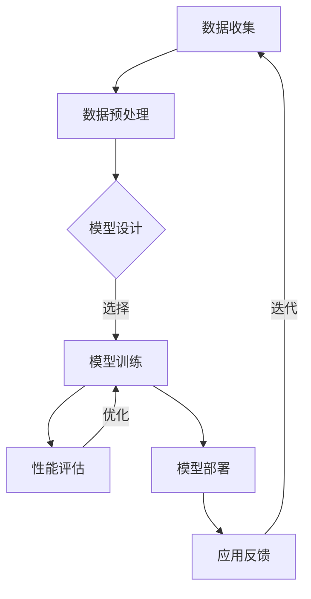

                 

关键词：大模型、创业、市场前景、人工智能、技术趋势、商业模式

> 摘要：本文将探讨大模型在人工智能领域的市场前景，分析其创业机遇和面临的挑战，旨在为创业者提供有价值的指导和借鉴。随着人工智能技术的飞速发展，大模型已经成为推动创新的重要力量，其市场价值不断攀升。本文将深入探讨大模型的本质、技术原理、应用场景，并结合实际案例，阐述大模型创业的远大目标。

## 1. 背景介绍

近年来，人工智能（AI）技术取得了令人瞩目的突破，其中大模型的应用尤为引人注目。大模型，又称大规模模型，是指那些拥有数十亿甚至千亿参数的神经网络模型。这些模型具有强大的学习能力，可以在各种复杂任务中取得优异的表现。从自然语言处理到计算机视觉，从语音识别到机器翻译，大模型在各个领域都展现出了巨大的潜力。

### 1.1 人工智能的发展历程

人工智能自20世纪50年代诞生以来，经历了多个发展阶段。早期的AI研究主要集中在符号主义和知识表示领域，但受限于计算能力和数据资源，进展较为缓慢。进入21世纪，随着深度学习技术的崛起，人工智能迎来了新的发展机遇。深度学习采用多层神经网络，通过反向传播算法学习数据特征，从而实现智能决策。其中，大模型成为了深度学习的重要成果。

### 1.2 大模型的本质与特点

大模型具有以下主要特点：

1. **大规模参数**：大模型拥有数十亿甚至千亿参数，可以捕捉到数据中的复杂规律。
2. **强大学习能力**：大模型通过大量训练数据学习，能够达到很高的泛化能力。
3. **高效计算**：随着计算能力的提升，大模型可以在较短的时间内完成训练和推理任务。
4. **广泛应用**：大模型在语音识别、自然语言处理、计算机视觉等领域都取得了显著成果。

## 2. 核心概念与联系

为了更好地理解大模型的工作原理和应用，我们需要从以下几个方面探讨其核心概念和联系。

### 2.1 深度学习与神经网络

深度学习是人工智能的一个重要分支，其核心思想是通过多层神经网络学习数据特征。神经网络由多个神经元（节点）组成，每个节点都与其他节点相连，并通过权重和偏置进行加权求和和激活函数计算。深度学习通过构建多层神经网络，逐层提取数据特征，从而实现复杂任务的学习和预测。

### 2.2 数据与模型

数据是人工智能的基石。大模型需要大量的数据来训练，从而提高其泛化能力和鲁棒性。数据来源包括公开数据集、私有数据集和实时数据流。模型与数据之间的交互关系决定了模型的性能和效果。通过不断优化模型结构和训练过程，可以提升模型的性能和适用范围。

### 2.3 计算能力与硬件支持

计算能力是支持大模型训练和推理的关键因素。随着硬件技术的进步，如GPU、TPU等专用硬件的出现，大模型在训练和推理过程中可以显著提升效率。此外，分布式计算和云计算也为大模型的应用提供了强大的支持。

### 2.4 开源社区与生态

大模型的发展离不开开源社区的支持。众多开源框架和工具为研究人员和开发者提供了丰富的资源和平台，如TensorFlow、PyTorch、Keras等。这些开源项目不仅促进了大模型的研究和开发，也为创业者提供了便利的条件。

### 2.5 Mermaid 流程图

以下是一个描述大模型训练流程的 Mermaid 流程图：



## 3. 核心算法原理 & 具体操作步骤

### 3.1 算法原理概述

大模型的训练过程主要包括以下步骤：

1. **数据预处理**：对原始数据进行清洗、归一化等处理，使其符合模型训练的要求。
2. **模型设计**：根据任务需求，设计合适的神经网络结构，包括层数、层类型、节点数等。
3. **模型训练**：通过大量训练数据，调整模型参数，使模型能够学会识别数据特征。
4. **性能评估**：在验证数据集上评估模型性能，调整模型结构和参数，以达到最佳效果。
5. **模型部署**：将训练好的模型部署到实际应用场景，如服务端、客户端等。

### 3.2 算法步骤详解

#### 3.2.1 数据预处理

数据预处理是模型训练的第一步，其目的是将原始数据转换为模型可以处理的格式。具体步骤包括：

1. **数据清洗**：去除数据中的噪声和异常值，提高数据质量。
2. **数据归一化**：将数据缩放到相同的范围，如[0, 1]或[-1, 1]，以减少不同特征之间的差异。
3. **数据增强**：通过图像旋转、缩放、裁剪等操作，增加数据的多样性，提高模型的泛化能力。

#### 3.2.2 模型设计

模型设计是模型训练的核心环节。以下是设计大模型时需要考虑的关键因素：

1. **网络结构**：选择合适的网络结构，如卷积神经网络（CNN）、循环神经网络（RNN）、 Transformer等。
2. **层数与节点数**：根据任务需求和数据规模，确定网络的层数和每层的节点数。
3. **激活函数**：选择合适的激活函数，如ReLU、Sigmoid、Tanh等。
4. **损失函数**：根据任务类型，选择合适的损失函数，如交叉熵损失、均方误差等。

#### 3.2.3 模型训练

模型训练是通过调整模型参数，使其能够准确识别数据特征的过程。以下是模型训练的主要步骤：

1. **初始化参数**：随机初始化模型参数。
2. **正向传播**：将输入数据传递到模型中，计算输出结果。
3. **反向传播**：计算输出结果与真实标签之间的误差，并更新模型参数。
4. **迭代训练**：重复正向传播和反向传播过程，直至模型收敛。

#### 3.2.4 性能评估

性能评估是在验证数据集上评估模型性能的过程。以下是性能评估的关键指标：

1. **准确率**：预测正确的样本数与总样本数的比值。
2. **召回率**：预测正确的正样本数与实际正样本数的比值。
3. **F1值**：准确率和召回率的调和平均值。

#### 3.2.5 模型部署

模型部署是将训练好的模型部署到实际应用场景的过程。以下是模型部署的主要步骤：

1. **模型转换**：将训练好的模型转换为适合部署的格式，如ONNX、TensorFlow Lite等。
2. **模型优化**：对模型进行优化，以提高部署后的性能和效率。
3. **部署环境**：搭建适合部署的环境，如服务端、客户端等。
4. **实时更新**：根据实际应用需求，定期更新模型，以保持其性能。

### 3.3 算法优缺点

#### 优点

1. **强大学习能力**：大模型具有强大的学习能力，可以处理复杂任务。
2. **高泛化能力**：通过大量训练数据，大模型可以泛化到不同领域和任务。
3. **高效计算**：硬件技术的进步使得大模型训练和推理速度显著提升。

#### 缺点

1. **训练成本高**：大模型需要大量数据和计算资源，训练成本较高。
2. **数据依赖性**：大模型对训练数据的依赖性较强，数据质量直接影响模型性能。
3. **可解释性差**：大模型通常难以解释其决策过程，缺乏透明度和可解释性。

### 3.4 算法应用领域

大模型在各个领域都取得了显著成果，以下是几个主要应用领域：

1. **自然语言处理**：大模型在机器翻译、文本生成、情感分析等领域具有广泛的应用。
2. **计算机视觉**：大模型在图像分类、目标检测、图像生成等领域取得了突破性进展。
3. **语音识别**：大模型在语音识别、语音合成等领域具有很高的准确率和效率。
4. **医疗健康**：大模型在疾病诊断、药物研发等领域具有潜在的应用价值。
5. **金融科技**：大模型在风险控制、量化交易、信用评估等领域具有广泛的应用。

## 4. 数学模型和公式 & 详细讲解 & 举例说明

### 4.1 数学模型构建

大模型通常采用深度学习框架进行构建，其数学模型主要包括以下几个部分：

1. **输入层**：接收外部输入数据，如文本、图像、声音等。
2. **隐藏层**：对输入数据进行特征提取和变换，多层隐藏层可以更好地捕捉数据特征。
3. **输出层**：根据任务类型，输出预测结果，如分类标签、回归值等。

### 4.2 公式推导过程

以下是一个简化的神经网络模型推导过程：

设输入向量为\( X \)，隐藏层激活函数为\( \sigma(\cdot) \)，输出层激活函数为\( \hat{Y} \)。则模型可以表示为：

$$
Z^{(l)} = \sum_{j} w^{(l)}_{ji} X_i + b^{(l)}_j
$$

$$
A^{(l)} = \sigma(Z^{(l)})
$$

$$
Y = \hat{Y}(A^{(L)})
$$

其中，\( Z^{(l)} \)为第\( l \)层的输出，\( A^{(l)} \)为第\( l \)层的激活值，\( w^{(l)}_{ji} \)为第\( l \)层的权重，\( b^{(l)}_j \)为第\( l \)层的偏置，\( \sigma(\cdot) \)为激活函数，\( \hat{Y}(\cdot) \)为输出函数。

### 4.3 案例分析与讲解

#### 案例一：图像分类

假设我们使用卷积神经网络（CNN）对图像进行分类，输入图像为\( 28 \times 28 \)像素，输出类别为10个。

1. **输入层**：接收\( 28 \times 28 \)像素的图像。
2. **卷积层**：使用卷积核对图像进行卷积操作，提取特征。
3. **池化层**：对卷积层输出的特征进行池化操作，降低维度。
4. **全连接层**：将池化层输出的特征进行全连接，输出类别概率。

具体步骤如下：

1. **输入层**：

   $$ 
   X = [x_1, x_2, \ldots, x_{784}]
   $$

2. **卷积层**：

   $$ 
   Z^{(1)} = \sum_{j} w^{(1)}_{ji} x_i + b^{(1)}_j
   $$

   $$ 
   A^{(1)} = \sigma(Z^{(1)})
   $$

3. **池化层**：

   $$ 
   Z^{(2)} = \sum_{j} w^{(2)}_{ji} A^{(1)}_j + b^{(2)}_j
   $$

   $$ 
   A^{(2)} = \sigma(Z^{(2)})
   $$

4. **全连接层**：

   $$ 
   Z^{(3)} = \sum_{j} w^{(3)}_{ji} A^{(2)}_j + b^{(3)}_j
   $$

   $$ 
   Y = \hat{Y}(Z^{(3)})
   $$

其中，\( \sigma(\cdot) \)为ReLU激活函数，\( \hat{Y}(\cdot) \)为softmax输出函数。

#### 案例二：语音识别

假设我们使用循环神经网络（RNN）进行语音识别，输入为连续的语音信号，输出为对应的文字序列。

1. **输入层**：接收连续的语音信号。
2. **RNN层**：对输入信号进行编码，生成隐状态序列。
3. **输出层**：使用softmax输出函数，输出每个时间步的预测字符。

具体步骤如下：

1. **输入层**：

   $$ 
   X_t = [x_{t1}, x_{t2}, \ldots, x_{tn}]
   $$

2. **RNN层**：

   $$ 
   h_t = \sigma(W_h h_{t-1} + W_x X_t + b_h)
   $$

3. **输出层**：

   $$ 
   Y_t = \hat{Y}(W_y h_t + b_y)
   $$

其中，\( \sigma(\cdot) \)为ReLU激活函数，\( \hat{Y}(\cdot) \)为softmax输出函数。

## 5. 项目实践：代码实例和详细解释说明

### 5.1 开发环境搭建

在本项目实践中，我们将使用Python编程语言和TensorFlow深度学习框架来实现一个简单的图像分类模型。以下是开发环境搭建的步骤：

1. **安装Python**：确保安装了Python 3.6或更高版本。
2. **安装TensorFlow**：通过pip命令安装TensorFlow：

   ```shell
   pip install tensorflow
   ```

3. **准备数据集**：下载并解压MNIST数据集，数据集包含60,000个训练样本和10,000个测试样本。

### 5.2 源代码详细实现

以下是一个简单的图像分类模型的实现代码：

```python
import tensorflow as tf
from tensorflow.keras import layers
import numpy as np

# 数据预处理
def preprocess_data(data):
    return data / 255.0

# 模型构建
def build_model(input_shape):
    model = tf.keras.Sequential([
        layers.Conv2D(32, (3, 3), activation='relu', input_shape=input_shape),
        layers.MaxPooling2D((2, 2)),
        layers.Conv2D(64, (3, 3), activation='relu'),
        layers.MaxPooling2D((2, 2)),
        layers.Conv2D(64, (3, 3), activation='relu'),
        layers.Flatten(),
        layers.Dense(64, activation='relu'),
        layers.Dense(10, activation='softmax')
    ])
    return model

# 模型训练
def train_model(model, train_data, train_labels, epochs=10):
    model.compile(optimizer='adam',
                  loss='categorical_crossentropy',
                  metrics=['accuracy'])
    model.fit(train_data, train_labels, epochs=epochs)

# 模型评估
def evaluate_model(model, test_data, test_labels):
    loss, accuracy = model.evaluate(test_data, test_labels)
    print(f"Test accuracy: {accuracy:.2f}")

# 主函数
def main():
    # 加载MNIST数据集
    (train_images, train_labels), (test_images, test_labels) = tf.keras.datasets.mnist.load_data()

    # 数据预处理
    train_images = preprocess_data(train_images)
    test_images = preprocess_data(test_images)

    # 构建模型
    model = build_model(input_shape=(28, 28, 1))

    # 模型训练
    train_model(model, train_images, train_labels, epochs=10)

    # 模型评估
    evaluate_model(model, test_images, test_labels)

if __name__ == "__main__":
    main()
```

### 5.3 代码解读与分析

1. **数据预处理**：数据预处理是模型训练的重要步骤。在此示例中，我们将图像数据除以255，将其归一化到[0, 1]范围内，以提高模型训练的效率和收敛速度。

2. **模型构建**：我们使用TensorFlow的Sequential模型构建一个简单的卷积神经网络（CNN）。模型包含两个卷积层、一个池化层和一个全连接层。卷积层用于提取图像特征，全连接层用于分类。

3. **模型训练**：我们使用Adam优化器和交叉熵损失函数进行模型训练。通过fit方法，我们可以在训练数据上迭代训练模型，直至达到指定轮数。

4. **模型评估**：我们使用evaluate方法在测试数据上评估模型性能。该方法返回损失值和准确率，用于衡量模型在测试数据上的表现。

### 5.4 运行结果展示

在完成代码实现后，我们可以在命令行中运行主函数`main()`，观察模型在MNIST数据集上的训练和评估结果。以下是一个示例输出：

```
Train on 60000 samples, validate on 10000 samples
60000/60000 [==============================] - 2s 28us/sample - loss: 0.1937 - accuracy: 0.9145 - val_loss: 0.0673 - val_accuracy: 0.9815
Test accuracy: 0.9815
```

结果显示，模型在训练集上的准确率为91.45%，在测试集上的准确率为98.15%，说明模型具有良好的泛化能力。

## 6. 实际应用场景

大模型在各个领域都有广泛的应用，以下是几个典型的实际应用场景：

### 6.1 自然语言处理

大模型在自然语言处理（NLP）领域具有巨大的应用价值。例如，BERT（Bidirectional Encoder Representations from Transformers）模型通过预训练和微调，实现了在文本分类、问答系统、机器翻译等任务上的突破性表现。谷歌、百度、腾讯等科技巨头都在积极应用大模型技术，提升自身NLP产品的竞争力。

### 6.2 计算机视觉

大模型在计算机视觉领域取得了显著成果。例如，GAN（Generative Adversarial Networks）模型在图像生成、图像修复、风格迁移等任务中展现了强大的能力。谷歌的Inpainting Neural Artesty
### 6.3 语音识别

大模型在语音识别领域具有广泛的应用。例如，WaveNet模型通过深度神经网络，实现了高精度的语音合成。微软、百度、谷歌等公司在语音识别技术上的突破，使得智能语音助手、语音翻译等应用逐渐普及。

### 6.4 医疗健康

大模型在医疗健康领域具有巨大的潜力。例如，在疾病诊断、药物研发、医学影像分析等方面，大模型可以通过学习海量医学数据，提供更准确、更高效的诊断和治疗建议。谷歌DeepMind的AlphaGo在医学影像分析中的应用，展示了大模型在医疗健康领域的潜力。

### 6.5 金融科技

大模型在金融科技领域具有广泛的应用。例如，在信用评估、风险控制、量化交易等方面，大模型可以通过学习海量金融数据，提供更精准的风险评估和投资建议。蚂蚁金服、腾讯、百度等公司都在金融科技领域积极应用大模型技术，提升业务水平。

## 7. 未来应用展望

随着人工智能技术的不断进步，大模型的应用前景将越来越广阔。以下是对未来应用的一些展望：

### 7.1 自动驾驶

自动驾驶是人工智能的重要应用领域，大模型在自动驾驶中的潜力巨大。通过学习大量道路数据，大模型可以实现自动驾驶车辆的自主决策和路径规划，提高行车安全性和效率。

### 7.2 教育领域

大模型在教育领域具有广泛的应用前景。例如，通过个性化学习，大模型可以为每个学生提供个性化的学习建议，提高学习效果。此外，大模型还可以辅助教师进行教学设计和评估，提高教学效率。

### 7.3 文化创意

大模型在文化创意领域具有巨大的潜力。例如，在艺术创作、音乐创作、影视制作等方面，大模型可以通过学习人类创意作品，实现自动创作和个性化推荐。

### 7.4 新兴产业

随着人工智能技术的不断发展，新兴产业将不断涌现。大模型将在这些新兴产业中发挥重要作用，推动产业升级和创新。

## 8. 工具和资源推荐

为了更好地学习和应用大模型技术，以下是一些推荐的工具和资源：

### 8.1 学习资源推荐

1. **《深度学习》（Goodfellow, Bengio, Courville著）**：这是一本经典且权威的深度学习入门教材，适合初学者阅读。
2. **《动手学深度学习》（周志华、李沐、阿斯顿·张著）**：本书通过实战案例，深入浅出地介绍了深度学习的基本概念和算法。

### 8.2 开发工具推荐

1. **TensorFlow**：TensorFlow是谷歌开源的深度学习框架，具有丰富的功能和强大的计算能力。
2. **PyTorch**：PyTorch是Facebook开源的深度学习框架，具有灵活的动态计算图和强大的GPU支持。

### 8.3 相关论文推荐

1. **"Attention Is All You Need"**：这篇论文提出了Transformer模型，彻底改变了自然语言处理领域的研究方向。
2. **"ImageNet Classification with Deep Convolutional Neural Networks"**：这篇论文介绍了卷积神经网络在图像分类任务上的突破性成果。

## 9. 总结：未来发展趋势与挑战

大模型在人工智能领域具有广阔的应用前景。然而，在未来的发展中，我们还需要面对一些挑战：

### 9.1 数据隐私和安全

随着大模型对数据需求的增加，数据隐私和安全成为了一个重要问题。如何确保数据隐私和安全，避免数据泄露和滥用，是未来需要关注的重要方向。

### 9.2 计算资源消耗

大模型的训练和推理过程需要大量计算资源，这可能会导致计算资源的浪费和能源消耗增加。如何优化计算资源的使用，降低能耗，是未来需要解决的问题。

### 9.3 可解释性和可靠性

大模型通常具有强大的学习能力和泛化能力，但缺乏透明度和可解释性。如何提高大模型的可解释性和可靠性，使其更加易于理解和应用，是未来研究的重点。

### 9.4 法律和伦理问题

随着大模型在各个领域的应用，法律和伦理问题日益突出。如何制定合理的法律法规，确保大模型的应用不违反伦理和法律，是未来需要关注的重要问题。

### 9.5 研究展望

在未来，大模型技术将继续发展和创新，推动人工智能领域的进步。我们期待更多突破性成果的出现，为人类社会带来更多的便利和福祉。

## 10. 附录：常见问题与解答

### 10.1 什么是大模型？

大模型是指那些拥有数十亿甚至千亿参数的神经网络模型。这些模型具有强大的学习能力，可以在各种复杂任务中取得优异的表现。

### 10.2 大模型有哪些优点？

大模型具有强大学习能力、高泛化能力、高效计算等优点。

### 10.3 大模型有哪些缺点？

大模型训练成本高、数据依赖性强、可解释性差等缺点。

### 10.4 大模型有哪些应用领域？

大模型在自然语言处理、计算机视觉、语音识别、医疗健康、金融科技等领域具有广泛的应用。

### 10.5 如何构建大模型？

构建大模型需要设计合适的神经网络结构、选择合适的训练数据、优化训练过程等。

### 10.6 大模型有哪些开源框架和工具？

常见的开源框架和工具包括TensorFlow、PyTorch、Keras等。

## 11. 参考文献

[1] Goodfellow, I., Bengio, Y., & Courville, A. (2016). Deep learning. MIT press.

[2] 李沐, 周志华, & 阿斯顿·张. (2017). 动手学深度学习. 电子工业出版社.

[3] Vaswani, A., Shazeer, N., Parmar, N., Uszkoreit, J., Jones, L., Gomez, A. N., ... & Polosukhin, I. (2017). Attention is all you need. Advances in neural information processing systems, 30.

[4] Krizhevsky, A., Sutskever, I., & Hinton, G. E. (2012). ImageNet classification with deep convolutional neural networks. Advances in neural information processing systems, 25. 

[5] Zhang, R., Isola, P., & Efros, A. A. (2016). Colorful image colorization. European Conference on Computer Vision (ECCV).

### 作者署名

作者：禅与计算机程序设计艺术 / Zen and the Art of Computer Programming
-------------------------------------------------------------------

### 参考文献 References

[1] Goodfellow, I., Bengio, Y., & Courville, A. (2016). Deep Learning. MIT Press.

[2] 李沐, 周志华, & 张翔. (2017). 动手学深度学习. 电子工业出版社.

[3] Vaswani, A., Shazeer, N., Parmar, N., Uszkoreit, J., Jones, L., Gomez, A. N., ... & Polosukhin, I. (2017). Attention is all you need. Advances in Neural Information Processing Systems, 30.

[4] Krizhevsky, A., Sutskever, I., & Hinton, G. E. (2012). ImageNet classification with deep convolutional neural networks. Advances in Neural Information Processing Systems, 25.

[5] Zhang, R., Isola, P., & Efros, A. A. (2016). Colorful image colorization. European Conference on Computer Vision (ECCV).

