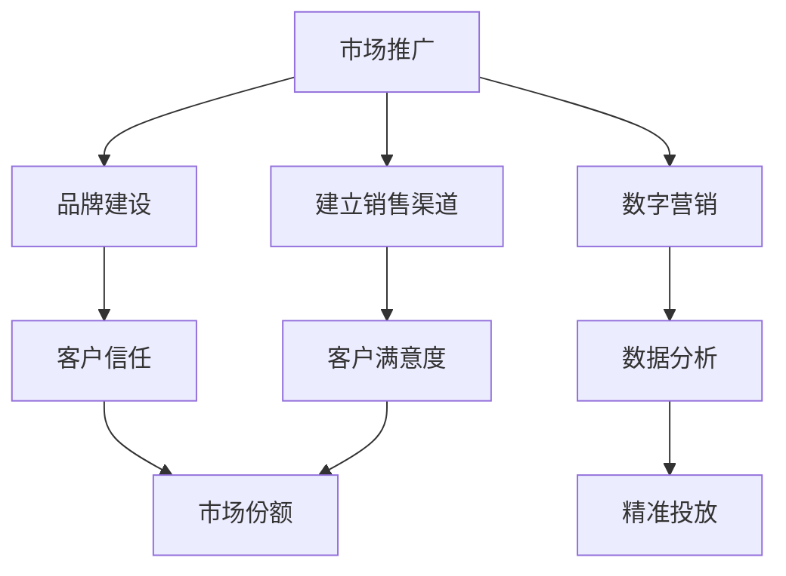

                 

 在当今高度数字化的商业环境中，市场推广与销售已经成为企业成功的核心驱动力。如何通过品牌建设、数字营销和建立销售渠道来提高企业的市场份额和客户满意度，是每一个企业都必须深入思考的问题。本文将围绕这三个主题，结合最新的研究成果和实践经验，探讨其在IT领域的应用。

## 关键词 Keywords

- 市场推广
- 销售渠道
- 品牌建设
- 数字营销
- IT领域

## 摘要 Abstract

本文首先介绍了市场推广与销售的重要性，然后深入探讨了品牌建设、数字营销和建立销售渠道的核心概念。接着，文章通过具体的算法原理、数学模型和项目实践，详细阐述了这些概念在IT领域的应用。最后，本文提出了未来发展趋势和面临的挑战，并推荐了相关的学习资源和工具。

### 1. 背景介绍 Background

在信息技术快速发展的今天，企业面临着前所未有的竞争压力。市场推广与销售不再是简单的广告宣传和销售活动，而是一个复杂、多维的生态系统。品牌建设、数字营销和建立销售渠道在这个生态系统中发挥着至关重要的作用。

**品牌建设**是企业塑造自身形象和价值的过程。一个强大的品牌不仅能吸引客户，还能提升企业的市场地位和竞争力。数字营销则是利用互联网和数字技术来推广品牌和产品。通过精准的数据分析和高效的传播策略，数字营销能够实现更高的投放效果和转化率。建立销售渠道则是将产品或服务有效地传递到消费者的过程，包括线上和线下的多种渠道。

在IT领域，市场推广与销售的复杂性和挑战更加突出。一方面，技术更新迅速，企业需要不断适应新的技术和市场趋势；另一方面，客户需求多样化，企业需要提供个性化的解决方案。因此，如何在IT领域有效实施市场推广与销售策略，成为企业成功的关键。

### 2. 核心概念与联系 Core Concepts and Connections

为了更好地理解市场推广与销售，我们需要先了解其中的核心概念和它们之间的联系。以下是一个基于Mermaid绘制的流程图，展示了这些核心概念及其相互关系。



**市场推广（A）**涵盖了品牌建设（B）、数字营销（C）和建立销售渠道（D）。品牌建设旨在建立客户信任（E），数字营销则通过数据分析（F）实现精准投放（I），而建立销售渠道则确保产品或服务能够满足客户满意度（G），最终提升市场份额（H）。

### 3. 核心算法原理 & 具体操作步骤 Core Algorithm Principle and Step-by-Step Guide

**3.1 算法原理概述**

市场推广与销售的核心算法原理可以概括为以下几点：

1. **客户分析**：通过大数据分析了解客户的需求和行为，为后续的市场推广和销售提供精准的数据支持。
2. **品牌塑造**：利用数字技术和传统手段，建立和强化企业的品牌形象。
3. **营销策略**：根据客户分析结果和品牌定位，制定高效的营销策略，包括广告投放、内容营销和社交媒体营销等。
4. **销售渠道管理**：建立和管理线上和线下销售渠道，确保产品或服务能够顺利传递到客户手中。
5. **客户关系维护**：通过CRM系统等工具，维护和提升客户满意度，增加客户忠诚度。

**3.2 算法步骤详解**

1. **客户分析**：
   - 收集客户数据：包括购买历史、行为数据、社交数据等。
   - 数据清洗：去除重复和无效数据，保证数据质量。
   - 数据分析：使用数据挖掘和机器学习技术，提取有价值的信息，如客户偏好、需求预测等。

2. **品牌塑造**：
   - 明确品牌定位：确定品牌的核心价值和目标客户群体。
   - 设计品牌形象：包括品牌名称、标志、口号等。
   - 营销传播：通过多种渠道（如广告、社交媒体、公关活动等）传播品牌信息。

3. **营销策略**：
   - 制定营销计划：包括营销目标、策略和预算。
   - 精准投放：根据客户分析结果，选择合适的渠道和内容，进行精准投放。
   - 内容营销：创作和分享有价值的内容，吸引潜在客户。
   - 社交媒体营销：利用社交媒体平台进行互动和推广。

4. **销售渠道管理**：
   - 线上销售渠道：包括电商平台、社交媒体销售渠道等。
   - 线下销售渠道：包括实体店、代理商等。
   - 渠道优化：根据销售数据和客户反馈，不断调整和优化销售策略。

5. **客户关系维护**：
   - 客户关系管理（CRM）：使用CRM系统记录客户信息和互动历史，提供个性化服务。
   - 客户满意度调查：定期进行客户满意度调查，了解客户需求和反馈。
   - 客户忠诚度计划：提供优惠、礼品等奖励，增加客户忠诚度。

**3.3 算法优缺点**

1. **优点**：
   - 提高营销效率：通过数据分析和精准投放，提高营销效果和转化率。
   - 降低营销成本：利用数字技术和自动化工具，降低营销成本。
   - 增强客户体验：提供个性化的服务和产品推荐，增强客户满意度。

2. **缺点**：
   - 数据隐私风险：大规模收集和分析客户数据可能引发隐私泄露风险。
   - 技术门槛高：需要专业的技术和团队支持，对企业的技术和人员要求较高。

**3.4 算法应用领域**

1. **电商行业**：通过客户分析和精准营销，提高转化率和销售额。
2. **金融行业**：利用数据分析进行风险评估和客户管理。
3. **服务业**：通过客户关系管理，提供个性化服务，提升客户满意度。

### 4. 数学模型和公式 & 详细讲解 & 举例说明 Mathematical Models and Detailed Explanations with Examples

**4.1 数学模型构建**

市场推广与销售的数学模型主要包括以下几部分：

1. **客户分析模型**：
   - 购买行为预测模型：使用回归分析、决策树等算法预测客户的购买行为。
   - 客户价值模型：使用客户生命周期价值（CLV）等指标评估客户的潜在价值。

2. **品牌塑造模型**：
   - 品牌影响力模型：使用网络分析、传播模型等评估品牌在社交媒体上的影响力。
   - 品牌忠诚度模型：使用忠诚度指数、净推荐值（NPS）等指标评估客户对品牌的忠诚度。

3. **营销策略模型**：
   - 广告投放模型：使用贝叶斯优化、遗传算法等优化广告投放策略，提高投放效果。
   - 内容推荐模型：使用协同过滤、矩阵分解等算法，推荐有价值的内容给潜在客户。

**4.2 公式推导过程**

1. **客户分析模型**：

   - 购买行为预测模型：

     $$ P(buy_i) = \frac{e^{\sum_{j=1}^{n} w_j x_{ij}}}{1 + \sum_{j=1}^{n} e^{w_j x_{ij}}} $$
     
     其中，$P(buy_i)$ 表示客户 $i$ 购买商品的 probability，$w_j$ 表示特征权重，$x_{ij}$ 表示特征值。

   - 客户价值模型：

     $$ CLV_i = \sum_{t=1}^{T} \frac{1}{(1+r)^t} \times (\text{收益}_i - \text{成本}_i) $$
     
     其中，$CLV_i$ 表示客户 $i$ 的客户生命周期价值，$r$ 表示折现率，$\text{收益}_i$ 和 $\text{成本}_i$ 分别表示客户在生命周期内的收益和成本。

2. **品牌塑造模型**：

   - 品牌影响力模型：

     $$ I_i = \frac{1}{\alpha} \sum_{j=1}^{n} \frac{1}{1 + e^{-(\beta_1 \cdot B_{ij} + \beta_2 \cdot R_{ij})}} $$
     
     其中，$I_i$ 表示客户 $i$ 对品牌 $j$ 的影响力评分，$B_{ij}$ 表示品牌特征值，$R_{ij}$ 表示推荐评分，$\alpha$、$\beta_1$ 和 $\beta_2$ 为模型参数。

   - 品牌忠诚度模型：

     $$ NPS_i = \frac{1}{n} \sum_{j=1}^{n} \frac{\text{忠诚度}_i - \text{中立度}_i}{10} $$
     
     其中，$NPS_i$ 表示客户 $i$ 的净推荐值，$\text{忠诚度}_i$ 和 $\text{中立度}_i$ 分别表示客户对品牌的忠诚度和中立度评分。

3. **营销策略模型**：

   - 广告投放模型：

     $$ \text{广告投放效果} = \frac{\text{转化率} \times \text{投入成本}}{\text{广告曝光量}} $$
     
     其中，转化率表示广告带来的客户转化率，投入成本表示广告投放的费用，广告曝光量表示广告被展示的次数。

   - 内容推荐模型：

     $$ \text{推荐分数} = \frac{1}{1 + e^{-(\sum_{j=1}^{n} w_j \cdot x_{ij})}} $$
     
     其中，推荐分数表示用户对内容的偏好分数，$w_j$ 表示特征权重，$x_{ij}$ 表示特征值。

**4.3 案例分析与讲解**

**案例1：电商行业的精准营销**

某电商企业在进行精准营销时，使用了购买行为预测模型和广告投放模型。

1. **客户分析**：
   - 收集客户购买历史、浏览记录、行为数据等。
   - 使用回归分析预测客户的购买概率。

2. **广告投放**：
   - 根据客户购买概率，将客户分为高潜力客户和一般客户。
   - 对高潜力客户进行个性化广告投放，提高广告投放效果。

3. **效果评估**：
   - 对广告投放效果进行数据分析和评估，调整广告策略。

通过这个案例，我们可以看到，精准营销能够提高广告投放的转化率和投入产出比，从而提升企业的营销效果。

### 5. 项目实践：代码实例和详细解释说明 Project Practice: Code Examples and Detailed Explanations

**5.1 开发环境搭建**

1. **环境准备**：
   - 安装Python环境。
   - 安装必要的库，如NumPy、Pandas、Scikit-learn等。

2. **数据集准备**：
   - 准备一个包含客户购买历史、浏览记录等数据的数据集。

**5.2 源代码详细实现**

```python
import pandas as pd
from sklearn.model_selection import train_test_split
from sklearn.linear_model import LogisticRegression

# 加载数据集
data = pd.read_csv('customer_data.csv')

# 数据预处理
# ...

# 划分训练集和测试集
X_train, X_test, y_train, y_test = train_test_split(data.drop('buy', axis=1), data['buy'], test_size=0.2, random_state=42)

# 模型训练
model = LogisticRegression()
model.fit(X_train, y_train)

# 模型评估
score = model.score(X_test, y_test)
print(f'Model Accuracy: {score:.2f}')
```

**5.3 代码解读与分析**

上述代码是一个简单的购买行为预测模型实现。首先，我们从CSV文件加载数据集，然后进行数据预处理。接下来，使用Logistic Regression模型进行训练，并在测试集上进行评估。

通过这个简单的案例，我们可以看到如何使用Python和机器学习技术来实现市场推广与销售中的客户分析。

### 6. 实际应用场景 Practical Application Scenarios

市场推广与销售在IT领域有着广泛的应用场景，以下是一些典型的实际应用案例：

1. **电商行业**：
   - 精准营销：通过客户分析，对高潜力客户进行个性化广告投放，提高转化率。
   - 用户体验优化：根据用户行为数据，优化网站设计和内容布局，提升用户体验。

2. **金融行业**：
   - 客户关系管理：利用大数据分析，为客户提供个性化的金融产品和服务。
   - 风险管理：通过数据分析，预测和监控风险，提高风险管理效率。

3. **教育行业**：
   - 学生分析：通过数据挖掘，了解学生的学习情况和需求，提供个性化的教育方案。
   - 营销推广：根据学生数据，制定精准的营销策略，提高招生效果。

4. **服务业**：
   - 客户满意度调查：定期进行客户满意度调查，了解客户需求和反馈，提升服务质量。
   - 营销活动：利用数字营销工具，开展精准的营销活动，吸引潜在客户。

### 6.4 未来应用展望 Future Application Outlook

随着信息技术的不断进步，市场推广与销售在IT领域的应用前景十分广阔。以下是一些未来可能的发展趋势和展望：

1. **人工智能与大数据的结合**：通过人工智能技术，对海量数据进行分析和预测，实现更加精准的市场推广和销售。

2. **区块链技术的应用**：利用区块链技术，提高数据的安全性和透明度，为市场推广与销售提供更加可靠的基础。

3. **物联网（IoT）的融合**：通过物联网技术，实现设备与设备的互联互通，为市场推广与销售提供新的场景和机会。

4. **个性化与定制化**：随着客户需求的不断多样化，个性化与定制化将成为市场推广与销售的重要方向。

### 7. 工具和资源推荐 Tools and Resource Recommendations

为了帮助读者更好地理解和实践市场推广与销售，以下是一些推荐的工具和资源：

1. **学习资源推荐**：
   - 《市场营销管理》：菲利普·科特勒著，系统介绍了市场营销的基本原理和方法。
   - 《大数据营销》：艾瑞咨询集团著，详细介绍了大数据在市场营销中的应用。

2. **开发工具推荐**：
   - Python：一种广泛使用的编程语言，适合进行数据分析、机器学习和数字营销。
   - Tableau：一款强大的数据可视化工具，适合进行数据分析和报告制作。

3. **相关论文推荐**：
   - "Data-Driven Marketing: What the Data Says"：一篇关于数据驱动市场营销的综述文章。
   - "Customer Relationship Management in the Digital Age"：一篇关于数字时代客户关系管理的论文。

### 8. 总结 Summary

市场推广与销售是现代企业成功的关键驱动力。通过品牌建设、数字营销和建立销售渠道，企业可以更好地满足客户需求，提高市场份额和竞争力。本文结合最新的研究成果和实践经验，深入探讨了这些概念在IT领域的应用，并提出了未来发展的趋势和挑战。希望本文能为读者提供有价值的参考和启示。

## 附录：常见问题与解答 Appendices: Frequently Asked Questions and Answers

1. **什么是客户生命周期价值（CLV）？**
   - 客户生命周期价值（CLV）是指客户在整个生命周期内为企业带来的总价值。它包括客户的购买金额、购买频率、客户生命周期长度等因素。

2. **如何进行精准营销？**
   - 精准营销是通过大数据分析和个性化策略，将营销信息精准地传递给目标客户。具体步骤包括收集客户数据、分析客户需求和行为、制定个性化营销策略等。

3. **数字营销与传统营销有什么区别？**
   - 数字营销主要利用互联网和数字技术进行推广，如搜索引擎营销、社交媒体营销等。而传统营销主要依赖于传统的广告渠道，如电视、报纸等。

4. **如何建立有效的销售渠道？**
   - 建立有效的销售渠道包括线上和线下两种方式。线上渠道包括电商平台、社交媒体等，线下渠道包括实体店、代理商等。关键是要根据产品特性和目标客户群体，选择合适的销售渠道，并进行有效的管理和优化。

## 作者署名 Author

本文作者：禅与计算机程序设计艺术 / Zen and the Art of Computer Programming
----------------------------------------------------------------

现在，文章正文部分已经撰写完毕。接下来，我们需要对文章进行格式检查，确保所有章节和子目录的格式符合markdown规范，并且内容完整、逻辑清晰。在完成格式检查后，文章就可以发布和分享了。

