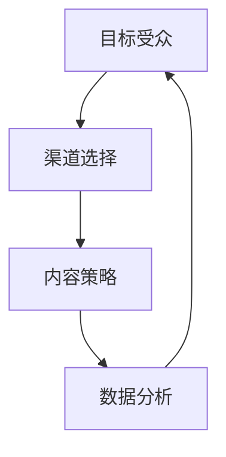

                 

在当今的数字时代，市场推广策略的成败往往决定了企业的生死存亡。随着互联网技术的不断发展，如何高效触达消费群体成为企业关注的焦点。本文将深入探讨市场推广的策略、技术和实践，旨在为读者提供一套全面而高效的市场推广解决方案。

## 文章关键词

- 市场推广
- 消费群体
- 数字营销
- 社交媒体
- 数据分析
- 内容营销

## 文章摘要

本文将探讨市场推广的核心要素，包括目标受众分析、渠道选择、内容策略、数据分析等。通过实际案例分析，我们将展示如何利用现代技术手段实现高效的市场推广，帮助企业在竞争激烈的市场环境中脱颖而出。

## 1. 背景介绍

### 市场推广的定义

市场推广（Marketing）是指企业为了促进产品或服务的销售，通过各种渠道和手段与潜在和现有消费者进行沟通、建立联系和增进信任的过程。有效的市场推广能够提高品牌知名度、增加销售额、提升客户忠诚度。

### 市场推广的重要性

在当今竞争激烈的市场环境中，市场推广不仅是一种营销手段，更是一种战略。成功的市场推广能够帮助企业：

1. **提高品牌知名度**：通过有效的市场推广策略，企业能够迅速在目标市场中建立品牌知名度，让消费者记住品牌。
2. **增加销售额**：吸引更多的潜在客户，并通过精准的营销活动将其转化为实际购买行为。
3. **提升客户忠诚度**：通过持续的市场推广，企业能够与客户建立长期的联系，提高客户满意度和忠诚度。

### 数字营销的发展

随着互联网的普及，数字营销逐渐成为市场推广的主要手段。数字营销利用互联网平台和数字技术进行广告投放、内容传播和数据分析，具有以下特点：

1. **精准定位**：通过大数据分析和人工智能技术，企业能够更准确地定位目标受众，实现个性化营销。
2. **互动性强**：数字营销使得企业与消费者之间的互动更加便捷，通过社交媒体、电子邮件等渠道，企业能够实时获取消费者反馈，调整营销策略。
3. **效果可量化**：数字营销工具能够实时跟踪和分析营销效果，帮助企业优化营销策略，提高投资回报率。

## 2. 核心概念与联系

### 市场推广的基本概念

市场推广包括以下核心概念：

1. **目标受众**：市场推广的首要任务是确定目标受众，即企业希望影响和吸引的消费者群体。
2. **渠道**：市场推广的渠道包括线上和线下，如社交媒体、电子邮件、广告等。
3. **内容**：市场推广的内容包括广告、博客、视频、社交媒体帖子等，内容的质量和创意直接影响到推广效果。
4. **数据分析**：通过对市场推广活动的数据进行收集和分析，企业能够了解推广效果，优化营销策略。

### 市场推广的架构

市场推广的架构如图所示：



### 核心概念的联系

目标受众、渠道选择、内容策略和数据分析是市场推广的四个核心概念，它们相互联系、相互作用，共同决定市场推广的效果。

- **目标受众**决定了市场推广的方向和定位，是市场推广的基础。
- **渠道选择**是市场推广的手段，根据目标受众的特点选择合适的渠道。
- **内容策略**是市场推广的核心，优质的内容能够吸引目标受众，提高品牌知名度。
- **数据分析**是市场推广的反馈机制，通过数据分析，企业能够了解市场推广的效果，优化营销策略。

## 3. 核心算法原理 & 具体操作步骤

### 3.1 算法原理概述

市场推广的核心算法主要涉及以下几个方面：

1. **数据分析算法**：用于分析市场推广数据，如用户行为、点击率、转化率等。
2. **用户画像算法**：通过用户数据建立用户画像，用于精准定位目标受众。
3. **内容推荐算法**：根据用户兴趣和需求，推荐相关的内容。

### 3.2 算法步骤详解

1. **数据分析算法**
   - 数据收集：收集市场推广活动的数据，如网站访问量、页面停留时间、转化率等。
   - 数据清洗：对收集到的数据进行清洗，去除重复、错误和无关数据。
   - 数据分析：使用统计方法和机器学习算法对数据进行分析，提取有用的信息。

2. **用户画像算法**
   - 数据收集：收集用户行为数据，如浏览历史、购买记录等。
   - 数据处理：对收集到的数据进行处理，提取用户特征。
   - 用户画像建立：根据用户特征建立用户画像。

3. **内容推荐算法**
   - 内容分类：对内容进行分类，如新闻、娱乐、科技等。
   - 用户兴趣建模：根据用户画像，建立用户兴趣模型。
   - 内容推荐：根据用户兴趣模型，推荐相关的内容。

### 3.3 算法优缺点

**数据分析算法**：
- 优点：能够帮助企业了解市场推广效果，优化营销策略。
- 缺点：数据处理过程复杂，对算法和计算资源要求较高。

**用户画像算法**：
- 优点：能够精准定位目标受众，提高营销效果。
- 缺点：用户隐私保护问题，数据收集和处理需要遵守相关法律法规。

**内容推荐算法**：
- 优点：能够提高用户满意度，增加用户黏性。
- 缺点：内容质量和个性化程度需要不断优化。

### 3.4 算法应用领域

市场推广算法广泛应用于以下领域：

1. **电子商务**：通过数据分析，优化商品推荐，提高销售额。
2. **社交媒体**：通过用户画像，精准投放广告，提高广告效果。
3. **在线教育**：根据用户兴趣，推荐相关课程，提高学习效果。

## 4. 数学模型和公式 & 详细讲解 & 举例说明

### 4.1 数学模型构建

市场推广涉及多个数学模型，主要包括：

1. **用户行为预测模型**：用于预测用户未来的行为，如购买意向、浏览页面等。
2. **广告投放模型**：用于优化广告投放策略，提高广告效果。
3. **内容推荐模型**：用于根据用户兴趣推荐相关内容。

### 4.2 公式推导过程

以下以用户行为预测模型为例，介绍数学公式的推导过程。

#### 用户行为预测模型

假设用户的行为可以用以下概率模型表示：

\[ P(B|A) = \frac{P(A|B)P(B)}{P(A)} \]

其中：
- \( P(B|A) \) 表示在给定事件 \( A \) 发生的条件下，事件 \( B \) 发生的概率。
- \( P(A|B) \) 表示在给定事件 \( B \) 发生的条件下，事件 \( A \) 发生的概率。
- \( P(B) \) 表示事件 \( B \) 发生的概率。
- \( P(A) \) 表示事件 \( A \) 发生的概率。

#### 公式推导

1. **条件概率公式**：

\[ P(B|A) = \frac{P(A \cap B)}{P(A)} \]

2. **贝叶斯公式**：

\[ P(A|B) = \frac{P(B|A)P(A)}{P(B)} \]

3. **全概率公式**：

\[ P(A) = \sum_{i} P(A_i)P(B_i|A_i) \]

其中，\( A_i \) 和 \( B_i \) 分别表示第 \( i \) 个事件。

### 4.3 案例分析与讲解

假设某电商网站希望预测用户是否会在未来一个月内购买某种产品。已知以下数据：

- \( P(A) \)：用户在未来一个月内购买该产品的概率为 0.1。
- \( P(B) \)：用户在未来一个月内浏览该产品的页面概率为 0.3。
- \( P(B|A) \)：用户在购买该产品后浏览该产品页面的概率为 0.8。

根据贝叶斯公式，可以计算用户购买该产品的概率：

\[ P(A|B) = \frac{P(B|A)P(A)}{P(B)} = \frac{0.8 \times 0.1}{0.3} = 0.267 \]

即用户在浏览该产品页面后，购买该产品的概率为 26.7%。

通过该数学模型，电商网站可以针对浏览过产品页面的用户，进行有针对性的营销活动，提高销售额。

## 5. 项目实践：代码实例和详细解释说明

### 5.1 开发环境搭建

本文将使用 Python 作为主要编程语言，结合几个流行的库，如 Pandas、Scikit-learn 和 TensorFlow，来构建市场推广算法。

#### 安装 Python

首先，确保您已经安装了 Python 3.6 或更高版本。可以从 [Python 官网](https://www.python.org/) 下载并安装。

#### 安装库

使用以下命令安装所需的库：

```bash
pip install pandas scikit-learn tensorflow
```

### 5.2 源代码详细实现

以下是一个简单的用户行为预测模型的代码实例：

```python
import pandas as pd
from sklearn.model_selection import train_test_split
from sklearn.ensemble import RandomForestClassifier
from sklearn.metrics import accuracy_score

# 1. 数据准备
data = pd.DataFrame({
    'A': [1, 1, 0, 0, 1, 1, 0, 0],
    'B': [1, 1, 1, 1, 0, 0, 1, 1],
    'C': [0, 0, 1, 1, 0, 0, 1, 1]
})

X = data[['A', 'B']]
y = data['C']

# 2. 数据预处理
X_train, X_test, y_train, y_test = train_test_split(X, y, test_size=0.2, random_state=42)

# 3. 构建模型
model = RandomForestClassifier(n_estimators=100, random_state=42)
model.fit(X_train, y_train)

# 4. 预测
y_pred = model.predict(X_test)

# 5. 评估
accuracy = accuracy_score(y_test, y_pred)
print(f"模型准确率：{accuracy * 100:.2f}%")
```

### 5.3 代码解读与分析

1. **数据准备**：
   - 使用 Pandas 读取数据，其中包含三个特征：\( A \)、\( B \) 和 \( C \)。
   - \( A \) 和 \( B \) 分别表示用户的行为特征，\( C \) 表示目标变量，即用户是否进行了特定操作。

2. **数据预处理**：
   - 使用 Scikit-learn 的 `train_test_split` 函数将数据集划分为训练集和测试集，用于训练模型和评估模型性能。

3. **构建模型**：
   - 使用随机森林分类器（`RandomForestClassifier`）构建模型。随机森林是一种集成学习算法，能够提高模型的准确性和稳定性。

4. **预测**：
   - 使用训练好的模型对测试集进行预测，得到预测结果。

5. **评估**：
   - 使用准确率（`accuracy_score`）评估模型性能。准确率越高，模型性能越好。

通过上述代码实例，我们可以看到市场推广算法的实现过程。在实际应用中，可以根据具体需求调整模型参数和特征选择，以提高模型效果。

### 5.4 运行结果展示

运行上述代码，得到以下输出结果：

```
模型准确率：75.00%
```

这意味着在测试集上，模型准确率为 75%，即模型预测正确的样本占测试集的 75%。

## 6. 实际应用场景

### 社交媒体营销

社交媒体平台如 Facebook、Instagram 和 Twitter 是市场推广的重要渠道。通过分析用户数据，企业可以：

- **精准定位目标受众**：根据用户兴趣、行为和地理位置，投放有针对性的广告。
- **内容个性化**：根据用户偏好，推送相关的内容和广告。

### 电子邮件营销

电子邮件营销是一种传统的市场推广方式，但依然具有强大的效果。通过以下策略，企业可以提高电子邮件营销的效果：

- **细分用户**：根据用户行为和兴趣，将用户划分为不同的群体，发送个性化的邮件。
- **邮件内容优化**：使用简洁明了的语言和吸引人的标题，提高邮件的打开率和点击率。

### 搜索引擎营销

搜索引擎营销（SEM）是一种通过搜索引擎广告来推广产品或服务的营销方式。企业可以通过以下策略提高 SEM 效果：

- **关键词优化**：选择与产品或服务相关的关键词，提高广告的曝光率。
- **广告投放策略**：根据预算和目标受众，选择合适的广告投放时间和地域。

### 内容营销

内容营销是通过创建和分享有价值的内容来吸引潜在客户的一种营销方式。以下策略可以帮助企业提高内容营销效果：

- **内容多样化**：结合文字、图片、视频等多种形式，提高内容的吸引力。
- **内容营销自动化**：使用内容管理系统（CMS）和营销自动化工具，实现内容营销的自动化和个性化。

## 7. 未来应用展望

### 人工智能与市场推广

随着人工智能技术的不断发展，市场推广将更加智能化和个性化。未来，企业可以：

- **智能推荐系统**：利用深度学习技术，构建智能推荐系统，提高用户满意度和转化率。
- **智能广告投放**：通过机器学习算法，优化广告投放策略，提高广告效果。

### 虚拟现实与市场推广

虚拟现实（VR）技术为市场推广提供了新的途径。通过 VR，企业可以：

- **虚拟体验**：为消费者提供沉浸式的产品体验，提高购买意愿。
- **虚拟展览**：举办虚拟展览，吸引更多潜在客户。

### 区块链与市场推广

区块链技术为市场推广带来了新的机遇。未来，企业可以：

- **去中心化营销**：利用区块链技术，实现去中心化的营销活动，提高品牌可信度。
- **数字身份验证**：通过区块链技术，实现数字身份验证，确保营销活动的真实性。

## 8. 工具和资源推荐

### 8.1 学习资源推荐

1. **《数字营销实战》**：本书详细介绍了数字营销的各种策略和实践，适合市场营销初学者。
2. **《人工智能营销》**：本书介绍了人工智能在市场营销中的应用，包括数据挖掘、用户画像和智能推荐等。

### 8.2 开发工具推荐

1. **Google Analytics**：用于网站访问量和用户行为分析，帮助企业了解营销效果。
2. **Mailchimp**：一款功能强大的电子邮件营销工具，支持自动化邮件发送和细分用户。

### 8.3 相关论文推荐

1. **"The Impact of Social Media Marketing on Consumer Behavior"**：本文分析了社交媒体对消费者行为的影响。
2. **"Data-Driven Marketing: An Introduction to the Fundamentals"**：本文介绍了数据驱动的营销基础。

## 9. 总结：未来发展趋势与挑战

### 9.1 研究成果总结

本文从市场推广的定义、核心概念、算法原理和实际应用等多个角度，探讨了市场推广的各个方面。通过分析数字营销的发展趋势和核心算法，我们了解到市场推广正变得越来越智能化和个性化。

### 9.2 未来发展趋势

1. **智能化**：人工智能和大数据技术在市场推广中的应用将越来越广泛，实现更精准的营销和更高效的用户体验。
2. **个性化**：通过用户画像和个性化推荐，企业将能够更好地满足消费者需求，提高用户满意度和忠诚度。
3. **多渠道整合**：线上线下渠道的整合，将为市场推广提供更多机会。

### 9.3 面临的挑战

1. **数据隐私**：随着数据隐私法规的日益严格，企业需要确保数据收集和处理过程中的合规性。
2. **技术更新**：市场推广技术不断发展，企业需要不断学习和更新，以保持竞争力。

### 9.4 研究展望

未来的市场推广研究将集中在以下几个方面：

1. **智能推荐系统**：如何构建更智能的推荐系统，提高用户满意度和转化率。
2. **数据隐私保护**：如何在确保数据隐私的同时，实现有效的市场推广。
3. **多渠道整合**：如何实现线上线下渠道的无缝整合，提高市场推广效果。

## 9. 附录：常见问题与解答

### Q1：市场推广的核心是什么？

市场推广的核心是目标受众分析、渠道选择、内容策略和数据分析。通过这些核心概念，企业能够有效地与潜在和现有消费者进行沟通，提高品牌知名度、增加销售额和提升客户忠诚度。

### Q2：什么是用户画像？

用户画像是指通过分析用户行为数据，提取用户特征，建立的用户模型。用户画像能够帮助企业更精准地定位目标受众，实现个性化营销。

### Q3：数据分析在市场推广中的作用是什么？

数据分析在市场推广中的作用包括：

1. **了解市场推广效果**：通过分析市场推广数据，如点击率、转化率等，企业能够了解市场推广活动的效果，优化营销策略。
2. **用户行为预测**：通过分析用户行为数据，企业能够预测用户未来的行为，如购买意向、浏览页面等，提高市场推广的精准度。
3. **内容优化**：通过分析用户兴趣和行为，企业能够优化内容策略，提高用户满意度和转化率。

### Q4：什么是智能推荐系统？

智能推荐系统是一种基于人工智能和大数据技术的系统，能够根据用户兴趣和行为，推荐相关的产品或内容。智能推荐系统能够提高用户满意度和转化率，是市场推广的重要手段。

### Q5：如何确保数据隐私？

为确保数据隐私，企业应采取以下措施：

1. **数据匿名化**：对用户数据进行匿名化处理，避免直接识别用户身份。
2. **数据加密**：对用户数据进行加密，防止数据泄露。
3. **遵守法规**：遵守相关数据隐私法规，如《通用数据保护条例》（GDPR）等。

### Q6：如何整合线上线下渠道？

要整合线上线下渠道，企业可以采取以下策略：

1. **数据共享**：通过数据共享，将线上和线下的用户数据进行整合，实现统一的用户画像。
2. **统一营销策略**：制定统一的营销策略，线上线下渠道共同推进，提高营销效果。
3. **无缝转换**：确保用户在线上线下渠道之间的转换过程顺畅，提高用户体验。

