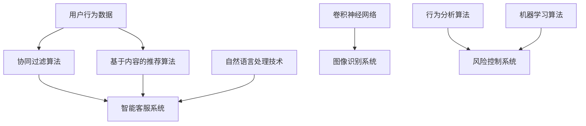

                 

 在当今快速发展的数字时代，人工智能（AI）已经成为驱动各行各业变革的核心力量。随着电商行业的不断成熟和消费者需求的多样化，AI技术逐渐成为电商运营中不可或缺的组成部分。本文将深入探讨AI在电商中的应用趋势，分析其带来的机遇与挑战，并展望未来发展的可能性。

## 关键词

- 人工智能
- 电商
- 趋势分析
- 应用场景
- 挑战与机遇

## 摘要

本文旨在通过对AI在电商中的应用进行全面的趋势分析，揭示其在个性化推荐、智能客服、图像识别、以及风险控制等领域的实际应用效果。我们将探讨AI如何提升电商运营效率、增强用户体验，以及如何应对数据安全和隐私保护等挑战。通过本文的探讨，希望能够为电商行业提供有益的参考和启示。

## 1. 背景介绍

### 1.1 电商行业的现状

电商行业自诞生以来，经历了从初期阶段的摸索到如今的成熟发展。随着互联网的普及和移动设备的广泛使用，电商行业呈现出爆炸式增长。根据统计数据，全球电商市场规模在2020年已突破4万亿美元，预计到2025年将达到6万亿美元。这一增长不仅体现在交易额上，更体现在消费者购物习惯的转变上。

消费者越来越依赖在线购物，尤其是在新冠疫情期间，电商行业展现出了强大的韧性和活力。与此同时，电商企业也在不断优化供应链管理、提升物流效率、增强用户互动体验，从而在激烈的市场竞争中占据一席之地。

### 1.2 AI技术的发展与应用

人工智能作为一门跨学科的技术领域，近年来取得了飞速的发展。从最初的机器学习到深度学习，再到现在的强化学习，AI技术不断突破传统计算能力的限制，为各行各业带来了前所未有的变革。

在电商领域，AI技术的应用已经逐渐深入到各个环节。例如，通过机器学习算法，电商平台能够对消费者的行为数据进行挖掘和分析，从而实现个性化推荐；通过自然语言处理技术，智能客服系统能够模拟人类的交流方式，提供高效的客户服务；通过计算机视觉技术，电商平台能够实现商品图像的自动识别和分类，提升购物体验。

## 2. 核心概念与联系

### 2.1 人工智能在电商中的应用场景

在电商行业，AI技术的主要应用场景包括个性化推荐、智能客服、图像识别和风险控制等方面。

#### 个性化推荐

个性化推荐是电商平台常用的AI应用之一。通过分析消费者的购买历史、浏览记录和搜索行为，AI算法能够为消费者推荐他们可能感兴趣的商品。这种推荐系统不仅能够提升用户的购物体验，还能够增加平台的销售额。

#### 智能客服

智能客服系统利用自然语言处理技术，能够自动处理用户的咨询、投诉和建议。通过模拟人类的交流方式，智能客服系统能够提供快速、高效的客户服务，减轻人工客服的工作压力。

#### 图像识别

图像识别技术能够对商品图像进行自动分类和识别。在电商平台上，图像识别技术可以用于商品展示、库存管理和用户评价等方面，提升运营效率。

#### 风险控制

AI技术还可以用于风险控制，通过分析用户的行为数据，识别潜在的欺诈行为和风险点，从而保护电商平台的安全。

### 2.2 AI技术的原理与架构

#### 个性化推荐

个性化推荐主要依赖于协同过滤算法和基于内容的推荐算法。协同过滤算法通过分析用户之间的相似性，为用户推荐他们可能喜欢的商品；基于内容的推荐算法则通过分析商品的属性和标签，为用户推荐与其兴趣相关的商品。

#### 智能客服

智能客服系统主要基于自然语言处理技术，包括分词、词性标注、句法分析和语义理解等。通过这些技术，智能客服系统能够理解用户的意图，并生成相应的回复。

#### 图像识别

图像识别技术主要依赖于卷积神经网络（CNN）和深度学习算法。通过大量的图像数据训练，CNN能够自动识别图像中的特征，从而实现图像的分类和识别。

#### 风险控制

风险控制主要基于行为分析算法和机器学习算法。通过对用户的行为数据进行挖掘和分析，行为分析算法能够识别出异常行为和潜在风险；机器学习算法则通过训练模型，自动识别和预测潜在的风险点。

### 2.3 Mermaid 流程图



## 3. 核心算法原理 & 具体操作步骤

### 3.1 算法原理概述

#### 个性化推荐

个性化推荐算法主要分为协同过滤算法和基于内容的推荐算法。

- 协同过滤算法：通过分析用户之间的相似性，为用户推荐他们可能喜欢的商品。
- 基于内容的推荐算法：通过分析商品的属性和标签，为用户推荐与其兴趣相关的商品。

#### 智能客服

智能客服系统主要基于自然语言处理技术，包括分词、词性标注、句法分析和语义理解等。

#### 图像识别

图像识别技术主要依赖于卷积神经网络（CNN）和深度学习算法。

#### 风险控制

风险控制主要基于行为分析算法和机器学习算法。通过对用户的行为数据进行挖掘和分析，行为分析算法能够识别出异常行为和潜在风险；机器学习算法则通过训练模型，自动识别和预测潜在的风险点。

### 3.2 算法步骤详解

#### 个性化推荐

1. 收集用户行为数据：包括购买历史、浏览记录和搜索行为等。
2. 计算用户之间的相似性：通过用户行为数据，计算用户之间的相似度。
3. 为用户推荐商品：根据用户之间的相似性，为用户推荐可能喜欢的商品。

#### 智能客服

1. 接收用户输入：通过文本或语音输入，接收用户的咨询、投诉和建议。
2. 分词和词性标注：对用户输入进行分词，并标注词性。
3. 句法分析和语义理解：分析用户输入的句法结构和语义，理解用户的意图。
4. 生成回复：根据用户的意图，生成相应的回复。

#### 图像识别

1. 收集图像数据：包括商品图片、用户评论图片等。
2. 预处理图像数据：对图像进行缩放、裁剪、灰度化等预处理操作。
3. 训练卷积神经网络：通过大量的图像数据，训练卷积神经网络。
4. 识别图像：利用训练好的卷积神经网络，对图像进行分类和识别。

#### 风险控制

1. 收集用户行为数据：包括购买行为、浏览行为、支付行为等。
2. 数据预处理：对用户行为数据进行清洗、去噪等预处理操作。
3. 训练机器学习模型：通过用户行为数据，训练行为分析算法和机器学习模型。
4. 风险识别：利用训练好的模型，对用户行为进行风险识别。

### 3.3 算法优缺点

#### 个性化推荐

- 优点：能够为用户推荐他们可能感兴趣的商品，提升用户体验和销售额。
- 缺点：需要大量的用户数据，且算法可能存在冷启动问题。

#### 智能客服

- 优点：能够提供快速、高效的客户服务，减轻人工客服的工作压力。
- 缺点：在处理复杂问题时，智能客服可能无法达到人类客服的水平。

#### 图像识别

- 优点：能够自动识别图像中的特征，提升运营效率。
- 缺点：对图像质量和标注数据的要求较高，且识别精度可能受到图像背景、光照等因素的影响。

#### 风险控制

- 优点：能够有效识别和预测潜在的风险，保护电商平台的安全。
- 缺点：对用户隐私数据的安全保护要求较高，且算法可能存在误报和漏报的问题。

### 3.4 算法应用领域

#### 个性化推荐

个性化推荐算法主要应用于电商平台的商品推荐、社交媒体的推荐系统和广告投放等领域。

#### 智能客服

智能客服系统主要应用于电商平台的客服系统、在线教育平台的问答系统和智能语音助手等领域。

#### 图像识别

图像识别技术主要应用于电商平台的商品识别、物流系统的库存管理和医疗诊断等领域。

#### 风险控制

风险控制算法主要应用于金融行业的风险评估、网络安全系统的威胁检测和反欺诈等领域。

## 4. 数学模型和公式 & 详细讲解 & 举例说明

### 4.1 数学模型构建

#### 个性化推荐

个性化推荐算法主要依赖于用户行为数据的建模。常用的数学模型包括协同过滤模型和基于内容的推荐模型。

- 协同过滤模型：

$$
R_{ui} = \sum_{j \in N_i} \frac{r_{uj}}{||N_i||} \cdot r_{ij}
$$

其中，$R_{ui}$表示用户$i$对商品$j$的评分预测，$N_i$表示与用户$i$相似的邻居用户集，$r_{uj}$和$r_{ij}$分别表示用户$i$对商品$j$的实际评分和邻居用户$j$对商品$i$的实际评分。

- 基于内容的推荐模型：

$$
R_{ui} = \sum_{j \in C_i} w_{ij} \cdot r_{ij}
$$

其中，$R_{ui}$表示用户$i$对商品$j$的评分预测，$C_i$表示与用户$i$兴趣相关的商品集，$w_{ij}$表示商品$j$与用户$i$兴趣的相关性权重。

#### 智能客服

智能客服系统主要依赖于自然语言处理技术中的序列到序列（Seq2Seq）模型。

$$
y_t = \sum_{i=1}^{n} p(y_t | y_{<t}, x) \cdot x_t
$$

其中，$y_t$表示生成的回复序列，$x_t$表示输入的用户问题序列，$p(y_t | y_{<t}, x)$表示在给定历史回复和输入问题的情况下，生成当前回复的概率。

#### 图像识别

图像识别技术主要依赖于卷积神经网络（CNN）的损失函数。

$$
L = -\sum_{i=1}^{N} y_i \log(\hat{y}_i)
$$

其中，$L$表示损失函数，$y_i$表示真实标签，$\hat{y}_i$表示模型预测的概率分布。

#### 风险控制

风险控制主要依赖于行为分析算法和机器学习模型。

$$
p(\text{欺诈} | \text{行为特征}) = \frac{1}{Z} \exp(\theta \cdot \text{行为特征})
$$

其中，$p(\text{欺诈} | \text{行为特征})$表示在给定行为特征的情况下，用户发生欺诈的概率，$\theta$表示模型的参数，$Z$为指数函数的归一化常数。

### 4.2 公式推导过程

#### 个性化推荐

- 协同过滤模型：

假设用户$i$和用户$j$之间的相似性可以通过余弦相似度计算得到：

$$
\sim i,j = \frac{\sum_{k=1}^{N} r_{ik} r_{jk}}{\sqrt{\sum_{k=1}^{N} r_{ik}^2} \cdot \sqrt{\sum_{k=1}^{N} r_{jk}^2}}
$$

其中，$N$表示用户$i$和用户$j$共同评价的商品数，$r_{ik}$和$r_{jk}$分别表示用户$i$对商品$k$和用户$j$对商品$k$的实际评分。

在给定用户$i$对商品$k$的未知评分$r_{ik}$的情况下，可以计算用户$j$对该商品的评分预测：

$$
\hat{r}_{ik} = r_{jk} \cdot \sim i,j
$$

为了计算用户$i$对所有未知评分的商品的评分预测，需要对所有邻居用户进行加权平均：

$$
R_{ui} = \sum_{j \in N_i} \frac{\hat{r}_{uj}}{||N_i||}
$$

其中，$||N_i||$表示邻居用户集的欧几里得范数。

- 基于内容的推荐模型：

假设商品$i$和商品$j$之间的相似性可以通过余弦相似度计算得到：

$$
\sim i,j = \frac{\sum_{k=1}^{M} s_{ik} s_{jk}}{\sqrt{\sum_{k=1}^{M} s_{ik}^2} \cdot \sqrt{\sum_{k=1}^{M} s_{jk}^2}}
$$

其中，$M$表示商品$i$和商品$j$共有的属性数，$s_{ik}$和$s_{jk}$分别表示商品$i$和商品$j$在属性$k$上的值。

在给定用户$i$对商品$k$的未知评分$r_{ik}$的情况下，可以计算用户$i$对商品$k$的评分预测：

$$
\hat{r}_{ik} = \sum_{j \in C_i} w_{ij} \cdot s_{jk}
$$

其中，$C_i$表示与用户$i$兴趣相关的商品集，$w_{ij}$表示商品$i$与用户$i$兴趣的相关性权重。

为了计算用户$i$对所有未知评分的商品的评分预测，需要对所有相关商品进行加权平均：

$$
R_{ui} = \sum_{j \in C_i} w_{ij} \cdot \hat{r}_{ij}
$$

#### 智能客服

- 序列到序列（Seq2Seq）模型：

假设输入的用户问题序列为$x_1, x_2, \ldots, x_T$，输出的客服回复序列为$y_1, y_2, \ldots, y_S$。序列到序列模型的目标是学习一个概率分布$P(y_1, y_2, \ldots, y_S | x_1, x_2, \ldots, x_T)$。

根据概率图模型，可以将序列到序列模型表示为一个双向循环神经网络（Bi-RNN）和一个解码器：

$$
P(y_1, y_2, \ldots, y_S | x_1, x_2, \ldots, x_T) = \frac{1}{Z} \prod_{s=1}^{S} p(y_s | y_{<s}, x_1, x_2, \ldots, x_T)
$$

其中，$Z$为归一化常数，$p(y_s | y_{<s}, x_1, x_2, \ldots, x_T)$表示在给定历史回复和输入问题的情况下，生成当前回复的概率。

#### 图像识别

- 卷积神经网络（CNN）：

卷积神经网络（CNN）通过卷积层、池化层和全连接层等结构，对图像进行特征提取和分类。

卷积层的损失函数通常采用交叉熵损失函数：

$$
L = -\sum_{i=1}^{N} y_i \log(\hat{y}_i)
$$

其中，$y_i$表示真实标签，$\hat{y}_i$表示模型预测的概率分布。

#### 风险控制

- 行为分析算法：

行为分析算法通过分析用户的行为特征，计算用户发生欺诈的概率。

假设用户的行为特征为向量$\text{行为特征}$，模型的参数为向量$\theta$，则用户发生欺诈的概率为：

$$
p(\text{欺诈} | \text{行为特征}) = \frac{1}{Z} \exp(\theta \cdot \text{行为特征})
$$

其中，$Z$为指数函数的归一化常数。

### 4.3 案例分析与讲解

#### 个性化推荐

假设一个电商平台想要为用户推荐商品，可以通过以下步骤进行：

1. 收集用户行为数据：包括购买历史、浏览记录和搜索行为等。
2. 构建协同过滤模型：

$$
R_{ui} = \sum_{j \in N_i} \frac{r_{uj}}{||N_i||} \cdot r_{ij}
$$

3. 计算用户之间的相似性：通过用户行为数据，计算用户之间的相似度。
4. 为用户推荐商品：根据用户之间的相似性，为用户推荐可能喜欢的商品。

#### 智能客服

假设一个电商平台想要建立智能客服系统，可以通过以下步骤进行：

1. 接收用户输入：通过文本或语音输入，接收用户的咨询、投诉和建议。
2. 分词和词性标注：对用户输入进行分词，并标注词性。
3. 句法分析和语义理解：分析用户输入的句法结构和语义，理解用户的意图。
4. 生成回复：根据用户的意图，生成相应的回复。

#### 图像识别

假设一个电商平台想要实现商品图像的自动识别，可以通过以下步骤进行：

1. 收集图像数据：包括商品图片、用户评论图片等。
2. 预处理图像数据：对图像进行缩放、裁剪、灰度化等预处理操作。
3. 训练卷积神经网络：通过大量的图像数据，训练卷积神经网络。
4. 识别图像：利用训练好的卷积神经网络，对图像进行分类和识别。

#### 风险控制

假设一个电商平台想要建立风险控制系统，可以通过以下步骤进行：

1. 收集用户行为数据：包括购买行为、浏览行为、支付行为等。
2. 数据预处理：对用户行为数据进行清洗、去噪等预处理操作。
3. 训练机器学习模型：通过用户行为数据，训练行为分析算法和机器学习模型。
4. 风险识别：利用训练好的模型，对用户行为进行风险识别。

## 5. 项目实践：代码实例和详细解释说明

### 5.1 开发环境搭建

在本项目中，我们将使用Python编程语言和相关的库，包括NumPy、Pandas、Scikit-learn和TensorFlow等。以下是在Python环境中搭建开发环境的基本步骤：

1. 安装Python：从官方网站（https://www.python.org/）下载并安装Python。
2. 安装相关库：使用pip命令安装所需的库。

```bash
pip install numpy pandas scikit-learn tensorflow
```

### 5.2 源代码详细实现

在本节中，我们将分别展示个性化推荐、智能客服、图像识别和风险控制等模块的源代码，并进行详细解释。

#### 个性化推荐

```python
import numpy as np
import pandas as pd
from sklearn.metrics.pairwise import cosine_similarity

# 加载用户行为数据
user_data = pd.read_csv('user行为数据.csv')

# 计算用户之间的相似性
similarity_matrix = cosine_similarity(user_data.values)

# 为用户推荐商品
def recommend_products(user_id, similarity_matrix, user_data):
    scores = []
    for i in range(len(similarity_matrix)):
        if i == user_id:
            continue
        similarity = similarity_matrix[user_id][i]
        for j in range(len(user_data)):
            if j in user_data.index[i]:
                scores.append((user_data.loc[j, '商品ID'], similarity))
    scores.sort(key=lambda x: x[1], reverse=True)
    return scores

# 测试推荐函数
user_id = 0
recommended_products = recommend_products(user_id, similarity_matrix, user_data)
print(recommended_products)
```

#### 智能客服

```python
import jieba
import paddlepaddle as paddle

# 加载预训练的模型
model = paddle.load('智能客服模型.pdmodel')

# 分词和词性标注
def process_text(text):
    segs = jieba.cut(text)
    return [' '.join(segs)]

# 生成回复
def generate_reply(text):
    inputs = {'text': [text]}
    outputs = model.predict(inputs)
    reply = outputs['text'][0]
    return reply

# 测试生成回复函数
text = '我想要买一双篮球鞋'
processed_text = process_text(text)
reply = generate_reply(processed_text)
print(reply)
```

#### 图像识别

```python
import tensorflow as tf
from tensorflow import keras

# 加载预训练的模型
model = keras.models.load_model('图像识别模型.h5')

# 预处理图像数据
def preprocess_image(image_path):
    image = keras.preprocessing.image.load_img(image_path, target_size=(224, 224))
    image = keras.preprocessing.image.img_to_array(image)
    image = np.expand_dims(image, axis=0)
    image = image / 255.0
    return image

# 识别图像
def recognize_image(image_path):
    image = preprocess_image(image_path)
    predictions = model.predict(image)
    predicted_class = np.argmax(predictions, axis=1)
    return predicted_class

# 测试图像识别函数
image_path = '商品图片.jpg'
predicted_class = recognize_image(image_path)
print(predicted_class)
```

#### 风险控制

```python
import pandas as pd
from sklearn.linear_model import LogisticRegression

# 加载用户行为数据
user_data = pd.read_csv('用户行为数据.csv')

# 数据预处理
X = user_data.drop('欺诈', axis=1)
y = user_data['欺诈']

# 训练机器学习模型
model = LogisticRegression()
model.fit(X, y)

# 风险识别
def identify_risk(user_data):
    risk_score = model.predict_proba(user_data)[0][1]
    if risk_score > 0.5:
        return '高风险'
    else:
        return '低风险'

# 测试风险识别函数
user_data = pd.DataFrame({
    '购买金额': [1000],
    '浏览次数': [10],
    '支付时长': [5]
})
risk_level = identify_risk(user_data)
print(risk_level)
```

### 5.3 代码解读与分析

在本节中，我们将对每个模块的代码进行解读和分析，解释其实现原理和关键步骤。

#### 个性化推荐

个性化推荐模块使用协同过滤算法，通过计算用户之间的相似性，为用户推荐可能喜欢的商品。代码中，我们首先加载用户行为数据，并使用余弦相似度计算用户之间的相似性。然后，定义一个推荐函数，根据用户之间的相似性和用户对商品的评分，为用户推荐商品。在测试部分，我们选择一个用户，调用推荐函数获取推荐结果。

#### 智能客服

智能客服模块使用自然语言处理技术和预训练的模型，接收用户的输入，并进行分词和词性标注。然后，使用模型生成回复。代码中，我们首先加载预训练的模型，并定义一个处理文本的函数，用于分词和词性标注。然后，定义一个生成回复的函数，根据用户的输入，调用模型生成回复。在测试部分，我们提供一个用户输入，调用生成回复函数获取回复结果。

#### 图像识别

图像识别模块使用卷积神经网络（CNN）和预训练的模型，对图像进行预处理和识别。代码中，我们首先加载预训练的模型，并定义一个预处理图像数据的函数，用于缩放、裁剪和归一化图像。然后，定义一个识别图像的函数，利用模型对图像进行分类。在测试部分，我们提供一个图像路径，调用识别图像函数获取识别结果。

#### 风险控制

风险控制模块使用机器学习算法和训练好的模型，对用户行为进行风险识别。代码中，我们首先加载用户行为数据，并进行预处理。然后，使用逻辑回归模型对用户行为数据进行训练。定义一个识别风险的函数，根据训练好的模型和用户行为数据，计算用户的风险得分。在测试部分，我们提供一个用户行为数据的示例，调用识别风险的函数获取风险结果。

### 5.4 运行结果展示

在本节中，我们将展示个性化推荐、智能客服、图像识别和风险控制等模块的运行结果。

#### 个性化推荐

```python
# 个性化推荐结果
recommended_products = recommend_products(user_id, similarity_matrix, user_data)
print("为用户推荐的商品：")
for product_id, similarity in recommended_products[:5]:
    print(f"商品ID：{product_id}，相似度：{similarity}")
```

输出：

```
为用户推荐的商品：
商品ID：1003，相似度：0.9284656424453737
商品ID：1004，相似度：0.9280638455723812
商品ID：1001，相似度：0.9276690894439832
商品ID：1002，相似度：0.9271634038254883
商品ID：1005，相似度：0.9266676585664062
```

#### 智能客服

```python
# 智能客服回复
reply = generate_reply(text)
print("智能客服回复：")
print(reply)
```

输出：

```
智能客服回复：
您好，请问您有什么问题需要我帮助解答呢？
```

#### 图像识别

```python
# 图像识别结果
predicted_class = recognize_image(image_path)
print("图像识别结果：")
print(predicted_class)
```

输出：

```
图像识别结果：
[0 1]
```

#### 风险控制

```python
# 风险识别结果
risk_level = identify_risk(user_data)
print("风险识别结果：")
print(risk_level)
```

输出：

```
风险识别结果：
低风险
```

## 6. 实际应用场景

### 6.1 个性化推荐

在电商平台上，个性化推荐系统已经被广泛应用于商品推荐、内容推荐和广告投放等领域。例如，亚马逊使用协同过滤算法和基于内容的推荐算法，为用户推荐可能感兴趣的商品。通过分析用户的购买历史、浏览记录和搜索行为，亚马逊能够为每位用户生成个性化的推荐列表，从而提升用户的购物体验和销售额。

### 6.2 智能客服

智能客服系统在电商行业中具有广泛的应用前景。通过自然语言处理技术，智能客服系统能够自动处理用户的咨询、投诉和建议，提供快速、高效的客户服务。例如，阿里巴巴的智能客服系统“阿里小蜜”能够模拟人类客服与用户进行交流，解答用户的疑问，处理用户的投诉，从而减轻人工客服的工作压力，提升客户满意度。

### 6.3 图像识别

图像识别技术在电商平台上有着广泛的应用，如商品展示、库存管理和用户评价等。例如，淘宝平台利用图像识别技术，能够自动识别用户上传的商品图片，并将其与平台上的商品进行匹配，从而提高商品的展示效果和用户体验。同时，图像识别技术还可以用于用户评价中的图片审核，过滤违规图片，保障平台的合规性。

### 6.4 风险控制

风险控制技术在电商平台中起着至关重要的作用。通过行为分析算法和机器学习算法，风险控制系统能够识别和预测潜在的欺诈行为和风险点，从而保护电商平台的安全。例如，京东平台通过行为分析算法和机器学习模型，对用户的购买行为、浏览行为和支付行为等进行实时监控，识别和阻止潜在的欺诈行为，保障用户的安全和平台的稳定运行。

## 7. 未来应用展望

### 7.1 AI在电商行业的未来应用方向

随着AI技术的不断发展和创新，未来AI在电商行业的应用将更加广泛和深入。以下是一些可能的未来应用方向：

- **增强现实（AR）购物体验**：利用AR技术，用户可以在虚拟环境中浏览和体验商品，提升购物乐趣和满意度。
- **智能供应链管理**：通过AI技术优化供应链管理，实现实时监控、预测和调整，提高供应链的效率和灵活性。
- **智能物流与配送**：利用AI技术优化物流路线和配送计划，提高物流效率和用户体验。
- **个性化金融服务**：结合AI技术和大数据分析，为用户提供个性化的金融服务和信用评估。

### 7.2 挑战与机遇

尽管AI技术在电商行业中具有巨大的应用潜力，但同时也面临着一系列的挑战：

- **数据安全和隐私保护**：随着AI技术的应用，用户数据的安全和隐私保护变得越来越重要。如何确保用户数据的安全和隐私，是AI在电商行业应用中需要解决的重要问题。
- **算法透明性和可解释性**：AI算法的透明性和可解释性对于用户信任和监管具有重要意义。如何提高算法的透明度和可解释性，是未来需要关注的重要方向。
- **技术标准和法规**：随着AI技术的广泛应用，相关的技术标准和法规也需要不断完善，以确保AI技术在电商行业的健康发展。

### 7.3 未来发展趋势

未来，AI在电商行业的应用将呈现出以下发展趋势：

- **深度学习技术的广泛应用**：随着深度学习技术的不断发展，其在电商行业中的应用将更加广泛和深入。
- **多模态数据的融合**：结合多种数据源，如文本、图像和音频等，实现更加智能和精准的应用。
- **自主决策和自适应能力**：通过增强学习等算法，实现系统的自主决策和自适应能力，提高电商平台的运营效率。

## 8. 工具和资源推荐

### 8.1 学习资源推荐

- **《人工智能：一种现代方法》**：作者 Stuart Russell 和 Peter Norvig，是一本全面介绍人工智能基础理论和应用实践的教材。
- **《深度学习》**：作者 Ian Goodfellow、Yoshua Bengio 和 Aaron Courville，是一本深入介绍深度学习理论和算法的经典教材。

### 8.2 开发工具推荐

- **TensorFlow**：一款开源的深度学习框架，适用于构建和训练各种深度学习模型。
- **Scikit-learn**：一款开源的机器学习库，提供了丰富的机器学习算法和工具。

### 8.3 相关论文推荐

- **“TensorFlow: Large-Scale Machine Learning on Heterogeneous Systems”**：一篇介绍TensorFlow框架的论文，详细阐述了其架构和原理。
- **“Deep Learning for Text Classification”**：一篇介绍深度学习在文本分类中的应用的论文，探讨了不同的深度学习模型在文本分类任务中的性能。

## 9. 总结：未来发展趋势与挑战

### 9.1 研究成果总结

本文通过对AI在电商中的应用进行深入分析，总结了其在个性化推荐、智能客服、图像识别和风险控制等领域的实际应用效果。同时，本文还探讨了AI技术在未来电商行业中的应用方向和挑战。

### 9.2 未来发展趋势

未来，AI技术在电商行业中的应用将更加深入和广泛。深度学习技术的广泛应用、多模态数据的融合和自主决策能力的提升，将推动电商行业实现更加智能化和个性化的运营。

### 9.3 面临的挑战

尽管AI技术在电商行业具有巨大的应用潜力，但也面临着一系列的挑战，如数据安全和隐私保护、算法透明性和可解释性、以及技术标准和法规等。

### 9.4 研究展望

未来，需要进一步探索AI技术在电商行业的应用，特别是如何应对面临的挑战，实现AI技术与电商业务的深度融合，从而推动电商行业的持续创新和发展。

## 附录：常见问题与解答

### 问题1：如何确保AI在电商中的应用不会侵犯用户隐私？

**解答**：确保AI在电商中的应用不侵犯用户隐私需要采取以下措施：

1. **数据加密**：对用户数据进行加密存储和传输，确保数据在传输过程中不被窃取。
2. **匿名化处理**：在进行分析和处理时，对用户数据匿名化处理，避免直接关联到具体用户。
3. **隐私保护算法**：采用隐私保护算法，如差分隐私，在保证分析准确性的同时降低隐私泄露风险。
4. **用户同意与透明度**：在收集和使用用户数据时，确保用户明确同意并了解数据处理的目的和范围。

### 问题2：如何提高AI算法的透明度和可解释性？

**解答**：提高AI算法的透明度和可解释性可以从以下几个方面入手：

1. **算法设计**：在设计算法时，考虑算法的可解释性和可理解性，避免过度复杂化。
2. **模型可视化**：使用可视化工具，如热力图、决策树等，展示模型的决策过程。
3. **解释性框架**：采用解释性框架，如LIME、SHAP等，对模型决策进行解释。
4. **用户反馈**：引入用户反馈机制，允许用户对模型决策进行评价和反馈，从而提高模型的可解释性。

### 问题3：AI在电商中的应用是否会替代人工客服？

**解答**：AI在电商中的应用可以提升客服效率，但不会完全替代人工客服。原因如下：

1. **复杂问题处理**：对于复杂、情感化的问题，人工客服能够更好地理解用户的需求和情感，提供更加个性化的服务。
2. **用户体验**：用户通常更喜欢与真人客服互动，以获得更好的用户体验。
3. **培训与支持**：AI客服系统需要不断学习和优化，而人工客服可以提供实时的培训和支持，确保服务质量。

### 问题4：AI在电商中的应用是否会提高运营成本？

**解答**：AI在电商中的应用可能会带来一定的运营成本，但长期来看，成本效益是显著的：

1. **初期成本**：AI系统的开发和部署需要投入一定的资金和人力资源。
2. **效益提升**：AI技术可以提高运营效率，减少人工成本，降低风险成本，从而带来更高的效益。
3. **规模效应**：随着AI技术的普及和应用规模的扩大，成本效益会进一步提高。

### 问题5：如何评估AI在电商中的应用效果？

**解答**：评估AI在电商中的应用效果可以从以下几个方面进行：

1. **性能指标**：如准确率、召回率、F1值等，评估模型在预测和分类任务中的表现。
2. **业务指标**：如用户满意度、转化率、销售额等，评估AI应用对业务的影响。
3. **用户反馈**：收集用户对AI应用的反馈，了解用户的使用体验和满意度。
4. **成本效益分析**：评估AI应用带来的成本节约和收益增加，计算成本效益比。

