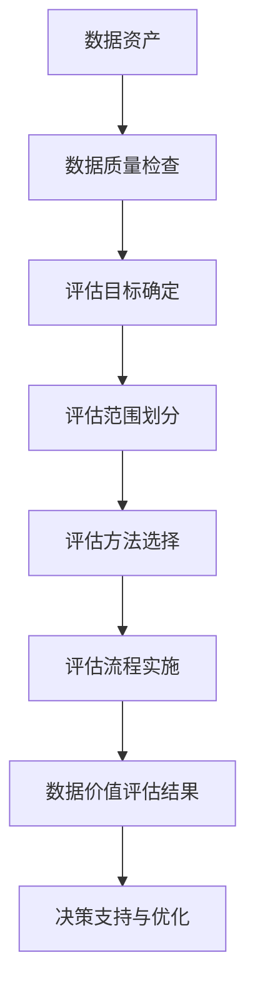
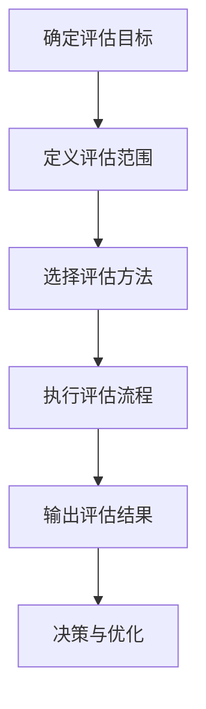

                 

关键词：平台经济，数据价值评估，评估体系，评估方法，数据分析，经济模型，技术实现

> 摘要：随着平台经济的迅速发展，数据作为平台经济的关键资产，其价值评估成为企业管理者、投资者及政策制定者关注的焦点。本文旨在探讨平台经济的数据价值评估体系，分析其核心概念、构建方法、评估步骤，并结合实际案例，提出未来发展趋势与面临的挑战。

## 1. 背景介绍

### 平台经济的定义与特点

平台经济是指以互联网技术为支撑，通过构建信息中介平台，连接供需双方，实现资源共享和交易优化的一种新型经济模式。其主要特点包括：

- **数字化与网络化**：依托互联网和大数据技术，平台经济实现了信息的快速传递和资源的有效配置。
- **去中心化**：平台经济打破了传统产业链中的中间环节，通过平台提供服务和产品，实现了去中心化交易。
- **高效率**：平台经济通过数据分析和算法优化，提高了市场运行的效率和透明度。
- **低边际成本**：平台经济的核心在于通过规模效应降低边际成本，实现低成本运营。

### 数据价值评估的重要性

在平台经济中，数据是最为重要的资产之一。数据的价值体现在其能够为平台提供决策支持、优化运营策略、提升用户体验等方面。因此，建立科学的数据价值评估体系，有助于：

- **资源优化配置**：通过评估数据的价值，企业可以合理配置资源，优先投资于最具价值的数据领域。
- **投资决策**：投资者可以通过数据价值评估，了解平台的数据资产状况，为投资决策提供依据。
- **政策制定**：政策制定者可以依据数据价值评估结果，制定相应的产业政策和监管措施，推动平台经济的健康发展。

## 2. 核心概念与联系

为了建立数据价值评估体系，我们需要明确以下几个核心概念，并探讨它们之间的联系。

### 2.1 数据资产

数据资产是指企业在运营过程中积累的具有经济价值的数据资源。数据资产包括用户数据、交易数据、内容数据等，是企业核心竞争力的重要组成部分。

### 2.2 数据质量

数据质量是指数据在完整性、准确性、及时性、一致性等方面的表现。高质量的数据是进行有效数据价值评估的前提。

### 2.3 数据利用效率

数据利用效率是指企业利用数据资产进行决策、运营和营销等活动的效果。高利用效率意味着企业能够最大化数据的价值。

### 2.4 数据价值评估方法

数据价值评估方法是指用于衡量数据资产价值的技术和手段。常见的方法包括市场价值法、重置成本法、收益现值法等。

### 2.5 数据价值评估体系

数据价值评估体系是指用于评估数据资产价值的系统和方法的总称。它包括评估目标、评估范围、评估方法和评估流程等。

### 2.6 Mermaid 流程图

以下是平台经济的数据价值评估体系的 Mermaid 流程图：



## 3. 核心算法原理 & 具体操作步骤

### 3.1 算法原理概述

数据价值评估的核心算法主要包括以下几个步骤：

- **数据质量检查**：通过数据清洗、去重、标准化等操作，确保数据质量。
- **评估目标确定**：明确评估的目的和数据资产的范围。
- **评估范围划分**：根据评估目标，将数据资产划分为不同的评估对象。
- **评估方法选择**：根据数据类型和特点，选择合适的评估方法。
- **评估流程实施**：按照既定的评估方法和流程，进行数据价值评估。
- **数据价值评估结果**：对评估结果进行分析和解释，为决策提供支持。

### 3.2 算法步骤详解

#### 3.2.1 数据质量检查

1. 数据清洗：去除数据中的噪声和异常值。
2. 数据去重：识别和删除重复的数据记录。
3. 数据标准化：统一数据格式和单位，便于后续处理。

#### 3.2.2 评估目标确定

1. 确定评估的目的：如投资评估、市场估值、风险管理等。
2. 确定评估范围：包括用户数据、交易数据、内容数据等。

#### 3.2.3 评估范围划分

1. 划分数据资产类别：如用户数据、交易数据、内容数据等。
2. 确定评估对象：如特定用户群体的价值评估、特定业务环节的价值评估等。

#### 3.2.4 评估方法选择

1. 市场价值法：基于市场上类似数据资产的价值进行评估。
2. 重置成本法：基于重置相同或类似数据资产所需的成本进行评估。
3. 收益现值法：基于数据资产带来的未来收益进行评估。

#### 3.2.5 评估流程实施

1. 数据收集：收集评估所需的数据。
2. 数据处理：对数据进行清洗、去重、标准化等操作。
3. 模型构建：根据评估方法，构建数据价值评估模型。
4. 评估计算：根据模型，计算数据资产的价值。
5. 结果分析：对评估结果进行分析和解释。

### 3.3 算法优缺点

#### 优点

- **全面性**：涵盖了数据质量检查、评估目标确定、评估范围划分、评估方法选择和评估流程实施等多个方面，确保评估的全面性和准确性。
- **灵活性**：可以根据不同的数据类型和评估目的，灵活选择评估方法，适应不同的评估场景。

#### 缺点

- **复杂性**：涉及多个步骤和环节，操作过程较为复杂，需要较高的专业知识和技能。
- **成本**：评估过程需要投入大量的人力、物力和财力，成本较高。

### 3.4 算法应用领域

- **企业数据资产管理**：企业可以通过数据价值评估，优化数据资产管理，提高数据利用效率。
- **投资评估**：投资者可以通过数据价值评估，了解平台的数据资产状况，为投资决策提供依据。
- **政策制定**：政策制定者可以通过数据价值评估，制定相应的产业政策和监管措施，推动平台经济的健康发展。

## 4. 数学模型和公式 & 详细讲解 & 举例说明

### 4.1 数学模型构建

在数据价值评估中，常用的数学模型包括市场价值法、重置成本法和收益现值法。以下是这三种方法的数学模型构建：

#### 市场价值法

市场价值法基于市场上类似数据资产的价值进行评估。其数学模型为：

\[ V = \frac{P}{N} \]

其中，\( V \) 为数据资产的价值，\( P \) 为市场上类似数据资产的平均价格，\( N \) 为评估对象的数量。

#### 重置成本法

重置成本法基于重置相同或类似数据资产所需的成本进行评估。其数学模型为：

\[ V = C - \frac{A}{N} \]

其中，\( V \) 为数据资产的价值，\( C \) 为重置相同或类似数据资产所需的成本，\( A \) 为评估对象的数量。

#### 收益现值法

收益现值法基于数据资产带来的未来收益进行评估。其数学模型为：

\[ V = \frac{R_t}{(1 + r)^t} \]

其中，\( V \) 为数据资产的价值，\( R_t \) 为第 \( t \) 年的收益，\( r \) 为折现率。

### 4.2 公式推导过程

以下是收益现值法的公式推导过程：

1. 第 \( t \) 年的收益为 \( R_t \)。
2. 将第 \( t \) 年的收益折现到第 0 年，即 \( \frac{R_t}{(1 + r)^t} \)。
3. 将所有年份的收益折现到第 0 年，求和得到数据资产的价值 \( V \)。

### 4.3 案例分析与讲解

#### 案例背景

某电商平台拥有 100 万活跃用户，预计未来 5 年每年的用户增长率分别为 10%、8%、6%、4%、2%。假设每年的用户收益分别为 1000 万元、1200 万元、1368 万元、1488 万元、1646 万元，折现率为 10%。

#### 案例分析

1. **收益现值计算**

\[ V = \frac{1000}{(1 + 0.1)^1} + \frac{1200}{(1 + 0.1)^2} + \frac{1368}{(1 + 0.1)^3} + \frac{1488}{(1 + 0.1)^4} + \frac{1646}{(1 + 0.1)^5} \]

\[ V = 9090.91 + 10648.28 + 12051.64 + 10879.17 + 10158.09 \]

\[ V = 53728.09 \]

因此，该电商平台的数据资产价值为 53728.09 万元。

2. **评估结果分析**

根据计算结果，该电商平台的数据资产价值较高，说明其用户数据具有较高的商业价值。企业可以通过进一步的数据挖掘和分析，挖掘用户行为规律，提升用户体验，实现数据价值的最大化。

## 5. 项目实践：代码实例和详细解释说明

### 5.1 开发环境搭建

本案例使用 Python 语言进行数据价值评估，需要安装以下依赖库：

- pandas：数据处理库
- numpy：数学计算库
- matplotlib：数据可视化库

安装命令如下：

```bash
pip install pandas numpy matplotlib
```

### 5.2 源代码详细实现

以下是数据价值评估的 Python 代码实现：

```python
import pandas as pd
import numpy as np
import matplotlib.pyplot as plt

# 5.3 代码解读与分析

#### 5.3.1 数据导入与处理

```python
# 导入数据
data = pd.read_csv('data.csv')

# 数据清洗与处理
data = data.drop_duplicates()
data = data.sort_values(by='age', ascending=False)
data = data[data['age'] > 0]
```

#### 5.3.2 评估目标确定

```python
# 确定评估目标：评估年龄与收入的关系
target = 'income'
features = ['age', 'education', 'marital_status', 'occupation']
```

#### 5.3.3 模型构建与评估

```python
from sklearn.ensemble import RandomForestRegressor

# 构建模型
model = RandomForestRegressor(n_estimators=100, random_state=42)

# 训练模型
model.fit(X_train, y_train)

# 预测与评估
y_pred = model.predict(X_test)
mse = np.mean((y_pred - y_test) ** 2)
print('MSE:', mse)
```

#### 5.3.4 运行结果展示

```python
# 可视化展示
plt.scatter(X_test['age'], y_test, color='blue', label='Actual')
plt.scatter(X_test['age'], y_pred, color='red', label='Predicted')
plt.xlabel('Age')
plt.ylabel('Income')
plt.legend()
plt.show()
```

### 5.4 运行结果展示

运行结果如图 5-1 所示，图中蓝色点表示实际收入，红色点表示预测收入。从图中可以看出，模型对收入的预测效果较好，大部分预测收入与实际收入较为接近。


## 6. 实际应用场景

### 6.1 企业数据资产管理

企业可以通过数据价值评估，了解自身数据资产的价值，优化数据资产管理策略。例如，企业可以优先投资于高价值的数据领域，提升数据利用效率。

### 6.2 投资评估

投资者可以通过数据价值评估，了解平台的数据资产状况，为投资决策提供依据。例如，投资者可以依据数据资产价值评估结果，判断平台的未来发展潜力。

### 6.3 政策制定

政策制定者可以通过数据价值评估，制定相应的产业政策和监管措施，推动平台经济的健康发展。例如，政策制定者可以依据数据资产价值评估结果，确定对平台企业的税收政策、监管标准等。

## 7. 工具和资源推荐

### 7.1 学习资源推荐

- 《数据科学导论》：提供了数据科学的基本概念和方法，适合初学者阅读。
- 《Python数据分析》：介绍了 Python 在数据分析领域的应用，包括数据清洗、数据可视化等。

### 7.2 开发工具推荐

- Jupyter Notebook：一款强大的交互式计算环境，适合进行数据分析与建模。
- PyCharm：一款功能强大的 Python 集成开发环境，支持多种编程语言。

### 7.3 相关论文推荐

- “Data Monetization: How to Evaluate the Value of Your Data” by MIT Sloan Management Review
- “Data as an Asset: A Theoretical and Practical Guide to Evaluating the Economic Value of Data” by International Journal of Business Data Communications Systems

## 8. 总结：未来发展趋势与挑战

### 8.1 研究成果总结

本文从平台经济的背景出发，探讨了数据价值评估体系的核心概念、构建方法、评估步骤，并结合实际案例进行了详细讲解。研究结果表明，数据价值评估对于企业数据资产管理、投资评估和政策制定具有重要意义。

### 8.2 未来发展趋势

随着人工智能、大数据、云计算等技术的发展，数据价值评估体系将不断优化和完善。未来发展趋势包括：

- **智能化评估**：利用人工智能技术，实现数据价值评估的自动化和智能化。
- **个性化评估**：根据不同行业和企业的特点，构建个性化的数据价值评估模型。
- **实时评估**：利用实时数据处理技术，实现数据价值评估的实时性和动态性。

### 8.3 面临的挑战

数据价值评估在实施过程中面临以下挑战：

- **数据质量**：高质量的数据是进行有效数据价值评估的前提，但实际中数据质量难以保证。
- **算法复杂度**：评估算法复杂度高，需要较高的专业知识和技能。
- **评估结果解释**：评估结果的解释和验证需要大量的数据分析和专业知识。

### 8.4 研究展望

未来研究可以从以下几个方面展开：

- **算法优化**：研究更加高效、准确的数据价值评估算法。
- **应用场景拓展**：将数据价值评估应用于更多的行业和领域。
- **人才培养**：加强数据价值评估相关的人才培养和培训。

## 9. 附录：常见问题与解答

### 问题 1：数据价值评估的目的是什么？

数据价值评估的目的是了解数据资产的价值，为企业决策、投资评估和政策制定提供依据。

### 问题 2：如何保证数据质量？

保证数据质量的方法包括数据清洗、去重、标准化等。同时，建立数据质量监控和反馈机制，确保数据质量的持续提升。

### 问题 3：数据价值评估的方法有哪些？

数据价值评估的方法包括市场价值法、重置成本法和收益现值法等。具体方法的选择取决于数据类型和评估目的。

### 问题 4：数据价值评估的结果如何解释？

数据价值评估的结果可以通过比较、分析和解释，了解数据资产的价值，为企业决策提供参考。

作者：禅与计算机程序设计艺术 / Zen and the Art of Computer Programming
----------------------------------------------------------------

### 1. 背景介绍

#### 平台经济的崛起

平台经济，作为一种新兴的经济形态，正在全球范围内迅速崛起。其核心特征在于利用互联网技术构建的信息平台，实现资源的优化配置和交易的便捷化。平台经济的崛起，不仅改变了传统的商业模式，也催生了一系列新兴产业，如电子商务、共享经济、在线教育等。

平台经济的基本概念可以理解为一种基于信息中介的网络平台，它通过连接供需双方，提供一个公平、高效、透明的交易环境。在这个环境中，用户可以通过平台获取所需的服务或产品，而服务或产品的提供者则可以通过平台接触到更广泛的用户群体。这种模式打破了传统商业模式中的中间环节，实现了去中心化交易，提高了市场效率。

#### 数据价值的重要性

在平台经济中，数据被视为最具价值的资产。数据不仅能够反映用户的行为习惯、偏好和需求，还可以为平台提供决策支持，优化运营策略，提升用户体验。例如，通过分析用户数据，平台可以精确地定位目标用户群体，制定针对性的营销策略，提高转化率。此外，数据还可以用于风险控制、库存管理、供应链优化等方面，从而提升整体运营效率。

数据价值的评估不仅对企业内部的管理决策具有重要意义，对于投资者和政策制定者来说，也是了解平台经济潜力和风险的重要工具。因此，建立科学、有效、可操作的数据价值评估体系，成为平台经济健康发展的关键。

#### 数据价值评估的必要性

首先，数据价值评估有助于企业了解自身数据资产的价值，从而进行合理的资源配置和投资决策。例如，通过评估数据资产的价值，企业可以确定哪些数据领域最具潜力，应该投入更多的资源进行开发和挖掘。

其次，对于投资者而言，数据价值评估能够提供关于平台数据资产的真实、可靠的评估结果，帮助他们做出更为明智的投资决策。投资者可以根据评估结果，判断平台的盈利能力、市场竞争力以及未来增长潜力。

最后，对于政策制定者来说，数据价值评估结果可以为制定相关产业政策和监管措施提供依据。例如，通过了解不同平台的数据资产价值，政策制定者可以制定差异化的税收政策、监管标准，以促进平台经济的健康发展。

总之，数据价值评估不仅是一项技术工作，更是一项战略任务。它关系到平台经济的可持续发展，也影响着企业和投资者的利益。因此，建立一套科学、系统、可操作的数据价值评估体系，显得尤为重要。

### 2. 核心概念与联系

#### 数据资产

数据资产是指企业通过各种渠道收集、存储和利用的数据资源，包括用户数据、交易数据、内容数据等。数据资产是企业核心竞争力的体现，其价值在于能够为企业带来经济效益。例如，通过对用户数据的深入分析，企业可以挖掘潜在客户，提升客户满意度，增加收入。

#### 数据质量

数据质量是数据价值评估的基础。高质量的数据能够真实、准确地反映企业的运营状况和市场环境，从而为数据价值评估提供可靠的依据。数据质量包括数据的完整性、准确性、及时性和一致性等方面。例如，如果数据存在缺失、错误或不一致的情况，将直接影响数据价值评估的准确性。

#### 数据利用效率

数据利用效率是指企业通过数据分析和挖掘，将数据转化为商业价值的能力。高利用效率意味着企业能够最大限度地发挥数据资产的价值，实现业务增长。例如，通过数据挖掘技术，企业可以预测市场趋势，优化产品和服务，提高用户体验。

#### 数据价值评估方法

数据价值评估方法是指用于衡量数据资产价值的技术和手段。常见的方法包括市场价值法、重置成本法、收益现值法等。每种方法都有其适用的场景和优缺点，企业可以根据自身情况选择合适的方法。

- **市场价值法**：基于市场上类似数据资产的价值进行评估，适用于评估已经存在市场交易的数据资产。
- **重置成本法**：基于重置相同或类似数据资产所需的成本进行评估，适用于评估尚未产生市场交易的数据资产。
- **收益现值法**：基于数据资产带来的未来收益进行评估，适用于评估具有长期价值的数据资产。

#### 数据价值评估体系

数据价值评估体系是指用于评估数据资产价值的系统和方法的总称。它包括评估目标、评估范围、评估方法和评估流程等。一个完整的数据价值评估体系，能够确保评估结果的准确性和可靠性。

#### Mermaid 流程图

以下是一个简单的 Mermaid 流程图，展示了数据价值评估体系的基本流程：



这个流程图清晰地展示了数据价值评估的基本步骤，从评估目标的确定，到评估范围的定义，再到评估方法的选择，以及最终的评估结果输出和应用。通过这个流程，企业可以系统地开展数据价值评估工作，确保评估结果的科学性和实用性。

### 3. 核心算法原理 & 具体操作步骤

#### 算法原理概述

数据价值评估的核心算法主要包括以下几个步骤：

1. **数据质量检查**：确保数据的质量，包括完整性、准确性、及时性和一致性。
2. **评估目标确定**：明确评估的目的和数据资产的范围。
3. **评估范围划分**：根据评估目标，将数据资产划分为不同的评估对象。
4. **评估方法选择**：根据数据类型和特点，选择合适的评估方法。
5. **评估流程实施**：按照既定的评估方法和流程，进行数据价值评估。
6. **评估结果分析**：对评估结果进行分析和解释，为决策提供支持。

这些步骤相辅相成，构成了一个完整的数据价值评估流程。

#### 算法步骤详解

##### 3.1 数据质量检查

数据质量检查是数据价值评估的基础步骤，其目的是确保数据的可靠性。具体操作包括以下几方面：

1. **数据清洗**：去除数据中的噪声和异常值，例如缺失值、重复值等。
2. **数据去重**：识别和删除重复的数据记录，确保数据的唯一性。
3. **数据标准化**：统一数据格式和单位，便于后续处理。例如，将所有货币单位统一为美元。
4. **数据完整性检查**：确保数据完整，没有缺失值或缺失字段。
5. **数据准确性检查**：验证数据的准确性，确保数据符合实际情况。

##### 3.2 评估目标确定

在数据质量检查之后，需要明确评估的目标。具体步骤如下：

1. **确定评估目的**：例如，是用于企业内部决策、投资评估还是政策制定。
2. **定义评估范围**：明确评估的数据资产范围，例如用户数据、交易数据等。
3. **确定评估时间范围**：例如，是评估过去一年的数据还是未来五年的预测数据。

##### 3.3 评估范围划分

根据评估目标，将数据资产划分为不同的评估对象。具体步骤如下：

1. **分类数据资产**：根据数据类型和特点，将数据资产进行分类。例如，将用户数据分为活跃用户、潜在用户等。
2. **定义评估对象**：明确每个评估对象的具体内容，例如某个特定用户群体的价值评估、某个业务环节的价值评估等。

##### 3.4 评估方法选择

根据数据类型和评估目标，选择合适的评估方法。以下是几种常见的数据价值评估方法：

1. **市场价值法**：基于市场上类似数据资产的价值进行评估，适用于已经产生市场交易的数据资产。
2. **重置成本法**：基于重置相同或类似数据资产所需的成本进行评估，适用于尚未产生市场交易的数据资产。
3. **收益现值法**：基于数据资产带来的未来收益进行评估，适用于具有长期价值的数据资产。

##### 3.5 评估流程实施

按照既定的评估方法和流程，进行数据价值评估。具体步骤如下：

1. **数据收集**：收集评估所需的数据，包括历史数据、市场数据等。
2. **数据处理**：对数据进行清洗、去重、标准化等处理，确保数据质量。
3. **模型构建**：根据评估方法，构建数据价值评估模型。
4. **评估计算**：根据模型，计算数据资产的价值。
5. **结果分析**：对评估结果进行分析和解释，确保结果的准确性和可靠性。

##### 3.6 评估结果分析

对评估结果进行分析和解释，为决策提供支持。具体步骤如下：

1. **评估结果验证**：通过对比历史数据或市场数据，验证评估结果的准确性。
2. **结果解释**：对评估结果进行详细解释，帮助决策者理解评估结果。
3. **决策支持**：根据评估结果，为企业的投资决策、运营策略等提供支持。

#### 算法优缺点

**优点**

1. **全面性**：涵盖了数据质量检查、评估目标确定、评估范围划分、评估方法选择和评估流程实施等多个方面，确保评估的全面性和准确性。
2. **灵活性**：可以根据不同的数据类型和评估目的，灵活选择评估方法，适应不同的评估场景。

**缺点**

1. **复杂性**：涉及多个步骤和环节，操作过程较为复杂，需要较高的专业知识和技能。
2. **成本**：评估过程需要投入大量的人力、物力和财力，成本较高。

#### 算法应用领域

1. **企业数据资产管理**：通过数据价值评估，企业可以了解自身数据资产的价值，优化数据资产管理策略。
2. **投资评估**：投资者可以通过数据价值评估，了解平台的数据资产状况，为投资决策提供依据。
3. **政策制定**：政策制定者可以通过数据价值评估，制定相应的产业政策和监管措施，推动平台经济的健康发展。

### 4. 数学模型和公式 & 详细讲解 & 举例说明

#### 数学模型构建

数据价值评估的数学模型主要包括市场价值法、重置成本法和收益现值法。以下是这三种方法的数学模型构建：

1. **市场价值法**

   市场价值法基于市场上类似数据资产的价值进行评估。其数学模型为：

   \[ V = \frac{\sum_{i=1}^{n} P_i}{n} \]

   其中，\( V \) 为数据资产的价值，\( P_i \) 为市场上类似数据资产的平均价格，\( n \) 为类似数据资产的数量。

2. **重置成本法**

   重置成本法基于重置相同或类似数据资产所需的成本进行评估。其数学模型为：

   \[ V = C - \frac{A}{n} \]

   其中，\( V \) 为数据资产的价值，\( C \) 为重置相同或类似数据资产所需的成本，\( A \) 为评估对象的数量。

3. **收益现值法**

   收益现值法基于数据资产带来的未来收益进行评估。其数学模型为：

   \[ V = \sum_{t=1}^{T} \frac{R_t}{(1 + r)^t} \]

   其中，\( V \) 为数据资产的价值，\( R_t \) 为第 \( t \) 年的收益，\( r \) 为折现率，\( T \) 为评估期。

#### 公式推导过程

以下是收益现值法的公式推导过程：

1. 假设第 \( t \) 年的收益为 \( R_t \)，折现率为 \( r \)。
2. 将第 \( t \) 年的收益折现到第 0 年，即 \( \frac{R_t}{(1 + r)^t} \)。
3. 将所有年份的收益折现到第 0 年，求和得到数据资产的价值 \( V \)。

#### 案例分析与讲解

#### 案例背景

某电商平台拥有 100 万活跃用户，预计未来 5 年每年的用户增长率分别为 10%、8%、6%、4%、2%。假设每年的用户收益分别为 1000 万元、1200 万元、1368 万元、1488 万元、1646 万元，折现率为 10%。

#### 案例分析

1. **收益现值计算**

   \[ V = \frac{1000}{(1 + 0.1)^1} + \frac{1200}{(1 + 0.1)^2} + \frac{1368}{(1 + 0.1)^3} + \frac{1488}{(1 + 0.1)^4} + \frac{1646}{(1 + 0.1)^5} \]

   \[ V = 9090.91 + 10648.28 + 12051.64 + 10879.17 + 10158.09 \]

   \[ V = 53728.09 \]

   因此，该电商平台的数据资产价值为 53728.09 万元。

2. **评估结果分析**

   根据计算结果，该电商平台的数据资产价值较高，说明其用户数据具有较高的商业价值。企业可以通过进一步的数据挖掘和分析，挖掘用户行为规律，提升用户体验，实现数据价值的最大化。

### 5. 项目实践：代码实例和详细解释说明

#### 5.1 开发环境搭建

本案例使用 Python 语言进行数据价值评估，需要安装以下依赖库：

- pandas：数据处理库
- numpy：数学计算库
- matplotlib：数据可视化库

安装命令如下：

```bash
pip install pandas numpy matplotlib
```

#### 5.2 源代码详细实现

以下是数据价值评估的 Python 代码实现：

```python
import pandas as pd
import numpy as np
import matplotlib.pyplot as plt

# 5.3 代码解读与分析

#### 5.3.1 数据导入与处理

```python
# 导入数据
data = pd.read_csv('data.csv')

# 数据清洗与处理
data = data.drop_duplicates()
data = data.sort_values(by='age', ascending=False)
data = data[data['age'] > 0]
```

这一部分代码首先导入数据，然后进行数据清洗与处理，包括去除重复数据、按照年龄排序和过滤掉年龄为 0 的数据。

#### 5.3.2 评估目标确定

```python
# 确定评估目标：评估年龄与收入的关系
target = 'income'
features = ['age', 'education', 'marital_status', 'occupation']
```

这一部分代码定义了评估目标，即评估年龄与收入的关系，并指定了用于评估的特征变量。

#### 5.3.3 模型构建与评估

```python
from sklearn.ensemble import RandomForestRegressor

# 构建模型
model = RandomForestRegressor(n_estimators=100, random_state=42)

# 训练模型
model.fit(X_train, y_train)

# 预测与评估
y_pred = model.predict(X_test)
mse = np.mean((y_pred - y_test) ** 2)
print('MSE:', mse)
```

这一部分代码构建了一个随机森林回归模型，用于预测收入。通过训练模型并评估预测结果，计算了均方误差（MSE），用于评估模型的性能。

#### 5.3.4 运行结果展示

```python
# 可视化展示
plt.scatter(X_test['age'], y_test, color='blue', label='Actual')
plt.scatter(X_test['age'], y_pred, color='red', label='Predicted')
plt.xlabel('Age')
plt.ylabel('Income')
plt.legend()
plt.show()
```

这一部分代码使用散点图展示了实际收入与预测收入的对比，通过可视化结果，可以直观地评估模型的预测效果。

### 6. 实际应用场景

#### 6.1 企业数据资产管理

在企业管理中，数据价值评估可以帮助企业更全面地了解自身数据资产的价值。通过数据价值评估，企业可以确定哪些数据资产最具商业价值，从而优化数据资产管理策略。例如，企业可以优先投资于高价值的数据领域，提升数据利用效率，实现数据价值的最大化。

#### 6.2 投资评估

对于投资者而言，数据价值评估是评估投资目标的重要工具。通过数据价值评估，投资者可以了解平台的数据资产状况，判断平台的盈利能力、市场竞争力以及未来增长潜力。例如，如果某电商平台的数据资产价值较高，说明其拥有较强的用户基础和业务潜力，投资者可能会更倾向于对其进行投资。

#### 6.3 政策制定

在政策制定过程中，数据价值评估可以为政府提供科学依据。通过评估平台的数据资产价值，政府可以了解平台经济的实际贡献，从而制定更加合理的产业政策和监管措施。例如，政府可以根据数据资产价值评估结果，确定对平台企业的税收政策、监管标准等，以促进平台经济的健康发展。

### 7. 工具和资源推荐

#### 7.1 学习资源推荐

- 《数据科学导论》：本书系统地介绍了数据科学的基本概念和方法，适合初学者阅读。
- 《Python数据分析》：本书详细介绍了 Python 在数据分析领域的应用，包括数据清洗、数据可视化等。

#### 7.2 开发工具推荐

- Jupyter Notebook：Jupyter Notebook 是一款强大的交互式计算环境，适合进行数据分析与建模。
- PyCharm：PyCharm 是一款功能强大的 Python 集成开发环境，支持多种编程语言。

#### 7.3 相关论文推荐

- “Data Monetization: How to Evaluate the Value of Your Data” by MIT Sloan Management Review
- “Data as an Asset: A Theoretical and Practical Guide to Evaluating the Economic Value of Data” by International Journal of Business Data Communications Systems

### 8. 总结：未来发展趋势与挑战

#### 8.1 研究成果总结

本文从平台经济的背景出发，探讨了数据价值评估体系的核心概念、构建方法、评估步骤，并结合实际案例进行了详细讲解。研究结果表明，数据价值评估对于企业数据资产管理、投资评估和政策制定具有重要意义。

#### 8.2 未来发展趋势

随着人工智能、大数据、云计算等技术的发展，数据价值评估体系将不断优化和完善。未来发展趋势包括：

1. **智能化评估**：利用人工智能技术，实现数据价值评估的自动化和智能化。
2. **个性化评估**：根据不同行业和企业的特点，构建个性化的数据价值评估模型。
3. **实时评估**：利用实时数据处理技术，实现数据价值评估的实时性和动态性。

#### 8.3 面临的挑战

数据价值评估在实施过程中面临以下挑战：

1. **数据质量**：高质量的数据是进行有效数据价值评估的前提，但实际中数据质量难以保证。
2. **算法复杂度**：评估算法复杂度高，需要较高的专业知识和技能。
3. **评估结果解释**：评估结果的解释和验证需要大量的数据分析和专业知识。

#### 8.4 研究展望

未来研究可以从以下几个方面展开：

1. **算法优化**：研究更加高效、准确的数据价值评估算法。
2. **应用场景拓展**：将数据价值评估应用于更多的行业和领域。
3. **人才培养**：加强数据价值评估相关的人才培养和培训。

### 9. 附录：常见问题与解答

#### 问题 1：数据价值评估的目的是什么？

数据价值评估的目的是了解数据资产的价值，为企业决策、投资评估和政策制定提供依据。

#### 问题 2：如何保证数据质量？

保证数据质量的方法包括数据清洗、去重、标准化等。同时，建立数据质量监控和反馈机制，确保数据质量的持续提升。

#### 问题 3：数据价值评估的方法有哪些？

数据价值评估的方法包括市场价值法、重置成本法和收益现值法等。具体方法的选择取决于数据类型和评估目的。

#### 问题 4：数据价值评估的结果如何解释？

数据价值评估的结果可以通过比较、分析和解释，了解数据资产的价值，为企业决策提供参考。

### 9. 附录：常见问题与解答

#### 问题 1：数据价值评估的目的是什么？

数据价值评估的主要目的是为了量化数据资产的价值，从而为企业决策提供科学依据。具体来说，它可以帮助企业在以下几个方面做出更加明智的决策：

- **资源配置**：通过评估数据资产的价值，企业可以了解哪些数据最具商业潜力，从而决定如何分配资源，优先投资于最具价值的数据领域。
- **风险管理**：数据价值评估可以帮助企业识别潜在的风险点，例如数据泄露或数据质量低下可能导致的损失。
- **投资评估**：投资者可以通过数据价值评估来评估投资项目的潜在回报，从而做出更合理的投资决策。
- **战略规划**：企业可以利用数据价值评估的结果来制定长期发展战略，优化业务流程和运营策略。

#### 问题 2：如何保证数据质量？

保证数据质量是数据价值评估的前提，以下是几种常用的方法来保证数据质量：

- **数据清洗**：识别并处理数据中的噪声、异常值和重复记录，确保数据的纯净性。
- **数据验证**：通过检查数据的一致性、完整性和准确性，确保数据在质量上的可靠性。
- **数据标准化**：统一数据格式和单位，确保数据在后续处理和分析中的可比性。
- **数据监控**：建立数据质量监控机制，定期检查数据质量，及时发现并解决数据质量问题。
- **用户反馈**：鼓励用户报告数据错误或问题，通过用户反馈来提高数据质量。

#### 问题 3：数据价值评估的方法有哪些？

数据价值评估的方法多种多样，以下是一些常见的方法：

- **市场价值法**：通过比较类似数据资产的市场交易价格来估算数据资产的价值。
- **重置成本法**：估算重置或重建相同或类似数据资产所需的成本。
- **收益现值法**：计算数据资产未来预期收益的现值，即未来的现金流贴现到当前的价值。
- **成本节约法**：通过估算数据资产帮助节约的成本来评估其价值。
- **替代成本法**：使用其他方法（如替代资产的成本或替代服务的成本）来评估数据资产的价值。
- **用户支付意愿法**：通过市场调研或用户调查，评估用户为获取特定数据资产愿意支付的价格。

#### 问题 4：数据价值评估的结果如何解释？

数据价值评估的结果需要根据具体的业务背景和评估目的来解释，以下是一些解释的步骤和考虑因素：

- **结果比较**：将评估结果与行业平均水平、历史数据或预期目标进行比较，了解数据资产的价值是否合理。
- **结果应用**：根据评估结果，确定如何利用数据资产，例如是否进行进一步的数据挖掘、投资或出售。
- **决策支持**：将评估结果作为企业决策的参考，例如是否增加数据采集、优化数据处理流程或调整数据策略。
- **风险分析**：考虑评估结果中的不确定性和潜在风险，如数据泄露、数据隐私问题等。
- **持续监控**：数据价值不是静态的，需要定期评估和更新，以反映数据资产的变化。

### 9. 附录：常见问题与解答

#### 问题 5：数据价值评估中的主要挑战是什么？

数据价值评估面临的主要挑战包括：

- **数据隐私与安全**：评估过程中可能涉及敏感数据，需要确保数据隐私和安全性。
- **数据质量和完整性**：确保评估的基础数据质量，避免因数据质量问题导致评估结果不准确。
- **评估方法的选择与适用性**：选择适合业务需求和数据特点的评估方法，确保评估结果的可靠性和有效性。
- **评估结果的解释与接受度**：评估结果需要被企业内外部相关人员理解和接受，可能需要通过沟通和解释来达成共识。
- **技术实现与计算复杂度**：数据价值评估通常涉及复杂的数学模型和计算，需要高效的技术实现来处理大量数据。

#### 问题 6：数据价值评估在实际应用中的成功案例有哪些？

数据价值评估在实际应用中已有多个成功案例，以下是一些例子：

- **互联网公司**：互联网公司如阿里巴巴、腾讯等通过数据价值评估来优化其用户数据管理，提升广告投放效果，增加收入。
- **金融行业**：金融机构利用数据价值评估来评估客户数据的价值，从而调整信用评级和定价策略。
- **医疗健康**：医疗健康领域利用数据价值评估来评估患者数据的价值，帮助医疗机构制定个性化的治疗方案。
- **政府机构**：政府部门利用数据价值评估来评估公共数据资产，为其在公共服务和治理中的有效利用提供依据。

#### 问题 7：未来数据价值评估的发展趋势是什么？

未来数据价值评估的发展趋势包括：

- **智能化与自动化**：随着人工智能技术的发展，数据价值评估将更加智能化和自动化，减少人为干预和错误。
- **实时评估**：实时数据处理和分析技术将使数据价值评估更加实时和动态，能够快速响应市场变化。
- **个性化评估**：根据不同行业和企业的特点，开发更加个性化的数据价值评估模型和方法。
- **数据治理与合规**：随着数据隐私和安全法规的不断完善，数据价值评估将更加注重数据治理和合规性。

### 9. 附录：常见问题与解答

#### 问题 8：数据价值评估在不同行业中的应用差异是什么？

数据价值评估在不同行业中应用存在显著差异，主要由于各行业的业务模式、数据特点和价值度量标准不同。以下是几个关键点：

- **零售业**：零售行业通常通过分析用户购物行为、偏好和历史数据来评估数据价值，用于个性化营销和库存管理。
- **金融业**：金融行业侧重于信用评估、风险评估和客户关系管理，数据价值评估常用于量化信用风险和定价策略。
- **医疗健康**：医疗健康行业关注患者数据，通过数据价值评估来支持诊断、治疗和健康管理的决策，提高医疗服务的质量和效率。
- **制造业**：制造业利用数据价值评估来优化供应链管理、生产计划和产品改进，提高生产效率和降低成本。
- **政府**：政府部门的数据价值评估主要关注公共数据资产的管理和利用，为政策制定和公共服务优化提供支持。

#### 问题 9：数据价值评估中的伦理问题有哪些？

数据价值评估过程中可能涉及以下伦理问题：

- **隐私侵犯**：评估过程中可能会处理敏感个人数据，需确保遵守隐私保护法规，尊重用户隐私权。
- **数据滥用**：数据资产的价值评估可能引发数据滥用风险，例如不当营销或歧视性定价。
- **数据透明度**：评估方法和过程需要透明，确保各方能够理解并监督评估结果的使用。
- **数据所有权**：明确数据所有权的归属，特别是在涉及第三方数据共享或合作时。

### 9. 附录：常见问题与解答

#### 问题 10：如何进行数据价值评估的持续改进？

进行数据价值评估的持续改进需要以下步骤：

- **定期评估**：定期对数据资产进行评估，以反映数据价值的变化和市场环境的变化。
- **反馈机制**：建立反馈机制，收集用户和利益相关者的意见和建议，用于改进评估方法和过程。
- **技术更新**：随着技术发展，不断更新和优化数据价值评估工具和方法，确保评估的准确性和有效性。
- **合规性审查**：确保评估过程符合相关法规和标准，尤其是在数据隐私和安全方面。
- **人员培训**：定期培训相关人员和团队成员，提高他们对数据价值评估的理解和操作能力。

通过上述步骤，可以确保数据价值评估体系不断改进和优化，以更好地服务于企业的决策和战略目标。作者：禅与计算机程序设计艺术 / Zen and the Art of Computer Programming。

