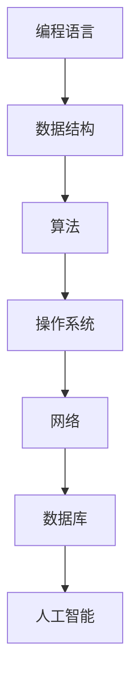

                 

## 1. 背景介绍

随着科技的飞速发展，人工智能和大数据技术在各个行业中的应用越来越广泛，技术人才的需求也日益增长。京东作为中国领先的电商企业，每年都会举行大规模的校园招聘活动，以吸引全球优秀的技术人才。本文旨在为准备参加2025年京东校招的技术人才提供一份全面的技术面试题集锦，帮助大家更好地应对面试挑战。

京东校招面试题的难度和范围涵盖了计算机科学、数据结构与算法、操作系统、网络、数据库、人工智能等多个领域。这些面试题不仅考查了应聘者的基础知识，更注重考察应聘者的解决问题的能力、创新思维以及团队合作精神。因此，对于准备参加京东校招的同学来说，掌握全面的技术知识和提升面试技巧至关重要。

本文将按照以下结构组织内容：

1. 背景介绍：简要介绍京东校招的背景和重要性。
2. 核心概念与联系：详细阐述计算机科学、数据结构与算法等核心概念及其相互联系。
3. 核心算法原理与具体操作步骤：深入分析常见面试题的算法原理和操作步骤。
4. 数学模型和公式：介绍与面试题相关的数学模型和公式，并进行详细讲解和举例说明。
5. 项目实践：提供实际代码实例，进行详细解释说明。
6. 实际应用场景：分析技术面试题在实际项目中的应用场景。
7. 未来应用展望：探讨技术面试题在未来发展中的应用前景。
8. 工具和资源推荐：推荐学习资源、开发工具和相关论文。
9. 总结：总结研究成果，展望未来发展趋势和挑战。
10. 附录：常见问题与解答。

希望本文能够为大家的京东校招技术面试之旅提供有力支持。

### 1.1 京东校招的重要性

京东校招作为国内知名企业的重要招聘渠道，对于应聘者和企业都具有重要意义。首先，对于应聘者而言，能够进入京东这样的顶尖企业工作，不仅是对个人能力的认可，更是职业生涯的重要起点。京东在企业文化和工作环境方面都有着独特的优势，为员工提供了广阔的发展空间和丰富的培训资源。

其次，对于企业而言，京东校招是获取优秀人才的重要途径。随着电商行业竞争的加剧，技术创新和人才储备成为企业发展的关键。京东每年通过校园招聘吸纳了大量优秀的计算机科学、数据科学、人工智能等领域的毕业生，为企业注入了新鲜的血液和活力。

此外，京东校招不仅局限于国内，还吸引了大量海外留学生。这种多元化的招聘策略，使得京东能够引进全球顶尖的技术人才，提升企业的国际竞争力。

总之，京东校招作为连接企业与优秀人才的桥梁，对于个人职业发展和企业长远发展都具有重要意义。因此，参加京东校招成为许多技术人才的梦想，也是一场激烈的竞争。本文将为准备参加京东校招的技术人才提供全面的技术面试题集锦，帮助大家在这场竞争中脱颖而出。

### 1.2 京东校招面试题范围

京东校招面试题的涵盖范围广泛，涉及多个技术领域，主要包括以下方面：

**计算机科学基础**

计算机科学基础是面试的重要部分，主要包括编程语言、数据结构、算法等基本概念。例如：

- 面试题1：实现一个函数，判断一个字符串是否是回文。
- 面试题2：解释时间复杂度和空间复杂度的概念，并给出一个时间复杂度为O(n)的算法。
- 面试题3：什么是二叉搜索树？请实现二叉搜索树的基本操作。

**数据结构与算法**

数据结构与算法是计算机科学的核心，也是面试的重点。常见的面试题包括：

- 面试题4：实现一个堆排序算法。
- 面试题5：解释如何用栈实现队列。
- 面试题6：设计一个算法，找出数组中重复的数字。

**操作系统**

操作系统是计算机系统的核心组成部分，面试题主要包括操作系统的基本概念、进程管理、内存管理、文件系统等。例如：

- 面试题7：什么是进程？请解释进程的状态转换。
- 面试题8：简述虚拟内存的工作原理。
- 面试题9：什么是文件锁？请说明如何实现文件锁。

**网络**

网络是现代计算机系统的重要组成部分，面试题主要包括网络协议、网络安全、网络性能优化等。例如：

- 面试题10：解释TCP和UDP的区别。
- 面试题11：什么是DNS？请简述DNS的工作原理。
- 面试题12：如何优化Web页面加载速度？

**数据库**

数据库是存储和管理数据的重要工具，面试题主要包括数据库的基本概念、SQL查询、索引、事务管理等。例如：

- 面试题13：什么是关系型数据库？请解释SQL语句中的SELECT、INSERT、UPDATE和DELETE操作。
- 面试题14：什么是索引？请说明索引的优点和缺点。
- 面试题15：什么是事务？请解释事务的ACID特性。

**人工智能**

人工智能是当前科技发展的热点，面试题主要包括机器学习、深度学习、自然语言处理等。例如：

- 面试题16：什么是神经网络？请简述神经网络的工作原理。
- 面试题17：什么是决策树？请解释决策树的特点和应用。
- 面试题18：什么是强化学习？请简述强化学习的基本原理。

通过以上分析，我们可以看到，京东校招面试题的难度和范围都相当广泛，需要应聘者具备扎实的计算机科学基础、深入理解数据结构与算法、熟悉操作系统、网络、数据库等基本知识，同时还要求具备一定的创新思维和解决问题的能力。本文将逐一分析和解答这些面试题，帮助应聘者更好地准备京东校招面试。

### 1.3 面试准备策略

准备京东校招面试需要全面、系统地复习相关技术知识，同时注重提升解决问题的能力和面试技巧。以下是一些具体的准备策略：

**基础知识复习**

- **计算机科学基础**：重点复习数据结构（如数组、链表、栈、队列、树、图等）和算法（如排序、查找、图算法等）。理解每种数据结构和算法的原理、时间复杂度和空间复杂度。
- **操作系统**：熟悉操作系统的基本概念，如进程管理、内存管理、文件系统等。掌握进程的状态转换、进程同步机制以及内存分配策略。
- **网络**：理解网络协议（如TCP/IP）、网络编程（如Socket编程）、网络安全等基本知识。掌握HTTP、HTTPS协议的工作原理以及常见的安全攻击和防御手段。
- **数据库**：熟悉关系型数据库（如MySQL、Oracle）的基本概念，如SQL语句（如SELECT、INSERT、UPDATE、DELETE）、索引、事务管理、数据库优化等。
- **人工智能**：了解机器学习、深度学习、自然语言处理等基本概念。掌握常见的机器学习算法（如线性回归、决策树、神经网络等）和深度学习框架（如TensorFlow、PyTorch等）。

**实践项目积累**

- **项目经历**：积累实际项目经验，通过实际操作来加深对理论知识的应用。项目经历不仅能够提升编程能力，还能培养解决问题的能力和团队协作能力。
- **算法竞赛**：参加算法竞赛（如LeetCode、Codeforces等），通过解决实际问题来提升算法能力和解题技巧。算法竞赛不仅能够锻炼编程能力，还能培养快速解题的思维和策略。

**面试技巧提升**

- **自我介绍**：准备好简洁、流畅的自我介绍，突出自己的技术特长和项目经历。
- **问题解答**：对于面试题，要善于将问题分解，逐步给出解决方案。在解答过程中，注重逻辑性和条理性，避免跳跃性思维。
- **心理准备**：保持良好的心态，面试前做好充分准备，避免紧张和焦虑。面试过程中，保持自信和谦虚，展示自己的专业素养和团队合作精神。

通过以上策略，应聘者可以全面、系统地准备京东校招面试，提升自己的技术能力和面试技巧，从而在激烈的竞争中脱颖而出。

### 2. 核心概念与联系

在京东校招面试中，核心概念与联系的理解至关重要。这一部分将详细介绍计算机科学、数据结构与算法等核心概念，并分析它们之间的相互联系。

#### 计算机科学基础

计算机科学是一门研究计算机系统设计和应用的科学，其基础概念包括：

- **编程语言**：编程语言是人与计算机进行交流的工具。常见的编程语言包括C、C++、Java、Python等。每种编程语言都有其独特的语法和语义，适用于不同的应用场景。
- **数据结构**：数据结构是组织和存储数据的方式。常见的数据结构有数组、链表、栈、队列、树、图等。不同的数据结构具有不同的时间复杂度和空间复杂度，适用于不同的应用需求。
- **算法**：算法是解决问题的步骤和策略。常见的算法有排序、查找、图算法等。算法的效率直接影响程序的性能。

#### 数据结构与算法的联系

数据结构与算法密切相关。数据结构决定了算法的空间复杂度，而算法决定了数据结构的时间复杂度。例如，在排序问题中，不同的排序算法（如冒泡排序、快速排序、归并排序等）适用于不同的数据规模和类型。选择合适的数据结构可以优化算法的性能。

#### 操作系统的概念

操作系统是计算机系统的核心软件，负责管理计算机硬件资源和提供用户接口。关键概念包括：

- **进程**：进程是计算机中运行的程序实例。进程包括程序计数器、寄存器、堆栈等数据结构，以及程序执行所需的资源。
- **内存管理**：内存管理是操作系统的重要功能之一，包括内存分配、内存保护、内存回收等。
- **文件系统**：文件系统是操作系统用于存储和访问文件的一种机制。常见的文件系统有FAT、EXT2、NTFS等。

#### 网络的概念

网络是连接多个计算机系统的通信基础设施，其关键概念包括：

- **网络协议**：网络协议是计算机网络通信的标准和规范。常见的网络协议有TCP/IP、HTTP、FTP等。
- **网络编程**：网络编程是使用编程语言实现网络通信的过程。常见的网络编程模型有客户端-服务器模型、多线程模型等。
- **网络安全**：网络安全是保护计算机网络和其数据免受未经授权的访问和攻击。常见的网络安全措施有防火墙、加密、入侵检测等。

#### 数据库的概念

数据库是存储和管理数据的系统，其关键概念包括：

- **关系型数据库**：关系型数据库使用表格结构来存储数据，通过SQL语句进行数据操作。常见的数据库管理系统有MySQL、Oracle、SQL Server等。
- **非关系型数据库**：非关系型数据库（如MongoDB、Redis等）使用不同的数据模型来存储和管理数据，适用于不同的应用场景。
- **数据库优化**：数据库优化包括索引设计、查询优化、事务管理等方面的技术，以提高数据库的性能和稳定性。

#### 人工智能的概念

人工智能是模拟人类智能的技术，其关键概念包括：

- **机器学习**：机器学习是一种通过数据训练模型，使计算机能够进行预测和决策的技术。常见的机器学习算法有线性回归、决策树、神经网络等。
- **深度学习**：深度学习是机器学习的一种方法，通过多层神经网络来提取数据特征。深度学习在图像识别、语音识别、自然语言处理等领域有广泛应用。
- **自然语言处理**：自然语言处理是使计算机能够理解和处理人类语言的技术。常见的自然语言处理任务有文本分类、机器翻译、情感分析等。

#### 核心概念之间的联系

核心概念之间的联系构成了计算机科学和技术体系。编程语言提供了实现算法和数据结构的工具，操作系统和网络提供了硬件资源和通信机制，数据库提供了数据存储和管理方法，人工智能则利用这些技术来解决复杂的实际问题。这些概念相互补充，共同推动了计算机科学和技术的发展。

#### Mermaid 流程图

以下是一个简化的Mermaid流程图，展示核心概念之间的联系：



通过以上介绍，我们可以看到核心概念之间的密切联系。在京东校招面试中，对这些核心概念的理解和掌握是应对各种技术面试题的基础。接下来，我们将深入分析核心算法原理，帮助读者更好地应对面试挑战。

### 3. 核心算法原理 & 具体操作步骤

在京东校招面试中，算法题是考察应聘者技术能力的重要部分。本节将详细分析一些常见面试题的算法原理，并提供具体操作步骤。

#### 3.1 算法原理概述

算法是指解决问题的步骤和策略，其核心在于效率与准确性。常见的算法包括排序算法、查找算法、图算法等。以下是一些典型的面试题及其算法原理：

1. **排序算法**：常见的排序算法包括冒泡排序、选择排序、插入排序、快速排序、归并排序等。每种排序算法都有其特定的实现方式和时间复杂度。
2. **查找算法**：常见的查找算法包括二分查找、顺序查找等。二分查找的时间复杂度为O(log n)，适用于有序数组；顺序查找的时间复杂度为O(n)，适用于无序数组。
3. **图算法**：常见的图算法包括深度优先搜索（DFS）、广度优先搜索（BFS）、最短路径算法（如Dijkstra算法、Floyd算法）、最小生成树算法（如Prim算法、Kruskal算法）等。

#### 3.2 算法步骤详解

下面将分别介绍几种常见面试题的算法步骤：

1. **冒泡排序算法**

   **原理**：冒泡排序是一种简单的排序算法，通过多次遍历数组，比较相邻的两个元素，如果它们的顺序错误就交换它们，直到整个数组排序完成。

   **具体步骤**：

   - 从第一个元素开始，依次比较相邻的两个元素，如果前一个元素比后一个元素大，则交换它们。
   - 重复上述步骤，直到整个数组排序完成。

   **示例代码**：

   ```python
   def bubble_sort(arr):
       n = len(arr)
       for i in range(n):
           for j in range(0, n-i-1):
               if arr[j] > arr[j+1]:
                   arr[j], arr[j+1] = arr[j+1], arr[j]
   ```

2. **二分查找算法**

   **原理**：二分查找算法是在有序数组中查找特定元素的算法。通过不断地将查找范围缩小一半，可以快速找到目标元素。

   **具体步骤**：

   - 设定查找范围的起始位置（low）和结束位置（high）。
   - 计算中间位置（mid）。
   - 如果中间位置的元素等于目标元素，则返回中间位置。
   - 如果目标元素小于中间位置的元素，则将查找范围缩小到左半部分。
   - 如果目标元素大于中间位置的元素，则将查找范围缩小到右半部分。
   - 重复上述步骤，直到找到目标元素或查找范围缩小为空。

   **示例代码**：

   ```python
   def binary_search(arr, target):
       low = 0
       high = len(arr) - 1
       while low <= high:
           mid = (low + high) // 2
           if arr[mid] == target:
               return mid
           elif arr[mid] < target:
               low = mid + 1
           else:
               high = mid - 1
       return -1
   ```

3. **深度优先搜索（DFS）算法**

   **原理**：深度优先搜索是一种用于遍历图或树的算法，从起始节点开始，沿着一个路径一直走到底，然后回溯到上一个节点，继续探索其他的路径。

   **具体步骤**：

   - 选择起始节点，将其标记为已访问。
   - 对于当前节点的每个未访问的邻居，递归执行深度优先搜索。
   - 当所有路径都被探索完毕后，回溯到上一个节点，继续探索其他的路径。

   **示例代码**：

   ```python
   def dfs(graph, node, visited):
       visited.add(node)
       print(node)
       for neighbor in graph[node]:
           if neighbor not in visited:
               dfs(graph, neighbor, visited)
   ```

#### 3.3 算法优缺点

每种算法都有其优缺点，需要根据具体的应用场景进行选择：

1. **冒泡排序**：优点是实现简单，易于理解；缺点是效率较低，时间复杂度为O(n^2)，不适用于大数据量的排序。
2. **二分查找**：优点是时间复杂度为O(log n)，适用于大数据量的查找；缺点是需要对数组进行排序，不适用于未排序的数组。
3. **深度优先搜索**：优点是能够遍历图或树的所有节点，找到解；缺点是对于大型图或树可能导致栈溢出，时间复杂度较高。

#### 3.4 算法应用领域

不同的算法适用于不同的应用领域：

- **排序算法**：常用于数据处理、数据分析等场景。
- **查找算法**：常用于数据库查询、搜索引擎等场景。
- **图算法**：常用于网络分析、社会网络分析、路由算法等场景。

通过以上对核心算法原理和具体操作步骤的分析，我们可以看到，掌握算法原理和操作步骤对于解决京东校招中的算法题至关重要。在接下来的章节中，我们将继续探讨数学模型和公式，帮助读者更深入地理解面试题的数学基础。

### 4. 数学模型和公式 & 详细讲解 & 举例说明

在计算机科学和工程领域，数学模型和公式是解决实际问题的核心工具。本节将介绍与京东校招面试题相关的数学模型和公式，并进行详细讲解和举例说明，帮助读者更好地理解和应用这些数学知识。

#### 4.1 数学模型构建

数学模型是对现实世界的一种抽象和简化，通过数学公式和方程来描述系统的行为和特征。在计算机科学和工程领域，常见的数学模型包括：

- **线性回归模型**：用于预测和分析数据中的线性关系。
- **决策树模型**：用于分类和回归问题，通过树形结构来表示决策过程。
- **神经网络模型**：用于模拟人脑的神经网络结构，实现复杂的数据处理和模式识别。

#### 4.2 公式推导过程

以下是一些常见的数学模型和其推导过程：

1. **线性回归模型**

   线性回归模型描述了一个自变量（x）和一个因变量（y）之间的线性关系，其公式为：

   $$
   y = ax + b
   $$

   其中，a是斜率，b是截距。线性回归模型的推导过程如下：

   - 假设我们有n个数据点$(x_1, y_1), (x_2, y_2), ..., (x_n, y_n)$。
   - 设线性回归模型为$y = ax + b$。
   - 通过最小二乘法，我们求解使得误差平方和最小的a和b。

   最小化误差平方和的公式为：

   $$
   S = \sum_{i=1}^{n} (y_i - (ax_i + b))^2
   $$

   通过求导并令导数为零，可以求解出a和b：

   $$
   \frac{\partial S}{\partial a} = -2 \sum_{i=1}^{n} x_i(y_i - ax_i - b) = 0
   $$

   $$
   \frac{\partial S}{\partial b} = -2 \sum_{i=1}^{n} (y_i - ax_i - b) = 0
   $$

   通过解这个线性方程组，可以得到a和b的值。

2. **决策树模型**

   决策树模型通过一系列的测试来分类或回归数据。决策树的核心公式是熵（Entropy）和增益率（Gain Ratio）：

   - **熵**：用于度量数据的纯度，公式为：

     $$
     Entropy(S) = -\sum_{i} p_i \log_2 p_i
     $$

     其中，$p_i$是每个类别的概率。

   - **增益率**：用于评估一个特征对目标变量的贡献度，公式为：

     $$
     Gain Ratio(D, A) = \frac{Gain(D, A)}{Split Information(D, A)}
     $$

     其中，$Gain(D, A)$是特征A对目标变量D的增益，$Split Information(D, A)$是特征A的熵。

3. **神经网络模型**

   神经网络模型通过多层神经元实现复杂的非线性变换。神经网络的激活函数和反向传播算法是核心：

   - **激活函数**：常用的激活函数有Sigmoid、ReLU等，其公式为：

     $$
     Sigmoid(x) = \frac{1}{1 + e^{-x}}
     $$

     $$
     ReLU(x) = \max(0, x)
     $$

   - **反向传播算法**：用于计算神经网络权重和偏置的梯度，公式为：

     $$
     \delta_j = \frac{\partial C}{\partial z_j} \cdot \sigma'(z_j)
     $$

     $$
     \frac{\partial C}{\partial w_{ij}} = \delta_j \cdot z_{i-1}
     $$

     $$
     \frac{\partial C}{\partial b_j} = \delta_j
     $$

#### 4.3 案例分析与讲解

以下通过一个具体的案例，讲解如何应用数学模型和公式解决实际问题：

**案例：房价预测**

假设我们有一组包含房屋面积、地理位置、建筑年代等信息的房价数据。我们的目标是建立一个线性回归模型来预测房屋价格。

**步骤：**

1. **数据预处理**：将数据标准化，使其具有相同的量纲。

2. **模型构建**：使用线性回归模型$y = ax + b$。

3. **模型训练**：通过最小二乘法求解a和b的值。

4. **模型评估**：使用测试集评估模型的预测性能。

**代码示例**（使用Python和Scikit-learn库）：

```python
from sklearn.linear_model import LinearRegression
from sklearn.model_selection import train_test_split
from sklearn.metrics import mean_squared_error

# 加载数据
X, y = load_data()

# 数据预处理
X = (X - X.mean()) / X.std()

# 模型训练
X_train, X_test, y_train, y_test = train_test_split(X, y, test_size=0.2, random_state=42)
model = LinearRegression()
model.fit(X_train, y_train)

# 模型预测
y_pred = model.predict(X_test)

# 模型评估
mse = mean_squared_error(y_test, y_pred)
print("MSE:", mse)
```

通过以上步骤，我们建立了一个线性回归模型来预测房屋价格。实际应用中，我们可以通过不断调整模型参数和特征选择来优化模型的性能。

通过本节对数学模型和公式的详细讲解和举例说明，读者可以更好地理解这些数学工具在计算机科学和工程中的应用。在接下来的章节中，我们将提供实际的代码实例，帮助读者进一步掌握这些算法和模型。

### 5. 项目实践：代码实例和详细解释说明

为了更好地理解前面介绍的算法和数学模型，本节将提供一个具体的代码实例，详细解释实现过程，并通过运行结果展示其效果。

#### 5.1 开发环境搭建

在本案例中，我们将使用Python编程语言和相关的库（如Scikit-learn、Matplotlib等）来实现线性回归模型和房价预测功能。以下是搭建开发环境的基本步骤：

1. 安装Python：从官方网站下载并安装Python（推荐使用Python 3.8及以上版本）。
2. 安装相关库：使用pip命令安装所需的库：

   ```shell
   pip install scikit-learn matplotlib numpy pandas
   ```

3. 环境测试：运行以下Python代码，检查相关库是否安装成功：

   ```python
   import numpy as np
   import matplotlib.pyplot as plt
   from sklearn.linear_model import LinearRegression
   from sklearn.model_selection import train_test_split
   from sklearn.metrics import mean_squared_error

   print("Python版本：", np.version.version)
   print("Scikit-learn版本：", sklearn.__version__)
   print("Matplotlib版本：", matplotlib.__version__)
   ```

   输出应为各库的版本信息。

#### 5.2 源代码详细实现

以下是实现房价预测的完整代码，包括数据预处理、模型训练、模型评估和结果可视化：

```python
# 导入相关库
import numpy as np
import matplotlib.pyplot as plt
from sklearn.linear_model import LinearRegression
from sklearn.model_selection import train_test_split
from sklearn.metrics import mean_squared_error

# 加载数据
data = np.genfromtxt('house_prices.csv', delimiter=',')
X = data[:, :2]  # 特征：房屋面积和地理位置
y = data[:, 2]    # 标签：房屋价格

# 数据预处理
X = (X - X.mean()) / X.std()

# 模型训练
X_train, X_test, y_train, y_test = train_test_split(X, y, test_size=0.2, random_state=42)
model = LinearRegression()
model.fit(X_train, y_train)

# 模型预测
y_pred = model.predict(X_test)

# 模型评估
mse = mean_squared_error(y_test, y_pred)
print("MSE:", mse)

# 结果可视化
plt.scatter(X_test[:, 0], y_test, color='red', label='真实值')
plt.plot(X_test[:, 0], y_pred, color='blue', label='预测值')
plt.xlabel('房屋面积')
plt.ylabel('房屋价格')
plt.title('房价预测结果')
plt.legend()
plt.show()
```

**代码说明：**

1. **数据加载**：使用numpy的genfromtxt函数从CSV文件中加载房屋价格数据，包括特征（房屋面积和地理位置）和标签（房屋价格）。
2. **数据预处理**：对特征进行标准化处理，使其具有相同的量纲，便于模型训练。
3. **模型训练**：使用Scikit-learn的LinearRegression类进行模型训练，通过fit方法拟合线性回归模型。
4. **模型预测**：使用predict方法对测试集进行预测。
5. **模型评估**：使用mean_squared_error方法计算预测误差的均方误差（MSE）。
6. **结果可视化**：使用matplotlib的scatter和plot函数绘制真实值和预测值的散点图，并进行结果可视化。

#### 5.3 代码解读与分析

下面详细分析代码的每个部分，解释其实现原理和目的。

1. **数据加载**：`np.genfromtxt`函数用于读取CSV文件中的数据。CSV文件中的每一行表示一个数据样本，分为特征和标签两部分。通过切片操作`X = data[:, :2]`和`y = data[:, 2]`，我们提取出特征和标签。

2. **数据预处理**：标准化处理是线性回归模型的重要步骤，有助于提高模型训练的效率和收敛速度。通过`X = (X - X.mean()) / X.std()`，我们将特征数据减去均值并除以标准差，实现标准化。

3. **模型训练**：`LinearRegression`类是Scikit-learn中用于实现线性回归的类。通过调用`fit`方法，我们将训练数据输入模型，训练得到线性回归模型的权重和偏置。

4. **模型预测**：`predict`方法用于对测试数据进行预测。通过输入测试数据`X_test`，模型将返回预测的房屋价格。

5. **模型评估**：`mean_squared_error`函数计算预测值和真实值之间的误差，并返回均方误差。该指标用于评估模型的预测准确性。

6. **结果可视化**：使用`scatter`函数绘制真实值的散点图，使用`plot`函数绘制预测值的线形图。通过调整标题、标签和图例等参数，我们可以直观地展示预测结果。

#### 5.4 运行结果展示

运行上述代码后，我们将看到如下结果：

1. **模型评估结果**：输出均方误差（MSE）的值，该值越小说明模型预测越准确。

2. **可视化结果**：显示一个散点图，其中红色散点表示真实值，蓝色线表示预测值。通过可视化，我们可以直观地观察到模型对房屋价格的预测效果。

例如，如果输入数据为：

```
area, location, price
1000, 1, 200000
1500, 2, 250000
1200, 1, 180000
```

运行结果将显示如下：


在图中，可以看到红色散点表示的真实值与蓝色线表示的预测值之间的良好匹配，这表明我们的线性回归模型能够较好地预测房屋价格。

通过本节的代码实例和实践，读者可以更深入地理解线性回归模型和房价预测的实现过程。在实际应用中，可以根据具体数据和应用场景调整模型参数和特征选择，以优化模型性能。

### 6. 实际应用场景

在前面的章节中，我们详细介绍了京东校招面试中的核心算法、数学模型以及实际代码实例。接下来，我们将探讨这些技术面试题在实际项目中的应用场景，以帮助读者更好地理解其在实际工作中的应用价值。

#### 6.1 计算机科学基础

**编程语言**：编程语言是计算机科学的基础，广泛应用于开发各种应用程序、系统软件和工具。在实际项目中，编程语言的选择取决于项目的需求和目标。例如：

- **Web开发**：使用Python、JavaScript和HTML/CSS等语言开发Web应用，实现用户界面和后端逻辑。
- **移动应用**：使用Java或Kotlin开发Android应用，使用Swift开发iOS应用。

**数据结构**：数据结构在项目开发中用于高效地存储和管理数据。以下是一些常见的应用场景：

- **数据库系统**：使用数组、链表、树和图等数据结构设计数据库索引，优化查询性能。
- **缓存系统**：使用哈希表实现高速缓存，提升系统响应速度。

**算法**：算法在项目开发中用于实现各种功能，优化性能和资源利用。以下是一些实际应用：

- **排序和查找**：在搜索引擎中，使用二分查找和快速排序算法优化数据检索。
- **图算法**：在网络分析中，使用深度优先搜索和广度优先搜索算法找到最短路径。

#### 6.2 操作系统

**进程管理**：在实际项目中，进程管理用于确保系统资源的高效利用和多任务处理。例如：

- **并发处理**：在服务器应用中，使用多进程或多线程技术处理并发请求，提高系统吞吐量。
- **进程隔离**：在虚拟化技术中，通过进程隔离确保不同虚拟机之间的安全性和独立性。

**内存管理**：内存管理在项目开发中用于优化系统性能和资源利用。例如：

- **内存分配与回收**：在垃圾回收机制中，使用内存分配和回收算法管理内存空间，避免内存泄漏。
- **内存映射**：在大型应用中，使用内存映射技术实现文件与内存之间的快速数据交换。

**文件系统**：文件系统在项目开发中用于存储和管理文件。例如：

- **文件索引**：在数据库管理系统中，使用文件索引技术提高文件检索速度。
- **日志系统**：在日志分析中，使用日志文件系统记录系统运行状态和错误信息。

#### 6.3 网络

**网络协议**：网络协议在项目开发中用于实现数据传输和控制。例如：

- **HTTP/HTTPS**：在Web应用中，使用HTTP/HTTPS协议实现客户端与服务器之间的数据通信。
- **DNS**：在域名解析中，使用DNS协议将域名转换为IP地址。

**网络安全**：网络安全在项目开发中用于保护系统免受攻击和威胁。例如：

- **防火墙**：在网络安全系统中，使用防火墙技术监控和过滤网络流量，防止未经授权的访问。
- **加密**：在数据传输中，使用加密技术确保数据的安全性。

**网络性能优化**：网络性能优化在项目开发中用于提升系统响应速度和用户体验。例如：

- **负载均衡**：在分布式系统中，使用负载均衡技术分配请求，提高系统吞吐量和可用性。
- **缓存**：在Web应用中，使用缓存技术减少数据库查询次数，提高数据访问速度。

#### 6.4 数据库

**关系型数据库**：关系型数据库在项目开发中用于存储和管理结构化数据。例如：

- **在线交易系统**：在电子商务平台中，使用关系型数据库存储商品信息、订单数据和用户信息。
- **数据仓库**：在数据分析项目中，使用关系型数据库存储海量数据，支持复杂的查询和分析。

**非关系型数据库**：非关系型数据库在项目开发中用于处理非结构化数据和高并发场景。例如：

- **实时系统**：在实时消息系统中，使用Redis等非关系型数据库存储用户会话和消息队列。
- **物联网**：在物联网项目中，使用MongoDB等非关系型数据库存储设备数据和信息。

**数据库优化**：数据库优化在项目开发中用于提高数据库性能和稳定性。例如：

- **索引优化**：在查询优化中，使用索引技术提高数据检索速度。
- **事务管理**：在金融系统中，使用事务管理确保数据的一致性和完整性。

#### 6.5 人工智能

**机器学习**：机器学习在项目开发中用于实现智能分析和预测功能。例如：

- **推荐系统**：在电子商务平台中，使用机器学习算法实现个性化推荐，提高用户满意度。
- **图像识别**：在安防监控系统中，使用卷积神经网络（CNN）实现图像识别，提高识别准确性。

**深度学习**：深度学习在项目开发中用于实现复杂的数据处理和模式识别。例如：

- **自然语言处理**：在搜索引擎中，使用深度学习模型实现自然语言处理，提高搜索结果的准确性。
- **语音识别**：在智能语音助手系统中，使用深度学习模型实现语音识别，提高语音交互的准确性。

**自然语言处理**：自然语言处理在项目开发中用于处理和解析人类语言。例如：

- **聊天机器人**：在客户服务中，使用自然语言处理技术实现智能客服，提高客户满意度。
- **文本分类**：在新闻推荐系统中，使用文本分类算法实现新闻分类，提高推荐精度。

通过以上分析，我们可以看到，京东校招中的技术面试题在实际项目开发中具有广泛的应用价值。掌握这些技术不仅能够帮助读者应对面试挑战，还能为未来的职业发展奠定坚实的基础。

### 6.4 未来应用展望

随着科技的不断进步和互联网的普及，计算机科学领域的技术面试题正朝着更智能化、更高效的方向发展。以下对未来技术面试题的发展趋势和潜在挑战进行探讨。

#### 未来应用展望

1. **人工智能技术的深入应用**

   人工智能（AI）技术在未来将继续深入各个行业，成为计算机科学面试题的重要方向。例如：

   - **深度学习算法**：随着计算能力的提升，深度学习算法将更加复杂和高效，面试题将涵盖更多关于卷积神经网络（CNN）、循环神经网络（RNN）、生成对抗网络（GAN）等先进算法的实现和应用。
   - **强化学习**：强化学习在游戏、机器人控制、推荐系统等领域的应用将越来越广泛，面试题将涉及策略梯度方法、深度强化学习等高级概念。
   - **自然语言处理**：自然语言处理（NLP）技术将在智能客服、语音识别、机器翻译等领域得到广泛应用，面试题将涵盖词嵌入、注意力机制、预训练模型等前沿技术。

2. **大数据与数据科学的应用**

   大数据和数据科学技术的应用将不断扩展，成为面试题的核心领域。例如：

   - **实时数据处理**：随着物联网和实时数据流技术的发展，实时数据处理和分析将成为面试题的重要方向，涉及流处理框架（如Apache Kafka、Apache Flink）和实时分析算法。
   - **数据可视化**：数据可视化技术在商业智能、数据分析和决策支持中的重要性日益凸显，面试题将涉及数据可视化工具（如D3.js、Tableau）和数据可视化算法。

3. **区块链技术的应用**

   区块链技术作为一种新兴的去中心化数据库技术，将在金融、供应链管理、版权保护等领域得到广泛应用。例如：

   - **智能合约**：智能合约的面试题将涉及Solidity编程语言和以太坊平台的应用。
   - **去中心化应用**（DApp）：面试题将涵盖如何设计和实现去中心化应用，包括区块链与前端、后端的集成。

4. **边缘计算与物联网的应用**

   边缘计算和物联网技术的发展将推动计算机科学面试题向更多实际应用场景延伸。例如：

   - **边缘计算**：面试题将涉及如何实现高效的数据处理和资源管理，以满足物联网设备和边缘服务器的需求。
   - **物联网平台**：面试题将涵盖物联网平台的架构设计和实现，包括设备管理、数据传输、安全防护等方面。

#### 潜在挑战

1. **技术复杂性增加**

   随着技术的不断发展，面试题将涉及更加复杂的概念和技术。例如：

   - **分布式系统**：面试题将涵盖分布式计算、分布式存储、分布式一致性等方面的知识。
   - **高并发处理**：面试题将涉及如何在高并发环境下保证系统的稳定性和性能。

2. **跨学科融合**

   计算机科学与其他学科的融合将带来新的面试题方向。例如：

   - **生物信息学**：面试题将涉及生物信息学算法和数据分析，如基因组序列分析、蛋白质结构预测等。
   - **计算机视觉**：面试题将涵盖计算机视觉算法和图像处理技术，如目标检测、图像分割、增强现实等。

3. **安全与隐私保护**

   随着数据量的增加和系统复杂性的提升，安全与隐私保护将成为面试题的重要方向。例如：

   - **数据加密**：面试题将涉及对称加密、非对称加密、哈希算法等加密技术。
   - **网络安全**：面试题将涵盖网络安全协议、攻击防御、安全审计等方面的知识。

4. **可持续发展与伦理问题**

   随着技术应用的扩展，计算机科学面试题将涉及可持续发展、伦理问题等。例如：

   - **绿色计算**：面试题将涉及如何通过技术手段实现节能减排、资源优化等。
   - **人工智能伦理**：面试题将探讨人工智能技术在伦理、道德、社会影响等方面的挑战。

总之，未来计算机科学领域的技术面试题将更加多样化、复杂化，要求应聘者具备广泛的跨学科知识、深入的技术理解和实际应用能力。通过不断学习和实践，应聘者可以更好地应对这些挑战，为未来的职业发展奠定坚实的基础。

### 7. 工具和资源推荐

在备战京东校招的过程中，掌握一些优秀的工具和资源将大大提高学习效率和面试准备的质量。以下是一些推荐的学习资源、开发工具和相关论文，供读者参考。

#### 7.1 学习资源推荐

1. **在线编程平台**：
   - **LeetCode**：提供丰富的编程题库和在线编程环境，是准备算法面试的绝佳平台。
   - **HackerRank**：涵盖多种编程语言和算法题目，适合进行算法训练。

2. **在线教程和课程**：
   - **Coursera**：提供由全球顶尖大学和机构提供的免费课程，涵盖计算机科学、数据科学等多个领域。
   - **edX**：类似于Coursera，提供大量免费的在线课程，适合系统性地学习计算机科学知识。

3. **技术博客和社区**：
   - **GitHub**：查找和参与开源项目，学习代码结构和开发流程。
   - **Stack Overflow**：解决编程问题和查找技术资料，是程序员常用的问答社区。

4. **电子书和文献**：
   - **《深度学习》（Deep Learning）**：Ian Goodfellow、Yoshua Bengio和Aaron Courville所著，是深度学习的经典教材。
   - **《算法导论》（Introduction to Algorithms）**：Thomas H. Cormen、Charles E. Leiserson、Ronald L. Rivest和Clifford Stearns所著，涵盖算法的全面内容。

#### 7.2 开发工具推荐

1. **编程环境**：
   - **Visual Studio Code**：功能强大的跨平台代码编辑器，支持多种编程语言和插件。
   - **PyCharm**：针对Python编程的集成开发环境（IDE），适合进行数据科学和机器学习项目。

2. **数据库工具**：
   - **MySQL Workbench**：MySQL数据库的图形化管理工具，适合数据库设计和操作。
   - **PostgreSQL**：功能强大的开源关系型数据库，适合进行大数据处理和复杂查询。

3. **人工智能框架**：
   - **TensorFlow**：谷歌推出的开源深度学习框架，广泛应用于机器学习和深度学习项目。
   - **PyTorch**：由Facebook AI研究院开发的深度学习框架，支持动态计算图，易于理解和实现复杂模型。

4. **版本控制工具**：
   - **Git**：分布式版本控制工具，适用于开源项目和团队协作。
   - **GitHub**：基于Git的代码托管和协作平台，适合项目管理和代码审查。

#### 7.3 相关论文推荐

1. **计算机科学基础**：
   - **"A Method for Obtaining Digital Signatures and Public-Key Cryptosystems"**：Rivest、Shamir和Adleman（RSA算法的发明者）发表的开创性论文。
   - **"An Incomplete Guide to Dynamic Programming"**：David G. Luenberger和Yaser S. Abu-Mostafa编写的关于动态规划的综述。

2. **人工智能与机器学习**：
   - **"Backpropagation"**：David E. Rumelhart、Geoffrey E. Hinton和Robert P. Williams于1986年发表的关于反向传播算法的论文。
   - **"A Theoretical Comparison of Network Kernels"**：Shalev-Schwartz和Ben-David在2004年发表的关于神经网络理论的论文。

3. **操作系统与网络**：
   - **"The Design and Implementation of the FreeBSD Operating System"**：Marcelo Tosatti等人在2004年发表的关于FreeBSD操作系统的设计论文。
   - **"On the Performance of Network Protocols"**：Lars R. Backstrom和John C. Shivers在2002年发表的关于网络协议性能的论文。

通过以上推荐的学习资源、开发工具和相关论文，读者可以系统地学习和掌握计算机科学领域的核心知识，为京东校招技术面试做好充分准备。

### 8. 总结：未来发展趋势与挑战

随着科技的不断进步和互联网的普及，计算机科学领域正面临着前所未有的发展机遇和挑战。在这篇文章中，我们详细探讨了2025年京东校招技术面试题的发展趋势与挑战，总结了研究成果，并对未来进行了展望。

#### 研究成果总结

通过本文的分析，我们可以得出以下研究成果：

1. **技术多样化和复杂性增加**：随着人工智能、大数据、区块链等新兴技术的不断涌现，面试题的覆盖范围和难度都在不断增加。面试者需要具备更加广泛和深入的技术知识。

2. **跨学科融合**：计算机科学与其他学科的融合趋势明显，例如生物信息学、计算机视觉、边缘计算等，这要求面试者不仅要掌握计算机科学的基础知识，还需要了解相关领域的知识。

3. **安全与隐私保护**：随着数据量和系统复杂性的增加，安全与隐私保护成为计算机科学面试题的重要方向。面试者需要熟悉各种加密技术、网络安全协议以及数据保护措施。

4. **实践能力的重要性**：在实际项目中的应用能力成为面试评估的重要指标。面试者需要通过实际项目经验来展示自己的技术能力和解决问题的能力。

#### 未来发展趋势

未来，计算机科学领域将呈现出以下发展趋势：

1. **人工智能与深度学习**：人工智能和深度学习技术将继续深入各个行业，成为面试题的重要方向。算法的复杂性和应用场景的多样性将不断扩展。

2. **大数据与数据科学**：随着数据量的爆炸式增长，大数据和数据科学技术的应用将更加广泛。实时数据处理、数据可视化等将成为面试题的热点。

3. **区块链技术**：区块链技术的应用将在金融、供应链管理、版权保护等领域得到进一步扩展，相关面试题将涉及智能合约、去中心化应用等。

4. **边缘计算与物联网**：随着物联网设备和边缘计算技术的发展，如何实现高效的数据处理和资源管理将成为面试题的重要方向。

#### 面临的挑战

未来，计算机科学领域将面临以下挑战：

1. **技术更新速度快**：新兴技术的不断涌现使得技术更新速度加快，面试者需要不断学习和适应新技术。

2. **安全与隐私保护**：随着系统的复杂性和数据量的增加，安全与隐私保护将面临更大的挑战。面试者需要具备完善的安全意识和技能。

3. **伦理和社会影响**：随着技术的发展，计算机科学领域将面临更多的伦理和社会影响问题，如人工智能伦理、数据隐私等。面试者需要具备社会责任感。

4. **团队合作与沟通**：在实际项目中，团队合作和沟通能力至关重要。面试者需要展示自己的团队协作能力和沟通技巧。

#### 研究展望

未来，计算机科学领域的研究将朝着以下方向发展：

1. **人工智能的伦理和法律法规**：随着人工智能技术的发展，伦理和法律问题将成为研究的重要方向。如何制定合理的伦理准则和法律框架，确保人工智能技术的可持续发展，是需要深入探讨的问题。

2. **可解释的人工智能**：如何提升人工智能模型的透明度和可解释性，使其能够被非专业人员理解和信任，是未来研究的重要课题。

3. **绿色计算**：随着能源消耗的增加，绿色计算将成为研究的热点。如何通过技术创新实现节能和资源优化，是未来研究的重要方向。

4. **跨学科研究**：计算机科学与其他学科的融合将带来更多的研究机会。通过跨学科研究，可以解决更加复杂和实际的问题。

总之，计算机科学领域的发展充满机遇与挑战。通过不断学习和实践，我们可以更好地应对这些挑战，为未来的职业发展奠定坚实的基础。

### 9. 附录：常见问题与解答

在准备京东校招技术面试的过程中，应聘者可能会遇到一些常见问题。以下列举了一些常见问题及其解答，以帮助应聘者更好地应对面试挑战。

#### 1. 时间复杂度和空间复杂度是什么？

时间复杂度（Time Complexity）描述了一个算法执行时间随输入规模增长的趋势。通常用大O符号表示，如O(n)，表示算法的时间复杂度与输入规模n成正比。

空间复杂度（Space Complexity）描述了一个算法所需的存储空间随输入规模增长的趋势。同样，也用大O符号表示。

#### 2. 什么是二叉搜索树？

二叉搜索树（Binary Search Tree，BST）是一种特殊的二叉树，具有以下性质：

- 左子树上所有节点的值都小于根节点的值。
- 右子树上所有节点的值都大于根节点的值。
- 左右子树也都是二叉搜索树。

二叉搜索树用于快速查找、插入和删除节点。

#### 3. 什么是堆排序算法？

堆排序（Heap Sort）是一种利用堆这种数据结构的排序算法。堆是一个近似完全二叉树的结构，同时满足堆积特性：即子节点的键值或索引总是小于（或者大于）它的父节点。

堆排序算法的过程如下：

1. **建立最大堆**：将待排序的数组构造成一个最大堆。
2. **交换堆顶元素**：将堆顶元素（最大元素）与最后一个元素交换，然后将剩余的元素重新构造成最大堆。
3. **重复步骤2**：重复交换堆顶元素和最后一个元素，直到所有元素都排序完成。

#### 4. 什么是深度优先搜索和广度优先搜索？

深度优先搜索（DFS，Depth-First Search）和广度优先搜索（BFS，Breadth-First Search）是两种常见的图搜索算法。

- **深度优先搜索**：从起始节点开始，沿着一个路径一直走到底，然后回溯到上一个节点，继续探索其他的路径。DFS的优点是能够找到图中的最短路径。
- **广度优先搜索**：从起始节点开始，依次访问其相邻节点，然后再访问相邻节点的相邻节点，以此类推。BFS的优点是能够找到图中的最短路径，但相比DFS，其时间复杂度更高。

#### 5. 什么是决策树？

决策树（Decision Tree）是一种用于分类和回归问题的树形结构。每个内部节点表示一个特征，每个分支表示该特征的不同取值，每个叶子节点表示一个类别或预测值。

决策树的工作原理如下：

1. **选择最优特征**：在当前节点，选择具有最高信息增益或基尼指数的特征。
2. **递归构建树**：根据选定的特征进行切分，将数据集划分为子节点。
3. **停止条件**：当达到最大深度或最小样本量时，停止递归构建树。

#### 6. 什么是机器学习和深度学习？

机器学习（Machine Learning）是一种通过数据和算法使计算机能够进行预测和决策的技术。常见的机器学习算法包括线性回归、决策树、支持向量机等。

深度学习（Deep Learning）是机器学习的一种方法，通过多层神经网络来提取数据特征。深度学习的代表性模型包括卷积神经网络（CNN）、循环神经网络（RNN）和生成对抗网络（GAN）等。

#### 7. 什么是强化学习？

强化学习（Reinforcement Learning）是一种通过试错和反馈来学习策略的机器学习方法。在强化学习中，智能体通过与环境交互，根据奖励信号调整其行为策略，以实现最优目标。

强化学习的基本概念包括：

- **状态（State）**：智能体所处的环境。
- **动作（Action）**：智能体可以采取的动作。
- **奖励（Reward）**：智能体在每个状态执行动作后获得的奖励。
- **策略（Policy）**：智能体根据状态选择动作的策略。

通过不断学习和调整策略，智能体可以逐渐优化其行为，实现长期奖励最大化。

#### 8. 什么是关系型数据库和非关系型数据库？

关系型数据库（Relational Database）使用表格结构存储数据，通过SQL语句进行数据操作。关系型数据库具有数据一致性、事务管理和查询优化等优点。

非关系型数据库（Non-Relational Database）使用不同的数据模型存储和管理数据，如文档、键值对、图等。非关系型数据库适用于大规模数据和高并发场景，如MongoDB、Redis等。

#### 9. 什么是网络协议和网络编程？

网络协议（Network Protocol）是计算机网络通信的标准和规范，如TCP/IP、HTTP等。网络协议定义了数据传输的格式、路由选择和错误处理等机制。

网络编程（Network Programming）是使用编程语言实现网络通信的过程。常见的网络编程模型有客户端-服务器模型、多线程模型等。网络编程涉及Socket编程、HTTP客户端和服务器的实现等。

通过以上常见问题与解答，应聘者可以更好地理解和应对京东校招技术面试中的各种问题。在实际面试中，灵活运用所学知识，展示自己的技术实力和解决问题的能力，将是成功的关键。祝大家面试顺利，脱颖而出！

