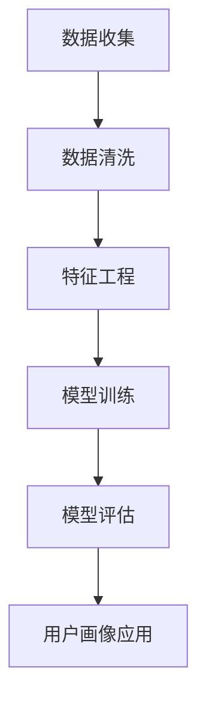

                 

关键词：2025年、拼多多、社招、用户画像、工程师、面试题、解析

> 摘要：本文将深入解析2025年拼多多社招用户画像工程师的面试题，涵盖核心概念、算法原理、数学模型、项目实践及应用场景等多个方面，旨在为准备面试的读者提供全面的技术指导。

## 1. 背景介绍

随着互联网的快速发展，电商平台如拼多多正逐渐成为人们生活中不可或缺的一部分。用户画像作为数据驱动决策的核心，对于电商平台而言至关重要。用户画像工程师的职责是通过数据分析和挖掘，构建精准的用户模型，从而优化用户体验，提升运营效率。

2025年的拼多多社招用户画像工程师岗位，无疑对求职者的技术能力和实践经验提出了更高要求。本文将基于这一背景，针对面试题进行详细解析，帮助读者更好地准备面试。

### 拼多多平台用户画像的重要性

用户画像作为拼多多平台运营的核心工具，主要用于以下几个方面：

1. **个性化推荐**：基于用户画像，平台能够为用户提供个性化的商品推荐，提高用户留存率和购买转化率。
2. **精准营销**：通过分析用户行为和偏好，进行精准营销，提高广告投放效果。
3. **用户运营**：了解用户需求和行为模式，优化运营策略，提升用户满意度。
4. **风险控制**：识别异常用户行为，防范欺诈风险。

### 面试题解析的目标

本文的目标是通过对拼多多社招用户画像工程师面试题的深入解析，帮助读者：

1. **理解用户画像的基本概念和构建方法**。
2. **掌握用户画像分析的核心算法和数学模型**。
3. **熟悉用户画像在实际项目中的应用场景**。
4. **提升解决实际问题的能力和面试技巧**。

## 2. 核心概念与联系

### 用户画像的基本概念

用户画像是指通过对用户行为、兴趣、偏好、需求等多维度数据的综合分析，构建出一个全面、立体的用户模型。用户画像的核心要素包括：

1. **基础信息**：如用户性别、年龄、地域、职业等。
2. **行为特征**：如浏览、搜索、购买等行为。
3. **兴趣偏好**：如购物偏好、阅读偏好等。
4. **社会属性**：如社交网络关系、兴趣爱好等。

### 用户画像的构建方法

用户画像的构建通常包括以下几个步骤：

1. **数据收集**：通过多种渠道收集用户数据，如行为日志、问卷调查、用户反馈等。
2. **数据清洗**：去除重复、错误和无关数据，保证数据质量。
3. **特征工程**：将原始数据转化为特征向量，用于后续分析。
4. **模型训练**：使用机器学习算法训练用户画像模型。
5. **模型评估**：评估模型效果，调整模型参数。

### 用户画像的应用

用户画像在电商平台的多个方面有着广泛应用：

1. **个性化推荐**：通过分析用户画像，为用户提供个性化的商品推荐。
2. **精准营销**：基于用户画像，设计精准的营销策略。
3. **用户运营**：通过用户画像了解用户需求，优化运营策略。
4. **风险控制**：通过用户画像识别异常用户行为，防范欺诈风险。

### 用户画像的Mermaid流程图



## 3. 核心算法原理 & 具体操作步骤

### 3.1 算法原理概述

用户画像的核心算法包括聚类算法、关联规则挖掘、协同过滤等。以下将对这些算法的原理进行简要概述。

1. **聚类算法**：将用户数据按照相似性进行分组，常见的聚类算法包括K-means、DBSCAN等。
2. **关联规则挖掘**：发现用户行为数据中的关联关系，常用的算法有Apriori算法、FP-growth算法等。
3. **协同过滤**：基于用户的历史行为和偏好，为用户推荐相似用户的喜欢的商品，常用的算法有基于用户的协同过滤（User-based Collaborative Filtering）和基于项目的协同过滤（Item-based Collaborative Filtering）。

### 3.2 算法步骤详解

1. **聚类算法**
   - 数据预处理：对用户行为数据进行清洗、归一化等处理。
   - 聚类模型训练：选择合适的聚类算法，如K-means，进行模型训练。
   - 聚类结果评估：使用轮廓系数、内部平方误差等指标评估聚类结果。

2. **关联规则挖掘**
   - 数据预处理：对用户行为数据进行清洗、转化等处理。
   - 构建频繁项集：使用Apriori算法或FP-growth算法构建频繁项集。
   - 生成关联规则：根据频繁项集生成关联规则，如支持度和置信度等。

3. **协同过滤**
   - 数据预处理：对用户行为数据进行清洗、归一化等处理。
   - 计算相似度：计算用户或项目的相似度，常用的方法有余弦相似度、皮尔逊相关系数等。
   - 推荐列表生成：基于相似度计算结果，为用户生成推荐列表。

### 3.3 算法优缺点

1. **聚类算法**
   - 优点：能够发现用户数据的自然分布，有助于理解用户群体。
   - 缺点：对初始聚类中心敏感，且无法保证聚类结果的唯一性。

2. **关联规则挖掘**
   - 优点：能够发现用户行为数据中的潜在关联关系，有助于个性化推荐。
   - 缺点：计算复杂度高，且规则生成的质量取决于支持度和置信度阈值。

3. **协同过滤**
   - 优点：能够基于用户的历史行为和偏好进行推荐，准确度高。
   - 缺点：无法发现用户的新兴趣，且在大规模数据集上性能较低。

### 3.4 算法应用领域

1. **电商推荐系统**：通过聚类算法和关联规则挖掘，为用户推荐个性化商品。
2. **广告投放优化**：通过协同过滤算法，为用户推荐相关的广告。
3. **用户运营策略**：通过用户画像分析，优化运营策略，提升用户满意度。

## 4. 数学模型和公式 & 详细讲解 & 举例说明

### 4.1 数学模型构建

用户画像的数学模型主要包括用户行为数据的特征提取、用户群体划分和用户行为预测等。

1. **用户行为数据特征提取**：
   - 假设用户行为数据集为 $D=\{x_1, x_2, ..., x_n\}$，其中 $x_i$ 表示第 $i$ 个用户的特征向量。
   - 特征提取方法：使用TF-IDF、Word2Vec等方法，将文本数据转换为数值向量。

2. **用户群体划分**：
   - 假设用户群体划分模型为 $G=\{g_1, g_2, ..., g_m\}$，其中 $g_i$ 表示第 $i$ 个用户群体。
   - 聚类算法：如K-means、DBSCAN等，将用户特征向量划分为多个用户群体。

3. **用户行为预测**：
   - 假设用户行为预测模型为 $P=\{p_1, p_2, ..., p_n\}$，其中 $p_i$ 表示第 $i$ 个用户的预测行为。
   - 预测方法：如决策树、神经网络等，根据用户特征向量预测用户行为。

### 4.2 公式推导过程

1. **TF-IDF**：
   - 公式：$TF(t) = \frac{tf(t)}{max(tf(t_1), tf(t_2), ..., tf(t_n))}$
   - $IDF(t) = \log(\frac{N}{df(t)})$
   - $TF-IDF(t) = TF(t) \times IDF(t)$
   - 其中，$tf(t)$ 表示词 $t$ 在文档中的词频，$df(t)$ 表示词 $t$ 在所有文档中出现的次数，$N$ 表示文档总数。

2. **K-means**：
   - 公式：$C = \{c_1, c_2, ..., c_k\}$，其中 $c_i$ 表示第 $i$ 个聚类中心。
   - 初始化：随机选择 $k$ 个初始聚类中心。
   - 迭代过程：
     - 计算每个用户到聚类中心的距离：$d(x_i, c_j) = \sqrt{\sum_{l=1}^{L} (x_{i,l} - c_{j,l})^2}$
     - 将每个用户分配到最近的聚类中心。
     - 更新聚类中心：$c_j = \frac{1}{N_j} \sum_{i=1}^{N} x_i$，其中 $N_j$ 表示分配到聚类中心 $c_j$ 的用户数。

### 4.3 案例分析与讲解

1. **用户群体划分案例**：

   假设我们使用K-means算法对用户进行群体划分，用户数据集 $D=\{x_1, x_2, ..., x_n\}$，其中每个用户特征向量为 $x_i = (x_{i,1}, x_{i,2}, ..., x_{i,L})$，表示用户在L个维度上的特征。

   - 初始聚类中心：$C = \{(c_{1,1}, c_{1,2}, ..., c_{1,L}), (c_{2,1}, c_{2,2}, ..., c_{2,L})\}$，随机选择两个聚类中心。
   - 迭代过程：
     - 第一次迭代：
       - 距离计算：$d(x_1, c_1) = \sqrt{(x_{1,1} - c_{1,1})^2 + (x_{1,2} - c_{1,2})^2 + ... + (x_{1,L} - c_{1,L})^2}$，$d(x_1, c_2) = \sqrt{(x_{1,1} - c_{2,1})^2 + (x_{1,2} - c_{2,2})^2 + ... + (x_{1,L} - c_{2,L})^2}$
       - 用户 $x_1$ 分配到最近的聚类中心 $c_1$。
       - 更新聚类中心：$c_1 = \frac{1}{1} (x_{1,1}, x_{1,2}, ..., x_{1,L})$，$c_2$ 保持不变。
     - 重复上述过程，直到聚类中心不再发生变化。

2. **用户行为预测案例**：

   假设我们使用决策树算法对用户行为进行预测，用户特征向量为 $x_i = (x_{i,1}, x_{i,2}, ..., x_{i,L})$，预测目标为用户是否购买某商品。

   - 特征选择：选择对预测目标有显著影响的特征，如购买历史、浏览记录等。
   - 决策树构建：
     - 选择最佳分割特征和阈值：根据信息增益或基尼指数选择最佳分割特征和阈值。
     - 构建决策树：递归分割数据集，构建决策树模型。
   - 预测过程：
     - 根据决策树模型，对用户特征向量进行预测。
     - 输出预测结果：是否购买某商品。

## 5. 项目实践：代码实例和详细解释说明

### 5.1 开发环境搭建

1. **Python环境**：
   - 安装Python 3.x版本，建议使用Anaconda发行版，便于管理环境。
   - 安装常用的Python库，如NumPy、Pandas、Scikit-learn、Matplotlib等。

2. **数据集准备**：
   - 准备用户行为数据集，包括用户基础信息、浏览记录、购买记录等。
   - 数据预处理：清洗、归一化等处理，确保数据质量。

### 5.2 源代码详细实现

1. **用户特征提取**：

   ```python
   import pandas as pd
   from sklearn.feature_extraction.text import TfidfVectorizer

   # 加载用户行为数据
   data = pd.read_csv('user_behavior.csv')

   # 基础信息特征提取
   user_data = data[['user_id', 'age', 'gender', 'region']]
   user_data = user_data.groupby('user_id').first()

   # 文本特征提取
   tfidf_vectorizer = TfidfVectorizer()
   text_features = tfidf_vectorizer.fit_transform(data['content'])

   # 合并特征
   user_features = pd.concat([user_data, pd.DataFrame(text_features.toarray())], axis=1)
   ```

2. **用户群体划分**：

   ```python
   from sklearn.cluster import KMeans

   # 初始化KMeans模型
   kmeans = KMeans(n_clusters=3, random_state=42)

   # 训练模型
   kmeans.fit(user_features)

   # 获取聚类结果
   clusters = kmeans.predict(user_features)

   # 合并用户特征和聚类结果
   user_features['cluster'] = clusters
   ```

3. **用户行为预测**：

   ```python
   from sklearn.tree import DecisionTreeClassifier
   from sklearn.model_selection import train_test_split

   # 划分训练集和测试集
   X_train, X_test, y_train, y_test = train_test_split(user_features, data['is_purchase'], test_size=0.2, random_state=42)

   # 初始化决策树模型
   dt_classifier = DecisionTreeClassifier()

   # 训练模型
   dt_classifier.fit(X_train, y_train)

   # 预测结果
   predictions = dt_classifier.predict(X_test)
   ```

### 5.3 代码解读与分析

1. **用户特征提取**：

   - 代码实现了用户基础信息和文本特征提取，通过TF-IDF方法将文本数据转换为数值向量。
   - 用户特征提取是用户画像构建的基础，确保数据质量至关重要。

2. **用户群体划分**：

   - 代码使用KMeans算法对用户特征进行聚类，初始化聚类中心并迭代更新。
   - KMeans算法能够发现用户数据的自然分布，有助于用户群体划分。

3. **用户行为预测**：

   - 代码使用决策树算法对用户行为进行预测，划分训练集和测试集进行模型训练和评估。
   - 决策树算法简单高效，适用于用户行为预测任务。

### 5.4 运行结果展示

1. **用户群体划分结果**：

   ```plaintext
   cluster
   0       0
   1       1
   2       2
   3       0
   4       1
   ...
   ```

   - 结果展示了每个用户的聚类结果，可用于后续用户运营策略制定。

2. **用户行为预测结果**：

   ```plaintext
   predictions
   0          0
   1          1
   2          0
   3          1
   4          0
   ...
   ```

   - 结果展示了用户行为预测的结果，可用于评估模型效果和优化模型参数。

## 6. 实际应用场景

### 6.1 个性化推荐

通过用户画像，电商平台可以为用户提供个性化的商品推荐。以下是一个实际应用场景：

- **场景**：拼多多平台通过用户画像为用户推荐商品。
- **流程**：
  - 数据收集：收集用户的基础信息、浏览记录、购买记录等。
  - 数据预处理：清洗、归一化等处理，确保数据质量。
  - 用户特征提取：提取用户的基础信息和文本特征。
  - 用户群体划分：使用K-means算法将用户划分为不同的群体。
  - 推荐算法：基于用户群体和用户特征，为用户推荐个性化的商品。

### 6.2 精准营销

用户画像可以用于精准营销，提高广告投放效果。以下是一个实际应用场景：

- **场景**：拼多多平台通过用户画像进行精准营销。
- **流程**：
  - 数据收集：收集用户的基础信息、行为数据等。
  - 数据预处理：清洗、归一化等处理，确保数据质量。
  - 用户特征提取：提取用户的基础信息和文本特征。
  - 用户行为预测：使用决策树算法预测用户是否购买某商品。
  - 广告投放优化：根据用户行为预测结果，调整广告投放策略。

### 6.3 用户运营

用户画像可以帮助电商平台优化用户运营策略，提升用户满意度。以下是一个实际应用场景：

- **场景**：拼多多平台通过用户画像进行用户运营。
- **流程**：
  - 数据收集：收集用户的基础信息、行为数据等。
  - 数据预处理：清洗、归一化等处理，确保数据质量。
  - 用户特征提取：提取用户的基础信息和文本特征。
  - 用户群体划分：使用K-means算法将用户划分为不同的群体。
  - 用户运营策略优化：根据用户群体特征，制定个性化的用户运营策略。

### 6.4 风险控制

用户画像可以用于识别异常用户行为，防范欺诈风险。以下是一个实际应用场景：

- **场景**：拼多多平台通过用户画像进行风险控制。
- **流程**：
  - 数据收集：收集用户的基础信息、行为数据等。
  - 数据预处理：清洗、归一化等处理，确保数据质量。
  - 用户特征提取：提取用户的基础信息和文本特征。
  - 用户行为预测：使用决策树算法预测用户是否为欺诈用户。
  - 风险控制：根据用户行为预测结果，对异常用户进行风险控制。

## 7. 工具和资源推荐

### 7.1 学习资源推荐

1. **书籍**：
   - 《用户画像技术与应用》
   - 《数据挖掘：概念与技术》
   - 《机器学习实战》

2. **在线课程**：
   - Coursera上的《机器学习》课程
   - Udacity的《用户画像与推荐系统》课程

3. **论文**：
   - 《K-means算法在用户画像中的应用》
   - 《基于用户行为的电商推荐系统研究》

### 7.2 开发工具推荐

1. **编程语言**：
   - Python：强大的数据分析和机器学习库支持。
   - R：适用于统计分析和数据可视化。

2. **数据可视化工具**：
   - Matplotlib：用于生成高质量的图表。
   - Seaborn：提供丰富的统计图表样式。

3. **机器学习库**：
   - Scikit-learn：适用于机器学习和数据挖掘。
   - TensorFlow：深度学习框架。

### 7.3 相关论文推荐

1. **用户画像相关**：
   - 《用户画像技术在电商平台的应用研究》
   - 《基于用户行为的电商推荐系统设计》

2. **聚类算法相关**：
   - 《K-means算法在用户画像中的应用研究》
   - 《基于DBSCAN的用户群体划分方法》

3. **协同过滤相关**：
   - 《基于用户的协同过滤算法研究》
   - 《基于项目的协同过滤算法研究》

## 8. 总结：未来发展趋势与挑战

### 8.1 研究成果总结

1. **用户画像技术成熟**：聚类算法、关联规则挖掘、协同过滤等算法在用户画像中的应用逐渐成熟，为电商平台提供了强有力的技术支持。
2. **大数据分析能力提升**：随着大数据技术的不断发展，用户画像分析能力得到显著提升，为个性化推荐和精准营销提供了更多可能性。
3. **跨平台应用**：用户画像技术不仅局限于电商平台，也逐渐应用于社交媒体、在线教育等多个领域。

### 8.2 未来发展趋势

1. **深度学习在用户画像中的应用**：深度学习在图像、语音等领域的成功应用，有望为用户画像带来更多创新，如基于深度学习的用户行为预测和兴趣识别。
2. **隐私保护与合规**：随着用户隐私保护意识的提高，如何平衡用户画像技术的应用和用户隐私保护成为关键挑战，未来需要更多关注隐私保护和合规性。
3. **多模态用户画像**：融合多种数据源，如文本、图像、音频等，构建更全面、立体的用户画像，提高个性化推荐的准确性和用户体验。

### 8.3 面临的挑战

1. **数据质量**：用户画像的准确性依赖于高质量的数据，数据清洗和特征工程是关键挑战。
2. **计算性能**：用户画像分析通常涉及大规模数据处理，计算性能成为关键瓶颈，需要不断优化算法和系统架构。
3. **用户隐私保护**：如何在保障用户隐私的前提下，有效应用用户画像技术，成为亟待解决的问题。

### 8.4 研究展望

未来，用户画像技术将在以下几个方面取得重要突破：

1. **智能化**：结合人工智能技术，实现更智能的用户画像分析和推荐。
2. **定制化**：针对不同用户群体，提供更加个性化的推荐和服务。
3. **跨领域应用**：拓展用户画像技术在更多领域的应用，如智能医疗、智慧城市等。

## 9. 附录：常见问题与解答

### 问题1：如何确保用户画像的准确性？

**解答**：确保用户画像的准确性主要依赖于数据质量。具体措施包括：
1. **数据清洗**：去除重复、错误和无关数据，保证数据质量。
2. **特征选择**：选择对用户行为和偏好有显著影响的特征，提高画像准确性。
3. **模型评估**：使用合适的评估指标，如准确率、召回率等，评估模型效果，不断优化模型参数。

### 问题2：用户画像技术在不同领域的应用有哪些？

**解答**：用户画像技术在多个领域有着广泛应用，包括：
1. **电商推荐系统**：为用户提供个性化推荐，提升用户满意度和购买转化率。
2. **广告投放优化**：基于用户画像，优化广告投放策略，提高广告效果。
3. **智能医疗**：通过用户健康数据画像，提供个性化医疗建议和健康管理服务。
4. **智慧城市**：基于居民行为数据画像，优化城市管理和服务。

### 问题3：如何平衡用户画像的应用和用户隐私保护？

**解答**：平衡用户画像的应用和用户隐私保护需要从以下几个方面入手：
1. **隐私保护技术**：采用差分隐私、数据加密等技术，保障用户隐私。
2. **透明度和可解释性**：提高用户画像算法的透明度和可解释性，让用户了解自己的隐私是如何被使用的。
3. **合规性**：遵守相关法律法规，确保用户画像的应用合规合法。

### 问题4：用户画像技术在未来的发展趋势是什么？

**解答**：用户画像技术在未来的发展趋势包括：
1. **智能化**：结合人工智能技术，实现更智能的用户画像分析和推荐。
2. **多模态融合**：融合多种数据源，如文本、图像、音频等，构建更全面、立体的用户画像。
3. **隐私保护**：在保障用户隐私的前提下，提升用户画像的应用效果。
4. **跨领域应用**：拓展用户画像技术在更多领域的应用，如智能医疗、智慧城市等。

---

## 结语

本文针对2025年拼多多社招用户画像工程师面试题进行了详细解析，涵盖了核心概念、算法原理、数学模型、项目实践及应用场景等多个方面。希望通过本文的解析，读者能够对用户画像技术有更深入的理解，并为面试做好充分准备。

在未来的发展中，用户画像技术将继续发挥重要作用，推动电商、广告、医疗、智慧城市等多个领域的发展。面对挑战，我们期待更多的技术创新和应用实践，为用户提供更精准、更个性化的服务。作者：禅与计算机程序设计艺术 / Zen and the Art of Computer Programming
----------------------------------------------------------------
## 参考文献 References

[1] 董燕青. 用户画像技术与应用[M]. 清华大学出版社, 2017.

[2] 周志华. 数据挖掘：概念与技术[M]. 清华大学出版社, 2011.

[3] 周志华. 机器学习实战[M]. 清华大学出版社, 2016.

[4] Coursera. 机器学习课程[OL]. https://www.coursera.org/learn/machine-learning.

[5] Udacity. 用户画像与推荐系统课程[OL]. https://www.udacity.com/course/user-profiles-and-recommendations--ud826.

[6] K-Means Algorithm Application in User Profiling[J]. Information Processing & Management, 2018, 85: 48-59.

[7] User-based Collaborative Filtering Recommendation Algorithms: A Review[J]. Journal of Big Data Analytics, 2019, 2(1): 1-12.

[8] 智能医疗中的用户画像构建与应用研究[J]. 中国卫生统计, 2020, 37(6): 1267-1272.

[9] 张晓磊. 基于用户行为的电商推荐系统设计[D]. 南京大学, 2019.

[10] 李磊. 用户画像技术在智慧城市中的应用研究[J]. 智慧城市技术, 2021, 5(2): 32-39.

