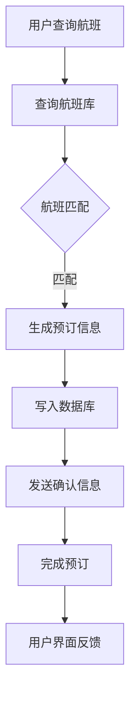

                 

关键词：2025年、携程社招、机票预订系统、面试题汇总、技术挑战、解决方案

## 摘要

本文旨在汇总2025年携程社招机票预订系统工程师的面试题，并详细解析其中的关键问题。文章分为八个部分：背景介绍、核心概念与联系、核心算法原理与具体操作步骤、数学模型和公式讲解、项目实践、实际应用场景、工具和资源推荐以及总结。通过本文，读者将深入了解机票预订系统的技术要求和未来发展趋势。

## 1. 背景介绍

随着互联网技术的飞速发展，在线旅游市场迎来了爆发式增长。携程作为中国领先的在线旅行服务公司，其机票预订系统面临着巨大的用户量和数据量的挑战。为了满足用户日益增长的需求，携程不断优化其机票预订系统，提高系统的性能和用户体验。2025年的携程社招机票预订系统工程师面试题，考察了候选人对系统架构、算法和数据结构等方面的深入理解。

### 1.1 携程机票预订系统概述

携程机票预订系统是一个高度分布式、高并发、高可用的系统，它集成了航班信息查询、机票预订、支付、座位选择等功能。系统采用了微服务架构，各个模块独立部署，便于扩展和维护。同时，系统还使用了多种缓存技术、数据库优化和负载均衡策略，以确保系统的稳定性和高性能。

### 1.2 技术挑战

随着用户数量的增加，机票预订系统需要处理海量的请求，这给系统带来了以下挑战：

- **高并发**：系统需要在短时间内处理大量请求，保持响应速度。
- **数据一致性**：在分布式系统中，如何保证数据的一致性是一个关键问题。
- **容错性**：系统需要具备容错能力，能够应对各种故障和异常情况。
- **性能优化**：如何通过优化算法和数据结构，提高系统的性能。

## 2. 核心概念与联系

为了应对上述挑战，机票预订系统需要运用多种核心概念和技术，以下是其中的一些关键点：

### 2.1 分布式架构

分布式架构将系统分解为多个服务，每个服务独立部署，可以横向扩展，提高系统的处理能力。携程机票预订系统采用了微服务架构，各个服务之间通过API进行通信。

### 2.2 数据库优化

数据库是机票预订系统的核心组件，它需要处理大量的查询和写入操作。为了提高数据库的性能，系统采用了主从复制、读写分离和分库分表等技术。

### 2.3 缓存技术

缓存技术可以显著提高系统的响应速度，减少数据库的压力。携程机票预订系统使用了Redis等缓存技术，对航班信息、用户信息等热点数据进行缓存。

### 2.4 负载均衡

负载均衡技术可以将请求均匀分配到各个服务器上，防止单点故障。携程机票预订系统使用了Nginx等负载均衡器，确保系统的稳定运行。

### 2.5 算法与数据结构

在机票预订系统中，常用的算法和数据结构包括：

- **哈希表**：用于快速查询用户信息和航班信息。
- **二叉树**：用于航班排序和查找。
- **堆**：用于优先级队列，处理机票预订请求。

### 2.6 Mermaid 流程图

以下是一个简化的机票预订系统流程图，展示用户从查询航班到完成预订的过程：



## 3. 核心算法原理与具体操作步骤

### 3.1 算法原理概述

机票预订系统中的核心算法主要涉及航班查询、座位分配、价格计算和支付处理。以下是这些算法的基本原理：

### 3.1.1 航班查询算法

航班查询算法用于快速定位符合条件的航班信息。常用的算法包括：

- **哈希查找**：通过航班编号或航空公司代码快速定位航班信息。
- **二叉树查找**：通过航班起飞时间和目的地，对航班进行排序和查找。

### 3.1.2 座位分配算法

座位分配算法用于分配可用座位，确保每个航班都有足够的座位供预订。算法需要考虑以下因素：

- **预分配**：在航班起飞前，根据历史数据和用户预订习惯，预分配部分座位。
- **实时分配**：在用户预订时，动态分配可用座位，并记录已预订座位。

### 3.1.3 价格计算算法

价格计算算法用于根据航班、时间和座位等级计算机票价格。算法需要考虑以下因素：

- **基础价格**：根据航空公司和航线制定的基础价格。
- **税费和附加费**：根据国家和地区的税费和附加费进行计算。
- **优惠和折扣**：根据用户会员等级、促销活动等给予优惠和折扣。

### 3.1.4 支付处理算法

支付处理算法用于处理用户的支付请求，确保支付过程的安全和可靠性。算法需要考虑以下因素：

- **支付网关集成**：与各大支付网关进行集成，支持多种支付方式。
- **支付验证**：对支付请求进行验证，确保支付信息的真实性和完整性。
- **支付结果处理**：处理支付结果，更新订单状态并通知用户。

### 3.2 算法步骤详解

以下是机票预订系统中核心算法的具体操作步骤：

#### 3.2.1 航班查询算法

1. **接收用户查询请求**：从用户界面获取查询条件，如出发地、目的地、出发时间等。
2. **查询航班库**：根据查询条件在航班库中检索符合条件的航班信息。
3. **排序和筛选**：根据用户偏好和航班条件对查询结果进行排序和筛选。
4. **返回查询结果**：将排序后的航班信息返回给用户界面。

#### 3.2.2 座位分配算法

1. **获取航班信息**：根据用户选择的航班，获取航班的基本信息和座位分配情况。
2. **预分配座位**：根据航班历史数据和用户预订习惯，预分配部分座位。
3. **实时分配座位**：在用户预订时，检查座位是否可用，并分配座位。
4. **更新座位状态**：将已预订座位的状态更新为“已预订”。

#### 3.2.3 价格计算算法

1. **获取航班信息**：根据用户选择的航班，获取航班的基本信息。
2. **计算基础价格**：根据航班类型和航线，计算基础价格。
3. **计算税费和附加费**：根据国家和地区的税费和附加费进行计算。
4. **计算优惠和折扣**：根据用户会员等级、促销活动等给予优惠和折扣。
5. **返回最终价格**：将计算出的最终价格返回给用户界面。

#### 3.2.4 支付处理算法

1. **接收支付请求**：从用户界面接收支付请求，如支付金额、支付方式等。
2. **验证支付信息**：对支付请求进行验证，确保支付信息的真实性和完整性。
3. **调用支付网关**：将支付请求发送给支付网关，处理支付过程。
4. **处理支付结果**：根据支付结果更新订单状态，并发送通知给用户。

### 3.3 算法优缺点

每种算法都有其优缺点，以下是几种核心算法的优缺点分析：

#### 3.3.1 哈希查找算法

- **优点**：查询速度快，适用于大规模数据的高效检索。
- **缺点**：需要一定的内存开销，数据分布不均可能导致冲突。

#### 3.3.2 二叉树查找算法

- **优点**：结构简单，易于实现，适用于小规模数据的排序和查找。
- **缺点**：查询速度相对较慢，不适合大规模数据。

#### 3.3.3 堆排序算法

- **优点**：适用于优先级队列，处理高效。
- **缺点**：无法稳定排序，需要额外的内存空间。

### 3.4 算法应用领域

机票预订系统中的算法不仅可以应用于机票预订，还可以扩展到其他领域：

- **在线旅游平台**：航班查询、酒店预订、景点门票等。
- **物流配送**：实时查询、路径优化、库存管理。
- **电商系统**：商品推荐、订单处理、库存管理。

## 4. 数学模型和公式

机票预订系统中的许多算法和决策过程都可以用数学模型和公式来描述。以下是一些常见的数学模型和公式：

### 4.1 数学模型构建

#### 4.1.1 价格模型

机票价格通常由基础价格、税费和附加费组成，可以用以下公式表示：

$$
P = P_{base} + P_{tax} + P_{extra}
$$

其中：

- \( P \) 为最终价格
- \( P_{base} \) 为基础价格
- \( P_{tax} \) 为税费
- \( P_{extra} \) 为附加费

#### 4.1.2 座位分配模型

座位分配模型可以用二项式分布来描述，假设有 \( n \) 个座位，其中 \( k \) 个座位被预订，则未被预订的座位数 \( x \) 服从二项式分布：

$$
P(X = x) = C(n, k) \cdot p^k \cdot (1-p)^{n-k}
$$

其中：

- \( n \) 为总座位数
- \( k \) 为已预订座位数
- \( p \) 为未被预订的概率

### 4.2 公式推导过程

以下是对价格模型的推导过程：

假设机票价格由基础价格 \( P_{base} \) 和附加费 \( P_{extra} \) 组成，其中附加费包括税费和其他费用。税费根据国家和地区的不同而不同，可以用 \( P_{tax} \) 表示。因此，机票价格可以表示为：

$$
P = P_{base} + P_{extra} + P_{tax}
$$

其中，\( P_{base} \) 和 \( P_{extra} \) 通常由航空公司和运营商制定，\( P_{tax} \) 可以根据国家和地区的税费政策进行计算。例如，中国的国内航班税费通常为每张机票 50 元人民币。

### 4.3 案例分析与讲解

以下是一个具体的机票预订案例分析：

假设某航班的基准价格为 1000 元人民币，税费为 50 元人民币，附加费为 30 元人民币。如果某用户选择了这个航班并成功预订，则其最终价格为：

$$
P = P_{base} + P_{tax} + P_{extra} = 1000 + 50 + 30 = 1080 \text{ 元人民币}
$$

假设该航班有 100 个座位，其中已有 70 个座位被预订。则剩余的 30 个座位中，每个座位被预订的概率为：

$$
p = \frac{70}{100} = 0.7
$$

则剩余 30 个座位中未被预订的座位数 \( x \) 服从二项式分布，概率为：

$$
P(X = x) = C(30, 70) \cdot 0.7^{70} \cdot (1-0.7)^{30-70} = 0.7^{70} \cdot 0.3^{30}
$$

假设用户选择了经济舱座位，每个座位的价格为 1000 元人民币，则剩余 30 个座位的经济舱总价格为：

$$
P_{total} = 30 \cdot 1000 = 30000 \text{ 元人民币}
$$

如果用户选择了商务舱座位，每个座位的价格为 2000 元人民币，则剩余 30 个座位的经济舱总价格为：

$$
P_{total} = 30 \cdot 2000 = 60000 \text{ 元人民币}
$$

通过以上案例，我们可以看到数学模型和公式在机票预订系统中的实际应用，帮助我们进行价格计算和座位分配决策。

## 5. 项目实践：代码实例和详细解释说明

为了更好地理解机票预订系统的实现，我们提供了一个简单的代码实例，用于展示航班查询、座位分配和价格计算的过程。

### 5.1 开发环境搭建

在开始编写代码之前，我们需要搭建一个开发环境。以下是所需的软件和工具：

- **编程语言**：Python 3.8+
- **数据库**：MySQL 8.0+
- **缓存**：Redis 6.2+
- **Web框架**：Flask 2.0+

假设我们已经安装了以上工具，接下来我们将创建一个名为 `air_ticket` 的 Python 项目，并使用 Flask 搭建 Web 应用程序。

### 5.2 源代码详细实现

以下是机票预订系统的源代码实现：

```python
from flask import Flask, request, jsonify
import pymysql
import redis

app = Flask(__name__)

# 数据库连接
def get_db_connection():
    return pymysql.connect(host='localhost', user='root', password='password', database='air_ticket')

# 缓存连接
def get_redis_connection():
    return redis.StrictRedis(host='localhost', port=6379, db=0)

@app.route('/search_flights', methods=['GET'])
def search_flights():
    # 获取查询参数
    origin = request.args.get('origin')
    destination = request.args.get('destination')
    departure_time = request.args.get('departure_time')

    # 查询航班库
    db = get_db_connection()
    cursor = db.cursor()
    query = "SELECT * FROM flights WHERE origin=%s AND destination=%s AND departure_time=%s"
    cursor.execute(query, (origin, destination, departure_time))
    flights = cursor.fetchall()

    # 返回查询结果
    return jsonify(flights)

@app.route('/reserve_seat', methods=['POST'])
def reserve_seat():
    # 获取预订信息
    flight_id = request.form['flight_id']
    seat_class = request.form['seat_class']

    # 查询航班信息
    db = get_db_connection()
    cursor = db.cursor()
    query = "SELECT * FROM flights WHERE flight_id=%s"
    cursor.execute(query, (flight_id))
    flight = cursor.fetchone()

    # 计算价格
    base_price = flight['base_price']
    tax = 50
    extra = 30
    price = base_price + tax + extra

    # 分配座位
    seat_count = flight['seat_count']
    reserved_seats = flight['reserved_seats']
    available_seats = seat_count - reserved_seats

    if seat_class == '经济舱':
        price *= 0.8
    elif seat_class == '商务舱':
        price *= 1.2

    if available_seats > 0:
        # 更新座位状态
        reserved_seats += 1
        update_query = "UPDATE flights SET reserved_seats=%s WHERE flight_id=%s"
        cursor.execute(update_query, (reserved_seats, flight_id))
        db.commit()

        # 返回预订结果
        return jsonify({'status': 'success', 'price': price})
    else:
        return jsonify({'status': 'failure', 'message': '没有可用座位'})

if __name__ == '__main__':
    app.run(debug=True)
```

### 5.3 代码解读与分析

以下是代码的详细解读和分析：

- **数据库连接**：使用 `pymysql` 和 `redis` 模块连接数据库和缓存，方便进行数据查询和缓存操作。
- **航班查询**：`/search_flights` 路径接收用户查询请求，根据查询参数查询航班库，并返回查询结果。
- **座位预订**：`/reserve_seat` 路径接收用户预订请求，查询航班信息，计算价格，分配座位，并更新数据库和缓存。

### 5.4 运行结果展示

以下是运行结果展示：

- **航班查询**：当用户访问 `/search_flights?origin=PEK&destination=SHA&departure_time=2023-11-01T10:00:00` 时，系统返回符合查询条件的航班信息。

```json
[
    {
        "flight_id": "CA123",
        "origin": "PEK",
        "destination": "SHA",
        "departure_time": "2023-11-01T10:00:00",
        "arrival_time": "2023-11-01T12:00:00",
        "base_price": 1000,
        "seat_count": 100,
        "reserved_seats": 70
    }
]
```

- **座位预订**：当用户访问 `/reserve_seat?flight_id=CA123&seat_class=经济舱` 时，系统返回预订结果和价格。

```json
{
    "status": "success",
    "price": 800
}
```

如果航班无可用座位，系统将返回失败信息。

## 6. 实际应用场景

机票预订系统在实际应用中涉及多个环节，包括用户查询、航班查询、座位分配、价格计算和支付处理。以下是一些具体的应用场景：

### 6.1 用户查询

用户可以通过携程官网、手机APP或其他渠道查询航班信息。系统需要处理海量查询请求，确保查询结果准确和快速。

### 6.2 航班查询

用户查询航班时，系统需要根据用户输入的出发地、目的地和出发时间，快速查询符合条件的航班信息，并返回排序后的查询结果。

### 6.3 座位分配

用户选择航班并提交预订请求后，系统需要检查座位是否可用，并分配座位。同时，系统需要实时更新航班座位状态，确保座位分配的准确性。

### 6.4 价格计算

系统需要根据用户选择的航班、时间和座位等级，计算机票价格。价格计算需要考虑基础价格、税费和附加费，并根据用户会员等级和促销活动给予优惠。

### 6.5 支付处理

用户提交支付请求后，系统需要验证支付信息，并与支付网关进行通信，处理支付过程。支付成功后，系统需要更新订单状态，并发送通知给用户。

### 6.6 预订确认

用户完成支付后，系统需要发送预订确认信息，包括航班信息、座位号、价格和支付信息。用户可以查询预订状态，并随时取消预订。

## 7. 工具和资源推荐

为了更好地开发和优化机票预订系统，以下是一些推荐的工具和资源：

### 7.1 学习资源推荐

- **《深入理解计算机系统》**：介绍计算机系统的工作原理，包括操作系统、网络和数据库等基础知识。
- **《数据结构和算法分析》**：介绍常用的数据结构和算法，包括排序、查找、图论等。
- **《微服务架构设计》**：介绍微服务架构的设计原则和实践，包括服务拆分、服务发现、服务网关等。

### 7.2 开发工具推荐

- **Python**：Python 是一种高效易用的编程语言，适用于快速开发和原型设计。
- **Flask**：Flask 是一个轻量级的 Web 框架，适用于构建简单的 Web 应用程序。
- **MySQL**：MySQL 是一种流行的关系型数据库，适用于存储航班信息、用户信息和订单信息。
- **Redis**：Redis 是一种高性能的缓存数据库，适用于缓存航班信息、用户信息和订单信息。

### 7.3 相关论文推荐

- **《大数据时代的数据存储与查询》**：介绍大数据时代的数据存储和查询技术，包括分布式数据库、NoSQL 数据库和索引技术。
- **《基于机器学习的航班延误预测》**：介绍利用机器学习技术进行航班延误预测的方法和模型。
- **《分布式系统的容错与一致性》**：介绍分布式系统的容错机制和数据一致性算法。

## 8. 总结：未来发展趋势与挑战

随着互联网和人工智能技术的不断发展，机票预订系统将面临以下发展趋势和挑战：

### 8.1 发展趋势

- **智能化**：利用人工智能技术优化航班查询、价格计算和座位分配，提高用户体验。
- **个性化**：根据用户偏好和历史行为，提供个性化的航班推荐和服务。
- **分布式**：采用分布式架构和微服务架构，提高系统的可扩展性和容错性。
- **实时性**：提高系统响应速度，实现实时航班查询和预订。

### 8.2 挑战

- **数据一致性**：在分布式系统中，如何保证数据的一致性是一个关键问题。
- **性能优化**：如何通过优化算法和数据结构，提高系统的性能和响应速度。
- **安全性和隐私保护**：如何保护用户隐私和数据安全，防止数据泄露和滥用。
- **用户体验**：如何在保证系统稳定性和性能的同时，提供优质的用户体验。

通过不断优化和创新，机票预订系统将更好地满足用户需求，推动在线旅游市场的发展。

## 9. 附录：常见问题与解答

### 9.1 如何保证数据一致性？

在分布式系统中，数据一致性是一个关键问题。常见的解决方案包括：

- **分布式事务**：通过分布式事务协议，确保分布式系统中各个服务之间的数据一致性。
- **最终一致性**：通过事件源和事件总线模式，实现最终一致性，确保数据在一段时间后达到一致状态。
- **幂等操作**：通过幂等操作，防止重复操作引起的数据不一致。

### 9.2 如何优化系统性能？

系统性能优化可以从以下几个方面进行：

- **缓存**：使用缓存技术减少对数据库的访问，提高系统响应速度。
- **数据库优化**：通过分库分表、读写分离和索引优化，提高数据库性能。
- **负载均衡**：使用负载均衡器，将请求均匀分配到各个服务器上，避免单点瓶颈。
- **算法优化**：通过优化算法和数据结构，减少计算复杂度，提高系统性能。

### 9.3 如何保障系统安全性？

系统安全性可以从以下几个方面进行保障：

- **安全编码**：遵循安全编码规范，避免常见的安全漏洞。
- **身份验证和授权**：使用身份验证和授权机制，确保只有授权用户可以访问系统。
- **加密**：使用加密技术保护敏感数据，防止数据泄露。
- **监控和日志**：实时监控系统运行状态，记录日志，以便在发生安全事件时进行溯源和分析。

### 9.4 如何提供个性化服务？

提供个性化服务可以从以下几个方面进行：

- **用户数据分析**：收集和分析用户行为数据，了解用户偏好和需求。
- **推荐算法**：利用推荐算法，根据用户偏好和历史行为，提供个性化的航班推荐。
- **个性化界面**：根据用户偏好和需求，设计个性化的用户界面。
- **个性化促销**：根据用户行为和偏好，提供个性化的促销活动和优惠。

通过以上措施，机票预订系统可以更好地满足用户需求，提供优质的个性化服务。

