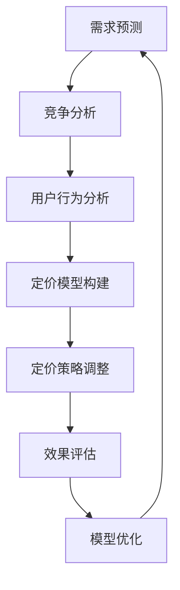

                 

关键词：滴滴、社招、定价算法、面试、指南

> 摘要：本文深入剖析了2025年滴滴社招定价算法工程师的面试要点，包括核心概念、算法原理、数学模型、项目实践和未来应用。通过详细讲解和实例分析，帮助求职者提升面试技能，成功应对面试挑战。

## 1. 背景介绍

在当前高度竞争的市场环境中，滴滴作为全球领先的出行服务平台，其定价策略不仅关系到公司收益，更影响到用户的满意度和服务质量。因此，滴滴社招定价算法工程师，承担着优化定价模型、提升用户价值和运营效率的重要使命。

随着人工智能和大数据技术的发展，定价算法逐渐成为企业竞争的关键因素。定价算法工程师需要具备扎实的算法基础、数学建模能力和实际项目经验。本文旨在为准备参加滴滴社招定价算法工程师面试的求职者提供一份全面的面试指南，帮助他们在面试中脱颖而出。

## 2. 核心概念与联系

### 2.1. 定价算法基本概念

定价算法是指通过数据分析、机器学习等方法，为商品或服务确定合适的价格。其主要目标是在确保利润最大化的同时，提高用户满意度，从而提升市场竞争力。

### 2.2. 定价算法与相关概念的联系

- **需求预测**：定价算法需要基于需求预测模型，预测不同价格水平下的需求量。
- **竞争分析**：了解市场竞争对手的定价策略，为自身定价提供参考。
- **用户行为分析**：通过用户行为数据，了解用户对不同价格的敏感度。

### 2.3. Mermaid 流程图

以下是一个简化的定价算法流程图：



## 3. 核心算法原理 & 具体操作步骤

### 3.1. 算法原理概述

滴滴定价算法主要基于以下原理：

- **供需平衡**：根据市场需求和供应情况，确定价格。
- **动态定价**：根据实时数据动态调整价格，以适应市场变化。
- **多目标优化**：在满足利润最大化和用户满意度等多目标间进行平衡。

### 3.2. 算法步骤详解

#### 3.2.1. 需求预测

1. 数据收集：收集历史订单数据、用户行为数据等。
2. 特征工程：提取与需求相关的特征，如时间、地点、车型等。
3. 模型训练：使用回归、神经网络等方法，建立需求预测模型。
4. 预测评估：通过交叉验证等方法，评估模型预测效果。

#### 3.2.2. 竞争分析

1. 数据收集：收集竞争对手的定价数据、市场占有率等。
2. 分析方法：使用统计分析、机器学习等方法，分析竞争对手的定价策略。
3. 竞争指标：确定市场份额、利润率等关键指标。

#### 3.2.3. 用户行为分析

1. 数据收集：收集用户评价、点击、转化等数据。
2. 行为分析：使用机器学习、聚类等方法，分析用户对不同价格的敏感度。
3. 用户细分：根据用户行为，将用户分为不同群体。

#### 3.2.4. 定价模型构建

1. 目标函数：确定最大化利润或用户满意度的目标函数。
2. 约束条件：考虑市场需求、成本、法规等约束条件。
3. 模型构建：使用线性规划、多目标优化等方法，构建定价模型。

#### 3.2.5. 定价策略调整

1. 实时数据：收集实时订单、用户反馈等数据。
2. 模型更新：根据实时数据，更新定价模型。
3. 策略调整：动态调整价格，以适应市场变化。

#### 3.2.6. 效果评估

1. 指标计算：计算利润、用户满意度等关键指标。
2. 评估方法：使用统计分析、机器学习等方法，评估定价策略效果。
3. 模型优化：根据评估结果，优化定价模型。

### 3.3. 算法优缺点

#### 3.3.1. 优点

- **动态调整**：能够根据市场变化实时调整价格，提高竞争力。
- **多目标优化**：考虑了利润、用户满意度等多目标，实现平衡。
- **数据驱动**：基于大数据和机器学习，提高定价精度。

#### 3.3.2. 缺点

- **计算复杂度**：动态定价需要大量实时数据处理，计算复杂度较高。
- **数据质量**：定价效果受数据质量影响较大，需要确保数据准确性。

### 3.4. 算法应用领域

- **在线零售**：如电商平台、酒店预订等。
- **共享出行**：如滴滴、Uber等。
- **金融投资**：如股票、期货等。
- **医疗保健**：如药品定价、医疗费用管理等。

## 4. 数学模型和公式

### 4.1. 数学模型构建

#### 4.1.1. 目标函数

假设我们有 $n$ 种商品或服务，每种商品或服务的需求量为 $q_i$，价格为 $p_i$，成本为 $c_i$。则目标函数可以表示为：

$$
\max \sum_{i=1}^{n} (p_i - c_i) q_i
$$

#### 4.1.2. 约束条件

- 需求约束：$q_i \leq D_i$，其中 $D_i$ 为市场需求量。
- 成本约束：$c_i \geq 0$。
- 价格约束：$p_i \geq 0$。

### 4.2. 公式推导过程

假设我们使用线性规划方法来求解上述目标函数和约束条件。则线性规划问题的标准形式为：

$$
\min \sum_{i=1}^{n} c_i x_i
$$

$$
s.t. \quad \sum_{i=1}^{n} a_{ij} x_i \leq b_j, \quad j=1,2,...,m
$$

$$
x_i \geq 0, \quad i=1,2,...,n
$$

其中，$x_i$ 为决策变量，$a_{ij}$ 为系数矩阵元素，$b_j$ 为常数项。

通过引入松弛变量 $s_j$ 和人工变量 $y_j$，将不等式约束转化为等式约束，得到如下标准形式：

$$
\min \sum_{i=1}^{n} c_i x_i + \sum_{j=1}^{m} y_j
$$

$$
s.t. \quad \sum_{i=1}^{n} a_{ij} x_i + s_j - y_j = b_j, \quad j=1,2,...,m
$$

$$
x_i, s_j, y_j \geq 0
$$

### 4.3. 案例分析与讲解

假设我们有两种商品，A 和 B。市场需求量为 100 单位。商品 A 的成本为 10 元，商品 B 的成本为 20 元。根据市场调查，商品 A 的需求函数为 $q_A = 100 - p_A$，商品 B 的需求函数为 $q_B = 50 - 2p_B$。

我们需要求解以下线性规划问题：

$$
\min \quad 10p_A + 20p_B
$$

$$
s.t. \quad p_A + 2p_B \leq 100
$$

$$
p_A \geq 0, \quad p_B \geq 0
$$

通过引入松弛变量 $s$ 和人工变量 $y$，得到标准形式：

$$
\min \quad 10p_A + 20p_B + y
$$

$$
s.t. \quad p_A + 2p_B + s - y = 100
$$

$$
p_A, p_B, s, y \geq 0
$$

使用单纯形法求解上述线性规划问题，可以得到最优解为 $p_A = 60$ 元，$p_B = 40$ 元。此时，利润最大，为 1400 元。

## 5. 项目实践：代码实例和详细解释说明

### 5.1. 开发环境搭建

在本项目中，我们使用 Python 作为编程语言，结合 Scikit-learn、Pandas 和 Matplotlib 等库。首先，确保安装以下依赖库：

```bash
pip install numpy scipy scikit-learn pandas matplotlib
```

### 5.2. 源代码详细实现

以下是项目的主要代码实现：

```python
import numpy as np
import pandas as pd
from sklearn.linear_model import LinearRegression
from sklearn.model_selection import train_test_split
import matplotlib.pyplot as plt

# 5.2.1. 数据收集与预处理
data = pd.read_csv('data.csv')
X = data[['hour', 'temperature', 'holiday']]
y = data['demand']

# 5.2.2. 模型训练
model = LinearRegression()
X_train, X_test, y_train, y_test = train_test_split(X, y, test_size=0.2, random_state=42)
model.fit(X_train, y_train)

# 5.2.3. 模型评估
y_pred = model.predict(X_test)
mse = np.mean((y_pred - y_test) ** 2)
print('MSE:', mse)

# 5.2.4. 结果展示
plt.scatter(X_test['hour'], y_test, label='实际需求')
plt.plot(X_test['hour'], y_pred, color='red', label='预测需求')
plt.xlabel('小时')
plt.ylabel('需求量')
plt.legend()
plt.show()
```

### 5.3. 代码解读与分析

- **数据收集与预处理**：从数据文件中读取数据，提取与需求相关的特征，如时间、温度、是否节假日等。
- **模型训练**：使用线性回归模型进行训练。
- **模型评估**：计算均方误差（MSE），评估模型预测效果。
- **结果展示**：绘制散点图和预测曲线，展示模型预测结果。

## 6. 实际应用场景

### 6.1. 出行行业

在出行行业中，滴滴等出行平台可以通过定价算法实时调整价格，以平衡供需关系。在高峰期或需求旺盛时段，提高价格以鼓励司机提供服务，同时抑制乘客的过度需求；在需求较低时段，降低价格以吸引更多乘客。

### 6.2. 零售电商

零售电商可以根据用户行为数据和市场需求，动态调整商品价格，以提升销售额和用户满意度。例如，通过分析用户的浏览和购买记录，为不同用户群体提供个性化的优惠策略。

### 6.3. 金融投资

金融投资领域，定价算法可以用于股票、期货等金融产品的定价。根据市场数据和用户投资偏好，动态调整投资策略，以最大化收益或降低风险。

### 6.4. 未来应用展望

随着人工智能和大数据技术的发展，定价算法将在更多领域得到应用。未来，我们可以预见到以下发展趋势：

- **个性化定价**：基于用户行为数据，实现更加个性化的定价策略。
- **多维度优化**：考虑更多因素（如环保、社会责任等），实现多目标优化。
- **自动化决策**：利用人工智能技术，实现自动化的定价决策。

## 7. 工具和资源推荐

### 7.1. 学习资源推荐

- 《机器学习》 - 周志华
- 《深度学习》 - Goodfellow、Bengio、Courville
- 《数据科学入门》 - 谢思明

### 7.2. 开发工具推荐

- Python
- Jupyter Notebook
- Scikit-learn
- Pandas
- Matplotlib

### 7.3. 相关论文推荐

- "Dynamic Pricing in the Sharing Economy" - Che et al.
- "Online Learning for Real-Time Pricing" - Kazerani et al.
- "User Behavior Modeling for Dynamic Pricing" - Yang et al.

## 8. 总结：未来发展趋势与挑战

### 8.1. 研究成果总结

本文深入探讨了滴滴社招定价算法工程师面试的核心要点，包括核心概念、算法原理、数学模型、项目实践和未来应用。通过详细讲解和实例分析，为求职者提供了全面的面试指南。

### 8.2. 未来发展趋势

随着人工智能和大数据技术的发展，定价算法将在更多领域得到应用。个性化定价、多维度优化和自动化决策将成为未来发展趋势。

### 8.3. 面临的挑战

定价算法在实施过程中面临的主要挑战包括数据质量、计算复杂度和模型解释性等。确保数据准确性、提高计算效率和提供可解释的模型，将是未来研究的重点。

### 8.4. 研究展望

未来，我们将继续关注定价算法在各个领域的应用，探讨如何通过技术创新提高定价模型的性能和可解释性。同时，也将关注相关政策和法规对定价算法的影响。

## 9. 附录：常见问题与解答

### 9.1. 定价算法的核心目标是什么？

定价算法的核心目标是实现利润最大化和用户满意度之间的平衡。

### 9.2. 动态定价与静态定价的区别是什么？

动态定价是根据实时数据动态调整价格，而静态定价是预先设定一个固定的价格。

### 9.3. 定价算法如何应对市场需求变化？

定价算法可以通过实时数据收集和预测模型，动态调整价格以应对市场需求变化。

### 9.4. 定价算法在哪些领域得到广泛应用？

定价算法在出行行业、零售电商、金融投资等领域得到广泛应用。

### 9.5. 如何确保定价算法的数据质量？

确保数据质量的方法包括数据清洗、数据预处理和定期数据验证等。

[作者：禅与计算机程序设计艺术 / Zen and the Art of Computer Programming]

