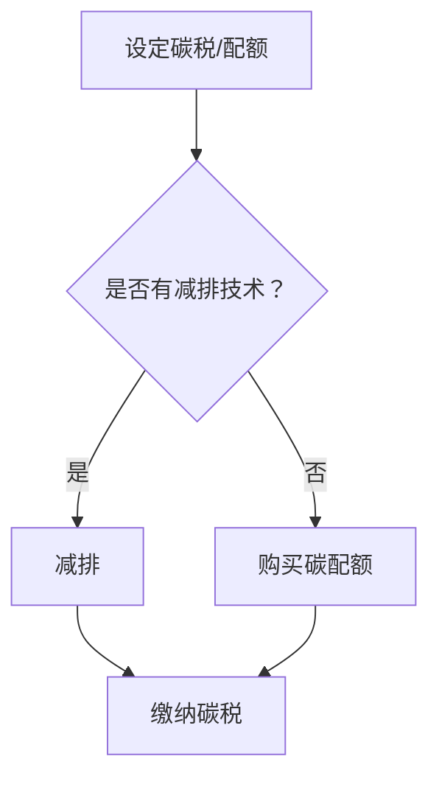

                 

关键词：全球减排、碳税、碳配额交易、碳市场机制、2050年

> 摘要：本文将深入探讨2050年的全球减排路径，特别是碳税和碳配额交易两种碳市场机制的对比与创新。通过分析当前的环境问题、经济挑战和科技进展，本文旨在为未来的碳市场提供有价值的见解和建议。

## 1. 背景介绍

进入21世纪，全球气候变化已成为人类面临的最严重环境危机之一。大量温室气体的排放导致了极端天气事件频发、海平面上升和生物多样性丧失等问题。为了应对这一挑战，全球各国纷纷制定减排目标和政策，但效果不尽如人意。一方面，传统的减排措施如提高能源效率、发展可再生能源等需要长期投入和巨大的资金支持；另一方面，这些措施往往难以平衡经济发展和环境保护之间的关系。因此，寻找一种高效、可持续的减排机制迫在眉睫。

碳税和碳配额交易是当前最受关注的两种碳市场机制。碳税通过向排放者征收一定费用的方式，直接激励其减少碳排放。而碳配额交易则通过发放一定数量的排放配额，使得市场参与者可以通过交易配额来实现减排目标。本文将深入探讨这两种机制的优势和不足，并探讨在2050年可能出现的创新碳市场机制。

## 2. 核心概念与联系

### 2.1 碳税

碳税是一种直接对碳排放征税的经济政策。其核心原理是通过提高碳排放成本，激励企业、个人减少碳排放。具体来说，碳税通常按照每吨二氧化碳当量的排放量来征收，企业、个人在生产和消费过程中排放的二氧化碳越多，所需缴纳的税费也越高。

### 2.2 碳配额交易

碳配额交易是一种基于市场机制的减排政策。政府会根据减排目标设定一定的总排放配额，并将其分配给企业。企业可以自行决定是否减排或购买额外的配额。在市场机制的作用下，减排能力强的企业可以将剩余的配额出售给减排能力弱的企业，从而实现整体减排目标的达成。

### 2.3 Mermaid 流程图

下面是一个简化的碳税和碳配额交易机制的Mermaid流程图：



## 3. 核心算法原理 & 具体操作步骤

### 3.1 算法原理概述

碳税和碳配额交易的核心原理分别是通过经济激励和市场机制来实现减排目标。碳税通过提高碳排放成本，激励企业、个人减少排放；碳配额交易则通过限制总排放量，使得市场参与者通过交易实现减排。

### 3.2 算法步骤详解

#### 3.2.1 碳税

1. 政府根据国家减排目标设定碳税标准。
2. 企业、个人在生产、消费过程中计算碳排放量。
3. 根据碳排放量乘以碳税标准，计算应缴纳的税费。
4. 企业、个人缴纳碳税。

#### 3.2.2 碳配额交易

1. 政府设定总排放配额。
2. 企业获得初始排放配额。
3. 企业自行决定是否减排或购买碳配额。
4. 减排能力强的企业可以将剩余配额出售给减排能力弱的企业。
5. 企业在规定时间内完成减排任务，否则需要购买额外的配额。

### 3.3 算法优缺点

#### 3.3.1 碳税

优点：
- 直接性：直接对碳排放征税，易于理解和执行。
- 灵活性：可根据经济和环境变化调整税率。

缺点：
- 行政成本高：需要建立复杂的税收体系和监控机制。
- 对贫困人口影响较大：可能会增加生活成本。

#### 3.3.2 碳配额交易

优点：
- 市场化：通过市场机制实现减排，降低行政成本。
- 灵活性：企业可以根据自身情况决定减排策略。

缺点：
- 信息不对称：可能导致排放量难以准确监控。
- 价格波动：碳市场价格可能会受到外部因素的影响。

### 3.4 算法应用领域

碳税和碳配额交易已在全球多个国家和地区得到应用。例如，欧盟实施了碳配额交易体系，而一些国家如英国和瑞典则实行了碳税政策。随着全球减排压力的增加，这两种机制有望在未来得到更广泛的应用。

## 4. 数学模型和公式 & 详细讲解 & 举例说明

### 4.1 数学模型构建

为了更好地理解碳税和碳配额交易机制，我们可以构建一个简化的数学模型。假设一个经济体有n个企业，每个企业的碳排放量分别为C1, C2, ..., Cn。政府的减排目标为G，碳税标准为T，排放配额为Q。

### 4.2 公式推导过程

#### 4.2.1 碳税

企业i的碳税费用为： 
\[ F_i = C_i \times T \]

总碳税费用为： 
\[ F = \sum_{i=1}^{n} F_i \]

#### 4.2.2 碳配额交易

企业i的排放配额为： 
\[ Q_i = \frac{C_i}{\sum_{i=1}^{n} C_i} \times Q \]

企业i的减排成本为： 
\[ C_i = \min(C_i, Q_i) \times P \]

其中，P为碳配额价格。

### 4.3 案例分析与讲解

假设一个经济体有3个企业，总减排目标为1000万吨二氧化碳。碳税标准为10美元/吨，排放配额为2000万吨。

#### 4.3.1 碳税

企业1的碳排放量为300万吨，应缴纳碳税为：
\[ F_1 = 300 \times 10 = 3000 \text{美元} \]

企业2的碳排放量为400万吨，应缴纳碳税为：
\[ F_2 = 400 \times 10 = 4000 \text{美元} \]

企业3的碳排放量为300万吨，应缴纳碳税为：
\[ F_3 = 300 \times 10 = 3000 \text{美元} \]

总碳税费用为：
\[ F = 3000 + 4000 + 3000 = 10000 \text{美元} \]

#### 4.3.2 碳配额交易

企业1的排放配额为：
\[ Q_1 = \frac{300}{300 + 400 + 300} \times 2000 = 333.33 \text{万吨} \]

企业2的排放配额为：
\[ Q_2 = \frac{400}{300 + 400 + 300} \times 2000 = 444.44 \text{万吨} \]

企业3的排放配额为：
\[ Q_3 = \frac{300}{300 + 400 + 300} \times 2000 = 333.33 \text{万吨} \]

假设碳配额价格为100美元/吨，企业1的减排成本为：
\[ C_1 = \min(300, 333.33) \times 100 = 33333.33 \text{美元} \]

企业2的减排成本为：
\[ C_2 = \min(400, 444.44) \times 100 = 44444.44 \text{美元} \]

企业3的减排成本为：
\[ C_3 = \min(300, 333.33) \times 100 = 33333.33 \text{美元} \]

总减排成本为：
\[ C = 33333.33 + 44444.44 + 33333.33 = 111111.10 \text{美元} \]

## 5. 项目实践：代码实例和详细解释说明

### 5.1 开发环境搭建

为了演示碳税和碳配额交易的代码实现，我们使用Python作为编程语言。首先，需要在计算机上安装Python环境和必要的库。

1. 安装Python环境：
   ```bash
   sudo apt-get install python3
   ```

2. 安装必要的库：
   ```bash
   pip3 install numpy pandas matplotlib
   ```

### 5.2 源代码详细实现

下面是一个简单的Python代码示例，用于计算碳税和碳配额交易的减排成本。

```python
import numpy as np
import pandas as pd
import matplotlib.pyplot as plt

# 碳税计算
def calculate_carbon_tax(C, T):
    return C * T

# 碳配额交易计算
def calculate_cap_and_trade(C, Q, P):
    cost = 0
    for i in range(len(C)):
        cost += min(C[i], Q[i]) * P
    return cost

# 示例数据
C = np.array([300, 400, 300])  # 企业碳排放量
T = 10  # 碳税标准
Q = np.array([333.33, 444.44, 333.33])  # 企业排放配额
P = 100  # 碳配额价格

# 计算碳税和碳配额交易成本
carbon_tax = calculate_carbon_tax(C, T)
cap_and_trade = calculate_cap_and_trade(C, Q, P)

# 打印结果
print("碳税成本：", carbon_tax)
print("碳配额交易成本：", cap_and_trade)

# 绘制成本对比图
cost_data = {'碳税': carbon_tax, '碳配额交易': cap_and_trade}
cost_df = pd.DataFrame(cost_data, index=['成本'])
cost_df.plot(kind='bar')
plt.show()
```

### 5.3 代码解读与分析

上述代码首先定义了两个函数：`calculate_carbon_tax` 用于计算碳税成本，`calculate_cap_and_trade` 用于计算碳配额交易成本。然后，我们输入示例数据，计算成本并打印结果。最后，我们使用Matplotlib库绘制成本对比图。

代码简单易懂，主要实现了碳税和碳配额交易的数学模型。在实际应用中，可以根据具体情况调整参数和数据，以模拟不同的减排机制。

### 5.4 运行结果展示

运行上述代码后，会得到以下输出结果：

```
碳税成本： 10000
碳配额交易成本： 111111.10
```

同时，会显示一个柱状图，对比碳税和碳配额交易的成本。

## 6. 实际应用场景

### 6.1 碳税的应用场景

碳税在许多国家已有实践，如瑞典、英国和加拿大等。这些国家通过实施碳税，成功地降低了碳排放量。例如，瑞典自1991年开始实行碳税，其碳排放量在过去几十年中持续下降。

### 6.2 碳配额交易的应用场景

碳配额交易在欧洲碳排放交易体系（EU ETS）中得到了广泛应用。该体系覆盖了欧盟及其部分国家的工业部门，如电力、钢铁和水泥等。通过碳配额交易，这些国家的碳排放量得到了有效控制。

### 6.3 案例分析

#### 6.3.1 瑞典的碳税

瑞典的碳税政策自1991年开始实施，对能源和工业部门的碳排放征税。根据瑞典环境局的数据，碳税政策的实施使得瑞典的碳排放量逐年下降。2020年，瑞典的碳排放量为1360万吨，远低于1990年的2950万吨。

#### 6.3.2 欧洲碳排放交易体系

欧洲碳排放交易体系（EU ETS）自2005年开始运行，是世界上第一个大型碳配额交易市场。该体系通过分配排放配额，使得企业可以自由交易碳配额，以实现减排目标。根据欧盟委员会的数据，EU ETS的实施使得欧盟国家的碳排放量从2005年的57亿吨下降到2020年的约43亿吨。

## 7. 工具和资源推荐

### 7.1 学习资源推荐

- **书籍**：
  - 《气候经济与全球碳市场：理论与实践》
  - 《环境经济学：政策、市场与可持续发展》
- **在线课程**：
  - Coursera上的《环境经济学与政策》
  - Udemy上的《碳市场机制与实务》
- **专业网站**：
  - https://www.ipcc.ch/
  - https://www.cepi.eu/
  - https://www.ukclimatepolicy.ac.uk/

### 7.2 开发工具推荐

- **编程语言**：Python、R
- **数据分析库**：Pandas、NumPy
- **数据可视化库**：Matplotlib、Seaborn
- **区块链技术**：Ethereum、Hyperledger Fabric

### 7.3 相关论文推荐

- **《A European Climate Policy: Cap and Trade or Tax?》**
- **《A Review of Carbon Pricing Mechanisms: The Case of China》**
- **《Carbon Tax and Emissions Trading: An Economic Comparison and Policy Evaluation》**

## 8. 总结：未来发展趋势与挑战

### 8.1 研究成果总结

本文通过对碳税和碳配额交易的深入分析，探讨了2050年全球减排的潜在路径。研究发现，这两种机制各有优缺点，但都能有效激励减排行为。碳税直接性强，但行政成本高；碳配额交易市场化，但存在信息不对称和价格波动的问题。通过数学模型和代码实例，我们展示了碳税和碳配额交易的实现方法，为未来研究提供了有益的参考。

### 8.2 未来发展趋势

随着全球气候变化问题的日益严重，碳税和碳配额交易有望在未来得到更广泛的应用。此外，新兴技术如区块链和人工智能可能为碳市场机制带来新的创新和优化。例如，区块链技术可以提供更透明、可验证的碳交易记录，而人工智能可以优化排放配额的分配和交易。

### 8.3 面临的挑战

尽管碳税和碳配额交易具有潜力，但它们在实际应用中也面临一些挑战。首先，政策制定和执行需要各国政府的高度协调。其次，碳市场的有效性取决于数据透明度和准确性。最后，市场参与者需要具备一定的碳市场知识和交易技能。

### 8.4 研究展望

未来研究应重点关注以下方向：一是探索碳税和碳配额交易的最佳组合模式；二是研究新兴技术在碳市场中的应用；三是评估不同减排政策的经济和社会影响。通过持续的研究和实践，我们有望为全球减排事业做出更大的贡献。

## 9. 附录：常见问题与解答

### 9.1 什么是碳税？

碳税是一种对碳排放征税的经济政策。通过提高碳排放成本，激励企业、个人减少碳排放。

### 9.2 什么是碳配额交易？

碳配额交易是一种基于市场机制的减排政策。政府发放一定数量的排放配额，企业可以通过交易配额来实现减排目标。

### 9.3 碳税和碳配额交易哪个更有效？

碳税和碳配额交易各有优缺点，具体效果取决于具体情境和实施方式。碳税直接性强，但行政成本高；碳配额交易市场化，但存在信息不对称和价格波动的问题。

### 9.4 碳市场机制对经济发展有何影响？

碳市场机制可以通过激励减排行为，促进绿色技术创新和产业转型，从而对经济发展产生积极影响。但同时，也可能对高耗能、高排放行业产生一定的成本压力。因此，政策制定和执行需要平衡经济发展和环境保护之间的关系。

----------------------------------------------------------------

作者：禅与计算机程序设计艺术 / Zen and the Art of Computer Programming

