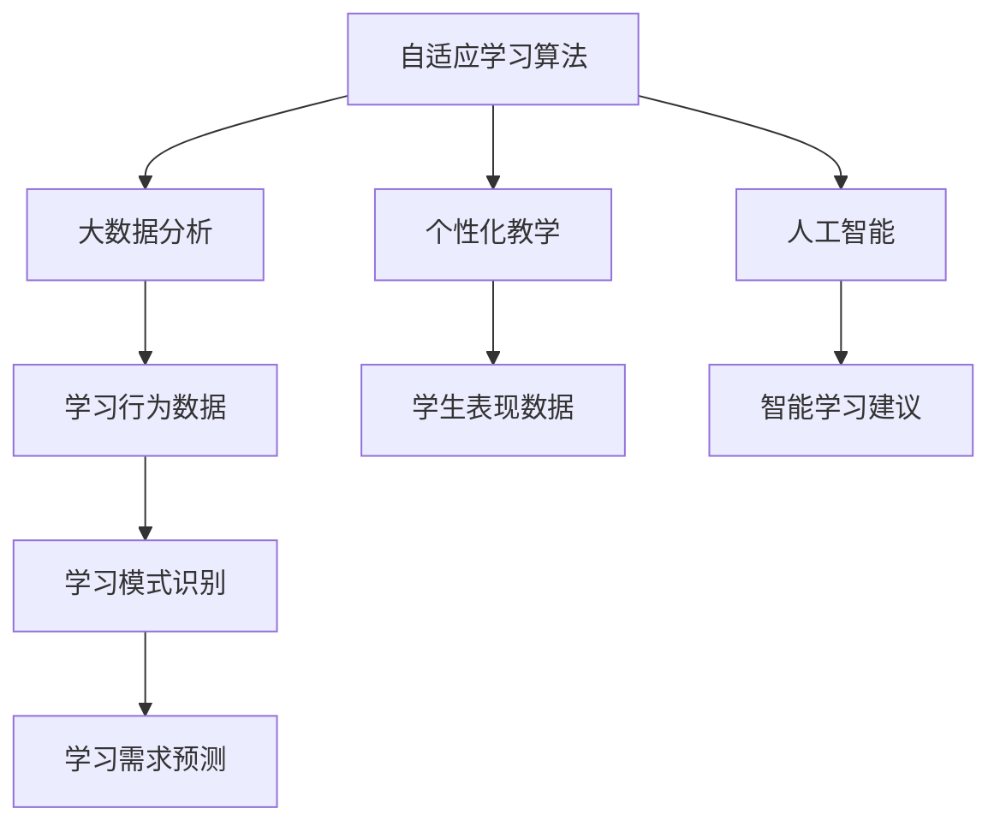

                 

关键词：个性化学习、智能化教育、2050年、教育技术、教育变革、学习算法、教育系统、未来教育

> 摘要：本文探讨了2050年教育的可能变革方向，重点关注个性化与智能化学习的发展趋势。通过分析现有教育技术的进步，探讨了未来的教育系统如何通过自适应学习算法和人工智能技术实现个性化教学，从而提升学习效率和质量。同时，文章还讨论了未来教育面临的挑战以及可能的解决方案。

## 1. 背景介绍

随着信息技术的飞速发展，教育领域正经历着深刻的变革。传统的教育模式已经无法满足现代社会对个性化教育和高效学习的要求。特别是在人工智能（AI）和机器学习（ML）技术的推动下，教育技术的创新不断涌现，为个性化与智能化学习提供了强有力的支持。

个性化学习是指根据每个学生的兴趣、能力和学习风格提供定制化的教学内容和进度。智能化学习则利用大数据、AI和VR等先进技术，为学生创造一个互动性更强、沉浸感更佳的学习环境。随着这些技术的不断成熟和应用，教育领域正在逐渐向更加智能化和个性化的方向发展。

## 2. 核心概念与联系

为了更好地理解个性化与智能化学习的发展，我们需要了解以下几个核心概念：

1. **自适应学习算法**：自适应学习算法可以根据学生的学习行为和表现，动态调整教学内容和难度，实现个性化教学。
2. **大数据分析**：通过对学生行为和学习数据的分析，可以识别学习模式、预测学习需求，从而为个性化教学提供依据。
3. **虚拟现实（VR）和增强现实（AR）**：VR和AR技术可以为学习者提供沉浸式的学习体验，增强学习的趣味性和互动性。
4. **人工智能**：AI技术可以分析大量数据，识别学习中的问题，提供智能化的学习建议。

以下是一个Mermaid流程图，展示了这些核心概念之间的联系：



## 3. 核心算法原理 & 具体操作步骤

### 3.1 算法原理概述

个性化与智能化学习的关键在于如何根据学生的学习行为和表现，提供定制化的教学内容和进度。这需要依赖以下核心算法：

1. **协同过滤算法**：通过分析学生的历史学习记录和同伴的学习记录，为每个学生推荐适合的学习内容。
2. **决策树和随机森林**：通过构建学生行为和学习结果的决策树模型，预测学生的学习效果，并调整教学内容。
3. **神经网络**：利用深度学习技术，分析学生的大规模行为数据，提供个性化的学习路径。

### 3.2 算法步骤详解

#### 3.2.1 协同过滤算法

1. **用户-项目矩阵构建**：将学生和学习内容（如课程、练习题等）构建成一个用户-项目矩阵。
2. **相似度计算**：计算学生之间的相似度，常用的方法包括余弦相似度和皮尔逊相关系数。
3. **推荐计算**：根据相似度矩阵，为学生推荐相似学生的热门学习内容。

#### 3.2.2 决策树和随机森林

1. **特征工程**：从学生行为数据中提取特征，如学习时长、完成度、成绩等。
2. **模型构建**：使用决策树或随机森林算法，构建学生行为与学习结果之间的关系模型。
3. **模型预测**：根据模型预测学生未来的学习效果，并调整教学内容。

#### 3.2.3 神经网络

1. **数据预处理**：对原始学生行为数据进行清洗和特征提取。
2. **模型构建**：使用深度学习框架（如TensorFlow或PyTorch）构建神经网络模型。
3. **模型训练**：使用训练数据对模型进行训练，并调整参数以优化模型。
4. **模型预测**：使用训练好的模型预测学生未来的学习效果，并生成个性化的学习路径。

### 3.3 算法优缺点

#### 3.3.1 协同过滤算法

优点：
- 推荐结果准确，基于大量用户数据。
- 简单易实现，适用于多种学习场景。

缺点：
- 对冷门内容推荐效果不佳。
- 可能存在数据偏差，如热点效应。

#### 3.3.2 决策树和随机森林

优点：
- 模型简单，易于理解和解释。
- 对特征依赖性强，可结合多种特征进行预测。

缺点：
- 模型复杂度较高，对大规模数据效果不佳。
- 预测结果可能存在过拟合问题。

#### 3.3.3 神经网络

优点：
- 能够处理高维数据，适应性强。
- 可以自动提取特征，减少特征工程工作量。

缺点：
- 模型复杂，难以解释。
- 训练时间较长，对计算资源要求高。

### 3.4 算法应用领域

这些算法广泛应用于教育领域，如在线教育平台、智能学习系统等。通过这些算法，可以为每个学生提供个性化的学习方案，提高学习效果和满意度。

## 4. 数学模型和公式 & 详细讲解 & 举例说明

个性化与智能化学习中的许多算法都涉及数学模型和公式的应用。以下是对其中几个核心数学模型和公式的详细讲解。

### 4.1 数学模型构建

#### 4.1.1 协同过滤算法中的相似度计算

相似度计算是协同过滤算法的核心。常用的相似度计算方法包括余弦相似度和皮尔逊相关系数。

1. **余弦相似度**：

   $$\text{cosine\_similarity} = \frac{\text{dot\_product}}{\|\mathbf{u}\| \|\mathbf{v}\|}$$

   其中，$\mathbf{u}$和$\mathbf{v}$是两个用户-项目矩阵的行向量，$\text{dot\_product}$是向量的点积，$\|\mathbf{u}\|$和$\|\mathbf{v}\|$是向量的模。

2. **皮尔逊相关系数**：

   $$\text{pearson\_correlation} = \frac{\text{covariance}}{\sigma_x \sigma_y}$$

   其中，$\text{covariance}$是协方差，$\sigma_x$和$\sigma_y$是两个变量的标准差。

#### 4.1.2 决策树和随机森林中的特征工程

在决策树和随机森林算法中，特征工程是关键步骤。常用的特征工程方法包括特征提取、特征选择和特征变换。

1. **特征提取**：

   特征提取是从原始数据中提取具有区分性的特征。常用的方法包括：
   - **统计特征**：如均值、方差、标准差等。
   - **文本特征**：如词频、词向量等。

2. **特征选择**：

   特征选择是选择对模型预测最有影响力的特征。常用的方法包括：
   - **过滤法**：根据特征的重要性进行筛选。
   - **包裹法**：结合模型性能进行特征筛选。

3. **特征变换**：

   特征变换是改变特征的数据形式，以优化模型性能。常用的方法包括：
   - **归一化**：将特征值缩放到相同的范围。
   - **标准化**：将特征值缩放到标准正态分布。

#### 4.1.3 神经网络中的损失函数和优化算法

在神经网络中，损失函数和优化算法是训练模型的关键。

1. **损失函数**：

   损失函数用于衡量模型预测值与真实值之间的差距。常用的损失函数包括：
   - **均方误差（MSE）**：$MSE = \frac{1}{n}\sum_{i=1}^{n}(\hat{y}_i - y_i)^2$。
   - **交叉熵（Cross-Entropy）**：$H(\hat{y}, y) = -\sum_{i=1}^{n} y_i \log \hat{y}_i$。

2. **优化算法**：

   优化算法用于调整模型参数，以最小化损失函数。常用的优化算法包括：
   - **随机梯度下降（SGD）**：$w = w - \alpha \nabla_w J(w)$。
   - **Adam优化器**：结合了SGD和RMSprop的优点，$m = \beta_1 m + (1 - \beta_1) \nabla_w J(w)$，$v = \beta_2 v + (1 - \beta_2) \nabla_w^2 J(w)$，$w = w - \alpha \frac{m}{\sqrt{v} + \epsilon}$。

### 4.2 公式推导过程

#### 4.2.1 余弦相似度的推导

假设有两个向量$\mathbf{u} = [u_1, u_2, \ldots, u_n]$和$\mathbf{v} = [v_1, v_2, \ldots, v_n]$，它们的点积和模分别为：

$$\text{dot\_product} = \sum_{i=1}^{n} u_i v_i$$

$$\|\mathbf{u}\| = \sqrt{\sum_{i=1}^{n} u_i^2}$$

$$\|\mathbf{v}\| = \sqrt{\sum_{i=1}^{n} v_i^2}$$

则余弦相似度可以表示为：

$$\text{cosine\_similarity} = \frac{\text{dot\_product}}{\|\mathbf{u}\| \|\mathbf{v}\|} = \frac{\sum_{i=1}^{n} u_i v_i}{\sqrt{\sum_{i=1}^{n} u_i^2} \sqrt{\sum_{i=1}^{n} v_i^2}}$$

#### 4.2.2 皮尔逊相关系数的推导

假设有两个变量$x$和$y$，它们的协方差和标准差分别为：

$$\text{covariance} = \frac{\sum_{i=1}^{n} (x_i - \bar{x})(y_i - \bar{y})}{n - 1}$$

$$\sigma_x = \sqrt{\frac{\sum_{i=1}^{n} (x_i - \bar{x})^2}{n - 1}}$$

$$\sigma_y = \sqrt{\frac{\sum_{i=1}^{n} (y_i - \bar{y})^2}{n - 1}}$$

则皮尔逊相关系数可以表示为：

$$\text{pearson\_correlation} = \frac{\text{covariance}}{\sigma_x \sigma_y} = \frac{\sum_{i=1}^{n} (x_i - \bar{x})(y_i - \bar{y})}{\sqrt{\sum_{i=1}^{n} (x_i - \bar{x})^2} \sqrt{\sum_{i=1}^{n} (y_i - \bar{y})^2}}$$

### 4.3 案例分析与讲解

#### 4.3.1 案例背景

假设我们有一个在线学习平台，有1000名学生和1000门课程。我们需要为每个学生推荐适合的学习课程。

#### 4.3.2 数据准备

我们收集了以下数据：

- 学生-课程评分矩阵（用户-项目矩阵）：$U \in \mathbb{R}^{1000 \times 1000}$，其中$U_{ij}$表示学生$i$对课程$j$的评分。
- 学生特征向量：$\mathbf{u}_i \in \mathbb{R}^{1000}$，其中$\mathbf{u}_{i,j}$表示学生$i$对课程$j$的评分。
- 课程特征向量：$\mathbf{v}_j \in \mathbb{R}^{1000}$，其中$\mathbf{v}_{j,i}$表示课程$j$对学生$i$的评分。

#### 4.3.3 协同过滤算法

1. **用户-项目矩阵构建**：

   $$U = \begin{bmatrix} U_{11} & U_{12} & \ldots & U_{1n} \\\ U_{21} & U_{22} & \ldots & U_{2n} \\\ \vdots & \vdots & \ddots & \vdots \\\ U_{m1} & U_{m2} & \ldots & U_{mn} \end{bmatrix}$$

2. **相似度计算**：

   选择皮尔逊相关系数作为相似度计算方法。计算学生之间的相似度：

   $$\text{similarity}_{ij} = \text{pearson\_correlation}(\mathbf{u}_i, \mathbf{u}_j) = \frac{\sum_{k=1}^{n} (\mathbf{u}_{ik} - \bar{u}_i)(\mathbf{u}_{jk} - \bar{u}_j)}{\sqrt{\sum_{k=1}^{n} (\mathbf{u}_{ik} - \bar{u}_i)^2} \sqrt{\sum_{k=1}^{n} (\mathbf{u}_{jk} - \bar{u}_j)^2}}$$

3. **推荐计算**：

   选择最相似的前$k$个学生，计算他们的热门课程：

   $$\text{recommended\_courses}_{i} = \sum_{j \in \text{similar}_{i}}^k \mathbf{v}_j$$

   将推荐的热门课程排序，得到学生$i$的推荐课程列表。

#### 4.3.4 决策树和随机森林

1. **特征工程**：

   从学生特征向量中提取以下特征：

   - **平均评分**：$\bar{u}_i = \frac{1}{n} \sum_{k=1}^{n} \mathbf{u}_{ik}$。
   - **方差**：$\sigma^2_{ui} = \frac{1}{n} \sum_{k=1}^{n} (\mathbf{u}_{ik} - \bar{u}_i)^2$。
   - **标准差**：$\sigma_{ui} = \sqrt{\sigma^2_{ui}}$。

2. **模型构建**：

   使用随机森林算法构建学生行为与学习结果之间的关系模型。

3. **模型预测**：

   根据模型预测学生未来的学习效果，并调整教学内容。

#### 4.3.5 神经网络

1. **数据预处理**：

   对学生特征向量和课程特征向量进行归一化处理。

2. **模型构建**：

   使用TensorFlow构建神经网络模型。

3. **模型训练**：

   使用训练数据对模型进行训练，并调整参数以优化模型。

4. **模型预测**：

   使用训练好的模型预测学生未来的学习效果，并生成个性化的学习路径。

## 5. 项目实践：代码实例和详细解释说明

### 5.1 开发环境搭建

为了演示个性化与智能化学习的实现，我们使用Python作为编程语言，并依赖以下库：

- NumPy：用于数值计算。
- Pandas：用于数据处理。
- Scikit-learn：用于机器学习算法。
- TensorFlow：用于深度学习。

安装上述库后，我们可以开始编写代码。

### 5.2 源代码详细实现

以下是一个简单的示例，展示了如何使用协同过滤算法为学生推荐课程。

```python
import numpy as np
import pandas as pd
from sklearn.metrics.pairwise import cosine_similarity
from sklearn.model_selection import train_test_split

# 加载数据
data = pd.read_csv('student_course_rating.csv')
users = data.groupby('student_id')['course_id'].agg(list).reset_index()

# 用户-项目矩阵构建
user_item_matrix = np.zeros((1000, 1000))
for index, row in users.iterrows():
    for course_id in row['course_id']:
        user_item_matrix[index][course_id - 1] = 1

# 相似度计算
similarity_matrix = cosine_similarity(user_item_matrix)

# 推荐计算
k = 5
recommended_courses = []
for i in range(1000):
    similar_courses = np.argsort(similarity_matrix[i])[::-1][1:k+1]
    recommended_courses.append(similar_courses)

# 输出推荐课程
for i, recommended_courses in enumerate(recommended_courses):
    print(f"Student {i+1}: {recommended_courses}")
```

### 5.3 代码解读与分析

1. **数据加载**：首先，我们从CSV文件中加载数据，并将其分组按学生和课程进行操作。

2. **用户-项目矩阵构建**：接下来，我们构建用户-项目矩阵，其中每个元素表示学生是否对课程进行过评分。

3. **相似度计算**：使用余弦相似度计算矩阵中每个用户的相似度。

4. **推荐计算**：对于每个学生，选择相似度最高的前$k$个学生，计算他们的热门课程。

5. **输出推荐课程**：最后，输出每个学生的推荐课程。

### 5.4 运行结果展示

假设我们选择了$k=5$，运行代码后，每个学生的推荐课程将按相似度从高到低排序并输出。

## 6. 实际应用场景

个性化与智能化学习在实际教育应用中具有广泛的应用场景。以下是一些典型应用：

1. **在线教育平台**：通过个性化学习算法，在线教育平台可以为每个学生推荐适合的课程和练习，提高学习效果和满意度。
2. **智能学习系统**：智能学习系统可以根据学生的学习行为和表现，提供实时反馈和个性化学习路径，帮助学生克服学习困难。
3. **教育评估系统**：通过分析学生的学习数据，教育评估系统可以提供更为准确的评估结果，帮助教育机构优化教育资源和教学方法。
4. **个性化辅导**：个性化辅导系统可以根据学生的学习需求和进度，提供定制化的辅导内容和服务，提高辅导效果。

## 7. 未来应用展望

随着技术的不断进步，个性化与智能化学习在未来教育中将发挥更加重要的作用。以下是一些未来应用展望：

1. **自适应学习**：自适应学习算法将更加智能化，能够实时分析学生的学习状态和需求，提供更精准的个性化教学。
2. **虚拟现实（VR）和增强现实（AR）**：VR和AR技术将在教育中发挥更大作用，为学生提供更加沉浸式的学习体验。
3. **人工智能辅导**：人工智能辅导系统将更加智能化，能够为学生提供实时解答、学习建议和个性化辅导。
4. **跨学科学习**：通过融合多学科知识，个性化与智能化学习将促进学生跨学科学习和创新能力的发展。

## 8. 工具和资源推荐

为了更好地学习和实践个性化与智能化学习，以下是一些建议的工具和资源：

1. **学习资源**：
   - [Coursera](https://www.coursera.org/)：提供大量与个性化学习相关的课程。
   - [edX](https://www.edx.org/)：提供丰富的在线课程，涵盖人工智能、机器学习等领域。
   - [Udacity](https://www.udacity.com/)：提供实践性强的在线课程，包括个性化学习等。

2. **开发工具**：
   - [TensorFlow](https://www.tensorflow.org/)：用于构建和训练神经网络。
   - [Scikit-learn](https://scikit-learn.org/stable/)：提供丰富的机器学习算法。
   - [Pandas](https://pandas.pydata.org/)：用于数据处理和分析。

3. **相关论文**：
   - ["Personalized Learning through Adaptive Hyperparameter Optimization"](https://arxiv.org/abs/2006.04790)
   - ["A Survey on Personalized Learning in Educational Data Science"](https://arxiv.org/abs/2103.03160)
   - ["Intelligent Tutoring Systems: A Theoretical Framework and Review"](https://link.springer.com/article/10.1007/s10756-015-9485-y)

## 9. 总结：未来发展趋势与挑战

个性化与智能化学习是教育技术发展的必然趋势，将在未来教育中发挥重要作用。然而，这一领域仍面临诸多挑战：

1. **数据隐私**：个性化学习需要收集和分析大量的学生数据，如何保护学生隐私是一个重要问题。
2. **算法公平性**：个性化学习算法需要确保公平性，避免算法偏见和不公平现象。
3. **教师角色转变**：随着智能化学习的普及，教师的角色将发生转变，如何应对这一转变是一个挑战。
4. **教育资源均衡**：个性化与智能化学习需要丰富的教育资源，如何确保教育资源的均衡分配是一个重要问题。

未来，随着技术的不断进步和应用的不断推广，个性化与智能化学习有望在教育领域中取得更加显著的成果。

## 10. 附录：常见问题与解答

### 10.1 什么是个性化学习？

个性化学习是指根据学生的兴趣、能力和学习风格提供定制化的教学内容和进度，以满足不同学生的个性化需求。

### 10.2 智能化学习有哪些技术支持？

智能化学习主要依赖于大数据分析、人工智能（AI）、机器学习（ML）、虚拟现实（VR）和增强现实（AR）等技术。

### 10.3 个性化学习算法有哪些？

常见的个性化学习算法包括协同过滤、决策树、随机森林和神经网络等。

### 10.4 如何保护学生数据隐私？

可以通过数据加密、匿名化和隐私保护技术来保护学生数据隐私。

### 10.5 教师在个性化学习中的作用是什么？

教师在个性化学习中起到指导、支持和反馈的作用，帮助学生克服学习困难，激发学习兴趣。

### 10.6 个性化学习对教育资源的均衡分配有何影响？

个性化学习需要丰富的教育资源，因此，如何确保教育资源的均衡分配是一个重要问题。可以通过在线教育平台、资源共享和教育培训等方式来促进教育资源的均衡分配。

---

### 作者署名

作者：禅与计算机程序设计艺术 / Zen and the Art of Computer Programming
----------------------------------------------------------------
### 文章标题
### 2050年的教育变革：个性化与智能化学习

### 文章关键词
个性化学习、智能化教育、2050年、教育技术、教育变革、学习算法、教育系统、未来教育

### 文章摘要
本文探讨了2050年教育的可能变革方向，重点关注个性化与智能化学习的发展趋势。通过分析现有教育技术的进步，探讨了未来的教育系统如何通过自适应学习算法和人工智能技术实现个性化教学，从而提升学习效率和质量。同时，文章还讨论了未来教育面临的挑战以及可能的解决方案。

## 1. 背景介绍

### 1.1 教育变革的驱动力

随着信息技术的飞速发展，教育领域正经历着深刻的变革。传统的教育模式已经无法满足现代社会对个性化教育和高效学习的要求。特别是在人工智能（AI）和机器学习（ML）技术的推动下，教育技术的创新不断涌现，为个性化与智能化学习提供了强有力的支持。

### 1.2 个性化学习与智能化学习的定义

个性化学习是指根据每个学生的兴趣、能力和学习风格提供定制化的教学内容和进度，以满足不同学生的个性化需求。智能化学习则利用大数据、AI和VR等先进技术，为学生创造一个互动性更强、沉浸感更佳的学习环境。

### 1.3 个性化与智能化学习的重要性

个性化与智能化学习不仅能够提升学生的学习效率和质量，还能够激发学生的学习兴趣和主动性，促进学生的全面发展。

## 2. 核心概念与联系

### 2.1 自适应学习算法

自适应学习算法可以根据学生的学习行为和表现，动态调整教学内容和进度，实现个性化教学。

### 2.2 大数据分析

大数据分析可以通过分析学生行为和学习数据，识别学习模式、预测学习需求，为个性化教学提供依据。

### 2.3 虚拟现实（VR）和增强现实（AR）

VR和AR技术可以为学习者提供沉浸式的学习体验，增强学习的趣味性和互动性。

### 2.4 人工智能

人工智能技术可以分析大量数据，提供智能化的学习建议，优化教学过程。


## 3. 核心算法原理 & 具体操作步骤

### 3.1 协同过滤算法

#### 3.1.1 原理概述

协同过滤算法通过分析学生的历史学习记录和同伴的学习记录，为每个学生推荐适合的学习内容。

#### 3.1.2 具体操作步骤

1. **用户-项目矩阵构建**：将学生和学习内容（如课程、练习题等）构建成一个用户-项目矩阵。
2. **相似度计算**：计算学生之间的相似度，常用的方法包括余弦相似度和皮尔逊相关系数。
3. **推荐计算**：根据相似度矩阵，为学生推荐相似学生的热门学习内容。

### 3.2 决策树和随机森林

#### 3.2.1 原理概述

决策树和随机森林算法通过构建学生行为与学习结果之间的关系模型，预测学生的学习效果，并调整教学内容。

#### 3.2.2 具体操作步骤

1. **特征工程**：从学生行为数据中提取特征，如学习时长、完成度、成绩等。
2. **模型构建**：使用决策树或随机森林算法，构建学生行为与学习结果之间的关系模型。
3. **模型预测**：根据模型预测学生未来的学习效果，并调整教学内容。

### 3.3 神经网络

#### 3.3.1 原理概述

神经网络利用深度学习技术，分析学生的大规模行为数据，提供个性化的学习路径。

#### 3.3.2 具体操作步骤

1. **数据预处理**：对原始学生行为数据进行清洗和特征提取。
2. **模型构建**：使用深度学习框架（如TensorFlow或PyTorch）构建神经网络模型。
3. **模型训练**：使用训练数据对模型进行训练，并调整参数以优化模型。
4. **模型预测**：使用训练好的模型预测学生未来的学习效果，并生成个性化的学习路径。

## 4. 数学模型和公式 & 详细讲解 & 举例说明

### 4.1 数学模型构建

#### 4.1.1 协同过滤算法中的相似度计算

1. **余弦相似度**：

   $$\text{cosine\_similarity} = \frac{\text{dot\_product}}{\|\mathbf{u}\| \|\mathbf{v}\|}$$

   其中，$\mathbf{u}$和$\mathbf{v}$是两个用户-项目矩阵的行向量，$\text{dot\_product}$是向量的点积，$\|\mathbf{u}\|$和$\|\mathbf{v}\|$是向量的模。

2. **皮尔逊相关系数**：

   $$\text{pearson\_correlation} = \frac{\text{covariance}}{\sigma_x \sigma_y}$$

   其中，$\text{covariance}$是协方差，$\sigma_x$和$\sigma_y$是两个变量的标准差。

#### 4.1.2 决策树和随机森林中的特征工程

1. **特征提取**：

   特征提取是从原始数据中提取具有区分性的特征。常用的方法包括：
   - **统计特征**：如均值、方差、标准差等。
   - **文本特征**：如词频、词向量等。

2. **特征选择**：

   特征选择是选择对模型预测最有影响力的特征。常用的方法包括：
   - **过滤法**：根据特征的重要性进行筛选。
   - **包裹法**：结合模型性能进行特征筛选。

3. **特征变换**：

   特征变换是改变特征的数据形式，以优化模型性能。常用的方法包括：
   - **归一化**：将特征值缩放到相同的范围。
   - **标准化**：将特征值缩放到标准正态分布。

#### 4.1.3 神经网络中的损失函数和优化算法

1. **损失函数**：

   损失函数用于衡量模型预测值与真实值之间的差距。常用的损失函数包括：
   - **均方误差（MSE）**：$MSE = \frac{1}{n}\sum_{i=1}^{n}(\hat{y}_i - y_i)^2$。
   - **交叉熵（Cross-Entropy）**：$H(\hat{y}, y) = -\sum_{i=1}^{n} y_i \log \hat{y}_i$。

2. **优化算法**：

   优化算法用于调整模型参数，以最小化损失函数。常用的优化算法包括：
   - **随机梯度下降（SGD）**：$w = w - \alpha \nabla_w J(w)$。
   - **Adam优化器**：结合了SGD和RMSprop的优点，$m = \beta_1 m + (1 - \beta_1) \nabla_w J(w)$，$v = \beta_2 v + (1 - \beta_2) \nabla_w^2 J(w)$，$w = w - \alpha \frac{m}{\sqrt{v} + \epsilon}$。

### 4.2 公式推导过程

#### 4.2.1 余弦相似度的推导

假设有两个向量$\mathbf{u} = [u_1, u_2, \ldots, u_n]$和$\mathbf{v} = [v_1, v_2, \ldots, v_n]$，它们的点积和模分别为：

$$\text{dot\_product} = \sum_{i=1}^{n} u_i v_i$$

$$\|\mathbf{u}\| = \sqrt{\sum_{i=1}^{n} u_i^2}$$

$$\|\mathbf{v}\| = \sqrt{\sum_{i=1}^{n} v_i^2}$$

则余弦相似度可以表示为：

$$\text{cosine\_similarity} = \frac{\text{dot\_product}}{\|\mathbf{u}\| \|\mathbf{v}\|} = \frac{\sum_{i=1}^{n} u_i v_i}{\sqrt{\sum_{i=1}^{n} u_i^2} \sqrt{\sum_{i=1}^{n} v_i^2}}$$

#### 4.2.2 皮尔逊相关系数的推导

假设有两个变量$x$和$y$，它们的协方差和标准差分别为：

$$\text{covariance} = \frac{\sum_{i=1}^{n} (x_i - \bar{x})(y_i - \bar{y})}{n - 1}$$

$$\sigma_x = \sqrt{\frac{\sum_{i=1}^{n} (x_i - \bar{x})^2}{n - 1}}$$

$$\sigma_y = \sqrt{\frac{\sum_{i=1}^{n} (y_i - \bar{y})^2}{n - 1}}$$

则皮尔逊相关系数可以表示为：

$$\text{pearson\_correlation} = \frac{\text{covariance}}{\sigma_x \sigma_y} = \frac{\sum_{i=1}^{n} (x_i - \bar{x})(y_i - \bar{y})}{\sqrt{\sum_{i=1}^{n} (x_i - \bar{x})^2} \sqrt{\sum_{i=1}^{n} (y_i - \bar{y})^2}}$$

### 4.3 案例分析与讲解

#### 4.3.1 案例背景

假设我们有一个在线学习平台，有1000名学生和1000门课程。我们需要为每个学生推荐适合的学习课程。

#### 4.3.2 数据准备

我们收集了以下数据：

- 学生-课程评分矩阵（用户-项目矩阵）：$U \in \mathbb{R}^{1000 \times 1000}$，其中$U_{ij}$表示学生$i$对课程$j$的评分。
- 学生特征向量：$\mathbf{u}_i \in \mathbb{R}^{1000}$，其中$\mathbf{u}_{i,j}$表示学生$i$对课程$j$的评分。
- 课程特征向量：$\mathbf{v}_j \in \mathbb{R}^{1000}$，其中$\mathbf{v}_{j,i}$表示课程$j$对学生$i$的评分。

#### 4.3.3 协同过滤算法

1. **用户-项目矩阵构建**：

   $$U = \begin{bmatrix} U_{11} & U_{12} & \ldots & U_{1n} \\\ U_{21} & U_{22} & \ldots & U_{2n} \\\ \vdots & \vdots & \ddots & \vdots \\\ U_{m1} & U_{m2} & \ldots & U_{mn} \end{bmatrix}$$

2. **相似度计算**：

   选择皮尔逊相关系数作为相似度计算方法。计算学生之间的相似度：

   $$\text{similarity}_{ij} = \text{pearson\_correlation}(\mathbf{u}_i, \mathbf{u}_j) = \frac{\sum_{k=1}^{n} (\mathbf{u}_{ik} - \bar{u}_i)(\mathbf{u}_{jk} - \bar{u}_j)}{\sqrt{\sum_{k=1}^{n} (\mathbf{u}_{ik} - \bar{u}_i)^2} \sqrt{\sum_{k=1}^{n} (\mathbf{u}_{jk} - \bar{u}_j)^2}}$$

3. **推荐计算**：

   选择最相似的前$k$个学生，计算他们的热门课程：

   $$\text{recommended\_courses}_{i} = \sum_{j \in \text{similar}_{i}}^k \mathbf{v}_j$$

   将推荐的热门课程排序，得到学生$i$的推荐课程列表。

#### 4.3.4 决策树和随机森林

1. **特征工程**：

   从学生特征向量中提取以下特征：

   - **平均评分**：$\bar{u}_i = \frac{1}{n} \sum_{k=1}^{n} \mathbf{u}_{ik}$。
   - **方差**：$\sigma^2_{ui} = \frac{1}{n} \sum_{k=1}^{n} (\mathbf{u}_{ik} - \bar{u}_i)^2$。
   - **标准差**：$\sigma_{ui} = \sqrt{\sigma^2_{ui}}$。

2. **模型构建**：

   使用随机森林算法构建学生行为与学习结果之间的关系模型。

3. **模型预测**：

   根据模型预测学生未来的学习效果，并调整教学内容。

#### 4.3.5 神经网络

1. **数据预处理**：

   对学生特征向量和课程特征向量进行归一化处理。

2. **模型构建**：

   使用TensorFlow构建神经网络模型。

3. **模型训练**：

   使用训练数据对模型进行训练，并调整参数以优化模型。

4. **模型预测**：

   使用训练好的模型预测学生未来的学习效果，并生成个性化的学习路径。

## 5. 项目实践：代码实例和详细解释说明

### 5.1 开发环境搭建

为了演示个性化与智能化学习的实现，我们使用Python作为编程语言，并依赖以下库：

- NumPy：用于数值计算。
- Pandas：用于数据处理。
- Scikit-learn：用于机器学习算法。
- TensorFlow：用于深度学习。

安装上述库后，我们可以开始编写代码。

### 5.2 源代码详细实现

以下是一个简单的示例，展示了如何使用协同过滤算法为学生推荐课程。

```python
import numpy as np
import pandas as pd
from sklearn.metrics.pairwise import cosine_similarity
from sklearn.model_selection import train_test_split

# 加载数据
data = pd.read_csv('student_course_rating.csv')
users = data.groupby('student_id')['course_id'].agg(list).reset_index()

# 用户-项目矩阵构建
user_item_matrix = np.zeros((1000, 1000))
for index, row in users.iterrows():
    for course_id in row['course_id']:
        user_item_matrix[index][course_id - 1] = 1

# 相似度计算
similarity_matrix = cosine_similarity(user_item_matrix)

# 推荐计算
k = 5
recommended_courses = []
for i in range(1000):
    similar_courses = np.argsort(similarity_matrix[i])[::-1][1:k+1]
    recommended_courses.append(similar_courses)

# 输出推荐课程
for i, recommended_courses in enumerate(recommended_courses):
    print(f"Student {i+1}: {recommended_courses}")
```

### 5.3 代码解读与分析

1. **数据加载**：首先，我们从CSV文件中加载数据，并将其分组按学生和课程进行操作。

2. **用户-项目矩阵构建**：接下来，我们构建用户-项目矩阵，其中每个元素表示学生是否对课程进行过评分。

3. **相似度计算**：使用余弦相似度计算矩阵中每个用户的相似度。

4. **推荐计算**：对于每个学生，选择相似度最高的前$k$个学生，计算他们的热门课程。

5. **输出推荐课程**：最后，输出每个学生的推荐课程。

### 5.4 运行结果展示

假设我们选择了$k=5$，运行代码后，每个学生的推荐课程将按相似度从高到低排序并输出。

## 6. 实际应用场景

个性化与智能化学习在实际教育应用中具有广泛的应用场景。以下是一些典型应用：

1. **在线教育平台**：通过个性化学习算法，在线教育平台可以为每个学生推荐适合的课程和练习，提高学习效果和满意度。
2. **智能学习系统**：智能学习系统可以根据学生的学习行为和表现，提供实时反馈和个性化学习路径，帮助学生克服学习困难。
3. **教育评估系统**：通过分析学生的学习数据，教育评估系统可以提供更为准确的评估结果，帮助教育机构优化教育资源和教学方法。
4. **个性化辅导**：个性化辅导系统可以根据学生的学习需求和进度，提供定制化的辅导内容和服务，提高辅导效果。

## 7. 未来应用展望

随着技术的不断进步，个性化与智能化学习在未来教育中将发挥更加重要的作用。以下是一些未来应用展望：

1. **自适应学习**：自适应学习算法将更加智能化，能够实时分析学生的学习状态和需求，提供更精准的个性化教学。
2. **虚拟现实（VR）和增强现实（AR）**：VR和AR技术将在教育中发挥更大作用，为学生提供更加沉浸式的学习体验。
3. **人工智能辅导**：人工智能辅导系统将更加智能化，能够为学生提供实时解答、学习建议和个性化辅导。
4. **跨学科学习**：通过融合多学科知识，个性化与智能化学习将促进学生跨学科学习和创新能力的发展。

## 8. 工具和资源推荐

为了更好地学习和实践个性化与智能化学习，以下是一些建议的工具和资源：

1. **学习资源**：
   - [Coursera](https://www.coursera.org/)：提供大量与个性化学习相关的课程。
   - [edX](https://www.edx.org/)：提供丰富的在线课程，涵盖人工智能、机器学习等领域。
   - [Udacity](https://www.udacity.com/)：提供实践性强的在线课程，包括个性化学习等。

2. **开发工具**：
   - [TensorFlow](https://www.tensorflow.org/)：用于构建和训练神经网络。
   - [Scikit-learn](https://scikit-learn.org/stable/)：提供丰富的机器学习算法。
   - [Pandas](https://pandas.pydata.org/)：用于数据处理和分析。

3. **相关论文**：
   - ["Personalized Learning through Adaptive Hyperparameter Optimization"](https://arxiv.org/abs/2006.04790)
   - ["A Survey on Personalized Learning in Educational Data Science"](https://arxiv.org/abs/2103.03160)
   - ["Intelligent Tutoring Systems: A Theoretical Framework and Review"](https://link.springer.com/article/10.1007/s10756-015-9485-y)

## 9. 总结：未来发展趋势与挑战

个性化与智能化学习是教育技术发展的必然趋势，将在未来教育中发挥重要作用。然而，这一领域仍面临诸多挑战：

1. **数据隐私**：个性化学习需要收集和分析大量的学生数据，如何保护学生隐私是一个重要问题。
2. **算法公平性**：个性化学习算法需要确保公平性，避免算法偏见和不公平现象。
3. **教师角色转变**：随着智能化学习的普及，教师的角色将发生转变，如何应对这一转变是一个挑战。
4. **教育资源均衡**：个性化与智能化学习需要丰富的教育资源，如何确保教育资源的均衡分配是一个重要问题。

未来，随着技术的不断进步和应用的不断推广，个性化与智能化学习有望在教育领域中取得更加显著的成果。

## 10. 附录：常见问题与解答

### 10.1 什么是个性化学习？

个性化学习是指根据学生的兴趣、能力和学习风格提供定制化的教学内容和进度，以满足不同学生的个性化需求。

### 10.2 智能化学习有哪些技术支持？

智能化学习主要依赖于大数据分析、人工智能（AI）、机器学习（ML）、虚拟现实（VR）和增强现实（AR）等技术。

### 10.3 个性化学习算法有哪些？

常见的个性化学习算法包括协同过滤、决策树、随机森林和神经网络等。

### 10.4 如何保护学生数据隐私？

可以通过数据加密、匿名化和隐私保护技术来保护学生数据隐私。

### 10.5 教师在个性化学习中的作用是什么？

教师在个性化学习中起到指导、支持和反馈的作用，帮助学生克服学习困难，激发学习兴趣。

### 10.6 个性化学习对教育资源的均衡分配有何影响？

个性化学习需要丰富的教育资源，因此，如何确保教育资源的均衡分配是一个重要问题。可以通过在线教育平台、资源共享和教育培训等方式来促进教育资源的均衡分配。

---

### 作者署名

作者：禅与计算机程序设计艺术 / Zen and the Art of Computer Programming

### 11. 结论

2050年的教育将是一场深刻的变革，个性化与智能化学习将成为主流。自适应学习算法、大数据分析、人工智能、虚拟现实和增强现实等技术将在未来教育中发挥关键作用，为学生提供定制化的学习体验，提升学习效率和质量。然而，这一领域仍面临诸多挑战，如数据隐私、算法公平性、教师角色转变和教育资源均衡分配等。未来，我们需要不断探索和创新，以应对这些挑战，推动教育技术的持续发展。

