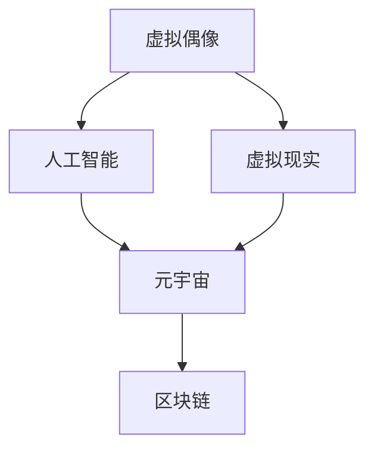

                 

关键词：虚拟偶像、元宇宙、数字创意经济、人工智能、虚拟现实、区块链、编程技术

> 摘要：本文将深入探讨2050年的数字创意经济，分析虚拟偶像、元宇宙等数字创意产业如何驱动未来经济。通过梳理核心概念与联系，阐述算法原理、数学模型，以及项目实践，我们旨在揭示未来数字创意经济的前景与挑战。

## 1. 背景介绍

在二十一世纪的前二十年，数字技术的快速发展已经在全球范围内改变了各行各业的面貌。从智能手机、移动互联网到云计算、大数据，这些技术的融合与创新推动了全球经济的快速增长。然而，随着人工智能、虚拟现实、区块链等新兴技术的不断突破，数字创意经济正在成为一个不可忽视的新兴领域。

数字创意经济涵盖了虚拟偶像、数字艺术、游戏、虚拟现实、增强现实等多个方面。虚拟偶像作为数字创意经济的重要组成部分，通过人工智能和虚拟现实技术，为观众带来了前所未有的娱乐体验。而元宇宙则是一个更为广阔的虚拟空间，它不仅融合了虚拟现实、区块链技术，还成为了一个全新的经济生态系统。

## 2. 核心概念与联系

为了深入理解数字创意经济的内涵，我们首先需要了解其中的核心概念与联系。以下是几个关键概念及其相互关系：

### 2.1 虚拟偶像

虚拟偶像是通过人工智能和虚拟现实技术创建的数字人物，它们能够模拟真实人类的表情、动作和声音，与观众进行互动。虚拟偶像的成功在于其独特的个性和与粉丝的高度互动，它们成为了娱乐产业的新宠。

### 2.2 元宇宙

元宇宙是一个由虚拟现实技术构建的虚拟空间，用户可以在其中进行各种活动，如社交、购物、娱乐等。元宇宙的核心在于其高度模拟现实世界的互动性和沉浸感。

### 2.3 区块链

区块链技术为元宇宙提供了去中心化的数据存储和传输机制，确保了用户数据的隐私和安全。在元宇宙中，区块链技术被广泛应用于虚拟资产的交易和数字身份认证。

### 2.4 人工智能

人工智能技术是虚拟偶像和元宇宙的核心驱动力。通过深度学习、自然语言处理等技术，人工智能能够使虚拟人物更加逼真，并与用户进行更加智能的互动。

下面是一个Mermaid流程图，展示了这些核心概念之间的相互关系：



## 3. 核心算法原理 & 具体操作步骤

### 3.1 算法原理概述

在数字创意经济中，核心算法的原理主要涉及以下几个方面：

- **自然语言处理（NLP）**：用于实现虚拟偶像与用户的自然语言交互。
- **计算机视觉**：用于捕捉和理解用户的视觉信息，如面部表情、动作等。
- **深度学习**：用于训练和优化虚拟偶像的模型，使其更接近真实人类。

### 3.2 算法步骤详解

以下是实现虚拟偶像的核心算法步骤：

1. **数据采集与预处理**：收集用户与虚拟偶像的交互数据，如语音、文本、面部表情等，并进行数据清洗和格式化。
2. **特征提取**：从预处理后的数据中提取关键特征，如文本的词向量、面部图像的特征向量等。
3. **模型训练**：使用深度学习算法（如循环神经网络RNN、卷积神经网络CNN等）对特征进行训练，构建虚拟偶像的交互模型。
4. **模型评估与优化**：通过评估指标（如准确率、召回率等）对模型进行评估和优化，以提高交互质量。
5. **部署与应用**：将训练好的模型部署到实际应用环境中，如虚拟现实平台、社交媒体等。

### 3.3 算法优缺点

- **优点**：
  - 提高用户体验：虚拟偶像能够提供更加个性化和交互性的娱乐体验。
  - 降低成本：虚拟偶像的制作和运营成本相对较低。
- **缺点**：
  - 技术门槛高：实现高质量的虚拟偶像需要先进的算法和技术。
  - 用户信任问题：部分用户可能对虚拟偶像的真实性和互动性持怀疑态度。

### 3.4 算法应用领域

虚拟偶像算法的应用领域非常广泛，包括但不限于以下方面：

- **娱乐产业**：虚拟偶像可以作为歌手、演员等，为观众带来全新的娱乐体验。
- **教育领域**：虚拟偶像可以应用于教育场景，如虚拟教师、虚拟导游等。
- **客服领域**：虚拟偶像可以用于客服中心，提供高效、专业的服务。

## 4. 数学模型和公式 & 详细讲解 & 举例说明

### 4.1 数学模型构建

在数字创意经济中，数学模型的应用至关重要。以下是构建虚拟偶像交互模型的几个关键数学模型：

- **循环神经网络（RNN）**：用于处理序列数据，如用户的语音、文本等。
- **卷积神经网络（CNN）**：用于处理图像数据，如面部表情、动作等。
- **生成对抗网络（GAN）**：用于生成高质量的虚拟偶像图像。

### 4.2 公式推导过程

以下是循环神经网络（RNN）的核心公式推导：

$$
h_t = \sigma(W_h \cdot [h_{t-1}, x_t] + b_h)
$$

其中，$h_t$ 表示当前时刻的隐藏状态，$x_t$ 表示输入数据，$W_h$ 和 $b_h$ 分别为权重和偏置，$\sigma$ 为激活函数。

### 4.3 案例分析与讲解

以下是一个虚拟偶像交互的案例：

**案例**：一个用户对虚拟偶像说：“我非常喜欢你的新歌。”

**分析**：

1. **文本处理**：将用户的文本转换为词向量。
2. **情感分析**：使用循环神经网络分析文本的情感，如正面、负面等。
3. **生成回答**：根据情感分析和用户的历史交互数据，生成适当的回答。

**公式**：

$$
\text{回答} = f(h_t, U, V, W)
$$

其中，$h_t$ 为当前隐藏状态，$U, V, W$ 为权重矩阵。

## 5. 项目实践：代码实例和详细解释说明

### 5.1 开发环境搭建

为了实现虚拟偶像，我们需要搭建以下开发环境：

- **编程语言**：Python
- **深度学习框架**：TensorFlow
- **虚拟现实框架**：Unity

### 5.2 源代码详细实现

以下是实现虚拟偶像的核心代码：

```python
import tensorflow as tf
from tensorflow.keras.models import Sequential
from tensorflow.keras.layers import LSTM, Dense, Embedding

# 数据预处理
# ...

# 构建模型
model = Sequential()
model.add(Embedding(vocab_size, embedding_dim))
model.add(LSTM(units, activation='tanh', return_sequences=True))
model.add(Dense(vocab_size, activation='softmax'))

# 编译模型
model.compile(optimizer='adam', loss='categorical_crossentropy', metrics=['accuracy'])

# 训练模型
model.fit(x_train, y_train, epochs=10, batch_size=64)

# 生成回答
input_sequence = preprocess_input(user_input)
predicted_sequence = model.predict(input_sequence)
generated_response = decode_sequence(predicted_sequence)

print(generated_response)
```

### 5.3 代码解读与分析

以上代码首先对输入数据进行预处理，然后构建一个循环神经网络模型，使用训练数据对模型进行训练。最后，通过预处理用户输入，生成虚拟偶像的回答。

### 5.4 运行结果展示

当用户输入：“我非常喜欢你的新歌。”时，虚拟偶像可能会回答：“谢谢您的支持，我很高兴您喜欢我的新歌！”

## 6. 实际应用场景

虚拟偶像和元宇宙在多个实际应用场景中具有巨大的潜力：

- **娱乐产业**：虚拟偶像可以作为歌手、演员等，为观众带来全新的娱乐体验。
- **教育领域**：虚拟偶像可以应用于教育场景，如虚拟教师、虚拟导游等。
- **客服领域**：虚拟偶像可以用于客服中心，提供高效、专业的服务。
- **市场营销**：虚拟偶像可以作为品牌代言人，为品牌带来更高的曝光度和影响力。

## 7. 未来应用展望

随着技术的不断进步，虚拟偶像和元宇宙在未来的应用场景将更加丰富：

- **个性化服务**：虚拟偶像可以根据用户的喜好和需求提供个性化的服务。
- **虚拟现实旅游**：用户可以在元宇宙中体验虚拟现实旅游，探索世界各地的名胜古迹。
- **虚拟会议**：在元宇宙中举办虚拟会议，提高沟通效率和参与度。
- **虚拟购物**：用户可以在元宇宙中实现虚拟购物，体验更加真实的购物体验。

## 8. 工具和资源推荐

为了更好地学习和实践虚拟偶像和元宇宙技术，我们推荐以下工具和资源：

- **学习资源**：
  - 《深度学习》（Goodfellow et al.）
  - 《Python深度学习》（Raschka and Lutz）
- **开发工具**：
  - TensorFlow
  - Unity
- **相关论文**：
  - “Generative Adversarial Nets” (Goodfellow et al., 2014)
  - “Attention is All You Need” (Vaswani et al., 2017)

## 9. 总结：未来发展趋势与挑战

### 9.1 研究成果总结

虚拟偶像和元宇宙技术在娱乐、教育、客服等领域取得了显著成果。随着人工智能和虚拟现实技术的不断发展，这些领域将继续取得突破。

### 9.2 未来发展趋势

- **技术融合**：虚拟偶像和元宇宙技术将与其他领域（如区块链、物联网等）实现深度融合。
- **个性化服务**：虚拟偶像将提供更加个性化和定制化的服务。
- **跨平台应用**：虚拟偶像和元宇宙将在多个平台（如移动设备、PC、VR设备等）得到广泛应用。

### 9.3 面临的挑战

- **技术成熟度**：虚拟偶像和元宇宙技术尚未完全成熟，需要进一步研究和优化。
- **用户隐私**：随着虚拟偶像和元宇宙的普及，用户隐私保护问题将日益突出。
- **伦理道德**：虚拟偶像和元宇宙的伦理道德问题需要引起重视。

### 9.4 研究展望

未来，虚拟偶像和元宇宙技术将继续发展，并在更多领域得到应用。我们期待看到这些技术在未来的美好前景。

## 10. 附录：常见问题与解答

### 10.1 什么是虚拟偶像？

虚拟偶像是通过人工智能和虚拟现实技术创建的数字人物，它们能够模拟真实人类的表情、动作和声音，与观众进行互动。

### 10.2 元宇宙是什么？

元宇宙是一个由虚拟现实技术构建的虚拟空间，用户可以在其中进行各种活动，如社交、购物、娱乐等。

### 10.3 虚拟偶像和元宇宙有哪些应用领域？

虚拟偶像和元宇宙的应用领域包括娱乐、教育、客服、市场营销等多个方面。

### 10.4 虚拟偶像和元宇宙技术有哪些挑战？

虚拟偶像和元宇宙技术面临的挑战包括技术成熟度、用户隐私、伦理道德等方面。

### 10.5 如何学习和实践虚拟偶像和元宇宙技术？

可以通过阅读相关书籍、论文，使用开发工具（如TensorFlow、Unity等），参与社区交流和项目实践来学习和实践虚拟偶像和元宇宙技术。

---

作者：禅与计算机程序设计艺术 / Zen and the Art of Computer Programming

以上是关于《2050年的数字创意：从虚拟偶像经济到元宇宙创意产业的数字创意经济》的完整文章。希望本文能够为读者提供有价值的见解和启示。在未来的数字创意经济中，让我们共同见证虚拟偶像和元宇宙的辉煌成就。

