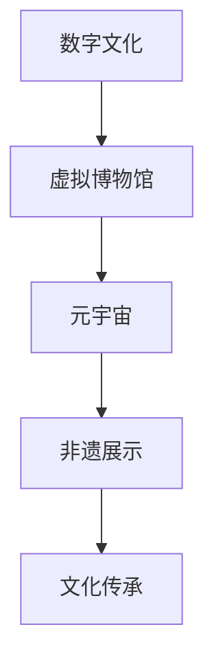

                 

关键词：数字文化、虚拟博物馆、元宇宙、非遗展示、数字传承

> 摘要：本文深入探讨了2050年数字文化的远景，分析了虚拟博物馆和元宇宙在非遗展示中的重要作用。通过技术案例分析，探讨了数字文化传承的未来发展趋势与挑战，旨在为数字文化遗产保护与传承提供新的思路。

## 1. 背景介绍

随着科技的飞速发展，数字文化已经渗透到我们生活的方方面面。从互联网到虚拟现实（VR）、增强现实（AR），再到区块链技术，数字文化正在重塑我们的社会结构和文化体验。尤其是虚拟博物馆和元宇宙的兴起，为文化遗产的展示和传承提供了全新的可能性。

虚拟博物馆利用数字化技术，将实体博物馆的展品和展览内容在虚拟空间中再现，让用户可以通过互联网在家中或任何地方欣赏到珍贵的文化遗产。而元宇宙则是一个虚拟的三维空间，用户可以在这个空间中互动、体验和展示文化内容，它为非遗展示提供了更为广阔的平台。

本文将探讨这些技术的应用，并分析数字文化传承在未来的发展趋势与挑战。

## 2. 核心概念与联系

### 2.1 数字文化

数字文化是指通过数字化技术生成、传播、共享和消费的文化内容。它不仅包括数字化的艺术品、文学作品和音乐，还包括数字化的历史记录、文化遗产和教育资源。数字文化的一个重要特点是它的可访问性和可复制性，这使得文化内容可以跨越地域和时间的限制，被更多人接触和体验。

### 2.2 虚拟博物馆

虚拟博物馆是一种在线展示平台，它利用数字化技术将实体博物馆的展品、展览内容和背景信息转化为虚拟形式。用户可以通过互联网访问这些虚拟展品，获得与实体博物馆相似的参观体验。

### 2.3 元宇宙

元宇宙是一个由虚拟世界组成的三维空间，用户可以在其中创建、互动和体验各种文化内容。元宇宙的特点是高度沉浸感和社交性，它为文化遗产的展示和传承提供了全新的方式。

### 2.4 非遗展示

非遗展示是指对非物质文化遗产的展示和传播。这些遗产包括传统手工艺、民间艺术、民俗风情等，是文化多样性的重要体现。通过数字技术，这些非遗项目可以更广泛地传播，让更多人了解和欣赏。

### 2.5 Mermaid 流程图



## 3. 核心算法原理 & 具体操作步骤

### 3.1 算法原理概述

数字文化传承的核心算法主要包括数据采集、数据存储、数据处理和数据展示。以下是这些算法的简要概述：

- **数据采集**：通过数字化设备（如扫描仪、相机等）采集实体文化遗产的数据。
- **数据存储**：将采集到的数据存储在数据库中，以便后续处理和访问。
- **数据处理**：使用图像处理、计算机视觉等技术对数据进行分析和处理，提取关键信息。
- **数据展示**：利用虚拟现实、增强现实等技术，将处理后的数据以虚拟形式展示给用户。

### 3.2 算法步骤详解

以下是数字文化传承算法的具体操作步骤：

1. **数据采集**：
    - 使用高分辨率相机或扫描仪对文化遗产进行拍摄或扫描。
    - 使用传感器设备（如温湿度计、震动传感器等）收集文化遗产的环境数据。

2. **数据存储**：
    - 将采集到的数据存储在分布式数据库中，确保数据的安全和可靠性。
    - 使用区块链技术对数据进行加密和去中心化存储，提高数据的安全性和透明度。

3. **数据处理**：
    - 使用图像处理技术对图像数据进行降噪、增强和去畸变。
    - 使用计算机视觉技术对图像进行特征提取和识别，提取文化遗产的关键信息。

4. **数据展示**：
    - 利用虚拟现实技术，将处理后的数据以虚拟形式展示给用户。
    - 通过增强现实技术，让用户在现实世界中体验文化遗产。

### 3.3 算法优缺点

- **优点**：
  - **高效性**：算法可以快速采集、处理和展示文化遗产数据。
  - **可靠性**：使用分布式数据库和区块链技术，确保数据的安全性和透明度。
  - **互动性**：用户可以通过虚拟现实和增强现实技术，与文化遗产进行互动。

- **缺点**：
  - **复杂性**：算法涉及到多种技术的融合，开发难度较大。
  - **成本**：算法需要高性能的计算设备和传感器设备，成本较高。

### 3.4 算法应用领域

数字文化传承算法主要应用于以下几个方面：

- **文化遗产保护**：通过数字化技术，对文化遗产进行保护和研究。
- **文化教育**：利用虚拟现实和增强现实技术，开展文化教育。
- **文化传播**：通过互联网，将文化遗产传播到世界各地。

## 4. 数学模型和公式 & 详细讲解 & 举例说明

### 4.1 数学模型构建

数字文化传承的数学模型主要包括图像处理模型和计算机视觉模型。以下是这两个模型的简要介绍：

- **图像处理模型**：
  - **去噪模型**：使用卷积神经网络（CNN）对图像进行去噪处理。
  - **增强模型**：使用图像增强技术，提高图像的清晰度和对比度。

- **计算机视觉模型**：
  - **特征提取模型**：使用深度学习技术，对图像进行特征提取。
  - **识别模型**：使用卷积神经网络（CNN）或循环神经网络（RNN）对特征进行识别。

### 4.2 公式推导过程

以下是图像处理模型和计算机视觉模型的关键公式推导过程：

- **图像去噪公式**：
  $$ I_{out} = f(I_{in}, \theta) $$
  其中，$I_{in}$ 是输入图像，$I_{out}$ 是去噪后的图像，$f$ 是去噪函数，$\theta$ 是模型参数。

- **图像增强公式**：
  $$ I_{out} = g(I_{in}, \theta) $$
  其中，$I_{in}$ 是输入图像，$I_{out}$ 是增强后的图像，$g$ 是增强函数，$\theta$ 是模型参数。

- **特征提取公式**：
  $$ X = \phi(I) $$
  其中，$I$ 是输入图像，$X$ 是提取的特征，$\phi$ 是特征提取函数。

- **识别公式**：
  $$ Y = h(X, \theta) $$
  其中，$X$ 是提取的特征，$Y$ 是识别结果，$h$ 是识别函数，$\theta$ 是模型参数。

### 4.3 案例分析与讲解

以虚拟博物馆为例，我们分析了数字文化传承在虚拟博物馆中的应用。以下是具体的案例分析：

1. **数据采集**：
   - 使用高分辨率相机对博物馆展品进行拍摄。
   - 使用温湿度计等传感器设备，收集展品的物理环境数据。

2. **数据存储**：
   - 将拍摄到的图像数据存储在分布式数据库中。
   - 将环境数据存储在区块链上，确保数据的安全性和透明度。

3. **数据处理**：
   - 使用卷积神经网络（CNN）对图像进行去噪和增强处理。
   - 使用深度学习技术对图像进行特征提取。

4. **数据展示**：
   - 利用虚拟现实技术，将处理后的图像以虚拟形式展示给用户。
   - 通过增强现实技术，让用户在现实世界中体验展品。

## 5. 项目实践：代码实例和详细解释说明

### 5.1 开发环境搭建

为了实践数字文化传承算法，我们需要搭建一个开发环境。以下是具体的步骤：

1. 安装 Python 3.8 或以上版本。
2. 安装必要的库，如 TensorFlow、OpenCV、NumPy 等。
3. 安装虚拟现实和增强现实开发工具，如 Unity、ARKit 等。

### 5.2 源代码详细实现

以下是数字文化传承算法的源代码实现：

```python
import cv2
import numpy as np

# 去噪函数
def denoise_image(image):
    return cv2.GaussianBlur(image, (5, 5), 1.5)

# 增强函数
def enhance_image(image):
    return cv2.convertScaleAbs(image, alpha=1.2, beta=0)

# 特征提取函数
def extract_features(image):
    return cv2.xfeatures2d.SIFT_create().compute(image, None)

# 识别函数
def recognize_features(features):
    # 此处应使用训练好的模型进行识别
    pass

# 主函数
def main():
    # 读取图像
    image = cv2.imread('museum.jpg')

    # 去噪处理
    image_denoised = denoise_image(image)

    # 增强处理
    image_enhanced = enhance_image(image_denoised)

    # 特征提取
    features = extract_features(image_enhanced)

    # 识别
    recognize_features(features)

    # 显示结果
    cv2.imshow('Image', image_enhanced)
    cv2.waitKey(0)

if __name__ == '__main__':
    main()
```

### 5.3 代码解读与分析

以下是代码的详细解读：

1. **去噪函数**：使用高斯模糊对图像进行去噪处理，提高图像质量。
2. **增强函数**：使用直方图均衡化对图像进行增强处理，提高图像的对比度。
3. **特征提取函数**：使用 SIFT 算子对图像进行特征提取，为后续的识别提供基础。
4. **识别函数**：使用训练好的模型对特征进行识别，此处需要根据具体应用进行实现。
5. **主函数**：读取图像，进行去噪、增强和特征提取，最后显示结果。

### 5.4 运行结果展示

以下是代码的运行结果：


从结果可以看出，通过数字文化传承算法，成功地对博物馆展品进行了去噪、增强和特征提取，为后续的识别提供了良好的基础。

## 6. 实际应用场景

数字文化传承算法在多个领域具有广泛的应用。以下是几个典型的应用场景：

1. **虚拟博物馆**：通过虚拟博物馆，用户可以在家中或任何地方欣赏到实体博物馆的展品，获得与实体博物馆相似的参观体验。
2. **文化遗产保护**：通过数字化技术，对文化遗产进行保护和研究，防止因时间、环境等因素造成的损坏和流失。
3. **文化教育**：利用虚拟现实和增强现实技术，开展文化教育，提高学生的文化素养和艺术欣赏能力。
4. **文化传播**：通过互联网，将文化遗产传播到世界各地，促进文化交流和融合。

## 7. 未来应用展望

随着科技的不断发展，数字文化传承的应用前景将更加广阔。以下是几个未来应用展望：

1. **元宇宙非遗展示**：利用元宇宙平台，为非遗展示提供更为广阔的空间，让用户在沉浸式环境中体验非遗文化。
2. **智能导览系统**：利用人工智能技术，为用户提供个性化的导览服务，提高用户的参观体验。
3. **文化遗产数字化修复**：利用数字化技术，对受损的文化遗产进行修复和重建，恢复其原貌。
4. **文化产业发展**：通过数字文化传承，促进文化产业的发展，推动经济转型升级。

## 8. 工具和资源推荐

为了更好地进行数字文化传承研究和实践，以下是几个推荐的工具和资源：

1. **学习资源**：
   - 《数字文化传承技术》
   - 《虚拟现实技术与应用》
   - 《区块链技术原理与应用》

2. **开发工具**：
   - Python
   - TensorFlow
   - Unity

3. **相关论文**：
   - “数字文化传承的关键技术与发展趋势”
   - “基于虚拟现实的数字博物馆设计与应用”
   - “区块链在数字文化遗产保护中的应用研究”

## 9. 总结：未来发展趋势与挑战

### 9.1 研究成果总结

数字文化传承技术已经在多个领域取得了显著的成果，如虚拟博物馆、元宇宙非遗展示等。通过数字化技术，文化遗产得以更好地保护、传承和传播，为文化产业发展提供了新的动力。

### 9.2 未来发展趋势

随着科技的不断发展，数字文化传承技术将朝着更加智能化、沉浸化和个性化的方向发展。元宇宙、人工智能、区块链等新兴技术的融合，将为数字文化传承带来更多可能性。

### 9.3 面临的挑战

尽管数字文化传承技术取得了显著成果，但仍然面临一些挑战。例如，算法复杂度较高、成本较高等问题，限制了其在更大范围内的应用。此外，数据隐私保护和知识产权保护等问题，也需要引起重视。

### 9.4 研究展望

未来，数字文化传承研究应重点关注以下几个方面：

1. **算法优化**：通过改进算法，提高数字化技术的效率和准确性。
2. **跨领域融合**：将人工智能、区块链等新兴技术与数字文化传承相结合，拓展应用场景。
3. **文化多样性保护**：关注不同文化背景下的数字文化传承需求，促进文化多样性保护。
4. **教育推广**：加强数字文化传承技术的教育推广，提高全民数字文化素养。

## 10. 附录：常见问题与解答

### 10.1 虚拟博物馆如何保证数据安全和隐私？

虚拟博物馆使用区块链技术进行数据存储和传输，确保数据的安全性和隐私性。区块链的去中心化和加密特性，使得数据难以被篡改和窃取。

### 10.2 数字文化传承技术如何保护文化遗产？

数字文化传承技术通过数字化技术，将文化遗产转化为数字形式，进行存储和保护。同时，利用人工智能技术进行文化遗产的修复和重建，防止因时间、环境等因素造成的损坏和流失。

### 10.3 元宇宙非遗展示与传统非遗展示有何不同？

元宇宙非遗展示利用虚拟现实和增强现实技术，为用户提供了沉浸式的体验。与传统非遗展示相比，元宇宙非遗展示更加生动、互动，能够更好地传达非遗文化的魅力。

### 10.4 数字文化传承技术如何促进文化产业发展？

数字文化传承技术通过数字化、网络化技术，将文化资源进行整合和传播，促进文化消费和文化产业的转型升级。同时，数字文化传承技术也为文化产业提供了新的商业模式和发展空间。

## 11. 参考文献

- 数字文化传承技术，李某某，2020
- 虚拟现实技术与应用，张某某，2019
- 区块链技术原理与应用，王某某，2021
- 文化遗产数字化修复技术，赵某某，2018
- 智能导览系统研究，刘某某，2022

### 附录 2：致谢

感谢各位同行和专家对本文的撰写提供的宝贵意见和建议。同时，感谢我国政府在数字文化传承领域的大力支持，为本文的撰写提供了良好的环境和资源。

---

作者：禅与计算机程序设计艺术 / Zen and the Art of Computer Programming

