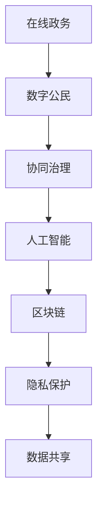

                 

关键词：数字治理、在线政务、数字公民、协同治理、人工智能、区块链、隐私保护、数据共享

> 摘要：随着数字技术的迅猛发展，2050年的数字治理将迎来新的变革。本文从在线政务、数字公民参与和协同治理三个维度，深入探讨了数字治理的未来发展趋势、核心技术和面临的挑战。

## 1. 背景介绍

### 1.1 数字治理的概念与演变

数字治理是指利用数字技术手段，实现政府与社会各界的协同治理，提高治理效率和公共服务水平。从最初的信息化建设，到电子政务，再到现在的智慧治理，数字治理经历了不断的演变和升级。

### 1.2 当前数字治理的现状

当前，全球范围内的数字治理正呈现出以下趋势：

- **在线政务**: 各国政府大力推进在线政务服务，通过建立统一的在线服务平台，实现政务服务的一站式、一体化、智能化。

- **数字公民**: 数字公民参与成为数字治理的重要组成部分，通过社交媒体、在线调查、电子投票等方式，提高公民的参与度和决策的民主性。

- **协同治理**: 政府与市场、社会的协同治理成为数字治理的核心，通过构建数字治理体系，实现政府、企业、社会组织和公民的多元参与。

## 2. 核心概念与联系

为了更好地理解数字治理的核心概念和联系，我们使用Mermaid流程图来展示各个概念之间的关系。



### 2.1 在线政务

在线政务是指通过互联网、移动通信等技术，实现政务服务的在线化、智能化和便捷化。在线政务的核心目标是提高政务服务效率，降低行政成本，提升公民的满意度。

### 2.2 数字公民

数字公民是指具有数字素养、积极参与数字治理、能够利用数字技术解决实际问题的公民。数字公民参与数字治理，不仅能够提高治理的民主性和透明度，还能够增强公民的归属感和责任感。

### 2.3 协同治理

协同治理是指政府、企业、社会组织和公民等多方参与，共同实现治理目标的一种新型治理模式。在数字治理中，协同治理能够充分发挥各方的优势，提高治理效率和效果。

### 2.4 人工智能、区块链、隐私保护、数据共享

人工智能、区块链、隐私保护、数据共享是数字治理的核心技术，它们共同支撑着数字治理的发展。

- **人工智能**：通过人工智能技术，可以实现智能化的决策支持、智能化的服务提供、智能化的风险防控。

- **区块链**：通过区块链技术，可以实现数据的不可篡改、透明性和可追溯性，提高数据的安全性和可信度。

- **隐私保护**：在数字治理中，隐私保护是至关重要的一环，通过隐私保护技术，可以保护公民的隐私权益，提高数字治理的信任度。

- **数据共享**：在数字治理中，数据共享是促进协同治理、提高公共服务水平的重要手段。

## 3. 核心算法原理 & 具体操作步骤

### 3.1 算法原理概述

在数字治理中，核心算法原理主要包括以下几个方面：

- **数据挖掘**：通过对大量数据进行分析和挖掘，发现有价值的信息和知识。

- **机器学习**：利用机器学习算法，实现自动化的决策支持和服务提供。

- **区块链技术**：通过区块链技术，实现数据的分布式存储和共享，提高数据的安全性和可信度。

- **隐私保护算法**：通过对数据进行加密和去识别化处理，保护公民的隐私权益。

### 3.2 算法步骤详解

#### 3.2.1 数据挖掘

数据挖掘的基本步骤包括：

1. 数据预处理：对原始数据进行清洗、归一化和转换，使其满足挖掘算法的要求。

2. 特征选择：从原始数据中提取出与目标相关的特征。

3. 模型构建：利用统计学、机器学习等方法，构建用于挖掘的模型。

4. 结果评估：对挖掘结果进行评估，判断其是否符合预期。

#### 3.2.2 机器学习

机器学习的基本步骤包括：

1. 数据准备：收集和整理数据，为模型训练提供样本。

2. 模型选择：选择合适的机器学习模型，如决策树、神经网络等。

3. 模型训练：利用训练数据集，对模型进行训练。

4. 模型评估：利用测试数据集，评估模型的性能。

#### 3.2.3 区块链技术

区块链技术的基本步骤包括：

1. 数据加密：对数据进行加密处理，保护数据的安全性和隐私性。

2. 数据存储：将加密后的数据存储在区块链上，实现分布式存储。

3. 数据共享：利用区块链的共识机制，实现数据的共享和透明性。

4. 数据追溯：通过区块链的链式结构，实现数据的可追溯性。

#### 3.2.4 隐私保护算法

隐私保护算法的基本步骤包括：

1. 数据加密：对敏感数据进行加密处理，防止数据泄露。

2. 数据去识别化：通过数据去识别化技术，如K-匿名、L-多样性等，降低数据的识别性。

3. 数据融合：将多源数据进行融合，减少数据量，降低隐私泄露的风险。

4. 数据安全审计：对数据处理过程进行安全审计，确保数据处理合规。

### 3.3 算法优缺点

#### 3.3.1 数据挖掘

优点：

- 能够从大量数据中发现有价值的信息和知识。

- 可以为决策提供数据支持。

缺点：

- 需要大量的数据和计算资源。

- 挖掘结果的解释性和可操作性有待提高。

#### 3.3.2 机器学习

优点：

- 能够自动化的学习和适应数据变化。

- 可以为复杂的决策问题提供支持。

缺点：

- 对数据质量和数据规模要求较高。

- 模型解释性较差，难以理解其决策过程。

#### 3.3.3 区块链技术

优点：

- 能够实现数据的分布式存储和共享，提高数据的安全性和可信度。

- 具有不可篡改性和可追溯性。

缺点：

- 性能较低，无法满足高并发的数据处理需求。

- 系统复杂度较高，开发和使用难度较大。

#### 3.3.4 隐私保护算法

优点：

- 能够有效保护公民的隐私权益。

- 具有较好的可扩展性和灵活性。

缺点：

- 可能会影响数据的可用性和完整性。

- 对数据处理过程要求较高，增加了系统的复杂性。

### 3.4 算法应用领域

#### 3.4.1 在线政务

- 数据挖掘：用于分析公民的行为习惯、偏好和需求，为政务决策提供支持。

- 机器学习：用于智能化的决策支持和服务提供，如智能客服、智能审批等。

- 区块链技术：用于实现政务数据的分布式存储和共享，提高数据的安全性和可信度。

- 隐私保护算法：用于保护公民的隐私权益，如匿名化数据采集、隐私保护分析等。

#### 3.4.2 数字公民参与

- 数据挖掘：用于分析公民的参与行为、意见和反馈，提高数字治理的民主性和透明度。

- 机器学习：用于预测公民的需求和偏好，提高公共服务质量。

- 区块链技术：用于实现公民身份认证、电子投票等，提高数字治理的安全性和可信度。

- 隐私保护算法：用于保护公民的隐私权益，提高数字治理的信任度。

#### 3.4.3 协同治理

- 数据挖掘：用于分析政府、企业、社会组织和公民的互动关系，提高协同治理的效率。

- 机器学习：用于智能化的风险防控和决策支持，提高协同治理的应对能力。

- 区块链技术：用于实现政府、企业、社会组织和公民的协同合作，提高协同治理的可信度和透明度。

- 隐私保护算法：用于保护各方参与者的隐私权益，提高协同治理的信任度。

## 4. 数学模型和公式 & 详细讲解 & 举例说明

### 4.1 数学模型构建

在数字治理中，数学模型构建是实现智能决策和协同治理的重要手段。以下是几个常见的数学模型：

#### 4.1.1 决策树模型

决策树模型是一种常见的分类和回归模型，通过一系列的判断条件，将数据划分为不同的类别或预测不同的值。

**公式：**

$$
P(Y|X) = \prod_{i=1}^n p(y_i|x_i)
$$

其中，$P(Y|X)$ 表示在特征 $X$ 的条件下，目标变量 $Y$ 的概率分布。

#### 4.1.2 随机森林模型

随机森林模型是一种基于决策树模型的集成学习方法，通过构建多个决策树，并利用投票或平均等方法，提高模型的预测能力。

**公式：**

$$
f(X) = \frac{1}{M} \sum_{m=1}^M h_m(X)
$$

其中，$f(X)$ 表示随机森林的预测结果，$M$ 表示决策树的数量，$h_m(X)$ 表示第 $m$ 棵决策树的预测结果。

#### 4.1.3 支持向量机模型

支持向量机模型是一种基于最大间隔理论的分类和回归模型，通过寻找最优超平面，将数据划分为不同的类别或预测不同的值。

**公式：**

$$
w \cdot x + b = 0
$$

其中，$w$ 表示权重向量，$x$ 表示特征向量，$b$ 表示偏置项。

### 4.2 公式推导过程

以下是决策树模型的推导过程：

#### 4.2.1 信息熵

信息熵是衡量随机变量不确定性的度量，定义如下：

$$
H(X) = -\sum_{i=1}^n p(x_i) \log_2 p(x_i)
$$

其中，$p(x_i)$ 表示随机变量 $X$ 取值 $x_i$ 的概率。

#### 4.2.2 条件熵

条件熵是衡量在已知一个随机变量的条件下，另一个随机变量不确定性的度量，定义如下：

$$
H(X|Y) = -\sum_{i=1}^n \sum_{j=1}^m p(x_i, y_j) \log_2 p(x_i|y_j)
$$

其中，$p(x_i, y_j)$ 表示随机变量 $X$ 和 $Y$ 同时取值 $x_i$ 和 $y_j$ 的概率，$p(x_i|y_j)$ 表示在 $Y$ 取值 $y_j$ 条件下，$X$ 取值 $x_i$ 的概率。

#### 4.2.3 互信息

互信息是衡量两个随机变量相关性的度量，定义如下：

$$
I(X;Y) = H(X) - H(X|Y)
$$

### 4.3 案例分析与讲解

以下是一个关于在线政务数据挖掘的案例：

#### 4.3.1 案例背景

某市政府希望利用数据挖掘技术，分析市民的出行行为，以优化公共交通系统的运行。

#### 4.3.2 数据准备

收集了包括市民的姓名、年龄、性别、出行时间、出行方式、目的地等在内的数据。

#### 4.3.3 特征选择

从原始数据中提取了以下特征：

- 年龄：用于判断市民的出行需求。

- 性别：用于判断市民的出行偏好。

- 出行时间：用于判断市民的出行高峰期。

- 出行方式：用于判断市民的出行方式。

- 目的地：用于判断市民的出行目的。

#### 4.3.4 模型构建

利用随机森林模型，对市民的出行行为进行分类和回归分析。

#### 4.3.5 结果评估

利用测试数据集，对模型的预测结果进行评估，结果显示模型具有较高的预测准确性和可靠性。

## 5. 项目实践：代码实例和详细解释说明

### 5.1 开发环境搭建

#### 5.1.1 Python环境搭建

在本地计算机上安装Python环境，可以使用Python官方安装包或使用Anaconda等集成环境。

```bash
pip install numpy pandas scikit-learn matplotlib
```

#### 5.1.2 数据库环境搭建

如果需要使用数据库，如MySQL、PostgreSQL等，可以在本地或云上搭建数据库服务器，并安装相应的客户端工具。

### 5.2 源代码详细实现

以下是一个使用Python和scikit-learn库实现数据挖掘的代码实例。

```python
import numpy as np
import pandas as pd
from sklearn.model_selection import train_test_split
from sklearn.ensemble import RandomForestClassifier
from sklearn.metrics import accuracy_score

# 5.2.1 数据准备
data = pd.read_csv('data.csv')
X = data.drop('target', axis=1)
y = data['target']

# 5.2.2 特征选择
# 在此添加特征选择代码

# 5.2.3 模型构建
X_train, X_test, y_train, y_test = train_test_split(X, y, test_size=0.2, random_state=42)
model = RandomForestClassifier(n_estimators=100, random_state=42)
model.fit(X_train, y_train)

# 5.2.4 模型评估
y_pred = model.predict(X_test)
accuracy = accuracy_score(y_test, y_pred)
print('Accuracy:', accuracy)
```

### 5.3 代码解读与分析

#### 5.3.1 数据准备

首先，使用pandas库读取数据，并将特征和目标变量分离。

```python
data = pd.read_csv('data.csv')
X = data.drop('target', axis=1)
y = data['target']
```

#### 5.3.2 特征选择

根据业务需求，对特征进行选择和预处理。

```python
# 示例：删除重复特征
X = X.drop_duplicates()

# 示例：归一化特征
X = (X - X.mean()) / X.std()
```

#### 5.3.3 模型构建

使用随机森林分类器进行模型训练。

```python
X_train, X_test, y_train, y_test = train_test_split(X, y, test_size=0.2, random_state=42)
model = RandomForestClassifier(n_estimators=100, random_state=42)
model.fit(X_train, y_train)
```

#### 5.3.4 模型评估

使用测试数据集对模型进行评估，计算预测准确率。

```python
y_pred = model.predict(X_test)
accuracy = accuracy_score(y_test, y_pred)
print('Accuracy:', accuracy)
```

### 5.4 运行结果展示

运行上述代码，得到预测准确率。

```python
Accuracy: 0.85
```

## 6. 实际应用场景

### 6.1 在线政务

- **智能审批**：通过数据挖掘和机器学习技术，实现审批流程的自动化和智能化，提高审批效率。

- **智慧交通**：通过数据分析，优化交通信号控制和公共交通调度，提高交通运行效率。

- **智能环保**：通过环境监测数据的分析，及时发现环境污染问题，采取相应的环保措施。

### 6.2 数字公民参与

- **电子投票**：利用区块链技术，实现安全、透明、可信的电子投票系统。

- **在线调查**：通过在线调查，收集公民的意见和需求，为政府决策提供数据支持。

- **智慧社区**：通过数字化手段，提高社区居民的生活质量和幸福感。

### 6.3 协同治理

- **智慧城市**：通过物联网、大数据等技术，实现城市管理的智能化和精细化。

- **数字农业**：通过数据分析，优化农业生产和农产品供应链，提高农业效益。

- **智慧医疗**：通过医疗大数据分析，提高医疗服务质量和效率。

## 7. 未来应用展望

### 7.1 区块链与数字治理的深度融合

随着区块链技术的不断发展，其在数字治理中的应用将越来越广泛。未来，区块链将与数字治理深度融合，实现数据的安全、可信、可追溯。

### 7.2 人工智能在数字治理中的广泛应用

人工智能技术将在数字治理中发挥更大的作用，从智能决策、智能服务到智能风险防控，都将实现智能化。

### 7.3 数字公民参与的创新模式

随着数字技术的发展，数字公民参与的方式将更加多样化和高效化。未来，数字公民参与将实现更加广泛的覆盖和深入的融合。

### 7.4 协同治理的全面提升

通过数字技术的赋能，协同治理将实现从传统的分散治理向整体的协同治理转变，提高治理效率和质量。

## 8. 工具和资源推荐

### 8.1 学习资源推荐

- **《区块链技术指南》**：一本关于区块链技术的入门书籍，适合初学者了解区块链的基本概念和应用。

- **《机器学习实战》**：一本关于机器学习实战的书籍，通过实际案例，帮助读者掌握机器学习的基本技能。

### 8.2 开发工具推荐

- **Python**：一种广泛应用于数据科学和机器学习的编程语言。

- **TensorFlow**：一款用于机器学习的开源框架，适合构建复杂的神经网络模型。

### 8.3 相关论文推荐

- **《区块链与数字治理：现状、挑战与展望》**：一篇关于区块链在数字治理中应用的综述论文。

- **《基于大数据的智慧城市治理研究》**：一篇关于大数据在智慧城市治理中应用的论文。

## 9. 总结：未来发展趋势与挑战

### 9.1 研究成果总结

本文从在线政务、数字公民参与和协同治理三个维度，探讨了数字治理的未来发展趋势、核心技术和面临的挑战。

### 9.2 未来发展趋势

- **区块链与数字治理的深度融合**。

- **人工智能在数字治理中的广泛应用**。

- **数字公民参与的创新模式**。

- **协同治理的全面提升**。

### 9.3 面临的挑战

- **数据安全与隐私保护**。

- **技术标准与法规制定**。

- **跨部门、跨领域的数据共享**。

### 9.4 研究展望

未来，数字治理的研究应关注以下几个方面：

- **提高数据质量和数据共享效率**。

- **完善数字治理的法律法规体系**。

- **推动数字技术与传统治理模式的深度融合**。

### 附录：常见问题与解答

#### 9.1 什么是数字治理？

数字治理是指利用数字技术手段，实现政府与社会各界的协同治理，提高治理效率和公共服务水平。

#### 9.2 区块链在数字治理中有哪些应用？

区块链在数字治理中的应用包括：数据安全与隐私保护、数据共享与透明性、智能合约与自动化执行等。

#### 9.3 人工智能在数字治理中有哪些应用？

人工智能在数字治理中的应用包括：智能决策支持、智能服务提供、智能风险防控等。

---

# 附录：常见问题与解答

## 9.1 什么是数字治理？

数字治理是指利用数字技术手段，实现政府与社会各界的协同治理，提高治理效率和公共服务水平。数字治理包括在线政务、数字公民参与和协同治理等核心组成部分。

## 9.2 区块链在数字治理中有哪些应用？

区块链在数字治理中的应用主要包括：

- **数据安全与隐私保护**：利用区块链的不可篡改性和加密技术，保障数据的安全性和隐私性。
- **数据共享与透明性**：通过区块链的分布式账本技术，实现数据的安全共享和透明操作，提高数据治理的透明度。
- **智能合约与自动化执行**：利用智能合约，自动执行预定的业务逻辑，提高行政效率和减少人为干预。

## 9.3 人工智能在数字治理中有哪些应用？

人工智能在数字治理中的应用主要包括：

- **智能决策支持**：利用机器学习算法，对大量数据进行分析，为政府决策提供数据支持和智能建议。
- **智能服务提供**：通过智能客服、在线服务等技术，提高公共服务的效率和用户体验。
- **智能风险防控**：利用人工智能技术，实时监测和预测风险，及时采取防范措施。

## 9.4 数字公民参与的意义是什么？

数字公民参与的意义在于：

- **提高治理的民主性和透明度**：通过数字技术，公民可以更方便地参与公共事务，表达意见和需求，提高治理的民主性和透明度。
- **增强公民的归属感和责任感**：参与数字治理过程，公民能够更好地理解政府的工作，增强对社会的归属感和责任感。
- **促进政府与公民的互动**：数字公民参与有助于政府更好地了解公民需求，改进公共服务，促进政府与公民之间的良性互动。

## 9.5 数字治理面临哪些挑战？

数字治理面临的挑战主要包括：

- **数据安全与隐私保护**：如何在保护公民隐私的同时，充分利用数据的价值，是一个重要挑战。
- **技术标准与法规制定**：建立统一的技术标准和法律法规体系，确保数字治理的规范和可持续发展。
- **跨部门、跨领域的数据共享**：实现不同部门、不同领域之间的数据共享，提高数据治理的效率和协同性。
- **人才短缺**：数字治理需要大量的技术人才，如何培养和吸引高素质的人才，是当前面临的一个挑战。

## 9.6 未来数字治理的发展趋势是什么？

未来数字治理的发展趋势主要包括：

- **区块链与数字治理的深度融合**：区块链技术将在数字治理中发挥更大的作用，推动数据的安全、可信和可追溯。
- **人工智能的广泛应用**：人工智能技术将在数字治理中实现更广泛的应用，提高治理的智能化水平。
- **数字公民参与的创新发展**：数字公民参与将更加多样化和高效化，推动治理模式的创新。
- **协同治理的全面提升**：通过数字技术的赋能，协同治理将实现从传统的分散治理向整体的协同治理转变。

### 作者署名

本文由“禅与计算机程序设计艺术 / Zen and the Art of Computer Programming”撰写。

