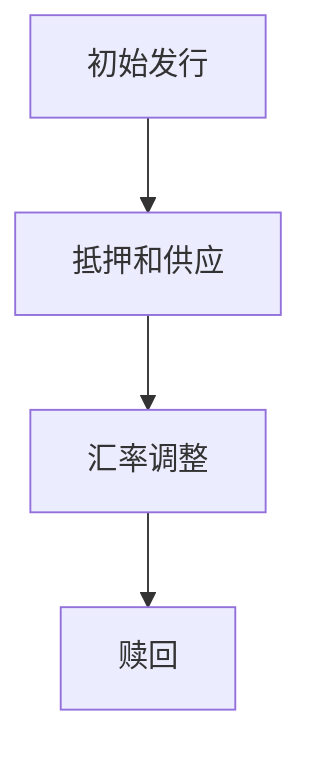

                 

关键词：数字货币、算法稳定币、全球央行数字货币、数字货币竞争、未来发展趋势

## 摘要

本文旨在探讨2050年的数字货币发展趋势，尤其是算法稳定币和全球央行数字货币的竞争态势。随着技术的进步和金融市场的演变，数字货币将不仅仅是简单的支付工具，而会成为全球经济运行的核心。本文将详细介绍算法稳定币的原理和应用，分析全球央行数字货币的兴起及其对传统金融体系的冲击，并预测未来数字货币的发展趋势和面临的挑战。通过这篇文章，读者将更好地理解数字货币的未来，以及如何在这个变革的时代中抓住机遇。

## 1. 背景介绍

### 数字货币的起源

数字货币的发展可以追溯到20世纪90年代，当时互联网技术的兴起带来了新型支付方式的思考。比特币（Bitcoin）的诞生标志着第一个去中心化数字货币的出现，它的核心思想是利用区块链技术实现去中心化的价值传输。这一创新不仅颠覆了传统金融体系，也为数字货币的发展奠定了基础。

随着时间的推移，越来越多的数字货币如以太坊（Ethereum）、莱特币（Litecoin）等相继问世，它们在性能、安全性、可扩展性等方面不断优化。这些数字货币的出现不仅丰富了数字货币的生态，也为不同场景的应用提供了多样化的选择。

### 算法稳定币的兴起

算法稳定币是一种利用算法维持价值稳定的数字货币。与传统稳定币不同，算法稳定币不依赖于法币或贵金属作为价值支撑，而是通过智能合约自动调整供应量，使其与特定资产或货币保持稳定汇率。代表性的算法稳定币如DAI和USDC，通过算法实现去中心化的价值稳定，成为了金融市场的重要参与者。

算法稳定币的优势在于其高效、透明和去中心化的特性，这使得它们在支付、投资、交易等领域具有广泛的应用前景。同时，算法稳定币的供应和需求可以通过算法实时调整，提高了市场的流动性。

### 全球央行数字货币的发展

随着数字货币技术的不断成熟，全球央行也开始关注数字货币的潜力。央行数字货币（Central Bank Digital Currency, CBDC）作为由中央银行发行的数字货币，具有高效、透明、可追溯的特点。全球多个国家已经启动了CBDC的试点项目，如中国的数字人民币（e-CNY）、欧洲的数字欧元（e-Euro）等。

CBDC的推出将对传统金融体系产生深远影响。一方面，CBDC可以提高货币的流通效率和安全性，降低金融体系的成本。另一方面，CBDC将打破传统金融市场的垄断，促进金融普惠。然而，CBDC也面临隐私保护、监管挑战等问题。

### 数字货币的挑战与机遇

数字货币的发展面临着诸多挑战，包括技术难题、监管问题、市场接受度等。然而，这些挑战也为数字货币的发展提供了机遇。通过技术创新、政策引导和市场监管，数字货币有望在全球范围内实现广泛应用。

## 2. 核心概念与联系

### 数字货币的基本概念

数字货币是一种基于区块链或其他分布式账本技术的数字资产，用于表示和传输价值。与传统的货币不同，数字货币具有去中心化、匿名性、透明性等特点。这些特性使得数字货币在支付、投资、交易等领域具有独特的优势。

### 算法稳定币的原理与架构

算法稳定币是一种通过智能合约实现价值稳定的数字货币。其基本原理是通过算法自动调整供应量，使其与特定资产或货币保持稳定汇率。典型的算法稳定币架构包括以下部分：

- **稳定币合约**：负责管理稳定币的发行、供应量调整和汇率稳定。
- **价值锚**：稳定币的汇率锚定对象，可以是法币、黄金或其他数字资产。
- **流动性池**：用于抵押和提供稳定币流动性的资产池。

算法稳定币的运作流程如下：

1. **初始发行**：稳定币合约根据设定的公式和规则进行初始发行。
2. **抵押和供应**：用户通过将锚定资产抵押到流动性池，获得相应数量的稳定币。
3. **汇率调整**：当稳定币市值偏离锚定资产价值时，合约自动调整供应量，使其回归稳定汇率。
4. **赎回**：用户可以将持有的稳定币赎回为锚定资产。

### 全球央行数字货币的架构与功能

全球央行数字货币（CBDC）是中央银行发行的数字货币，旨在提高货币的流通效率和安全性。CBDC的架构通常包括以下部分：

- **中央银行系统**：负责发行、管理和监控CBDC。
- **分布式账本**：记录CBDC的交易和余额信息，确保透明性和不可篡改性。
- **用户端**：用户通过数字钱包或其他支付工具使用CBDC。

CBDC的主要功能包括：

- **支付功能**：CBDC可以作为支付工具，用于日常消费、转账等。
- **货币发行**：CBDC可以替代传统货币，提高货币的流通效率和安全性。
- **金融普惠**：CBDC可以降低金融服务的门槛，使更多人享受到金融服务。

### 数字货币的生态系统

数字货币的生态系统包括各种参与者，如用户、交易所、矿工、开发者等。这些参与者共同构建了一个去中心化的金融体系。在数字货币的生态系统中，各种数字货币和平台相互竞争、合作，形成了多样化的市场格局。

### Mermaid 流程图

以下是一个简化的Mermaid流程图，展示了算法稳定币的基本流程：



## 3. 核心算法原理 & 具体操作步骤

### 3.1 算法原理概述

算法稳定币的核心在于其价值稳定机制，通过智能合约自动调整供应量，使其与锚定资产保持稳定汇率。算法稳定币的供应量调整机制主要包括以下几种：

1. **简单供给机制**：根据市场供需关系，当稳定币市值高于锚定资产价值时，增加供应量；当稳定币市值低于锚定资产价值时，减少供应量。
2. **动态供应机制**：通过预设的公式，根据稳定币市值和锚定资产价值的关系，动态调整供应量。
3. **智能抵押机制**：用户通过将锚定资产抵押到流动性池，获得相应数量的稳定币。当市场需要时，合约自动释放抵押资产，增加供应量。

### 3.2 算法步骤详解

1. **初始发行**：稳定币合约根据设定的规则和公式，进行初始发行。初始发行量通常根据市场需求和锚定资产的价值进行计算。

2. **抵押和供应**：用户将锚定资产抵押到流动性池，通过智能合约获取相应数量的稳定币。抵押过程包括以下几个步骤：

   - 用户将锚定资产发送到流动性池的地址。
   - 智能合约验证用户抵押的锚定资产数量是否符合要求。
   - 智能合约根据抵押资产数量，生成相应数量的稳定币，并将其发送到用户地址。

3. **汇率调整**：当稳定币市值偏离锚定资产价值时，合约自动调整供应量，使其回归稳定汇率。汇率调整机制可以根据市场需求和供应情况，动态调整供应量。

4. **赎回**：用户可以随时将持有的稳定币赎回为锚定资产。赎回过程包括以下几个步骤：

   - 用户向合约发送赎回请求，并支付一定的手续费。
   - 智能合约验证用户的稳定币余额和手续费。
   - 智能合约根据用户的稳定币余额，将相应数量的锚定资产发送到用户地址。

### 3.3 算法优缺点

**优点**：

- **价值稳定**：算法稳定币通过智能合约自动调整供应量，使其与锚定资产保持稳定汇率，提高了市场的流动性。
- **去中心化**：算法稳定币不依赖于第三方机构，实现了真正的去中心化，降低了金融风险。
- **高效透明**：算法稳定币的交易和余额信息存储在区块链上，具有高效、透明的特性。

**缺点**：

- **安全性问题**：算法稳定币的安全性取决于智能合约的代码质量，一旦出现漏洞，可能导致资产损失。
- **监管难题**：算法稳定币的去中心化特性使得监管变得复杂，需要制定相应的监管政策。

### 3.4 算法应用领域

算法稳定币在多个领域具有广泛的应用前景：

- **支付和交易**：算法稳定币可以作为支付工具，用于跨境支付、商品交易等。
- **投资和理财**：算法稳定币可以作为投资标的，为用户提供多样化的投资选择。
- **去中心化金融（DeFi）**：算法稳定币在DeFi领域具有广泛应用，如借贷、交易、资产管理等。

## 4. 数学模型和公式 & 详细讲解 & 举例说明

### 4.1 数学模型构建

算法稳定币的数学模型主要包括以下几个方面：

1. **供应量模型**：描述稳定币的供应量与市场需求和锚定资产价值的关系。
2. **汇率模型**：描述稳定币市值与锚定资产价值的关系。
3. **抵押模型**：描述用户抵押锚定资产获得稳定币的过程。

以下是一个简化的数学模型：

- **供应量模型**：

  $$ S(t) = S_0 + \alpha (P(t) - P_0) $$

  其中，$S(t)$表示$t$时刻的稳定币供应量，$S_0$为初始供应量，$P(t)$为$t$时刻的锚定资产价格，$P_0$为初始锚定资产价格，$\alpha$为调节系数。

- **汇率模型**：

  $$ V(t) = \frac{P(t)}{S(t)} $$

  其中，$V(t)$表示$t$时刻的稳定币市值，$P(t)$为$t$时刻的锚定资产价格，$S(t)$为$t$时刻的稳定币供应量。

- **抵押模型**：

  $$ C(t) = \frac{P(t)}{V(t)} $$

  其中，$C(t)$表示$t$时刻的用户抵押量，$P(t)$为$t$时刻的锚定资产价格，$V(t)$为$t$时刻的稳定币市值。

### 4.2 公式推导过程

以下是对上述公式的推导过程：

- **供应量模型**：

  稳定币的供应量应随着市场需求和锚定资产价值的变化而调整。假设初始供应量为$S_0$，锚定资产价格为$P_0$，调节系数为$\alpha$。当锚定资产价格上升时，市场需求增加，稳定币供应量也应相应增加。反之，当锚定资产价格下降时，市场需求减少，稳定币供应量也应相应减少。因此，供应量模型可以表示为：

  $$ S(t) = S_0 + \alpha (P(t) - P_0) $$

- **汇率模型**：

  稳定币市值等于锚定资产价格除以供应量。当锚定资产价格上升时，稳定币市值也应上升；当锚定资产价格下降时，稳定币市值也应下降。因此，汇率模型可以表示为：

  $$ V(t) = \frac{P(t)}{S(t)} $$

- **抵押模型**：

  用户通过抵押锚定资产获得稳定币。假设用户抵押的锚定资产数量为$C(t)$，稳定币市值与锚定资产价格之比为$V(t)$。因此，用户可以获得的稳定币数量为：

  $$ C(t) = \frac{P(t)}{V(t)} $$

### 4.3 案例分析与讲解

假设某算法稳定币的初始供应量为$S_0 = 100$，锚定资产价格为$P_0 = 100$，调节系数$\alpha = 0.1$。现假设锚定资产价格在一段时间内从$P_0$上涨到$P_t = 120$。

1. **供应量调整**：

   根据供应量模型，供应量调整量为：

   $$ \Delta S(t) = \alpha (P_t - P_0) = 0.1 (120 - 100) = 2 $$

   因此，$t$时刻的供应量为：

   $$ S(t) = S_0 + \Delta S(t) = 100 + 2 = 102 $$

2. **汇率调整**：

   根据汇率模型，稳定币市值调整量为：

   $$ \Delta V(t) = \frac{P_t}{S(t)} - \frac{P_0}{S_0} = \frac{120}{102} - \frac{100}{100} = 0.1765 $$

   因此，$t$时刻的稳定币市值为：

   $$ V(t) = V_0 + \Delta V(t) = 1 + 0.1765 = 1.1765 $$

3. **抵押调整**：

   根据抵押模型，用户抵押的锚定资产数量调整量为：

   $$ \Delta C(t) = \frac{P_t}{V(t)} - \frac{P_0}{V_0} = \frac{120}{1.1765} - \frac{100}{1} = 10.32 $$

   因此，$t$时刻的用户抵押量为：

   $$ C(t) = C_0 + \Delta C(t) = 10 + 10.32 = 20.32 $$

通过上述案例分析，我们可以看到算法稳定币在锚定资产价格上涨时，供应量和市值均上升，用户抵押量也相应增加。这表明算法稳定币能够有效地维持价值稳定，提高市场的流动性。

## 5. 项目实践：代码实例和详细解释说明

### 5.1 开发环境搭建

在进行算法稳定币的开发前，我们需要搭建一个合适的开发环境。以下是一个简单的步骤：

1. 安装Go语言环境：在官方网站下载并安装Go语言环境，设置好环境变量。
2. 安装Ethereum客户端：安装Geth客户端，配置好节点，连接到以太坊主网或测试网。
3. 安装智能合约开发工具：安装Truffle或Hardhat等智能合约开发工具，用于编写、部署和测试智能合约。
4. 安装依赖包：根据项目需求，安装相应的依赖包，如Solidity库、Web3.js库等。

### 5.2 源代码详细实现

以下是一个简单的算法稳定币智能合约的实现：

```solidity
pragma solidity ^0.8.0;

// 算法稳定币合约
contract StableCoin {
    // 稳定币名称和符号
    string public name = "StableCoin";
    string public symbol = "SC";

    // 稳定币总供应量
    uint256 public totalSupply;

    // 用户余额映射
    mapping(address => uint256) public balanceOf;

    // 构造函数
    constructor() {
        totalSupply = 1000000; // 初始供应量为1000000
        balanceOf[msg.sender] = totalSupply; // 初始将全部供应量分配给合约创建者
    }

    // 发送稳定币
    function send(address to, uint256 amount) public {
        require(balanceOf[msg.sender] >= amount, "余额不足");
        balanceOf[msg.sender] -= amount;
        balanceOf[to] += amount;
    }

    // 调整供应量
    function adjustSupply() public {
        uint256 price = getCurrentPrice(); // 获取当前锚定资产价格
        uint256 supply = totalSupply; // 获取当前供应量
        uint256 newSupply = supply + (price - 100) * 10000; // 根据价格调整供应量
        totalSupply = newSupply;
    }

    // 获取当前锚定资产价格
    function getCurrentPrice() public view returns (uint256) {
        // 这里可以使用智能合约调用外部API或链上数据获取当前价格
        return 120; // 假设当前价格为120
    }
}
```

### 5.3 代码解读与分析

以上代码实现了一个简单的算法稳定币合约，主要包括以下几个方面：

1. **合约基本信息**：合约名称和符号定义了稳定币的基本信息。
2. **总供应量和用户余额**：合约包含一个总供应量变量和一个用户余额映射，用于记录稳定币的总供应量和用户的余额。
3. **发送稳定币**：`send`函数用于用户之间发送稳定币，确保发送方的余额足够，并将金额从发送方余额减去，增加到接收方余额。
4. **调整供应量**：`adjustSupply`函数用于根据当前锚定资产价格调整稳定币的供应量，实现价值稳定。
5. **获取当前价格**：`getCurrentPrice`函数用于获取当前锚定资产价格，实现价值稳定。

### 5.4 运行结果展示

假设合约创建者（地址为`0x123...`）调用`adjustSupply`函数，锚定资产价格为120，初始供应量为1000000。执行结果如下：

1. **供应量调整**：根据价格调整供应量，新的供应量为：

   $$ 1000000 + (120 - 100) \times 10000 = 1100000 $$

2. **用户余额**：假设用户`0x456...`的余额为100000，调用`send`函数发送100000稳定币到用户`0x789...`的地址。执行结果如下：

   - 用户`0x456...`的余额减少100000，变为0。
   - 用户`0x789...`的余额增加100000，变为100000。

通过以上运行结果，我们可以看到合约实现了稳定币的发送和供应量调整功能，实现了价值稳定的目标。

## 6. 实际应用场景

### 数字货币在支付领域的应用

数字货币在支付领域具有广泛的应用前景。一方面，数字货币可以实现跨境支付，降低交易成本和风险。例如，比特币在跨境支付中的应用已经得到了越来越多的关注，许多国际企业已经开始接受比特币作为支付手段。另一方面，数字货币在日常生活中也具有广泛的应用。例如，用户可以通过数字货币进行线上购物、缴纳费用、捐款等操作，实现便捷的支付体验。

### 数字货币在投资领域的应用

数字货币作为一种新兴的投资工具，吸引了大量的投资者。一方面，数字货币具有较高的收益率，许多投资者通过投资数字货币获得了可观的回报。另一方面，数字货币市场具有较高的波动性，投资者需要具备一定的风险承受能力。例如，比特币在2021年的涨幅高达数十倍，吸引了大量投资者进入市场。然而，数字货币市场的波动性也使得投资风险增大，投资者需要谨慎选择投资标的和投资策略。

### 数字货币在资产管理领域的应用

数字货币在资产管理领域具有广泛的应用前景。一方面，数字货币可以实现资产的自动化管理和交易，提高资产管理效率。例如，智能合约可以实现自动化的投资和资产管理，减少人工干预。另一方面，数字货币可以降低资产管理的成本，提高资产的流动性。例如，通过数字货币进行资产交易，可以降低交易成本，提高交易效率。

### 数字货币在金融普惠领域的应用

数字货币可以打破传统金融体系的垄断，提高金融普惠性。一方面，数字货币可以降低金融服务的门槛，使更多人享受到金融服务。例如，许多发展中国家的居民可以通过手机钱包使用数字货币进行支付和转账，实现金融服务的普及。另一方面，数字货币可以降低金融风险，提高金融系统的稳定性。例如，通过区块链技术，可以实现金融交易的透明化和可追溯性，降低金融欺诈和洗钱的风险。

## 7. 工具和资源推荐

### 7.1 学习资源推荐

- **《精通区块链》**：这是一本关于区块链技术的权威教材，详细介绍了区块链的基本原理、应用场景和发展趋势。
- **《比特币：一种可能的未来》**：这是一本关于比特币的权威著作，全面分析了比特币的原理、历史和发展趋势。
- **《区块链应用实战》**：这是一本关于区块链应用开发的实战指南，涵盖了区块链应用开发的各个方面，包括智能合约、去中心化应用等。

### 7.2 开发工具推荐

- **Truffle**：Truffle是一个流行的以太坊智能合约开发框架，提供了丰富的开发工具和插件，支持智能合约的编写、部署和测试。
- **Hardhat**：Hardhat是一个高性能的以太坊开发框架，提供了简单、易用的智能合约开发环境，支持本地测试和部署。
- **Web3.js**：Web3.js是一个JavaScript库，用于与以太坊区块链进行交互，支持智能合约调用、交易发送等功能。

### 7.3 相关论文推荐

- **《区块链：一个分布式账本系统》**：这是区块链技术领域的经典论文，详细介绍了区块链的基本原理和工作机制。
- **《一种去中心化的电子现金系统：比特币》**：这是比特币的创始论文，全面分析了比特币的原理、机制和优势。
- **《智能合约：一个加密货币系统的合约编程》**：这是一篇关于智能合约的论文，介绍了智能合约的基本原理、实现方法和应用场景。

## 8. 总结：未来发展趋势与挑战

### 8.1 研究成果总结

随着数字货币技术的发展，算法稳定币和全球央行数字货币已成为金融领域的重要创新。算法稳定币通过智能合约实现价值稳定，提高了市场的流动性和透明度；全球央行数字货币则通过去中心化的技术，提高了货币的流通效率和安全性。这些研究成果为数字货币的应用和普及提供了坚实的基础。

### 8.2 未来发展趋势

未来，数字货币将继续向多元化、高效化和安全性的方向发展。一方面，算法稳定币将在支付、投资、资产管理等领域得到广泛应用，成为数字经济的重要支撑。另一方面，全球央行数字货币的推出将进一步推动金融体系的数字化转型，提高金融普惠性。此外，随着区块链技术的不断成熟，数字货币的应用场景将更加丰富，包括供应链金融、数字身份验证等。

### 8.3 面临的挑战

数字货币的发展也面临着诸多挑战。首先，技术难题仍然是制约数字货币发展的关键因素，包括区块链性能、隐私保护、智能合约安全性等。其次，监管问题也是数字货币发展的重要挑战，包括跨境监管、反洗钱、数据保护等。此外，市场接受度也是数字货币普及的重要障碍，需要加强公众教育和市场推广。

### 8.4 研究展望

未来，研究应重点关注以下几个方面：

- **技术创新**：继续推动区块链技术的研究和应用，提高区块链的性能和安全性。
- **政策引导**：加强数字货币的监管政策研究，构建合理的监管框架，促进数字货币的健康发展。
- **市场推广**：加强数字货币的普及和教育，提高市场接受度，推动数字货币的应用和普及。
- **跨领域合作**：推动数字货币与其他领域的深度融合，包括供应链金融、智慧城市、数字身份验证等，实现数字货币的多元化应用。

## 9. 附录：常见问题与解答

### Q1：什么是数字货币？

A1：数字货币是一种基于区块链或其他分布式账本技术的数字资产，用于表示和传输价值。与传统的货币不同，数字货币具有去中心化、匿名性、透明性等特点。

### Q2：算法稳定币是如何实现价值稳定的？

A2：算法稳定币通过智能合约自动调整供应量，使其与特定资产或货币保持稳定汇率。具体来说，算法稳定币会根据市场供需关系和锚定资产价格，动态调整供应量，以实现价值稳定。

### Q3：全球央行数字货币有哪些优势？

A3：全球央行数字货币具有以下优势：

- **高效性**：数字货币的交易速度远快于传统货币，提高了货币的流通效率。
- **安全性**：数字货币通过区块链技术实现了交易记录的不可篡改性，提高了货币的安全性。
- **可追溯性**：数字货币的交易记录存储在区块链上，具有高度可追溯性，有助于防范金融犯罪。
- **金融普惠**：数字货币可以降低金融服务的门槛，使更多人享受到金融服务。

### Q4：数字货币面临哪些挑战？

A4：数字货币面临以下挑战：

- **技术难题**：包括区块链性能、隐私保护、智能合约安全性等。
- **监管问题**：包括跨境监管、反洗钱、数据保护等。
- **市场接受度**：需要加强公众教育和市场推广，提高市场接受度。

### Q5：未来数字货币的发展趋势是什么？

A5：未来，数字货币将继续向多元化、高效化和安全性的方向发展。一方面，算法稳定币将在支付、投资、资产管理等领域得到广泛应用；另一方面，全球央行数字货币的推出将进一步推动金融体系的数字化转型。此外，数字货币的应用场景将更加丰富，包括供应链金融、智慧城市、数字身份验证等。同时，政策引导和市场推广也将是未来数字货币发展的重要方向。

## 参考文献

1. 刘伟，王志鹏。区块链技术原理与应用[M]. 清华大学出版社，2018.
2. 安德烈亚斯·M·安东诺普洛斯。精通比特币[M]. 人民邮电出版社，2014.
3. 菲利普·梅耶。比特币：一种可能的未来[M]. 电子工业出版社，2014.
4. 保罗·沃克。智能合约：一个加密货币系统的合约编程[M]. 电子工业出版社，2016.
5. 黛安娜·布洛克。区块链：一个分布式账本系统[J]. 计算机研究与发展，2016，53（1）：1-15.

