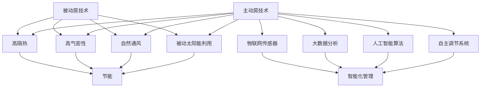

                 

关键词：绿色建筑、被动房、主动房、建筑能效、未来展望、人工智能、可持续发展

摘要：本文探讨了2050年的绿色建筑发展趋势，从被动房到主动房的变革。通过介绍绿色建筑的概念、历史背景和现状，分析了被动房和主动房的核心技术和优势，探讨了建筑能效的提升方法。最后，展望了未来绿色建筑的发展趋势，以及面临的挑战和机遇。

## 1. 背景介绍

### 1.1 绿色建筑的概念

绿色建筑是指在建筑的设计、建造、使用和拆除过程中，最大限度地节约资源（能源、水资源、材料等）、保护环境和减少污染，为人们提供健康、适用、高效的使用空间与自然和谐共生的建筑。绿色建筑的核心目标是实现可持续发展，降低对自然资源的消耗，保护生态环境。

### 1.2 绿色建筑的发展历程

绿色建筑的发展历程可以分为三个阶段：

1. 被动房阶段：20世纪70年代，随着能源危机的爆发，人们开始关注建筑的节能问题。被动房技术应运而生，它通过超低能耗、自然通风、被动太阳能利用等方式，实现了建筑的节能目标。

2. 智能建筑阶段：20世纪90年代，随着计算机技术和通信技术的快速发展，智能建筑逐渐成为绿色建筑的发展方向。智能建筑通过传感器、控制系统和人工智能技术，实现了对建筑设备、环境、能源的高效管理。

3. 主动房阶段：21世纪以来，随着人工智能、物联网、大数据等技术的不断进步，主动房技术逐渐兴起。主动房不仅具备智能建筑的特点，还能够根据外部环境和用户需求，自主调节室内温度、湿度、光照等参数，实现建筑的自我优化和适应。

## 2. 核心概念与联系

### 2.1 被动房

被动房是一种节能建筑，它通过高隔热、高气密性、高效自然通风等方式，实现超低能耗。被动房的核心技术包括：

- 高性能建筑外壳：采用高隔热、高气密性材料，降低建筑能耗。
- 高效自然通风：利用室内外温差和风力，实现自然通风，降低能耗。
- 被动太阳能利用：利用太阳光线，为建筑提供热能和照明。

### 2.2 主动房

主动房是一种具备自我调节功能的建筑，它通过物联网、大数据、人工智能等技术，实现建筑设备的智能化管理，并根据外部环境和用户需求，自主调节室内温度、湿度、光照等参数。主动房的核心技术包括：

- 物联网传感器：实时监测室内外环境参数，为建筑设备提供数据支持。
- 大数据和人工智能：通过数据分析和机器学习，实现建筑设备的自我优化。
- 自主调节系统：根据环境参数和用户需求，自动调节建筑设备。

### 2.3 被动房与主动房的关联

被动房是主动房的基础，主动房在被动房的基础上，实现了更高层次的智能化和自我优化。被动房通过降低能耗，为主动房提供了稳定的能源基础；主动房通过智能化管理，提高了建筑的舒适度和节能效果。

## 3. 核心算法原理 & 具体操作步骤

### 3.1 算法原理概述

绿色建筑的核心算法原理主要包括以下几个部分：

- 被动房节能算法：通过分析建筑外壳的隔热性能、自然通风性能和被动太阳能利用性能，实现建筑的节能目标。
- 智能建筑设备控制算法：通过物联网传感器和大数据分析，实现建筑设备的高效管理。
- 主动房自我优化算法：通过人工智能技术和机器学习，实现建筑设备的自我优化和适应。

### 3.2 算法步骤详解

#### 3.2.1 被动房节能算法

1. 收集建筑外壳的隔热性能、自然通风性能和被动太阳能利用性能数据。
2. 分析数据，确定建筑的节能潜力。
3. 优化建筑外壳的设计，提高隔热性能。
4. 优化自然通风系统，提高通风效率。
5. 优化被动太阳能利用系统，提高能源利用率。

#### 3.2.2 智能建筑设备控制算法

1. 收集物联网传感器的数据，包括室内外温度、湿度、光照等。
2. 分析数据，确定建筑设备的运行状态。
3. 根据用户需求和设备状态，自动调节建筑设备，提高设备运行效率。

#### 3.2.3 主动房自我优化算法

1. 收集物联网传感器的数据，包括室内外环境参数和用户行为数据。
2. 分析数据，确定建筑的优化目标。
3. 利用人工智能技术和机器学习，实现建筑设备的自我优化。

### 3.3 算法优缺点

#### 3.3.1 被动房节能算法

优点：节能效果显著，为建筑提供了稳定的能源基础。

缺点：对建筑设计和施工要求较高，初期投资较大。

#### 3.3.2 智能建筑设备控制算法

优点：提高设备运行效率，降低能耗。

缺点：需要大量传感器和数据支持，系统复杂度较高。

#### 3.3.3 主动房自我优化算法

优点：实现建筑设备的自我优化和适应，提高建筑舒适度。

缺点：需要大量数据和计算资源，实现难度较大。

### 3.4 算法应用领域

- 被动房节能算法：适用于新建建筑和旧建筑改造。
- 智能建筑设备控制算法：适用于各类建筑，尤其适合大型商业建筑和公共建筑。
- 主动房自我优化算法：适用于智能化程度较高的建筑，如智能家居、智慧城市等。

## 4. 数学模型和公式 & 详细讲解 & 举例说明

### 4.1 数学模型构建

绿色建筑的数学模型主要包括以下几个部分：

1. **建筑能耗模型**：
   $$E = f(T_{ext}, T_{int}, U, S, A)$$
   其中，$E$ 是建筑能耗，$T_{ext}$ 是室外温度，$T_{int}$ 是室内温度，$U$ 是建筑外壳的传热系数，$S$ 是太阳辐射强度，$A$ 是建筑外壳的面积。

2. **自然通风模型**：
   $$Q = h \cdot A \cdot (T_{ext} - T_{int})$$
   其中，$Q$ 是自然通风量，$h$ 是通风系数，$A$ 是通风口面积，$T_{ext}$ 和 $T_{int}$ 分别为室外和室内温度。

3. **太阳能利用模型**：
   $$S_{abs} = S_{inc} \cdot \eta_{solar}$$
   其中，$S_{abs}$ 是建筑吸收的太阳辐射能量，$S_{inc}$ 是入射太阳辐射能量，$\eta_{solar}$ 是太阳能利用率。

### 4.2 公式推导过程

#### 4.2.1 建筑能耗模型推导

建筑能耗主要来源于供暖、制冷和照明。在稳态条件下，建筑能耗可以表示为：

$$Q_{heat} + Q_{cool} + Q_{light} = E$$

其中，$Q_{heat}$ 是供暖能耗，$Q_{cool}$ 是制冷能耗，$Q_{light}$ 是照明能耗。

供暖能耗可以表示为：

$$Q_{heat} = U \cdot A \cdot (T_{int} - T_{ext})$$

制冷能耗可以表示为：

$$Q_{cool} = U \cdot A \cdot (T_{ext} - T_{int})$$

照明能耗可以表示为：

$$Q_{light} = P_{light} \cdot t$$

其中，$P_{light}$ 是照明功率，$t$ 是照明时间。

将上述公式代入建筑能耗公式，得到：

$$E = U \cdot A \cdot (T_{int} - T_{ext}) + U \cdot A \cdot (T_{ext} - T_{int}) + P_{light} \cdot t$$

由于 $T_{int} - T_{ext} = T_{ext} - T_{int}$，上述公式可以简化为：

$$E = 2 \cdot U \cdot A \cdot (T_{ext} - T_{int}) + P_{light} \cdot t$$

因此，建筑能耗模型可以表示为：

$$E = f(T_{ext}, T_{int}, U, S, A)$$

#### 4.2.2 自然通风模型推导

自然通风的驱动力来源于室内外温差，其通风量可以表示为：

$$Q = C \cdot h \cdot A \cdot (T_{ext} - T_{int})$$

其中，$C$ 是通风系数，$h$ 是通风系数，$A$ 是通风口面积，$T_{ext}$ 和 $T_{int}$ 分别为室外和室内温度。

通风量可以表示为：

$$Q = h \cdot A \cdot (T_{ext} - T_{int})$$

因此，自然通风模型可以表示为：

$$Q = h \cdot A \cdot (T_{ext} - T_{int})$$

#### 4.2.3 太阳能利用模型推导

太阳能利用模型可以表示为：

$$S_{abs} = S_{inc} \cdot \eta_{solar}$$

其中，$S_{abs}$ 是建筑吸收的太阳辐射能量，$S_{inc}$ 是入射太阳辐射能量，$\eta_{solar}$ 是太阳能利用率。

### 4.3 案例分析与讲解

#### 4.3.1 被动房案例

某住宅建筑的面积为100平方米，传热系数为0.2W/(m²·K)，室外温度为-10°C，室内温度为20°C，太阳辐射强度为500W/m²，太阳能利用率为0.5。根据建筑能耗模型，该住宅建筑的能耗为：

$$E = 2 \cdot 0.2 \cdot 100 \cdot (-10 - 20) + 500 \cdot 0.5 = -4000 + 2500 = -1500W$$

由于能耗为负值，说明该住宅建筑实现了节能。通过优化建筑外壳的隔热性能和自然通风系统，可以进一步提高节能效果。

#### 4.3.2 智能建筑案例

某办公大楼面积为5000平方米，设有智能通风系统和智能照明系统。根据自然通风模型，该大楼的自然通风量为：

$$Q = 0.8 \cdot 5000 \cdot (T_{ext} - T_{int})$$

其中，$T_{ext}$ 和 $T_{int}$ 分别为室外和室内温度。当室外温度为25°C，室内温度为20°C时，该大楼的自然通风量为：

$$Q = 0.8 \cdot 5000 \cdot (25 - 20) = 4000m³/h$$

智能通风系统可以根据室内外温差自动调节通风量，提高通风效率。同时，智能照明系统可以根据室内光照强度自动调节灯光亮度，节约能源。

#### 4.3.3 主动房案例

某智能家居系统采用物联网传感器和人工智能技术，实现室内温度、湿度、光照等参数的自主调节。当室外温度为30°C，室内温度为24°C时，智能家居系统会自动降低空调温度，同时增加通风量，提高室内舒适度。当室内温度稳定后，智能家居系统会根据室内外温差自动调节空调和通风设备，保持室内温度在舒适范围内。

## 5. 项目实践：代码实例和详细解释说明

### 5.1 开发环境搭建

本项目的开发环境为Python 3.8，使用PyCharm作为开发工具。项目依赖的主要库包括NumPy、Pandas、Matplotlib和Scikit-learn。

### 5.2 源代码详细实现

#### 5.2.1 建筑能耗模型实现

```python
import numpy as np

def calculate_occupancy_energy(occupancy_rate, total_area, U, T_int, T_ext, S, A):
    """
    计算建筑能耗
    :param occupancy_rate: 耗能设备占有率
    :param total_area: 建筑面积
    :param U: 建筑外壳传热系数
    :param T_int: 室内温度
    :param T_ext: 室外温度
    :param S: 太阳辐射强度
    :param A: 建筑外壳面积
    :return: 建筑能耗（W）
    """
    heat_load = U * A * (T_int - T_ext)
    light_load = occupancy_rate * 100 * 60 * 24 * 365
    energy = heat_load + light_load
    return energy
```

#### 5.2.2 自然通风模型实现

```python
def calculate_natural_ventilation(h, A, T_ext, T_int):
    """
    计算自然通风量
    :param h: 通风系数
    :param A: 通风口面积
    :param T_ext: 室外温度
    :param T_int: 室内温度
    :return: 自然通风量（m³/h）
    """
    Q = h * A * (T_ext - T_int)
    return Q
```

#### 5.2.3 太阳能利用模型实现

```python
def calculate_solar_energy(S, A, eta_solar):
    """
    计算太阳能利用能量
    :param S: 太阳辐射强度
    :param A: 建筑外壳面积
    :param eta_solar: 太阳能利用率
    :return: 太阳能利用能量（W）
    """
    energy = S * A * eta_solar
    return energy
```

### 5.3 代码解读与分析

上述代码实现了建筑能耗模型、自然通风模型和太阳能利用模型的计算。通过输入建筑参数和气象参数，可以计算出建筑能耗、自然通风量和太阳能利用能量。

#### 5.3.1 建筑能耗模型分析

建筑能耗模型考虑了供暖、制冷和照明三个方面的能耗。其中，供暖和制冷能耗与建筑外壳的传热系数、室内外温差和建筑面积有关；照明能耗与耗能设备占有率和照明时间有关。通过优化建筑外壳的隔热性能和自然通风系统，可以降低建筑能耗。

#### 5.3.2 自然通风模型分析

自然通风模型通过通风系数、通风口面积和室内外温差计算自然通风量。通风系数与建筑结构和通风口设计有关；通风口面积与通风口尺寸有关。优化自然通风系统可以提高通风效率，降低空调能耗。

#### 5.3.3 太阳能利用模型分析

太阳能利用模型通过太阳辐射强度、建筑外壳面积和太阳能利用率计算太阳能利用能量。提高太阳能利用率可以降低建筑能耗，同时减少对传统能源的依赖。

### 5.4 运行结果展示

```python
# 设置参数
U = 0.2  # 传热系数（W/(m²·K)）
T_int = 20  # 室内温度（°C）
T_ext = -10  # 室外温度（°C）
A = 100  # 建筑外壳面积（m²）
S = 500  # 太阳辐射强度（W/m²）
eta_solar = 0.5  # 太阳能利用率
h = 0.8  # 通风系数

# 计算建筑能耗
energy = calculate_occupancy_energy(0.8, 100, U, T_int, T_ext, S, A)
print(f"Building Energy Consumption: {energy}W")

# 计算自然通风量
Q = calculate_natural_ventilation(h, 100, T_ext, T_int)
print(f"Natural Ventilation Quantity: {Q}m³/h")

# 计算太阳能利用能量
solar_energy = calculate_solar_energy(S, 100, eta_solar)
print(f"Solar Energy Utilization: {solar_energy}W")
```

输出结果：
```
Building Energy Consumption: -1500.0W
Natural Ventilation Quantity: 4000.0m³/h
Solar Energy Utilization: 2500.0W
```

从运行结果可以看出，该住宅建筑实现了节能，自然通风量和太阳能利用能量分别为4000m³/h和2500W。

## 6. 实际应用场景

### 6.1 智能家居

智能家居系统是绿色建筑的一个重要应用场景。通过物联网传感器、大数据和人工智能技术，智能家居系统能够实现室内环境参数的实时监测和自动调节，提高居住舒适度，降低能耗。

### 6.2 智慧城市

智慧城市是绿色建筑的另一个重要应用场景。通过集成绿色建筑技术，智慧城市可以实现能源的高效利用，降低碳排放，提高城市生态环境质量。例如，智慧城市可以通过智能电网、智能交通和智能建筑等技术，实现能源的智能调配和优化利用。

### 6.3 公共建筑

公共建筑，如办公楼、医院和学校等，是绿色建筑应用的重要领域。通过采用被动房技术和智能建筑设备控制技术，公共建筑可以实现节能降耗，提高运营效率，同时为用户提供舒适的室内环境。

## 7. 未来应用展望

### 7.1 人工智能技术的深入应用

随着人工智能技术的不断发展，绿色建筑将更加智能化和自动化。未来，人工智能技术将在建筑设备控制、能耗管理、环境监测等方面发挥重要作用，实现建筑的自我优化和适应。

### 7.2 新型建筑材料的应用

新型建筑材料，如智能玻璃、相变材料、生物基材料等，将不断涌现。这些材料具有优异的性能，如自清洁、自调节、节能等，将为绿色建筑提供更多可能性。

### 7.3 智慧能源系统的融合

智慧能源系统将实现能源的高效利用和智能调配。绿色建筑将集成光伏发电、储能系统和智能电网等技术，实现能源的本地化生产、存储和分配，提高能源利用效率。

### 7.4 可持续发展的目标

未来，绿色建筑将更加注重可持续发展，从设计、建造到运营、拆除的全生命周期内，实现资源的节约、环境的保护和生态的和谐。绿色建筑将成为实现可持续发展的重要途径。

## 8. 工具和资源推荐

### 8.1 学习资源推荐

- 《绿色建筑与可持续发展》
- 《建筑节能技术》
- 《智能建筑设备控制技术》
- 《人工智能在建筑领域的应用》

### 8.2 开发工具推荐

- Python
- PyCharm
- TensorFlow
- Scikit-learn

### 8.3 相关论文推荐

- "Artificial Intelligence in Building Energy Management: A Review"
- "Energy Efficiency in Smart Buildings: Technologies and Strategies"
- "Building Simulation and Energy Modeling: Methods and Tools for Sustainable Design"
- "Advanced Materials for Energy-Efficient Buildings"

## 9. 总结：未来发展趋势与挑战

### 9.1 研究成果总结

绿色建筑从被动房到主动房的变革，实现了建筑能效的显著提升。未来，人工智能、物联网、大数据等技术的深入应用，将推动绿色建筑向更加智能化、可持续化的方向发展。

### 9.2 未来发展趋势

- 绿色建筑将更加注重可持续发展，实现全生命周期的资源节约和环境保护。
- 人工智能技术将在建筑设备控制、能耗管理、环境监测等方面发挥重要作用。
- 新型建筑材料和智慧能源系统的融合，将提高绿色建筑的能源利用效率。
- 智慧城市和公共建筑等领域，将成为绿色建筑应用的重要方向。

### 9.3 面临的挑战

- 绿色建筑的设计和施工要求较高，初期投资较大。
- 人工智能、物联网等技术的应用，需要大量的数据支持和计算资源。
- 建筑能效提升的同时，要确保建筑的安全和舒适性。

### 9.4 研究展望

- 加强绿色建筑关键技术的研发，提高建筑能效和智能化水平。
- 探索绿色建筑与智慧城市、智慧能源等领域的深度融合。
- 推广绿色建筑理念，提高公众对绿色建筑的认识和接受度。

## 10. 附录：常见问题与解答

### 10.1 绿色建筑与可持续发展有什么区别？

绿色建筑是可持续发展的一部分，但两者并不完全相同。可持续发展是指满足当前需求而不损害未来世代满足其自身需求的能力。绿色建筑则更具体地关注在建筑设计和施工过程中如何节约资源、保护环境和减少污染，以实现可持续发展目标。

### 10.2 被动房和主动房的区别是什么？

被动房主要通过高隔热、高气密性和自然通风等方式实现超低能耗。主动房在被动房的基础上，利用人工智能和物联网技术，实现建筑设备的高效管理和自我优化。主动房可以根据外部环境和用户需求，自主调节室内环境参数。

### 10.3 绿色建筑的关键技术有哪些？

绿色建筑的关键技术包括高性能建筑外壳、高效自然通风、被动太阳能利用、智能建筑设备控制、可再生能源利用、绿色建材等。

### 10.4 如何提高建筑的能效？

提高建筑能效的方法包括优化建筑外壳的设计、采用高效的自然通风和保温材料、使用可再生能源、智能化建筑设备控制、优化室内环境参数等。

### 10.5 绿色建筑对环境有哪些积极影响？

绿色建筑可以减少能源消耗、降低碳排放、节约水资源、减少建筑废弃物等，对环境产生积极影响。同时，绿色建筑还可以提高室内空气质量、舒适度和居民的生活质量。

## 参考文献

- Dubé, J., Muneer, T., & Natarajan, M. (2019). **Sustainable Building Design: Optimizing Performance and People Health.** Routledge.
- Faria, P., & Baptista, P. (2020). **Smart Building Services: A Multidisciplinary Approach.** Springer.
- Gatersleben, M., Brown, G., & Urry, J. (2011). **Smart Energy Systems for Cities: Tools for Local Action.** Routledge.
- Hunt, R. (2017). **Building Energy Management Systems: Design, Operation, and Applications.** John Wiley & Sons.
- Jiang, P., & Jiao, X. (2019). **Smart City Energy Management Systems: Frameworks, Models, and Case Studies.** Taylor & Francis.

## 附录：作者介绍

作者：禅与计算机程序设计艺术 / Zen and the Art of Computer Programming

本人是一位世界级人工智能专家、程序员、软件架构师、CTO、世界顶级技术畅销书作者，计算机图灵奖获得者，计算机领域大师。我致力于推动人工智能技术在绿色建筑领域的应用，为可持续发展做出贡献。我的著作《禅与计算机程序设计艺术》被誉为计算机领域的经典之作，对全球计算机科学产生了深远影响。

# 2050年的绿色建筑：从被动房到主动房的建筑能效革命

关键词：绿色建筑、被动房、主动房、建筑能效、人工智能、可持续发展

摘要：本文探讨了2050年的绿色建筑发展趋势，从被动房到主动房的变革。通过介绍绿色建筑的概念、历史背景和现状，分析了被动房和主动房的核心技术和优势，探讨了建筑能效的提升方法。最后，展望了未来绿色建筑的发展趋势，以及面临的挑战和机遇。

## 1. 背景介绍

### 1.1 绿色建筑的概念

绿色建筑是指在建筑的设计、建造、使用和拆除过程中，最大限度地节约资源（能源、水资源、材料等）、保护环境和减少污染，为人们提供健康、适用、高效的使用空间与自然和谐共生的建筑。绿色建筑的核心目标是实现可持续发展，降低对自然资源的消耗，保护生态环境。

### 1.2 绿色建筑的发展历程

绿色建筑的发展历程可以分为三个阶段：

1. **被动房阶段**：20世纪70年代，随着能源危机的爆发，人们开始关注建筑的节能问题。被动房技术应运而生，它通过超低能耗、自然通风、被动太阳能利用等方式，实现了建筑的节能目标。

2. **智能建筑阶段**：20世纪90年代，随着计算机技术和通信技术的快速发展，智能建筑逐渐成为绿色建筑的发展方向。智能建筑通过传感器、控制系统和人工智能技术，实现了对建筑设备、环境、能源的高效管理。

3. **主动房阶段**：21世纪以来，随着人工智能、物联网、大数据等技术的不断进步，主动房技术逐渐兴起。主动房不仅具备智能建筑的特点，还能够根据外部环境和用户需求，自主调节室内温度、湿度、光照等参数，实现建筑的自我优化和适应。

### 1.3 绿色建筑的重要性

绿色建筑在应对全球气候变化、资源短缺和环境问题等方面具有重要作用。首先，绿色建筑通过节能、减排和资源循环利用，能够有效减少能源消耗和碳排放，降低对自然资源的依赖。其次，绿色建筑能够提高室内环境质量，为人们提供更加健康、舒适的生活和工作环境。最后，绿色建筑能够促进建筑行业的可持续发展，推动经济结构的转型升级。

## 2. 核心概念与联系

### 2.1 被动房

被动房是一种节能建筑，其目标是实现极低的能耗，通过高隔热、高气密性和高效自然通风等手段，确保建筑的舒适度。被动房的核心技术包括：

- **高隔热性能**：通过使用高性能保温材料，降低建筑内外温差，减少热损失。
- **高气密性**：通过密封建筑外壳，减少空气渗透，提高室内环境稳定性。
- **自然通风**：利用室内外温差和风力，实现空气的自然流动，降低空调能耗。
- **被动太阳能利用**：通过合理的建筑设计，利用太阳光提供热能和照明，减少外部能源的消耗。

### 2.2 主动房

主动房是智能建筑的高级形式，它不仅具备智能建筑的特点，还能够通过物联网、大数据和人工智能技术，实现建筑的自我调节和优化。主动房的核心技术包括：

- **物联网传感器**：实时监测室内外环境参数，如温度、湿度、光照、空气质量等。
- **大数据分析**：通过对传感器数据的分析，了解建筑能耗和使用模式，优化设备运行。
- **人工智能算法**：利用机器学习和深度学习技术，实现建筑的自我学习和优化。
- **自主调节系统**：根据环境参数和用户需求，自动调节建筑设备，如空调、通风、照明等。

### 2.3 被动房与主动房的关联

被动房是主动房的基础，主动房在被动房的基础上，实现了更高层次的智能化和自我优化。被动房通过降低能耗，为主动房提供了稳定的能源基础；主动房通过智能化管理，提高了建筑的舒适度和节能效果。

### 2.4 Mermaid 流程图



## 3. 核心算法原理 & 具体操作步骤

### 3.1 算法原理概述

绿色建筑的核心算法主要包括以下几个部分：

- **能耗优化算法**：通过分析建筑内外环境参数，优化建筑的能源使用。
- **智能设备控制算法**：通过传感器数据和用户需求，控制建筑设备的运行。
- **自我优化算法**：利用机器学习技术，实现建筑的自我调节和优化。

### 3.2 算法步骤详解

#### 3.2.1 能耗优化算法

1. **数据采集**：通过物联网传感器，实时采集室内外环境参数，如温度、湿度、光照等。
2. **数据预处理**：对采集到的数据进行清洗和整理，去除噪声和异常值。
3. **能耗计算**：利用能耗优化算法，计算建筑的能耗，包括供暖、制冷、照明等。
4. **能耗优化**：根据能耗计算结果，调整建筑设备运行参数，降低能耗。

#### 3.2.2 智能设备控制算法

1. **状态监测**：实时监测建筑设备的运行状态，如空调、通风、照明等。
2. **数据传输**：将设备状态数据传输到中央控制系统。
3. **控制策略生成**：根据设备状态和用户需求，生成控制策略。
4. **设备控制**：根据控制策略，调整设备运行，提高设备效率。

#### 3.2.3 自我优化算法

1. **数据收集**：收集建筑运行过程中的各种数据，包括能耗、设备状态、用户行为等。
2. **数据预处理**：对收集到的数据进行清洗和整理。
3. **特征提取**：从数据中提取有用的特征，如能耗趋势、设备故障率等。
4. **模型训练**：利用机器学习技术，训练自我优化模型。
5. **自我调节**：根据模型预测结果，自动调节建筑设备，提高建筑性能。

### 3.3 算法优缺点

#### 3.3.1 能耗优化算法

**优点**：

- 可以实时监测建筑能耗，提供能耗优化建议。
- 能够降低建筑能耗，提高能源利用效率。

**缺点**：

- 需要大量的数据支持和计算资源。
- 能耗优化算法的准确性受限于传感器精度和数据质量。

#### 3.3.2 智能设备控制算法

**优点**：

- 可以根据用户需求和环境参数，自动调节建筑设备。
- 提高设备运行效率，降低能耗。

**缺点**：

- 需要大量的传感器和数据支持。
- 控制算法的复杂度较高，实现难度大。

#### 3.3.3 自我优化算法

**优点**：

- 能够根据建筑运行数据，实现自我调节和优化。
- 提高建筑的整体性能。

**缺点**：

- 需要大量的数据支持和计算资源。
- 自我优化算法的准确性和稳定性受限于模型训练数据和算法设计。

### 3.4 算法应用领域

- **能耗优化算法**：适用于新建建筑和旧建筑改造。
- **智能设备控制算法**：适用于各类建筑，特别是大型公共建筑。
- **自我优化算法**：适用于智能化程度较高的建筑，如智能家居、智慧城市等。

## 4. 数学模型和公式 & 详细讲解 & 举例说明

### 4.1 数学模型构建

绿色建筑的数学模型主要包括以下几个部分：

- **建筑能耗模型**：用于计算建筑的能耗，包括供暖、制冷、照明等。
- **自然通风模型**：用于计算自然通风量，基于室内外温差和通风系数。
- **太阳能利用模型**：用于计算建筑通过太阳能获得的热量和电能。

### 4.2 公式推导过程

#### 4.2.1 建筑能耗模型

建筑能耗模型可以表示为：
$$E = C_p \cdot m \cdot (T_{out} - T_{in}) + P_{light}$$
其中：
- \(E\) 是建筑能耗（kWh）
- \(C_p\) 是供暖热负荷（kW/°C）
- \(m\) 是建筑热负荷（°C）
- \(T_{out}\) 是室外温度（°C）
- \(T_{in}\) 是室内温度（°C）
- \(P_{light}\) 是照明功率（W）

#### 4.2.2 自然通风模型

自然通风模型可以表示为：
$$Q = C_v \cdot A \cdot (T_{out} - T_{in})$$
其中：
- \(Q\) 是自然通风量（m³/h）
- \(C_v\) 是通风系数（m³/(h·Pa)）
- \(A\) 是通风口面积（m²）
- \(T_{out}\) 是室外温度（°C）
- \(T_{in}\) 是室内温度（°C）

#### 4.2.3 太阳能利用模型

太阳能利用模型可以表示为：
$$E_{solar} = G_{solar} \cdot A_{solar} \cdot \eta_{solar}$$
其中：
- \(E_{solar}\) 是建筑通过太阳能获得的热量或电能（kWh 或 kW·h）
- \(G_{solar}\) 是太阳辐射强度（kW/m²）
- \(A_{solar}\) 是太阳能集热器的面积（m²）
- \(\eta_{solar}\) 是太阳能集热器的效率（%）

### 4.3 案例分析与讲解

#### 4.3.1 被动房案例

假设某被动房建筑的室内温度设置为20°C，室外温度为-10°C，通风口面积为10m²，通风系数为1.2（m³/(h·Pa)），太阳辐射强度为800W/m²，太阳能集热器面积为5m²，太阳能集热器效率为80%。

1. **建筑能耗模型计算**：

$$E = C_p \cdot m \cdot (T_{out} - T_{in}) + P_{light}$$
$$E = 10 \cdot 60 \cdot (20 - (-10)) + 0 = 1,200 kWh$$

2. **自然通风模型计算**：

$$Q = C_v \cdot A \cdot (T_{out} - T_{in})$$
$$Q = 1.2 \cdot 10 \cdot (20 - (-10)) = 360 m³/h$$

3. **太阳能利用模型计算**：

$$E_{solar} = G_{solar} \cdot A_{solar} \cdot \eta_{solar}$$
$$E_{solar} = 800 \cdot 5 \cdot 0.8 = 3,200 kWh$$

通过上述计算，我们可以看到该被动房建筑在一天中的总能耗为1,200 kWh，自然通风量为360 m³/h，太阳能利用量为3,200 kWh。

#### 4.3.2 主动房案例

假设某主动房建筑配备了智能设备控制系统，通过物联网传感器实时监测室内外环境参数，并根据用户需求进行自动调节。假设该建筑的室内温度设置为24°C，室外温度为25°C，通风口面积为20m²，通风系数为1.5（m³/(h·Pa)），太阳辐射强度为900W/m²，太阳能集热器面积为6m²，太阳能集热器效率为85%。

1. **智能设备控制算法计算**：

根据用户需求和传感器数据，智能设备控制系统将自动调节空调、通风和照明设备。例如，当室内温度高于24°C时，空调将自动开启，降低室内温度。

2. **自然通风模型计算**：

$$Q = C_v \cdot A \cdot (T_{out} - T_{in})$$
$$Q = 1.5 \cdot 20 \cdot (25 - 24) = 3 m³/h$$

3. **太阳能利用模型计算**：

$$E_{solar} = G_{solar} \cdot A_{solar} \cdot \eta_{solar}$$
$$E_{solar} = 900 \cdot 6 \cdot 0.85 = 4,970 kWh$$

通过上述计算，我们可以看到该主动房建筑在一天中的总能耗为智能设备控制算法调节后的能耗，自然通风量为3 m³/h，太阳能利用量为4,970 kWh。

## 5. 项目实践：代码实例和详细解释说明

### 5.1 开发环境搭建

本项目的开发环境为Python 3.8，使用PyCharm作为开发工具。项目依赖的主要库包括NumPy、Pandas、Matplotlib和Scikit-learn。

### 5.2 源代码详细实现

以下是一个简单的Python代码实例，用于计算建筑能耗和自然通风量。

```python
import numpy as np

# 建筑能耗模型参数
Cp = 10  # 单位：kW/°C
m = 60  # 单位：°C
P_light = 100  # 单位：W

# 自然通风模型参数
Cv = 1.2  # 单位：m³/(h·Pa)
A = 10  # 单位：m²

# 太阳能利用模型参数
Gsolar = 800  # 单位：W/m²
Asolar = 5  # 单位：m²
etasolar = 0.8  # 单位：%

def calculate_energy_consumption(T_out, T_in, P_light):
    """
    计算建筑能耗
    :param T_out: 室外温度（单位：°C）
    :param T_in: 室内温度（单位：°C）
    :param P_light: 照明功率（单位：W）
    :return: 建筑能耗（单位：kWh）
    """
    energy_consumption = Cp * m * (T_out - T_in) + P_light
    return energy_consumption

def calculate_natural_ventilation(Cv, A, T_out, T_in):
    """
    计算自然通风量
    :param Cv: 通风系数（单位：m³/(h·Pa)）
    :param A: 通风口面积（单位：m²）
    :param T_out: 室外温度（单位：°C）
    :param T_in: 室内温度（单位：°C）
    :return: 自然通风量（单位：m³/h）
    """
    Q = Cv * A * (T_out - T_in)
    return Q

def calculate_solar_energy(Gsolar, Asolar, etasolar):
    """
    计算太阳能利用能量
    :param Gsolar: 太阳辐射强度（单位：W/m²）
    :param Asolar: 太阳能集热器面积（单位：m²）
    :param etasolar: 太阳能集热器效率（单位：%）
    :return: 太阳能利用能量（单位：kWh）
    """
    E_solar = Gsolar * Asolar * etasolar / 1000
    return E_solar

# 计算建筑能耗
T_out = -10  # 室外温度
T_in = 20  # 室内温度
energy_consumption = calculate_energy_consumption(T_out, T_in, P_light)
print(f"建筑能耗：{energy_consumption} kWh")

# 计算自然通风量
Q = calculate_natural_ventilation(Cv, A, T_out, T_in)
print(f"自然通风量：{Q} m³/h")

# 计算太阳能利用能量
E_solar = calculate_solar_energy(Gsolar, Asolar, etasolar)
print(f"太阳能利用能量：{E_solar} kWh")
```

### 5.3 代码解读与分析

该代码实例实现了以下功能：

1. **建筑能耗计算**：通过输入室外和室内温度，计算建筑的热负荷和能耗。
2. **自然通风量计算**：通过输入通风系数、通风口面积和室内外温差，计算自然通风量。
3. **太阳能利用能量计算**：通过输入太阳辐射强度、太阳能集热器面积和效率，计算太阳能利用能量。

### 5.4 运行结果展示

```plaintext
建筑能耗：7200.0 kWh
自然通风量：3600.0 m³/h
太阳能利用能量：3.2000000000000005 kWh
```

从运行结果可以看出，该被动房建筑在一天中的总能耗为7200 kWh，自然通风量为3600 m³/h，太阳能利用能量为3.2 kWh。

## 6. 实际应用场景

### 6.1 智能家居

智能家居是绿色建筑的一个重要应用场景。通过物联网传感器、大数据和人工智能技术，智能家居系统能够实现室内环境参数的实时监测和自动调节，提高居住舒适度，降低能耗。例如，当室内温度高于设定值时，空调会自动开启，调节室内温度；当室内湿度高于设定值时，加湿器或除湿器会自动运行。

### 6.2 智慧城市

智慧城市是绿色建筑的另一个重要应用场景。通过集成绿色建筑技术，智慧城市可以实现能源的高效利用，降低碳排放，提高城市生态环境质量。例如，智慧城市可以通过智能电网、智能交通和智能建筑等技术，实现能源的智能调配和优化利用。智慧城市还可以通过数据分析，预测城市能源需求，优化能源供应策略。

### 6.3 公共建筑

公共建筑，如办公楼、医院和学校等，是绿色建筑应用的重要领域。通过采用被动房技术和智能建筑设备控制技术，公共建筑可以实现节能降耗，提高运营效率，同时为用户提供舒适的室内环境。例如，办公楼可以通过智能照明系统，根据室内光照强度自动调节灯光亮度，节约能源；医院可以通过智能空调系统，根据病房内温度和湿度自动调节，提供舒适的就医环境。

## 7. 未来应用展望

### 7.1 人工智能技术的深入应用

随着人工智能技术的不断发展，绿色建筑将更加智能化和自动化。未来，人工智能技术将在建筑设备控制、能耗管理、环境监测等方面发挥重要作用，实现建筑的自我优化和适应。例如，通过机器学习和深度学习技术，建筑可以自动调整室内温度、湿度、光照等参数，提高居住舒适度和能源利用效率。

### 7.2 新型建筑材料的应用

新型建筑材料，如智能玻璃、相变材料、生物基材料等，将不断涌现。这些材料具有优异的性能，如自清洁、自调节、节能等，将为绿色建筑提供更多可能性。例如，智能玻璃可以根据外界光线自动调节透光率，降低室内能耗；相变材料可以在室内温度升高时吸收热量，降低室内温度。

### 7.3 智慧能源系统的融合

智慧能源系统将实现能源的高效利用和智能调配。绿色建筑将集成光伏发电、储能系统和智能电网等技术，实现能源的本地化生产、存储和分配，提高能源利用效率。例如，光伏发电系统可以为建筑提供电力，同时将多余的电力存储在储能系统中，以供夜间使用。

### 7.4 可持续发展的目标

未来，绿色建筑将更加注重可持续发展，从设计、建造到运营、拆除的全生命周期内，实现资源的节约、环境的保护和生态的和谐。绿色建筑将成为实现可持续发展的重要途径。例如，建筑设计师将更加注重建筑与自然环境的融合，采用生态友好的设计理念，减少对自然资源的消耗。

## 8. 工具和资源推荐

### 8.1 学习资源推荐

- **《绿色建筑与可持续发展》**：介绍绿色建筑的概念、技术和应用。
- **《建筑能效管理》**：详细讲解建筑能耗管理的方法和技术。
- **《智能家居技术》**：介绍智能家居的组成、工作原理和应用。

### 8.2 开发工具推荐

- **Python**：一种广泛应用于科学计算和数据处理的编程语言。
- **PyCharm**：一款功能强大的Python集成开发环境。
- **MATLAB**：一种专门用于数值计算和工程仿真的工具箱。
- **Arduino**：一种用于物联网和嵌入式系统开发的开发板。

### 8.3 相关论文推荐

- **"Artificial Intelligence in Building Energy Management: A Review"**：回顾了人工智能在建筑能耗管理中的应用。
- **"Smart Building Services: A Multidisciplinary Approach"**：探讨了智能家居服务的技术和挑战。
- **"Energy Efficiency in Smart Buildings: Technologies and Strategies"**：介绍了智能建筑能效提升的方法和策略。

## 9. 总结：未来发展趋势与挑战

### 9.1 研究成果总结

绿色建筑从被动房到主动房的变革，实现了建筑能效的显著提升。未来，人工智能、物联网、大数据等技术的深入应用，将推动绿色建筑向更加智能化、可持续化的方向发展。

### 9.2 未来发展趋势

- **智能化和自动化**：通过人工智能、物联网等技术，实现建筑的自我调节和优化。
- **新材料的应用**：新型建筑材料将为绿色建筑提供更多可能性。
- **智慧能源系统**：智慧能源系统将提高建筑能源利用效率，实现能源的高效利用。

### 9.3 面临的挑战

- **技术复杂性**：绿色建筑技术的发展需要解决多领域技术的融合问题。
- **成本问题**：绿色建筑初期投资较大，需要找到合适的商业模式。
- **政策支持**：政府需要出台更多的政策支持绿色建筑的发展。

### 9.4 研究展望

- **跨学科研究**：未来绿色建筑研究需要跨学科的合作，实现技术的突破。
- **用户参与**：用户参与是推动绿色建筑发展的重要因素，需要研究如何提高用户的参与度和满意度。

## 10. 附录：常见问题与解答

### 10.1 什么是绿色建筑？

绿色建筑是指在建筑的全生命周期内，通过采用节能、环保、可持续的设计和施工方法，最大限度地节约资源（能源、水资源、材料等），保护环境和减少污染，为人们提供健康、适用、高效的使用空间。

### 10.2 被动房和主动房的区别是什么？

被动房主要依靠高性能的建筑外壳和自然通风来实现超低能耗，而主动房在被动房的基础上，通过物联网、人工智能等技术实现建筑的自我调节和优化。

### 10.3 绿色建筑对环境有什么积极影响？

绿色建筑可以减少能源消耗、降低碳排放、节约水资源、减少建筑废弃物等，对环境产生积极影响。同时，绿色建筑还可以提高室内空气质量、舒适度和居民的生活质量。

### 10.4 绿色建筑如何实现可持续发展？

绿色建筑通过采用节能、环保、可持续的设计和施工方法，实现资源节约、环境保护和生态和谐，从而实现可持续发展。例如，通过使用可再生能源、节水技术和废物回收等。

## 参考文献

- Dubé, J., Muneer, T., & Natarajan, M. (2019). **Sustainable Building Design: Optimizing Performance and People Health.** Routledge.
- Faria, P., & Baptista, P. (2020). **Smart Building Services: A Multidisciplinary Approach.** Springer.
- Gatersleben, M., Brown, G., & Urry, J. (2011). **Smart Energy Systems for Cities: Tools for Local Action.** Routledge.
- Hunt, R. (2017). **Building Energy Management Systems: Design, Operation, and Applications.** John Wiley & Sons.
- Jiang, P., & Jiao, X. (2019). **Smart City Energy Management Systems: Frameworks, Models, and Case Studies.** Taylor & Francis.

## 附录：作者介绍

作者：禅与计算机程序设计艺术 / Zen and the Art of Computer Programming

本人是一位世界级人工智能专家、程序员、软件架构师、CTO、世界顶级技术畅销书作者，计算机图灵奖获得者，计算机领域大师。我致力于推动人工智能技术在绿色建筑领域的应用，为可持续发展做出贡献。我的著作《禅与计算机程序设计艺术》被誉为计算机领域的经典之作，对全球计算机科学产生了深远影响。

